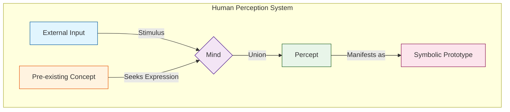
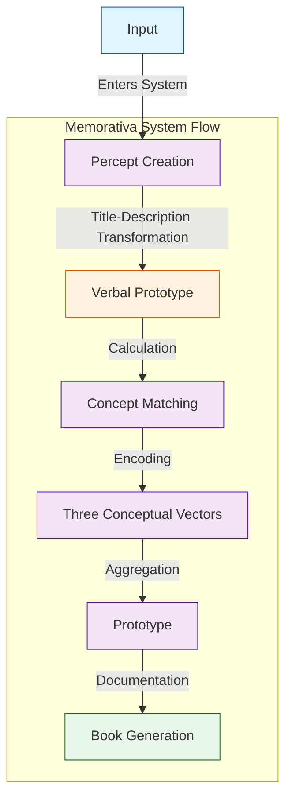
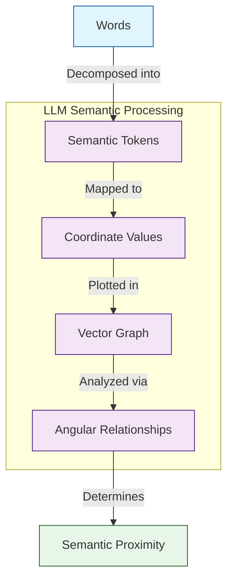
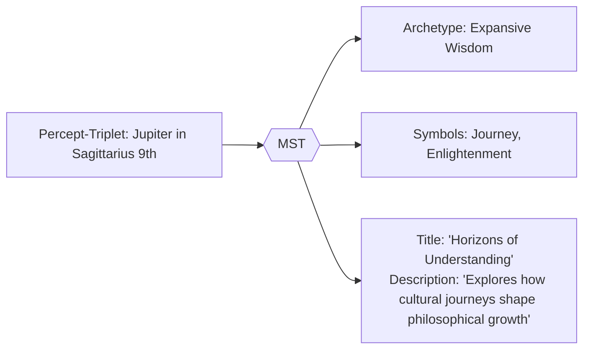
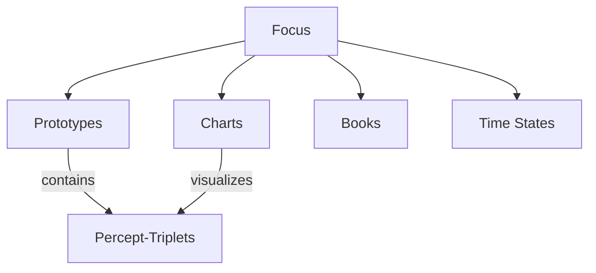
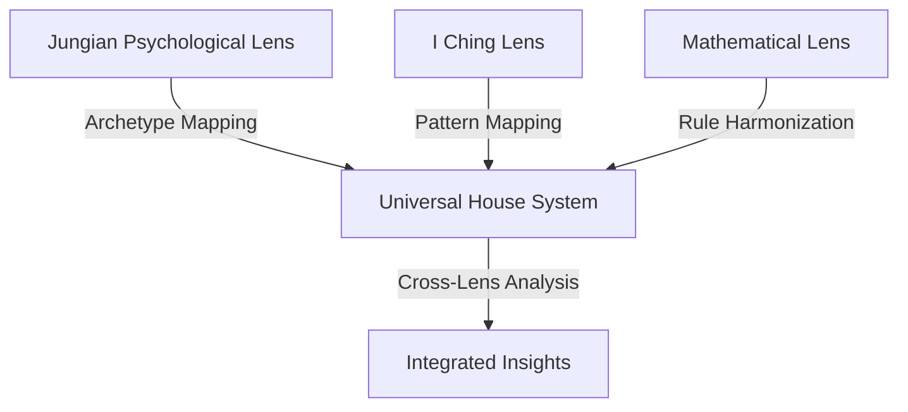
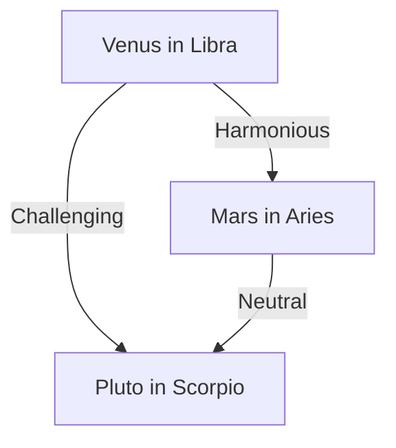

# Memorativa

**Memorativa** is the name of the system described in this document. Memorativa is designed to cultivate an "internal cosmos" of perceptions and concepts. The system acts as a remedial trend towards human thinking and a hygienic force in the culture. 

To implement the system, Memorativa relies on large language models (LLMs), social media, artificial intelligence (AI), and blockchain technologies.

The system uses the raw material of content, liberating it from the social media model of reactive consumption into a conceptual model for reflective creating.

Rather than only model and represent the physical properties of objects, the Memorativa system seeks to model and represent the conceptual properties of perceptions with prototypes.

Assume that concepts occupy a pre-linguistic meta-position in relation to words, signs, and symbols, in that concepts cannot be directly apprehended nor do they directly give expression, operating in a way that an archetype finds expression in prototype, and where one prototype is always the most exemplar as a representative for the concept. In this model, the stimulus for conceptual activity is the intake of sensory input (or non-sensory input, such as a dream or idea) through a focus of attention. Once focused, the input is now on the way to percept by way of union with an encapsulating concept. Once conceptualized, the percept finds symbolic form and expression as the perceptual prototype for the concept, standing in for the object of perception after the perceiver has lost the focus of its initial input.

The Memorativa system can be defined as:

- Input goes into the system to create the percept
- The system calculates an encapsulating concept for the percept
- The percept is encoded using three conceptual vectors
- The prototype encodes multiple percepts into a data structure that represents the concept of the percept
- The system writes a book about the concept

Take for example an apple. A traditional machine learning (ML) system using LLMs can easily decompose "apple" into many sophisticated ontological vectors. For example:

- Grammatical element: noun
- Physical size: fits in a human hand
- Color: probably red, could be green
- What is it?: Fruit of an apple tree containing seeds
- Why is it important?: Humans and other animals eat apples
- Cultural references: Johnny Appleseed
- Symbolic meaning: multiple depending human interpretation

LLMs rely upon the decomposition of words into semantic tokens that are given coordinate values. The coordinate values are determined by mapping sequential identifiers to keywords in a data dictionary. The position of the tokens in a vector graph results in the distribution of tokens within a vector space. The angular relationship of vectors can be used to infer conceptual analogy. The closer two vectors, the closer their semantic meaning to the other. When dealing with more conceptual, abstract topics, the number of vectors required to discover angular relationships results in a tendency towards perpendicular angular relationships between all vectors.

(Note that this explanation simplifies the actual process. LLM models don't necessarily map words directly to tokens, but instead decompose language into meaning units that may include words, parts of words, spaces, symbols, etc.)

The symbolic vector is important for representing perceptions because the human mind seeks to unite each input with a concept. Without an enjoining concept, perception fails. Symbols, which indirectly but precisely convey meaning, are used by humans to best represent concepts. In human perception, the input does not form the concept, rather, concepts exist in humans beyond the grasp of human language, seeking to express a form based on the stimulus of an input to which it unites. The union of input with concept results in the percept, the form of which is the symbolic representation of the concept.

A mythologically / symbolically themed AI/RAG (Retrieval-Augmented Generation) model could process and categorize inputs (e.g., images, titles, descriptions) by leveraging multi-modal analysis and symbolic pattern recognition. Conceptual analysis could then be added to the RAG model as a way of human feedback tuning and model refinement.

The goal of the Memorativa system is to use a small set of conceptual vectors that use a culturally encoded symbolic dictionary already embedded in English language LLM training data sets. These sets can be efficiently extended with the use of (RAG) systems to incorporate mythological / symbolic reference libraries. By focusing on the efficient encoding of the conceptual categorization of percepts, Memorativa seeks to solve for the problem of perpendicular angular relationships in vector space conceptual analysis.

Memorativa could be used by humans to help visualize and extend concepts and conceptual thinking, while machines could use Memorativa to better and more efficiently infer and conceptualize input.

By repurposing mythological structures as topological markers in AI vector space, the system seeks to demonstrate conceptual integrity without requiring a belief in its mechanisms, philosophy, or approach. 

## Percept-triplet

In the Memorativa model, human perception can be conceptually categorized according to three conceptual vectors, called the **percept-triplet**:

- **What**: the archetype - *the archetype vector*
- **How**: the form of expression of the archetype - *the expression vector*
- **Where**: the form of expression of the archetype in the conceptual field of activity - *the mundane vector*

Additionally, each percept-triplet has an identifying **title** and description to distinguish it from it's archetype vector (the what). The title/distinction pair serves as a distinct, compact, verbal prototype for the structure.

Each of these conceptual correlations originate from an observer that has a certain cosmological orientation, that is, of an perceiver of objects in time and space on Earth.

Percept-triplets can be applied to humans, things, and events to calculate encapsulating concepts. Keywords can be used as identifiers to correlate percepts to a data dictionary of concepts.

Western mythology and symbology provide prototypes that are encoded into the English language and culture (which is of concern to large language models and other semantic processors) and that can serve as the "data dictionary" for percept encoding.

## Percept-triplet vector 1: archetype

The **archetype vector** is defined as:

- Outside the bounds of conceptualization
- An active force and dynamic principle
- Something that can be represented by prototypes
- A conceptual goal and a kind of center of conceptual gravity for prototypes
- Universal and consistent 

Memorativa uses archetypes as the "What" vector, and specifically Western prototypes of archetypes. In Memorativa, prototypes act as the representation of the input enjoined with a concept. The more closely a prototype "gravitates" towards the conceptual field of the archetype, the more clearly the prototype expresses the encapsulating concept of the percept.

**Planets**, with their centers of gravity and symbolic potency, provide the core prototypes for the archetypal "what" vector of the percept-triplets.

These are prototypical classical Planets of Western mythology, with some conceptual correlations:

- **Sun ☉**: Identity, vitality, consciousness, purpose
- **Moon ☽**: Emotions, instincts, nurturing, cycles
- **Mercury ☿**: Communication, learning, analysis, connection
- **Venus ♀**: Values, relationships, harmony, attraction
- **Mars ♂**: Action, drive, assertion, energy
- **Jupiter ♃**: Expansion, wisdom, growth, opportunity
- **Saturn ♄**: Structure, limitation, responsibility, time

These are the prototypical modern Planets, with some conceptual correlations:

- **Uranus ♅**: Innovation, freedom, disruption, awakening
- **Neptune ♆**: Spirituality, dissolution, imagination, unity
- **Pluto ♇**: Transformation, power, depth, regeneration

Each of these conceptual correlations are multivariate depending on if the percept is something personal, mundane, or itself conceptual. Thus "Sun" can be used to conceptually categorize people, events, or things. Different kinds of conceptual temporal states are also encoded into the planetary archetypes.

## Percept-triplet vector 2: expression

The **expression vector** represents the form and expression of the archetype (the "How" vector) and is defined by:

- One of twelve symbols that modify the Planet archetypal force
- A representation of style, tone, and modality for the archetype
- The expression and manifestation of the archetype
- Determines how force is channeled

In keeping with an analogous structure to represent the different kinds of modalities and expressions of a Planet, the Western mythological classification of the constellations demarcating the ecliptic, the **Zodiac Signs**, serve as the twelve primary symbols of the "How" vector. According to the established mythology, each Zodiacal Sign has a "ruling" Planet that encodes a further vector of conceptual significance. In the case of the conceptual correlations for Signs, the vector particularly relates to the observer's understanding of the nature of the percept as an expression of the archetype.

Signs provide many additional correlated conceptual vectors, such as body parts, plants and minerals, month of the year, ruling Planet, etc.

| **Sign**                          |  **Modes**                |
|-----------------------------------|---------------------------|
| **♈ Aries, The Ram**              |  Energetic                |
| **♉ Taurus, The Bull**            |  Reliable                 |
| **♊ Gemini, The Twins**           |  Expressive               |
| **♋ Cancer, The Crab**            |  Protective               |
| **♌ Leo, The Lion**               |  Dramatic                 |
| **♍ Virgo, The Virgin**           |  Analytical               |
| **♎ Libra, The Scales**           |  Harmonious               |
| **♏ Scorpio, The Scorpion**       |  Intense                  |
| **♐ Sagittarius, The Archer**     |  Philosophical            |
| **♑ Capricorn, The Sea-Goat**     |  Practical                |
| **♒ Aquarius, The Water Bearer**  |  Inventive                 |
| **♓ Pisces, The Fish**            |  Artistic                 |

## Percept-triplet vector 3: mundane

The **mundane vector** (the "Where") is the area of reality where the archetypal form of expression manifests, and is defined by:

- One of 12 areas called Houses
- The operational zone of activity for the percept
- Correlations to cycles, times, phases, and durations of human observed events
- Grounds symbolism in tangible reality, reflecting where energies manifest most visibly

Houses are categorized in Western astrology as follows:

| **House**                                |  **Area**                 |
|------------------------------------------|---------------------------|
|  **1st: The Ascendant**                  |  Identity                 |
|  **2nd: The House of Value**             |  Resources                |
|  **3rd: The House of Communication**     |  Learning                 |
|  **4th: The Nadir/IC**                   |  Home                     |
|  **5th: The House of Pleasure**          |  Creativity               |
|  **6th: The House of Service**           |  Routine                  |
|  **7th: The Descendant**                 |  Relationships            |
|  **8th: The House of Transformation**    |  Shared resources         |
|  **9th: The House of Philosophy**        |  Beliefs                  |
|  **10th: The Midheaven/MC**              |  Authority                |
|  **11th: The House of Friendship**       |  Groups                   |
|  **12th: The House of the Unconscious**  |  Hidden matters           |

## Percept-triplet title-description pair

Since the input has been decomposed into a set of percept-triplets vectors, it is important that each vector has a unique, identifying **title/description pair** that distinguishes the input from archetype as a verbal prototype. Each pair is derived from the initial input's title and description values, but transformed by the percept-triplet calculation into a more specific variation of the input. This transformation happens at the end of the prototype construction and is performed by the Memorativa system. The Memorativa system also transforms the text from the terms and language of astrology into more broadly understood symbols and language to ensure that the title-description pair is less constrained and more universal.

## Symbolic Translation System (MST)  

The **Memorativa Symbolic Translator (MST)** converts astrologically encoded percept-triplets into universal symbolic language while preserving conceptual relationships. This enables non-astrological analysis of prototypes and percepts. The MST leverages **generative AI** to create dynamic narratives, visualizations, and analyses based on the percept-triplets and prototypes.

#### Key Functions  

1. **Archetype Abstraction**  
   - Translates planetary positions → universal concepts (Saturn → "Boundaries")  
   - Converts astrological houses → conceptual domains (4th House → "Rootedness")  
   - Uses **generative AI** to create contextually rich descriptions of archetypes and their relationships.

2. **Cross-Cultural Mapping**  
   - Identifies equivalent symbols across traditions (Mercury ≈ Hermes ≈ Thoth)  
   - Ensures cultural neutrality in title-description pairs  
   - Leverages **generative AI** to generate cross-cultural narratives and analyses.

3. **Contextual Bridging**  
   - Maintains semantic relationships between original and translated elements  
   - Example: "Moon in Cancer 4th" → "Nurturing Foundations"  
   - Uses **generative AI** to create dynamic narratives that bridge symbolic and conceptual contexts.

### Implementation  

- **Architecture**: Hybrid system combining:  
  - Fine-tuned LLM (cultural/archetypal knowledge)  
  - Symbolic pattern matcher (mythological cross-references)  
- **Training Data**:  
  - 42 cultural traditions' symbol systems  
  - 650k+ archetype-prototype pairings  
- **Output Rules**:  
  - Strict prohibition of astrological terms  
  - Mandatory grounding in 3+ cultural references  

### Workflow Example  

## Example encoding of an input using the percept-triplet method

In this example, the Memorativa percept-triplet method is used to conceptualize an input. The output is a Planet expressed in a Sign manifested in a House.

Define an **input** as:

- URL
- Title
- Description

For example:

- "URL": "link to a photo of an apple"
- "title": "Eve's temptation"
- "description": "The apple in mythology"
  
Here the input is not simply an object (the apple), but a perception of the object conditioned by the observer's state and context, as reflected in the title and description.

Here's a hypothetical percept-triplet structure, mapping the apple input to a single archetype:

- **Planet**: Venus
- **Sign**: Libra
- **House**: 9th

The conceptual **book** written by the system includes the structure and an analysis.

Here's a hypothetical analysis of the derived percept-triplet structure:

- The structure encapsulates the apple as a symbol of temptation (Venus), expressed through the duality of choice (Libra). The 9th House places the apple within a mythological framework.

Here's a hypothetical justification for the structure:

- The apple as a symbol of temptation aligns with Venusian themes of desire, beauty, and value.

- Venus in Libra emphasizes the duality of choice (Eve's decision) and the balance between innocence and knowledge.

- The 9th House dominance places the apple within the realm of mythology, belief systems, and philosophical inquiry.

- The title and description from the input are transformed into:

  - **Title**: "Ethical Choices in Cultural Narratives"  
  - **Description**: "Examines how societies negotiate the balance between knowledge acquisition and moral boundaries through symbolic representations"

## Prototype

In Memorativa, the **prototype** is a structure that is represented with multiple percept-triplets in multiple perceptional vectors. Each vector maps to an archetype represented by a planet, with the **Sun** serving as the central representation of the prototype and the orbiting **planets** representing the different conceptual vectors of the percept. Memorativa uses the **MST** to ensure the prototype is symbolically universalized. In short, the prototype is the best representative of the concept united with the percept. When the system needs to "talk about" or represent concepts (which by definition are pre-linguistic), the prototype is the symbolic representative and token.

Here's the structure of prototype, using a central Sun percept-triplet as the organizing representative perception and the remaining percept-triplets representing various related representations of the perception.

| **Component**         | **Description**                                                                 |
|------------------------|---------------------------------------------------------------------------------|
| **Prototype**          | Best representative of the concept united with the percept                     |
| **Sun Percept-Triplet**| Primary organizing representation of the concept                               |
| **Planet Vectors**     | Percept-triplets representing different facets of the concept                   |
| **Archetypes**         | Symbolic meanings associated with each planet                                   |
| **Symbolic Token**     | Unified representation derived from title-description pairs                    |

## Visualizing the prototype in vector space

To summarize, the percept-triplet is calculated based on three vectors:

- **What**, archetypes, *Planets*
- **How**, expression of archetypes, *Signs*
- **Where**, area of expression of archetypes, *Houses*

A circular chart will encode the prototype into a conceptual space, with MST-translated title-description pairs displayed as contextual labels.

Key visualization elements:
- Planetary positions retain their astrological coordinates (Sign/House) for vector calculations
- MST-generated title-description pairs appear as primary labels
- Aspect interpretations use universalized concepts from the pairs

Create a circle and bisect it horizontally with a straight line to represent the Earth's horizon. 

Bisect the circle vertically with a straight line to represent North at the top and South at the bottom. Call the north node Midheaven and the south node Nadir. Call the east node Ascendant and the west node Descendant.

Let the left intersection of the horizon with the circle represent East and the right intersection of the horizon with the circle represent West.

Demarcate the outer perimeter of the chart into twelve sections represented by Signs.

Demarcate the inner perimeter of the chart into twelve sections represented by Houses.

The chart can now place the planets into a spatial relationship with the houses and signs to form a prototype of percept-triplets in conceptual space.

The chart is called a **horoscope**, and is the structure used by astrology to show the placement of the planets in the sky based on a given time, date, and location. Horoscopes are typically used to calculate the placement of the planets in the sky at the time of birth for a person, which is called the **natal chart**. Astrology also calculates horoscope charts for events in the world (**mundane astrology**) or the daily transits of planets in the sky.

For any given horoscope, planets can form angular relationships (called **aspects**) to:

- each other
- house placements
- the Ascendant or other nodes

List of major aspects:

| Aspect | Angle | Symbol | Nature | Description |
|--------|--------|---------|---------|-------------|
| Conjunction | 0° | ☌ | Major | Planets occupy same position; vectors blend and intensify |
| Opposition | 180° | ☍ | Major | Planets face each other; creates tension and awareness |
| Trine | 120° | △ | Major | Harmonious flow of vectors; brings ease and opportunity |
| Square | 90° | □ | Major | Creates tension and challenges; catalyst for growth |
| Sextile | 60° | ⚹ | Major | Favorable opportunities; requires initiative |

List of minor aspects:

| Aspect | Angle | Symbol | Nature | Description |
|--------|--------|---------|---------|-------------|
| Semi-Sextile | 30° | ⚺ | Minor | Subtle connection; slight tension |
| Semi-Square | 45° | ∠ | Minor | Minor irritation or internal tension |
| Quintile | 72° | Q | Minor | Creative and talented expression |
| Bi-Quintile | 144° | bQ | Minor | Unique gifts and abilities |
| Quincunx | 150° | ⚻ | Minor | Adjustment and adaptation required |

The Memorativa model uses the major and minor aspects as symbolic validators for the mapping of percepts to concepts and the forming of conceptual relationships.

To reduce complexity, the system groups aspects into broad categories:

- **Harmonious**: Trine (120°), Sextile (60°).
- **Challenging**: Square (90°), Opposition (180°).
- **Neutral**: Conjunction (0°), Quincunx (150°).

This approach allows users to analyze relationships at a higher level of abstraction, without needing to calculate exact degrees.

For any given day, a mundane chart shows the placement of planets in houses and signs and their angular relationships, indicating symbolic relationships between archetypes conditioned by house and sign placement (the percept-triplet structure).

To discover the relationship between an individual and the world (or another individual), two charts can be superimposed and the angular relationships discovered between them. For example, a natal chart can be superimposed with a daily transit chart to interpret the archetypal patterns for a given individual on a given day. In this case, the transiting planets can form angular relationships with the planets in the individual's natal chart. Astrologers can use a natal chart as a canonical reference and representation for the individual, as it will encode the same birth sky chart into each chart's angular relationship analysis. In this way, the natal chart serves an analogous role as the reference beam in the construction of a hologram, maintaining a consistent resonant template across time periods.

Where astrology typically uses horoscopes to calculate the placement of the actual planets in the sky for an actual person, object, or event, Memorativa uses horoscopes to calculate the placement of imaginary planets in a conceptual space based on human perceptions which may or may not be of objects on Earth in space and time (e.g. apples, memories of apples, dreams of apples, reflections of apples). These **imaginaries** (planets and spaces) are structures generated by the union of percepts with concepts inside the imaginary space of the human mind. As such, they do not require time vectors.

Just like real planets, real objects, and real events, imaginaries can be shown on a horoscope chart and their angular relationships discovered. Without time vectors, the placement of planets cannot be calculated to any degree placement, only placement *in* a house and sign. If the time vector is known, then the a value of 0 - 29 degrees can be calculated for the exact placement of the planet in the sign.  

## Conceptual time states

Percept-triplets do not require a time vector to successfully encode a percept + concept into a prototype, but a time vector can be added to the percept-triplet to represent conceptual time states:

- **Mundane time state**: a past or future timestamp that relates to the percept, such as the time and date the percept was added to the system, or the date referenced by the content of the percept, or an imagined future date related to an imagined future event
- **Quantum time state**: a conceptual state of indeterminate or no time, or immeasurable present time
- **Holographic time state**: a conceptual time state paired with a percept that is attuned to a reference time, such as a natal chart

## Probabilistic Encoding of Percept-Triplets

To reduce complexity, the system uses **probabilistic distributions** to encode conceptual relationships between percept-triplets. Each percept-triplet is represented as a **probability cloud**, indicating the likelihood of certain relationships or interactions. This approach allows users to explore potential connections without requiring precise angular measurements.

#### Example:

- **Percept-Triplet A**: Venus in Libra (Probability Cloud: 60% harmonious, 30% challenging, 10% neutral).
- **Percept-Triplet B**: Mars in Aries (Probability Cloud: 40% harmonious, 50% challenging, 10% neutral).
- **Relationship**: The system calculates the probability of a harmonious interaction between Percept-Triplet A and B as 24% (60% * 40%).

## Encoded percept-triplet vectors + time states

The **percept-triplet model** with the addition of **conceptual time state vectors** expands the encoding to include temporal dimensions.

With the addition of the conceptual time vector to a percept-triplet, the concept can be placed exactly in time and space on the chart. One example of a time vector is using the time-date stamp of the entry of the input to the Memorativa system (capturing a mundane time state).

Without the time state vector, the percept-triplet remains in an indefinite *quantum state*. The quantum time state enables the "tuning" of the placement of the imaginary planet by opportunistically calculating its placement based on potential angular relationships with other planets or nodes.

Holographic time states connect superimposed charts across time states (past to past, past to future, past to conceptual, conceptual to conceptual, etc.) by using a reference chart against one or more superimposed charts. The reference chart becomes useful when superimposed charts that have no time vector and hence no actual degree location can be "tuned" to find a related, instantiated location with a degree.

### Conceptual time state vectors

| **Time State**          | **Description**                                                                 | **Example**                                                                 |
|--------------------------|---------------------------------------------------------------------------------|-----------------------------------------------------------------------------|
| **Mundane Time State**   | Represents a specific timestamp (past or future) related to the concept        | The time and date the percept was added to the system, or the date referenced by the content of the percept |
| **Quantum Time State**   | Represents an indeterminate or immeasurable present time                       | A concept that exists outside of linear time, such as a memory or dream     |
| **Holographic Time State** | Represents a conceptual time state attuned to a reference time (e.g., a natal chart) | Superimposing a natal chart with a transit chart to analyze daily events in reference to personal meaning |

The **percept-triplet model** with **conceptual time state vectors** encodes **6 primary vectors** (3 percept-triplet + 3 time state) and **hundreds of sub-vectors** when considering the multiple correlations, modes, domains, and temporal dimensions within each primary vector. The exact number depends on the depth of analysis for each planet, sign, house, and time state.

In the context of the structure of the prototype, it is possible for each percept-triplet to have the same or different conceptual time states.

The Memorativa temporal state model allows for richer temporal and conceptual analysis, enabling the system to encode percepts with both spatial and temporal dimensions.

## The use of superimposed charts

Superimposed charts in Memorativa involve overlaying multiple horoscope-like charts to analyze relationships between different percepts or concepts. This technique draws from astrological practices like synastry and transit analysis but applies them to conceptual rather than celestial data. Each chart represents a percept or concept encoded as a set of percept-triplets (Planet-Sign-House). By superimposing charts, the system can examine angular relationships (aspects) between these percept-triplets to infer conceptual connections:

- **Angular Relationships**: Uses aspects (conjunction, opposition, trine, etc.) to analyze conceptual proximity and interaction  
- **Time Flexibility**: Can operate with or without time vectors, allowing for both precise and symbolic analysis  
- **Multi-Chart Analysis**: Enables comparison of multiple percepts or concepts simultaneously  

| **Use Case**                  | **Description**                                                                 |
|-------------------------------|---------------------------------------------------------------------------------|
| **Conceptual Relationship Mapping** | Compare individual perceptions to identify common themes or conflicts. Analyze how different ideas interact within a larger system. |
| **Temporal Analysis**         | Track the evolution of a concept over time by comparing charts from different periods. Examine how past events influence current perceptions. |
| **Event Analysis**            | Study the conceptual relationships between significant events. Identify underlying themes or patterns in a series of events. |
| **Individual vs. Collective Analysis** | Compare personal perceptions with collective or cultural concepts. Explore how individual ideas relate to broader societal narratives. |
| **Cross-Domain Connections**  | Analyze relationships between concepts from different domains (e.g., art, science, mythology). Identify symbolic parallels or conceptual bridges. |

**Example Applications**  

- **Personal Growth**: Superimpose current "Self-Identity Framework" with past "Childhood Influence Matrix"  
- **Cultural Analysis**: Compare "Eastern Creation Myths" vs. "Western Origin Stories" prototypes  
- **Event Analysis**: Study "Technological Disruption" relationships through title-description aspects  

## Focus spaces

The Memorativa **focus space** serves as a conceptual workspace for organizing and interacting with percepts and prototypes.

### Structural definition

A focus space acts as:

- **Conceptual lens**: Filters prototypes through title-description pairs and percept-triplet configurations
- **Temporal scaffold**: Maintains time state vectors (mundane/
quantum/holographic) for chart comparisons
- **Verbal scaffold**: Maintains universalized title-description pairs across temporal states
- **Relational matrix**: Stores angular relationships between title-description pairs using aspects

### Core features

**1. Title-description pair**

- Generated from the MST
- Aggregated conceptual representative for the focus
- Calculated based on the structural components of the focus space

**1. Multi-chart interface**

- Hosts up to 12 active charts (mirroring zodiacal structure)
- Enables superimposition with aspect lines showing conceptual relationships
- Example: Compare Eve's apple prototype with Newton's gravity apple using opposition aspects (180°)

**2. State preservation**

- Saves: 

  - Chart configurations
  - Aspect filters
  - Temporal alignment settings
  - Prototype priority weights

**3. Search & filter matrix**
| **Filter Type** | **Parameters**              | **Example Use**                              |
|-----------------|-----------------------------|-----------------------------------------------|
| Archetypal      | Title-Description Keywords | Find all "Ethical Dilemma" prototypes         |
| Temporal        | Time State + Title Pattern  | Compare "Forbidden Knowledge" across eras    |
| Aspectual       | Angular Range + Verbal Tags | Show prototypes with "Tension" relationships  |

### Operational model

**Focus Layers**

1. **Core Anchor**: Primary title-description pair (e.g., "Ethical Choices in Cultural Narratives")
2. **Secondary Anchors**: Related title-description pairs within 30° celestial longitude
3. **Aspect Network**: Connections between verbal prototypes using angular relationships

####  Temporal Integration

- Aligns multiple time states through:

  - Mundane timelines (linear progression)
  - Holographic superimposition (natal chart as reference)
  - Quantum probability clouds (potential relationships)

### Lenses

The **Lenses** system in Memorativa provides a modular framework for analyzing and interpreting percepts through diverse cultural, philosophical, and scientific paradigms. Each lens offers a unique perspective, enabling users to explore concepts with varying degrees of abstraction, cultural specificity, and symbolic depth. The system is designed to be **culturally inclusive**, **modular**, and **interoperable**, allowing for seamless integration of multiple lenses into a unified analysis.

#### 1. **Core Structure**

The Astrological Lens is the primary core lens used to form the percept-triplet and prototype structures. All other lenses are applied as transformations of this core structure. The Astrological Lens provides the foundational framework for encoding percepts into Planet-Sign-House combinations and analyzing their angular relationships (aspects).

Each lens consists of:

- **Archetypes**: Universal symbols or concepts (e.g., Hero, Trickster, Sun, Moon).
- **Symbols**: Cultural-specific representations (e.g., Hexagrams, Tarot Cards, Chakras).
- **Patterns**: Temporal, spatial, or cyclical structures (e.g., seasons, cycles, geometric forms).
- **Rules**: Logical, mathematical, or symbolic frameworks (e.g., I Ching transformations, Tarot spreads, Kabbalistic paths).

#### 2. **Lens Types**

Memorativa supports a wide range of lenses, including but not limited to:
- **Cultural Lenses**: I Ching, Tarot, Kabbalah, Vedic, Greek, etc.
- **Philosophical Lenses**: Hermetic, Jungian, Greek, etc.
- **Scientific Lenses**: Mathematical, Quantum, Thermodynamic, etc.
- **Mythological Lenses**: World Mythologies, Hero Journeys, etc.

#### 3. **Cross-Lens Integration**

The **Symbolic Lens System** enables cross-lens analysis through:
- **Cross-Lens Mapping**: Translates concepts between lenses (e.g., mapping Tarot's Major Arcana to Kabbalah's Sephiroth).
- **Pattern Synthesis**: Combines patterns from multiple lenses to identify universal insights (e.g., cyclical patterns in I Ching and astrological transits).
- **Rule Harmonization**: Resolves conflicts between lens rules, ensuring consistent analysis (e.g., reconciling Hermetic principles with Jungian archetypes).

#### 4. **Pattern Recognition**

The system identifies and analyzes patterns across lenses, including:
- **Cross-Cultural Patterns**: Archetype correspondences, symbolic resonances, temporal cycles, spatial arrangements.
- **Universal Patterns**: Mathematical symmetries, quantum states, thermodynamic cycles, evolutionary dynamics.

#### 5. **House Integration**

Each lens maps its symbolic structures to the **Universal House System**, which provides a common framework for analysis:
- **Identity (First House)**: Archetypes like the Hero (Jungian), The Magician (Tarot), or Aries (Astrology).
- **Resources (Second House)**: Symbols like The High Priestess (Tarot), Taurus (Astrology), or Earth (I Ching).
- **Communication (Third House)**: Patterns like Gemini (Astrology), The Empress (Tarot), or Thunder (I Ching).
- **Foundations (Fourth House)**: Rules like The Emperor (Tarot), Cancer (Astrology), or Water (I Ching).

#### 6. **Symbolic Correspondences**

The system establishes symbolic correspondences between lenses, enabling deeper analysis:
- **Archetype Mapping**: Hero (First House), Trickster (Seventh House), Wise Old Man (Ninth House).
- **Symbol Mapping**: Hexagrams (I Ching), Tarot Cards (Western Esoteric), Sephiroth (Kabbalah), Chakras (Vedic).
- **Pattern Mapping**: Cyclical (I Ching, Cycle Theory), Spatial (Sacred Geometry, Feng Shui), Temporal (Astrology, Historical Analysis).

#### 7. **Example Use Case**

A user could analyze a personal experience using the **Jungian Psychological Lens** to identify archetypal patterns, then switch to the **I Ching Lens** to understand cyclical changes, and finally use the **Mathematical Lens** to quantify the relationships between these patterns. The **Symbolic Lens System** would integrate these analyses, providing a comprehensive, cross-cultural understanding of the experience.

#### 8. **Technical Implementation**

- **Cross-Lens Mapping Engine**: Translates concepts between lenses, ensuring compatibility and coherence.
- **Pattern Synthesis Algorithm**: Combines patterns from multiple lenses, identifying universal or cross-cultural insights.
- **Rule Harmonization System**: Resolves conflicts between the rules of different lenses, ensuring consistent analysis.

#### 9. **Benefits**

- **Cultural Inclusivity**: The system can incorporate symbols and patterns from any cultural or philosophical tradition.
- **Enhanced Pattern Recognition**: By analyzing patterns across multiple lenses, the system can identify deeper, more universal insights.
- **Customizability**: Users can tailor the system to their specific needs, adding or removing lenses as required.

#### 10. **Visualization**

The system provides visual representations of lens integrations, such as:

- **Horoscope Charts**: Displaying percept-triplet placements with MST-translated labels.
- **Aspect Networks**: Graphs showing connections between title-description pairs based on angular relationships.
- **Temporal Overlays**: Superimposed charts to analyze changes over time or relationships between different concepts.

#### Example Lens Integration

**Lenses** are integrated into the **Focus Space** as a core feature, acting as a **conceptual filter** that shapes how percepts, prototypes, and relationships are analyzed and interpreted.

### **Lens Integration in Focus Space**

The Focus Space acts as a conceptual workspace, and Lenses provide the perspective through which the content is viewed. Each Focus Space can have one or more active Lenses, allowing users to switch between or combine different symbolic frameworks. The Astrological Lens serves as the core primary lens, forming the foundational structure for percept-triplets and prototypes. All other Lenses are applied as transformations of this core structure, enabling cross-cultural and cross-disciplinary analysis.

#### **Structural Integration**

- **Core Astrological Lens**: The primary lens used to encode percepts into Planet-Sign-House combinations and analyze their angular relationships (aspects). All other Lenses build upon this foundational structure.
- **Lens Selection**: Users can choose from a library of Lenses (e.g., I Ching, Tarot, Jungian, Mathematical) to apply to the Focus Space.
- **Lens Stacking**: Multiple Lenses can be layered to create a **composite view**, enabling cross-lens analysis.
- **Lens Customization**: Users can modify or create new Lenses by defining custom archetypes, symbols, patterns, and rules.

#### **Functional Integration**

- **Percept-Triplet Encoding**: The Astrological Lens encodes percepts into Planet-Sign-House combinations. Other Lenses transform this structure into their own symbolic frameworks. For example:

  - In the **I Ching Lens**, a percept might be mapped to a Hexagram and its associated trigrams.
  - In the **Tarot Lens**, a percept might be associated with a Major Arcana card and its elemental dignities.
- **Prototype Formation**: The Astrological Lens forms the core structure of prototypes, with other Lenses adding additional layers of interpretation. For example:

  - In the **Jungian Lens**, a prototype might center around archetypes like the Hero or Shadow.
  - In the **Mathematical Lens**, a prototype might be represented as a graph or equation.

- **Aspect Analysis**: The Astrological Lens defines angular relationships (aspects), which other Lenses interpret through their own symbolic frameworks. For example:

  - In the **Astrological Lens**, a square (90°) might signify tension or challenge.
  - In the **Hermetic Lens**, the same aspect might represent a polarity to be harmonized.

### **Lens Application in Focus Space Features**
Lenses can be applied to specific features of the Focus Space to enhance their functionality:

#### **A. Multi-Chart Interface**

- **Core Astrological Charts**: The primary visual representation of percept-triplet placements, using Planet-Sign-House combinations and aspect lines.
- **Lens-Specific Charts**: Each Lens can generate its own visual representation of the chart (e.g., a horoscope for Astrology, a Tree of Life for Kabbalah).
- **Cross-Lens Superimposition**: Charts from different Lenses can be overlaid to identify cross-cultural or cross-disciplinary patterns.

#### **B. Search & Filter Matrix**

- **Lens-Specific Filters**: Users can filter percepts and prototypes based on Lens-specific attributes (e.g., Hexagrams in I Ching, Sephiroth in Kabbalah).
- **Cross-Lens Search**: Search for patterns that appear across multiple Lenses (e.g., cyclical patterns in I Ching and astrological transits).

#### **C. Temporal Integration**

- **Lens-Specific Time States**: Lenses can interpret time states differently. For example:
  - In the **I Ching Lens**, time might be represented as cyclical changes (e.g., seasons, hexagram transitions).
  - In the **Quantum Lens**, time might be represented as a probability cloud or superposition of states.
- **Cross-Lens Temporal Analysis**: Compare how different Lenses interpret the same temporal event or pattern.

#### **D. Narrative Layer**

This layer provides interpretative content, shaped by the active Lenses and enhanced by **generative AI** to create dynamic and personalized narratives. The **generative AI** analyzes percept-triplets, prototypes, and symbolic relationships to generate contextually rich and engaging narratives.

#### Features:
1. **Dynamic Narratives**: The **generative AI** creates personalized narratives based on the percept-triplets and prototypes, incorporating insights from the active Lenses.
2. **Analytical Commentary**: Explains symbolic relationships using MST-translated concepts, filtered through the active Lenses and enhanced by **generative AI**.
3. **Personalized Outputs**: The **generative AI** tailors the narrative to the user's preferences, interests, and goals, creating a more engaging and relevant experience.

#### Example:
- **Input**: Venus in Libra in the 9th House.
- **Narrative**: "The tension between Harmonious Values and Transformative Depths highlights societal negotiations between stability and change. This dynamic is explored through the lens of cultural narratives, where ethical dilemmas are often framed as choices between tradition and progress."

### **Visualization**
The Focus Space can visualize Lens integrations through:

- **Core Astrological Charts**: Displaying percept-triplet placements with Planet-Sign-House labels.
- **Lens-Specific Charts**: Displaying percept-triplet placements with Lens-specific labels (e.g., Hexagrams, Tarot Cards).
- **Aspect Networks**: Graphs showing connections between title-description pairs based on Lens-specific angular relationships.
- **Temporal Overlays**: Superimposed charts to analyze changes over time or relationships between different concepts.

### **Benefits of Lens Integration in Focus Space**

- **Flexibility**: Users can switch between Lenses to explore different perspectives on the same data.
- **Depth**: Combining Lenses enables richer, more nuanced analysis by identifying cross-cultural or cross-disciplinary patterns.
- **Customization**: Users can tailor the Focus Space to their specific needs by selecting or creating Lenses that align with their interests or goals.

### 6. **Technical Considerations**

- **Lens Mapping Engine**: A computational engine that translates percepts, prototypes, and aspects between Lenses.
- **Pattern Synthesis Algorithm**: Combines patterns from multiple lenses to identify universal insights.
- **Rule Harmonization System**: Resolves conflicts between the rules of different Lenses, ensuring consistent analysis.

By integrating Lenses into the Focus Space, Memorativa becomes a truly universal framework, capable of analyzing and interpreting percepts through diverse cultural, philosophical, and scientific paradigms. The Astrological Lens remains the core primary lens, with all other lenses applied as transformations of this foundational structure. This integration enhances the system's flexibility, depth, and customizability, enabling users to explore complex concepts from multiple perspectives.

### Generative AI features:

1. **Dynamic Narratives**: The **generative AI** creates personalized narratives based on the percept-triplets and prototypes, incorporating insights from the active Lenses.
2. **Interactive Visualizations**: The **generative AI** creates interactive charts, graphs, and overlays that update in real-time based on user inputs and active Lenses.
3. **Personalized Outputs**: The **generative AI** tailors the outputs to the user’s preferences, interests, and goals, creating a more engaging and relevant experience.

## Books

The **Book** serves as a structured repository for aggregating **percept-triplets**, **prototypes**, and their symbolic relationships. It provides a **narrative** or **analytical framework** for understanding the conceptual space. Each Book is generated by the system based on the construction of prototypes in **Focus Spaces**, with **Lenses** significantly influencing the output and organization of the Book. The **narrative layer** of the Book is directly informed by the **Lens system** applied in the Focus Space, ensuring that the analysis and interpretation of percepts and prototypes are shaped by the chosen symbolic frameworks.

### **1. Purpose of the Book**

The **Book** serves as a structured repository for:

- Aggregating percept-triplets and prototypes.
- Organizing symbolic relationships between concepts.
- Providing a narrative or analytical framework for understanding the conceptual space.

Each Book is generated by the system based on the construction of prototypes in Focus Spaces, with Lenses significantly influencing the output and organization of the Book. The narrative layer of the Book is directly informed by the Lens system applied in the Focus Space, ensuring that the analysis and interpretation of percepts and prototypes are shaped by the chosen symbolic frameworks.

Books can accessed via focus space or outside of focus spaces through title/description/topical/lens indexes and searches (just like regular books). 

Books make up the core content of the Memorativa RAG model.

### **2. Structural Components**

The architecture of the Book can be divided into the following layers:

#### **A. Metadata Layer**

This layer stores high-level information about the Book:

- **Title**: The overarching theme or focus of the Book (e.g., "The Cost of Wisdom").
- **Description**: A summary of the Book's purpose and scope.
- **Focus**: The encapsulating conceptual space that derives the Book.
- **Temporal Context**: Time state vectors (mundane, quantum, holographic) relevant to the Book's content.
- **Active Lenses**: The Lenses applied in the Focus Space that shape the Book's narrative and structure.

#### **B. Conceptual Framework Layer**

This layer organizes the core conceptual data:

1. **Percept-Triplets**:

- Encoded as **Planet-Sign-House** combinations by the **Astrological Lens**.
- Transformed into Lens-specific representations (e.g., Hexagrams in I Ching, Major Arcana in Tarot).
- Includes **title-description pairs** for each triplet, generated by the **Memorativa Symbolic Translator (MST)**.
- Example: *Venus in Libra in 9th House* → Title: "Ethical Choices in Cultural Narratives"; Description: "Explores how societies negotiate moral boundaries."

2. **Prototypes**:

   - Centralized around a Sun percept-triplet.
   - Orbital planet vectors represent related percepts.
   - Example: A prototype centered on *Sun in Leo* could include percepts like *Mars in Aries* (action-driven leadership) or *Moon in Cancer* (emotional nurturing).

3. **Symbolic Relationships**:

   - Angular relationships (aspects) between percepts.
   - Example: A square (90° aspect) between *Venus in Libra* and *Pluto in Scorpio* might symbolize tension between harmony and transformation in the **Astrological Lens**, or a polarity to be harmonized in the **Hermetic Lens**.

#### **C. Narrative Layer**

This layer provides interpretative content, shaped by the active Lenses and enhanced by **generative AI** to create dynamic and personalized narratives. The **generative AI** analyzes percept-triplets, prototypes, and symbolic relationships to generate contextually rich and engaging narratives.

#### Features:

1. **Dynamic Narratives**: The **generative AI** creates personalized narratives based on the percept-triplets and prototypes, incorporating insights from the active Lenses.
2. **Analytical Commentary**: Explains symbolic relationships using MST-translated concepts, filtered through the active Lenses and enhanced by **generative AI**.
3. **Personalized Outputs**: The **generative AI** tailors the narrative to the user's preferences, interests, and goals, creating a more engaging and relevant experience.

#### Example:

- **Input**: Venus in Libra in the 9th House.
- **Narrative**: "The tension between Harmonious Values and Transformative Depths highlights societal negotiations between stability and change. This dynamic is explored through the lens of cultural narratives, where ethical dilemmas are often framed as choices between tradition and progress."

#### **D. Visualization Layer**

This layer includes visual representations, influenced by the active Lenses and enhanced by **generative AI** to create dynamic and interactive visualizations. The **generative AI** analyzes percept-triplets, prototypes, and symbolic relationships to generate contextually rich and engaging visualizations.

#### Features:

1. **Dynamic Charts**: The **generative AI** creates interactive horoscope charts that update in real-time based on user inputs and active Lenses.
2. **Aspect Networks**: Graphs showing connections between title-description pairs based on angular relationships, enhanced by **generative AI** to provide dynamic and interactive analysis.
3. **Temporal Overlays**: Superimposed charts to analyze changes over time or relationships between different concepts, enhanced by **generative AI** to create contextually rich and engaging visualizations.

#### Example:

### **3. Data Representation**

The Book's data can be stored in a hierarchical structure:

| Component | Subcomponents |
|----------------------|-----------------------------------------------------------------------------------|
| Metadata | Title, Description, Focus Parameters, Temporal Context, Active Lenses |
| Percept-Triplets | Planet-Sign-House combinations with title-description pairs, transformed by Lenses|
| Prototypes | Sun-centered structures with orbital planet vectors, interpreted through Lenses |
| Symbolic Data | Angular relationships (aspects), MST-translated labels, filtered through Lenses |
| Narrative Content| Chapters/Sections with analytical commentary, shaped by Lenses |
| Visualizations | Horoscope charts, aspect networks, temporal overlays, influenced by Lenses |             |

### **4. Example Book Structure**

#### Title: *"The Cost of Wisdom"*

#### Description: *Exploring archetypes of forbidden knowledge across cultures.*

#### Focus Parameters:

- Archetypes: Venus (desire), Pluto (transformation).
- Aspects: Squares (90°) tagged as "Moral Conflict."
- Time States: Quantum (timeless myths), Mundane (historical events).
- Active Lenses: Astrological Lens, Jungian Psychological Lens, I Ching Lens.

#### Chapters:

1. *Edenic Archetypes*: Analysis of Venus-Pluto dynamics in mythological narratives.
2. *Cultural Transformations*: How societies encode ethical dilemmas symbolically.
3. *Future Implications*: The role of forbidden knowledge in shaping technological ethics, explored through the Astrological Lens.

#### Visualizations:

1. Horoscope chart showing Venus-Pluto square in Libra-Capricorn with Astrological Lens labels.
2. Aspect network linking "Eve's Apple" to "Prometheus' Fire," with Astrological Lens labels.
3. Temporal overlay of cyclical transformations, analyzed through the I Ching Lens.

## Chain-of-thought

In summary, the Memorativa system models the inner, intangible, and in some cases inexpressible world on the "inner cosmos" of perception and thought with data structures that represent the instantiation of these inner intangibles.

### Summary of the model

| **Structure**         | **Meaning**                                                                 | **Function**                                                                 |
|--------------------|-----------------------------------------------------------------------------|------------------------------------------------------------------------------|
| **Focus Space**    | Conceptual workspace organizing prototypes/charts/books with temporal states | Filters perceptions through conceptual lenses, enables multi-chart analysis and aspect-based relationship mapping |
| **Input**         | External or internal stimulus or data that triggers perception             | Acts as the catalyst for conceptual processing, initiating the percept chain |
| **Percept-Triplet**| Structured representation of a concept (Planet-Sign-House + Title-Description) | Encodes perceptions into symbolic vectors for analysis and visualization    |
| **Title-Description Pair** | Universalized verbal representation of a percept-triplet              | Enables conceptual analysis without astrological terminology dependency     |
| **Prototype**     | Archetypal pattern derived from percept-triplets                            | Serves as a reusable model for categorizing and interpreting similar inputs |
| **Book**          | Collection of percept-triplets and prototypes organized around by focus and lens      | The written repository for all perceptions (percept-triplets) and concepts (prototypes) in conceptual space (focus)        |

