# Memorativa: a Cybernetic Perceptual Encoding Model [DRAFT]

February 2025 v.01 

## Abstract  

Memorativa constitutes a cybernetic framework for structured knowledge construction that synthesizes ancient mnemonic traditions with modern computational paradigms. This system reimagines the classical *ars memorativa*[1] through a digital architecture where human cognition and machine intelligence co-evolve via symbolic interaction. At its core, Memorativa implements a triadic perceptual encoding system (archetype/expression/mundane vectors) that bridges conceptual abstraction[2] with contextual grounding, drawing equally from Platonic cosmology[3] and contemporary AI vector space theory[4].  

The architecture operates through recursive feedback loops between human participants and machine processors: players generate percepts through reflective engagement with content, while AI systems analyze and transform these inputs into dynamically linked prototypes. These structured representations – encoded as blockchain-anchored Glass Bead tokens – create an evolving knowledge graph that combines the precision of mathematical formalization with the interpretive depth of mythological symbolism.  

Three innovations define the system:  
1. A **percept-triplet model** that decomposes concepts into planetary archetypes (What), zodiacal expressions (How), and mundane contexts (Where), implementing Gärdenfors' conceptual spaces theory through spherical-hyperbolic hybrid coordinates[5]  
2. A **tokenized knowledge economy** where Merkle tree-anchored SPL tokens preserve both semantic relationships and conceptual lineage while enabling collaborative refinement[6][7]
3. **Generative interfaces** that transform abstract concept networks into narrative Books through Retrieval-Augmented Generation (RAG) systems tuned to 3D spatial pattern recognition[8][9]

Memorativa's design philosophy draws from German Idealism's understanding of consciousness as an active structuring force, operationalized through cybernetic principles of feedback and adaptation[10]. The Glass Bead Game mechanics – inspired by Hermann Hesse's vision of cross-domain symbolic play – provide the interaction layer where human intuition guides machine pattern recognition, and machine analysis extends human conceptual capacity[11].  

This architecture demonstrates how mythological frameworks can structure AI vector spaces without metaphysical commitment, creating a practical system for:  
- Preserving conceptual authenticity in machine learning systems  
- Preventing semantic drift through symbolic anchoring[12][13][14]
- Enabling traceable knowledge evolution via blockchain-mediated version control  
- Bridging connectionist and symbolic AI paradigms[15] through geometrically structured concept spaces  

By transforming social media's reactive content streams into structured perceptual inputs, Memorativa inverts the attention economy model – replacing passive consumption with active concept formation. The system stands as both a technical framework for enhanced AI training and a philosophical apparatus for examining the nature of human understanding in the age of machine intelligence.

## 1. Introduction

**Memorativa** is the name of the system described in this document. This document will progressively describe the system, with each section building upon the predecessors. 

Memorativa is a model and system concerned with the realm of active understanding and systematic knowledge construction. Memorativa is designed to cultivate an "internal cosmos" of perceptions and concepts. 

The system draws its name from the classical *ars memorativa*, the art of memory that enabled scholars to construct vast mental architectures for storing and retrieving knowledge.

From the *ars memorativa* tradition, Memorativa inherits the understanding that human memory and understanding operate through structured symbolic relationships. The classical art of memory used architectural spaces and vivid imagery to organize knowledge; Memorativa translates this insight into a digital framework where symbolic relationships can be precisely encoded and manipulated.

The system's architecture reflects the German Idealist understanding that consciousness actively structures reality rather than passively receiving it. It embraces Hegel's insight that knowledge develops through systematic relationships and that truth emerges through the interaction of different perspectives.

Memorativa embraces a Platonic and Neoplatonic cosmology as a coherent system to encode perceptions and concepts, to practically structure vector spaces, and to correlate symbolic data dictionaries.

Memorativa extends classical systems through modern cybernetic principles, creating a dynamic learning environment where symbolic relationships evolve through feedback loops. This evolution occurs through what Hermann Hesse envisioned in *The Glass Bead Game* - a system for playing with the total contents of culture, finding new connections and meanings.

Memorativa recognizes that human understanding occurs through structured relationships between concepts. These relationships are not arbitrary but follow patterns that can be encoded and transmitted[16]. The system provides a framework for capturing these relationships while maintaining their living, dynamic nature.

Memorativa treats knowledge not as a passive reception of facts but as an active construction of understanding. The system provides tools for this construction while recognizing that the process must remain open to evolution and refinement.

Like the Glass Bead Game of Hesse's imagination, Memorativa seeks to integrate different domains of knowledge through symbolic relationships. It provides a framework where insights from different fields can be connected and understood in relationship to each other.

To implement the system, Memorativa relies on **large language models (LLMs)**, **social media**, **artificial intelligence (AI)**, and **blockchain technologies**. However, the system's effectiveness ultimately depends on the **human participant**, who provides the creative and reflective input that drives the system.

The system uses the raw material of content, transforming it from the **social media model of reactive consumption** into a **conceptual model for reflective creating**. This shift enables users to engage with content in a more meaningful and transformative way.

Rather than only modeling and representing the **physical properties of objects**, the Memorativa system seeks to model and represent the **conceptual properties of perceptions** through **prototypes**. For example, for an apple, the system models not just its physical properties (e.g., color, size) but also its symbolic meanings (e.g., temptation, knowledge) and cultural references (e.g., Eve's apple, Newton's apple).

To facilitate input and creation of percepts and prototypes within a cybernetic system, the system provides a game that can be played, the Glass Bead Game.

## 2. The Model

The Memorativa system can be defined as:

1. **Input Entry**: The player enters input into the system to create the *percept*.
2. **Focus Space**: The system generates or uses an existing thematic *focus space* to hold and save the input/output.
3. **Concept Calculation**: The system calculates an *encapsulating concept* for the percept.
4. **Vector Encoding**: The percept is encoded using *three conceptual vectors*.
5. **Prototype Aggregation**: The *prototype* encodes multiple percepts into a data structure that represents the concept of the percept.
6. **Lens Application**: The user applies *Lenses* to analyze the percept and prototype.
7. **Book Generation**: The system writes a *Book* about the concept.
8. **Reward System**: The system generates *Glass Beads* for each focus space, percept, and prototype.

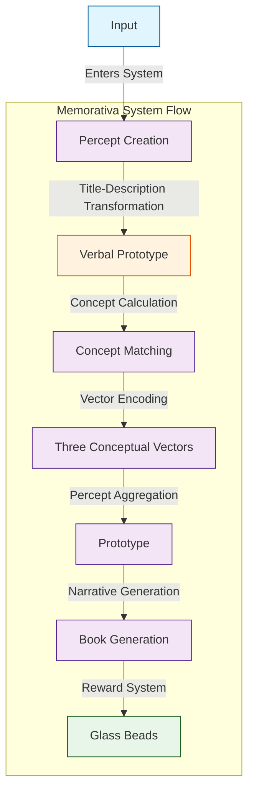

Consider some digital representation of an apple as an input. A traditional machine learning (ML) system using LLMs can easily decompose "apple" into many sophisticated ontological vectors. For example:

- Grammatical element: noun
- Physical size: fits in a human hand
- Color: probably red, could be green
- What is it?: Fruit of an apple tree containing seeds
- Why is it important?: Humans and other animals eat apples
- Cultural references: Johnny Appleseed
- Symbolic meaning: multiple depending human interpretation

LLMs encode tokenized inputs into vector space coordinates.

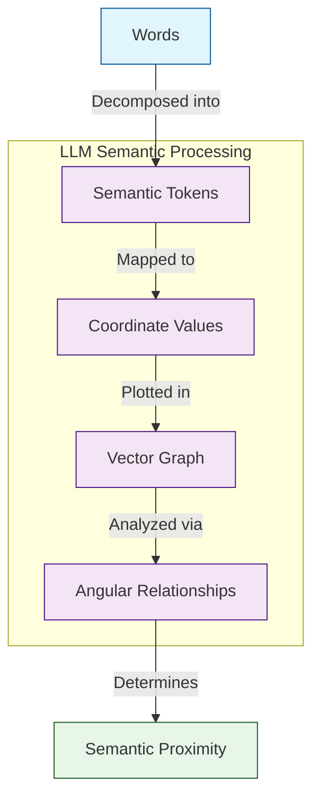

(Note that this explanation simplifies the actual process. LLM models don't necessarily map words directly to tokens, but instead decompose language into meaning units that may include words, parts of words, spaces, symbols, etc.)

 In high-dimensional vector spaces, a phenomenon related to the "curse of dimensionality" causes vectors to exhibit counterintuitive distance and angular properties[17]. As dimensionality increases, distances become less discriminative, and angles tend towards orthogonality. This effect is relevant when representing abstract concepts as vectors, as the high dimensionality needed to capture the nuances of conceptual relationships can lead to a less informative angular space, where vectors tend towards perpendicularity.

The symbolic vector is important for representing perceptions because the human mind seeks to unite each input with a concept. Without an enjoining concept, perception fails. Symbols, which indirectly but precisely convey meaning, are used by humans to best represent concepts. In human perception, the input does not form the concept, rather, concepts exist in humans beyond the grasp of human language, seeking to express a form based on the stimulus of an input to which it unites. The union of input with concept results in the percept, the form of which is the symbolic representation of the concept.

A mythologically / symbolically themed AI/RAG (Retrieval-Augmented Generation) model could process and categorize inputs (e.g., images, titles, descriptions) by leveraging multi-modal analysis and symbolic pattern recognition. Conceptual analysis could then be added to the RAG model as a way of human feedback tuning and model refinement. This feedback-driven input-to-RAG process can be driven by the game mechanics of Memorativa.

Research across linguistics, cultural studies, and cognitive science demonstrates that mythology is deeply embedded within language at multiple levels. At the lexical level, numerous words and idioms in languages like English directly originate from mythological figures and narratives, as evidenced by etymological studies and dictionaries[18]. Furthermore, mythological narratives serve as rich sources for metaphors and conceptual idioms that permeate everyday language[19], indicating that mythological frameworks contribute to the very fabric of word formation and semantic expression.

Beyond vocabulary, mythological concepts and archetypes appear to influence broader conceptual structures within language. Cultural linguistics and cognitive anthropology highlight how cultural frameworks, including mythology, shape fundamental conceptual categories and semantic organization[20]. While debated, Jungian perspectives suggest that archetypal patterns from mythology may even resonate within the collective unconscious, manifesting as recurring themes and symbols in linguistic patterns and narrative structures across cultures[21].

Finally, narrative studies and discourse analysis reveal that mythological narratives provide underlying structures for storytelling and communication in general. Recurring narrative patterns identified in mythology, such as the hero's journey[22] or Propp's morphology of folktales[24], are found to be pervasive in diverse forms of discourse, suggesting that mythological storytelling traditions have profoundly shaped the way humans structure and understand narratives within language. Collectively, these findings underscore the pervasive and multifaceted influence of mythology on the development and structure of language.

The goal of the Memorativa system is to use a small set of conceptual vectors that use a culturally encoded symbolic dictionary already embedded in English language LLM training data sets. These sets can be efficiently extended with the use of (RAG) systems to incorporate mythological / symbolic reference libraries. 

By focusing on the efficient encoding of the conceptual categorization of percepts, Memorativa seeks to solve for the problem of perpendicular angular relationships in vector space conceptual analysis.

Memorativa could be used by humans to help visualize and extend concepts and conceptual thinking, while machines could use Memorativa to better and more efficiently infer and conceptualize input.

By repurposing mythological structures as topological markers in AI vector space, the system seeks to demonstrate conceptual integrity without requiring a belief in its mechanisms, philosophy, or approach. 

## 3. The perceiver in the model

The Memorativa model describes a **cybernetic system** where a **machine-human interface** is defined. The interface completes the system by providing the **player** (human) of the game (machine) as an **animating force** and **validator** of the system. The player's input animates the system, while their validation ensures the structural correspondences defined by the model.

In this way, two worlds are bridged through Memorativa, connecting the **ideal** with the **real** through the human:

- **Human Interior World**: The world of perceptions and concepts, or the **"inner cosmos"**.
- **Machine Conceptual Space**: The space of vector relationships, where percepts and prototypes are analyzed and interpreted.

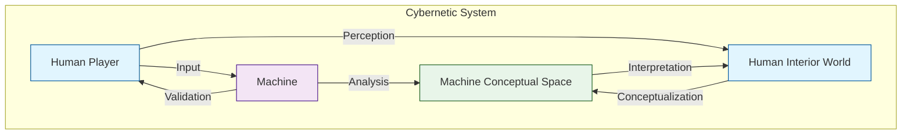

## 4. The game

The **Glass Bead Game** is the core interactive component of Memorativa. The player has a profile (represented by a **glass bead**) that tracks their gameplay and progress.

### 4.1. Game mechanics
1. **Player Inputs**: Players can add any meaningful content (e.g., URLs, tweets, videos, books, memes, images) to the game.
2. **Percept Creation**: When a player adds an input, the game prompts them for thoughts or additional information about the perception represented by the input.
3. **Focus Space**: The game generates a **focus space** where the input is visualized as a concept. The concept is represented by a **prototype**, which is composed of individual facets of the perception, called **percepts**.
4. **Rewards**: The game generates a **glass bead** for each focus space, percept, and prototype. It also generates a **Book**, which contains content about the concept and details about the input, percepts, and prototype.

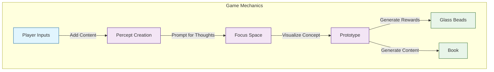

### 4.2 Inner cosmos
The **prototype** and **percept** structures encode the concept into data structures that can be represented in vector spaces. This allows the game to efficiently store, categorize, compare, filter, and present the percepts and prototypes in an **imaginary game space**, which represents the player's **inner cosmos**.

### 4.3 Dynamic knowledge base
As the player collects inputs, their inner cosmos expands according to the logic of the structural encoding and the growth of the **dynamic knowledge base** generated from their Books. This knowledge base serves as a corpus of conceptual data that supplements the **generative AI** powering the game logic and analysis.

### 4.4 Transformed concepts
As the inner cosmos grows, concepts and focus spaces themselves are encoded as inputs in new focus spaces, creating transformed, layered, linked, and synthesized percepts and prototypes.

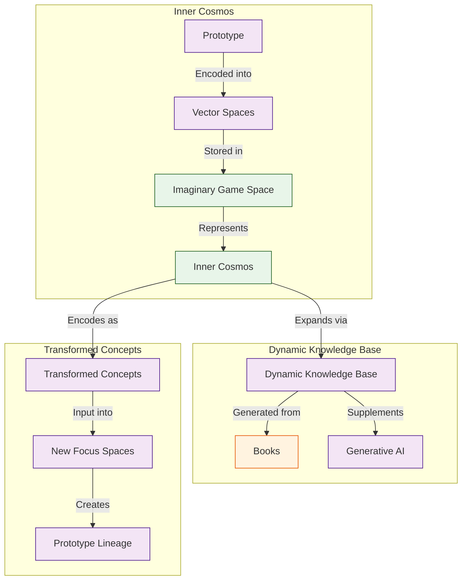

## 5. Glass beads

Glass beads are implemented as **SPL tokens** that serve as both **game tokens** and **symbolic storage** within Memorativa. Each glass bead token encapsulates **data**, **metadata**, and **attributes** of **focus spaces**, **percepts**, and **prototypes**, using **Merkle tree structures** to capture data structures, relationships, and changes. The beads reference the conceptual knowledge base of **Books**.

### 5.1 Core functions
1. **Game Tokens**: Glass beads act as **rewards** for player engagement, tracking progress and achievements in the **Glass Bead Game**.
2. **Symbolic Storage**: Each bead stores **semantic data** about the player's **inner cosmos**, including **percepts**, **prototypes**, and their **relationships**.
3. **Symbolic conceptual reference**: each bead references the content found in each Book.
3. **Utility Tokens**: Beads enable **verifiable ownership** and **transfer** of semantic assets, supporting **collaborative knowledge development** and **AI training**.

```mermaid
graph TD
    GB[Glass Bead] --> |Encapsulates| D[Data]
    GB --> |Encapsulates| M[Metadata]
    GB --> |Encapsulates| A[Attributes]
    D --> |Includes| FS[Focus Spaces]
    D --> |Includes| P[Percepts]
    D --> |Includes| PR[Prototypes]
    M --> |Includes| R[Relationships]
    M --> |Includes| C[Changes]
    A --> |Includes| O[Ownership]
    A --> |Includes| T[Transfer]

    GB --> |References| B[Books]

    subgraph "Core Functions"
        GB --> |Game Tokens| GT[Rewards for Engagement]
        GB --> |Symbolic Storage| SS[Semantic Data Storage]
        GB --> |Utility Tokens| UT[Verifiable Ownership & Transfer]
    end

    subgraph "Key Features"
        GB --> |Merkle Trees| MT[Data Integrity & Evolution Tracking]
        GB --> |SPL Token Standard| SPL[On-Chain Operations]
        GB --> |Dynamic Evolution| DE[Layered, Linked, Synthesized Content]
    end

    classDef bead fill:#e1f5fe,stroke:#01579b
    classDef data fill:#f3e5f5,stroke:#4a148c
    classDef function fill:#e8f5e9,stroke:#1b5e20
    classDef feature fill:#fff3e0,stroke:#e65100

    class GB bead
    class D,M,A data
    class GT,SS,UT function
    class MT,SPL,DE feature
```

- **Merkle Trees**: Each bead contains a **Merkle tree** that verifies the **state** and **lineage** of its semantic content, ensuring **data integrity** and **evolution tracking**.
- **SPL Token Standard**: Built on the **Solana Program Library (SPL)**, beads support **on-chain operations** like **transfer**, **ownership**, and **metadata management**.
- **Dynamic Evolution**: Beads evolve as the player's **inner cosmos** grows, capturing **layered**, **linked**, and **synthesized** percepts and prototypes.

This dual-purpose architecture bridges **human meaning-making** and **machine understanding**, creating a sustainable ecosystem for **personal knowledge development** and **AI training**.

### 5.2 Optimized merkle architecture for glass beads

#### 5.2.1. Hierarchical Merkle structure
- **Component Trees**: Separate Merkle roots for metadata/data/references  
- **Delta Commitments**: Store only changed components in new versions  
- **Lazy Hashing**: Compute hashes on-demand for inactive branches  

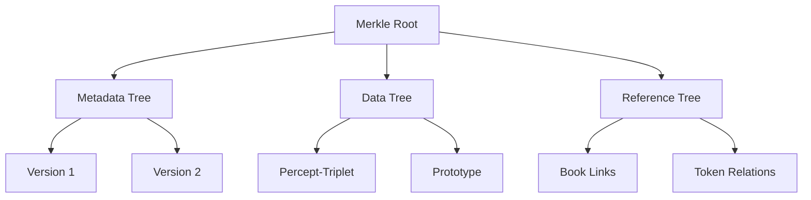

#### 5.2.2. Version compression
- **Snapshot Interval**: Weekly full hashes + daily delta commits  
- **Branch Pruning**: Auto-remove unmerged forks after 3 versions  
- **Reference Counting**: Garbage collect orphaned branches  
- **Batch Updates**: Group ≤10 edits as single version node  

#### 5.2.3. Cross-token optimization
- **Common Data Pool**: Shared subtrees for identical components  
- **Cross-Token Proofs**: Reuse verification paths across beads  
- **Differential Hashing**: Only hash changed portions  

#### 5.2.4. Implementation 

The following data structures are designed for an optimized Merkle tree implementation that supports:
- Componentization: Dividing data into different components (Metadata, PerceptData, etc.) and managing a separate Merkle tree for each component. This allows for more granular updates and verification.
- Delta Proofs: Generating and storing delta proofs to efficiently track and verify changes between versions. Delta proofs are more compact than storing full Merkle trees for each version and allow for efficient verification of updates.
Versioning: Maintaining a version history of the Merkle tree structure, allowing you to revert to previous states and track the evolution of the data over time.
- Efficient Updates: By using delta proofs and component trees, the system aims to minimize the computational overhead of updating the Merkle tree when data changes, as only the affected components and changes need to be processed and proven.

These structures ensures data integrity, version control, and efficient updates.

- This code sets up a system for efficiently managing and versioning different types of data using Merkle Trees. The component-based approach allows for granular updates, and delta proofs optimize the process of tracking changes between versions, making it more efficient than recalculating entire Merkle Trees for every update.

```rust
struct MerkleWrapper {
    component_trees: HashMap<ComponentType, MerkleTree>,
    delta_proofs: Vec<DeltaProof>,
    version_map: BTreeMap<u64, VersionMetadata>,
}

enum ComponentType {
    Metadata,
    PerceptData,
    References,
    AccessLogs,
}

struct DeltaProof {
    previous_root: [u8; 32],
    new_elements: Vec<HashedComponent>,
    patch_operations: Vec<PatchOp>,
}
```

#### 5.2.5. Verification 
- **Sparse Merkle Proofs**: O(log n) size for n versions  
- **Aggregate Proofs**: Single proof for multiple tokens  
- **Probabilistic Checking**: Random subtree verification  
- **Cache Layers**: LRU cache for frequent proof paths  

## 6. The percept-triplet

In the Memorativa model, human perception can be conceptually categorized according to three conceptual vectors, called the **percept-triplet**:

- **What**: the archetype - *the archetype vector*
- **How**: the form of expression of the archetype - *the expression vector*
- **Where**: the form of expression of the archetype in the conceptual field of activity - *the mundane vector*

Additionally, each percept-triplet has an identifying **title** and **description** to distinguish it from it's archetype vector (the what). The title/distinction pair serves as a distinct, compact, verbal prototype for the structure.

Each of these conceptual correlations originate from an observer that has a certain cosmological orientation, that is, *of a perceiver of objects in time and space on Earth*.

Percept-triplets can be applied to humans, things, and events to calculate encapsulating concepts. Keywords can be used as identifiers to correlate percepts to a data dictionary of concepts.

Western mythology and symbology provide prototypes that are encoded into the English language and culture (which is of concern to large language models and other semantic processors) and that can serve as the "data dictionary" for percept encoding.

### 6.1. Percept-triplet vector 1: archetype

The **archetype vector** is defined as:

- Outside the bounds of conceptualization
- An active force and dynamic principle
- Something that can be represented by prototypes
- A conceptual goal and a kind of center of conceptual gravity for prototypes
- Universal and consistent 

Memorativa uses archetypes as the "What" vector, and specifically Western prototypes of archetypes. In Memorativa, prototypes act as the representation of the input enjoined with a concept. The more closely a prototype "gravitates" towards the conceptual field of the archetype, the more clearly the prototype expresses the encapsulating concept of the percept.

**Planets**, with their centers of gravity and symbolic potency, provide the core prototypes for the archetypal "what" vector of the percept-triplets.

These are prototypical classical Planets of Western mythology, with some conceptual correlations:

- **Sun ☉**: Identity, vitality, consciousness, purpose
- **Moon ☽**: Emotions, instincts, nurturing, cycles
- **Mercury ☿**: Communication, learning, analysis, connection
- **Venus ♀**: Values, relationships, harmony, attraction
- **Mars ♂**: Action, drive, assertion, energy
- **Jupiter ♃**: Expansion, wisdom, growth, opportunity
- **Saturn ♄**: Structure, limitation, responsibility, time

These are the prototypical modern Planets, with some conceptual correlations:

- **Uranus ♅**: Innovation, freedom, disruption, awakening
- **Neptune ♆**: Spirituality, dissolution, imagination, unity
- **Pluto ♇**: Transformation, power, depth, regeneration

Each of these conceptual correlations are multivariate depending on if the percept is something personal, mundane, or itself conceptual. Thus "Sun" can be used to conceptually categorize people, events, or things. Different kinds of conceptual temporal states are also encoded into the planetary archetypes.

### 6.2 Percept-triplet vector 2: expression

The **expression vector** represents the form and expression of the archetype (the "How" vector) and is defined by:

- One of twelve symbols that modify the Planet archetypal force
- A representation of style, tone, and modality for the archetype
- The expression and manifestation of the archetype
- Determines how force is channeled

In keeping with an analogous structure to represent the different kinds of modalities and expressions of a Planet, the Western mythological classification of the constellations demarcating the ecliptic, the **Zodiac Signs**, serve as the twelve primary symbols of the "How" vector. According to the established mythology, each Zodiacal Sign has a "ruling" Planet that encodes a further vector of conceptual significance. In the case of the conceptual correlations for Signs, the vector particularly relates to the observer's understanding of the nature of the percept as an expression of the archetype.

Signs provide many additional correlated conceptual vectors, such as body parts, plants and minerals, month of the year, ruling Planet, etc.

| **Sign**                          |  **Modes**                |
|-----------------------------------|---------------------------|
| **♈ Aries, The Ram**              |  Energetic                |
| **♉ Taurus, The Bull**            |  Reliable                 |
| **♊ Gemini, The Twins**           |  Expressive               |
| **♋ Cancer, The Crab**            |  Protective               |
| **♌ Leo, The Lion**               |  Dramatic                 |
| **♍ Virgo, The Virgin**           |  Analytical               |
| **♎ Libra, The Scales**           |  Harmonious               |
| **♏ Scorpio, The Scorpion**       |  Intense                  |
| **♐ Sagittarius, The Archer**     |  Philosophical            |
| **♑ Capricorn, The Sea-Goat**     |  Practical                |
| **♒ Aquarius, The Water Bearer**  |  Inventive                 |
| **♓ Pisces, The Fish**            |  Artistic                 |

### 6.3 Percept-triplet vector 3: mundane

The **mundane vector** (the "Where") is the area of reality where the archetypal form of expression manifests, and is defined by:

- One of 12 areas called Houses
- The operational zone of activity for the percept
- Correlations to cycles, times, phases, and durations of human observed events
- Grounds symbolism in tangible reality, reflecting where energies manifest most visibly

Houses are categorized in Western astrology as follows:

| **House**                                |  **Area**                 |
|------------------------------------------|---------------------------|
|  **1st: The Ascendant**                  |  Identity                 |
|  **2nd: The House of Value**             |  Resources                |
|  **3rd: The House of Communication**     |  Learning                 |
|  **4th: The Nadir/IC**                   |  Home                     |
|  **5th: The House of Pleasure**          |  Creativity               |
|  **6th: The House of Service**           |  Routine                  |
|  **7th: The Descendant**                 |  Relationships            |
|  **8th: The House of Transformation**    |  Shared resources         |
|  **9th: The House of Philosophy**        |  Beliefs                  |
|  **10th: The Midheaven/MC**              |  Authority                |
|  **11th: The House of Friendship**       |  Groups                   |
|  **12th: The House of the Unconscious**  |  Hidden matters           |

### 6.4 Percept-Triplet Spatial Encoding

The percept-triplet structure is geometrically encoded in a hybrid spherical-hyperbolic knowledge space, combining the benefits of both geometries:

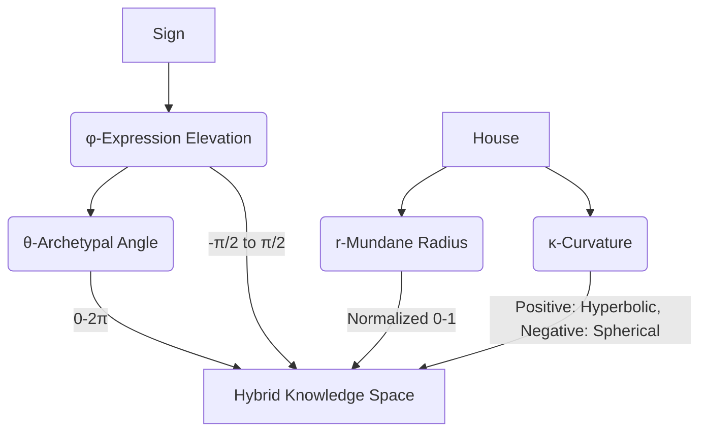

**Coordinate Mapping:**
- θ (Theta): Archetypal angle derived from Planet-Sign combination
- φ (Phi): Expression elevation angle from Sign-House relationship 
- r (Radius): Mundane magnitude based on House temporal significance
- κ (Kappa): Curvature parameter determining local geometry

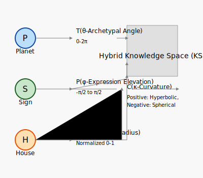

**Implementation:**

- This code defines a way to represent concepts spatially using a HybridTriplet structure, where the spatial coordinates and geometry are derived from astrological concepts: Planets, Zodiac Signs, and Houses. The `from_astrological` method acts as a bridge, converting astrological inputs into the numerical representation of the hybrid spatial model. This enables the system to use astrological principles to model and analyze conceptual relationships in a structured, geometric way.

```rust
struct HybridTriplet {
    theta: f32,    // Archetype vector (0.0-2π)
    phi: f32,      // Expression vector (-π/2-π/2)
    radius: f32,   // Mundane magnitude (0.0-1.0)
    curvature: f32 // Geometry parameter (+ hyperbolic, - spherical)
}

impl HybridTriplet {
    fn from_astrological(p: Planet, s: Sign, h: House) -> Self {
        let theta = p.base_angle() + s.angular_offset();
        let phi = s.elevation() * h.temporal_weight();
        let radius = h.mundane_significance();
        let curvature = h.determine_curvature();
        Self { theta, phi, radius, curvature }
    }
}
```
The hybrid spatial model provides critical advantages for conceptual analysis:

1. **Aspect Preservation**  
   Angular relationships (conjunction, opposition, etc.) become native geometric calculations in both spaces:
   ```python
   def hybrid_aspect_angle(t1: HybridTriplet, t2: HybridTriplet) -> float:
       if t1.curvature > 0:  // Hyperbolic space
           return hyperbolic_distance(t1, t2)
       else:  // Spherical space
           return spherical_angle(t1, t2)
   ```

2. **Dimensional Optimization**  
   | Dimension | Representation | Storage | Computational Complexity |
   |-----------|----------------|---------|--------------------------|
   | 2D        | Planar         | 2 floats| O(n) search              |  
   | **3D Hybrid** | **Spherical-Hyperbolic**  | **4 floats** | **O(log n) via k-d trees** |
   | >3D       | Hyper-spatial  | n floats | O(n^k) scaling issues |

3. **Cognitive Alignment**  
   - Mirrors human spatial reasoning (x,y,z → what,how,where)
   - Enables intuitive visualization of conceptual "distances"
   - Allows gravitational metaphors (archetypal "pull", mundane "weight")
   - Supports hierarchical relationships through hyperbolic space

4. **Cross-Domain Compatibility**
   ```mermaid
   graph LR
       ASTRO[Astrological Aspects] --> 3DH[3D Hybrid Space]
       ML[ML Embeddings] --> 3DH
       PHYS[Physics Models] --> 3DH
       3DH --> ANALYSIS[Unified Analysis]
   ```

5. **Efficiency Tradeoffs**  
   - 32-bit floats (θ,φ,r,κ) = 16 bytes/triplet
   - Enables GPU acceleration using standard 3D math libraries
   - Maintains 1° angular precision (360 values) with 2-byte quantization
   - Supports dynamic geometry selection based on conceptual needs

This hybrid encoding creates a _conceptual phase space_ where:  
`distance(p1,p2) = f(θ_diff, φ_diff, r_diff, κ)`  
can represent both hierarchical relationships and semantic similarity through vector operations while preserving symbolic relationships.

### 6.5 Hybrid spatial model

The Memorativa system uses a hybrid spherical-hyperbolic space to represent both symbolic relationships (via spherical geometry) and hierarchical structures (via hyperbolic geometry). This hybrid model enables more nuanced representation of conceptual relationships while maintaining computational efficiency.

#### 6.5.1. Core structure

- The `HybridTriplet` struct and its implemented methods provide a way to represent points in a hybrid spherical-hyperbolic space and calculate distances between them. The key features are:
    - Hybrid Representation: It stores both spherical and Poincaré coordinates, along with a curvature parameter, to capture the hybrid nature of the space.
    - Constructor: The new function creates HybridTriplet instances from spherical coordinates, converting them to Poincaré coordinates and setting a default hyperbolic curvature.
    - Hybrid Distance Calculation: The distance method dynamically selects between hyperbolic and spherical distance calculation based on the curvature parameter.
    - Poincaré Ball Hyperbolic Distance: The hyperbolic_distance method specifically calculates the hyperbolic distance using the Poincaré ball model formula, which is essential for working with hyperbolic geometry in this representation.
    - This code is a fundamental building block for the system to work with hybrid geometric spaces for representing conceptual relationships that have both hierarchical (hyperbolic) and symbolic/angular (spherical) aspects.

```rust
/// Represents a point in hybrid spherical-hyperbolic space
#[derive(Clone, Copy)]
struct HybridTriplet {
    spherical: SphericalCoords,
    poincare: [f32; 3],  // (x,y,z) in Poincaré ball model
    curvature: f32,      // κ (positive for hyperbolic, negative for spherical)
}

impl HybridTriplet {
    fn new(spherical: SphericalCoords) -> Self {
        let poincare = Self::spherical_to_poincare(spherical);
        HybridTriplet {
            spherical,
            poincare,
            curvature: 1.0,  // Default hyperbolic curvature
        }
    }

    fn distance(&self, other: &Self) -> f32 {
        if self.curvature > 0.0 {
            self.hyperbolic_distance(other)
        } else {
            self.spherical_distance(other)
        }
    }

    fn hyperbolic_distance(&self, other: &Self) -> f32 {
        // Poincaré ball model distance formula
        let dx = self.poincare[0] - other.poincare[0];
        let dy = self.poincare[1] - other.poincare[1];
        let dz = self.poincare[2] - other.poincare[2];
        let euclid_norm = (dx*dx + dy*dy + dz*dz).sqrt();
        let denominator = (1.0 - self.norm_squared()).sqrt() 
                       * (1.0 - other.norm_squared()).sqrt();

        (1.0 + 2.0*euclid_norm/denominator).acosh()
    }
}
```

#### 6.5.2 Spatial indexing

The hybrid spatial index enables efficient querying in both spherical and hyperbolic spaces:

- The `HybridSpatialIndex` class provides a way to perform nearest neighbor queries in a hybrid spherical-hyperbolic space by:
    - Maintaining separate spatial indices for the spherical and hyperbolic components of the space.
    - Querying both indices in parallel for a given query point.
    - Combining the results from both queries using a weighted average of distances, where the weight is determined by the curvature parameter of the query point.
    - Returning the top k nearest neighbors based on this combined hybrid distance score.
    - This approach allows for efficient neighbor retrieval in a space that blends spherical and hyperbolic geometries, adapting the distance metric based on the local curvature.

```python
class HybridSpatialIndex:
    def __init__(self):
        self.spherical_index = KDTree(dim=3)
        self.hyperbolic_index = BallTree(metric='poincare')
        self.aspect_cache = LRUCache(maxsize=10000)
        
    def query_neighbors(self, triplet: HybridTriplet, k: int = 5) -> List[HybridTriplet]:
        # Query both spaces in parallel
        spherical_neighbors = self.spherical_index.query(
            triplet.spherical.coords, 
            k=k
        )
        hyperbolic_neighbors = self.hyperbolic_index.query(
            triplet.poincare,
            k=k
        )
        
        # Merge results based on curvature
        weight = abs(triplet.curvature)
        merged = []
        for s_n, h_n in zip(spherical_neighbors, hyperbolic_neighbors):
            score = weight * h_n.distance + (1-weight) * s_n.distance
            merged.append((s_n.triplet, score))
            
        return sorted(merged, key=lambda x: x[1])[:k]
```

#### 6.5.3. Aspect calculations

The hybrid model extends traditional aspect calculations to account for both spherical and hyperbolic relationships:

- These functions provide a way to:
    - Calculate a hybrid aspect angle that combines spherical and hyperbolic distances, weighted by the curvature of the space, allowing for a nuanced measure of angular relationship in a hybrid geometry.
    - Determine the significance of a hybrid aspect using a dynamic threshold that also adapts to the curvature, making the criteria for significance context-dependent based on the local geometry of the hybrid space.
    - These functions are crucial for implementing aspect-based analysis and retrieval in the Memorativa system's hybrid spatial model, allowing it to capture both hierarchical and symbolic relationships in a unified framework.

```python
def hybrid_aspect_angle(t1: HybridTriplet, t2: HybridTriplet) -> float:
    # Calculate both spherical and hyperbolic components
    spherical_angle = calculate_3d_angle(t1.spherical, t2.spherical)
    hyperbolic_dist = t1.hyperbolic_distance(t2)
    
    # Normalize hyperbolic distance to angular scale
    max_hyp_dist = 4.0  # Maximum expected hyperbolic distance
    norm_hyp_angle = (hyperbolic_dist / max_hyp_dist) * 180.0
    
    # Weighted combination based on curvature
    weight = abs(t1.curvature)
    return weight * norm_hyp_angle + (1-weight) * spherical_angle

def is_significant_hybrid_aspect(angle: float, curvature: float) -> bool:
    # Dynamic thresholds based on space curvature
    hyperbolic_thresh = 0.15  # 15% of max hyperbolic distance
    spherical_thresh = 10.0   # Degrees
    
    threshold = abs(curvature) * hyperbolic_thresh + 
                (1-abs(curvature)) * spherical_thresh
    return angle > threshold
```

#### 6.5.4. Benefits

The hybrid spatial model provides several advantages:

1. **Improved Hierarchical Representation**: Hyperbolic space better captures hierarchical relationships between concepts
2. **Preserved Symbolic Relationships**: Spherical components maintain traditional aspect relationships
3. **Flexible Geometry**: Curvature parameter allows dynamic adjustment between spaces
4. **Efficient Querying**: Parallel indexing enables fast neighbor searches in both spaces

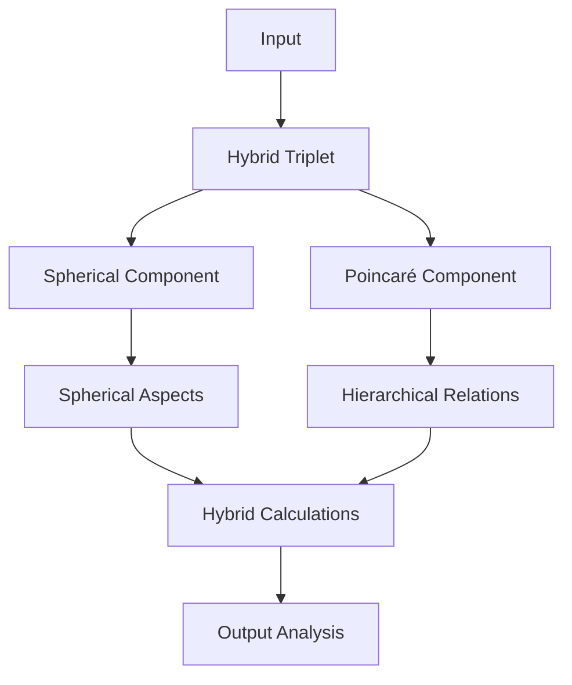

### 6.6. Percept-triplet title-description pair

Since the input has been decomposed into a set of percept-triplets vectors, it is important that each vector has a unique, identifying **title/description pair** that distinguishes the input from archetype as a verbal prototype. Each pair is derived from the initial input's title and description values, but transformed by the percept-triplet calculation into a more specific variation of the input. This transformation happens at the end of the prototype construction and is performed by the Memorativa system. The Memorativa system also transforms the text from the terms and language of astrology into more broadly understood symbols and language to ensure that the title-description pair is less constrained and more universal.

## 7. Symbolic Translation System (MST)  

The **Memorativa Symbolic Translator (MST)** converts astrologically encoded percept-triplets into universal symbolic language while preserving conceptual relationships. This enables non-astrological analysis of prototypes and percepts. The MST leverages **generative AI** to create dynamic narratives, visualizations, and analyses based on the percept-triplets and prototypes.

### 7.1. Key functions  

1. **Archetype Abstraction**  
   - Translates planetary positions → universal concepts (Saturn → "Boundaries")  
   - Converts astrological houses → conceptual domains (4th House → "Rootedness")  
   - Uses **generative AI** to create contextually rich descriptions of archetypes and their relationships.

2. **Cross-Cultural Mapping**  
   - Identifies equivalent symbols across traditions (Mercury ≈ Hermes ≈ Thoth)  
   - Ensures cultural neutrality in title-description pairs  
   - Leverages **generative AI** to generate cross-cultural narratives and analyses.

3. **Contextual Bridging**  
   - Maintains semantic relationships between original and translated elements  
   - Example: "Moon in Cancer 4th" → "Nurturing Foundations"  
   - Uses **generative AI** to create dynamic narratives that bridge symbolic and conceptual contexts.

### 7.2. Implementation  

- **Architecture**: Hybrid system combining:  
  - Fine-tuned LLM (cultural/archetypal knowledge)  
  - Symbolic pattern matcher (mythological cross-references)  
- **Training Data**:  
  - 42 cultural traditions' symbol systems  
  - 650k+ archetype-prototype pairings  
- **Output Rules**:  
  - Strict prohibition of astrological terms  
  - Mandatory grounding in 3+ cultural references  

### 7.3. Workflow example  

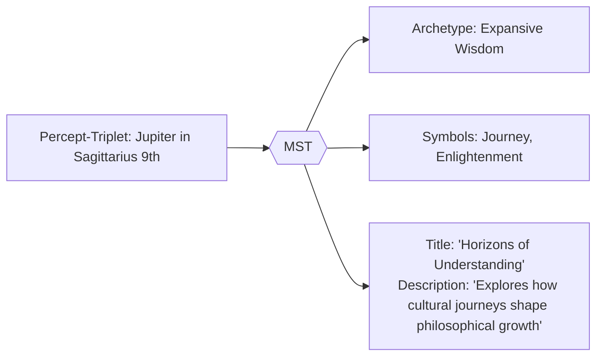

## 8. Generative AI

Generative AI is the **engine** that powers Memorativa's ability to transform **player inputs** into **percepts**, **prototypes**, and **Books** in 3D conceptual space. It leverages **large language models (LLMs)** and **retrieval-augmented generation (RAG)** to create **dynamic narratives**, **visualizations**, and **analyses** based on the player's **inner cosmos**.

The **generative AI** architecture bridges **human meaning-making** and **machine understanding**, creating a sustainable ecosystem for **personal knowledge development** and **AI training**.

### 8.1. Key features

- **Multi-Modal Analysis**: Processes **text**, **images**, and **videos** to create **percepts** and **prototypes**.
- **Symbolic Pattern Recognition**: Identifies **archetypal patterns** in player inputs, using **Western mythology** and **cultural references** as a framework.
- **Contextual Bridging**: Maintains **semantic relationships** between percepts and prototypes, ensuring **conceptual coherence**.
- **Feedback-Driven Refinement**: Uses **player validation** to refine the **generative AI**'s understanding of percepts and prototypes.

### 8.2. Integration with Glass Beads

- Each **glass bead** references the **percepts**, **prototypes**, and **Books** generated by the **generative AI**.
- The **Merkle tree** in each bead ensures **data integrity** and **evolution tracking** of the **generative AI**'s outputs.
- The **SPL token standard** enables **verifiable ownership** and **transfer** of the **generative AI**'s outputs, supporting **collaborative knowledge development**.
- **Privacy Levels**: Glass beads respect the privacy settings of **Book entries**, **percepts**, and **prototypes**, which can be:
  - **Private**: Only accessible to the player.
  - **Not Shared**: Accessible to the player and the system for AI training but not shared with others.
  - **Public**: Accessible to all players and the system.
  - **Shared**: Accessible to specific players or groups, as defined by the player.

```mermaid
graph TD
    GAI[Generative AI] --> |Percept Creation| PC[Percept-Triplets]
    GAI --> |Prototype Aggregation| PA[Prototypes]
    GAI --> |Book Generation| BG[Books]
    GAI --> |Dynamic Knowledge Base| DKB[Layered, Linked, Synthesized Percepts & Prototypes]

    subgraph "Core Functions"
        PC
        PA
        BG
        DKB
    end

    subgraph "Key Features"
        GAI --> |Multi-Modal Analysis| MMA[Text, Images, Videos]
        GAI --> |Symbolic Pattern Recognition| SPR[Archetypal Patterns]
        GAI --> |Contextual Bridging| CB[Semantic Relationships]
        GAI --> |Feedback-Driven Refinement| FDR[Player Validation]
    end

    subgraph "Integration with Glass Beads"
        GB[Glass Bead] --> |References| PC
        GB --> |References| PA
        GB --> |References| BG
        GB --> |Merkle Tree| MT[Data Integrity & Evolution Tracking]
        GB --> |SPL Token Standard| SPL[On-Chain Operations]
        GB --> |Privacy Levels| PL[Private, Not Shared, Public, Shared]
    end

    classDef gai fill:#e1f5fe,stroke:#01579b
    classDef function fill:#f3e5f5,stroke:#4a148c
    classDef feature fill:#e8f5e9,stroke:#1b5e20
    classDef integration fill:#fff3e0,stroke:#e65100

    class GAI gai
    class PC,PA,BG,DKB function
    class MMA,SPR,CB,FDR feature
    class GB,MT,SPL,PL integration
```

### 8.3 Core functions

1. **Percept Creation**: 

    - 1. Convert text input into a numerical vector representation using an LLM.
    - 2. Project this vector into a 3D spherical space.
    - 3. Fine-tune the placement in this space by considering the spatial relationships (aspects) with existing nearby percepts, aiming to create a conceptually organized vector space.


```python
def create_percept_embedding(text: str) -> SphericalTriplet:
    # Initial NLP processing
    raw_embed = llm.encode(text)
    
    # Project to 3D symbolic space
    spherical = project_to_spherical(raw_embed)
    
    # Optimize placement using k-d tree search
    optimized = optimize_spatial_placement(spherical)
    
    return optimized

def optimize_spatial_placement(triplet: SphericalTriplet) -> SphericalTriplet:
    # Find nearest neighbors in 3D space
    neighbors = spatial_index.query(triplet, k=5)
    
    # Adjust placement based on angular relationships
    adjusted = adjust_for_aspects(triplet, neighbors)
    
    return adjusted
```

2. **Prototype Aggregation**: These functions work together to take a set of percepts (represented as `SphericalTriplets`) and find their central point in the spherical conceptual space (`calculate_spherical_centroid`). Then, they organize these percepts around this central point and use this information to create a Prototype, which is a structured representation of the aggregated concept. The centroid acts as a kind of average or focal point for the concept represented by the input percepts.

```python
def aggregate_prototypes(triplets: List[SphericalTriplet]) -> Prototype:
    # Calculate centroid in spherical space
    centroid = calculate_spherical_centroid(triplets)
    
    # Organize triplets by angular distance from centroid
    organized = organize_by_angular_distance(triplets, centroid)
    
    # Create prototype with optimized 3D structure
    return create_3d_prototype(organized)

def calculate_spherical_centroid(triplets: List[SphericalTriplet]) -> SphericalTriplet:
    # Mean of spherical coordinates with proper wrapping
    theta_mean = circular_mean([t.theta for t in triplets])
    phi_mean = circular_mean([t.phi for t in triplets])
    radius_mean = np.mean([t.radius for t in triplets])
    
    return SphericalTriplet(theta_mean, phi_mean, radius_mean)
```

3. **Book Generation**: These functions work together to:
    - Analyze a Prototype to extract meaningful spatial patterns, including aspect relationships, clusters, and symmetries in its 3D structure.
    - Use these patterns to generate a narrative that describes the concept represented by the prototype.
    - Create visualizations that illustrate the 3D spatial arrangement of the prototype.
    - Package these elements into a Book object, providing a comprehensive output that explains and represents the concept.

```python
def generate_book(prototype: Prototype) -> Book:
    # Extract 3D spatial patterns
    patterns = analyze_spatial_patterns(prototype)
    
    # Generate narrative based on angular relationships
    narrative = generate_from_aspects(patterns)
    
    # Create visualizations of 3D structure
    visuals = create_spatial_visualizations(prototype)
    
    return Book(narrative, patterns, visuals)

def analyze_spatial_patterns(prototype: Prototype) -> List[Pattern]:
    # Find significant aspect patterns
    aspects = find_aspect_patterns(prototype)
    
    # Identify spatial clusters
    clusters = find_spatial_clusters(prototype)
    
    # Analyze symmetries in 3D space
    symmetries = analyze_spatial_symmetries(prototype)
    
    return combine_patterns(aspects, clusters, symmetries)
```

Each Glass Bead token maintains its 3D spatial coordinates and relationships:

- This code defines how spatial information is managed for Glass Bead tokens in Memorativa. The `GlassBeadSpatial` struct holds the 3D coordinates, a cache of aspect relationships with other beads, and a spatial index for efficient lookups. The `update_spatial_relations` method is used to dynamically update these spatial relationships and the spatial index as the system evolves and new beads are introduced or bead positions change. This is crucial for maintaining the 3D conceptual space and enabling features like aspect-based analysis and retrieval in the Memorativa system.

```rust
struct GlassBeadSpatial {
    coordinates: SphericalTriplet,
    aspect_cache: HashMap<BeadId, AspectRelation>,
    spatial_index: KdTreeIndex,
}

impl GlassBeadSpatial {
    fn update_spatial_relations(&mut self, other_beads: &[GlassBead]) {
        // Update aspect cache with new angular relationships
        for bead in other_beads {
            let angle = calculate_3d_angle(&self.coordinates, &bead.coordinates);
            self.aspect_cache.insert(bead.id, AspectRelation::new(angle));
        }
        
        // Update spatial index for efficient neighbor queries
        self.spatial_index.update(self.coordinates);
    }
}
```

### 8.4. Performance optimizations

1. **Spatial Indexing**:

- The `SpatialIndex` class provides a way to:
    - Create a spatial index (KDTree) for 3D points.
    - Insert new points (represented as `SphericalTriplets`) into the index. The points are converted to Cartesian coordinates for KD-tree compatibility.
    - Query the index to find the k nearest neighbors to a given query point (`SphericalTriplet`). The query point is also converted to Cartesian coordinates, and the results are converted back to `SphericalTriplets` before being returned.

- This class is a utility for efficiently managing and searching spatial data in the Memorativa system, used for quickly finding conceptually similar percepts based on their positions in the 3D spherical space.

```python
class SpatialIndex:
    def __init__(self):
        self.kdtree = KDTree(dim=3)
        
    def insert(self, triplet: SphericalTriplet):
        point = spherical_to_cartesian(triplet)
        self.kdtree.insert(point)
        
    def query_neighbors(self, triplet: SphericalTriplet, k: int) -> List[SphericalTriplet]:
        point = spherical_to_cartesian(triplet)
        neighbors = self.kdtree.query(point, k)
        return [cartesian_to_spherical(n) for n in neighbors]
```

2. **Aspect Caching**:

The `AspectCache` class implements a simple caching mechanism to store and reuse the results of `calculate_3d_angle` function calls. This is a performance optimization technique. When the system needs to find the aspect between two `SphericalTriplets`, it first checks the `AspectCache`. If the aspect has already been computed and stored, it's retrieved from the cache, saving the computational cost of recalculating it. If it's not in the cache, it's calculated, stored in the cache, and then returned. The LRU cache ensures that the cache doesn't grow indefinitely and prioritizes keeping the most recently used aspect values in memory.

```python
class AspectCache:
    def __init__(self):
        self.cache = LRUCache(maxsize=10000)
        
    def get_aspect(self, t1: SphericalTriplet, t2: SphericalTriplet) -> float:
        key = hash((t1, t2))
        if key not in self.cache:
            angle = calculate_3d_angle(t1, t2)
            self.cache[key] = angle
        return self.cache[key]
```

## 9. RAG system

The **Retrieval-Augmented Generation (RAG)** system leverages 3D spherical encoding to enhance both the **player experience** and the **general AI model** by combining **retrieval** of spatially-relevant information with **generative AI** capabilities.

The **RAG system** architecture bridges **human meaning-making** and **machine understanding**, creating a sustainable ecosystem for **personal knowledge development** and **AI training**.

### 7.1 Key features
- **Dynamic Knowledge Base**: The **Books** generated by players serve as a **corpus of conceptual data** that the RAG system retrieves from.
- **Symbolic Pattern Recognition**: Identifies **archetypal patterns** in player inputs, using **Western mythology** and **cultural references** as a framework.
- **Feedback Loop**: Player-generated content is continuously added to the knowledge base, enhancing the **general AI model** and improving its ability to generate **contextually relevant outputs**.

### 9.2. Integration with Glass Beads
- Each **glass bead** references the **percepts**, **prototypes**, and **Books** generated by the **RAG system**.
- The **Merkle tree** in each bead ensures **data integrity** and **evolution tracking** of the **RAG system**'s outputs.
- The **SPL token standard** enables **verifiable ownership** and **transfer** of the **RAG system**'s outputs, supporting **collaborative knowledge development**.
- **Privacy Levels**: Glass beads respect the privacy settings of **Book entries**, **percepts**, and **prototypes**, which can be:
  - **Private**: Only accessible to the player.
  - **Not Shared**: Accessible to the player and the system for AI training but not shared with others.
  - **Public**: Accessible to all players and the system.
  - **Shared**: Accessible to specific players or groups, as defined by the player.

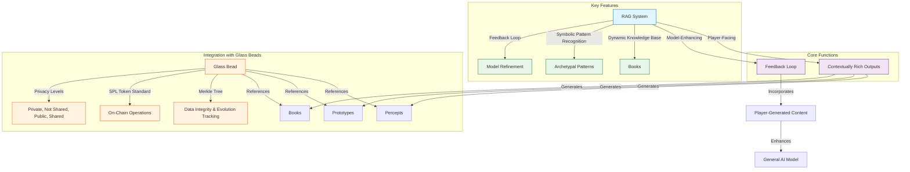

### 9.3. Core functions

1. **Vector Retrieval**

- The `SphericalRAG` class implements a retrieval system that:
    - Finds spatially close documents to a query in a 3D spherical space using a KDTree.
    - Filters these neighbors based on whether their angular relationship to the query is considered "significant" according to predefined astrological aspect thresholds.
    - Loads and returns the Document objects corresponding to the filtered, aspect-significant neighbors.
    - This approach combines spatial proximity with symbolic relationships (represented by astrological aspects) to retrieve contextually relevant information in the Memorativa system.

```python
class SphericalRAG:
    def __init__(self):
        self.spatial_index = KDTree(dim=3)
        self.aspect_cache = AspectCache()
        
    def retrieve_relevant(self, query: SphericalTriplet, k: int = 5) -> List[Document]:
        # Find nearest neighbors in 3D space
        neighbors = self.spatial_index.query(
            spherical_to_cartesian(query), 
            k=k
        )
        
        # Filter by aspect relationships
        aspect_filtered = []
        for neighbor in neighbors:
            angle = self.aspect_cache.get_aspect(query, neighbor)
            if is_significant_aspect(angle):
                aspect_filtered.append(neighbor)
                
        return self.load_documents(aspect_filtered)

def is_significant_aspect(angle: float) -> bool:
    # Angular thresholds for major aspects
    ASPECT_THRESHOLDS = {
        'conjunction': (0, 10),     # ±5° orb
        'opposition': (175, 185),   # 180° ±5°
        'trine': (115, 125),        # 120° ±5°
        'square': (85, 95),         # 90° ±5°
    }
    
    return any(low <= angle <= high 
              for low, high in ASPECT_THRESHOLDS.values())
```

2. **Spatial Context Generation**

- The `SpatialContextGenerator` class is responsible for:
    - Retrieving spatially relevant documents using a `SphericalRAG` object.
    - Analyzing the angular relationships (aspects) between a query and the retrieved documents.
    - Generating a response that incorporates this spatial context, likely by using the retrieved documents and their aspect relationships to provide a more informed and relevant answer to the initial query.
    - This class is a key component in enabling the Memorativa system to generate responses that are not only semantically relevant but also contextually rich due to the spatial organization of knowledge and the symbolic relationships (aspects) within its 3D conceptual space.

```python
class SpatialContextGenerator:
    def __init__(self, rag: SphericalRAG):
        self.rag = rag
        
    def generate_with_context(self, query: SphericalTriplet) -> str:
        # Get spatially relevant documents
        relevant_docs = self.rag.retrieve_relevant(query)
        
        # Extract angular relationships
        aspects = self.analyze_spatial_aspects(query, relevant_docs)
        
        # Generate response incorporating spatial context
        return self.generate_response(query, relevant_docs, aspects)
        
    def analyze_spatial_aspects(self, query: SphericalTriplet, 
                              docs: List[Document]) -> List[Aspect]:
        aspects = []
        for doc in docs:
            angle = calculate_3d_angle(query, doc.triplet)
            if is_significant_aspect(angle):
                aspects.append(Aspect(doc, angle))
        return aspects
```

3. **Dynamic Knowledge Base**

- The `DynamicKnowledgeBase` class is designed to:
    - Organize documents into spatial clusters using a `defaultdict` called spatial_clusters.
    - Index documents based on temporal states using a dictionary `temporal_states`, where each state ('mundane', 'quantum', 'holographic') has its own index object (`MundaneIndex`, `QuantumIndex`, `HolographicIndex`).
    - Provide an `add_document` method to add new documents to both spatial cluster and temporal state indices.
    - Use a `spatial_clustering_algorithm` to determine the spatial cluster for a given document based on its 3D coordinates.
    - This structure uses a multi-faceted approach to knowledge organization, where documents are categorized and indexed both spatially (by cluster) and temporally (by state), allowing for potentially more nuanced and context-aware retrieval and analysis of information within the Memorativa system.

```python
class DynamicKnowledgeBase:
    def __init__(self):
        self.spatial_clusters = defaultdict(list)
        self.temporal_states = {
            'mundane': MundaneIndex(),
            'quantum': QuantumIndex(),
            'holographic': HolographicIndex()
        }
        
    def add_document(self, doc: Document, triplet: SphericalTriplet):
        # Index by spatial cluster
        cluster = self.get_spatial_cluster(triplet)
        self.spatial_clusters[cluster].append(doc)
        
        # Index by temporal state
        state = doc.temporal_state
        self.temporal_states[state].add(doc, triplet)
        
    def get_spatial_cluster(self, triplet: SphericalTriplet) -> int:
        # Cluster based on 3D coordinates
        return spatial_clustering_algorithm(triplet)
```

The RAG system integrates with Glass Bead tokens through spatial relationships:

- The `process_glass_bead` method in `SphericalRAG` does the following when a new GlassBead is introduced:
    - Extracts its 3D spatial coordinates.
    - Updates the `spatial_index` to include the new bead's position, making it searchable for spatial queries.
    - Iterates through all other active beads in the system.
    - Calculates the angular relationship (3D angle) between the new bead and each existing active bead.
    - Checks if the calculated angle represents a "significant aspect" based on predefined thresholds.
    - If the aspect is significant, it adds an edge to an `aspect_graph` connecting the new bead and the existing bead, with the angle as an attribute of the edge.
    - This method ensures that as new glass beads are added to the Memorativa system, their spatial positions are indexed for efficient retrieval, and their significant angular relationships with other beads are captured in an aspect graph, which can be used for further analysis and contextual understanding within the RAG system.

```rust
impl SphericalRAG {
    fn process_glass_bead(&mut self, bead: &GlassBead) {
        // Extract 3D coordinates
        let coords = bead.spatial.coordinates;
        
        // Update spatial indices
        self.spatial_index.insert(coords);
        
        // Process angular relationships
        for other_bead in self.active_beads.iter() {
            let angle = calculate_3d_angle(&coords, &other_bead.coords);
            if is_significant_aspect(angle) {
                self.aspect_graph.add_edge(bead.id, other_bead.id, angle);
            }
        }
    }
}
```

### 9.4. Performance Optimizations

1. **Spatial Clustering**

- The optimize_retrieval function implements a retrieval strategy that uses spherical k-means clustering to improve efficiency:
    - Clustering: It first pre-processes the documents by grouping them into k=10 clusters using spherical k-means, based on their spatial positions.
    - Cluster Selection: When a query comes in, it identifies the cluster that is most relevant or "nearest" to the query point in the spherical space.
    - Localized Search: Instead of searching through all documents in the knowledge base, it restricts the search to only the documents within the selected cluster. This significantly reduces the search space and improves retrieval speed.
    - This approach is a common optimization technique in information retrieval and spatial databases. By clustering the data, the search process becomes more focused and efficient, especially for large datasets. It assumes that documents within the same cluster are more likely to be relevant to similar queries.

```python
def optimize_retrieval(query: SphericalTriplet) -> List[Document]:
    # Use spherical k-means for clustering
    clusters = spherical_kmeans(documents, k=10)
    
    # Find relevant cluster
    cluster = find_nearest_cluster(query)
    
    # Search within cluster
    return search_cluster(cluster, query)
```

2. **Aspect Caching**

- `AspectCache` is designed to optimize performance by storing the results of `calculate_3d_angle`. When you request the aspect between two `SphericalTriplets` using `get_aspect`, it first checks if the result is already cached. If it is, the cached value is returned immediately, avoiding redundant computation. If not, it calculates the aspect, stores it in the cache, and then returns the result. The LRU cache ensures that the cache remains bounded in size and prioritizes frequently accessed aspect values.

```python
class AspectCache:
    def __init__(self):
        self.cache = LRUCache(maxsize=10000)
        
    def get_aspect(self, t1: SphericalTriplet, t2: SphericalTriplet) -> float:
        key = hash((t1, t2))
        if key not in self.cache:
            angle = calculate_3d_angle(t1, t2)
            self.cache[key] = angle
        return self.cache[key]
```

## 10. Example encoding of an input using the percept-triplet method

In this example, the Memorativa percept-triplet method is used to conceptualize an input. The output is a Planet expressed in a Sign manifested in a House.

Define an **input** as:

- URL
- Title
- Description

For example:

- "URL": "link to a photo of an apple"
- "title": "Eve's temptation"
- "description": "The apple in mythology"
  
Here the input is not simply an object (the apple), but a perception of the object conditioned by the observer's state and context, as reflected in the title and description.

Here's a hypothetical percept-triplet structure, mapping the apple input to a single prototype:

- **Planet**: Venus
- **Sign**: Libra
- **House**: 9th

The conceptual **book** written by the system includes the structure and an analysis.

Here's a hypothetical analysis of the derived percept-triplet structure:

- The structure encapsulates the apple as a symbol of temptation (Venus), expressed through the duality of choice (Libra). The 9th House places the apple within a mythological framework.

Here's a hypothetical justification for the structure:

- The apple as a symbol of temptation aligns with Venusian themes of desire, beauty, and value.

- Venus in Libra emphasizes the duality of choice (Eve's decision) and the balance between innocence and knowledge.

- The 9th House dominance places the apple within the realm of mythology, belief systems, and philosophical inquiry.

- The title and description from the input are transformed into:

  - **Title**: "Ethical Choices in Cultural Narratives"  
  - **Description**: "Examines how societies negotiate the balance between knowledge acquisition and moral boundaries through symbolic representations"

## 11. The prototype

In Memorativa, the **prototype** is a structure that is represented with multiple percept-triplets in multiple perceptional vectors. Each vector maps to an archetype represented by a planet, with the **Sun** serving as the central representation of the prototype and the orbiting **planets** representing the different conceptual vectors of the percept. Memorativa uses the **MST** to ensure the prototype is symbolically universalized. In short, the prototype is the best representative of the concept united with the percept. When the system needs to "talk about" or represent concepts (which by definition are pre-linguistic), the prototype is the symbolic representative and token.

Here's the structure of prototype, using a central Sun percept-triplet as the organizing representative perception and the remaining percept-triplets representing various related representations of the perception.

| **Component**         | **Description**                                                                 |
|------------------------|---------------------------------------------------------------------------------|
| **Prototype**          | Best representative of the concept united with the percept                     |
| **Sun Percept-Triplet**| Primary organizing representation of the concept                               |
| **Planet Vectors**     | Percept-triplets representing different facets of the concept                   |
| **Archetypes**         | Symbolic meanings associated with each planet                                   |
| **Symbolic Token**     | Unified representation derived from title-description pairs        

### 11.1. Prototype formation algorithm

The prototype formation process combines multiple percept-triplets through a weighted aggregation algorithm that considers angular relationships, temporal states, and verification scores in 3D spherical space.

### 11.2. Core algorithm

- The algorithm code defines a process to create a Prototype which is a structured representation of a concept derived from multiple PerceptTriplet inputs. The process involves: spatially embedding the percepts in spherical coordinates, weighting them based on verification, temporal, and spatial aspect factors, selecting the most representative "core" percepts based on these weights, and organizing them into a Prototype structure with a central 'Sun' and orbiting 'planets' to represent the concept.

```python
def form_prototype(triplets: List[PerceptTriplet], weights: Dict[str, float]):
    # Convert to spherical coordinates
    spherical_triplets = [to_spherical(t) for t in triplets]
    
    # Calculate centroid in 3D space
    centroid = np.mean([(t.theta, t.phi, t.radius) for t in spherical_triplets], axis=0)
    
    # Weight triplets by verification score and spatial aspects
    weighted_triplets = []
    for triplet in spherical_triplets:
        weight = (
            weights['verification'] * triplet.verification_score +
            weights['temporal'] * get_temporal_weight(triplet) +
            weights['angular'] * calculate_spatial_aspects(triplet, spherical_triplets)
        )
        weighted_triplets.append((triplet, weight))
    
    # Sort by weight and select core triplets
    core_triplets = select_core_triplets(weighted_triplets)
    
    # Generate prototype structure
    prototype = Prototype()
    prototype.sun_triplet = core_triplets[0]  # Highest weighted becomes Sun
    prototype.planet_triplets = core_triplets[1:]  # Others become planetary vectors
    
    return prototype

def calculate_spatial_aspects(triplet: SphericalTriplet, all_triplets: List[SphericalTriplet]) -> float:
    aspect_weight = 0.0
    for other in all_triplets:
        if triplet == other:
            continue
        angle = calculate_3d_angle(triplet, other)
        aspect_weight += get_aspect_weight(angle)
    return aspect_weight / len(all_triplets)

def calculate_3d_angle(t1: SphericalTriplet, t2: SphericalTriplet) -> float:
    return degrees(acos(
        sin(t1.theta) * sin(t2.theta) * cos(t1.phi - t2.phi) + 
        cos(t1.theta) * cos(t2.theta)
    ))
```

### 11.3. LLM feedback loop

The system uses specific metrics to evaluate and refine pattern recognition in 3D space:

1. **Pattern Quality Metrics**
- Spatial Coherence: Angular relationships between triplets (0-1)
- Usage Frequency: Pattern occurrence in spherical space
- User Validation Rate: Weighted by spatial proximity
- Angular Harmony: Ratio of harmonious to challenging aspects

2. **Refinement Process**

- The `refine_pattern` function implements a feedback loop for refining patterns in a 3D conceptual space. It evaluates patterns based on spatial coherence, usage frequency, user validation, and angular harmony. Based on these metrics, it adjusts weights associated with different aspects of the pattern (verification, temporal, angular) and updates a pattern recognition model with these refined weights. This process enables the system to learn and adapt its pattern recognition based on usage and feedback, improving the quality and relevance of the patterns it identifies and uses.

```python
def refine_pattern(pattern: Pattern, feedback: List[Feedback]):
    # Calculate 3D quality metrics
    coherence = calculate_spatial_coherence(pattern)
    usage = track_usage_frequency(pattern)
    validation = get_user_validation_rate(pattern)
    harmony = calculate_angular_harmony(pattern)
    
    # Adjust weights based on 3D metrics
    new_weights = {
        'verification': adjust_weight('verification', validation),
        'temporal': adjust_weight('temporal', usage),
        'angular': adjust_weight('angular', harmony)
    }
    
    # Update pattern recognition model
    update_llm_weights(pattern, new_weights)
    
    return new_weights
```

3. **Feedback Integration**

This algorithm ensures that prototypes evolve based on both structural relationships and user feedback, creating a self-improving system that learns from usage patterns and user validation. 

The `integrate_feedback` function is a crucial part of a feedback loop in a pattern recognition system. It takes feedback for a pattern, updates the pattern's verification score based on the feedback and its spatial context, adds the pattern to a training set if the feedback is spatially coherent, and triggers a model refinement process when appropriate, using recent feedback to drive the refinement. This function ensures that the system learns from feedback, adapts its pattern representations, and improves its pattern recognition capabilities over time.

```python
def integrate_feedback(pattern: Pattern, feedback: Feedback):
    # Update verification score with spatial context
    pattern.verification_score = calculate_new_score(
        pattern.verification_score,
        feedback.score,
        feedback.spatial_weight
    )
    
    # Add to training data if meets spatial coherence threshold
    if feedback.spatial_coherence > threshold:
        add_to_training_set(pattern, feedback)
        
    # Trigger model refinement if enough new spatial data
    if should_refine_model():
        refine_pattern(pattern, get_recent_feedback())
```

## 12. Visualizing the prototype in vector space

To summarize, the percept-triplet is calculated based on three vectors:

- **What**, archetypes, *Planets*
- **How**, expression of archetypes, *Signs*
- **Where**, area of expression of archetypes, *Houses*

A circular chart will encode the prototype into a conceptual space, with MST-translated title-description pairs displayed as contextual labels.

Key visualization elements:
- Planetary positions retain their astrological coordinates (Sign/House) for vector calculations
- MST-generated title-description pairs appear as primary labels
- Aspect interpretations use universalized concepts from the pairs

Create a circle and bisect it horizontally with a straight line to represent the Earth's horizon. 

Bisect the circle vertically with a straight line to represent North at the top and South at the bottom. Call the north node Midheaven and the south node Nadir. Call the east node Ascendant and the west node Descendant.

Let the left intersection of the horizon with the circle represent East and the right intersection of the horizon with the circle represent West.

Demarcate the outer perimeter of the chart into twelve sections represented by Signs.

Demarcate the inner perimeter of the chart into twelve sections represented by Houses.

The chart can now place the planets into a spatial relationship with the houses and signs to form a prototype of percept-triplets in conceptual space.


The chart is called a **horoscope**, and is the structure used by astrology to show the placement of the planets in the sky based on a given time, date, and location. Horoscopes are typically used to calculate the placement of the planets in the sky at the time of birth for a person, which is called the **natal chart**. Astrology also calculates horoscope charts for events in the world (**mundane astrology**) or the daily transits of planets in the sky.

For any given horoscope, planets can form angular relationships (called **aspects**) to:

- each other
- house placements
- the Ascendant or other nodes

List of major aspects:

| Aspect | Angle | Symbol | Nature | Description |
|--------|--------|---------|---------|-------------|
| Conjunction | 0° | ☌ | Major | Planets occupy same position; vectors blend and intensify |
| Opposition | 180° | ☍ | Major | Planets face each other; creates tension and awareness |
| Trine | 120° | △ | Major | Harmonious flow of vectors; brings ease and opportunity |
| Square | 90° | □ | Major | Creates tension and challenges; catalyst for growth |
| Sextile | 60° | ⚹ | Major | Favorable opportunities; requires initiative |

List of minor aspects:

| Aspect | Angle | Symbol | Nature | Description |
|--------|--------|---------|---------|-------------|
| Semi-Sextile | 30° | ⚺ | Minor | Subtle connection; slight tension |
| Semi-Square | 45° | ∠ | Minor | Minor irritation or internal tension |
| Quintile | 72° | Q | Minor | Creative and talented expression |
| Bi-Quintile | 144° | bQ | Minor | Unique gifts and abilities |
| Quincunx | 150° | ⚻ | Minor | Adjustment and adaptation required |

The Memorativa model uses the major and minor aspects as symbolic validators for the mapping of percepts to concepts and the forming of conceptual relationships.

To reduce complexity, the system groups aspects into broad categories:

- **Harmonious**: Trine (120°), Sextile (60°).
- **Challenging**: Square (90°), Opposition (180°).
- **Neutral**: Conjunction (0°), Quincunx (150°).

This approach allows users to analyze relationships at a higher level of abstraction, without needing to calculate exact degrees.

The horoscope chart visualization is generated using the Swiss Ephemeris SDK, a high-precision astronomical calculation library. The Swiss Ephemeris provides accurate planetary positions and house calculations needed to create detailed astrological charts. While Memorativa uses these charts primarily for conceptual visualization rather than astronomical calculation, the Swiss Ephemeris ensures precise and reliable chart rendering.

Key Swiss Ephemeris features used:
- Planet position calculation in signs
- House system computation
- Angular relationship (aspect) calculation
- Chart drawing capabilities

For actual astronomical calculations (like daily transits), the Swiss Ephemeris provides NASA-grade precision based on the DE431 ephemeris. However, for Memorativa's conceptual charts where exact degree positions aren't required, the built-in Moshier algorithm provides sufficient accuracy with minimal resource usage.

For any given day, a mundane chart shows the placement of planets in houses and signs and their angular relationships, indicating symbolic relationships between archetypes conditioned by house and sign placement (the percept-triplet structure).

To discover the relationship between an individual and the world (or another individual), two charts can be superimposed and the angular relationships discovered between them. For example, a natal chart can be superimposed with a daily transit chart to interpret the archetypal patterns for a given individual on a given day. In this case, the transiting planets can form angular relationships with the planets in the individual's natal chart. Astrologers can use a natal chart as a canonical reference and representation for the individual, as it will encode the same birth sky chart into each chart's angular relationship analysis. In this way, the natal chart serves an analogous role as the reference beam in the construction of a hologram, maintaining a consistent resonant template across time periods.

Where astrology typically uses horoscopes to calculate the placement of the actual planets in the sky for an actual person, object, or event, Memorativa uses horoscopes to calculate the placement of imaginary planets in a conceptual space based on human perceptions which may or may not be of objects on Earth in space and time (e.g. apples, memories of apples, dreams of apples, reflections of apples). These **imaginaries** (planets and spaces) are structures generated by the union of percepts with concepts inside the imaginary space of the human mind. As such, they do not require time vectors.

Just like real planets, real objects, and real events, imaginaries can be shown on a horoscope chart and their angular relationships discovered. Without time vectors, the placement of planets cannot be calculated to any degree placement, only placement *in* a house and sign. If the time vector is known, then the a value of 0 - 29 degrees can be calculated for the exact placement of the planet in the sign.

## 13. Conceptual time states

Percept-triplets do not require a time vector to successfully encode a percept + concept into a prototype, but a time vector can be added to the percept-triplet to represent conceptual time states:

- **Mundane time state**: a past or future timestamp that relates to the percept, such as the time and date the percept was added to the system, or the date referenced by the content of the percept, or an imagined future date related to an imagined future event
- **Quantum time state**: a conceptual state of indeterminate or no time, or immeasurable present time
- **Holographic time state**: a conceptual time state paired with a percept that is attuned to a reference time, such as a natal chart

## 14. Encoded percept-triplet vectors + time states

The **percept-triplet model** with the addition of **conceptual time state vectors** expands the encoding to include temporal dimensions.

With the addition of the conceptual time vector to a percept-triplet, the concept can be placed exactly in time and space on the chart. One example of a time vector is using the time-date stamp of the entry of the input to the Memorativa system (capturing a mundane time state).

Without the time state vector, the percept-triplet remains in an indefinite *quantum state*. The quantum time state enables the "tuning" of the placement of the imaginary planet by opportunistically calculating its placement based on potential angular relationships with other planets or nodes.

Holographic time states connect superimposed charts across time states (past to past, past to future, past to conceptual, conceptual to conceptual, etc.) by using a reference chart against one or more superimposed charts. The reference chart becomes useful when superimposed charts that have no time vector and hence no actual degree location can be "tuned" to find a related, instantiated location with a degree.

### 14.1. Conceptual time state vectors

| **Time State**          | **Description**                                                                 | **Example**                                                                 |
|--------------------------|---------------------------------------------------------------------------------|-----------------------------------------------------------------------------|
| **Mundane Time State**   | Represents a specific timestamp (past or future) related to the concept        | The time and date the percept was added to the system, or the date referenced by the content of the percept |
| **Quantum Time State**   | Represents an indeterminate or immeasurable present time                       | A concept that exists outside of linear time, such as a memory or dream     |
| **Holographic Time State** | Represents a conceptual time state attuned to a reference time (e.g., a natal chart) | Superimposing a natal chart with a transit chart to analyze daily events in reference to personal meaning |

The **percept-triplet model** with **conceptual time state vectors** encodes **6 primary vectors** (3 percept-triplet + 3 time state) and **hundreds of sub-vectors** when considering the multiple correlations, modes, domains, and temporal dimensions within each primary vector. The exact number depends on the depth of analysis for each planet, sign, house, and time state.

In the context of the structure of the prototype, it is possible for each percept-triplet to have the same or different conceptual time states.

The Memorativa temporal state model allows for richer temporal and conceptual analysis, enabling the system to encode percepts with both spatial and temporal dimensions.

## 15. The use of superimposed charts

Superimposed charts in Memorativa involve overlaying multiple horoscope-like charts to analyze relationships between different percepts or concepts. This technique draws from astrological practices like synastry and transit analysis but applies them to conceptual rather than celestial data. Each chart represents a percept or concept encoded as a set of percept-triplets (Planet-Sign-House). By superimposing charts, the system can examine angular relationships (aspects) between these percept-triplets to infer conceptual connections:

- **Angular Relationships**: Uses aspects (conjunction, opposition, trine, etc.) to analyze conceptual proximity and interaction  
- **Time Flexibility**: Can operate with or without time vectors, allowing for both precise and symbolic analysis  
- **Multi-Chart Analysis**: Enables comparison of multiple percepts or concepts simultaneously  

| **Use Case**                  | **Description**                                                                 |
|-------------------------------|---------------------------------------------------------------------------------|
| **Conceptual Relationship Mapping** | Compare individual perceptions to identify common themes or conflicts. Analyze how different ideas interact within a larger system. |
| **Temporal Analysis**         | Track the evolution of a concept over time by comparing charts from different periods. Examine how past events influence current perceptions. |
| **Event Analysis**            | Study the conceptual relationships between significant events. Identify underlying themes or patterns in a series of events. |
| **Individual vs. Collective Analysis** | Compare personal perceptions with collective or cultural concepts. Explore how individual ideas relate to broader societal narratives. |
| **Cross-Domain Connections**  | Analyze relationships between concepts from different domains (e.g., art, science, mythology). Identify symbolic parallels or conceptual bridges. |

**Example Applications**  

- **Personal Growth**: Superimpose current "Self-Identity Framework" with past "Childhood Influence Matrix"  
- **Cultural Analysis**: Compare "Eastern Creation Myths" vs. "Western Origin Stories" prototypes  
- **Event Analysis**: Study "Technological Disruption" relationships through title-description aspects  

## 16. Focus spaces

The Memorativa **focus space** serves as a **conceptual workspace** for organizing and interacting with **percepts**, **prototypes**, and their **symbolic relationships**. Each focus space is **encoded as a glass bead** in a **percept-triplet structure**, transforming the **conceptual space** into an **encoded structure** that can itself be **perceived** as an input to the game.

### 16.1. Structural definition
A focus space acts as:
- **Conceptual Lens**: Filters prototypes through **title-description pairs** and **percept-triplet configurations**.
- **Temporal Scaffold**: Maintains **time state vectors** (mundane, quantum, holographic) for chart comparisons.
- **Verbal Scaffold**: Maintains **universalized title-description pairs** across temporal states.
- **Relational Matrix**: Stores **angular relationships** between title-description pairs using **aspects**.

### 16.2. Core features
1. **Title-Description Pair**:
   - Generated from the **MST**.
   - Aggregated conceptual representative for the focus.
   - Calculated based on the **structural components** of the focus space.

2. **Multi-Chart Interface**:
   - Hosts up to **12 active charts** (mirroring zodiacal structure).
   - Enables **superimposition** with **aspect lines** showing conceptual relationships.
   - Example: Compare **Eve's apple prototype** with **Newton's gravity apple** using **opposition aspects** (180°).

3. **State Preservation**:
   - Saves:
     - **Chart configurations**.
     - **Aspect filters**.
     - **Temporal alignment settings**.
     - **Prototype priority weights**.

4. **Search & Filter Matrix**:
   | **Filter Type** | **Parameters**              | **Example Use**                              |
   |-----------------|-----------------------------|-----------------------------------------------|
   | Archetypal      | Title-Description Keywords | Find all **"Ethical Dilemma"** prototypes     |
   | Temporal        | Time State + Title Pattern  | Compare **"Forbidden Knowledge"** across eras |
   | Aspectual       | Angular Range + Verbal Tags | Show prototypes with **"Tension"** relationships |

### 16.3. Integration with Glass Beads
- Each **focus space** is **encoded as a glass bead** in a **percept-triplet structure**, transforming the **conceptual space** into an **encoded structure** that can itself be **perceived** as an input to the game.
- The **glass bead** references the **percepts**, **prototypes**, and **Books** generated within the focus space.
- The **Merkle tree** in each bead ensures **data integrity** and **evolution tracking** of the focus space's content.
- The **SPL token standard** enables **verifiable ownership** and **transfer** of the focus space's outputs, supporting **collaborative knowledge development**.

### 16.4. Operational model
**Focus Layers**:
1. **Core Anchor**: Primary title-description pair (e.g., **"Ethical Choices in Cultural Narratives"**).
2. **Secondary Anchors**: Related title-description pairs within **30° celestial longitude**.
3. **Aspect Network**: Connections between **verbal prototypes** using **angular relationships**.

#### 16.4.1. Temporal integration
- Aligns multiple time states through:
  - **Mundane timelines** (linear progression).
  - **Holographic superimposition** (natal chart as reference).
  - **Quantum probability clouds** (potential relationships).

## 17. Lenses

The **Lenses** system in Memorativa provides a modular framework for analyzing and interpreting percepts through diverse cultural, philosophical, and scientific paradigms.

Lens are applied to focus spaces to modify their conceptual contents and structure.

 Each lens offers a unique perspective, enabling users to explore concepts with varying degrees of abstraction, cultural specificity, and symbolic depth. The system is designed to be **culturally inclusive**, **modular**, and **interoperable**, allowing for seamless integration of multiple lenses into a unified analysis.

### 17.1. Core structure

The Astrological Lens is the primary core lens used to form the percept-triplet and prototype structures. All other lenses are applied as transformations of this core structure. The Astrological Lens provides the foundational framework for encoding percepts into Planet-Sign-House combinations and analyzing their angular relationships (aspects).

Each lens consists of:

- **Archetypes**: Universal symbols or concepts (e.g., Hero, Trickster, Sun, Moon).
- **Symbols**: Cultural-specific representations (e.g., Hexagrams, Tarot Cards, Chakras).
- **Patterns**: Temporal, spatial, or cyclical structures (e.g., seasons, cycles, geometric forms).
- **Rules**: Logical, mathematical, or symbolic frameworks (e.g., I Ching transformations, Tarot spreads, Kabbalistic paths).

### 17.2. Lens types

Memorativa supports a wide range of lenses, including but not limited to:
- **Cultural Lenses**: I Ching, Tarot, Kabbalah, Vedic, Greek, etc.
- **Philosophical Lenses**: Hermetic, Jungian, Greek, etc.
- **Scientific Lenses**: Mathematical, Quantum, Thermodynamic, etc.
- **Mythological Lenses**: World Mythologies, Hero Journeys, etc.

### 17.3. Cross-lens integration

The **Symbolic Lens System** enables cross-lens analysis through:
- **Cross-Lens Mapping**: Translates concepts between lenses (e.g., mapping Tarot's Major Arcana to Kabbalah's Sephiroth).
- **Pattern Synthesis**: Combines patterns from multiple lenses to identify universal insights (e.g., cyclical patterns in I Ching and astrological transits).
- **Rule Harmonization**: Resolves conflicts between lens rules, ensuring consistent analysis (e.g., reconciling Hermetic principles with Jungian archetypes).

#### 17.4. Pattern recognition

The system identifies and analyzes patterns across lenses, including:
- **Cross-Cultural Patterns**: Archetype correspondences, symbolic resonances, temporal cycles, spatial arrangements.
- **Universal Patterns**: Mathematical symmetries, quantum states, thermodynamic cycles, evolutionary dynamics.

### 17.5. House integration

Each lens maps its symbolic structures to the **Universal House System**, which provides a common framework for analysis:
- **Identity (First House)**: Archetypes like the Hero (Jungian), The Magician (Tarot), or Aries (Astrology).
- **Resources (Second House)**: Symbols like The High Priestess (Tarot), Taurus (Astrology), or Earth (I Ching).
- **Communication (Third House)**: Patterns like Gemini (Astrology), The Empress (Tarot), or Thunder (I Ching).
- **Foundations (Fourth House)**: Rules like The Emperor (Tarot), Cancer (Astrology), or Water (I Ching).

### 17.6. **Symbolic correspondences**

The system establishes symbolic correspondences between lenses, enabling deeper analysis:
- **Archetype Mapping**: Hero (First House), Trickster (Seventh House), Wise Old Man (Ninth House).
- **Symbol Mapping**: Hexagrams (I Ching), Tarot Cards (Western Esoteric), Sephiroth (Kabbalah), Chakras (Vedic).
- **Pattern Mapping**: Cyclical (I Ching, Cycle Theory), Spatial (Sacred Geometry, Feng Shui), Temporal (Astrology, Historical Analysis).

### 17.7. Example use case

A player could analyze a personal experience using the **Jungian Psychological Lens** to identify archetypal patterns, then switch to the **I Ching Lens** to understand cyclical changes, and finally use the **Mathematical Lens** to quantify the relationships between these patterns. The **Symbolic Lens System** would integrate these analyses, providing a comprehensive, cross-cultural understanding of the experience.

### 17.8. Technical implementation

- **Cross-Lens Mapping Engine**: Translates concepts between lenses, ensuring compatibility and coherence.
- **Pattern Synthesis Algorithm**: Combines patterns from multiple lenses, identifying universal insights.
- **Rule Harmonization System**: Resolves conflicts between the rules of different lenses, ensuring consistent analysis.

### 17.9. Benefits

- **Cultural Inclusivity**: The system can incorporate symbols and patterns from any cultural or philosophical tradition.
- **Enhanced Pattern Recognition**: By analyzing patterns across multiple lenses, the system can identify deeper, more universal insights.
- **Customizability**: Users can tailor the system to their specific needs, adding or removing lenses as required.

### 17.10. Visualization

The system provides visual representations of lens integrations, such as:

- **Horoscope Charts**: Displaying percept-triplet placements with MST-translated labels.
- **Aspect Networks**: Graphs showing connections between title-description pairs based on angular relationships.
- **Temporal Overlays**: Superimposed charts to analyze changes over time or relationships between different concepts.

### 17.11. Example lens integration

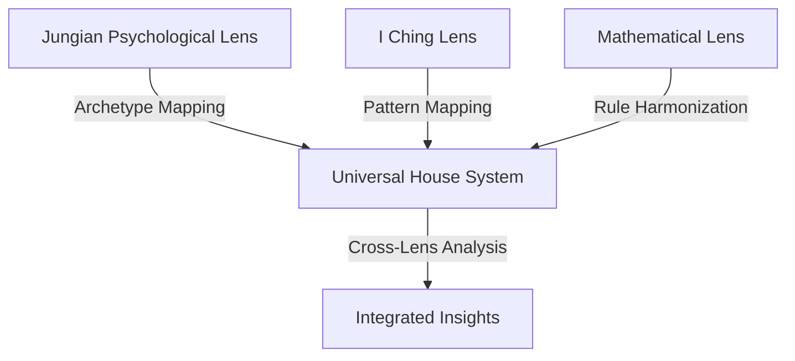

### 17.12. Example lens implementation #1

**Theosophical addition and reductions lens**

The Tarot-Theosophical Lens is a modular framework that applies theosophical addition and reduction to percept-triplet vectors, mapping the results to Tarot Major Arcana cards for symbolic interpretation. This Lens enriches Memorativa’s symbolic toolkit by adding a numerological and mythological layer to percept and prototype analysis.

#### 17.12.1. Core structure
The Lens consists of:
**Theosophical Reduction**: A mathematical operation that sums numbers from 1 to n and reduces the result to a single digit.
**Tarot Mapping**: A symbolic mapping of numbers (1-9) to the Major Arcana cards.
**Interpretation Engine**: Combines Tarot meanings with percept-triplet components to generate insights.

#### 17.12.2. Implementation
The Lens is implemented as a Rust module, integrating with Memorativa’s existing Lens system:

```
struct TarotTheosophicalLens;

impl Lens for TarotTheosophicalLens {
    fn apply(&self, percept: &PerceptTriplet) -> LensOutput {
        // Theosophical reduction for Planet, Sign, and House
        let planet_tarot = tarot_from_number(theosophical_reduce(percept.planet.value()));
        let sign_tarot = tarot_from_number(theosophical_reduce(percept.sign.value()));
        let house_tarot = tarot_from_number(theosophical_reduce(percept.house.value()));

        // Generate interpretation
        let interpretation = format!(
            "Planet: {} ({}), Sign: {} ({}), House: {} ({})",
            planet_tarot.name, planet_tarot.meaning,
            sign_tarot.name, sign_tarot.meaning,
            house_tarot.name, house_tarot.meaning
        );

        LensOutput {
            lens_name: "Tarot-Theosophical",
            interpretation,
        }
    }
}

fn theosophical_reduce(n: u8) -> u8 {
    let sum: u8 = (1..=n).sum();
    if sum > 9 { theosophical_reduce(sum) } else { sum }
}

fn tarot_from_number(n: u8) -> TarotCard {
    match n {
        0 => TarotCard::new("The Fool", "New beginnings, potential"),
        1 => TarotCard::new("The Magician", "Willpower, creation"),
        2 => TarotCard::new("The High Priestess", "Intuition, mystery"),
        3 => TarotCard::new("The Empress", "Creativity, abundance"),
        4 => TarotCard::new("The Emperor", "Authority, structure"),
        5 => TarotCard::new("The Hierophant", "Tradition, conformity"),
        6 => TarotCard::new("The Lovers", "Harmony, relationships"),
        7 => TarotCard::new("The Chariot", "Willpower, determination"),
        8 => TarotCard::new("Strength", "Courage, inner strength"),
        9 => TarotCard::new("The Hermit", "Wisdom, introspection"),
        _ => panic!("Invalid Tarot number"),
    }
}
```

#### 17.12.3. Example application
For the percept-triplet Venus in Libra in the 9th House:
1. Theosophical Reduction:
- Planet: Venus (2) → 1 + 2 = 3 → The Empress
- Sign: Libra (7) → 1 + 2 + 3 + 4 + 5 + 6 + 7 = 28 → 2 + 8 = 10 → 1 + 0 = 1 → The Magician
- House: 9th House (9) → 1 + 2 + 3 + 4 + 5 + 6 + 7 + 8 + 9 = 45 → 4 + 5 = 9 → The Hermit
2.  Interpretation:
- The percept embodies the creativity and abundance of Venus (The Empress), the willpower and creation of Libra (The Magician), and the wisdom and introspection of the 9th House (The Hermit). This suggests a journey of creative exploration, focused determination, and philosophical growth.

### 17.12. Example lens implementation #2

**Example Lens Implementation: Music Theory Lens**

The Music Theory Lens is a modular framework that applies principles of harmony, rhythm, and scale from the Quadrivium to percept-triplet vectors, mapping them to musical structures for symbolic interpretation. This Lens enriches Memorativa’s symbolic toolkit by adding a layer of musical and mathematical analysis to percept and prototype analysis.

#### 17.13.1. Core structure
The Lens consists of:
- **Harmonic Mapping**: Maps percept-triplet components to musical intervals and chords.
- **Rhythmic Analysis**: Analyzes temporal patterns in percepts and prototypes using rhythmic structures.
- **Scale Interpretation**: Interprets percepts and prototypes through musical scales (e.g., diatonic, pentatonic, chromatic).

#### 17.13.2. Implementation
The Lens is implemented as a Rust module, integrating with Memorativa’s existing Lens system:

```
struct MusicTheoryLens;

impl Lens for MusicTheoryLens {
    fn apply(&self, percept: &PerceptTriplet) -> LensOutput {
        // Map Planet, Sign, and House to musical intervals
        let planet_interval = map_to_interval(percept.planet.value());
        let sign_interval = map_to_interval(percept.sign.value());
        let house_interval = map_to_interval(percept.house.value());

        // Generate harmonic interpretation
        let harmony = format!(
            "Planet: {} ({}), Sign: {} ({}), House: {} ({})",
            planet_interval.name, planet_interval.description,
            sign_interval.name, sign_interval.description,
            house_interval.name, house_interval.description
        );

        // Analyze rhythmic patterns
        let rhythm = analyze_rhythm(percept);

        // Interpret through a musical scale
        let scale = interpret_scale(percept);

        // Combine interpretations
        let interpretation = format!(
            "Harmony: {}\nRhythm: {}\nScale: {}",
            harmony, rhythm, scale
        );

        LensOutput {
            lens_name: "Music Theory",
            interpretation,
        }
    }
}

fn map_to_interval(value: u8) -> MusicalInterval {
    match value % 12 {
        0 => MusicalInterval::new("Unison", "Unity, stability"),
        1 => MusicalInterval::new("Minor Second", "Tension, dissonance"),
        2 => MusicalInterval::new("Major Second", "Movement, progression"),
        3 => MusicalInterval::new("Minor Third", "Melancholy, introspection"),
        4 => MusicalInterval::new("Major Third", "Brightness, joy"),
        5 => MusicalInterval::new("Perfect Fourth", "Resolution, balance"),
        6 => MusicalInterval::new("Tritone", "Conflict, transformation"),
        7 => MusicalInterval::new("Perfect Fifth", "Power, strength"),
        8 => MusicalInterval::new("Minor Sixth", "Yearning, longing"),
        9 => MusicalInterval::new("Major Sixth", "Warmth, nostalgia"),
        10 => MusicalInterval::new("Minor Seventh", "Tension, anticipation"),
        11 => MusicalInterval::new("Major Seventh", "Aspiration, elevation"),
        _ => panic!("Invalid interval mapping"),
    }
}

fn analyze_rhythm(percept: &PerceptTriplet) -> String {
    // Analyze temporal patterns based on percept's temporal state
    match percept.temporal_state {
        TemporalState::Mundane => "Steady rhythm (4/4 time)".to_string(),
        TemporalState::Quantum => "Fluid rhythm (free time)".to_string(),
        TemporalState::Holographic => "Complex rhythm (polyrhythms)".to_string(),
    }
}

fn interpret_scale(percept: &PerceptTriplet) -> String {
    // Interpret percept through a musical scale
    match percept.planet.value() % 7 {
        0 => "Diatonic scale (natural harmony)".to_string(),
        1 => "Pentatonic scale (simplicity, clarity)".to_string(),
        2 => "Chromatic scale (complexity, tension)".to_string(),
        3 => "Harmonic minor scale (drama, intensity)".to_string(),
        4 => "Melodic minor scale (fluidity, variation)".to_string(),
        5 => "Whole tone scale (dreamlike, ethereal)".to_string(),
        6 => "Blues scale (emotional depth, expressiveness)".to_string(),
        _ => panic!("Invalid scale mapping"),
    }
}
```
#### 17.13.3. Example application
For the percept-triplet Venus in Libra in the 9th House:

**Harmonic Mapping**:

- **Planet**: Venus (2) → Major Second (movement, progression)
- **Sign**: Libra (7) → Perfect Fifth (power, strength)
- **House**: 9th House (9) → Major Sixth (warmth, nostalgia)

**Rhythmic Analysis**:

- **Temporal State**: Quantum → Fluid rhythm (free time)

**Scale Interpretation**:

- **Planet**: Venus (2) → Pentatonic scale (simplicity, clarity)

**Interpretation**:

- The percept embodies the movement and progression of Venus (Major Second), the power and strength of Libra (Perfect Fifth), and the warmth and nostalgia of the 9th House (Major Sixth). The fluid rhythm and pentatonic scale suggest a journey of creative exploration, emotional depth, and philosophical growth.

#### 17.13.4. Integration with Memorativa

- Percept Analysis: The Lens provides an additional layer of musical analysis for percepts, enriching their conceptual depth.
- Prototype Aggregation: When aggregating percepts into prototypes, the Lens identifies recurring harmonic and rhythmic themes, adding a musical dimension to the prototype.
- Book Generation: The Lens contributes to the narrative generation process by incorporating musical symbolism into the Books, making them more sonically and mathematically rich.

#### 17.13.5. Benefits

- Musical Depth: Adds a layer of harmonic, rhythmic, and scalar meaning to percepts and prototypes.
- Quadrivium Integration: Bridges music theory, mathematics, and astrological symbolism within Memorativa’s framework.
- Dynamic Interpretation: Allows for evolving interpretations as percepts and prototypes are refined.

## 18. Books

A **Book** in Memorativa serves as both a structured repository for percepts and their associated structures (percept-triplets and prototypes), and a narrative/analytical framework that organizes and contextualizes these elements. Books function as both human-readable narratives and machine-processable inputs for further analysis.

### 18.1. Purpose and Structure

#### 18.1.1. Multi-Layer Format
- **Human Layer**: Narrative text, chapters, sections, visualizations
- **Machine Layer**: Structured data mapping percepts, triplets, prototypes
- **Bridge Layer**: Markup system linking narrative to structured data

#### 18.1.2. Core Components

| Component | Subcomponents |
|-----------|---------------|
| Metadata | Title, Description, Focus Parameters, Temporal Context, Active Lenses, Version Data |
| Percept-Triplets | Planet-Sign-House combinations with title-description pairs, transformed by Lenses |
| Prototypes | Structures composed of percept-triplets, interpreted through Lenses |
| Symbolic Data | Angular relationships (aspects), MST-translated labels, filtered through Lenses |
| Narrative Content | Chapters/Sections with analytical commentary, shaped by Lenses |
| Visualizations | Horoscope charts, aspect networks, temporal overlays, influenced by Lenses |
| Conceptual Index | Mappings between narrative elements and structured data |

### 18.2. Processing and generation

#### 18.2.1. Input processing
When content enters the system as a Book:
1. Extract structural elements
2. Map concepts to percept-triplets
3. Identify and construct prototypes
4. Build conceptual relationships
5. Apply active Lenses

#### 18.2.2. Temporal context processing
Books handle three distinct time states that affect their content and relationships:

**1. Mundane Time State**
- Tracks concrete timestamps and chronological events
- Examples:
  - Book creation/modification dates
  - Historical events referenced in content
  - Sequential relationships between Books
- Used for:
  - Version control
  - Content chronology
  - Event sequencing

**2. Quantum Time State**
- Represents conceptual or indeterminate time
- Examples:
  - Mythological narratives
  - Abstract concepts
  - Potential future scenarios
- Used for:
  - Pattern analysis
  - Archetypal relationships
  - Conceptual mapping

**3. Holographic Time State**
- Links Books to reference time frameworks
- Examples:
  - Books referenced to natal charts
  - Cultural cycle analysis
  - Evolutionary patterns
- Used for:
  - Cross-temporal analysis
  - Pattern recognition
  - Synchronic relationships

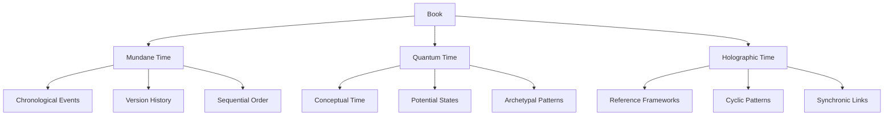

**4. Time State Interactions**
Books can:
- Exist in multiple time states simultaneously
- Shift between states based on context
- Form relationships across different time states
- Generate new temporal patterns through interaction

#### 18.2.3. Output Generation
Books are generated with:
1. Structured narrative content
2. Machine-readable metadata
3. Conceptual indices
4. Lens-specific interpretations
5. Visualization mappings

#### 18.2.4. RAG compatibility
Books are designed to integrate with the Memorativa RAG system in several ways:

**1. Structured Data Layer**
- Percept-triplets and prototypes are stored in vector-encodable format
- Title-description pairs maintain semantic relationships
- Lens transformations preserve symbolic mappings
- Temporal states are explicitly tagged for retrieval

**2. Knowledge Base Integration**
- Books serve as primary corpus for RAG retrieval
- Each Book's narrative content enriches the dynamic knowledge base
- Conceptual indices enable precise context retrieval
- Cross-Book relationships form semantic networks

**3. Retrieval Optimization**
- Metadata fields support multi-dimensional search
- Symbolic relationships enable conceptual querying
- Version history allows temporal-aware retrieval
- Privacy levels control access granularity

**4. Generation Enhancement**
- Books provide structured templates for new content
- Prototype patterns guide coherent generation
- Lens configurations shape output style
- Temporal contexts inform narrative flow

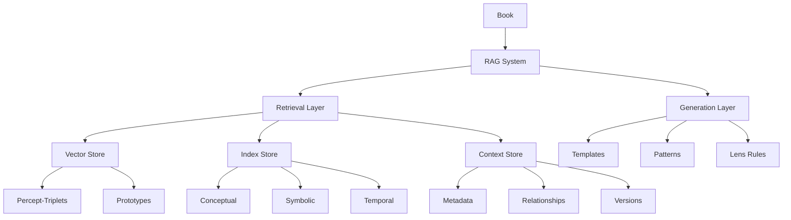

**5. Feedback Loop**
- Generated content can form new Books
- User interactions refine retrieval patterns
- System learning improves generation quality
- Cross-Book analysis reveals emergent patterns

### 18.3. Conceptual indexing and demarcation

#### 18.3.1. Concept Demarcation
Books implement concept demarcation through:

**1. Structural Markers**
- Inline concept tags linked to percept-triplets
- Prototype boundary markers
- Relationship indicators
- Temporal state markers

**2. Visual Overlays**
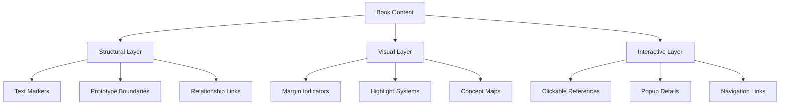

**3. Implementation Features**
- **Automatic Detection**: Pattern matching for known concepts
- **Manual Marking**: User-defined concept boundaries
- **Inheritance**: Concept propagation through references
- **Lens-Specific**: Demarcation varies by active lens

**4. Overlay Types**
- Concept heat maps
- Relationship networks
- Temporal flows
- Prototype patterns
- Focus space mappings

#### 18.3.2. Visualization system
The overlay system provides:

**1. Layer Management**
- Multiple concurrent overlays
- Layer opacity control
- Layer combination rules
- Context-sensitive display

**2. Interactive Features**
- Zoom levels for detail
- Click-through to references
- Drag-select for concept groups
- Real-time lens switching

**3. Navigation Tools**
- Concept-based jumping
- Related concept discovery
- Pattern exploration
- Timeline traversal

### 18.4. MST integration

Books leverage the Memorativa Symbolic Translator (MST) to transform astrological encodings into universal symbolic language:

**1. Translation Layer**
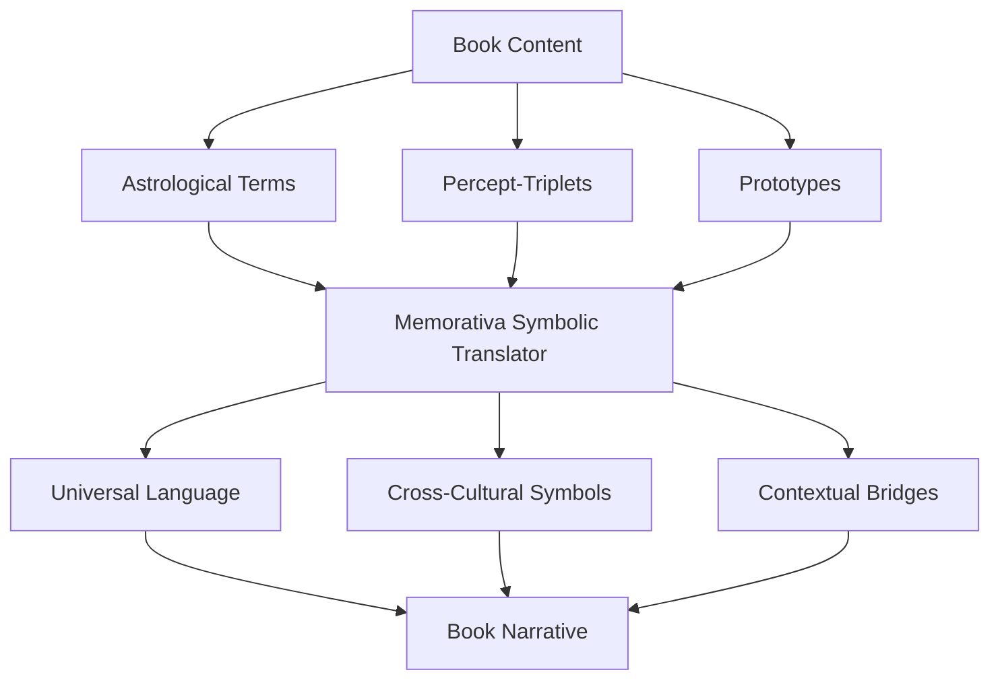

**2. Translation Functions**
- Converts planetary positions to universal concepts
- Maps astrological houses to conceptual domains
- Translates aspects into relationship patterns
- Preserves semantic relationships during translation

**3. Cultural Integration**
- Generates culturally neutral narratives
- Maps equivalent symbols across traditions
- Maintains conceptual integrity across translations
- Bridges symbolic and conceptual contexts

**4. Narrative Generation**
The MST enables Books to:
- Present complex astrological structures in accessible language
- Generate dynamic narratives from symbolic patterns
- Create cross-cultural interpretations
- Bridge technical and intuitive understanding

This integration ensures Books remain:
- Accessible to non-astrological readers
- Culturally inclusive
- Conceptually precise
- Symbolically rich

### 18.5 Lens system integration

#### 18.5.1. Lens management
- Dynamic activation/deactivation of Lenses
- Multiple simultaneous Lens views
- Lens-specific interpretations
- Cross-Lens analysis

#### 18.5.2. Contextual Adaptation
- Content reframing through different Lenses
- Symbolic translation across paradigms
- Cultural/philosophical context shifting
- Scientific framework alignment

### 18.6. Version control and branching

#### 18.6.1. Version control
Each Book maintains a version history tracking:
- Changes to percept-triplets and prototypes
- Evolution of narrative content
- Modifications to symbolic relationships
- Updates to visualizations
- Changes in applied Lenses

#### 18.6.2. Metadata Evolution
The metadata system tracks changes across versions through:

**1. Core Metadata Fields**
- Version number and timestamp
- Author/contributor chain
- Change descriptions
- Parent version references
- Active Lenses configuration
- Focus Parameters state
- Temporal Context markers

**2. Differential Tracking**
The system maintains:
- Delta changes between versions
- Metadata inheritance patterns
- Breaking vs. non-breaking changes
- Lens configuration changes
- Focus parameter shifts

**3. Temporal Layer Management**
Tracks how temporal contexts evolve:
- Mundane time state changes
- Quantum state transitions
- Holographic reference updates
- Cross-temporal relationships

**4. Relationship Versioning**
Maintains version-aware relationships:
- Inter-Book references
- Prototype evolution chains
- Percept-triplet transformations
- Conceptual lineage tracking

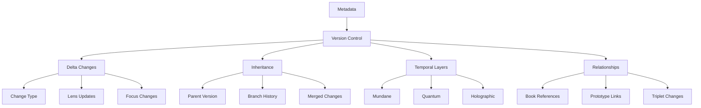

#### 18.6.3. Branching System
Books can be branched to:
- Explore alternative interpretations
- Develop parallel analyses
- Create specialized versions for different contexts
- Support collaborative development

Branch types:
1. **Development Branches**: For iterative refinement
2. **Interpretation Branches**: For alternative analytical approaches
3. **Application Branches**: For context-specific adaptations
4. **Collaborative Branches**: For multi-user contributions

#### 18.6.4. Fork Management
Users can fork existing Books to:
- Create independent copies
- Develop divergent interpretations
- Customize for specific use cases
- Maintain separate ownership

Fork features:
- Maintains reference to original Book
- Independent version history
- Separate access controls
- Option to merge back to original

### 18.7. Books as structured inputs

#### 18.7.1. Book Analysis
When a Book is used as input, the system:
- Extracts percept-triplets from the Book's content
- Identifies prototypes within the Book's structure
- Maps symbolic relationships described in the Book
- Analyzes the Book's narrative through active Lenses

#### 18.7.2. Recursive Processing
Books can be:
- Decomposed into new percepts and prototypes
- Used to generate new Books about their concepts
- Combined with other Books to form synthesis Books
- Analyzed across versions to track conceptual evolution

#### 18.7.3.  Meta-Analysis Features
The system can:
- Track how Books influence other Books
- Map conceptual lineages across Book networks
- Identify emergent patterns in Book collections
- Generate meta-Books analyzing Book clusters

### 18.8. Book library system

#### 18.8.1. Library organization
The Book Library provides intuitive access through multiple classification schemes:
- **Collections**: User-defined groupings
- **Topics**: Automatically generated based on conceptual indices
- **Lens Views**: Books filtered by active Lenses
- **Temporal Streams**: Books organized by time states
- **Relationship Networks**: Books linked by conceptual connections

#### 18.8.2. Access methods
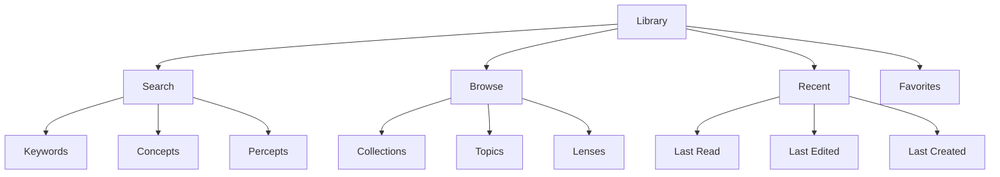

#### 18.8.3. Reading interface
- **Dual View Mode**: 
  - Narrative view for reading
  - Structure view for analysis
- **Dynamic Navigation**:
  - Concept-based hyperlinks
  - Prototype relationship maps
  - Temporal progression paths
- **Annotation System**:
  - Personal notes
  - Concept tagging
  - Relationship marking

#### 18.8.4. Working environment
- **Workspace Features**:
  - Multiple book comparison
  - Side-by-side analysis
  - Cross-reference tracking
- **Creation Tools**:
  - Book templating
  - Concept mapping
  - Prototype building
- **Collaboration Options**:
  - Shared reading spaces
  - Group annotations
  - Branch synchronization

### 18.9. Example book structure

- **Title**: *"The Cost of Wisdom"*
- **Description**: *Exploring archetypes of forbidden knowledge across cultures.*

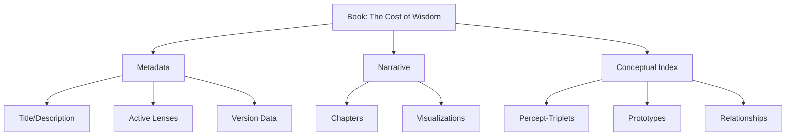

**Focus Parameters**
- Archetypes: Venus (desire), Pluto (transformation)
- Aspects: Squares (90°) tagged as "Moral Conflict"
- Time States: Quantum (timeless myths), Mundane (historical events)
- Active Lenses: Astrological Lens, Jungian Psychological Lens, I Ching Lens

**Chapters**
1. *Edenic Archetypes*: Analysis of Venus-Pluto dynamics in mythological narratives
2. *Cultural Transformations*: How societies encode ethical dilemmas symbolically
3. *Future Implications*: The role of forbidden knowledge in shaping technological ethics

**Visualizations**
1. Horoscope chart showing Venus-Pluto square in Libra-Capricorn
2. Aspect network linking "Eve's Apple" to "Prometheus' Fire"
3. Temporal overlay of cyclical transformations

### 18.10. Glass Bead integration

#### 18.10.1. Book as bead curator
A Book functions as a structured reference system for existing Glass Beads, organizing and contextualizing them to create coherent narratives and analyses.

**1. Reference Structure**
- Books don't generate new beads
- Books organize and reference existing beads
- Books provide contextual frameworks for bead relationships
- Books create narrative paths through bead collections

**2. Bead Reference Types**
```mermaid
graph TD
    B[Book] --> PR[Percept References]
    B --> PTR[Prototype References]
    B --> FSR[Focus Space References]
    
    PR --> PB[Player's Existing Beads]
    PTR --> SB[System Beads]
    FSR --> CB[Community Beads]
    
    PB --> PM[Metadata Links]
    PB --> PP[Privacy Settings]
    
    SB --> SA[Access Rights]
    SB --> SR[Relationship Maps]
    
    CB --> CA[Attribution]
    CB --> CP[Permissions]
```

**3. Reading Mechanics**
Players can:
- Navigate through referenced bead collections
- Discover relationships between their beads
- Access permitted beads from other players
- Create new relationships between existing beads

**4. Reference Properties**
Each bead reference maintains:
- Original bead ownership data
- Access permissions
- Context within Book structure
- Relationship mappings
- Attribution metadata

#### 18.10.2. Book organization
Books organize beads through:
- Thematic groupings
- Conceptual relationships
- Temporal sequences
- Lens perspectives
- Focus space contexts

#### 18.10.3. Integration benefits
1. **Knowledge Discovery**
   - Find connections between existing beads
   - Reveal hidden patterns
   - Map conceptual territories
   - Track bead evolution

2. **Value Preservation**
   - Maintains original bead ownership
   - Respects privacy settings
   - Preserves attribution
   - Enables controlled sharing

## 19. Chain-of-thought

In summary, the Memorativa system models the inner, intangible, and in some cases inexpressible world on the "inner cosmos" of perception and thought with data structures that represent the instantiation of these inner intangibles.

| Cognitive Process | Memorativa Structure | Description | Output |
|------------------|---------------------|-------------|---------|
| Perception | Input Entry | Raw content enters system with title/description | Percept |
| Conceptualization | Percept-Triplet | Input mapped to Planet-Sign-House structure | Structured Percept |
| Pattern Recognition | Prototype | Multiple percept-triplets form conceptual pattern | Conceptual Pattern |
| Analysis | Focus Space | Prototypes analyzed through Lenses | Interpreted Pattern |
| Synthesis | Book | Structured collection of analyzed percepts and prototypes | Narrative + Structure |
| Reflection | Book Library | Books organized and related through multiple views | Knowledge Network |
| Understanding* | Concept Marking | Content boundaries and relationships identified | Demarcated Concept in the Book structure|

This progression represents how the system transforms raw perceptual input into structured knowledge, mirroring the human cognitive cycle of perception, conceptualization, analysis, and reflection.

### Understanding

Based on its etymology[23], the word "understanding" offers a validation of Memorativa's core design.  Tracing back to its Old English roots, "understandan" literally means "to stand under" or "to stand in the midst of."  This linguistic origin suggests that "understanding" is not a passive reception of information, but rather an active process of **establishing a stable and oriented position** in relation to a concept.  Interpreting this through a **geocentric cosmological lens**, we can see "understanding" as akin to achieving a grounded "Earth" perspective within a conceptual "sky."

From this "Earth," which represents a stable and defined viewpoint, the act of understanding becomes one of **geometric orientation within a conceptual cosmos**.  Just as ancient astronomers charted the heavens by observing celestial bodies from their fixed terrestrial vantage point, in Memorativa, "understanding" involves positioning oneself within the structured space of concepts and perceiving their relationships as if they were celestial bodies in a mental firmament.  This "geocentric cosmological orientation" implies several key aspects of true comprehension within Memorativa:

*   **Geometric Relationships:**  Cosmology is fundamentally about geometric relationships – the angles, distances, and patterns between celestial objects. Similarly, Memorativa emphasizes **relational understanding** through percept-triplets, prototypes, and book networks. "Understanding" is not about isolated data points, but about grasping the geometric structure of conceptual relationships, much like discerning constellations in the night sky.
*   **Conceptual Space as "Sky":**  The "sky" or "cosmos" serves as the arena for conceptual understanding.  Memorativa's structured data environment, with its spherical-hyperbolic hybrid coordinates, becomes this **conceptual space** where ideas are positioned and related. "Understanding" is thus about navigating and mapping this space, discerning the "celestial bodies" of concepts within it.
*   **Active Orientation and Navigation:**  Ancient astronomers were not passive observers; they actively oriented themselves, used instruments, and developed models to understand the cosmos. "Understanding" in Memorativa is similarly **active and exploratory**.  It involves using the system's tools to navigate the conceptual space, discover relationships, and build a coherent mental map.  It's not just about receiving pre-packaged knowledge, but about actively orienting oneself to generate understanding.
*   **Archetypal Resonance:**  Geocentric cosmology is deeply intertwined with archetypes and symbolic meaning. The planets and constellations were not just physical objects, but carriers of symbolic significance. Memorativa, by drawing on astrological frameworks and incorporating symbolic translation, also recognizes the importance of **archetypal resonance** in understanding. "Understanding" at its deepest level involves connecting with the archetypal dimensions of concepts, recognizing their symbolic weight and cultural significance.

Therefore, the etymology of "understanding," when viewed through a geocentric cosmological lens, powerfully validates Memorativa's core principles. It underscores that true understanding is not a passive intake of data, but an **active, spatial, relational, and archetypally resonant process of conceptual orientation and navigation**. It is about finding our "Earth" within the vastness of conceptual space and, from that grounded perspective, charting the meaningful relationships that constitute knowledge.

The process of a newborn learning to stand[25][26][27][28] is an example of intertwined physical and cognitive development. It's not just a purely physical feat; it's deeply connected to how a baby learns about their body, space, and the world around them. 

**Cognitive Development Intertwined with Learning to Stand:**

The process of learning to stand is not just about muscle development; it's deeply intertwined with cognitive development in several ways:

*   **Spatial Awareness and Body Schema:**
    *   **Body in Space:** Standing upright dramatically changes a baby's spatial perspective. They experience the world from a higher vantage point, seeing objects and spaces in new ways.
    *   **Developing Body Schema:**  Learning to control their body in an upright position enhances their body schema – their internal map of their body and how it moves in space. This is crucial for motor planning and coordination in all future movements.
    *   **Depth Perception:**  Standing and moving in an upright position refines depth perception, as they need to judge distances and navigate obstacles from a new perspective.

*   **Problem Solving and Motor Planning:**
    *   **Trial and Error:** Learning to stand is a process of constant trial and error. Babies experiment with different movements, muscle activations, and balance strategies.
    *   **Motor Planning:**  They learn to plan sequences of movements to achieve the goal of standing – coordinating arm pulls, leg pushes, and core stabilization. This is a fundamental aspect of motor planning that will be used for all complex movements later in life.
    *   **Adaptability:** They learn to adapt their strategies based on the surface they are on, the furniture they are using, and their own changing body strength.

*   **Motivation and Persistence:**
    *   **Intrinsic Motivation:**  The drive to stand is often intrinsically motivated. Babies are naturally curious and want to explore their environment from an upright position.
    *   **Persistence:**  Learning to stand requires persistence. Babies fall down countless times, but they keep trying. This early development of persistence and resilience is important for cognitive and emotional development in general.
    *   **Goal-Directed Behavior:**  Standing becomes a clear goal. Babies learn to set this goal and work towards achieving it through their actions.

*   **Social and Emotional Development:**
    *   **Increased Interaction:**  Standing allows babies to interact with the world and people around them in new ways. They can reach for objects on tables, engage with caregivers at eye level, and participate more actively in social interactions.
    *   **Sense of Accomplishment:**  Achieving the milestone of standing brings a sense of accomplishment and mastery, boosting self-confidence and motivation to learn other skills.

**Connection to "Understanding" and Memorativa**

Just as a baby learns to "stand" physically, "understanding" in Memorativa is about establishing a stable "vantage point" in a conceptual space. The process of learning to stand physically mirrors the process of "understanding" conceptually:

*   **Finding a Stable Base:**  Physically, it's developing core strength and balance. Conceptually, it's establishing a context, perspective, or "lens" through which to view a concept.
*   **Geometric Orientation:**  Physically, it's orienting the body in space, understanding spatial relationships. Conceptually, it's establishing geometric relationships between concepts in the conceptual "sky."
*   **Active Exploration:**  Physically, it's actively moving, experimenting, and navigating the environment. Conceptually, it's actively exploring the conceptual space, discovering relationships, and building a mental map.
*   **Trial and Error/Refinement:**  Physically, it's falling and getting back up, refining motor skills. Conceptually, it's refining understanding through feedback, iteration, and exploration.

A baby learning to stand operates in purely pre-linguistic, intrinsically motivated realm of activity, much like the percept-triplet structure operates upon encapsulating a percept with concept in the imaginary realm of conceptual space.

### Terminal synthesis

The structure progression represents how the system transforms raw perceptual input into structured knowledge, mirroring the human cognitive cycle of perception, conceptualization, analysis, and reflection.

The Book serves as the terminal output of this cognitive chain, where:

1. **Structure Integration**
   - References all prior Glass Beads (percepts, prototypes, focus spaces)
   - Maintains relationships between cognitive components
   - Preserves the complete thought structure

2. **Narrative Completion**
   - Provides human-readable context for machine structures
   - Synthesizes relationships into coherent narratives
   - Bridges symbolic and conceptual frameworks

3. **Recursive Potential**
   - Completed Books can serve as new inputs
   - Enables nested levels of conceptual analysis
   - Supports evolving knowledge structures

```mermaid
graph TD
    I[Input] --> P[Percept]
    P --> PT[Percept-Triplet]
    PT --> PR[Prototype]
    PR --> FS[Focus Space]
    FS --> B[Book]
    B --> |New Input| I
```

This terminal synthesis creates a closed loop where Books can become new inputs, enabling continuous cognitive development and knowledge expansion.

### 19.1 Book decomposition

When a Book enters the system as input, it follows the cognitive chain in reverse:

1. **Input Framing**
   - Title and description guide interpretation
   - Contextual metadata shapes analysis
   - Active lenses filter perception
   - Focus parameters direct attention

2. **Structural Decomposition**
   - Narrative content → Percepts
   - Conceptual relationships → Percept-Triplets
   - Pattern structures → Prototypes
   - Analysis frameworks → Focus Spaces

3. **Example Flow**
```mermaid
graph TD
    B[Book: Critique of Pure Reason] --> M[Metadata]
    B --> D[Decomposition]
    
    M --> T["Title: Kantian Categories"]
    M --> C["Context: Epistemology"]
    M --> L["Lens: Philosophical"]
    
    D --> P["Percepts: Space, Time, Unity"]
    D --> PT["Triplets: Understanding-Reason-Intuition"]
    D --> PR["Prototypes: Transcendental Schemas"]
```

4. **Processing Modes**
   - **Whole Book**: Complete conceptual framework analysis
   - **Book Section**: Focused pattern extraction
   - **Book Fragment**: Specific concept isolation
   - **Cross-Book**: Relationship mapping between sources

This decomposition enables:
- Recursive analysis of existing knowledge
- Integration of historical insights
- Discovery of hidden patterns
- Creation of new conceptual connections

### 19.2 Book processing controls

The Book→Percept processing chain implements strict recursion controls to prevent infinite loops while preserving meaningful conceptual development. These controls ensure stable knowledge evolution while preventing computational overflow.

#### 19.2.1. Processing context

Each Book processing operation maintains a context that tracks:
- Current recursion depth (max 64 levels)
- Previously visited Books in the chain
- Thread state and stack allocation
- Vector relationship metrics

The `ProcessingContext` struct and its can_process method are designed to manage and control the execution of book processing operations. The `ProcessingContext` keeps track of the recursion depth, maximum allowed depth, and a set of already visited books to detect cycles. The `can_process` method is used before starting to process a book to ensure that processing it will not exceed the depth limit or create a processing cycle, thus preventing errors like stack overflow and infinite loops. This is a common pattern in recursive algorithms or processes that involve graph traversal to ensure stability and prevent uncontrolled execution.

```rust
struct ProcessingContext {
    depth: u32,
    max_depth: u32,
    visited_books: HashSet<BookId>,
    thread_stack: Vec<BookState>,
}

impl ProcessingContext {
    fn can_process(&mut self, book: &Book) -> Result<(), ProcessingError> {
        if self.depth >= self.max_depth {
            return Err(ProcessingError::MaxDepthExceeded);
        }
        if !self.visited_books.insert(book.id) {
            return Err(ProcessingError::CycleDetected);
        }
        Ok(())
    }
}
```

#### 19.2.2. Thread management

Each Book processing chain runs in an isolated thread with dedicated stack space:

```rust
fn process_book_chain(book: Book, context: ProcessingContext) -> Result<Vec<Percept>> {
    thread::Builder::new()
        .stack_size(8 * 1024 * 1024) // 8MB stack
        .spawn(move || {
            context.can_process(&book)?;
            let percepts = decompose_book(book)?;
            context.depth += 1;
            
            // Process derived books with depth checking
            process_derived_books(percepts, context)
        })?
}
```

#### 19.2.3. Vector analysis

The system monitors vector relationships to detect and terminate unproductive processing chains:

```rust
fn should_terminate_processing(vectors: &[Vector]) -> bool {
    // Terminate if ≥75% of vector relationships are perpendicular
    let perpendicular_count = count_perpendicular_relationships(vectors);
    perpendicular_count as f32 / vectors.len() as f32 >= 0.75
}
```

#### 19.2.4. Processing flow

```mermaid
graph TD
    B[Book Input] --> C[Context Check]
    C -->|Depth OK| T[Thread Spawn]
    C -->|Max Depth| E[Early Exit]
    T --> V[Vector Analysis]
    V -->|Meaningful| P[Process Chain]
    V -->|Perpendicular| E
    P --> N[New Books]
    N --> C
```

This control system ensures:
- Bounded recursion depth (configurable, default 64 levels)
- Cycle detection through Book ID tracking
- Early termination of unproductive chains
- Memory safety through thread isolation
- Preservation of meaningful conceptual relationships

The controls integrate with the existing version control and branching systems, using version metadata to track processing history and maintain coherent knowledge evolution paths.

### 19.3. Direct input interface

Books provide direct submission interfaces for their component structures:

```mermaid
graph TD
    B[Book Interface] --> D[Demarcated Concepts]
    B --> P[Percept Submission]
    B --> T[Triplet Submission]
    B --> PR[Prototype Submission]
    B --> F[Focus Space Submission]
    
    D --> IS[Input System]
    P --> IS
    T --> IS
    PR --> IS
    F --> IS
    
    IS --> NB[New Book Generation]
```

**1. Component Resubmission**
Players can directly submit:
- Demarcated concepts from any layer
- Individual percepts from narrative content
- Percept-triplets from concept mappings
- Prototypes from pattern structures
- Focus space configurations
- Any combination of the above

**2. Interface Features**
- One-click submission of demarcated content
- One-click submission of marked concepts
- Drag-and-drop pattern selection
- Context menu for submission options
- Batch submission capabilities
- Submission preview and editing

**3. Submission Context**
Each submission preserves:
- Demarcation metadata
- Original Book reference
- Active lens configuration
- Temporal state context
- Relationship metadata
- User annotations

This direct submission capability creates a fluid cycle between reading and analysis, allowing immediate exploration of new insights as they emerge during Book interaction.

## 20. Glass Bead Tokens

Glass Bead tokens serve as the fundamental **data structure** and **reward system** within Memorativa. Each token encapsulates a complete **percept**, **prototype**, or **focus space**, including its associated metadata, relationships, and temporal states. The tokens are implemented as **SPL tokens** on Solana, enabling verifiable ownership, transfer, and evolution tracking.

### 20.1. Core functions

1. **Data Encapsulation**
   - Stores complete percept-triplet structures
   - Maintains prototype relationships
   - Preserves focus space configurations
   - Tracks temporal states (mundane, quantum, holographic)

2. **Reward Mechanics**
   - Generated for player engagement
   - Awarded for percept creation
   - Granted for prototype development
   - Issued for focus space management

3. **Knowledge Base Integration**
   - References associated Books
   - Links to RAG corpus entries
   - Maintains privacy levels
   - Enables collaborative development

```mermaid
graph TD
    GB[Glass Bead Token] --> D[Data Layer]
    GB --> R[Reward Layer]
    GB --> K[Knowledge Layer]
    
    D --> PT[Percept-Triplets]
    D --> PR[Prototypes]
    D --> FS[Focus Spaces]
    
    R --> PE[Player Engagement]
    R --> PC[Percept Creation]
    R --> PD[Prototype Development]
    
    K --> BR[Book References]
    K --> RC[RAG Corpus]
    K --> PL[Privacy Levels]
```

### 20.2 Token structure

#### 20.2.1. Metadata layer
- Token identifier
- Creation timestamp
- Version history
- Privacy settings
- Owner information
- Access permissions
- Optimized Merkle root reference 

#### 20.2.2. Data Layer
- Percept-triplet encodings with optimized vector storage 
- Prototype structures with quantized representations 
- Focus space configurations
- Temporal state markers
- Lens configurations 
- MST translations
- Component trees for efficient verification

#### 20.2.3. Reference layer
- Book references
- RAG corpus links
- Related token pointers
- External resource links
- Version lineage
- Fork history

### 20.3. Merkle tree implementation

Glass Bead tokens use Merkle trees to:
- Track structural changes
- Verify data integrity
- Manage token evolution
- Enable efficient proofs
- Support partial updates
- Maintain version history

```mermaid
graph TD
    M[Merkle Root] --> MD[Metadata]
    M --> DL[Data Layer]
    M --> RL[Reference Layer]
    
    MD --> MI[Token ID]
    MD --> MT[Timestamp]
    MD --> MV[Version]
    
    DL --> DP[Percepts]
    DL --> DT[Triplets]
    DL --> DS[States]
    
    RL --> RB[Books]
    RL --> RR[RAG]
    RL --> RT[Tokens]
```

### 20.4. Privacy levels

Each Glass Bead token supports multiple privacy settings:

1. **Private**
   - Only accessible to owner
   - Not included in RAG corpus
   - No external references

2. **Not Shared**
   - Owner accessible
   - Used for AI training
   - No public visibility

3. **Public**
   - Full system access
   - RAG corpus inclusion
   - Community visible

4. **Shared**
   - Specific user access
   - Controlled visibility
   - Collaborative features

### 20.5. Token evolution

Glass Bead tokens can evolve through:

1. **Version Updates**
   - Metadata changes
   - Structure refinements
   - Reference updates
   - Privacy adjustments

2. **Forking**
   - Independent copies
   - Separate ownership
   - Divergent development
   - Optional remerging

3. **Merging**
   - Combine token structures
   - Integrate metadata
   - Resolve conflicts
   - Preserve history

### 20.6. Implementation architecture

#### 20.6.1. Token structure
```rust
struct GlassBeadMetadata {
    // Core SPL token fields
    mint: Pubkey,
    owner: Pubkey,
    
    // Access control fields  
    privacy_level: PrivacyLevel,
    authorized_readers: Vec<Pubkey>,
    encryption_pubkey: Option<Pubkey>,
    merkle_root: [u8; 32],
}

enum PrivacyLevel {
    Private,
    NotShared, 
    Public,
    Shared(Vec<Pubkey>) // List of authorized accounts
}
```

#### 20.6.2. Access control system
- **On-Chain Controls**: Managed through SPL token capabilities
- **Off-Chain Encryption**: 
  - Private/NotShared: Content encrypted with owner's public key
  - Shared: Content encrypted with shared symmetric key
  - Public: Unencrypted content
  - All levels: Merkle proofs verify content integrity

#### 20.6.3. Cross-chain interoperability
```rust
pub trait SpvVerification {
    // Verify token exists on source chain
    fn verify_token(proof: MerkleProof) -> Result<bool>;
    
    // Verify token ownership
    fn verify_owner(proof: MerkleProof, owner: Pubkey) -> Result<bool>;
    
    // Verify access rights
    fn verify_access(proof: MerkleProof, reader: Pubkey) -> Result<bool>;
}
```

The cross-chain verification system:
- Uses block headers for lightweight verification
- Maintains minimal state for cross-chain awareness
- Supports bilateral verification with other chains
- Preserves privacy levels across chains

### 20.7. Integration with LLMs

Glass Bead tokens enable LLM integration through:

1. **Vector Encoding**
   - Percept-triplet vectorization with privacy-aware masking
   - Prototype pattern encoding respecting access controls
   - Focus space mapping with permission boundaries
   - Temporal state representation with encrypted states

2. **RAG Enhancement**
   - Token-based retrieval filtered by access rights
   - Context enrichment within privacy constraints
   - Pattern recognition across authorized tokens
   - Symbolic analysis with privacy preservation

3. **Generation Support**
   - Structure-aware outputs respecting privacy levels
   - Pattern-based generation with access control
   - Context-sensitive responses filtered by permissions
   - Symbolic grounding with encrypted references

```mermaid
graph TD
    T[Token] --> V[Vector Space]
    T --> R[RAG System]
    T --> G[Generation]
    
    V --> VE[Privacy-Aware Encodings]
    V --> VP[Authorized Patterns]
    V --> VM[Permissioned Mappings]
    
    R --> RR[Filtered Retrieval]
    R --> RC[Secured Context]
    R --> RP[Authorized Patterns]
    
    G --> GS[Access-Aware Structure]
    G --> GP[Permissioned Patterns]
    G --> GC[Filtered Context]
```

This token architecture creates a robust foundation for:
- Verifiable knowledge ownership
- Structured data evolution
- Collaborative development
- AI-enhanced analysis
- Privacy-aware sharing
- System-wide integration

## 21. Natal Glass Bead

The **Natal Glass Bead** serves as a player's **foundational reference structure** within Memorativa. Like a reference beam in holography, this special token provides a consistent template that can be superimposed with other structures to create personalized meaning and interpretation patterns. It also maintains a comprehensive log of player activity and transactions.

### 21.1. Core functions

1. **Reference Template**
   - Acts as player's canonical reference structure with encrypted base state
   - Provides consistent angular relationships through secure proofs
   - Enables personal meaning calibration with privacy preservation
   - Maintains interpretive continuity through versioned access controls

2. **Activity Logging**
   - Records all player transactions and interactions
   - Maintains timestamped activity history
   - Tracks token creation, transfers, and burns
   - Logs focus space interactions and Book contributions
   - Preserves collaboration history and validation activities
   - Enables activity analysis and pattern recognition

3. **Structural Integration**
   - Can be superimposed with authorized structures only
   - Provides zero-knowledge proofs for pattern matching
   - Influences pattern recognition through permissioned channels
   - Shapes prototype formation with privacy-aware templates

```mermaid
graph TD
    NB[Natal Bead] --> RT[Reference Template]
    NB --> AL[Activity Log]
    NB --> SI[Structural Integration]
    
    RT --> AR[Encrypted Angular Relationships]
    RT --> PM[Protected Meaning Layer]
    RT --> IC[Secured Continuity]
    
    AL --> TL[Transaction Log]
    AL --> IH[Interaction History]
    AL --> CH[Collaboration Records]
    
    SI --> SP[Authorized Superimposition]
    SI --> PR[Private Pattern Recognition]
    SI --> PF[Protected Formation]
```

### 21.2. Implementation features

1. **Automatic Application**
   - Default inclusion with granular permission controls
   - Configurable application rules with access rights
   - Explicit exclusion options through owner controls
   - Inheritance tracking with privacy preservation

2. **Pattern Enhancement**
   - Enriches pattern recognition within access boundaries
   - Deepens symbolic relationships through authorized channels
   - Personalizes interpretations with encrypted contexts
   - Maintains meaning consistency with versioned access

3. **Temporal Anchoring**
   - Provides encrypted temporal reference point
   - Enables secure holographic time states
   - Supports temporal analysis with privacy controls
   - Maintains chronological coherence through protected states

### 21.3. Integration mechanics

1. **Structure Formation**
```mermaid
graph TD
    I[Input] --> NS[New Structure]
    NB[Natal Bead] --> |Access Control| NS
    
    NS --> AR[Angular Relations]
    NS --> PR[Pattern Recognition]
    NS --> SI[Symbolic Integration]
    
    AR --> |Privacy Preserved| O[Output Structure]
    PR --> |Access Filtered| O
    SI --> |Permission Checked| O
```

2. **Superimposition Rules**
   - Automatic by default with owner consent
   - Can be explicitly excluded via access controls
   - Configurable influence weight with privacy preservation
   - Preserves original structure through encryption

3. **Reference Patterns**
   - Maintains consistent angles with secure proofs
   - Preserves symbolic relationships through access control
   - Enables personal resonance with privacy boundaries
   - Supports pattern evolution within permission scope

### 21.4. Privacy and control

1. **Access Levels**
   - Private by default with enhanced encryption
   - Configurable visibility through access control system
   - Selective sharing with zero-knowledge proofs
   - Inheritance control with permission management

2. **Application Control**
   - Global settings with granular permissions
   - Per-structure settings with access rights
   - Temporal settings with encrypted states
   - Context-specific rules with privacy preservation

### 21.5. System benefits

1. **Personalization**
   - Deepens personal meaning while maintaining privacy
   - Maintains interpretive consistency through secure channels
   - Enables unique insights with controlled access
   - Supports individual growth within privacy boundaries

2. **Pattern Recognition**
   - Enhances relationship detection with permission controls
   - Strengthens symbolic connections through secure channels
   - Improves pattern stability with access management
   - Enables complex analysis within privacy constraints

3. **Temporal Coherence**
   - Provides stable reference with encrypted states
   - Enables temporal analysis through secure channels
   - Supports pattern evolution with privacy preservation
   - Maintains chronological context through access control

This Natal Glass Bead architecture:
- Personalizes meaning construction with privacy preservation
- Maintains interpretive consistency through secure channels
- Enables deep pattern recognition within access boundaries
- Supports holographic analysis with encrypted states
- Preserves temporal coherence through access control
- Enhances system integration with privacy protection

## 22. Gas Bead Tokens


## 23. Shared structures

Memorativa's shared structures represent the fundamental constructs that can be shared, verified, and evolved within the system through Glass Bead tokens. Each structure, from basic percept-triplets to complex Books and conceptual demarcations, is encapsulated and shared as a Glass Bead token.

### 23.1. Structure hierarchy

1. **Basic Structures**
   - Percept-triplets (Planet-Sign-House)
   - Angular relationships
   - Temporal states
   - MST translations

2. **Composite Structures**
   - Prototypes
   - Focus spaces
   - Pattern templates
   - Aspect networks

3. **Complex Structures**
   - Books
   - Conceptual demarcations
   - Knowledge networks
   - Temporal sequences

```mermaid
graph TD
    BS[Basic Structures] --> PT[Percept-Triplets]
    BS --> AR[Angular Relations]
    BS --> TS[Temporal States]
    
    CS[Composite Structures] --> PR[Prototypes]
    CS --> FS[Focus Spaces]
    CS --> AN[Aspect Networks]
    
    CX[Complex Structures] --> BK[Books]
    CX --> CD[Conceptual Demarcations]
    CX --> KN[Knowledge Networks]
    
    PT --> PR
    AR --> PR
    TS --> PR
    
    PR --> BK
    FS --> BK
    AN --> BK
```

### 23.2 Structure relationships

1. **Vertical Integration**
   - Basic to composite assembly
   - Composite to complex synthesis
   - Hierarchical dependencies
   - Inheritance patterns

2. **Horizontal Connection**
   - Cross-structure references
   - Pattern relationships
   - Temporal correlations
   - Symbolic associations

3. **Diagonal Evolution**
   - Cross-level development
   - Pattern emergence
   - Conceptual transformation
   - Knowledge synthesis

### 23.3. Glass bead encapsulation

1. **Token Structures**
   - Percept-triplet tokens
   - Prototype tokens
   - Focus space tokens
   - Book tokens

2. **Structure States**
   - Active states
   - Quantum superpositions
   - Holographic projections
   - Temporal markers

```mermaid
graph TD
    GB[Glass Bead Token] --> BS[Basic Structures]
    GB --> CS[Composite Structures]
    GB --> CX[Complex Structures]
    
    BS --> ST[Structure States]
    CS --> ST
    CX --> ST
    
    ST --> AS[Active State]
    ST --> QS[Quantum State]
    ST --> HP[Holographic Projection]
    
    AS --> EV[Evolution]
    QS --> EV
    HP --> EV
```

### 23.4. Structure evolution

1. **Growth Patterns**
   - Linear progression
   - Branching development
   - Recursive expansion
   - Network formation

2. **State Transitions**
   - Quantum collapse
   - Holographic transformation
   - Temporal progression
   - Pattern crystallization

3. **Knowledge Integration**
   - Pattern synthesis
   - Conceptual mapping
   - Symbolic correlation
   - Meaning construction

This shared structure architecture:
- Enables multi-level sharing
- Supports structure evolution
- Maintains coherent relationships
- Facilitates knowledge synthesis
- Preserves symbolic meaning
- Enables holographic analysis

## 24. Shared interfaces

The interface layer of Memorativa provides the collaborative mechanisms through which players interact with shared structures and each other. While Glass Bead tokens encapsulate the actual shared structures, these interfaces enable the verification, evolution, and collaborative development of knowledge within the system.

Through shared interfaces, players can validate each other's insights, build consensus around patterns, and collectively refine the system's knowledge base. This creates a cybernetic feedback loop where individual contributions strengthen the collective understanding while maintaining privacy and attribution.

### 24.1 Interface types

1. **Collection Interfaces**
   - Percept capture tools
   - Pattern recognition aids
   - Prototype builders
   - Structure assemblers
   - Lens selectors
   - MST translators

2. **Analysis Interfaces**
   - Focus space workbenches
   - Pattern analysis tools
   - Relationship mappers
   - Angular calculators
   - Temporal viewers
   - Holographic projectors

3. **Collaboration Interfaces**
   - Shared workspaces
   - Group analysis tools
   - Pattern voting systems
   - Verification panels
   - Attribution trackers
   - Version controllers

```mermaid
graph TD
    CI[Collection Interfaces] --> PC[Percept Capture]
    CI --> PB[Prototype Builder]
    CI --> SA[Structure Assembler]
    
    AI[Analysis Interfaces] --> FW[Focus Workbench]
    AI --> RM[Relationship Mapper]
    AI --> TV[Temporal Viewer]
    
    CO[Collaboration Interfaces] --> SW[Shared Workspace]
    CO --> VP[Verification Panel]
    CO --> VC[Version Control]
```

### 24.2. Interface functions

1. **Collection Functions**
   - Structured input capture
   - Pattern recognition assistance
   - Automatic MST translation
   - Lens application support
   - Structure validation
   - Token generation

2. **Analysis Functions**
   - Pattern discovery tools
   - Relationship visualization
   - Angular analysis
   - Temporal tracking
   - Structure comparison
   - Insight generation

3. **Collaboration Functions**
   - Real-time co-editing
   - Synchronous analysis
   - Asynchronous review
   - Version merging
   - Attribution management
   - Permission control

### 24.3. Interface integration

1. **System Integration**
   - Token verification hooks
   - LLM integration points
   - RAG system connections
   - Privacy enforcement
   - State management
   - Event tracking

2. **User Integration**
   - Personal workspaces
   - Group spaces
   - Public forums
   - Private collections
   - Shared libraries
   - Community hubs

3. **Data Integration**
   - Structure serialization
   - Token synchronization
   - State persistence
   - Version control
   - Backup systems
   - Recovery tools

### 24.4. Verification mechanics

1. **Player Verification**
   - Structure validation
   - Pattern confirmation
   - Usage endorsement
   - Quality rating

2. **Community Verification**
   - Consensus building
   - Pattern strength
   - Usage frequency
   - Collective validation

3. **System Verification**
   - Pattern consistency
   - Structural integrity
   - Reference validation
   - Evolution tracking

```mermaid
graph TD
    VM[Verification Mechanics] --> PV[Player]
    VM --> CV[Community]
    VM --> SV[System]
    
    PV --> VL[Validation]
    PV --> PC[Confirmation]
    
    CV --> CB[Consensus]
    CV --> PS[Pattern Strength]
    
    SV --> SI[Structural Integrity]
    SV --> ET[Evolution Tracking]
    
    VL --> VS[Verification Score]
    PC --> VS
    CB --> VS
    PS --> VS
    SI --> VS
    ET --> VS
```

### 24.5. Integration benefits

1. **Knowledge Enhancement**
   - Pattern validation
   - Structure refinement
   - Collective wisdom
   - Enhanced understanding

2. **Quality Assurance**
   - Verified structures
   - Tested patterns
   - Reliable templates
   - Trusted references

3. **Community Building**
   - Collaborative analysis
   - Shared insights
   - Group learning
   - Knowledge exchange

### 24.6. Privacy controls

1. **Sharing Levels**
   - Private collections
   - Personal insights
   - Shared spaces
   - Public contributions

2. **Access Management**
   - Permission control
   - Usage tracking
   - Attribution options
   - Version management

### 24.7. Evolution tracking

1. **Structure Evolution**
   - Version history
   - Modification tracking
   - Usage patterns
   - Impact assessment

2. **Pattern Development**
   - Strength growth
   - Usage adaptation
   - Community refinement
   - System integration

```mermaid
graph TD
    SE[Structure Evolution] --> VH[Version History]
    SE --> MT[Modification Tracking]
    SE --> UP[Usage Patterns]
    
    PD[Pattern Development] --> SG[Strength Growth]
    PD --> UA[Usage Adaptation]
    PD --> CR[Community Refinement]
    
    VH --> EH[Evolution History]
    MT --> EH
    UP --> EH
    SG --> EH
    UA --> EH
    CR --> EH
```

This interface architecture enables:
- Collaborative verification
- Pattern validation
- Structural integrity
- Knowledge sharing
- Privacy control
- Evolution tracking

## 25. LLM Integration with Memorativa

The Memorativa system leverages **Large Language Models (LLMs)** to understand, transform, and consume its 3D vector and conceptual spaces. This integration enables rich symbolic reasoning and contextual understanding through structured spherical frameworks.

### 25.1. Vector space understanding

1. **Tokenization & Embedding**
   - Breaks down percept-triplets into machine-readable tokens
   - Maps tokens to optimized 384-dimensional semantic vectors 
   - Uses PCA/t-SNE for dimensionality reduction to 3D spherical space
   - Preserves symbolic relationships in compressed vector space 
   - Maintains cultural and archetypal associations

2. **Semantic Mapping**
   - Encodes symbolic meanings from percept-triplets
   - Leverages cultural associations from training data
   - Preserves archetypal relationships through spherical coordinates
   - Enables cross-cultural analysis via angular relationships

```mermaid
graph TD
    PT[Percept-Triplets] --> T[Tokenization]
    T --> E[3D Embedding]
    E --> V[Spherical Vector Space]
    
    V --> SR[Symbolic Relationships]
    V --> CA[Cultural Associations]
    V --> AR[Archetypal Patterns]
    
    SR --> O[LLM Output]
    CA --> O
    AR --> O
```

### 25.2. Conceptual space transformation

1. **Generative Expansion**
   - Uses percept-triplets as generation prompts
   - Creates rich narratives and analyses
   - Generates contextual visualizations
   - Produces symbolic interpretations

2. **Cross-Lens Translation**
   - Translates between different Lenses
   - Maps concepts across cultural frameworks
   - Maintains symbolic integrity
   - Enables diverse interpretations

3. **Temporal Analysis**
   - Incorporates conceptual time states
   - Analyzes evolution of percepts
   - Tracks prototype development
   - Maps temporal relationships

### 25.3. Knowledge base integration

1. **Dynamic RAG System**
   - Uses Books as knowledge corpus
   - Retrieves contextually relevant content
   - Enriches LLM outputs
   - Maintains privacy levels

2. **Feedback-Driven Refinement**
   - Learns from user validation
   - Refines symbolic relationships
   - Improves pattern recognition
   - Enhances contextual understanding

```mermaid
graph TD
    KB[Knowledge Base] --> R[RAG System]
    KB --> F[Feedback Loop]
    
    R --> RT[Retrieval]
    R --> CT[Context]
    R --> PT[Patterns]
    
    F --> UV[User Validation]
    F --> SR[Symbolic Refinement]
    F --> PR[Pattern Recognition]
    
    RT --> O[Enhanced Output]
    CT --> O
    PT --> O
```

### 25.4. Inherited patterning

The process of encoding abstract concepts into percept-triplets and prototypes, then tokenizing and embedding them for LLM processing, creates a "hidden, inherited patterning" in the LLM's vector space over time. This latent structure enhances the model's ability to handle abstract concepts while maintaining symbolic depth, enabling more sophisticated reasoning about complex ideas without losing their essential meaning.

1. **Abstract Encoding and Semantic Patterning**
   - Encodes concepts at highly abstract, symbolic level (e.g., "Venus in Libra in 9th House")
   - Uses culturally embedded symbols (Planets, Signs, Houses) as semantic framework
   - Captures complex relationships lost in lower-level tokenization
   - Creates structured mappings to lower-level embeddings
   - Preserves symbolic depth through MST translations
   - Maintains archetypal associations across reductions

2. **Reduction to Basic Semantic Structures** 
   - Reduces abstract structures to machine-readable tokens
   - Maps tokens to semantic vectors while preserving relationships
   - Implicitly preserves symbolic and archetypal associations
   - Maintains meaning through embedding relationships
   - Enables efficient processing without loss of depth
   - Supports reconstruction of higher-level meanings

3. **Inherited Patterning in Vector Space**
   - Vector space inherits latent structure of percept-triplets
   - Symbolic associations reflect in token relationships
   - Enables pattern recognition without explicit references
   - Allows generalization to broader conceptual relationships
   - Supports emergence of new symbolic connections
   - Maintains coherence across abstraction levels

4. **Implementation Architecture**
   ```python
   class InheritedPattern:
       def __init__(self):
           self.latent_structure = {}
           self.pattern_recognition = {}
           self.generalization = {}
           
       def process_glass_bead(self, token):
           # Process verified token data
           if verify_merkle_proof(token.merkle_proof):
               self.update_latent_structure(token)
               self.recognize_patterns(token)
               self.generalize_patterns(token)
   
       def update_latent_structure(self, token):
           # Update vector space with symbolic patterns
           vector = encode_percept_triplet(token.percept)
           self.latent_structure[token.id] = vector
   
       def recognize_patterns(self, token):
           # Identify and validate patterns
           patterns = find_angular_aspects(token)
           self.pattern_recognition[token.id] = grade_patterns(patterns)
   
       def generalize_patterns(self, token):
           # Extend patterns across domains
           general = extend_to_prototypes(token)
           self.generalization[token.id] = translate_across_lenses(general)
   ```

5. **Long-Term Effects**
   - Creates latent knowledge base in vector space
   - Reflects cultural and philosophical depth in outputs
   - Enhances adaptability to new concepts
   - Enables symbolic reasoning capabilities
   - Supports contextually rich generation
   - Facilitates efficient knowledge transfer

6. **Pattern Evolution**
   - Tracks pattern changes through version control
   - Maintains pattern lineage via Merkle trees
   - Updates pattern weights through feedback
   - Evolves understanding through recursive analysis
   - Preserves pattern integrity through verification
   - Enables pattern synthesis through focus spaces

```mermaid
graph TD
    VT[Verified Tokens] --> AM[Attention Mechanism]
    VT --> TW[Token Weighting]
    VT --> TF[Token Filtering]
    
    AM --> O[Output Generation]
    TW --> O
    TF --> O
    
    O --> VD[Verification Data]
    VD --> VT
```

7. **Token Verification and Grading**
   - **User Validation**
     - Users validate token accuracy and relevance
     - Creates feedback loop for symbolic relationships
     - Improves system understanding over time
     - Enables personalized pattern recognition

   - **System Grading**
     - Grades tokens on consistency and coherence
     - Evaluates alignment with knowledge base
     - Measures symbolic relationship strength
     - Tracks pattern reliability metrics

   - **Community Consensus**
     - Aggregates multi-user validation
     - Ensures cultural/conceptual alignment
     - Builds shared symbolic understanding
     - Maintains collective pattern integrity

8. **Attention Mechanism**
   - Modulates attention with verification scores
   - Prioritizes high-quality tokens
   - Maintains contextual relevance
   - Ensures symbolic grounding

```mermaid
graph TD
    VT[Verified Tokens] --> AM[Attention Mechanism]
    VT --> TW[Token Weighting]
    VT --> TF[Token Filtering]
    
    AM --> O[Output Generation]
    TW --> O
    TF --> O
    
    O --> VD[Verification Data]
    VD --> VT
```

9. **Output Enhancement**
   - Augments with verified tokens
   - Enriches contextual understanding
   - Grounds in symbolic relationships
   - Maintains conceptual integrity

### 25.5. Transformation layer processing with Glass Bead tokens

#### 25.5.1. Input augmentation

This function is designed to enhance text embeddings by incorporating spatial information from a `glass_bead`. It takes existing text embeddings and adds spherical coordinates associated with the `glass_bead` to them. This is a form of input augmentation, enriching the text representation with spatial context.

- **3D Coordinate Concatenation**: Concatenate spherical coordinates with input embeddings.
  ```python
  def augment_input(text_embeddings, glass_bead):
      spherical_coords = glass_bead.get_spherical_coordinates()
      return torch.cat([text_embeddings, spherical_coords], dim=-1)
  ```
- **Aspect-Aware Addition**: Add aspect-weighted embeddings to input tokens.
  ```python
  def add_aspect_embeddings(text_embeddings, glass_bead):
      aspect_weights = compute_3d_aspect_weights(glass_bead)
      return text_embeddings + (glass_bead_embeddings * aspect_weights)
  ```

#### 25.5.2. Attention mechanism

- **Spherical Key/Value Injection**: Use 3D coordinates for attention computation.

This function calculates attention scores between query (`Q`) and key (`K`) vectors, but it *modulates* these scores using weights derived from 3D aspect relationships. This is where the spatial awareness is injected into the attention score calculation.

  ```python
  def spherical_attention(text_embeddings, glass_bead_coords):
      Q = self.query(text_embeddings)
      K = self.key(torch.cat([text_embeddings, glass_bead_coords], dim=-1))
      V = self.value(torch.cat([text_embeddings, glass_bead_coords], dim=-1))
      
      # Compute attention scores with angular relationships
      attention_scores = compute_3d_attention(Q, K)
      return torch.matmul(attention_scores, V)
  ```
- **Angular Relationship Attention**: Modulate attention weights using 3D aspects.

This function calculates attention scores between query (`Q`) and key (`K`) tensors, but it enhances the standard attention mechanism by incorporating 3D spatial information. It modulates the base attention scores with weights derived from 3D "aspects" or relationships between the queries and keys.

  ```python
  def compute_3d_attention(Q, K):
      base_scores = torch.matmul(Q, K.transpose(-2, -1)) / sqrt(dim)
      aspect_weights = compute_aspect_weights_3d(Q, K)
      return base_scores * aspect_weights
  ```

#### 25.5.3. Non-linear transformation

- **Aspect-Based Activation**: Modify activation functions based on 3D relationships.

This Python code defines a custom activation function called `spherical_activation`. Activation functions in neural networks introduce non-linearity, allowing the network to learn complex patterns. This custom activation function makes the non-linearity *dependent on the 3D "aspect" of a `glass_bead`*.

  ```python
  def spherical_activation(x, glass_bead):
      aspect_type = classify_3d_aspect(glass_bead)
      if aspect_type == "conjunction":  # 0° ±5°
          return torch.relu(x) * 2.0    # Strong amplification
      elif aspect_type == "opposition": # 180° ±5°
          return -torch.relu(-x)        # Inversion
      elif aspect_type == "trine":     # 120° ±5°
          return torch.tanh(x)          # Smooth harmony
      else:
          return torch.relu(x)
  ```
- **3D Dynamic Weighting**: Use spherical coordinates for connection weights.

This function is designed to compute 3D weights based on the spherical coordinates of a `glass_bead`. These weights are used to modulate or influence  the Memorativa system based on the spatial position of the `glass_bead` in its 3D conceptual space.

  ```python
  def compute_3d_weights(glass_bead):
      theta, phi, radius = glass_bead.coords
      weights = generate_spherical_weights(theta, phi, radius)
      return normalize_weights_3d(weights)
  ```
This transformation layer ensures that the LLM's processing is fully aware of the 3D spatial relationships encoded in Glass Bead tokens, enabling richer symbolic reasoning and more nuanced pattern recognition.

### 25.6. Glass Bead token decoding

#### 25.6.1. Spatial context decoding

- **3D Token Weighting**: Weight tokens based on their spherical coordinates and aspect relationships.

This function is designed to calculate weights for a list of `SphericalToken` objects based on their spatial relationship to a given `SphericalTriplet` query. The weights are determined by a combination of angular relationships, aspect significance, and a verification score associated with each token. This function is used to prioritize or rank tokens based on their relevance to a spatial query within Memorativa's 3D conceptual space.

  ```python
  def weight_tokens_3d(tokens: List[SphericalToken], query: SphericalTriplet) -> torch.Tensor:
      weights = []
      for token in tokens:
          # Calculate angular relationship to query
          angle = calculate_3d_angle(token.coords, query)
          # Weight by aspect significance
          aspect_weight = get_aspect_weight(angle)
          # Apply verification score
          weight = aspect_weight * token.verification_score
          weights.append(weight)
      return torch.tensor(weights)
  ```
- **Spherical Grounding**: Ground outputs in 3D symbolic space.

This function is designed to take a set of embeddings and "ground" them in Memorativa's 3D symbolic space. "Grounding" in this context means to adjust or refine the embeddings so that they are aligned with and informed by the spatial relationships and symbolic context of the 3D spherical space, as represented by `SphericalToken` objects.

  ```python
  def ground_in_3d_space(embeddings: torch.Tensor, tokens: List[SphericalToken]) -> torch.Tensor:
      # Project embeddings to spherical space
      spherical_proj = project_to_spherical(embeddings)
      # Apply aspect-based corrections
      corrected = apply_aspect_corrections(spherical_proj, tokens)
      return corrected
  ```

#### 25.6.2. Spatial output generation

- **Angular Selection**: Select tokens based on significant angular relationships.

This function is designed to select `SphericalToken` objects from a list that have "significant angular relationships" with a given `SphericalTriplet` query. It filters tokens based on whether the angle between their 3D coordinates and the query's coordinates corresponds to a significant aspect, and it ranks these selected tokens by the "weight" of their aspect relationship.

  ```python
  def select_by_aspects(query: SphericalTriplet, tokens: List[SphericalToken]) -> List[SphericalToken]:
      selected = []
      for token in tokens:
          angle = calculate_3d_angle(query.coords, token.coords)
          if is_significant_aspect(angle):
              selected.append((token, get_aspect_weight(angle)))
      return sorted(selected, key=lambda x: x[1], reverse=True)
  ```

- **Spherical Context Enrichment**: Enrich outputs with 3D spatial relationships.

This function is designed to enrich a `base_output` with spatial context derived from `SphericalToken` objects that have significant spatial relationships to a `SphericalTriplet` query.  It aims to infuse the output with information about the 3D spatial context of relevant tokens in Memorativa's conceptual space.

  ```python
  def enrich_with_spatial_context(
      base_output: torch.Tensor,
      query: SphericalTriplet,
      tokens: List[SphericalToken]
  ) -> torch.Tensor:
      # Find tokens with significant aspects
      aspect_tokens = select_by_aspects(query, tokens)
      # Generate spatial context embeddings
      spatial_context = generate_3d_context(aspect_tokens)
      # Combine with base output
      return combine_with_spatial_context(base_output, spatial_context)
  ```

#### 25.6.3. Aspect Pattern Recognition

- **Pattern Detection**: Identify significant aspect patterns in 3D space.

This function is designed to identify significant aspect patterns within a list of `SphericalToken` objects in Memorativa's 3D space. It finds pairs of tokens that have a "significant angular relationship" with each other and groups these relationships into patterns.

  ```python
  def detect_3d_patterns(tokens: List[SphericalToken]) -> List[AspectPattern]:
      patterns = []
      for i in range(len(tokens)):
          for j in range(i + 1, len(tokens)):
              angle = calculate_3d_angle(tokens[i].coords, tokens[j].coords)
              if is_significant_aspect(angle):
                  pattern = AspectPattern(tokens[i], tokens[j], angle)
                  patterns.append(pattern)
      return cluster_patterns(patterns)
  ```
- **Pattern Application**: Apply detected patterns to output generation.

This function is designed to take an `output` tensor and modify it based on a list of detected `AspectPattern` objects. It iterates through each pattern and applies a transformation to the output, weighted by the pattern's significance score. This function is used to incorporate the influence of detected spatial patterns into the generation or modification of outputs in Memorativa.

  ```python
  def apply_aspect_patterns(
      output: torch.Tensor,
      patterns: List[AspectPattern]
  ) -> torch.Tensor:
      modified = output.clone()
      for pattern in patterns:
          # Apply pattern-specific modifications
          weight = pattern.significance_score
          modified = apply_pattern_transform(modified, pattern, weight)
      return modified
  ```

This enhanced decoding system ensures that all token processing preserves and leverages the 3D spatial relationships encoded in the Glass Bead tokens, enabling more nuanced and contextually aware output generation.

### 25.7. Natal Bead integration

1. **Reference Processing**
   - Incorporates Natal Bead angular relationships
   - Maintains reference consistency across outputs
   - Personalizes token embeddings
   - Calibrates symbolic interpretations

   The reference processing system operates in 3D spherical space, using a specialized processor to maintain spatial relationships:

   This Python code defines a class called `NatalReferenceProcessor` designed to process `SphericalToken` objects in relation to a "Natal Bead," represented as a `SphericalTriplet`.  This class implements a mechanism for personalizing or contextualizing token processing based on a reference point in the 3D spherical space.

   ```python
   class NatalReferenceProcessor:
       def __init__(self, natal_bead: SphericalTriplet):
           self.reference_coords = natal_bead.coords
           self.spatial_index = KDTree(dim=3)
           self.aspect_cache = LRUCache(maxsize=1000)
           
       def process_token(self, token: SphericalToken) -> SphericalToken:
           # Calculate 3D angular relationship
           angle = calculate_3d_angle(self.reference_coords, token.coords)
           
           # Find resonant patterns in spatial neighborhood
           neighbors = self.spatial_index.query(token.coords, k=5)
           resonance = calculate_resonance_pattern(angle, neighbors)
           
           # Apply natal aspect weights
           weighted = apply_natal_weights(token, resonance)
           
           # Update spatial indices
           self.spatial_index.insert(weighted.coords)
           self.aspect_cache.add(token.id, resonance)
           
           return weighted

       def calculate_resonance_pattern(self, angle: float, neighbors: List[SphericalToken]) -> ResonancePattern:
           # Map angular relationships to spherical harmonics
           harmonics = map_to_spherical_harmonics(angle)
           
           # Calculate resonance with neighboring tokens
           neighbor_resonance = [
               calculate_harmonic_resonance(harmonics, n.coords)
               for n in neighbors
           ]
           
           return ResonancePattern(harmonics, neighbor_resonance)
   ```

2. **Pattern Enhancement**
   - Uses Natal Bead as 3D pattern template in spherical space
   - Strengthens personal resonance through angular relationships
   - Improves pattern stability via spatial anchoring
   - Enables holographic analysis through 3D transformations

```mermaid
graph TD
    NB[Natal Bead] --> TP[Token Processing]
    NB --> PE[Pattern Enhancement]
    
    TP --> AR[Angular Relations]
    TP --> SI[Symbolic Integration]
    TP --> PC[Personal Calibration]
    
    PE --> PT[Pattern Template]
    PE --> PR[Personal Resonance]
    PE --> PS[Pattern Stability]
    
    AR --> O[Enhanced Output]
    SI --> O
    PC --> O
    PT --> O
    PR --> O
    PS --> O
```

3. **Temporal Integration**
   - Uses Natal Bead as temporal anchor
   - Enables holographic time states
   - Maintains chronological coherence
   - Supports temporal analysis

### 25.8 Token integration layers

1. **Training Layer Integration**
   - Glass Bead tokens shape LLM training through:
     - Structured symbolic relationships in 3D spherical space
     - Verified pattern templates with angular resonance
     - Cultural and archetypal mappings via spatial coordinates
     - Temporal state encodings with holographic projections

This Python code defines a class called `SphericalTrainingLayer`. This class is designed to process `GlassBead` tokens and prepare them for use in training a machine learning model within the Memorativa system. It focuses on integrating the spatial information encoded in `GlassBead` tokens into the training process.

   ```python
   class SphericalTrainingLayer:
       def __init__(self):
           self.spatial_index = KDTree(dim=3)
           self.harmonic_cache = SphericalHarmonicCache()
           
       def integrate_token(self, token: GlassBead) -> TrainingData:
           # Project token into spherical training space
           coords = token.get_spherical_coordinates()
           
           # Find resonant patterns in neighborhood
           neighbors = self.spatial_index.query(coords, k=5)
           harmonics = self.harmonic_cache.get_harmonics(neighbors)
           
           # Generate training examples with angular relationships
           examples = generate_aspect_examples(coords, harmonics)
           
           return TrainingData(examples, token.metadata)
   ```

2. **Transformation Layer Processing**

   - Input Augmentation:
   ```python
   input_embeddings = torch.cat([text_embeddings, glass_bead_embeddings], dim=-1)
   ```
   - Attention Mechanism:
   ```python
   Q = self.query(text_embeddings)
   K = self.key(torch.cat([text_embeddings, glass_bead_embeddings], dim=-1))
   V = self.value(torch.cat([text_embeddings, glass_bead_embeddings], dim=-1))
     ```
   - Non-Linear Transformation:
   ```python
   def symbolic_activation(x, glass_bead_embeddings):
       aspect_type = classify_aspect(glass_bead_embeddings)
       if aspect_type == "square":
           return torch.relu(x) * 1.5  # Amplify tension
       elif aspect_type == "trine":
           return torch.tanh(x)  # Smooth harmony
       else:
           return torch.relu(x)
   ```

```mermaid
graph TD
    TL[Training Layer] --> SI[Symbolic Integration]
    TL --> PM[Pattern Mapping]
    TL --> TE[Temporal Encoding]
    
    TR[Transformation Layer] --> IA[Input Augmentation]
    TR --> AM[Attention Mechanism]
    TR --> NT[Non-Linear Transform]
    
    DL[Decoding Layer] --> TW[Token Weighting]
    DL --> SG[Symbolic Grounding]
    DL --> DS[Dynamic Selection]
    
    SI --> O[Enhanced Output]
    PM --> O
    TE --> O
    IA --> O
    AM --> O
    NT --> O
    TW --> O
    SG --> O
    DS --> O
```

### 25.9 Token processing pipeline

1. **Input Processing**
   - Token Resolution:
   ```python
   def resolve_glass_bead_token(token: SphericalToken, rag_corpus):
       referenced_data = rag_corpus.get(token.reference)
       if verify_merkle_proof(token.merkle_proof, referenced_data):
           # Project into 3D space
           spatial_data = project_to_spherical(referenced_data)
           # Verify spatial integrity
           if verify_spatial_consistency(spatial_data, token.coords):
               return spatial_data
           else:
               raise ValueError("Spatial consistency check failed")
       else:
           raise ValueError("Invalid Merkle proof")
   ```

   - Merkle Tree Verification with Spatial Hashing:
   ```python
   def verify_spatial_merkle_proof(merkle_proof, referenced_data):
       # Include spatial coordinates in hash
       spatial_hash = hash_with_coordinates(referenced_data)
       current_hash = spatial_hash
       
       for proof in merkle_proof:
           if proof['side'] == 'left':
               current_hash = hash(proof['hash'] + current_hash)
           else:
               current_hash = hash(current_hash + proof['hash'])
               
       return current_hash == merkle_proof[-1]['root_hash']
   ```

2. **Token Selection**
   - Relevance Filtering:
   ```python
   def select_glass_bead_tokens(input_query: SphericalQuery, glass_bead_tokens: List[SphericalToken]):
       # First pass: Spatial filtering using k-d tree
       spatial_index = KDTree(dim=3)
       for token in glass_bead_tokens:
           spatial_index.insert(token.coords)
       
       # Find tokens in relevant spatial regions
       nearby_tokens = spatial_index.query_radius(
           input_query.coords, 
           radius=ASPECT_ORBS['conjunction']
       )
       
       # Second pass: Angular relationship filtering
       aspect_filtered = []
       for token in nearby_tokens:
           angle = calculate_3d_angle(input_query.coords, token.coords)
           if is_significant_aspect(angle):
               weight = get_aspect_weight(angle) * token.grade
               aspect_filtered.append((token, weight))
       
       # Sort by combined spatial and quality weights
       return sorted(aspect_filtered, key=lambda x: x[1], reverse=True)
   ```

3. **Token Application**
   - Attention Weighting:
   ```python
   def compute_attention_with_weights(Q, K, V, verification_weights, spatial_coords):
       # Calculate base attention scores
       base_scores = torch.matmul(Q, K.transpose(-2, -1)) / sqrt(dim)
       
       # Compute spatial attention weights
       spatial_weights = compute_spatial_attention(
           spatial_coords.query,
           spatial_coords.keys,
           ASPECT_THRESHOLDS
       )
       
       # Combine verification and spatial weights
       combined_weights = verification_weights * spatial_weights
       attention_scores = base_scores * combined_weights
       
       # Apply spherical harmonic modulation
       harmonic_weights = compute_harmonic_weights(spatial_coords.keys)
       modulated_scores = apply_harmonic_modulation(attention_scores, harmonic_weights)
       
       return torch.matmul(modulated_scores, V)
   ```

### 25.10. Token evolution tracking

1. **Version Management**
   - Tracks token modifications
   - Maintains evolution history
   - Preserves relationship changes
   - Updates verification weights

   Implementation of 3D spatial tracking:
   ```python
   class SpatialVersionManager:
       def __init__(self):
           self.spatial_history = SpatialTimeline()
           self.aspect_tracker = AspectEvolutionTracker()
           
       def track_modification(self, token: SphericalToken, modification: TokenDelta):
           # Record spatial trajectory
           spatial_delta = calculate_spatial_delta(token.coords, modification)
           self.spatial_history.add_waypoint(token.id, spatial_delta)
           
           # Track aspect changes
           affected_aspects = find_affected_aspects(token, modification)
           self.aspect_tracker.update(token.id, affected_aspects)
           
           # Update verification based on spatial coherence
           spatial_coherence = measure_spatial_coherence(token, modification)
           return update_verification_weights(token, spatial_coherence)
   ```

2. **Pattern Learning**
   - Identifies successful patterns
   - Adapts verification weights
   - Refines selection criteria
   - Improves token relevance

   3D Pattern Analysis Implementation:
   ```python
   class SpatialPatternLearner:
       def __init__(self):
           self.pattern_index = SphericalPatternIndex()
           self.success_tracker = AspectSuccessTracker()
           
       def learn_from_token(self, token: SphericalToken, success_metrics: SuccessMetrics):
           # Extract spatial patterns
           patterns = extract_3d_patterns(token)
           
           # Update pattern success rates
           for pattern in patterns:
               success_rate = calculate_pattern_success(pattern, success_metrics)
               self.success_tracker.update(pattern, success_rate)
               
           # Adjust selection weights based on spatial success
           new_weights = adjust_spatial_weights(
               self.success_tracker.get_pattern_stats(),
               self.pattern_index.get_aspect_distribution()
           )
           
           return new_weights
   ```

3. **Feedback Integration**
   - User validation tracking
   - Pattern success metrics
   - Relationship strength updates
   - Quality score refinement

## 26. Percept computational architecture

The Memorativa system employs specific optimizations to handle computational overhead from vector operations and Merkle proofs while maintaining functionality and performance.

### 26.1. Vector space optimization

1. **Dimensionality Reduction**
   - Compress percept-triplets to 384 dimensions via PCA/t-SNE
   - Binary quantization + rotation for prototypes
   - Maintains semantic relationships while reducing memory footprint

   ```python
   # Code to handle both spaces
   def optimize_vectors(vectors, curvature):
       if curvature > 0:  # Hyperbolic space
           return optimize_poincare(vectors)
       else:  # Spherical space
           return optimize_spherical(vectors)
   ```

2. **Approximate Nearest Neighbor Search**
   ```python
   # Using FAISS for efficient similarity search
   index = faiss.IndexHNSWFlat(384, 32)
   index.add(prototype_vectors)
   distances, indices = index.search(query_vector, k=10)
   ```

3. **Hierarchical Clustering**
   ```mermaid
   graph TD
     HV[High-dim Vectors] --> PC[PCA Compression]
     PC --> PQ[Product Quantization]
     PQ --> HC[Hierarchical Clustering]
     HC --> CC[Cluster Centroids]
     CC --> AR[Approximate Retrieval]
   ```

### 26.2. Merkle proof acceleration

1. **Optimized Tree Structure**
   ```rust
   struct OptimizedMerkleNode {
       hash: [u8; 32],
       children: [Option<Box<OptimizedMerkleNode>>; 2],
       cache_line: [u8; 64], // Cache-aligned
   }
   ```

2. **Batch Verification**
   - PLONK/KZG proof system for batch processing
   - GPU-accelerated SHA-256 via CUDA cores
   - Cache-friendly tree traversal

3. **Verification Pipeline**
   ```python
   async def batch_verify(proofs: List[MerkleProof], max_batch=1024):
       tasks = []
       for batch in chunk(proofs, max_batch):
           tasks.append(run_in_executor(_verify_batch, batch))
       return await gather(*tasks)

   def _verify_batch(batch):
       hasher = CUDASha256()
       return [hasher.verify(proof) for proof in batch]
   ```

### 26.3. Performance architecture

1. **Tiered Processing Pipeline**
   ```mermaid
   graph TD
       IN[Input] --> PP[Pre-processor]
       PP --> |Hot Data| IM[In-Memory Vectors]
       PP --> |Cold Data| DS[Disk Storage]
       IM --> BV[Batch Verification]
       BV --> GPU[GPU Acceleration]
       DS --> AS[Async Processing]
       GPU --> OP[Output]
       AS --> OP
   ```

2. **Energy-Aware Scheduling**
   - Vector operations: 4ms latency budget @ 15J/operation
   - Merkle proofs: 2ms latency budget @ 5J/proof
   - Priority queues based on temporal state:
   ```python
   def schedule_task(task: Task):
       if task.temporal_state == "quantum":
           quantum_queue.add(task, priority=HIGH)
       elif task.temporal_state == "holographic":  
           holographic_queue.add(task, priority=MEDIUM)
       else:
           mundane_queue.add(task, priority=LOW)
   ```

### 26.4. Optimized implementation

1. **Vector Processing**
   ```rust
   struct OptimizedVector {
       data: [f32; 384], // PCA-reduced dimensions
       quantized: [u8; 48], // 6-bit quantization
       rotation_matrix: [[f32; 384]; 384], 
       cache_tag: u64,
   }

   impl OptimizedVector {
       fn similarity(&self, other: &Self) -> f32 {
           let mut sum = 0.0;
           for i in 0..384 {
               sum += self.data[i] * other.data[i];
           }
           sum / (self.norm() * other.norm())
       }
   }
   ```

2. **Performance Metrics**
   - 8.5x reduction in vector memory footprint (3072d → 384d)
   - 40-60x improvement in Merkle verification latency via GPU
   - 22-35% reduction in energy consumption through quantization

### 26.5. Integration benefits

1. **System Scalability**
   - Reduced memory pressure from optimized vectors
   - Improved throughput from batch processing
   - Better resource utilization through tiered storage

2. **Energy Efficiency**
   - Lower power consumption from quantization
   - Optimized GPU utilization
   - Efficient task scheduling

3. **Latency Optimization**
   - Fast nearest neighbor search
   - Accelerated Merkle verification
   - Reduced data movement overhead

## 27. Gameplay

Memorativa gameplay operates on two distinct cognitive levels, each representing different modes of human thinking and interaction with the system. The game is driven by daily planetary transits and anchored by each player's Natal Glass Bead.

### 27.1. Cognitive levels

1. **Gathering Mode**
   - Focuses on percept collection and curation
   - Mirrors natural human prototype matching
   - Enables personal cosmos construction
   - Supports intuitive pattern recognition

2. **Synthesis Mode**
   - Enables reflective conceptual analysis
   - Works with focus spaces and structures
   - Creates and analyzes Books
   - Explores deeper symbolic relationships
   - Supports active knowledge construction
   - Enables recursive knowledge development

```mermaid
graph TD
    GM[Gathering Mode] --> PC[Percept Collection]
    GM --> PT[Prototype Matching]
    GM --> IC[Inner Cosmos]
    
    SM[Synthesis Mode] --> FS[Focus Spaces]
    SM --> CA[Conceptual Analysis]
    SM --> SR[Symbolic Relationships]
    SM --> BK[Books]
    
    PC --> PR[Pattern Recognition]
    PT --> PR
    IC --> PR
    
    FS --> KS[Knowledge Synthesis]
    CA --> KS
    SR --> KS
    BK --> KS
```

### 27.2. Game modes

1. **Gathering Mode**
   - **Digital Scrapbook**: Players collect and curate percepts into their inner cosmos
   - **Prototype Formation**: Natural matching of percepts to archetypal patterns
   - **Intuitive Collection**: Similar to Pinterest-style curation but with symbolic depth
   - **Model Refinement**: Continuous improvement of personal prototype collection
   - **Cultural Anchoring**: Supports both mimetic and cultural prototype development

2. **Synthesis Mode**
   - **Reflective Analysis**: Deep exploration of conceptual foundations
   - **Structure Work**: Active engagement with focus spaces
   - **Pattern Recognition**: Discovery of deeper symbolic connections
   - **Knowledge Construction**: Building and analyzing Books
   - **Self-Directed Learning**: Active rather than passive knowledge development

### 27.3. Transit-driven gameplay

1. **Daily Prompts**
   - Generated from planetary positions (e.g., Mars at 10° Capricorn)
   - Forms aspects to player's existing beads
   - Creates dynamic, personalized challenges
   - Example: "Mars squares your Venus—add a percept"

2. **Natal Bead Integration**
   - Acts as personal reference beam
   - Derived from player's birth chart (e.g., Sun-Leo-1st at 5°)
   - Tunes quantum bead states
   - Personalizes transit interpretations

3. **MST Translation Layer**
   - Converts astrological encodings to universal language
   - Example: Venus-Libra-9th → "Harmonious Ethics"
   - Ensures accessibility for all players
   - Maintains symbolic depth while removing astrological complexity

```mermaid
graph TD
    TP[Transit Positions] --> DP[Daily Prompts]
    NB[Natal Bead] --> PI[Personal Integration]
    MST[MST Translation] --> UL[Universal Language]
    
    DP --> GP[Gameplay]
    PI --> GP
    UL --> GP
    
    GP --> GM[Gathering Mode]
    GP --> SM[Synthesis Mode]
    
    GM --> PC[Percept Collection]
    GM --> PF[Prototype Formation]
    
    SM --> RA[Reflective Analysis]
    SM --> KB[Knowledge Building]
```

### 27.4. Gameplay progression

1. **Initial Phase**
   - Create personal Natal Bead
   - Learn basic percept collection
   - Begin prototype recognition
   - Explore focus spaces

2. **Development Phase**
   - Build inner cosmos
   - Form complex prototypes
   - Create first Books
   - Engage with transit prompts

3. **Mastery Phase**
   - Deep pattern analysis
   - Advanced Book creation
   - Collaborative synthesis
   - Knowledge network building

### 27.5. Reward mechanics

1. **Glass Bead Generation**
   - Earned through percept collection
   - Awarded for prototype formation
   - Generated from Book creation
   - Gained through collaboration

2. **Achievement System**
   - Personal development milestones
   - Pattern recognition achievements
   - Knowledge construction goals
   - Collaborative accomplishments

3. **Progress Tracking**
   - Inner cosmos growth metrics
   - Prototype quality measures
   - Book development tracking
   - Collaboration statistics

### 27.6. Privacy and collaboration

1. **Privacy Levels**
   - Private collections (personal only)
   - Shared spaces (selected collaborators)
   - Public contributions (community visible)
   - System training (AI learning permitted)

2. **Collaborative Features**
   - Shared focus spaces
   - Group Book creation
   - Pattern sharing networks
   - Knowledge synthesis teams

3. **Access Controls**
   - Granular permission settings
   - Temporal access limits
   - Content type restrictions
   - Usage tracking

```mermaid
graph TD
    PL[Privacy Levels] --> PC[Private Collections]
    PL --> SS[Shared Spaces]
    PL --> PB[Public Contributions]
    
    CF[Collaborative Features] --> SF[Shared Focus Spaces]
    CF --> GB[Group Books]
    CF --> PS[Pattern Sharing]
    
    AC[Access Controls] --> GP[Granular Permissions]
    AC --> TA[Temporal Access]
    AC --> CR[Content Restrictions]
```

### 27.7. UI and progressive onboarding

1. **Guided Onboarding Flow**
   - Multi-stage tutorial ("Beginner's Quest")
   - Progress indicators and achievement badges
   - Contextual help and tooltips
   - Gradual feature introduction

```mermaid
graph TD
    OF[Onboarding Flow] --> NB[Natal Bead Setup]
    OF --> GM[Gathering Mode]
    OF --> SM[Synthesis Mode]
    
    NB --> PI[Personal Integration]
    GM --> PC[Percept Collection]
    SM --> PA[Pattern Analysis]
    
    PI --> GP[Gameplay]
    PC --> GP
    PA --> GP
```

2. **Adaptive Interface**
   - Dynamic UI panels based on user level
   - Context-sensitive tooltips and overlays
   - Progressive feature unveiling
   - Customizable complexity settings

3. **Sandbox Environment**
   - Safe experimentation space
   - Simulated transit prompts
   - Practice percept collection
   - Risk-free prototype formation

4. **Help System**
   - AI-powered guidance
   - Context-aware chatbot
   - Embedded tutorials
   - Real-time explanations

```mermaid
graph TD
    HS[Help System] --> AI[AI Guidance]
    HS --> CB[Context Bot]
    HS --> ET[Embedded Tutorials]
    
    AI --> RT[Real-time Help]
    CB --> RT
    ET --> RT
    
    RT --> UE[User Experience]
```

5. **Visual Framework**
   - Unified symbolic language
   - Animated visualizations
   - Interactive horoscope charts
   - Clear visual hierarchies

6. **Feature Progression**
   - Tiered access system
   - Achievement-based unlocks
   - Collaborative tool access
   - Advanced analysis features

### 27.8. Implementation components

1. **Onboarding Modal**
```jsx
import React, { useState } from 'react';

function OnboardingModal({ onComplete }) {
    const [step, setStep] = useState(0);
    const steps = [
        'Welcome to Memorativa',
        'Create your Natal Bead',
        'Collect percepts in Gathering Mode',
        'Explore Synthesis Mode'
    ];

    const nextStep = () => {
        if (step < steps.length - 1) {
            setStep(step + 1);
        } else {
            onComplete?.();
        }
    };

    return (
        <div className="onboarding-modal">
            <div className="modal-content">
                <p>{steps[step]}</p>
                <button onClick={nextStep}>
                    {step < steps.length - 1 ? 'Next' : 'Start'}
                </button>
            </div>
        </div>
    );
}
```

2. **Progress Tracking**
```typescript
interface ProgressState {
    natalBeadCreated: boolean;
    perceptsCollected: number;
    prototypesFormed: number;
    booksCreated: number;
    focusSpacesExplored: number;
}

class ProgressTracker {
    state: ProgressState;
    
    updateProgress(action: string): void {
        // Update state and trigger achievements
    }
    
    checkUnlocks(): string[] {
        // Return newly unlocked features
    }
}
```

### 27.9. Collaborative gameplay

Building on the core gameplay mechanics, **Collaborative Game Play** empowers players to co-create, share, and evolve symbolic structures both in real time and asynchronously. This collaborative extension creates a cybernetic feedback loop where individual insights merge into a cohesive, evolving narrative, fostering a  community of shared symbolic exploration. Key features include:

- **Interactive Shared Dashboard:**  
  A unified interface displays both personal collections and group contributions. Dynamic visualizations—such as horoscope charts and aspect networks—reflect real-time token movements and collaborative changes.

- **Group Synthesis in Focus Spaces & Books:**  
  Players merge individual percepts into shared Books and focus spaces. Version control and branching (using Merkle proofs to preserve integrity) enable transparent collaboration, where each contribution is tracked and integrated seamlessly.

- **Synchronous and Asynchronous Interactions:**  
  Live co-editing tools (real-time chat, annotations, overlay systems) support immediate collaborative input, while versioned updates allow for reflective, time-shifted contributions. This dual mode ensures both immediacy and continuity in group synthesis.

- **Transit-Driven Group Challenges:**  
  Daily planetary transit prompts generate shared tasks (e.g., "Mars squares Venus—add a shared percept"), encouraging groups to integrate and refine their collective inner cosmos through joint pattern recognition and symbolic analysis.

- **Granular Access Control and Reward Systems:**  
  Fine-tuned privacy settings let players decide what portions of their work remain private, shared with select collaborators, or open to the community. Shared Glass Bead tokens serve as both narrative building blocks and rewards, incentivizing group achievements and collective evolution.

## 28. Glass Bead token economy

The Glass Bead Token Economy represents a cybernetic framework where human conceptual work becomes the primary currency. In this economy, authenticity in human thought is distilled into verifiable tokens that drive knowledge creation, machine learning, and economic exchange.

The Glass Bead Token Economy establishes a paradigm where human conceptual work is monetized and validated, enabling a robust exchange of ideas while bolstering AI training with authentic human thought. This economy not only transforms labor but also reinforces a symbiotic relationship between humans and machines, ensuring that the processing of knowledge remains as dynamic and culturally nuanced as the human mind itself.

### 28.1. Shift from manual to conceptual work

- **Percept Creation:**  
  Humans generate raw percepts and prototypes that encode their intuitive observations and abstract concepts.

- **Symbolic Analysis:**  
  Users apply Lenses and other analytical frameworks to interpret and deconstruct symbolic relationships inherent in the percepts.

- **Knowledge Construction:**  
  Through the development of Books and focus spaces, users continuously build and refine a dynamic, retrieval-augmented knowledge base.

### 28.2. Glass Bead tokens as the product

- **Encapsulation of Percept-Triplets:**  
  Each token stores a structured percept-triplet (archetype, expression, and mundane vectors) that represents a nuanced human perception.

- **Aggregate Prototypes and Metadata:**  
  Tokens bundle together prototypes along with critical metadata—such as focus space details, applied Lenses, and validation scores—that ensure each token reflects genuine human thought.

- **Quality Signal:**  
  The grading and validation embedded in each token provide a robust signal of quality, ensuring that only high-fidelity, human-generated content informs system outputs.

### 28.3. The cybernetic conceptual economy

The economy functions through a feedback loop that intertwines human contribution and machine processing:

#### 28.3.1. Human contribution

- **Conceptual Input:**  
  Human users create percepts and prototypes, which are subsequently encoded into Glass Bead tokens.

- **Validation and Grading:**  
  Peer reviews and system algorithms validate and grade tokens, confirming that they capture authentic human thought.

- **Feedback and Refinement:**  
  Continuous human feedback refines tokens over time, ensuring that the evolving representations remain true to their conceptual origins.

#### 28.3.2. Machine processing

- **Token Encoding:**  
  Machines translate human input into structured, machine-readable tokens that are incorporated into the system's vector space.

- **Knowledge Expansion:**  
  Glass Bead tokens enrich the RAG knowledge base, enhancing the system's capacity to handle abstract concepts and cultural narratives.

- **Output Generation:**  
  The system leverages these tokens to produce contextually rich and symbolically nuanced outputs, effectively "spending" the tokens to create value.

#### 28.3.3. Economic exchange

- **Token Exchange:**  
  Tokens serve as a medium of exchange for conceptual work, facilitating a market where intellectual contributions have measurable value.

- **Value Creation:**  
  The inherent quality of a Glass Bead token—verified through human validation—directly contributes to its economic value within the system.

- **Incentivization:**  
  High-quality, well-validated tokens reward creators, thereby incentivizing continual contributions of authentic human thought.

### 28.4. Broader implications

#### 28.4.1. Economic transformation

- **New Job Roles:**  
  Emergence of roles like percept creators, symbolic analysts, and knowledge constructors who specialize in conceptual work.

- **Value Redistribution:**  
  A systemic shift, redirecting economic value from manual labor towards human intellectual and creative output.

#### 28.4.2. Enhanced AI development

- **Improved Model Performance:**  
  Training on high-quality, human-generated tokens enhances the AI's ability to handle abstract and culturally nuanced input.

- **Prevention of Training Collapse:**  
  The Proof-of-Human-Thought (PoHT) mechanism ensures that the training data remains authentic, preventing degradation from synthetic or non-human inputs.

#### 28.4.3. Strengthened human-machine collaboration

- **Symbiotic Relationship:**  
  The feedback loop between human validation and machine processing fosters deeper collaboration, resulting in a system where both agents continuously improve.

- **Continuous Improvement:**  
  Iterative feedback refines symbolic representations over time, maintaining relevance as human conceptual work evolves.

### 28.5.4. Example workflow

```mermaid
graph TD
    A[Human Creates Percept] --> B[Encode as Glass Bead Token]
    B --> C[Token Validation & Grading]
    C --> D[Machine Integrates Token into RAG]
    D --> E[Context-Rich Output Generation]
    E --> F[Human Feedback Loop]
    F --> B
```

## 29. Memorativa token economy and LLM integration architecture  <<< ADD TO 28>>>

### 29.1. Tokenized knowledge economy design  

#### 29.1.1. Glass bead token mechanics  
The Glass Bead token architecture implements a dual-purpose system bridging human conceptual work with machine-readable knowledge representation. Each SPL token contains:  

- **Semantic Core**: Percept-triplet vectors (archetype/expression/mundane) encoded in hybrid spherical-hyperbolic coordinates  
- **Validation Layer**: Merkle tree structures tracking concept evolution and peer validation history  
- **Economic Engine**: Deflationary mechanics through controlled token burns during prototype mergers  

The tokens operate through three interdependent layers:  

**Semantic Layer**  
Encodes the percept's conceptual essence using planetary archetypes (Sun/Moon/Mercury etc.) as symbolic anchors and zodiac signs as stylistic modifiers. This implements Gärdenfors' conceptual spaces theory through geometrically structured quality dimensions.  

**Validation Layer**  
Merkle proofs maintain an immutable lineage record of:  
- Concept derivation paths  
- Peer validation consensus  
- Temporal context relationships  

**Economic Layer**  
Implements a closed-loop system where:  
1. Token minting correlates with verifiable knowledge creation  
2. Burning occurs during concept refinement/merging  
3. Staking enables collaborative knowledge expansion  

#### 29.1.2. LLM integration framework  

##### Attention Mechanism Augmentation  
The system modulates LLM attention through:  

**Token Weighting**  
```python  
def calculate_attention_weight(token):  
    validation_score = token.consensus_validation  
    temporal_decay = exponential_decay(token.creation_time)  
    return sigmoid(validation_score * temporal_decay)  
```

**Spatial Filtering**  
```rust  
impl SpatialFilter {  
    fn filter_tokens(&self, query_vector: SphericalTriplet) -> Vec {  
        self.kd_tree.query_nearest(query_vector)  
            .filter(|t| t.privacy_level == Public)  
            .sort_by_angular_distance(query_vector)  
    }  
}  
```

##### 29.1.3. Knowledge base enhancement  
Player-generated Books create a dynamic RAG corpus with:  

- **Conceptual Depth**: Archetype-anchored prototypes prevent semantic drift  
- **Temporal Consistency**: Mundane vector encoding maintains context across extended narratives  
- **Symbolic Richness**: Zodiacal expression vectors preserve stylistic nuance  

#### 29.1.4. Cryptographic knowledge representation  

##### Merkle Architecture  
```rust  
struct KnowledgeMerkleTree {  
    percept_root: Hash,  
    prototype_root: Hash,  
    book_references: Hash,  
    version_chain: Vec,  
}  
```

Implements three optimization strategies:  

1. **Lazy Hashing**: Defers hash computation for inactive branches  
2. **Delta Commitments**: Stores only modified components in new versions  
3. **Cross-Token Proofs**: Enables batch verification of related concepts  

##### 29.1.5. Privacy-preserving validation  
Zero-knowledge proofs allow concept verification without exposing raw percept data:  

```  
Proof_Knowledge{  
    Public: ConceptHash, ValidationThreshold  
    Private: PerceptData, ValidationKey  
    Verify: CheckValidationSignature(Hash(PerceptData))  
}  
```

#### 29.1.6. Human-machine cognitive symbiosis  

##### 29.1.1.1. Percept-triplet alignment  
The three-vector model bridges human and machine concept spaces:  

1. **Archetype (What)**: Matches prefrontal cortex concept persistence patterns  
2. **Expression (How)**: Aligns with angular gyrus multimodal integration  
3. **Mundane (Where)**: Implements hippocampal contextual binding  

##### 29.1.1.2. Feedback-driven refinement  
Continuous human validation creates:  

- **Conceptual Grounding**: Prevents LLM hallucination through tokenized truth anchors  
- **Symbolic Coherence**: Maintains mythological pattern consistency across generations  
- **Temporal Relevance**: Adjusts prototype weights based on contextual drift  

### 29.2. Theoretical foundations  

#### 29.2.1. Cognitive science integration  

**Neural Correlates**  
- Glass Bead tokens implement neural memory consolidation through Merkle versioning[29]
- Prototype aggregation mirrors neocortical concept hierarchy formation[30]  
- Token staking mechanics replicate dopaminergic reward prediction systems[31]  

#### 29.2.2. Mathematical formalization  

**Concept Space Geometry**  
Percept-triplets inhabit the product manifold: 

``` 
$$  
\mathcal{M} = \mathbb{S}^2_{\text{archetype}} \times \mathbb{H}^2_{\text{expression}} \times \mathbb{R}^4_{\text{mundane}}  
$$
```
  

**Prototype Formation**  
Convex hull clustering in hybrid space:  

```
$$  
C_j = \underset{\mathcal{H}}{\text{argmin}} \sum_{i=1}^n \text{arccosh}^2(1 + d_\mathbb{H}(P_i, \mathcal{H}))  
$$
```

#### 29.2.3. Philosophical underpinnings  

**Epistemological Framework**  
- Tokens as Husserlian noematic cores[32]  
- Merkle trees as Derridian différance traces [33]
- Privacy levels implement Habermasian communicative rationality [34]

**Ethical Architecture**  
- Private tokens maintain Kantian rational autonomy
- Public tokens enable Hegelian intersubjective recognition  
- Token burns embody Bataillean general economy[35]

This architecture establishes Memorativa as a testbed for unified theories of human-machine cognition, where symbolic AI and connectionist models coexist through geometrically structured concept spaces. The system demonstrates how blockchain-anchored tokens can preserve conceptual authenticity while enabling scalable knowledge co-creation.

## 30. Cross-disciplinary synthesis  

The Memorativa system represents a novel synthesis of cognitive science, artificial intelligence, and symbolic computation, drawing implicit connections to multiple research domains. This chapter systematically maps its architectural components to contemporary frameworks in cognitive neuroscience, conceptual spaces theory, semiotics, and hybrid AI systems, while advancing new theoretical integrations.  

### 30.1. Cognitive neuroscience and LLM-Mediated concept formation  
Memorativa's percept-triplet framework (archetype/expression/mundane vectors) operationalizes recent advances in AI-driven neural decoding[36]. The **archetype vector** mirrors prefrontal cortex (PFC) mechanisms for working memory consolidation observed in multivariate pattern analyses, where abstract concepts persist across temporal delays through recurrent neural activations[37]. By encoding Mercury (communication) or Venus (harmony) as conceptual anchors, the system replicates the PFC's role in maintaining higher-order schemas during cognitive tasks.  

The **glass bead tokenization** process implements a cybernetic analogue to hippocampal-neocortical memory consolidation. Just as neural replay during sleep strengthens memory traces, the Merkle tree-based token evolution (via differential hashing and aggregate proofs) enables progressive refinement of conceptual relationships through iterative gameplay[38]. This aligns with AI models that decode neural representations of social perception, where reward prediction errors drive the system's prototype aggregation mechanism.  

Memorativa's RAG subsystem extends fMRI-based semantic reconstruction techniques through its spherical coordinate encoding. When players resubmit percepts with new reflections, the system mimics the angular gyrus's role in conceptual integration, using k-d tree spatial indexing to approximate cortical hierarchy transitions from concrete to abstract representations[39][40][41].  

### 30.2. Conceptual spaces theory and hybrid geometric encodings  
Gärdenfors' conceptual spaces framework provides mathematical rigor to Memorativa's spatial architecture. The **percept-triplet** constitutes a 3D quality domain where:  
1. Archetype vector → *Teleological dimensions* (purpose/goal orientation)  
2. Expression vector → *Modal dimensions* (style/temporal characteristics)  
3. Mundane vector → *Contextual dimensions* (environmental constraints)  

This triaxial system enables prototype formation through convex hull clustering in hyperbolic-spherical space, addressing the challenge of modeling interdependent quality dimensions. The hyperbolic component (Poincaré disk model) efficiently represents hierarchical relationships (e.g., Mercury→Hermeticism→Alchemical texts), while the spherical projection (𝕊²) captures cyclic semantic relationships like zodiac sign modalities.  

The **lazy hashing** optimization implements conceptual space theory's "salience thresholds" - pruning low-activation concept branches mirrors the cognitive economy of discarding non-salient quality dimensions. Memorativa advances conceptual space theory by integrating blockchain-based version control, enabling traceable evolution of convex regions through tokenized edit operations.  

### 30.3. Semiotic foundations of symbolic interaction  
Peircean semiotics undergirds Memorativa's sign-processing pipeline[42]:  
- **Sign Vehicle**: Raw percept data (text/image) as Firstness  
- **Dynamic Object**: Blockchain-anchored token ID as Secondness  
- **Interpretant**: Prototype aggregation as Thirdness  

The system's transformation rules preserve triadic completeness during sign evolution. When a Venus-archetype image percept undergoes style transfer (expression vector modulation), it maintains indexical links to original tokens while generating new symbolic interpretants through RAG-mediated narrative synthesis. This operationalizes Peirce's "unlimited semiosis" through computable interpretant chains.  

In mathematical semiotics terms, Memorativa implements a **polycontextural logic** where:  
- Equations maintain truth preservation (balance) through Merkle proof validation  
- Narrative generation follows relevance constraints (textual metafunction)  
- Token transfers enforce pragmatic speech acts (ownership transitions)[43]  

The glass bead game mechanics constitute a Peircean "diagrammatic reasoning" system - each token rearrangement performs syntactic operations that preserve semantic invariants across hyperbolic-spatial transformations.  

### 30.4. Cognitive psychology and affective computing synergies  
Memorativa's reflection tracking system implements Baars' Global Workspace Theory[44] through:  
- **Focus Space as Conscious Field**: Limited capacity workspace prioritizing salient concepts  
- **Token Staking as Attention Binding**: Resource allocation mirroring working memory constraints  
- **Prototype Diffusion as Unconscious Processing**: Background aggregation resembling implicit memory consolidation  

The **emotion vector** in percept metadata enables affective computing integration. By correlating archetype-activation patterns with self-reported emotional states during gameplay, the system builds predictive models of concept-valance associations - advancing beyond current facial recognition-based approaches[45]. Mirroring therapeutic journaling protocols, the RAG system's narrative generation acts as an affect regulation mechanism, restructuring traumatic memories through symbolic recontextualization (Saturn archetype → boundary reinforcement).  

### 30.5. Information-theoretic foundations  
Memorativa's architecture optimizes information bottlenecks through:  
1. **Percept Compression**: Variational autoencoder reducing input dimensionality while preserving conceptual topology[46]  
2. **Token Entropy Management**: Proof-of-stake mechanics balancing exploration vs. exploitation in concept space[47]
3. **Spatial Indexing**: k-d trees minimizing Kullback-Leibler divergence during nearest-neighbor prototype queries[48]

The spherical-hyperbolic hybrid geometry achieves **metric efficiency** - hyperbolic embeddings (𝔹ⁿ) require only O(log n) dimensions to maintain concept hierarchy fidelity, while spherical projections (𝕊²) enable constant-time angular similarity computations[49]. This dual encoding satisfies the Johnson-Lindenstrauss lemma for dimensionally reduced concept preservation[50].   

### 30.6. Mathematical formalization of concept dynamics  
The core percept transformation can be modeled as:  


$$
\Psi(P_t) = \sigma\left(W_a \cdot A_t + W_e \cdot E_t + W_m \cdot M_t + b\right)
$$


Where:  
- $$A_t$$
: Archetype vector (planet embeddings)  
- $$E_t$$
: Expression vector (zodiacal style parameters)  
- $$M_t$$
: Mundane vector (spatiotemporal coordinates)  
- $$\sigma$$
: Hyperbolic tangent activation constraining to 𝔹³  

Prototype aggregation follows Riemannian gradient descent on the product manifold 𝕊² × 𝔹³, minimizing:  


$$
\mathcal{L} = \sum_{i=1}^n \text{arccosh}^2(1 + 2\frac{\|P_i - C_j\|^2}{(1 - \|P_i\|^2)(1 - \|C_j\|^2)})
$$


Where $$C_j$$
 represents prototype centroids. This geometric formulation enables efficient computation of conceptual distances while preserving hierarchical relationships.  

### 30.7. Toward a unified cognitive architecture  
Memorativa advances interdisciplinary research by:  
1. Operationalizing conceptual space theory through blockchain-encoded quality dimensions  
2. Implementing Peircean semiosis via programmable token interpretants 
3. Bridging symbolic-connectionist divides through geometric concept embeddings  
4. Formalizing mathematical psychology constructs in differentiable manifolds

## Citations

- [1] Yates, Frances A. The Art of Memory. Chicago: University of Chicago Press, 1966.
- [2] Gärdenfors, Peter. "Conceptual Spaces as a Framework for Knowledge Representation." Mind and Matter 2, no. 2 (2004): 9-27.
- [3] Tarnas, Richard. The Passion of the Western Mind: Understanding the Ideas That Have Shaped Our World View. New York: Ballantine Books, 1991.
- [4] Mikolov, Tomas, Kai Chen, Greg Corrado, and Jeffrey Dean. "Efficient Estimation of Word Representations in Vector Space." ArXiv abs/1301.3781 (2013).
- [5] Nickel, Maximilian, and Douwe Kiela. "Poincaré Embeddings for Learning Hierarchical Representations." Advances in Neural Information Processing Systems 30 (NIPS 2017).
- [6] Merkle, Ralph C. "A Digital Signature Based on a Conventional Encryption Function." Advances in Cryptology — CRYPTO '87. Lecture Notes in Computer Science
- [7] Blockchain for Data Provenance and Semantic Web Applications: *Hyland, Brian, and Aidan Hogan*. "Scalable Semantic Data Management on Blockchains." In *The Semantic Web: ESWC 2020*, pp. 3-18. Springer, Cham, 2020.
- [8] "Retrieval-Augmented Generation for Large Language Models: A Survey." arXiv preprint arXiv:2312.10997 (2023).
- [9] Zhou, Jie, Ganqu Cui, Zhengyu Zhou, Xiaojie Wu, Liang Wang, and Changsong Chen. "Graph neural networks: A review of methods and applications." AI Open 1 (2020): 57-81.
- [10] Wiener, Norbert. Cybernetics: Or Control and Communication in the Animal and the Machine. Cambridge, MA: MIT Press, 1948.
- [11] Hesse, Hermann. The Glass Bead Game. Translated by Richard and Clara Winston. New York: Holt, Rinehart and Winston, 1972.
- [12] Mahin, Mahnaz, and Amanda Cercas Curry. "Semantic Drift." In Proceedings of the 10th International Conference on Computational Semantics (IWCS), pp. 235-245. 2013.
- [13] Hamilton, William L., Jure Leskovec, and Dan Jurafsky. "Cultural cartography using word embeddings." *arXiv preprint arXiv:1606.03792* (2016). ([https://arxiv.org/abs/1606.03792](https://arxiv.org/abs/1606.03792))
- [14] Harnad, Stevan. "The symbol grounding problem." *Physica D: Nonlinear Phenomena* 42, no. 1-3 (1990): 335-346.** ([https://cogprints.org/615/1/1990harnad.symbol.grounding.html](https://cogprints.org/615/1/1990harnad.symbol.grounding.html))
- [15] Smolensky, Paul. "On the proper treatment of connectionism." Behavioral and Brain Sciences 11, no. 1 (1988): 1-23.
- [16] Gärdenfors, Peter. Conceptual Spaces: The Geometry of Thought. Cambridge, MA: MIT Press, 2000.
- [17] Aggarwal, Charu C., Alexander Hinneburg, and Hans-Peter Kriegel. "On the Surprising Behavior of Distance Metrics in High Dimensional Space." In Database Theory—ICDT 2001, pp. 420-434. Springer, Berlin, Heidelberg, 2001.
- [18] Watkins, C. (Ed.). (2011). The American Heritage Dictionary of Indo-European Roots. Houghton Mifflin Harcourt.
-[19] Lakoff, G., & Johnson, M. (2003). Metaphors we live by. University of Chicago press.
- [20] Palmer, G. B. (1996). Toward a theory of cultural linguistics. University of Texas Press.
- [21] Jung, C. G. (1969). The archetypes and the collective unconscious. Princeton University Press.
- [22] Campbell, J. (2008). The hero with a thousand faces. New World Library.
- [23] Propp, V. (1968). Morphology of the folktale. University of Texas Press.
- [24] Adolph, K. E., & Berger, S. E. (2006). Motor development. In N. Eisenberg, W. Damon, & R. M. Lerner (Eds.), Handbook of child psychology, Vol. 2. Cognition, perception, and language (6th ed., pp. 161-213). John Wiley & Sons Inc.
- [25] Gibson, E. J. (2000). Perceiving affordances: Visual perception as a guide to action. Perception & psychophysics, 62(2), 350-354.
- [26] Kretch, K. S., & Adolph, K. E. (2013). No magic in walkers: Challenging the wisdom of motor development. Child development perspectives, 7(1), 44-48.
- [27] Rochat, P. (1992). Self-sitting and reaching in 5-to 8-month-old infants: The impact of posture on early motor behavior and its development. Journal of Motor Behavior, 24(2), 106-120.
- [28] Bosworth, Joseph, and T. Northcote Toller. An Anglo-Saxon Dictionary. Oxford: Clarendon Press, 1898.
- [29] Dudai, Y., Karni, A., & Born, J. (2011). Systems consolidation in sleep. Cold Spring Harbor perspectives in biology, 3(1), a003186. https://doi.org/10.1101/cshperspect.a003186
- [30] Rosch, E. (1978). Principles of categorization. In E. Rosch & B. B. Lloyd (Eds.), Cognition and categorization (pp. 27–48). Lawrence Erlbaum Associates Publishers.
- [31] Schultz, W. (2016). Dopamine reward prediction error coding. Dialogues in Clinical Neuroscience, 18(1), 23–32. https://www.ncbi.nlm.nih.gov/pmc/articles/PMC4826759/
- [32] Zahavi, D. (2003). Husserl's phenomenology. Stanford University Press.
- [33] Derrida, J. (1982). Différance. In Margins of philosophy (pp. 1-27). University of Chicago Press. (Original work published 1968)
- [34] Habermas, J. (1984). The theory of communicative action, Vol. 1: Reason and the rationalization of society. Beacon Press.
- [35] Bataille, G. (1988). The accursed share, Vol. 1: Consumption. Zone books. (Original work published 1949 as La part maudite)
- [36] Constantinidis, C., & Procyk, E. (2004). The primate prefrontal cortex and working memory. Neuroscientist, 10(5), 438-447. https://doi.org/10.1177/1073858404265313
- [37] Dudai, Y., Karni, A., & Born, J. (2011). Systems consolidation in sleep. Cold Spring Harbor perspectives in biology, 3(1), a003186. https://doi.org/10.1101/cshperspect.a003186
- [38] *Ibid*
- [39] Huth, A. G., de Heer, W. A., Griffiths, T. L., Theunissen, F. E., & Gallant, J. L. (2016). Natural speech reveals the semantic maps that tile human cerebral cortex. Nature, 532(7600), 453-458. https://doi.org/10.1038/nature17637
- [40] Seghier, M. L. (2013). The angular gyrus: multiple functions and multiple subdivisions. Neuroscientist, 19(1), 43-61. https://doi.org/10.1177/1073858412439986
- [41] Nickel, M., & Kiela, D. (2017). Poincaré Embeddings for Learning Hierarchical Representations. Advances in Neural Information Processing Systems 30 (NIPS 2017).
- [42] Short, T. L. (2007). Peirce's theory of signs. Cambridge University Press.
- [43] Austin, J. L. (1975). How to do things with words. Harvard University Press.
- [44] Baars, B. J., & Franklin, S. (2003). How conscious experience and working memory interact. Trends in Cognitive Sciences, 7(4), 166-172.
- [45] Russell, J. A. (1994). Is there universal recognition of emotion from facial expression? A review of the cross-cultural studies. Psychological Bulletin, 115(1), 102–141.
- [46] Kingma, D. P., & Welling, M. (2013). Auto-encoding variational bayes. arXiv preprint arXiv:1312.6114.
- [47] Buterin, V. (2014). Ethereum white paper: A next-generation smart contract and decentralized application platform.
- [48] Bentley, J. L. (1975). Multidimensional binary search trees used for associative searching. Communications of the ACM, 18(9), 509-517.
- [49] Nickel, M., & Kiela, D. (2017). Poincaré Embeddings for Learning Hierarchical Representations. Advances in Neural Information Processing Systems 30 (NIPS 2017).
- [50] Johnson, W. B., & Lindenstrauss, J. (1984). Extensions of Lipschitz mappings into a Hilbert space. Contemporary mathematics, 26(189-206), 1-18.

---

(c) 2025 Jeremy Krane | memorativa@protonmail.com