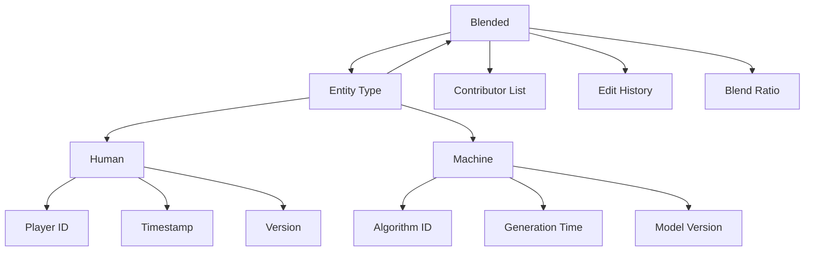

Here's how to add entity type identification to Book content:

```markdown:docs/memorativa-design.md
// ... existing code ...

#### 18.1.2. Core Components
| Component | Subcomponents |
|-----------|---------------|
| Metadata | Title, Description, Focus Parameters, Temporal Context, Active Lenses, Version Data, **Entity Type** |
| Percept-Triplets | Planet-Sign-House combinations with title-description pairs, transformed by Lenses |
| Prototypes | Structures composed of percept-triplets, interpreted through Lenses |
| Symbolic Data | Angular relationships (aspects), MST-translated labels, filtered through Lenses |
| Narrative Content | Chapters/Sections with analytical commentary, shaped by Lenses, **Entity Origin** |
| Visualizations | Horoscope charts, aspect networks, temporal overlays, influenced by Lenses |
| Conceptual Index | Mappings between narrative elements and structured data |

// ... existing code ...

#### 18.1.3. Entity Type Identification
Books track the origin of their content through:

**1. Entity Types**
- **Human**: Content created or modified by human players
- **Machine**: Content generated by the system
- **Blended**: Collaborative content combining human and machine contributions

**2. Implementation**


**3. Content Segregation**
- Human and machine content can be:
  - Visually distinguished in the interface
  - Filtered during analysis
  - Weighted differently in processing
  - Tracked separately in version history

// ... existing code ...
```

This addition:
1. Adds entity type tracking to metadata
2. Provides clear definitions for human, machine, and blended content
3. Enables visual and analytical segregation
4. Maintains detailed tracking of contributors and generation details