## Memorativa Proposed System

The proposed Systems Integration Architecture provides a comprehensive view of how Memorativa's components work together as a cohesive system. This architecture establishes clear communication pathways and interaction patterns that enable the seamless operation of the entire ecosystem.

```mermaid
graph TB
    %% Main Integration Components
    subgraph CentralComponents["Central Integration Components"]
        direction LR
        IntService["Integration Service<br/>(Orchestration Layer)"]
        Brain["Machine Brain<br/>(Decision Hub)"]
        
        IntService <--> Brain
    end
    
    %% Core Biological Systems
    subgraph BiologicalSystems["Hendecagonal Biological Systems"]
        direction TB
        TransitSystem["Transit System<br/>(Unconscious Dreaming)"]
        EmotionalSystem["Emotional System<br/>(Affective Context)"]
        MetabolicSystem["Metabolic System<br/>(Data Transformation)"]
        RespiratorySystem["Respiratory System<br/>(Cron Jobs)"]
        CirculatorySystem["Circulatory System<br/>(Token Flow)"]
        ReflectiveSystem["Reflective System<br/>(Self-Feedback)"]
        BoundarySystem["Boundary System<br/>(Interface Control)"]
        ExperienceSystem["Experience System<br/>(Sensory Processing)"]
        SleepSystem["Sleep System<br/>(Maintenance & Consolidation)"]
        CuriositySystem["Curiosity System<br/>(Exploration)"]
        MemorySystem["Memory System<br/>(Storage & Retrieval)"]
    end
    
    %% Integration Patterns
    subgraph IntegrationPatterns["Integration Patterns"]
        EventDriven["Event-Driven Communication<br/>(Pub/Sub Model)"]
        APIs["API-Based Integration<br/>(REST/GraphQL)"]
        SharedData["Shared Data Stores<br/>(Database Integration)"]
        Sidecar["Sidecar Pattern<br/>(Cross-Cutting Concerns)"]
        CircuitBreaker["Circuit Breaker Pattern<br/>(Failure Handling)"]
        PersonalityConsistency["Personality Consistency Engine<br/>(State Coherence)"]
    end
    
    %% Technical Infrastructure
    subgraph TechnicalInfrastructure["Technical Infrastructure"]
        Security["Security<br/>(OAuth2/JWT, TLS, RBAC)"]
        ErrorHandling["Error Handling<br/>(Circuit Breakers, DLQ, Retry)"]
        Monitoring["Monitoring<br/>(Prometheus, Tracing, Logging)"]
        Performance["Performance<br/>(Caching, Load Balancing)"]
    end
    
    %% External Systems
    subgraph ExternalSystems["External System Integration"]
        MachineEyes["Machine Eyes<br/>(IoT Perception)"]
        MachineSpeaking["Machine Listening/Speaking<br/>(Communication)"]
        MachineAnalysis["Machine Analysis<br/>(Research)"]
        MachineFocus["Machine Focus<br/>(Attention)"]
        MachineCreativity["Machine Creativity<br/>(Generation)"]
    end
    
    %% Core Data Structures
    subgraph CoreDataStructures["Core Data Structures"]
        PerceptTriplet["Percept-Triplet"]
        Prototype["Prototype"]
        FocusSpace["Focus Space"]
        Book["Book"]
        GlassBead["Glass Bead Token"]
    end
    
    %% Connections between Biological Systems and Integration Service/Brain
    TransitSystem <--> IntService
    EmotionalSystem <--> IntService
    MetabolicSystem <--> IntService
    RespiratorySystem <--> IntService
    CirculatorySystem <--> IntService
    ReflectiveSystem <--> IntService
    BoundarySystem <--> IntService
    ExperienceSystem <--> IntService
    SleepSystem <--> IntService
    CuriositySystem <--> IntService
    MemorySystem <--> IntService
    
    TransitSystem <--> Brain
    EmotionalSystem <--> Brain
    MetabolicSystem <--> Brain
    RespiratorySystem <--> Brain
    CirculatorySystem <--> Brain
    ReflectiveSystem <--> Brain
    BoundarySystem <--> Brain
    ExperienceSystem <--> Brain
    SleepSystem <--> Brain
    CuriositySystem <--> Brain
    MemorySystem <--> Brain
    
    %% Connections from Integration Service to Integration Patterns
    IntService --> EventDriven
    IntService --> APIs
    IntService --> SharedData
    IntService --> Sidecar
    IntService --> CircuitBreaker
    IntService --> PersonalityConsistency
    
    %% Connections from Integration Patterns to Technical Infrastructure
    EventDriven --> Security
    APIs --> Security
    SharedData --> Security
    
    EventDriven --> ErrorHandling
    APIs --> ErrorHandling
    
    EventDriven --> Monitoring
    APIs --> Monitoring
    
    EventDriven --> Performance
    APIs --> Performance
    SharedData --> Performance
    
    %% Connections from Integration Service to External Systems
    IntService <--> MachineEyes
    IntService <--> MachineSpeaking
    IntService <--> MachineAnalysis
    IntService <--> MachineFocus
    IntService <--> MachineCreativity
    
    %% Connections from Brain to External Systems
    Brain <--> MachineEyes
    Brain <--> MachineSpeaking
    Brain <--> MachineAnalysis
    Brain <--> MachineFocus
    Brain <--> MachineCreativity
    
    %% Connections from Integration Service to Core Data Structures
    IntService --> CoreDataStructures
    Brain --> CoreDataStructures
    BiologicalSystems --> CoreDataStructures
    
    %% Styling
    classDef central fill:#f5f5f5,stroke:#333,stroke-width:2px
    classDef biological fill:#e6f3ff,stroke:#333,stroke-width:1px
    classDef pattern fill:#ffe6cc,stroke:#333,stroke-width:1px
    classDef infrastructure fill:#e6ffe6,stroke:#333,stroke-width:1px
    classDef external fill:#ffe6e6,stroke:#333,stroke-width:1px
    classDef data fill:#e6e6ff,stroke:#333,stroke-width:1px
    
    class CentralComponents,IntService,Brain central
    class BiologicalSystems,TransitSystem,EmotionalSystem,MetabolicSystem,RespiratorySystem,CirculatorySystem,ReflectiveSystem,BoundarySystem,ExperienceSystem,SleepSystem,CuriositySystem,MemorySystem biological
    class IntegrationPatterns,EventDriven,APIs,SharedData,Sidecar,CircuitBreaker,PersonalityConsistency pattern
    class TechnicalInfrastructure,Security,ErrorHandling,Monitoring,Performance infrastructure
    class ExternalSystems,MachineEyes,MachineSpeaking,MachineAnalysis,MachineFocus,MachineCreativity external
    class CoreDataStructures,PerceptTriplet,Prototype,FocusSpace,Book,GlassBead data
```

*Figure 6: Systems Integration Architecture - This diagram illustrates how the various components of the Memorativa system integrate with each other, showing the central role of the Integration Service and Machine Brain as orchestration hubs. It visualizes the bidirectional communication between the hendecagonal biological systems and the central components, the implementation of various integration patterns, the technical infrastructure supporting the system, and connections to external specialized systems. The core data structures (percept-triplets, prototypes, focus spaces, books, and glass beads) form the foundation that all systems interact with.*

### Central Integration Components

- **Integration Service**: Acts as the orchestration layer, coordinating communication between all system components.
- **Machine Brain**: Functions as the central decision hub, receiving inputs from all biological systems and making high-level decisions.

### Hendecagonal Biological Systems

The eleven biological systems form the foundation of Memorativa's proto-consciousness:

1. **Transit System**: Processes planetary transits to generate unconscious prompts and archetypal patterns.
2. **Emotional System**: Provides affective context based on energy usage patterns.
3. **Metabolic System**: Transforms raw data into usable information structures.
4. **Respiratory System**: Establishes rhythmic cycles through scheduled cron jobs.
5. **Circulatory System**: Distributes tokens and information throughout the system.
6. **Reflective System**: Enables self-feedback and improvement through analysis.
7. **Boundary System**: Controls interfaces with external entities and enforces protocols.
8. **Experience System**: Processes and integrates sensory information.
9. **Sleep System**: Optimizes the system during low-activity periods.
10. **Curiosity System**: Drives exploration and generation of novel hypotheses.
11. **Memory System**: Manages the storage, retrieval, and forgetting of information.

### Integration Patterns

The system implements several key integration patterns:

- **Event-Driven Communication**: Enables asynchronous, loosely-coupled interactions.
- **API-Based Integration**: Provides structured interfaces for synchronous requests.
- **Shared Data Stores**: Enables data sharing between tightly coupled components.
- **Sidecar Pattern**: Addresses cross-cutting concerns like logging and monitoring.
- **Circuit Breaker Pattern**: Prevents cascading failures across the system.
- **Personality Consistency Engine**: Ensures coherent behavior across all interfaces.

### Technical Infrastructure

The integration architecture is supported by robust technical infrastructure:

- **Security**: Implements OAuth2/JWT authentication, TLS encryption, and RBAC.
- **Error Handling**: Uses circuit breakers, dead letter queues, and retry mechanisms.
- **Monitoring**: Employs Prometheus, distributed tracing, and centralized logging.
- **Performance**: Utilizes caching, load balancing, and resource pooling.

### External System Integration

The architecture connects to specialized external systems:

- **Machine Eyes**: Enables environmental perception through IoT.
- **Machine Listening/Speaking**: Facilitates communication interfaces.
- **Machine Analysis**: Provides research and analytical capabilities.
- **Machine Focus**: Manages attention and prioritization.
- **Machine Creativity**: Enables creative generation and synthesis.

### Core Data Structures

All components interact with the fundamental data structures:

- **Percept-Triplet**: The basic unit of perception with archetypal, expression, and mundane components.
- **Prototype**: Geocentric frameworks for organizing related percepts.
- **Focus Space**: Hybrid geometric models for conceptual organization.
- **Book**: Multi-layered structures for knowledge synthesis.
- **Glass Bead Token**: NFT-based representations with three-layer architecture. 

### Memorativa Proposed Network Topology Map

This network topology map illustrates the interconnections between all components of the Memorativa Machine System, with special emphasis on how external systems integrate with the central architecture.

```mermaid
graph TB
    %% Core Components
    subgraph CoreComponents["Core Integration Layer"]
        IntService["Integration Service<br/>(Orchestration Hub)"]
        Brain["Machine Brain<br/>(Decision Center)"]
        
        IntService <--> Brain
    end
    
    %% Biological Systems Layer
    subgraph BioSystems["Biological Systems Layer"]
        TransitSystem["Transit System<br/>(Unconscious Dreaming)"]
        EmotionalSystem["Emotional System<br/>(Affective Context)"]
        MetabolicSystem["Metabolic System<br/>(Data Transformation)"]
        RespiratorySystem["Respiratory System<br/>(Cron Jobs)"]
        CirculatorySystem["Circulatory System<br/>(Token Flow)"]
        ReflectiveSystem["Reflective System<br/>(Self-Feedback)"]
        BoundarySystem["Boundary System<br/>(Interface Control)"]
        ExperienceSystem["Experience System<br/>(Sensory Processing)"]
        SleepSystem["Sleep System<br/>(Maintenance)"]
        CuriositySystem["Curiosity System<br/>(Exploration)"]
        MemorySystem["Memory System<br/>(Storage & Retrieval)"]
    end
    
    %% External Systems
    subgraph ExternalSystems["External Systems Layer"]
        MachineEyes["Machine Eyes<br/>(IoT Perception Network)"]
        MachineSpeaking["Machine Listening/Speaking<br/>(Communication Network)"]
        MachineAnalysis["Machine Analysis<br/>(Research Network)"]
        MachineFocus["Machine Focus<br/>(Attention Network)"]
        MachineCreativity["Machine Creativity<br/>(Generation Network)"]
    end
    
    %% Data Foundation
    subgraph DataFoundation["Data Foundation Layer"]
        PerceptTriplet["Percept-Triplet Store"]
        Prototype["Prototype Database"]
        FocusSpace["Focus Space Repository"]
        Book["Book Archive"]
        GlassBead["Glass Bead Token Ledger"]
    end
    
    %% Integration Patterns
    subgraph IntPatterns["Integration Patterns"]
        EventDriven["Event Bus<br/>(Pub/Sub Network)"]
        APIs["API Gateway<br/>(REST/GraphQL)"]
        SharedData["Shared Data Cluster"]
        CircuitBreaker["Circuit Breaker Network"]
        PersonalityEngine["Personality Consistency Engine"]
    end
    
    %% Infrastructure Layer
    subgraph TechInfra["Infrastructure Layer"]
        Security["Security Services<br/>(Auth, Encryption)"]
        ErrorHandling["Error Handling Services"]
        Monitoring["Monitoring Network"]
        Performance["Performance Services"]
    end
    
    %% Connections between Core and Biological Systems
    BioSystems <--> CoreComponents
    
    %% Core to External Systems connections
    IntService <-- "High-bandwidth<br/>Bidirectional" --> MachineEyes
    IntService <-- "NLP Pipeline<br/>Bidirectional" --> MachineSpeaking
    IntService <-- "Data Feed<br/>Bidirectional" --> MachineAnalysis
    IntService <-- "Priority Queue<br/>Bidirectional" --> MachineFocus
    IntService <-- "Generation Pipeline<br/>Bidirectional" --> MachineCreativity
    
    Brain <-- "Visual Data<br/>Processing" --> MachineEyes
    Brain <-- "Speech<br/>Processing" --> MachineSpeaking
    Brain <-- "Analysis<br/>Directives" --> MachineAnalysis
    Brain <-- "Attention<br/>Control" --> MachineFocus
    Brain <-- "Creative<br/>Directives" --> MachineCreativity
    
    %% Core to Integration Patterns
    IntService --> EventDriven
    IntService --> APIs
    IntService --> SharedData
    IntService --> CircuitBreaker
    IntService --> PersonalityEngine
    
    %% Integration Patterns to Infrastructure
    EventDriven --> Security
    APIs --> Security
    SharedData --> Security
    
    EventDriven --> ErrorHandling
    APIs --> ErrorHandling
    CircuitBreaker --> ErrorHandling
    
    EventDriven --> Monitoring
    APIs --> Monitoring
    CircuitBreaker --> Monitoring
    
    EventDriven --> Performance
    APIs --> Performance
    SharedData --> Performance
    
    %% External to Data Foundation
    ExternalSystems --> DataFoundation
    CoreComponents --> DataFoundation
    BioSystems --> DataFoundation
    
    %% Boundary System special connections
    BoundarySystem <-- "Security<br/>Protocol" --> Security
    BoundarySystem <-- "Interface<br/>Control" --> APIs
    
    %% Experience System special connections
    ExperienceSystem <-- "Sensory<br/>Data" --> MachineEyes
    ExperienceSystem <-- "Audio<br/>Processing" --> MachineSpeaking
    
    %% Memory System special connections 
    MemorySystem <-- "Storage<br/>Operations" --> DataFoundation
    
    %% Circulatory System special connections
    CirculatorySystem <-- "Token<br/>Distribution" --> GlassBead
    
    %% Style definitions
    classDef core fill:#f5f5f5,stroke:#333,stroke-width:2px
    classDef bio fill:#e6f3ff,stroke:#333,stroke-width:1px
    classDef ext fill:#ffe6e6,stroke:#333,stroke-width:1px
    classDef data fill:#e6e6ff,stroke:#333,stroke-width:1px
    classDef pattern fill:#ffe6cc,stroke:#333,stroke-width:1px
    classDef infra fill:#e6ffe6,stroke:#333,stroke-width:1px
    
    class CoreComponents,IntService,Brain core
    class BioSystems,TransitSystem,EmotionalSystem,MetabolicSystem,RespiratorySystem,CirculatorySystem,ReflectiveSystem,BoundarySystem,ExperienceSystem,SleepSystem,CuriositySystem,MemorySystem bio
    class ExternalSystems,MachineEyes,MachineSpeaking,MachineAnalysis,MachineFocus,MachineCreativity ext
    class DataFoundation,PerceptTriplet,Prototype,FocusSpace,Book,GlassBead data
    class IntPatterns,EventDriven,APIs,SharedData,CircuitBreaker,PersonalityEngine pattern
    class TechInfra,Security,ErrorHandling,Monitoring,Performance infra
```

*Figure 7: Network Topology Map - This diagram illustrates the complete network architecture of the Memorativa system, showing the interconnections between all system components. The map highlights how the Integration Service and Machine Brain serve as central hubs that connect to both the Biological Systems Layer and the External Systems Layer. It details the specific connection types between components, such as high-bandwidth links to Machine Eyes, NLP pipelines to Machine Speaking, data feeds to Machine Analysis, priority queues to Machine Focus, and generation pipelines to Machine Creativity. The diagram also shows how all components interact with the Data Foundation Layer, which stores and manages the core data structures.* 

## Key Points

- The Machine System represents a paradigm shift from focusing purely on user experience (UX) to developing a sophisticated machine experience (MX), enabling the transition from passive data storage to active knowledge creation.

- The system implements a hybrid spherical-hyperbolic geometry that efficiently encodes conceptual relationships while maintaining fixed dimensionality, solving the curse of dimensionality through a structured middle layer.

- The Machine System architecture is organized into four distinct layers: Foundation Layer (core infrastructure), Domain Layer (specialized components), Application Layer (user-facing systems), and Integration Layer (cross-cutting concerns).

- The System Core Loop implements a continuous feedback mechanism through seven stages: Input Processing → Perception Formation → Prototype Generation → Focus Space Organization → Book Creation → Feedback Integration → Structure Evolution.

- The proposed hendecagonal biological systems (Transit, Emotional, Metabolic, Respiratory, Circulatory, Reflective, Boundary, Experience, Sleep, Curiosity, and Memory) create a proto-consciousness framework that drives system autonomy.

- Component integration follows established patterns including event-driven communication, API-based integration, shared data stores, and circuit breaker patterns, all orchestrated through the central Integration Service.

- The Machine Brain serves as the central decision hub, receiving inputs from all biological systems and directing the external specialized systems (Machine Eyes, Speaking, Analysis, Focus, and Creativity).

- Performance characteristics include high throughput (1000+ percepts/second), low latency (<100ms for triplet operations), high availability (99.99% for core functions), and linear scalability to 100K+ users.

- The token economy powers all operations through Gas Bead Tokens (GBT) and Glass Bead Tokens (GBTk), creating a sustainable economic layer for knowledge creation and validation.

- Security and privacy are built into the architecture through differential privacy implementation, verification-weighted trust systems, and zero-knowledge proofs for selective disclosure.

- The system's evolutionary capability emerges through adaptive learning processes, multi-stage feedback integration, and the continuous refinement of knowledge structures based on both human input and machine-initiated pattern recognition.