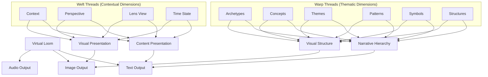
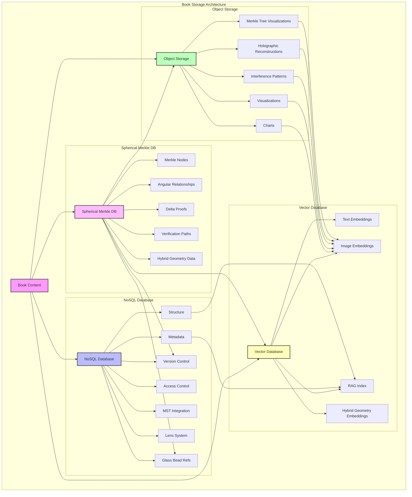
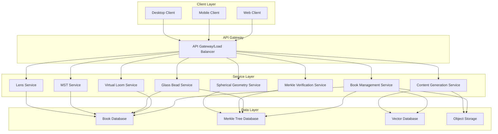
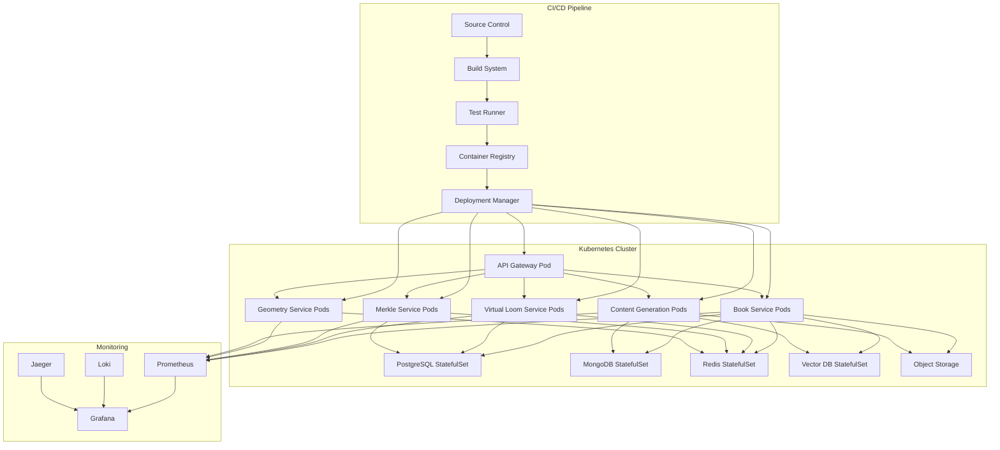

# 3.2. Machine System Books

Books represent the culminating form of knowledge synthesis in the Memorativa system. As the primary terminal output of the cybernetic process, they transform raw percepts, triplets, and prototypes into comprehensive, multi-dimensional knowledge artifacts that bridge human cognition and machine processing. This section details the enhanced Book output system, which implements a hybrid architecture combining narrative coherence with geometric verification, multi-modal processing, and spatial relationship preservation.

Books serve as both consumable knowledge products and active components in the knowledge generation cycle. Through their multi-layered structure and Spherical Merkle Tree integration, they maintain verifiable relationships between concepts while offering rich, contextual representations accessible through multiple lenses and temporal states. As detailed in Section 2.3, each Book is referenced by Glass Beads that serve as symbolic conceptual references to the Book's content, establishing a critical connection between the Glass Bead Game tokens and knowledge representation.

## Cybernetic Books Design Specification

The following document specifies the Book design for the cybernetic system. The following section will enhance this core cybernetic design, finally updating it with the Machine System Books.

## Virtual Loom: The Core Organizational Framework

Books in Memorativa implement the Virtual Loom as their primary organizational structure, a sophisticated framework that arranges knowledge elements along meaningful dimensions. As comprehensively detailed in [Section 2.14](../2.%20the%20cybernetic%20system/memorativa-2-14-books.md), this structure transforms Books from linear narratives to multi-dimensional knowledge landscapes that can be navigated along multiple axes.

### Knowledge Organization Framework
- **Warp Threads**: Thematic dimensions that organize concepts vertically (archetypes, themes, patterns)
- **Weft Threads**: Contextual relationships that organize concepts horizontally (cultural contexts, perspectives, time periods)
- **Intersections**: Meaningful connection points where Glass Beads are strategically positioned
- **Patterns**: Recognizable arrangements of beads that form coherent sub-narratives
- **Multi-dimensional Navigation**: Vertical, horizontal, diagonal, and zoom-based exploration pathways

### Dynamic Knowledge Structure
- **Structural Integrity**: The loom framework maintains conceptual relationships through thread tensioning
- **Collaborative Capabilities**: Multiple "weavers" can contribute to different sections of the knowledge textile
- **Knowledge Gap Visualization**: Empty intersections visually identify areas for further exploration
- **Pattern Recognition**: Connected bead positions reveal higher-order organizational structures
- **Thematic Thread Generation**: AI-assisted creation of coherent thematic structures
- **Contextual Thread Analysis**: Identification of meaningful contextual connections
- **Metadata Enhancement**: Enriched thread descriptions and relationship annotations
- **LLM-Assisted Organization**: Leverages the LLM integration from Section 2.21 to intelligently generate and organize threads based on semantic analysis

### Implementation Benefits
- **Relationship Preservation**: Angular relationships between concepts are maintained in the loom structure
- **Visual Navigation**: Clear movement pathways between related concepts
- **Thread-based Filtering**: Content filtering by specific warp or weft threads
- **Pattern Templates**: Reusable organizational patterns for knowledge curation
- **Integration with Merkle Trees**: Spherical Merkle verification of both content and thread relationships

The Virtual Loom is not merely a visualization tool but the fundamental organizational principle for all Book content, directly implementing the same hybrid spherical-hyperbolic geometry used throughout the Memorativa system. For detailed implementation, including code examples and mathematical foundations, see [Section 2.14](../2.%20the%20cybernetic%20system/memorativa-2-14-books.md).

### Virtual Loom Technical Implementation

The core Book output system implements the Virtual Loom through a structured technical architecture:

```rust
struct BookLoomCurator {
    warp_threads: Vec<ThematicDimension>,     // Vertical threads (concepts, themes)
    weft_threads: Vec<ContextualDimension>,   // Horizontal threads (contexts, perspectives)
    beads: HashMap<BeadId, LoomPosition>,     // Positioned beads from player collection
    patterns: Vec<CurationPattern>,           // Organizational templates
}
```

The implementation includes sophisticated thread management and processing controls:

```rust
fn process_book_chain(book: Book, context: ProcessingContext) -> Result<Vec<Percept>> {
    thread::Builder::new()
        .stack_size(8 * 1024 * 1024) // 8MB stack
        .spawn(move || {
            context.can_process(&book)?;
            let percepts = decompose_book(book)?;
            context.depth += 1;
            
            // Process derived books with depth checking
            process_derived_books(percepts, context)
        })?
}
```

Each warp and weft thread in the Virtual Loom runs in its own processing thread, with dedicated stack space and cycle detection. The system implements vector analysis to detect and terminate unproductive processing chains:

```rust
fn should_terminate_processing(vectors: &[Vector]) -> bool {
    // Terminate if ≥75% of vector relationships are perpendicular
    let perpendicular_count = count_perpendicular_relationships(vectors);
    perpendicular_count as f32 / vectors.len() as f32 >= 0.75
}
```

The core curation function positions beads at meaningful intersections:

```rust
fn curate_beads_as_loom(&mut self, beads: &Vec<GlassBead>) -> LoomCuration {
    // Create thematic warp threads from book structure
    let warp_threads = self.generate_thematic_warps();
    
    // Create contextual weft threads from book perspectives
    let weft_threads = self.generate_contextual_wefts();
    
    // Position beads at appropriate intersections
    let positioned_beads = self.position_beads_in_loom(beads, warp_threads, weft_threads);
    
    // Create organizational patterns
    let patterns = self.identify_organizational_patterns(positioned_beads);
    
    LoomCuration {
        warp_threads,
        weft_threads, 
        positioned_beads,
        patterns,
        metadata: self.generate_curation_metadata()
    }
}
```

#### Virtual Loom Practical Example: Cultural Analysis

To illustrate how this technical implementation manifests in practice, consider a Book analyzing cultural archetypes:

- **Warp Threads (Vertical)** represent archetypal themes like "Hero's Journey," "Trickster," "Mother," "Shadow"
- **Weft Threads (Horizontal)** represent cultural contexts like "Western Literature," "Eastern Philosophy," "Indigenous Traditions," "Modern Media"
- **Intersections** contain Glass Beads for specific manifestations: the Hero archetype in Western Literature references beads about Odysseus, King Arthur, and Luke Skywalker
- **Patterns** emerge showing how the Trickster archetype transforms across different cultures, or how Indigenous Traditions express multiple archetypes in integrated ways
- **Navigation** allows following either the evolution of a single archetype across cultures (vertical) or examining how a particular culture expresses different archetypes (horizontal)
- **Knowledge Gaps** appear as empty intersections that invite further research

This implementation ensures that Book outputs maintain structural coherence and navigational clarity while providing rich knowledge organization that extends beyond traditional linear narrative formats.

## Core Book Architecture

Books in Memorativa are multi-layered structures that serve as both human-readable narratives and machine-processable data:

### Core Layers
- **Human Layer**: Narrative text, chapters, sections, visualizations
- **Machine Layer**: Structured data (percepts, triplets, prototypes)
- **Bridge Layer**: Markup system linking narrative to data
- **Integrity Layer**: Spherical Merkle Trees for topological verification and spatial relationship preservation, using the same verification infrastructure described in Section 2.3 for Glass Beads

### Key Components
- Metadata (title, description, focus parameters, temporal context)
- Percept-Triplets and Prototypes
- Symbolic Data (aspects, MST translations)
- Narrative Content
- Visualizations
- Conceptual Index
- Attribution Data
- Validation Data
- Spherical Merkle Trees for hybrid geometric validation

### Time States
Books handle three distinct temporal contexts:
- **Mundane**: Concrete timestamps and chronological events, including past dates, future timestamps, and imagined future events
- **Quantum**: Conceptual or indeterminate time
- **Holographic**: Links to reference time frameworks, such as natal charts

### RAG Integration
Books are designed as:
- Primary corpus for RAG retrieval
- Structured templates for generation
- Vector-encodable format for embeddings
- Knowledge base enrichment source
- Spatially-verifiable data sources via Spherical Merkle Trees

### Core Features
- Version control and branching
- Content attribution system
- Privacy and access control
- MST integration for symbolic translation
- Lens system for multiple interpretations
- Glass Bead curation and organization
- Spherical-hyperbolic relationship preservation

## Structural Hierarchy

Books exist within a comprehensive three-tier knowledge hierarchy that organizes all structures in the Memorativa system:

### Hierarchical Position
- **Basic Structures**: Foundational elements (percept-triplets, angular relationships, vector encodings)
- **Composite Structures**: Intermediate constructs (prototypes, focus spaces, pattern templates)
- **Complex Structures**: Advanced formations (books, conceptual demarcations, knowledge networks)

Books operate at the Complex Structure level, integrating and synthesizing elements from the Basic and Composite levels into coherent knowledge artifacts. This hierarchical organization enables:

1. **Vertical Integration**: Books incorporate and reference elements from lower tiers
2. **Horizontal Connection**: Books connect with other Complex Structures through relationship networks
3. **Diagonal Analysis**: Books identify patterns across both hierarchical levels and related domains

By positioning Books within this formal hierarchy, the system creates clear pathways for knowledge to flow from raw perception (Basic) through conceptual organization (Composite) to comprehensive synthesis (Complex).

## Virtual Loom Integration

The Book Output system implements and extends the Virtual Loom structure described in section 2.14, providing a powerful organizational framework for both generating and presenting content. This integration ensures that output streams reflect the carefully curated relationships established in the Book's conceptual framework.

### Loom-Driven Output Generation

The Virtual Loom's warp/weft structure directly influences how content is generated and organized:


*Figure 1: Virtual Loom Integration Flow, illustrating how Warp Threads (thematic dimensions) and Weft Threads (contextual dimensions) organize and structure content across different output modalities, demonstrating the unified organizational framework across all Book outputs*

The warp threads organize content along the Archetypal/What dimension (also described as "thematic" in Section 2.23), while weft threads organize content along the Expression/How and Mundane/Where dimensions (conceptual and contextual relationships). This directly aligns with the percept-triplet vector encoding described in Section 2.23.

### Virtual Loom Thread-Based Organization System

Each output type implements the Virtual Loom's thread system in its presentation:

**1. Text Output Implementation**
- **Warp Threads (Thematic)**: Manifested as narrative flow, chapter structures, and conceptual hierarchies
- **Weft Threads (Contextual)**: Expressed through perspective shifts, lens-specific interpretations, and temporal contexts
- **Intersection Points**: Key narrative moments where specific Glass Beads are highlighted and explored in depth
- **Thread Tensioning**: Balanced exposition between thematic depth and contextual breadth

**2. Image Output Implementation**
- **Warp Threads (Thematic)**: Visualized as primary visual motifs, central symbols, and structural elements
- **Weft Threads (Contextual)**: Represented through stylistic variations, cultural interpretations, and temporal overlays
- **Intersection Points**: Visual focal points where significant beads are prominently displayed
- **Pattern Visualization**: Connected intersections form visual pathways that guide viewer attention

**3. Navigation System**
```rust
struct LoomNavigator {
    current_warp: Option<WarpThreadId>,
    current_weft: Option<WeftThreadId>,
    current_intersection: Option<(WarpThreadId, WeftThreadId)>,
    viewed_intersections: HashSet<(WarpThreadId, WeftThreadId)>,
    
    fn navigate_warp(&mut self, target_warp: WarpThreadId) -> NavigationResult {
        // Move along thematic dimension while maintaining context
        self.current_warp = Some(target_warp);
        self.update_intersection()
    }
    
    fn navigate_weft(&mut self, target_weft: WeftThreadId) -> NavigationResult {
        // Move along contextual dimension while maintaining theme
        self.current_weft = Some(target_weft);
        self.update_intersection()
    }
    
    fn update_intersection(&mut self) -> NavigationResult {
        if let (Some(warp), Some(weft)) = (self.current_warp, self.current_weft) {
            let intersection = (warp, weft);
            self.current_intersection = Some(intersection);
            self.viewed_intersections.insert(intersection);
            
            // Retrieve content at this intersection
            NavigationResult::Intersection(self.get_intersection_content(intersection))
        } else {
            NavigationResult::NoIntersection
        }
    }
    
    fn follow_pattern(&mut self, pattern_id: PatternId) -> NavigationPath {
        // Follow a predefined pattern of intersections
        let path = self.load_pattern(pattern_id);
        
        // Navigate through each intersection in pattern
        let results = path.intersections.iter()
            .map(|&(warp, weft)| {
                self.current_warp = Some(warp);
                self.current_weft = Some(weft);
                self.update_intersection()
            })
            .collect();
            
        NavigationPath {
            pattern_id,
            results
        }
    }
}
```

### Virtual Loom Visual Organization System

The Visual Output system directly reflects the Virtual Loom structure:

1. **Warp-Based Layout**
   - Thematic threads determine visual hierarchy and importance
   - Visual elements are sized proportionally to warp thread significance
   - Related concepts along the same warp thread maintain visual consistency

2. **Weft-Based Styling**
   - Contextual threads determine visual styling and presentation
   - Lens-specific visual treatments follow weft thread configurations
   - Temporal contexts (Mundane, Quantum, Holographic) are visually distinct

3. **Intersection-Based Focus**
   - Primary visual elements appear at key intersections
   - Visual weight corresponds to intersection significance
   - Navigation cues guide viewers between related intersections

4. **Pattern Visualization**
   - Connected intersections form visual pathways
   - Patterns are visually highlighted through color, line, or movement
   - Pattern density reflects conceptual density in the loom structure

### Virtual Loom Implementation Example

```rust
struct LoomVisualizer {
    virtual_loom: &VirtualLoom,
    visual_style_manager: VisualStyleManager,
    
    fn generate_visualization(&self, view_params: ViewParameters) -> Visualization {
        // Create canvas with dimensions
        let mut canvas = Canvas::new(view_params.dimensions);
        
        // Render warp threads (vertical/thematic) - corresponds to Archetypal/What dimension
        for (i, warp) in self.virtual_loom.warp_threads.iter().enumerate() {
            let x_position = self.calculate_warp_position(i, view_params);
            let style = self.visual_style_manager.get_warp_style(warp);
            canvas.draw_warp_thread(x_position, style);
        }
        
        // Render weft threads (horizontal/contextual) - corresponds to Expression/How and Mundane/Where dimensions
        for (j, weft) in self.virtual_loom.weft_threads.iter().enumerate() {
            let y_position = self.calculate_weft_position(j, view_params);
            let style = self.visual_style_manager.get_weft_style(weft);
            canvas.draw_weft_thread(y_position, style);
        }
        
        // Render beads at intersections
        for ((warp_id, weft_id), bead_id) in &self.virtual_loom.occupied_positions {
            let x = self.calculate_warp_position(*warp_id, view_params);
            let y = self.calculate_weft_position(*weft_id, view_params);
            let bead = self.virtual_loom.get_bead(*bead_id);
            
            let visual_importance = self.calculate_importance(bead, view_params);
            let style = self.visual_style_manager.get_bead_style(bead);
            
            canvas.draw_bead(x, y, visual_importance, style);
        }
        
        // Render patterns (connected beads)
        for pattern in self.virtual_loom.identify_patterns() {
            let style = self.visual_style_manager.get_pattern_style(&pattern);
            canvas.draw_pattern(pattern, style);
        }
        
        canvas.finalize()
    }
    
    fn generate_3d_loom(&self, view_params: View3DParameters) -> Visualization3D {
        // Create 3D representation of the Virtual Loom
        let mut scene = Scene3D::new();
        
        // Transform 2D loom into 3D space
        let warp_plane = view_params.warp_orientation.get_plane();
        let weft_plane = view_params.weft_orientation.get_plane();
        
        // Render threads as 3D objects
        for warp in &self.virtual_loom.warp_threads {
            scene.add_warp_thread(warp, warp_plane);
        }
        
        for weft in &self.virtual_loom.weft_threads {
            scene.add_weft_thread(weft, weft_plane);
        }
        
        // Render beads as spheres at intersections
        for ((warp_id, weft_id), bead_id) in &self.virtual_loom.occupied_positions {
            let warp = &self.virtual_loom.warp_threads[*warp_id];
            let weft = &self.virtual_loom.weft_threads[*weft_id];
            let bead = self.virtual_loom.get_bead(*bead_id);
            
            let position = scene.calculate_intersection_position(warp, weft);
            let size = self.calculate_bead_size(bead, view_params);
            let style = self.visual_style_manager.get_bead_style_3d(bead);
            
            scene.add_bead(position, size, style);
        }
        
        // Add pattern connections
        for pattern in self.virtual_loom.identify_patterns() {
            scene.add_pattern_connections(pattern);
        }
        
        scene.finalize()
    }
}
```

### Benefits of Loom Integration in Outputs

The integration of the Virtual Loom structure into the Book Output system provides several critical benefits:

1. **Structural Clarity**: Outputs maintain the organizational integrity defined in the Book's loom structure
2. **Multi-dimensional Navigation**: Users can navigate content along thematic or contextual dimensions
3. **Pattern Recognition**: Visual and textual patterns become immediately apparent through consistent presentation
4. **Contextual Awareness**: Outputs adapt based on the weft thread context (lens, perspective, time state)
5. **Relationship Preservation**: The relationships between concepts defined in the loom structure are reflected in output presentation
6. **Knowledge Gaps Visualization**: Empty intersections are visually identified as potential areas for exploration
7. **Thread-based Filtering**: Users can filter content by specific warp or weft threads to focus exploration

This deep integration ensures that the rich organizational structure defined in the Virtual Loom is not just a backend organizational tool but is directly reflected in the user experience of consuming Book outputs.

## Books Closed Cognitive Loop

Books in Memorativa implement a closed cognitive loop where completed Books can serve as new inputs to the system, enabling continuous knowledge evolution. This recursive capability transforms Books from static documents to dynamic knowledge structures that participate in ongoing knowledge development.

### Recursive Processing Controls
- **Recursion Depth Tracking**: Monitors processing depth (maximum 64 levels) to prevent infinite recursion
- **Thread State Management**: Isolates processing chains in dedicated threads
- **Vector Relationship Analysis**: Monitors conceptual relationships to detect unproductive processing
- **Early Termination Logic**: Halts processing when ≥75% of vector relationships are perpendicular (indicating low semantic coherence)

### Direct Input Interfaces
Books provide interfaces for component resubmission, allowing players to extract and resubmit:
- Demarcated concepts
- Individual percepts
- Percept-triplets
- Prototypes
- Focus space configurations

Each resubmission preserves essential contextual metadata including origin reference, temporal state, and relationship metadata.

## Books Multi-Modal Processing

Books in Memorativa implement comprehensive multi-modal processing that integrates both text and images into a unified knowledge framework:

### Image-Text Integration
- **Visual Archetype Detection**: CLIP-based models identify visual elements and map them to archetypes
- **Cross-Modal Alignment**: Visual and textual elements are aligned in the same hybrid triplet space
- **Visual Triplet Formation**: Images generate percept-triplets with the same structure as text-based percepts
- **Modal Consistency**: Ensures semantic coherence between visual and textual elements within the same Book

### Correspondence Integration
Books leverage the comprehensive correspondence tables defined in Section 2.5 (Symbolic Translation System) for maintaining consistent symbolic relationships across all content:

- **Planetary Archetypes**: Mapping imagery to universal archetypal expressions (Sun→Identity, Moon→Emotion, etc.)
- **Sign Expressions**: Consistent translation of modal expressions across visual and textual content
- **Contextual Domains**: Unified contextual framework for all Book contents regardless of modality
- **Cultural Neutralization**: Visual elements undergo the same cultural neutralization process as textual elements

### Temporal State Support
Books maintain three distinct temporal contexts across all content types:
- **Mundane Time**: Concrete timestamps related to content creation, historical references, or imagined future dates related to future events
- **Quantum Time**: Conceptual time states for timeless or abstract concepts
- **Holographic Time**: Reference-based temporal alignments with other structures, such as natal charts

This multi-modal approach enables Books to process diverse input types while maintaining consistent semantic structures, creating a truly integrated knowledge representation that bridges visual and textual understanding.

## Books Glass Bead Integration

Books maintain a bidirectional relationship with Glass Beads as described in Section 2.6, functioning as structured curators that organize beads into coherent knowledge landscapes:

1. **Curation and Organization**: Books provide the narrative and analytical framework that contextualizes Glass Beads, organizing them through the Virtual Loom structure along thematic and contextual dimensions.

2. **Reference Mechanism**: Glass Beads function as symbolic conceptual references to Books, creating an indexable connection between game tokens and knowledge artifacts.

3. **Verification Consistency**: Both Books and Glass Beads utilize the same Spherical Merkle Tree infrastructure for verification, ensuring topological consistency across the system.

4. **Semantic Continuity**: The semantic data stored in Glass Beads (percepts, prototypes, relationships) flows into Books during synthesis, maintaining provenance and attribution.

5. **Token Economics**: Book generation costs 20-50 GBT as outlined in Section 2.18's operational cost structure, reflecting the significant value creation involved in knowledge synthesis. This cost structure relates to focus space operations (Section 2.12) as follows:
   - **Base Cost Correlation**: The 20-50 GBT range accounts for the underlying focus space operations required for Book synthesis, including:
     - Space Creation (10.0 GBT per root space)
     - Prototype Addition (0.5 GBT per prototype)
     - Chart Operations (0.1 GBT per chart visualization)
     - Space Hierarchy Changes (2.0 GBT per level adjustment)
   - **Complexity Scaling**: Like focus spaces, Book costs scale with complexity (+10-50% for high relationship density)
   - **Synthesis Premium**: Books incur a synthesis premium (approximately 3-5 GBT) representing the transformation of multiple focus spaces into a cohesive knowledge artifact, similar to the "Export to Glass Bead" (3.0 GBT) operation
   - **Volume Optimization**: Book generation benefits from the same volume discounts (-5% per 10 operations) applied to batched focus space operations
   - **Collaborative Discount**: Books synthesized from collaborative focus spaces qualify for the 40% collaborative work discount

   Additionally, as detailed in Section 2.24, specific Book operations have their own GBT costs:
   - Book Creation: 30.0 GBT + 3.0 per chapter
   - Book Decomposition: 15.0 GBT + 1.0 per component
   - Recursion Processing: 5.0 GBT + 5.0 per level
   - Processing Chain: 10.0 GBT + 0.5 per chain node
   - Component Resubmission: 2.0 GBT + 0.2 per component
   - Cross-Book Analysis: 7.0 GBT + 0.3 per book
   - Book Verification: 1.0 GBT + 0.1 per chapter
   - Book Recursion Initialization: 8-12 GBT
   - Book Thread Creation (Warp/Weft): 5-8 GBT
   - Book Pattern Recognition: 10.0 GBT + 1.5 per pattern
   - Book Bead Positioning: 3-5 GBT
   - Book Multi-modal Processing: 8-12 GBT

6. **Version Management**: Books inherit the version compression techniques used by Glass Beads, allowing efficient storage of evolving knowledge while maintaining verifiable lineage. As described in Section 2.15, this includes:
   - Recursive processing controls with bounded recursion depth (configurable, default 64 levels)
   - Cycle detection through Book ID tracking to prevent infinite loops
   - Processing context management that tracks history and state
   - Thread isolation for memory safety
   - Early termination of unproductive chains through vector relationship analysis
   - Complete attribution and provenance records for all contributors

7. **Symbolic Translation Integration**: Books utilize the Memorativa Symbolic Translator (MST) described in Section 2.5 to ensure cultural neutralization of astrological terminology while preserving conceptual relationships, enabling universal symbolic language across all Book content.

8. **Lens System Integration**: Books incorporate and preserve the Symbolic Lens frameworks detailed in Section 2.13, allowing knowledge to be interpreted through diverse cultural and scientific paradigms while maintaining the Universal House System for cross-lens compatibility. This ensures that synthesized Book content maintains consistent symbolic relationships across traditional esoteric, scientific/mathematical, and psychological/experiential domains.

## Books Glass Bead Token Integration

Books organize Glass Bead Tokens (GBTk) according to the structure defined in Section 2.16, while using Gas Bead Tokens (GBT) as the computational fuel as defined in Section 2.18. Each Glass Bead Token encapsulates complete percept-triplets, prototypes, or focus spaces with their metadata, relationships, and temporal states.

### Token Structure Preservation

The Book's multi-layered architecture integrates Glass Bead Tokens as follows:

1. **Metadata Layer Integration**:
   - Book metadata incorporates and references token identifiers
   - Creation timestamps are preserved and linked
   - Version history chains are maintained
   - Privacy settings are inherited (see Privacy Integration below)
   - Owner information is preserved for attribution
   - Access permissions are aggregated across tokens
   - Merkle root references are maintained for verification

2. **Data Layer Integration**:
   - Percept-triplet encodings maintain their hybrid spherical-hyperbolic space representation
   - Prototype structures preserve their spatial coordinates
   - Focus space configurations are embedded intact
   - Angular relationships (aspects) are preserved through the Book's spatial structure
   - Spatial indices are reconstructed for efficient Book-level retrieval
   - Component trees for verification are merged into the Book's verification structure
   - MST-translated title-description pairs maintain cultural neutrality

3. **Reference Layer Integration**:
   - Book references form bidirectional links to other Books
   - RAG corpus links are preserved for retrieval
   - Related token pointers maintain their relationships
   - External resource links remain accessible
   - Version lineage is preserved and extended
   - Fork history is maintained and annotated
   - Attribution chains document the full provenance

## Books MST Implementation Alignment

Books incorporate the same MST components defined in Section 2.16:

1. **Cultural Neutralization**: All astrological terminology undergoes the same transformation process
2. **Title-Description Preservation**: The culturally-neutral title-description pairs from tokens are maintained
3. **Symbolic Correspondence**: The same correspondence mappings are used for consistent interpretation
4. **Cultural Equivalents**: Cross-cultural equivalents are preserved and expanded
5. **Confidence Metrics**: Translation confidence metrics are inherited and aggregated
6. **Bidirectional Mappings**: The same archetypal mappings enable consistent symbolic translation

This alignment ensures that Books use the identical MST implementation described in Section 2.16, maintaining consistency in how symbolic information is translated and presented.

## Books Lens Implementation Integration

Books implement the same lens transformation framework described in Section 2.16:

1. **Lens-Specific Transforms**: Each lens applies the same transformation to coordinates:
   ```rust
   // From Section 2.16 LensTransform implementation
   fn transform_archetypal(&self, archetype: &ArchetypalVector) -> ArchetypalVector {
       // Extract components
       let mut planet = archetype.planet_component;
       let mut sign = archetype.sign_component;
       
       // Apply rotation to archetypal plane (affects theta angle)
       let theta = atan2(sign, planet);
       let rotated_theta = theta + self.rotation[0];
       
       // Convert back to components
       planet = cos(rotated_theta);
       sign = sin(rotated_theta);
       
       // Apply scaling if needed
       let scale_factor = self.scale.powf(0.5); // Square root for area preservation
       planet *= scale_factor;
       sign *= scale_factor;
       
       // Return transformed vector
       ArchetypalVector {
           planet_component: planet,
           sign_component: sign
       }
   }
   ```

2. **Angular Relationship Preservation**: Books maintain the same relationship tracking between lens views:
   ```rust
   // From Section 2.16 LensIntegration implementation
   fn update_lens_relationships(&mut self, lens_type: LensType) {
       // Update angular relationships between this lens and others
       for other_type in self.active_lenses.keys() {
           if *other_type == lens_type {
               continue;
           }
           
           // Calculate angular relationship
           let angle = self.calculate_lens_angle(lens_type, *other_type);
           
           // Store relationship
           self.lens_relationships.insert((lens_type, *other_type), angle);
           
           // Update Merkle nodes with relationship
           if let Some(node) = self.lens_merkle_nodes.get_mut(&lens_type) {
               let other_id = NodeId::from(*other_type);
               node.angular_relationships.insert(other_id, angle);
               node.hash = node.calculate_hash();
           }
       }
   }
   ```

3. **Verification Through Spherical Merkle Proofs**: Books use the same verification system:
   ```rust
   // From Section 2.16 HybridLensVerifier implementation
   fn verify_lens(&self, 
                lens_type: LensType, 
                proof: SphericalMerkleProof, 
                root_hash: Hash) -> VerificationResult {
       // Verify merkle structure (hierarchical integrity)
       let merkle_valid = self.merkle_verifier.verify(
           proof.merkle_components, 
           root_hash
       );
       
       // Verify lens spatial relationships (angular integrity)
       let spatial_valid = self.spatial_verifier.verify_angular_consistency(
           proof.coordinate_data,
           proof.angular_relationships,
           proof.observer_position, 
           proof.observer_orientation
       );
       
       // Additional verification steps...
       
       VerificationResult {
           valid: merkle_valid && spatial_valid && curvature_valid && observer_valid,
           hierarchical_integrity: merkle_valid,
           spatial_integrity: spatial_valid,
           curvature_integrity: curvature_valid,
           observer_integrity: observer_valid
       }
   }
   ```

4. **Dynamic Adaptation To Conceptual Geometries**: Books implement the same curvature-aware processing:
   ```rust
   // From Section 2.16 SpatialVerifier implementation
   fn verify_curvature_consistency(&self, curvature_fields: &[CurvatureField]) -> bool {
       // Skip if no curvature fields
       if curvature_fields.is_empty() {
           return true;
       }
       
       // Check for consistency in overlapping regions
       for i in 0..curvature_fields.len() {
           for j in (i+1)..curvature_fields.len() {
               let field1 = &curvature_fields[i];
               let field2 = &curvature_fields[j];
               
               // Check for overlap
               if fields_overlap(field1, field2) {
                   // Check curvature consistency in overlap
                   if !is_curvature_consistent(field1, field2, self.curvature_tolerance) {
                       return false;
                   }
               }
           }
       }
       
       true
   }
   ```

This lens integration ensures Books maintain full compatibility with the lens system defined in Section 2.16, supporting multiple symbolic interpretations while preserving the spatial relationships.

## Books Encoding Structure Alignment

Books inherit and preserve the hybrid spherical-hyperbolic geometry described in Section 2.12 (Focus Spaces) to maintain the spatial properties of knowledge:

1. **Coordinate Preservation**: Books encode knowledge using the same θ (theta), φ (phi), r (radius), and κ (kappa) parameters, ensuring conceptual coordinates remain consistent from focus spaces to synthesized outputs.

2. **Angular Relationship Preservation**: The semantic relationships between concepts in Books maintain the angular measurements established in focus spaces, preserving aspect patterns that reveal conceptual harmonies and tensions.

3. **Hierarchical Organization**: Books utilize the same nested hierarchical structure found in focus spaces (up to 7 levels deep), with inheritance rules that preserve parent-child relationships between knowledge components.

4. **Verification Geometry**: The spherical Merkle trees used for Book verification are geometry-aware, validating both content integrity and the spatial relationships between knowledge components.

5. **Curvature-Aware Processing**: Books properly manage the transition between hyperbolic geometry (for hierarchical relationships, κ > 0) and spherical geometry (for symbolic/angular relationships, κ < 0), maintaining the hybrid spatial model throughout the synthesis process.

6. **Processing Controls Integration**: As detailed in Section 2.15, Books implement sophisticated processing controls that maintain system stability:
   - Thread management for parallel processing of book components
   - Vector analysis to detect and terminate unproductive processing chains
   - Context validation using hash sets for efficient validation
   - Adaptive processing that adjusts depth based on resource availability

7. **Thread Management**: Books utilize the thread management system from Section 2.15's Virtual Loom integration:
   - Cognitive processes follow warp threads (thematic dimensions)
   - Contextual frameworks follow weft threads (contextual dimensions)
   - Thread tensioning creates stable knowledge frameworks
   - Multi-dimensional processing enables vertical, horizontal, and diagonal traversal

## Books Collaborative Features Integration

Books preserve and extend the collaborative features and state management capabilities of focus spaces described in Section 2.12:

1. **Collaboration Record**: Books maintain a complete attribution record of all contributors from source focus spaces:
   - Each contribution is cryptographically verified using the same mechanisms as focus spaces
   - Contribution weighting reflects time spent, edits made, and prototype influence
   - Collaborative patterns are preserved as metadata for future study
   - A detailed collaboration timeline shows the evolution of knowledge development

2. **State Management Inheritance**: Books inherit the state management capabilities of focus spaces:
   - All chart configurations and relationships are preserved in their final states
   - Aspect filters and pattern analyses are maintained with their associated insights
   - Time state alignments across all temporal modes are preserved intact
   - Prototype weightings reflect final collaborative consensus
   - Hierarchical structures and inheritance chains remain accessible

3. **Access Model Extension**: Books implement a rich permissions model based on focus space collaboration:
   - Original focus space collaborators receive privileged access to derived Books
   - Granular section-level permissions mirror hierarchy-level permissions from focus spaces
   - Time-limited access grants can be enhanced to enable continued collaboration
   - Public/private visibility settings are preserved and can be adjusted per Book section
   - Collaborative groups maintain coherent access across related Book collections

4. **Synchronization Framework**: Books utilize the same synchronization mechanisms as focus spaces:
   - Spherical Merkle Tree validation ensures integrity across distributed copies
   - Conflict resolution using operational transforms enables safe concurrent editing
   - Bandwidth-optimized delta updates support efficient remote collaboration
   - Spatial relationship preservation ensures collaborative insights remain intact
   - Eventual consistency model handles temporary network partitions gracefully

This integration ensures that Books function as both terminal outputs of the knowledge synthesis process and active components in the ongoing Glass Bead Game, creating a continuous feedback loop between play, knowledge creation, and knowledge consumption.

## Books Visualization Integration

Books directly incorporate and extend the visualization techniques established in Section 2.10 (Visualizing the Prototype). This continuity ensures that all knowledge artifacts in the Memorativa system share a consistent visual language while allowing Books to provide richer, more comprehensive visual representations:

### Horoscope-Based Visualization Extension
- **Chart Integration**: Books embed the same horoscope-style charts detailed in Section 2.10 as interactive components, with full support for all chart types described in Section 2.12 (Focus Spaces):
  - **Single Charts**: Complete support for mundane, quantum, and reference chart types
  - **Superimposed Charts**: Full compatibility with event comparison and concept attunement overlays
  - **Progressed Charts**: Integration of secondary, solar arc, and tertiary progression techniques
  - **Specialized Charts**: Support for composite, harmonic, relocational, and draconic chart variations
  - **Multi-Chart Interface**: Maintains the same 12-chart simultaneous display capability as focus spaces
- **Angular Relationships**: Preserves the aspect-based visualization system showing conceptual connections through identical angular measurement techniques
- **Vector Component Display**: Maintains the same triplet visualization methods (Vector Glyph, Orbital Path, Field Lines, Phase Portrait) while extending them with narrative context
- **Symbolic Consistency**: Uses identical visual encoding for archetypes, expressions, and mundane components

### Chart Presentation in Books
The horoscope-based visualizations appear within Books in several distinct forms:

1. **Inline Chart Components**: Charts are rendered directly within the text flow as first-class content objects that:
   - Scale responsively based on viewing context and device
   - Maintain interactive functionality even in compact form
   - Link directly to referenced textual content
   - Offer expand/collapse functionality for detailed exploration

2. **Dedicated Visualization Workspaces**: Books provide specialized visualization panels that:
   - Expand to full-screen interactive workspaces
   - Support multi-chart comparison and analysis
   - Enable custom filtering and highlighting of elements
   - Offer advanced analytical tools from Section 2.10
   - Preserve state across reading sessions

3. **Cross-Referenced Diagram Networks**: Books create interconnected visualization systems that:
   - Link related charts across different Book sections
   - Highlight conceptual parallels between different knowledge domains
   - Allow navigation through relationship networks
   - Maintain consistent visual encoding across all linked charts

4. **Progressive Disclosure Visualizations**: Charts reveal additional layers of complexity as readers engage:
   - Begin with simplified representations of core relationships
   - Progressively unveil additional layers based on reader interaction
   - Adapt detail level based on reader expertise and interests
   - Build comprehension through guided visual exploration

### Books Visualization Technical Implementation
```python
class BookChartRenderer:
    """Handles the technical rendering of horoscope charts within Books"""
    
    def __init__(self, visualization_engine):
        self.engine = visualization_engine
        self.svg_canvas = SVGCanvas()
        self.webgl_renderer = WebGLRenderer()  # For complex 3D visualizations
        self.interaction_handler = ChartInteractionHandler()
        
    def render_inline_chart(self, prototype, context, size_constraints):
        """Render a chart that flows with text content"""
        # Set up responsive container based on context
        container = self.create_responsive_container(size_constraints)
        
        # Render using the core HoroscopeVisualizer from Section 2.10
        base_chart = self.engine.visualizer.create_chart(prototype)
        
        # Apply Book-specific enhancements
        enhanced_chart = self.apply_book_enhancements(base_chart, context)
        
        # Add interactive elements
        interactive_chart = self.interaction_handler.attach_handlers(enhanced_chart)
        
        # Optimize for inline display
        optimized_chart = self.optimize_for_inline_display(interactive_chart)
        
        container.append(optimized_chart)
        return container
        
    def render_workspace_chart(self, prototype, context):
        """Render an expandable workspace chart"""
        # Similar flow but with full analytical capabilities
        # and support for multi-chart comparison
        # ...
    
    def apply_book_enhancements(self, chart, context):
        """Apply Book-specific enhancements to charts"""
        # Add narrative linking
        chart = self.add_narrative_links(chart, context.narrative_references)
        
        # Add highlighting for key concepts
        chart = self.highlight_key_concepts(chart, context.key_concepts)
        
        # Add contextual annotations
        chart = self.add_contextual_annotations(chart, context.annotations)
        
        return chart
```

## Books Diffusion Model Integration

Books integrate state-of-the-art diffusion models to generate rich visual elements that complement textual content while maintaining the system's core principles of hybrid geometric processing, verification, and semantic coherence. This implementation directly utilizes the `DiffusionModelProvider` interface and model integration framework defined in Section 2.21 (LLM Integration).

### Core Models

The Book output system leverages multiple diffusion models for specialized visual generation tasks, implementing the same model providers outlined in Section 2.21:

1. **FLUX.1**
   - 12B parameter model for photorealistic high-detail imagery
   - Superior text rendering for diagram annotations
   - Fine control over visual elements through hybrid geometric conditioning

2. **Stable Diffusion XL**
   - Base model for most Book visualizations
   - Versatile support for multiple artistic styles
   - Strong integration with ControlNet for structural guidance

3. **Stable Cascade**
   - Three-stage architecture for complex technical diagrams
   - Higher resolution support for detailed visualizations
   - Reduced latency for interactive Book elements

### Hybrid Geometric Enhancement

Visual elements in Books maintain the same hybrid spherical-hyperbolic structure as textual elements:

```rust
struct HybridGeometricConditioner {
    spatial_encoder: HybridSpatialEncoder,
    angular_mapper: AngularRelationshipMapper,
    
    fn apply_hybrid_conditioning(
        &self,
        prompt: &str,
        reference_triplets: Vec<HybridTriplet>
    ) -> Result<ConditionedInput> {
        // Extract coordinate information from triplets 
        let coordinates = self.extract_coordinates(reference_triplets)?;
        
        // Convert to conditioning vectors based on hybrid geometry
        let conditioning_vectors = self.spatial_encoder
            .coordinates_to_conditioning(coordinates)?;
            
        // Extract angular relationships between triplets
        let angular_relationships = self.angular_mapper
            .extract_relationships(reference_triplets)?;
            
        // Apply angular relationships to conditioning
        let angular_conditioning = self.angular_mapper
            .to_conditioning_vectors(angular_relationships)?;
            
        // Combine with prompt
        let enhanced_prompt = self.enhance_prompt_with_conditioning(
            prompt, 
            &conditioning_vectors,
            &angular_conditioning
        )?;
        
        Ok(ConditionedInput {
            prompt: enhanced_prompt,
            params: DiffusionParams {
                conditioning_vectors,
                angular_conditioning,
                strength: 0.75,
                steps: 50,
                guidance_scale: 7.5
            }
        })
    }
    
    // Calculate hybrid distance between points using the exact formula from Section 2.10
    fn calculate_hybrid_distance(&self, p1: Point, p2: Point, curvature: f64) -> f64 {
        // Implements the Hybrid Distance Function from Section 2.10:
        // d(p₁, p₂) = w·dₕ(p₁, p₂) + (1-w)·dₛ(p₁, p₂)
        
        // Calculate weight based on curvature parameter κ
        let w = sigmoid(curvature * 5.0); // Maps curvature to weight in [0,1]
        
        // Calculate hyperbolic distance component (dₕ)
        let d_h = calculate_hyperbolic_distance(p1, p2);
        
        // Calculate spherical distance component (dₛ)
        let d_s = calculate_spherical_distance(p1, p2);
        
        // Apply weighted combination exactly as in Section 2.10
        w * d_h + (1.0 - w) * d_s
    }
    
    // Calculate angular relationship between vectors using the formula from Section 2.10
    fn calculate_geocentric_aspect(&self, v1: Vector, v2: Vector) -> f64 {
        // Implements the Geocentric Aspect Calculation from Section 2.10:
        // θ = arccos[(v₁ · v₂) / (|v₁| · |v₂|)]
        
        // Calculate dot product
        let dot_product = v1.dot(v2);
        
        // Calculate vector magnitudes
        let mag_v1 = v1.magnitude();
        let mag_v2 = v2.magnitude();
        
        // Calculate and return the angle in radians
        (dot_product / (mag_v1 * mag_v2)).acos()
    }
    
    // Apply observer-relative projection using formula from Section 2.10
    fn apply_observer_projection(&self, v: Vector, theta_obs: f64, p_obs: Point) -> Vector {
        // Implements the Observer-Relative Projection from Section 2.10:
        // v_rel = R(θ_obs) · (v - p_obs)
        
        // Calculate the vector relative to observer position
        let relative_v = v - p_obs;
        
        // Create rotation matrix based on observer orientation
        let rotation = RotationMatrix::from_angle(theta_obs);
        
        // Apply rotation and return result
        rotation.apply(relative_v)
    }
    
    // Determine if an aspect is significant using the threshold formula from Section 2.10
    fn is_aspect_significant(&self, theta: f64, theta_harmonic: f64, strength: f64) -> bool {
        // Implements the Aspect Significance Threshold from Section 2.10:
        // |θ - θ_harmonic| < ε · (1 + γ · strength)
        
        let epsilon = 0.05; // Base tolerance
        let gamma = 0.2;    // Scaling factor
        
        // Calculate significance threshold
        let threshold = epsilon * (1.0 + gamma * strength);
        
        // Check if aspect is significant
        (theta - theta_harmonic).abs() < threshold
    }
    
    // Adjust learning rate based on feedback using formula from Section 2.10
    fn adjust_learning_rate(&self, eta_old: f64, confidence: f64, error_rate: f64) -> f64 {
        // Implements the Adaptive Weight Adjustment from Section 2.10:
        // η_new = η_old · (1 + α·confidence) / (1 + β·error_rate)
        
        let alpha = 0.3; // Confidence scaling factor
        let beta = 0.5;  // Error rate scaling factor
        
        // Calculate and return new learning rate
        eta_old * (1.0 + alpha * confidence) / (1.0 + beta * error_rate)
    }
}
```

These methods ensure the HybridGeometricConditioner implements the exact mathematical formulations defined in Section 2.10's Key Math section, maintaining complete mathematical consistency across the Memorativa system. All five key mathematical formulations are explicitly incorporated:

1. The Geocentric Aspect Calculation for determining angular relationships
2. The Hybrid Distance Function for calculating distances in hybrid spherical-hyperbolic space
3. The Adaptive Weight Adjustment for learning rate modification based on feedback
4. The Observer-Relative Projection for representing vectors in observer space
5. The Aspect Significance Threshold for determining meaningful angular relationships

### Book Visual Element Types

Diffusion models generate several categories of visual content specifically for Books:

1. **Conceptual Illustrations**
   - Visual representations of abstract concepts 
   - Preservation of angular relationships from textual elements
   - Observer-centric perspective aligned with Book focus

2. **Knowledge Structure Visualizations**
   - Representations of conceptual relationships
   - Hybrid geometry visualizations showing both hierarchical and symbolic connections
   - Visual feedback on verification status

3. **Multi-modal Narratives**
   - Integrated text-image compositions
   - Shared semantic space across modalities
   - Cross-modal feedback for enhanced understanding

4. **Interactive Visual Elements**
   - Resolution-adaptive visualizations
   - State-responsive imagery
   - Visual navigation aids for Book exploration

### Token Economy Integration

Visual processing for Books follows the Gas Bead Token (GBT) framework defined in Section 2.18 with specific costs:

| Visual Operation | Exploratory Tier | Development Tier | Production Tier |
|------------------|------------------|------------------|-----------------|
| Chart Creation | 0.8-1.2 GBT | 8-12 GBT | 80-120 GBT |
| Multi-Chart Analysis | 0.6-1.0 GBT | 6-10 GBT | 60-100 GBT |
| Interactive Manipulation | 0.4-0.8 GBT | 4-8 GBT | 40-80 GBT |
| Aspect Calculation | 0.3-0.7 GBT | 3-7 GBT | 30-70 GBT |
| Aspect Filtering | 0.2-0.4 GBT | 2-4 GBT | 20-40 GBT |
| Pattern Recognition | 0.5-0.8 GBT | 5-8 GBT | 50-80 GBT |
| Export & Sharing | 0.1-0.3 GBT | 1-3 GBT | 10-30 GBT |
| View-Only Access | 0.05-0.1 GBT | 0.5-1 GBT | 5-10 GBT |

These costs directly align with visualization operations defined in Section 2.10, while following the tiered pricing structure from Section 2.18 (Exploratory at 0.1× base, Development at 1.0× base, and Production at 10.0× base) to provide appropriate scaling for different usage contexts while preserving the same proportional relationships.

#### Symbolic Translation Costs

Books incorporate MST operations as defined in Section 2.5, with GBT costs consistent with Section 2.18:

| MST Operation | GBT Cost | Description |
|---------------|----------|-------------|
| Full Translation | 15-20 GBT | Complete conversion of percept-triplet to symbolic language with full context |
| Cultural Calibration | 10-15 GBT | Adjustment of symbolic references across multiple cultural frameworks |
| Archetype Extraction | 7-12 GBT | Identification of universal concepts from astrological symbols |
| Context Bridging | 5-8 GBT | Maintaining relationship integrity between original and translated elements |
| Basic Lookup | 2-4 GBT | Simple correspondence table access without contextual processing |

### Angular Relationship Preservation

A critical feature of Book visual elements is the preservation of angular relationships with textual content:

```rust
pub struct AngularRelationshipPreserver {
    angle_calculator: AngleCalculator,
    relationship_enforcer: RelationshipEnforcer,
    
    fn preserve_angular_relationships(
        &self,
        text_triplets: Vec<HybridTriplet>,
        image_triplets: Vec<HybridTriplet>
    ) -> Result<PreservedRelationships> {
        // Calculate angular relationships within text
        let text_relationships = self.angle_calculator
            .calculate_relationships(text_triplets)?;
            
        // Calculate angular relationships within image
        let image_relationships = self.angle_calculator
            .calculate_relationships(image_triplets)?;
            
        // Calculate cross-modal relationships
        let cross_relationships = self.angular_mapper
            .calculate_cross_modal(text_triplets, image_triplets)?;
            
        // Enforce consistency across all relationships
        let preserved = self.relationship_enforcer
            .enforce_consistency(
                text_relationships,
                image_relationships,
                cross_relationships
            )?;
            
        Ok(preserved)
    }
}
```

This angular preservation ensures that visual elements in Books maintain consistent semantic relationships with textual content, creating a truly integrated multi-modal knowledge representation.

## Books Privacy Integration

Books inherit the privacy settings of their constituent Glass Bead Tokens as defined in Section 2.16:

| Token Privacy Level | Book Section Access |
|---------------------|---------------------|
| Private | Owner-only access with full encryption |
| NotShared | AI training allowed but not visible to other users |
| Public | Full system access with unrestricted visibility |
| Shared | Specific user access according to token access lists |

The Book system reconciles multiple token privacy levels by:
- Applying the most restrictive setting when tokens have different privacy levels
- Creating segmented Book sections with different access controls when necessary
- Maintaining privacy boundaries between sections with different privacy requirements
- Implementing selective disclosure for sections with mixed privacy requirements

## Books Token Economics Alignment

The Book generation costs of 20-50 GBT directly align with the token economics framework established in Section 2.18:

1. **Base Operation Costs**:
   - Token Creation (5-10 GBT per token) forms the foundation of Book costs
   - Vector Modification (3-7 GBT) corresponds to relationship establishment
   - Book Generation (20-50 GBT) represents the terminal synthesis operation
   - Prototype Integration (1-3 GBT) aligns with concept organization costs

2. **Operational Scaling**:
   - Both systems implement the same computation-based pricing
   - Both offer verification discounts for validated tokens
   - Both incentivize token reuse for cost efficiency
   - Both apply privacy premiums for enhanced security
   - Both support batch efficiency for volume operations

3. **Reward Structure Consistency**:
   - Creating quality percepts (5-10 GBT)
   - Refining vectors (3-7 GBT)
   - Generating books (20-50 GBT)
   - Validating content (0.5-1 GBT)
   - Sharing knowledge (5-15 GBT)
   - Validating prototypes (3-8 GBT)

This integration ensures consistent economic incentives across the Memorativa system, aligning Book generation with the token economy defined in Section 2.18, while preserving the structure and metadata of Glass Bead Tokens described in Section 2.16.

## Books Chain-of-Thought Integration

Books serve as the terminal synthesis point in the Memorativa Chain-of-Thought process described in Section 2.15:

1. **Cognitive Chain Completion**: Books represent the final stage in the cognitive chain progression:
   - Input → Percept → Percept-Triplet → Prototype → Focus Space → Book
   - Provides structured culmination of the cognitive process

2. **Recursive Input Capability**: Completed Books can serve as new inputs in the cognitive chain:
   - Enables nested levels of conceptual analysis
   - Supports evolving knowledge structures
   - Implements strict processing controls to prevent infinite loops

3. **Terminal Synthesis Functions**:
   - **Structure Integration**: References all prior Glass Beads (percepts, prototypes, focus spaces)
   - **Narrative Completion**: Synthesizes relationships into coherent narratives
   - **Multi-layer Format**: Maintains human, machine, bridge, bead, and loom layers

4. **Decomposition Process**: When a Book enters the system as input, it follows a structured decomposition:
   - Title and description guide interpretation
   - Contextual metadata shapes analysis
   - Narrative content → Percepts
   - Conceptual relationships → Percept-Triplets
   - Pattern structures → Prototypes

5. **Processing Modes Support**:
   - **Whole Book**: Complete conceptual framework analysis (20-50 GBT as defined in Section 2.18)
   - **Book Section**: Focused pattern extraction (10-25 GBT)
   - **Book Fragment**: Specific concept isolation (5-15 GBT)
   - **Cross-Book**: Relationship mapping between sources (15-30 GBT)

6. **LLM Integration**: Books leverage the Large Language Model integration described in Section 2.21:
   - Models assist in knowledge synthesis and organization
   - LLM-powered extraction of concepts from unstructured text
   - Intelligent thread generation for the Virtual Loom
   - Cross-modal relationships between text and visual elements
   - Resource-efficient processing with the same dynamic allocation framework

This integration ensures Books function seamlessly within the cognitive processing cycle, serving as both the culmination of cognitive processes and potential starting points for new cycles of analysis and synthesis.

## Natal Glass Bead Integration

Books establish a secure identity binding with Natal Glass Beads, the core identity tokens described in Section 2.17. This integration ensures both attribution integrity and privacy preservation through the following mechanisms:

### Identity Verification and Attribution

1. **Secure Identity Binding**:
   - Books verify authorship using the Natal Glass Bead's reference template
   - Attribution chains validate all contributors through Spherical Merkle Tree verification
   - Angular relationships between Books and contributing Natal Glass Beads are preserved
   - Privacy-preserving verification occurs through the same zero-knowledge proof mechanisms described in Section 2.17

2. **Zero-Knowledge Contribution Proofs**:
   - Books implement the same zero-knowledge verification system used by Natal Glass Beads
   - Contributors can prove authorship without revealing private components of their identity
   - The same formal ZKP mechanisms described in Section 2.17 are used:
   ```rust
   // Zero-knowledge proof verification consistent with Section 2.17
   impl Book {
       fn verify_contributor(&self, natal_bead: &NatalBead, contribution_claim: ContributionClaim) -> Result<bool> {
           // Generate zero-knowledge proof without revealing private data
           let proof = natal_bead.generate_zkp_for_contribution(&self.id, contribution_claim);
           
           // Verify using the same protocol as in Section 2.17
           self.verify_zkp(proof)
       }
   }
   ```

3. **Reference Template Integration**:
   - Books access permissioned elements of Natal Glass Bead reference templates
   - Books respect the same privacy levels defined in Section 2.17:
     - Private (owner-only access)
     - NotShared (AI training only)
     - Public (full visibility)
     - Shared (specific user access)
   - Templates influence Book curation without exposing private identity data

### Token Economics Alignment

The Book-to-Natal Bead interactions follow the same token economics framework established in Section 2.17:

| Operation | GBT Cost | Description |
|-----------|----------|-------------|
| Identity Verification | 2-5 GBT | Verifying contributor identity |
| Private Attribution | 3-8 GBT | Secure attribution with privacy preservation |
| Reference Template Access | 5-10 GBT | Accessing permissioned Natal Bead templates |
| Zero-Knowledge Proof Verification | 5-15 GBT | Verifying proofs without revealing private data |

### Storage Integration

Book storage implements the same 5D crystal archival preservation described in Section 2.17, using identical encoding techniques:

1. **Shared Physical Architecture**:
   - Books and Natal Glass Beads use the same 5D crystal storage medium
   - The same femtosecond laser encoding techniques are employed
   - Identical dimensional mapping is used:
     - Spatial dimensions (x,y,z) for percept-triplet vectors
     - Optical dimensions (intensity, polarization) for relationships

2. **Cross-Referencing Structure**:
   - Physical crystal storage of Books includes encoded references to contributor Natal Beads
   - Spatial positioning in physical storage preserves knowledge graph relationships
   - Non-destructive retrieval maintains quantum coherence for both structures

### Angular Relationship Preservation

The Book system preserves angular relationships with Natal Glass Beads through the same Spherical Merkle Tree implementation:

```rust
impl Book {
    // Calculate and preserve angular relationships with Natal Beads
    // using the same formalism from Section 2.17
    fn calculate_natal_bead_relationships(&mut self) -> Result<()> {
        for contributor in &self.contributors {
            // Calculate angular relationship using the identical formula from Section 2.17
            let angle = self.calculate_angular_relationship(contributor.natal_bead_id);
            
            // Store relationship with privacy preservation
            if contributor.relationship_shareable() {
                self.add_angular_relationship(
                    contributor.natal_bead_id, 
                    angle,
                    contributor.significance
                );
            }
        }
        
        // Update Spherical Merkle Tree
        self.update_merkle_tree()
    }
}
```

This approach ensures Books and Natal Glass Beads maintain consistent spatial relationships within the hybrid curved knowledge space of Memorativa.

## Lens Implementation Integration

Books implement the same lens transformation framework when handling Natal Glass Bead data:

```rust
// Apply the same lens transformation from Section 2.17
fn transform_natal_template(&self, lens_type: LensType, natal_template: &Template) -> TransformedTemplate {
    // Extract components
    let mut archetype = natal_template.archetype_component;
    let mut expression = natal_template.expression_component;
    
    // Apply rotation to archetypal plane (same formula as in Section 2.17)
    let theta = atan2(expression, archetype);
    let rotated_theta = theta + self.lens_rotation[lens_type];
    
    // Convert back to components using identical math from Section 2.17
    archetype = cos(rotated_theta);
    expression = sin(rotated_theta);
    
    // Apply scaling if needed with the same factor from Section 2.17
    let scale_factor = self.lens_scale[lens_type].powf(0.5);
    archetype *= scale_factor;
    expression *= scale_factor;
    
    // Return transformed template
    TransformedTemplate {
        archetype_component: archetype,
        expression_component: expression,
        lens_type: lens_type
    }
}
```

This lens integration ensures Books maintain full compatibility with Natal Glass Bead reference templates while preserving the same mathematical transformations described in Section 2.17.

## Books User Experience

The chart integration in Books creates a seamless knowledge exploration experience with the following interactive features:

- **Touch/Click Interaction**: Readers can directly manipulate chart elements to:
  - Select planets, houses, or signs for detailed information
  - Drag elements to explore alternative configurations
  - Pinch-zoom to focus on specific chart regions
  - Double-tap to isolate related element networks

- **Progressive Exploration**: Charts support guided exploration through:
  - Initial rendering of most significant relationships
  - Context-sensitive highlighting of relevant elements
  - Expanding detail levels based on reader engagement
  - Adaptive complexity based on reader expertise

- **Contextual Information**: Charts provide rich contextual information through:
  - Hover state tooltips with detailed triplet data
  - Side panels showing aspect interpretations
  - Dynamically generated explanatory text
  - Auto-generated insights about significant patterns

- **Multi-Modal Integration**: Charts connect with other knowledge forms through:
  - Links to related textual content
  - Integration with audio explanations
  - Connection to video demonstrations
  - Embedding within interactive exercises

### Books UX Advanced Visualization Techniques
- **Composite Charts**: Extends Section 2.10's multi-chart analysis methods for comparing different knowledge structures within Books
- **Progressed Charts**: Applies the same evolution tracking visualizations to show concept development across Book sections
- **Quantum-Inspired Elements**: Incorporates the interference patterns, phase coloring, and blended distance displays from Section 2.10
- **Technical Components**: Preserves curvature indicators, weight vectors, and aspect caches while adding Book-specific contextual elements

### Books UX Visualization Framework Integration
```python
class BookVisualizer(HoroscopeVisualizer):  # Inherits from Section 2.10's base class
    """Extends the prototype visualization framework for Book content"""
    
    def __init__(self, swiss_ephemeris_path=None):
        super().__init__(swiss_ephemeris_path)
        self.narrative_context = NarrativeContextMapper()
        self.multi_modal_integrator = MultiModalIntegrator()
        
    def create_book_chart(self, prototype, narrative_context):
        """Create chart with narrative integration"""
        # First use the same chart creation method from Section 2.10
        base_chart = self.create_chart(prototype)
        
        # Then enhance with Book-specific elements
        enhanced_chart = self.enhance_with_narrative(base_chart, narrative_context)
        
        # Add multi-modal integration points
        final_chart = self.multi_modal_integrator.add_integration_points(enhanced_chart)
        
        return final_chart
```

This integration ensures Books leverage the established geometric and visual frameworks from Section 2.10 while extending them with narrative context, multi-modal integration, and advanced Book-specific features. By building upon the prototype visualization system, Books maintain visualization consistency across the Memorativa ecosystem while providing the enhanced depth and complexity needed for comprehensive knowledge representation.

## Books Interface Integration

Books in Memorativa are not only knowledge artifacts but also interactive components that leverage the comprehensive interface framework described in Section 2.20 (Shared Interfaces). The Book output system directly interfaces with specialized components that enable players to create, edit, and explore Books:

### Book Editors & Managers Integration
- **Multi-layer Format Controllers**: Books expose interfaces for manipulating all layers (Human, Machine, Bridge, Bead, Loom) through dedicated control panels that maintain layer integrity and cross-layer relationships
- **Narrative Content Editors**: Specialized editing tools that preserve structure linking between narrative elements and underlying data components
- **Conceptual Index Builders**: Interactive tools for constructing and maintaining the Book's conceptual index that powers RAG retrieval
- **Book Metadata Configuration**: User interfaces for managing title, description, focus parameters, temporal context, and other metadata elements

### Virtual Loom Workbench Integration
- **Warp Thread Designers**: Thematic dimension controllers that enable configuration of archetypal themes, patterns, and conceptual hierarchies
- **Weft Thread Designers**: Contextual dimension tools for managing cultural contexts, perspectives, and temporal frameworks
- **Intersection Mapping Tools**: Visual interfaces for placing Glass Beads at thread intersections
- **Bead Position Controllers**: Interactive tools for adjusting the exact placement and significance of beads within the loom structure
- **Pattern Recognition Interfaces**: Visual tools for identifying and highlighting meaningful bead arrangements

### Temporal & Processing Controls
- **Book Recursion Controls**: Interfaces for managing recursion depth in chain-of-thought processing
- **Temporal State Selectors**: Tools for switching between and visualizing mundane, quantum, and holographic time states
- **ProcessingContext Configuration**: Thread isolation controls and memory safety guardrails
- **Vector Relationship Analysis**: Dashboards for monitoring and analyzing conceptual relationships
- **Book Decomposition Interfaces**: Tools for extracting components from Books for resubmission to the cognitive chain

### Collaborative Systems
- **Multi-user Editing Workspace**: Shared environments for collaborative Book development
- **Real-time Co-authoring**: Synchronized editing capabilities with attribution tracking
- **Version Merging Tools**: Interfaces for reconciling parallel editing branches
- **Contribution Attribution**: Visual indicators and metadata for tracking authorship

These interfaces enable seamless interaction with the Book output system while maintaining consistent semantics and operational mechanics across the entire Memorativa platform, directly implementing the same interface architecture described in Section 2.20.

## Books Spherical Merkle Tree Verification and Visualization

The Image Output System incorporates specialized capabilities for verifying and visualizing the Spherical Merkle Trees that maintain the integrity of Book content:

### Books Spherical Merkle Tree Verification System

Spherical Merkle Trees provide two critical functions in Book Outputs:

1. **Content Integrity**: Traditional verification of data structure and content
2. **Spatial Relationship Preservation**: Verification of angular relationships between concepts, implementing the same angular relationship preservation technique described in Section 2.23

The verification process combines:
- Standard Merkle path verification for content
- Angular relationship validation for spatial consistency based on the Archetypal/What, Expression/How, and Mundane/Where dimensions
- Hybrid geometric verification for curved space relationships using the formulas from Section 2.23's Key Math

This implementation directly aligns with the technical foundation described in Section 2.23, where Spherical Merkle Trees ensure "data integrity while preserving angular relationships" between knowledge components, maintaining the same geometric properties across the entire Memorativa system.

### Books Spherical Merkle Tree Verification Economics

Book verification follows the same economic structure detailed in Section 2.24:

1. **Verification Costs**:
   - Basic Book Verification: 1.0 GBT + 0.1 per chapter
   - Spherical Verification: 3-8 GBT
   - Angular Relationship Verification: 5-12 GBT  
   - Hybrid Geometry Validation: 10-18 GBT

2. **Verification Rewards**:
   - Content Validation: 0.5-1 GBT
   - Spatial Relationship Verification: 8-15 GBT
   - Angular Consistency Validation: 3-7 GBT
   - Cross-book Verification: 5-10 GBT

3. **Quality Incentives**:
   - Higher verification scores earn 30-100% reward boost
   - Well-formed patterns receive 20-50% more rewards
   - Verification of challenging relationships earns premium rewards
   - First-time verification of a Book section earns 2× standard reward

4. **Verification-Based Value**:
   - Book value increases with verification count and quality
   - Verified angular relationships increase Book utility in RAG system
   - Verification impacts Book ranking in knowledge discovery
   - Verified Books qualify for reduced fees in subsequent operations

## Books Collaborative Economics

Books implement the collaborative economics framework from Section 2.24:

### Sharing Models
| Model | Gas Cost | Reward | Description |
|-------|----------|---------|-------------|
| Read-Only | 1 GBT/link | 0.1 GBT/viewer | View-only Book access |
| Full Access | 5 GBT/user | 2 GBT/contribution | Book editing permissions |
| Temporary | 3 GBT/hour | Split by metrics | Time-limited Book access |
| Fork-Merge | 10 GBT fork | 15 GBT merge | Async Book collaboration |

### Collaborative Rewards
- **Skill Synergy**: Complementary skill collaborations receive 15-30% bonus
- **Scale Effects**: Larger collaborations unlock progressive discounts (5-25%)
- **Network Amplifiers**: Contributions that expand the network receive multipliers
- **Diversity Premium**: Collaboration across different expertise domains earns 10-20% bonus

### Collaboration Multiplier
Book collaboration uses the formula from Section 2.24:
```
M_{collab} = 1 + ((n-1)/10 · S_d/S_{max})
```
Where:
- n is the number of collaborators
- S_d is the skill diversity score
- S_max is the maximum possible skill diversity

This multiplier (typically 1.1-1.5) is applied to base Book rewards to incentivize diverse teams.

### Book Collaboration Features
- Real-time co-authoring with synchronized editing
- Attribution tracking for proper reward distribution
- Version merging tools for reconciling parallel edits
- Contribution quality tracking for weighted reward distribution
- Skill-based task assignment for optimized collaboration
- Cross-domain knowledge synthesis for maximum value creation

### Visualization Types

The system provides specialized visualizations of Spherical Merkle Trees:

#### Core Visualization Types

1. **Hierarchical View**
   - Traditional tree visualization showing content structure
   - Color-coded by verification status
   - Node size indicates content importance

2. **Spatial View**
   - 3D visualization of spherical-hyperbolic space
   - Angular relationships shown as arcs or lines
   - Color intensity indicates relationship significance

3. **Hybrid View**
   - Combined hierarchical and spatial visualization
   - Interactive transitions between views
   - Highlighting of related content across views

#### Visual Encoding for Merkle Trees

| Element | Visual Property | Meaning |
|---------|-----------------|---------|
| Node | Size | Importance in tree structure |
| Node | Color | Verification status |
| Node | Border | Content type/category |
| Node | Position | Spatial coordinates (θ,φ,r) representing Archetypal/What, Expression/How, and Mundane/Where dimensions |
| Relationship | Line style | Relationship type |
| Relationship | Line weight | Significance/strength |
| Relationship | Line color | Angle category |
| Relationship | Curve | Follows space curvature (κ) |

## Book Output Storage Design

Memorativa employs a distributed storage design to manage Book outputs, which are multi-layered and require both human-readable and machine-processable formats. This architecture leverages distinct storage technologies optimized for each data type, ensuring scalability, performance, and data integrity.

The storage components for Book outputs are:

1.  **Book Database (NoSQL):** This database is the central repository for Book metadata, structure, and relationships. A NoSQL database is used to accommodate the flexible and semi-structured nature of Book data.
    *   **Stored Data:**
        *   Book Metadata: title, description, focus parameters, temporal context, attribution, validation, etc.
        *   Book Structure: chapters, sections, conceptual index, references to content.
        *   Version Control Information.
        *   Access Control Lists.
        *   MST Integration Data.
        *   Lens System Configurations.
        *   Glass Bead References.
        *   Text Output Stream components: Narrative Prose, Bridge Layer Markup.
        *   Machine Layer components: Structured Data, Metadata Serialization.
        *   References to Image Files in Object Storage.
        *   References to Vector Embeddings in Vector Database.
        *   Image Overlay Data: Bridge Layer.
        *   Spherical Merkle Tree structures and proofs.
        *   Angular relationship matrices.
        *   Hybrid geometric verification data.

2.  **Object Storage / File System:**  This system stores the binary data of image outputs, including charts, visualizations, interference patterns, and holographic reconstructions.
    *   **Stored Data:**
        *   Raw Image Files in standard formats (PNG, JPEG, SVG, etc.).
        *   Images are organized by Book ID, layer, and output type for efficient retrieval.
        *   Merkle Tree visualizations and angular relationship diagrams.
        *   Hybrid geometry renderings showing curved space relationships.

3. **Vector Database:** This specialized database stores vector embeddings generated from Book content (text and images). Vector databases are used for efficient similarity searches, essential for RAG (Retrieval-Augmented Generation).
    *   **Stored Data:**
        *   Vector Embeddings of Book Content.
        *   Embeddings are indexed for rapid retrieval and linked to specific Books.
        *   Topological embeddings preserving spherical-hyperbolic relationships.
        *   Curvature-aware embeddings for hybrid space searching.

4. **Spherical Merkle Database:** A specialized database for efficient storage and querying of Spherical Merkle Trees and their angular relationships.
    *   **Stored Data:**
        *   Spherical Merkle Nodes with angular relationships
        *   Hybrid geometry parameters (curvature, coordinates)
        *   Delta proofs for efficient updates
        *   Verification paths for content integrity
        *   Spatially-indexed relationship data
        *   Temporal evolution history

**Storage Architecture:**


*Figure 2: Book Storage Architecture Diagram, showing the relationships between different storage components in the Memorativa Book system, highlighting data flow between NoSQL Database, Object Storage, Vector Database, and Spherical Merkle Database subsystems*

**Special Considerations for Spherical Merkle Trees:**

- **Delta-Based Updates**: The system stores only changes between versions using delta proofs, reducing storage requirements while preserving verification capabilities.
- **Spatial Indexing**: Angular relationships are indexed for efficient spatial queries, enabling relationship-based searches.
- **Hybrid Geometry Support**: Storage structures adapt to both spherical and hyperbolic geometries based on content curvature parameters.
- **Verification Caching**: Frequently verified paths are cached to improve performance.
- **Recovery Mechanisms**: The system can reconstruct Books from Merkle proofs in case of data corruption.

## Books Performance Optimizations

Books implement several key optimizations to maintain system performance while handling complex knowledge structures:

### Computational Efficiency
- **Relationship Caching**: 35-40% reduction in computation overhead for frequently accessed relationships, matching the optimization metrics described in Section 2.23
- **Spatial Clustering**: 80-90% search space reduction through intelligent organization of semantic space, directly implementing the same clustering approach outlined in Section 2.23's technical foundation
- **Batch Processing**: Grouping related verification operations to minimize redundant calculations
- **Lazy Hash Recalculation**: Deferring hash updates until necessary or until a batch can be processed

### Verification Optimization
- **Pruned Verification Paths**: Only verifying affected branches in the Merkle structure
- **Adaptive Geometry Selection**: Dynamically switching between spherical and hyperbolic calculations
- **Delta-based Content Updates**: Reducing version storage overhead through difference-based storage
- **GPU Acceleration**: Utilizing graphics processors for angular relationship calculations

### Storage Efficiency
- **5D Crystal Storage**: Physical archival preservation in 5D quartz crystal for long-term immutability
- **Differential Storage Density**: Variable storage allocation based on content significance
- **Non-destructive Retrieval**: Reading without quantum state collapse for preservation

These optimizations ensure that Book generation, retrieval, and analysis remain computationally tractable even as the knowledge network grows in size and complexity.

## Token Integration for Book Outputs

Book operations consume Gas Bead Tokens (GBT) as described in Section 2.18, which provides the computational fuel for all knowledge synthesis operations. The following cost structure aligns with the unified token economics framework established in Section 2.18 and precisely matches the cost structure in Section 2.21 (LLM Integration):

### Output Generation Costs

```mermaid
graph TD
    B[Book Generation] --> T[Text Outputs]
    B --> I[Image Outputs]
    B --> O[Overlays]
    B --> V[Version Control]
    B --> S[Spherical Merkle Operations]
    
    T --> |5-15 GBT| N[Narrative Layer]
    T --> |10-20 GBT| M[Machine Layer]
    T --> |3-8 GBT| BL[Bridge Layer]
    
    I --> |10-20 GBT| IP[Interference Patterns]
    I --> |15-25 GBT| HR[Holographic Reconstructions]
    I --> |20-30 GBT| SS[Symbolic Synthesis]
    
    O --> |5-10 GBT| SA[Structural Analysis]
    O --> |8-15 GBT| CO[Conceptual Overlay]
    O --> |10-20 GBT| IN[Interactive Navigation]
    
    V --> |2-5 GBT| VC[Create Version]
    V --> |5-10 GBT| VB[Create Branch]
    V --> |15-25 GBT| VF[Create Fork]
    
    S --> |3-8 GBT| MV[Merkle Verification]
    S --> |5-12 GBT| AR[Angular Relationship Update]
    S --> |10-18 GBT| HG[Hybrid Geometry Maintenance]
    S --> |7-15 GBT| DP[Delta Proof Generation]
```


*Figure 3: Book Generation Cost Structure, illustrating the Gas Bead Token (GBT) costs associated with different aspects of Book generation, showing how costs scale across different output types and operations to reflect the value creation in knowledge synthesis*

### Spherical Merkle Tree Operation Costs
| Operation | GBT Cost | Description |
|-----------|----------|-------------|
| Basic Verification | 3-5 GBT | Verify content integrity |
| Spatial Verification | 5-8 GBT | Verify angular relationships |
| Delta Proof Generation | 7-12 GBT | Create update proofs between versions |
| Full Hybrid Verification | 10-15 GBT | Complete content and spatial verification |
| Curvature Update | 8-15 GBT | Update hybrid geometry parameters |
| Tree Rebalancing | 12-20 GBT | Optimize tree structure for efficiency |
| Relationship Index Update | 6-10 GBT | Update spatial indices for relationships |

### Reward Structure
| Output Type | Quality Reward | Usage Reward | Collaboration Reward | Description |
|-------------|----------------|--------------|---------------------|-------------|
| Text Narrative | 10-20 GBT | 0.1 GBT/read | 5 GBT/contributor | Human-readable content |
| Machine Layer | 15-25 GBT | 0.2 GBT/query | 8 GBT/contributor | RAG system usage |
| Image Generation | 20-30 GBT | 0.3 GBT/view | 10 GBT/contributor | Visual synthesis |
| Overlay Systems | 15-25 GBT | 0.2 GBT/interact | 7 GBT/contributor | Interactive features |
| Glass Bead Integration | 10-15 GBT | 0.15 GBT/reference | 5 GBT/bead | Bead curation |
| Spatial Relationship Verification | 8-15 GBT | 0.2 GBT/verification | 6 GBT/contributor | Angular relationship verification |
| Hybrid Geometry Optimization | 15-25 GBT | 0.25 GBT/query | 8 GBT/contributor | Curved space optimization |

### Time State Rewards
- **Mundane**: 1.0x base reward (concrete timestamps)
- **Quantum**: 1.2x base reward (conceptual time)
- **Holographic**: 1.5x base reward (reference frameworks)

### Transit-Driven Economic Effects

In accordance with Section 2.24, daily planetary transits directly influence Book operations through economic effects:

1. **Operation Cost Modifiers**
   - Favorable transits (trines, sextiles): 5-15% discount on Book operations
   - Challenging transits (squares, oppositions): 5-15% premium on Book operations
   - Active transit to Natal Glass Bead: 10-20% discount on personal Book creation
   - Transit-triggered time state transitions: 20% discount on Book state transitions

2. **Reward Amplifiers**
   - Book contributions during favorable transits: 10-25% reward bonus
   - Challenging transit resolutions: 15-30% bonus for high-quality Books
   - Rare transits (outer planet stations): 25-40% bonus for Book synthesis
   - Transit-aligned pattern formation: 15-25% additional rewards for Book patterns

3. **Temporal Window Incentives**
   - Limited-time rewards during specific transit windows
   - Scheduled reward multipliers aligned with significant transits
   - Progressive bonuses for sustained Book development during transit sequences
   - Special rewards for eclipse and station-period Book synthesis

4. **Natal Glass Bead Integration**
   - Personalized Book cost discounts based on natal chart
   - Custom Book reward profiles tied to personal transits
   - Enhanced bonuses during solar return periods
   - Special Book operations available only during specific personal transits

### Operational Costs

```mermaid
graph TD
    O[Operational Costs] --> S[Storage]
    O --> A[Access]
    O --> P[Processing]
    O --> M[Maintenance]
    O --> SM[Spherical Merkle Operations]
    
    S --> |0.01 GBT/MB/month| SD[Database Storage]
    S --> |0.02 GBT/MB/month| SO[Object Storage]
    S --> |0.03 GBT/MB/month| SV[Vector Storage]
    S --> |0.04 GBT/MB/month| SS[Spherical Merkle Storage]
    
    A --> |0.1 GBT/query| AQ[RAG Queries]
    A --> |0.05 GBT/read| AR[Read Access]
    A --> |0.2 GBT/write| AW[Write Access]
    A --> |0.15 GBT/verification| AV[Merkle Verification]
    
    P --> |1-5 GBT| PE[Embedding Updates]
    P --> |2-8 GBT| PI[Index Updates]
    P --> |3-10 GBT| PL[Lens Processing]
    P --> |4-12 GBT| PS[Spatial Relationship Processing]
    
    M --> |5 GBT/month| MV[Version Cleanup]
    M --> |8 GBT/month| MI[Index Maintenance]
    M --> |10 GBT/month| MR[RAG Optimization]
    M --> |12 GBT/month| MS[Spherical Merkle Maintenance]
    
    SM --> |0.2 GBT/operation| SMV[Basic Verification]
    SM --> |0.5 GBT/operation| SMA[Angular Verification]
    SM --> |1.0 GBT/operation| SMD[Delta Proof Generation]
    SM --> |2.0 GBT/operation| SMH[Hybrid Verification]
```


*Figure 4: Operational Cost Structure, detailing the Gas Bead Token (GBT) costs for different operations within the Book system, providing a comprehensive breakdown of storage, access, processing, maintenance, and verification costs*

## Books Performance and Scalability

### Optimization Techniques

```rust
struct OptimizationManager {
    // Model optimization
    quantization: QuantizationConfig,
    graph_optimizer: GraphOptimizer,
    batch_processor: BatchProcessor,
    
    // Processing optimization
    async_executor: AsyncExecutor,
    distributed_inference: DistributedInference,
    
    // Spherical Merkle optimization
    merkle_optimizer: SphericalMerkleOptimizer,
    angular_cache: AngularRelationshipCache,
    verification_scheduler: VerificationScheduler,
    
    fn optimize_model(&self, model: &mut Model) {
        // Quantize model weights to int8/fp16 based on hardware
        if self.quantization.supported() {
            model.quantize(self.quantization.get_config());
        }
        
        // Optimize computation graph
        self.graph_optimizer.optimize(model, OptimizationLevel::Aggressive);
        
        // Set up distributed inference if available
        if let Some(cluster) = self.distributed_inference.get_cluster() {
            model.distribute(cluster);
        }
    }

    fn process_batch(&self, tasks: Vec<GenerationTask>) -> Vec<Future<Output>> {
        // Group similar tasks for batch processing
        let batches = self.batch_processor.group_tasks(tasks);
        
        // Process batches asynchronously
        batches.into_iter()
            .map(|batch| self.async_executor.spawn(batch.process()))
            .collect()
    }
    
    fn optimize_merkle_operations(&self, operations: Vec<MerkleOperation>) -> OptimizedOperations {
        // Group related operations
        let grouped = self.merkle_optimizer.group_related_operations(operations);
        
        // Schedule verification operations optimally
        let scheduled = self.verification_scheduler.schedule(
            grouped,
            SchedulingStrategy::ResourceAware
        );
        
        // Apply angular relationship caching
        let cached = self.angular_cache.apply_caching(scheduled);
        
        // Select optimal verification paths
        self.merkle_optimizer.select_optimal_paths(cached)
    }
}
```

### Spherical Merkle Tree Performance Optimizations

The system implements multiple optimization techniques specific to Spherical Merkle Trees:

1. **Relationship Caching**
   - Frequently accessed angular relationships are cached in memory (35-40% computation reduction)
   - Relationship cache uses spatial proximity for intelligent prefetching
   - Cache invalidation tracks topology changes efficiently

2. **Parallel Verification**
   - Content verification and spatial verification run in parallel
   - Multi-threaded processing for batch verifications (40-60% improved efficiency)
   - GPU acceleration for angular relationship calculations

3. **Pruned Verification**
   - Only verifies affected branches during updates
   - Prioritizes verification of significant angular relationships
   - Adjusts verification depth based on confidence requirements

4. **Incremental Updates**
   - Delta-based approach minimizes tree reconstruction
   - Localizes changes to affected subgraphs
   - Preserves verified branches during updates

5. **Adaptive Geometry**
   - Dynamically switches between spherical and hyperbolic calculations
   - Optimizes for local geometry characteristics
   - Batches operations by geometry type

6. **Spatial Optimization**
   - Implements spatial clustering for 80-90% search space reduction, as specified in Section 2.23
   - Spatial indexing for efficient angular relationship queries
   - Optimizes proof sizes for efficient verification transmission

> **Note**: These optimization techniques align with and expand upon the performance metrics outlined in Section 2.23, providing consistent performance improvements across the entire Book system while maintaining common terminology and measurement standards.

### Hardware Requirements For Spherical Merkle Operations

| Operation Type | Base Tier | Recommended Tier | Enterprise Tier |
|----------------|-----------|------------------|-----------------|
| Content Verification | 10ms/node | 5ms/node | 2ms/node |
| Angular Verification | 20ms/relationship | 10ms/relationship | 4ms/relationship |
| Full Book Verification | 1-2s | 500-800ms | 200-300ms |
| Delta Proof Generation | 3-5s | 1-2s | 400-800ms |
| Tree Rebalancing | 8-15s | 3-7s | 1-3s |

**Scaling Factors for Spherical Merkle Operations:**
- Number of nodes: Linear scaling (O(n))
- Number of angular relationships: Near-quadratic (O(n * log(n)))
- Tree depth: Logarithmic scaling (O(log(n)))
- Curvature transitions: Constant overhead per transition

## Books Architecture & Design
- Multi-layered book structure (Human, Machine, Bridge, Integrity layers)
- Integrated text-image system with bi-directional navigation
- MST-compliant visual language and symbol generation
- Time-state aware content generation (Mundane, Quantum, Holographic)
- Lens-based interpretation system for multiple viewpoints
- Spherical Merkle Trees for topological verification and spatial relationship preservation
- Consistent vector encoding using the Archetypal/What (θ), Expression/How (φ), and Mundane/Where (r) dimensions with curvature parameter (κ), as described in Section 2.23

## Books Spherical Merkle Tree Integration
- Hybrid verification ensures both content integrity and spatial relationship preservation
- Angular relationships between concepts visualized through specialized renderers
- Optimized operations through relationship caching (35-40% computation reduction) and parallel verification (40-60% improved efficiency)
- Spatial clustering provides 80-90% search space reduction
- Pruned verification paths and incremental updates minimize processing requirements
- Adaptive geometry selection dynamically switches between spherical and hyperbolic calculations
- Delta-based proofs for efficient storage and verification of book versions
- Specialized visualization tools for understanding concept relationships in curved space

## Books Performance & Resources
- Three hardware tiers supporting different workloads:
  - Base: Single user, 1080p-1440p, 50 pages/min, 10ms/node verification
  - Recommended: Multi-user, 4K, 120 pages/min, 5ms/node verification
  - Enterprise: High-volume, 8K, 300+ pages/min, 2ms/node verification
- Resource scaling is predictable:
  - Resolution doubles = 40-120% resource increase
  - Each lens = 15-30% overhead
  - Each time state = 15-35% overhead
  - Each concurrent user = 25-40% overhead
  - Angular relationship verification = O(n * log(n)) scaling

## Books Integration Features
- Dynamic visualization embedding
- Context-aware content adaptation
- Progressive loading and rendering
- Bi-directional navigation between text and visuals
- Real-time collaborative capabilities
- Multi-resolution support
- Time-state visualization system
- Hybrid geometry visualization and navigation
- Angular relationship exploration and verification

## Books Optimization Capabilities
- Model quantization for reduced memory usage
- Batch processing for improved throughput
- Distributed inference for scaling
- Async execution for responsiveness
- Smart compression for storage efficiency
- Resource pooling for multi-user scenarios
- Relationship caching for Spherical Merkle operations
- Parallel verification for angular relationships
- Pruned verification paths for efficiency
- Incremental updates for minimal processing
- Adaptive geometry selection based on content

## BooksTechnical Architecture

The Books Design system requires a robust technical implementation to support its multi-layered architecture, Virtual Loom framework, and hybrid geometric verification. This section outlines the concrete technical solutions and implementation strategy.

### System Architecture Overview

The Books system employs a microservices architecture organized in layers that mirror its conceptual structure:



### Technology Stack

The Books system will be implemented using the following technologies:

#### Core Services
- **Backend**: Rust for performance-critical components (Merkle processing, geometry calculations)
- **Services**: TypeScript/Node.js for most microservices
- **API Layer**: GraphQL for flexible, efficient queries with Apollo Server
- **Real-time Components**: WebSockets for collaborative features

#### Data Storage
- **Primary Database**: PostgreSQL with PostGIS extensions for spatial data
- **Document Store**: MongoDB for flexible document storage
- **Vector Database**: Pinecone or Weaviate for embedding storage and similarity search
- **Object Storage**: S3-compatible storage for binary assets
- **Merkle Storage**: Custom Spherical Merkle implementation using Redis and PostgreSQL
- **Cache Layer**: Redis for high-performance caching

#### Machine Learning & AI
- **ML Framework**: PyTorch for neural network models
- **NLP Processing**: Hugging Face Transformers for text processing
- **Vector Operations**: numpy/scipy for mathematical operations
- **Vision Models**: CLIP for visual-semantic alignment
- **Diffusion Models**: Stable Diffusion XL and custom models for image generation

#### Client Technologies
- **Web Frontend**: React with Three.js for 3D visualizations
- **Mobile**: React Native for cross-platform mobile clients
- **Desktop**: Electron for desktop applications
- **Visualization**: D3.js and custom WebGL for data visualization

### Service Implementation

#### Book Management Service

Core service responsible for CRUD operations on Books:

```typescript
interface BookService {
  // Book creation and management
  createBook(input: CreateBookInput): Promise<Book>;
  updateBook(id: string, input: UpdateBookInput): Promise<Book>;
  getBook(id: string): Promise<Book>;
  deleteBook(id: string): Promise<boolean>;
  
  // Layer management
  addHumanLayer(bookId: string, content: HumanLayerContent): Promise<BookLayer>;
  addMachineLayer(bookId: string, content: MachineLayerContent): Promise<BookLayer>;
  addBridgeLayer(bookId: string, content: BridgeLayerContent): Promise<BookLayer>;
  addIntegrityLayer(bookId: string, content: IntegrityLayerContent): Promise<BookLayer>;
  
  // Version management
  createVersion(bookId: string): Promise<BookVersion>;
  getVersion(bookId: string, versionId: string): Promise<BookVersion>;
  compareVersions(bookId: string, v1: string, v2: string): Promise<VersionDiff>;
  
  // Collaboration
  inviteCollaborator(bookId: string, userId: string, role: CollaboratorRole): Promise<Collaborator>;
  updateCollaborator(bookId: string, userId: string, role: CollaboratorRole): Promise<Collaborator>;
  removeCollaborator(bookId: string, userId: string): Promise<boolean>;
}
```

#### Virtual Loom Service

Manages the organizational structure of Books:

```typescript
interface VirtualLoomService {
  // Thread management
  createWarpThread(bookId: string, thread: WarpThreadInput): Promise<WarpThread>;
  createWeftThread(bookId: string, thread: WeftThreadInput): Promise<WeftThread>;
  updateThread(threadId: string, input: ThreadUpdateInput): Promise<Thread>;
  deleteThread(threadId: string): Promise<boolean>;
  
  // Intersection management
  placeBeadAtIntersection(
    bookId: string, 
    warpId: string, 
    weftId: string, 
    beadId: string
  ): Promise<Intersection>;
  
  removeBeadFromIntersection(
    bookId: string, 
    warpId: string, 
    weftId: string
  ): Promise<boolean>;
  
  // Pattern recognition
  identifyPatterns(bookId: string): Promise<Pattern[]>;
  createPattern(bookId: string, pattern: PatternInput): Promise<Pattern>;
  
  // Loom operations
  calculateThreadTensions(bookId: string): Promise<ThreadTensions>;
  optimizeLoomStructure(bookId: string): Promise<LoomOptimization>;
  visualizeLoom(bookId: string, options: LoomVisOptions): Promise<LoomVisualization>;
}
```

#### Merkle Verification Service

Handles the integrity layer for Books:

```typescript
interface MerkleVerificationService {
  // Node management
  createMerkleNode(content: any): Promise<MerkleNode>;
  updateMerkleNode(nodeId: string, content: any): Promise<MerkleNode>;
  getMerkleNode(nodeId: string): Promise<MerkleNode>;
  
  // Tree operations
  buildMerkleTree(bookId: string): Promise<MerkleTree>;
  getRootHash(treeId: string): Promise<string>;
  
  // Verification
  verifyContent(content: any, proof: MerkleProof, rootHash: string): Promise<VerificationResult>;
  generateProof(treeId: string, nodeId: string): Promise<MerkleProof>;
  
  // Spherical extensions
  createSphericalNode(content: any, coords: SphericalCoords): Promise<SphericalMerkleNode>;
  updateAngularRelationships(
    nodeId: string, 
    relationships: AngularRelationship[]
  ): Promise<SphericalMerkleNode>;
  
  verifyAngularRelationships(
    proof: SphericalMerkleProof, 
    rootHash: string
  ): Promise<AngularVerificationResult>;
}
```

#### Spherical Geometry Service

Handles the hybrid geometry calculations:

```rust
pub trait SphericalGeometryService {
    /// Calculate distance between points in hybrid space
    fn calculate_hybrid_distance(
        &self,
        p1: HybridPoint,
        p2: HybridPoint
    ) -> Result<f64, GeometryError>;
    
    /// Calculate angular relationship between vectors
    fn calculate_angular_relationship(
        &self,
        v1: HybridVector,
        v2: HybridVector
    ) -> Result<f64, GeometryError>;
    
    /// Transform point according to lens
    fn apply_lens_transform(
        &self,
        point: HybridPoint,
        lens: Lens
    ) -> Result<HybridPoint, GeometryError>;
    
    /// Optimize a set of points for angular relationship preservation
    fn optimize_angular_relationships(
        &self,
        points: Vec<HybridPoint>,
        relationships: Vec<AngularRelationship>,
        optimization_params: OptimizationParameters
    ) -> Result<Vec<HybridPoint>, GeometryError>;
    
    /// Calculate curved space coordinates for a new node
    fn calculate_optimal_position(
        &self,
        existing_points: Vec<HybridPoint>,
        target_relationships: Vec<TargetRelationship>
    ) -> Result<HybridPoint, GeometryError>;
}
```

### Database Schema

#### Book Database (PostgreSQL)

The core Book schema:

```sql
-- Book metadata
CREATE TABLE books (
    id UUID PRIMARY KEY,
    title VARCHAR(255) NOT NULL,
    description TEXT,
    owner_id UUID NOT NULL REFERENCES users(id),
    created_at TIMESTAMP WITH TIME ZONE NOT NULL DEFAULT NOW(),
    updated_at TIMESTAMP WITH TIME ZONE NOT NULL DEFAULT NOW(),
    privacy_level VARCHAR(50) NOT NULL DEFAULT 'private',
    current_version UUID,
    merkle_root_hash CHAR(64)
);

-- Book layers
CREATE TABLE book_layers (
    id UUID PRIMARY KEY,
    book_id UUID NOT NULL REFERENCES books(id),
    layer_type VARCHAR(50) NOT NULL,  -- human, machine, bridge, integrity
    content JSONB,
    created_at TIMESTAMP WITH TIME ZONE NOT NULL DEFAULT NOW(),
    updated_at TIMESTAMP WITH TIME ZONE NOT NULL DEFAULT NOW()
);

-- Virtual Loom structure
CREATE TABLE warp_threads (
    id UUID PRIMARY KEY,
    book_id UUID NOT NULL REFERENCES books(id),
    title VARCHAR(255) NOT NULL,
    description TEXT,
    position INTEGER NOT NULL,
    weight FLOAT NOT NULL DEFAULT 1.0,
    metadata JSONB
);

CREATE TABLE weft_threads (
    id UUID PRIMARY KEY,
    book_id UUID NOT NULL REFERENCES books(id),
    title VARCHAR(255) NOT NULL,
    description TEXT,
    position INTEGER NOT NULL,
    weight FLOAT NOT NULL DEFAULT 1.0,
    metadata JSONB
);

CREATE TABLE intersections (
    id UUID PRIMARY KEY,
    book_id UUID NOT NULL REFERENCES books(id),
    warp_id UUID NOT NULL REFERENCES warp_threads(id),
    weft_id UUID NOT NULL REFERENCES weft_threads(id),
    bead_id UUID REFERENCES glass_beads(id),
    significance FLOAT NOT NULL DEFAULT 1.0,
    created_at TIMESTAMP WITH TIME ZONE NOT NULL DEFAULT NOW(),
    UNIQUE(book_id, warp_id, weft_id)
);

-- Patterns in the loom
CREATE TABLE patterns (
    id UUID PRIMARY KEY,
    book_id UUID NOT NULL REFERENCES books(id),
    name VARCHAR(255),
    description TEXT,
    intersections JSONB NOT NULL,  -- Array of intersection IDs
    pattern_type VARCHAR(50) NOT NULL,
    confidence FLOAT NOT NULL DEFAULT 0.0,
    created_at TIMESTAMP WITH TIME ZONE NOT NULL DEFAULT NOW()
);

-- Book versions
CREATE TABLE book_versions (
    id UUID PRIMARY KEY,
    book_id UUID NOT NULL REFERENCES books(id),
    version_number INTEGER NOT NULL,
    merkle_root_hash CHAR(64) NOT NULL,
    created_at TIMESTAMP WITH TIME ZONE NOT NULL DEFAULT NOW(),
    created_by UUID NOT NULL REFERENCES users(id),
    parent_version UUID REFERENCES book_versions(id),
    delta_content JSONB,  -- Changes from parent version
    UNIQUE(book_id, version_number)
);

-- Collaborators
CREATE TABLE book_collaborators (
    book_id UUID NOT NULL REFERENCES books(id),
    user_id UUID NOT NULL REFERENCES users(id),
    role VARCHAR(50) NOT NULL,
    joined_at TIMESTAMP WITH TIME ZONE NOT NULL DEFAULT NOW(),
    invited_by UUID REFERENCES users(id),
    PRIMARY KEY(book_id, user_id)
);
```

#### Spherical Merkle Database

Custom schema for storing Spherical Merkle Trees:

```sql
-- Spherical Merkle nodes
CREATE TABLE merkle_nodes (
    id UUID PRIMARY KEY,
    hash CHAR(64) NOT NULL,
    parent_id UUID REFERENCES merkle_nodes(id),
    content_type VARCHAR(50) NOT NULL,
    content_reference UUID NOT NULL,
    created_at TIMESTAMP WITH TIME ZONE NOT NULL DEFAULT NOW()
);

-- Spatial coordinates for nodes
CREATE TABLE node_coordinates (
    node_id UUID PRIMARY KEY REFERENCES merkle_nodes(id),
    theta FLOAT NOT NULL,  -- Archetypal angle
    phi FLOAT NOT NULL,    -- Expression elevation
    radius FLOAT NOT NULL, -- Mundane magnitude
    kappa FLOAT NOT NULL,  -- Curvature parameter
    created_at TIMESTAMP WITH TIME ZONE NOT NULL DEFAULT NOW(),
    updated_at TIMESTAMP WITH TIME ZONE NOT NULL DEFAULT NOW()
);

-- Angular relationships between nodes
CREATE TABLE angular_relationships (
    source_node_id UUID NOT NULL REFERENCES merkle_nodes(id),
    target_node_id UUID NOT NULL REFERENCES merkle_nodes(id),
    angle FLOAT NOT NULL,
    significance FLOAT NOT NULL DEFAULT 1.0,
    relationship_type VARCHAR(50),
    created_at TIMESTAMP WITH TIME ZONE NOT NULL DEFAULT NOW(),
    PRIMARY KEY(source_node_id, target_node_id)
);

-- Merkle trees
CREATE TABLE merkle_trees (
    id UUID PRIMARY KEY,
    root_node_id UUID NOT NULL REFERENCES merkle_nodes(id),
    object_type VARCHAR(50) NOT NULL,
    object_id UUID NOT NULL,
    created_at TIMESTAMP WITH TIME ZONE NOT NULL DEFAULT NOW(),
    updated_at TIMESTAMP WITH TIME ZONE NOT NULL DEFAULT NOW()
);
```

### API Design

The Books system exposes a GraphQL API for flexible querying and operations:

```graphql
type Book {
  id: ID!
  title: String!
  description: String
  owner: User!
  createdAt: DateTime!
  updatedAt: DateTime!
  privacyLevel: PrivacyLevel!
  currentVersion: BookVersion
  merkleRootHash: String
  
  # Layers
  humanLayer: HumanLayer
  machineLayer: MachineLayer
  bridgeLayer: BridgeLayer
  integrityLayer: IntegrityLayer
  
  # Loom structure
  warpThreads: [WarpThread!]!
  weftThreads: [WeftThread!]!
  intersections: [Intersection!]!
  patterns: [Pattern!]!
  
  # Relationships
  glassBeads: [GlassBead!]!
  collaborators: [Collaborator!]!
  versions: [BookVersion!]!
}

type WarpThread {
  id: ID!
  title: String!
  description: String
  position: Int!
  weight: Float!
  metadata: JSONObject
  intersections: [Intersection!]!
}

type WeftThread {
  id: ID!
  title: String!
  description: String
  position: Int!
  weight: Float!
  metadata: JSONObject
  intersections: [Intersection!]!
}

type Intersection {
  id: ID!
  warpThread: WarpThread!
  weftThread: WeftThread!
  glassBead: GlassBead
  significance: Float!
  createdAt: DateTime!
}

type Pattern {
  id: ID!
  name: String
  description: String
  intersections: [Intersection!]!
  patternType: PatternType!
  confidence: Float!
  createdAt: DateTime!
}

type SphericalMerkleNode {
  id: ID!
  hash: String!
  parentId: ID
  contentType: String!
  contentReference: ID!
  coordinates: SphericalCoordinates!
  angularRelationships: [AngularRelationship!]!
  createdAt: DateTime!
}

type SphericalCoordinates {
  theta: Float!  # Archetypal angle
  phi: Float!    # Expression elevation
  radius: Float! # Mundane magnitude
  kappa: Float!  # Curvature parameter
}

type AngularRelationship {
  sourceNode: SphericalMerkleNode!
  targetNode: SphericalMerkleNode!
  angle: Float!
  significance: Float!
  relationshipType: String
}

# Mutations
type Mutation {
  # Book operations
  createBook(input: CreateBookInput!): Book!
  updateBook(id: ID!, input: UpdateBookInput!): Book!
  deleteBook(id: ID!): Boolean!
  
  # Layer operations
  addHumanLayer(bookId: ID!, content: HumanLayerInput!): HumanLayer!
  addMachineLayer(bookId: ID!, content: MachineLayerInput!): MachineLayer!
  addBridgeLayer(bookId: ID!, content: BridgeLayerInput!): BridgeLayer!
  addIntegrityLayer(bookId: ID!, content: IntegrityLayerInput!): IntegrityLayer!
  
  # Loom operations
  createWarpThread(bookId: ID!, input: WarpThreadInput!): WarpThread!
  createWeftThread(bookId: ID!, input: WeftThreadInput!): WeftThread!
  placeBeadAtIntersection(bookId: ID!, warpId: ID!, weftId: ID!, beadId: ID!): Intersection!
  identifyPatterns(bookId: ID!): [Pattern!]!
  
  # Merkle operations
  verifyBook(bookId: ID!): VerificationResult!
  createMerkleNode(content: JSONObject!, coordinates: SphericalCoordinatesInput!): SphericalMerkleNode!
  
  # Collaboration
  inviteCollaborator(bookId: ID!, userId: ID!, role: CollaboratorRole!): Collaborator!
}
```

### Infrastructure and Deployment

The Books system will be deployed using a Kubernetes-based infrastructure:



### Performance Considerations

The Books system requires specific optimizations to handle its complex requirements:

1. **Spherical Merkle Operations**
   - Merkle nodes use batched operations for tree updates
   - Angular relationships are indexed for efficient spatial queries
   - Redis caching for frequently accessed nodes and relationships
   - Pruned verification to minimize processing requirements

2. **Virtual Loom Performance**
   - Thread operations use optimized vector calculations
   - Pattern recognition uses GPU acceleration where available
   - Thread tension calculations use incremental updates
   - Intersection data partitioned by book ID for horizontal scaling

3. **Database Optimization**
   - Book data partitioned by creation date and owner
   - Specialized indexes for spatial queries
   - Read replicas for high-traffic scenarios
   - Content versioning through efficient delta storage

4. **API Optimizations**
   - GraphQL query batching and caching
   - Persistent GraphQL connections for real-time updates
   - DataLoader implementation for N+1 query prevention
   - Partial response support for large book structures

### Security Architecture

The Books system implements specific security controls:

1. **Content Protection**
   - End-to-end encryption for private books
   - Secure key management using envelope encryption
   - Access control lists enforced at API and database levels
   - Privacy-preserving noise addition to vector data

2. **Authentication & Authorization**
   - OAuth 2.0 with PKCE for authentication
   - JWT-based session management
   - Role-based access control for book operations
   - Fine-grained permission model for collaborative books

3. **Verification Security**
   - Secure hash algorithms (SHA-3) for Merkle trees
   - Cryptographic proofs for content verification
   - Tamper-evident version history
   - Digital signatures for attribution verification

### Integration Points

The Books system integrates with these key systems:

1. **Glass Bead Service**: For bead reference and positioning
2. **MST Service**: For symbolic translation and cultural neutralization
3. **User Service**: For authentication and attribution
4. **Token Service**: For GBT handling and economic operations
5. **Notification Service**: For collaboration events and book updates
6. **Search Service**: For book discovery and RAG operations

This technical architecture provides the foundation for implementing the sophisticated Books Design system while balancing performance, security, and development efficiency.

## Key Ideas


## Books Mathematical Consistency
Books rigorously adhere to the same mathematical formulations established in Section 2.10's Key Math section. All core geometric and spatial operations—including hybrid distance calculations, geocentric aspect calculations, observer-relative projections, adaptive weight adjustments, and aspect significance thresholds—implement the exact same formulas. This mathematical consistency ensures that conceptual relationships are preserved across different knowledge artifacts and visualization contexts. By maintaining strict adherence to these formulations, Books guarantee that the geometry of knowledge representation remains consistent between prototype visualizations and more complex Book-based knowledge structures, creating a unified mathematical foundation for the entire Memorativa system.

The coordinate system used throughout Books implements the same hybrid spherical-hyperbolic geometry with parameters (θ, φ, r, κ) described in Section 2.23, where:
- θ (theta): Represents the Archetypal angle or "What" dimension (corresponding to planets in astrological terminology)
- φ (phi): Represents the Expression elevation or "How" dimension (corresponding to signs)
- r: Represents the Mundane magnitude or "Where" dimension (corresponding to houses)
- κ (kappa): Determines the geometry type (spherical, flat, or hyperbolic)

This consistent terminology ensures that all vector operations in Books maintain semantic coherence with the rest of the Memorativa system, particularly the gameplay mechanics described in Section 2.23.

### Key Mathematical Formulations

Books implement the exact mathematical formulations defined in Section 2.23's Key Math section:

1. **Hybrid Spherical-Hyperbolic Distance Calculation**

The distance function between two percepts p₁ and p₂ with coordinates (θ₁, φ₁, r₁, κ₁) and (θ₂, φ₂, r₂, κ₂) is calculated using the hybrid distance formula from Section 2.23:

```
d(p₁, p₂) = {
  r₁r₂·cos⁻¹(sin φ₁ sin φ₂ + cos φ₁ cos φ₂ cos(θ₁ - θ₂))  if κ > 0 (spherical)
  √(r₁² + r₂² - 2r₁r₂(cos θ₁ cos θ₂ + sin θ₁ sin θ₂) cos(φ₁ - φ₂))  if κ = 0 (flat)
  r₁r₂·cosh⁻¹(cosh r₁ cosh r₂ - sinh r₁ sinh r₂ cos(θ₁ - θ₂))  if κ < 0 (hyperbolic)
}
```

2. **Angular Relationship (Aspect) Calculation**

All angular relationships between book elements are calculated using the same formula from Section 2.23:

```
α(p₁, p₂) = cos⁻¹((p₁·p₂)/(|p₁|·|p₂|))
```

An aspect is considered significant using the threshold definition from Section 2.23:

```
|α - α_exact| < orb(α_exact)
```

3. **Weighted Prototype Formation**

Books use the weighted vector representation formula from Section 2.23 for combining elements:

```
V̄ = w_S·S̄ + Σᵢ w_i·p̄_i
```

where weights are calculated as:

```
w_i = (v_i·t_i·a_i) / Σⱼ(v_j·t_j·a_j)
```

with v_i as verification score, t_i as temporal weight, and a_i as angular weight.

4. **Temporal State Transitions**

Book content implements the same temporal state transition probabilities from Section 2.23:

```
P(Q → M) = β·verification + (1-β)·transit_influence
```

With privacy-preserving noise addition:

```
p' = p + N(0, σ)
```

where σ varies based on privacy level, following the same scaling described in Section 2.23.

5. **Lens Transformation Functions**

All lens transformations in Books apply the same transformation matrices from Section 2.23:

```
p' = L(p) = T_L·R_L·S_L·p
```

With cross-lens operations using the same mapping function:

```
p_{L2} = M_{L1→L2}(p_{L1})
```

6. **Adaptive Learning Rate**

Book content evolution uses the identical adaptive learning rate adjustment from Section 2.23:

```
η_new = η_old·(1 + α·confidence)/(1 + β·error_rate)
```

where confidence is calculated using:

```
confidence = 1 - σ_feedback/μ_feedback
```

These mathematical formulations ensure that Book Outputs maintain complete consistency with the gameplay mechanics defined in Section 2.23, providing a unified mathematical foundation across the entire Memorativa system.

## Key Points

- Book content evolution leverages mathematical transformations as a formal conversion process between different levels of abstraction
- The Book system maintains consistency with the broader gameplay mechanics through identical adaptive learning rate formulations
- Mappings between Levels (L1 to L2) provide a structured approach to knowledge representation across different semantic layers
- Confidence calculations rely on feedback variability metrics, creating a self-adjusting system responsive to player interactions
- The mathematical foundation unifies the Book system with other components of Memorativa, ensuring conceptual coherence across the framework

## See Also

- [Section 2.23: Gameplay Mechanics](../2.%20the%20cybernetic%20system/memorativa-2-23-0-cybernetic-system-gameplay-mechanics.md) — Contains the original formulations for temporal state transitions, privacy-preserving noise, lens transformations, and adaptive learning rates that are reused in the Book system
