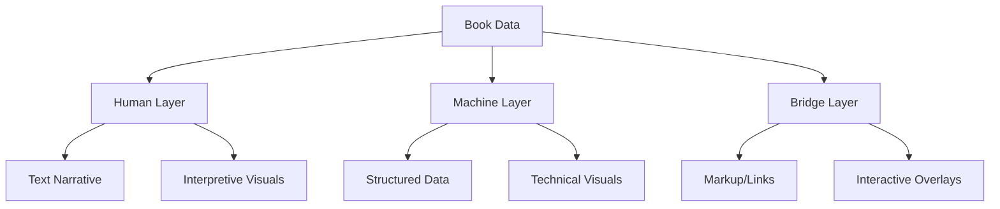
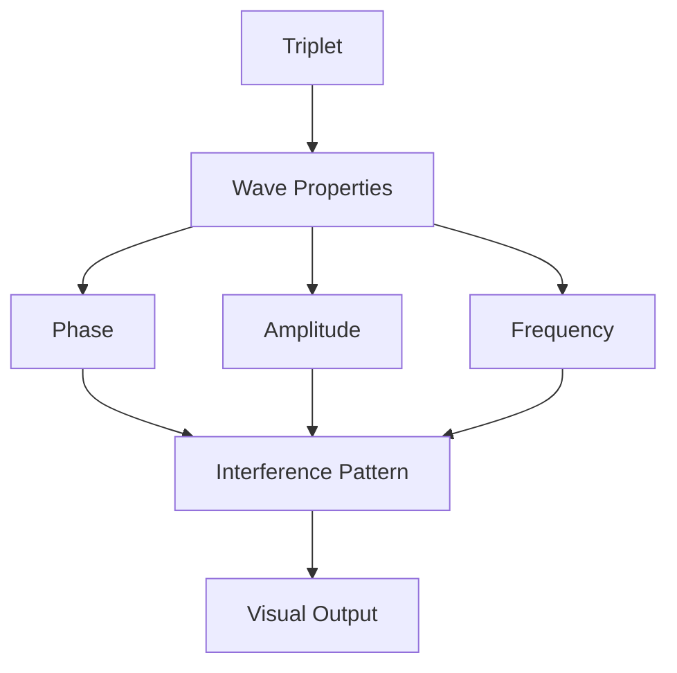
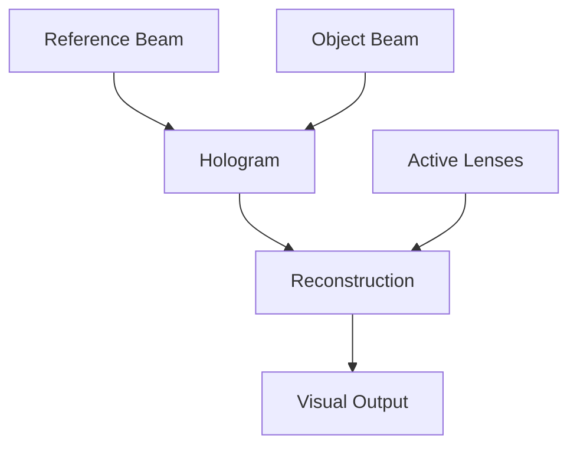
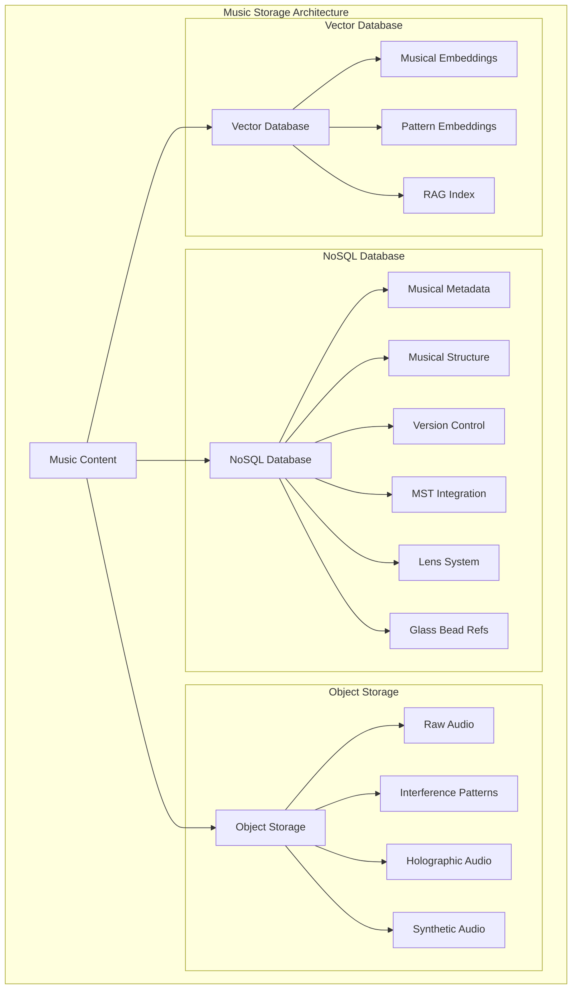
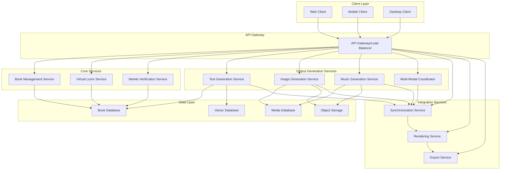
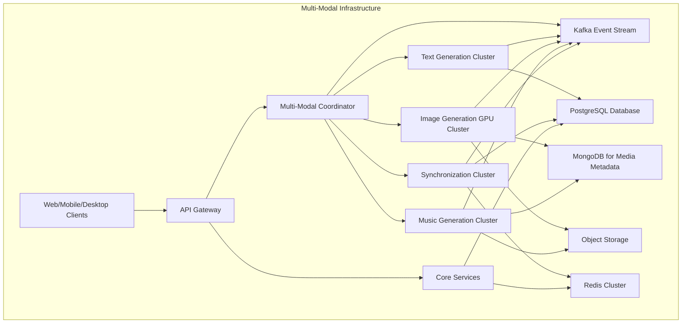
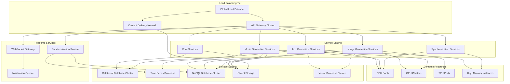

# 3.2.1. Enhanced Machine System Books

Books in Memorativa generate multi-modal output streams that respect the core multi-layered architecture. This integrated system combines text, images, and music into a cohesive knowledge representation framework that engages multiple sensory modalities for enhanced understanding and exploration.

## Enhanced Machine System Books Design Specification

The following document specifies the enhanced Machine System Book design for the machine system. This design extends the cybernetic system design. Following sections will consolidate the cybernetic and machine systems design, finally updating it with the Machine System Books.

## Text, Image, and Music Output System

Books generate three synchronized output streams:

### Text Output Stream
- **Human Layer**: Narrative prose with embedded conceptual links
- **Machine Layer**: Structured data exports (JSON/XML)
- **Bridge Layer**: Markup with conceptual demarcation

### Image Output Stream
- **Human Layer**: Charts and visualizations for direct interpretation
- **Machine Layer**: Network graphs of percept-triplet relationships
- **Bridge Layer**: Interactive overlays linking visuals to data

### Music Output Stream
- **Human Layer**: Thematic musical expressions and narrative motifs
- **Machine Layer**: Sonified data patterns and system states
- **Bridge Layer**: Audio-synchronized navigation cues and markers

These three modalities work in concert to create a multi-sensory knowledge experience that preserves the core architectural principles of Memorativa while engaging different cognitive pathways. The integration between text, image, and music creates a rich knowledge environment where relationships can be understood through multiple simultaneous representations, enhancing both comprehension and retention.

## Virtual Loom Integration in the Enhanced Book System

The Enhanced Book System explicitly incorporates the Virtual Loom as its fundamental organizational framework across all output modalities. While Part 1 introduced the Virtual Loom's theoretical foundation, the Enhanced Book System implements it as the unifying architecture for coordinating text, image, and music outputs.

### Virtual Loom Cross-Modal Loom Implementation

The Virtual Loom extends beyond a conceptual framework to serve as the active integration mechanism for multi-modal outputs:

- **Warp-Weft Organization**: 
  - Text narrative flows follow warp (thematic) threads
  - Visual layouts organize along the same warp dimensions
  - Musical themes develop through identical warp progressions
  - Cross-references maintain warp thread consistency across all modalities

- **Intersection-Based Coordination**:
  - Key narrative moments in text align with focal elements in visuals
  - Musical motifs intensify at the same intersection points
  - Glass Bead positions serve as synchronization markers across modalities
  - Pattern recognition operates consistently across text, image, and sound

- **Integrated Navigation System**:
  ```rust
  struct MultiModalLoomNavigator {
      text_navigator: TextLoomNavigator,
      image_navigator: ImageLoomNavigator,
      music_navigator: MusicLoomNavigator,
      
      fn navigate_warp(&mut self, target_warp: WarpThreadId) -> NavigationResult {
          // Synchronize navigation across all modalities
          let text_result = self.text_navigator.navigate_warp(target_warp)?;
          let image_result = self.image_navigator.navigate_warp(target_warp)?;
          let music_result = self.music_navigator.navigate_warp(target_warp)?;
          
          MultiModalNavigationResult {
              text: text_result,
              image: image_result,
              music: music_result,
          }
      }
      
      fn navigate_weft(&mut self, target_weft: WeftThreadId) -> NavigationResult {
          // Similarly synchronize contextual dimension navigation
          // ... 
      }
      
      fn follow_pattern(&mut self, pattern_id: PatternId) -> MultiModalNavigationPath {
          // Navigate through predefined patterns across all modalities
          // ...
      }
  }
  ```

### Virtual Loom as Processing Framework

Beyond organization, the Virtual Loom serves as an active processing framework:

1. **Thread-Based Content Generation**:
   - Thread tensioning dynamically balances content representation
   - Warp threads determine thematic depth in all modalities
   - Weft threads control contextual breadth across outputs
   - Thread crossings serve as attention points in all media

2. **Pattern-Based Recommendation**:
   - Book system identifies related content through loom patterns
   - Navigation suggestions follow established thread connections
   - Similar patterns in other Books become recommendations
   - Pattern recognition works identically across modalities

3. **Verification Through Loom Structure**:
   - Thread structure preserves angular relationships from Spherical Merkle Trees
   - Verification of thread relationships ensures content integrity
   - Patterns receive verification across modalities
   - Loom tension metrics serve as verification confidence scores

### Virtual Loom Implementation Across Output Types

Each output type implements the Virtual Loom structure with modality-specific adaptations:

- **Text Implementation**:
  - Section organization follows warp thread hierarchy
  - Perspective shifts track weft thread positions
  - Key narrative moments appear at thread intersections
  - Navigation cues highlight related intersections

- **Image Implementation**:
  - Visual layout mirrors the loom's spatial organization
  - Element positioning respects thread intersections
  - Visual styling varies by weft thread position
  - Connected images form visual paths along threads

- **Music Implementation**:
  - Musical themes develop along warp threads
  - Instrumentation and style shift with weft threads
  - Motif intensification occurs at intersections
  - Harmonic relationships mirror thread tensions

This explicit integration ensures that the Virtual Loom operates as both the organizational principle and functional mechanism across all components of the Enhanced Book System, creating a truly unified multi-modal knowledge representation.

## Virtual Loom Text and Image Output System

Books generate output streams that respect the multi-layered architecture and align with the Virtual Loom framework:

### Virtual Loom Text Output Stream
- **Human Layer**
  - Narrative prose with embedded conceptual links
  - Commentary filtered through active Lenses
  - Cultural/philosophical context adaptations
  - **Warp Thread Organization**: Text narrative flows follow warp (thematic) threads
- **Machine Layer**
  - Structured data exports (JSON/XML)
  - Vector embeddings for RAG
  - Metadata serialization
  - Spherical Merkle proofs for verification
  - **Weft Thread Organization**: Cross-references following weft (relationship) threads
- **Bridge Layer**
  - Markup with conceptual demarcation
  - Attribution and source tracking
  - Temporal state markers
  - Angular relationship annotations 

## Virtual Loom Text and Image Output System

Books generate output streams that respect the multi-layered architecture:

### Text Output Stream
- **Human Layer**
  - Narrative prose with embedded conceptual links
  - Commentary filtered through active Lenses
  - Cultural/philosophical context adaptations
- **Machine Layer**
  - Structured data exports (JSON/XML)
  - Vector embeddings for RAG
  - Metadata serialization
  - Spherical Merkle proofs for verification
- **Bridge Layer**
  - Markup with conceptual demarcation
  - Attribution and source tracking
  - Temporal state markers
  - Angular relationship annotations
  - Angular relationship annotations
  - **Intersection-Based Coordination**: Key narrative moments align with focal elements across modalities


### Virtual Loom Image Output Stream

The Image Output System produces a rich variety of visual content that complements the textual elements while representing the underlying conceptual structures. These visualizations range from simple diagrams to complex holographic representations, all driven by the same data structures that power the text generation and following the same Virtual Loom patterns.

#### Core Image Types
- **Human Layer**
  - Charts and visualizations for direct interpretation
  - Cultural symbol representations
  - Narrative-supporting imagery
  - Warp Thread Organization: Visual layouts organize along the same warp dimensions as text
- **Machine Layer**
  - Network graphs of percept-triplet relationships
  - Prototype pattern visualizations
  - Focus space mappings
  - Spherical Merkle Tree visualizations
  - Weft Thread Organization: Visual elements connect using consistent weft relationships
- **Bridge Layer**
  - Interactive overlays linking visuals to data
  - Temporal state indicators
  - Attribution/permission visual markers
  - Angular relationship indicators
  - Intersection-Based Coordination: Glass Bead positions serve as synchronization markers across modalities

#### Integration with Text
Images are deeply integrated with the text content through the Virtual Loom framework:
- **Inline References**: Direct connections between narrative passages and visual elements
- **Expandable Visualizations**: Progressive disclosure of complexity
- **Interactive Elements**: When viewed in digital formats
- **Cross-Modal Verification**: Visual representations of textual verification proofs
- **Pattern Consistency**: Pattern recognition operates consistently across text and images

#### Output Formats and Delivery
The Image Output System delivers visual content in multiple formats:

- **Vector Graphics**: For diagrams, network maps, and structural visualizations
- **Raster Images**: For complex renderings and diffusion-generated content
- **Interactive SVG**: For web-based interactive exploration
- **Layered Composites**: Separating structural, symbolic, and aesthetic elements

### Loom Pattern Visualization

The system includes a specialized image modality dedicated to directly visualizing the Virtual Loom patterns themselves. Rather than representing the content organized by the loom, this modality explicitly renders the organizational framework itself.

#### Direct Loom Visualization Approach

```rust
struct LoomPatternVisualizer {
    loom_renderer: LoomRenderer,
    thread_styler: ThreadStyler,
    intersection_renderer: IntersectionRenderer,
    pattern_highlighter: PatternHighlighter,
    
    fn visualize_loom_structure(&self, book: &Book) -> LoomVisualization {
        // Extract loom structure from book
        let loom = book.get_virtual_loom();
        
        // Create base canvas with appropriate dimensions
        let mut canvas = Canvas::new(Dimensions::adaptive(loom.complexity));
        
        // Render warp threads (thematic dimensions)
        let warp_styles = self.thread_styler.style_warp_threads(loom.warp_threads);
        canvas.draw_warp_threads(loom.warp_threads, warp_styles);
        
        // Render weft threads (contextual dimensions)
        let weft_styles = self.thread_styler.style_weft_threads(loom.weft_threads);
        canvas.draw_weft_threads(loom.weft_threads, weft_styles);
        
        // Render intersections with Glass Beads
        for intersection in loom.occupied_intersections() {
            let style = self.intersection_renderer.create_style(
                intersection.warp, 
                intersection.weft,
                intersection.bead
            );
            canvas.draw_intersection(intersection, style);
        }
        
        // Highlight recognized patterns
        for pattern in loom.identified_patterns {
            let highlight = self.pattern_highlighter.create_highlight(pattern);
            canvas.apply_pattern_highlight(pattern, highlight);
        }
        
        // Add tension indicators
        canvas.apply_tension_indicators(
            self.calculate_thread_tensions(loom)
        );
        
        // Generate interactive components
        let interactions = self.create_interaction_handlers(loom);
        
        LoomVisualization {
            base_image: canvas.render(),
            interactive_elements: interactions,
            metadata: self.generate_metadata(loom),
            thread_index: self.create_thread_index(loom)
        }
    }
    
    fn calculate_thread_tensions(&self, loom: &VirtualLoom) -> ThreadTensions {
        // Calculate tension forces based on connected beads and relationships
        let mut tensions = ThreadTensions::new();
        
        // Analyze warp thread tensions
        for (i, warp) in loom.warp_threads.iter().enumerate() {
            let tension = self.analyze_warp_tension(warp, loom);
            tensions.warp_tensions.insert(i, tension);
        }
        
        // Analyze weft thread tensions
        for (j, weft) in loom.weft_threads.iter().enumerate() {
            let tension = self.analyze_weft_tension(weft, loom);
            tensions.weft_tensions.insert(j, tension);
        }
        
        // Calculate intersection tension points
        for intersection in loom.all_intersections() {
            let warp_tension = tensions.warp_tensions.get(&intersection.warp_id);
            let weft_tension = tensions.weft_tensions.get(&intersection.weft_id);
            
            if let (Some(warp_t), Some(weft_t)) = (warp_tension, weft_tension) {
                let combined = self.calculate_combined_tension(*warp_t, *weft_t);
                tensions.intersection_tensions.insert(
                    (intersection.warp_id, intersection.weft_id), 
                    combined
                );
            }
        }
        
        tensions
    }
    
    fn create_interaction_handlers(&self, loom: &VirtualLoom) -> InteractionHandlers {
        InteractionHandlers {
            thread_hover: self.create_thread_hover_handler(loom),
            thread_select: self.create_thread_select_handler(loom),
            intersection_hover: self.create_intersection_hover_handler(loom),
            intersection_select: self.create_intersection_select_handler(loom),
            pattern_hover: self.create_pattern_hover_handler(loom),
            pattern_select: self.create_pattern_select_handler(loom),
            zoom_handler: self.create_zoom_handler(),
            pan_handler: self.create_pan_handler()
        }
    }
}
```

#### Virtual Loom Visual Encoding System

The Loom Pattern Visualization implements a rich visual language to represent the organizational structure:

| Element | Visual Representation | Meaning |
|---------|----------------------|---------|
| Warp Thread | Vertical line with variable thickness | Thematic dimension strength |
| Weft Thread | Horizontal line with variable thickness | Contextual dimension strength |
| Thread Color | Color spectrum | Thread domain/category |
| Thread Texture | Line pattern (solid, dashed, etc.) | Thread stability/definition |
| Intersection | Circle or node | Potential knowledge position |
| Occupied Intersection | Filled circle with glyph | Glass Bead position |
| Bead Size | Circle diameter | Concept significance |
| Connection Line | Curved line between intersections | Pattern relationship |
| Connection Thickness | Line weight | Relationship strength |
| Tension Indicator | Color gradient along thread | Balancing force in knowledge structure |
| Pattern Highlight | Semi-transparent overlay | Identified knowledge pattern |
| Empty Region | Unfilled space | Knowledge gap/opportunity |

#### Virtual Loom Visualization Modes

The Loom Pattern Visualizer offers multiple ways to view the organizational structure:

1. **Structural View**
   - Emphasizes the grid structure of the loom
   - Shows all threads and intersections
   - Highlights thread tensions through color and thickness
   - Ideal for understanding the overall organizational framework

2. **Occupancy View**
   - Focuses on filled intersections (positioned Glass Beads)
   - Reduces empty intersections to light markers
   - Highlights density patterns and knowledge distribution
   - Useful for identifying knowledge gaps and distribution patterns

3. **Pattern View**
   - Highlights recognized patterns across intersections
   - Connects related beads with relationship lines
   - Uses color coding to differentiate pattern types
   - Best for understanding knowledge relationships and emergent structures

4. **Tension View**
   - Visualizes the tension forces throughout the loom
   - Shows how thread tensioning balances the knowledge structure
   - Uses heat mapping to indicate high/low tension areas
   - Helps identify structural weaknesses or overemphasis

5. **Dynamic View**
   - Animates the loom structure with simulated physics
   - Shows how the knowledge structure responds to forces
   - Allows interactive manipulation to test structural integrity
   - Demonstrates the adaptive nature of the loom organization

#### Virtual Loom Visualization Integration Benefits

This direct visualization of the Virtual Loom patterns provides several unique benefits:

1. **Structural Insight**: Reveals the organizational principles behind Book content
2. **Meta-Knowledge Discovery**: Enables recognition of patterns in how knowledge is organized
3. **Framework Evaluation**: Allows assessment of the loom's balance and completeness
4. **Knowledge Gap Identification**: Clearly shows empty intersections as opportunities
5. **Pattern Recognition Training**: Helps users recognize organizational patterns
6. **Cross-Book Comparison**: Enables comparison of organizational structures between Books
7. **Knowledge Evolution Tracking**: Shows how the organization evolves through versions

#### Virtual Loom Visualization Cross-Modal Integration

The Loom Pattern Visualization integrates with other modalities:

```rust
struct CrossModalLoomIntegrator {
    loom_visualizer: LoomPatternVisualizer,
    text_integrator: TextLoomIntegrator,
    music_integrator: MusicLoomIntegrator,
    
    fn generate_integrated_view(&self, book: &Book) -> IntegratedLoomView {
        // Create direct loom visualization
        let loom_visual = self.loom_visualizer.visualize_loom_structure(book);
        
        // Create text overlays that show how narrative follows the loom
        let text_overlay = self.text_integrator.create_text_mapping(book, loom_visual.clone());
        
        // Create music notation that shows how music expresses the loom
        let music_overlay = self.music_integrator.create_music_mapping(book, loom_visual.clone());
        
        // Combine into integrated view
        IntegratedLoomView {
            base_visualization: loom_visual,
            text_mapping: text_overlay,
            music_mapping: music_overlay,
            combined_controls: self.create_combined_controls(loom_visual, text_overlay, music_overlay)
        }
    }
}
```

This cross-modal integration allows users to directly see how the loom patterns organize all three output modalities (text, images, music), providing a unified meta-view of the Book's organizational structure.

### Image Generation Modes

The system employs three primary approaches to image generation, each with specific strengths and applications:

#### 1. Direct Rendering
- MST-compliant symbol generation
- Precise astronomical charting
- Network/relationship visualization
- Spherical-hyperbolic space representation

#### 2. AI-Assisted Generation
   
The system uses a multi-stage AI pipeline combining multiple diffusion models for precise control and MST compliance:

```rust
struct AIGenerationPipeline {
    sd_xl: StableDiffusionXL,
    control_net: ControlNet,
    flux_model: FluxModel,
    stable_cascade: StableCascade,
    mst_gan: MSTSymbolGAN,
    explainer: GenerationExplainer,
    spherical_merkle_renderer: SphericalMerkleRenderer,
    cultural_neutralizer: CulturalNeutralizer, // MST component for cultural neutralization

    async fn generate(&self, params: AIGenerationParams) -> Result<GenerationResult> {
        // Select appropriate diffusion model based on content requirements
        let model = self.select_optimal_model(
            params.content_type,
            params.quality_requirements,
            params.special_features
        )?;
        
        // Map control parameters to model
        let model_params = self.map_to_model_params(params, model)?;
        
        // Pre-process with hybrid geometric conditioning
        let conditioning = self.create_hybrid_conditioning(
            params.percept_triplets,
            params.angular_relationships,
            params.curvature_parameters
        )?;
        
        // Apply cultural neutralization using MST process from Section 2.5
        let neutralized_params = self.cultural_neutralizer.neutralize(
            model_params,
            params.cultural_context,
            params.symbolic_references
        )?;
        
        // Generate base image with selected model
        let base_image = match model {
            DiffusionModel::SDXL => self.sd_xl.generate(neutralized_params).await?,
            DiffusionModel::Flux => self.flux_model.generate(neutralized_params).await?,
            DiffusionModel::StableCascade => self.stable_cascade.generate(neutralized_params).await?
        };

        // Apply ControlNet for structure
        let control_params = self.map_to_control_params(params, conditioning)?;
        let structured_image = self.control_net.refine(base_image, control_params)?;

        // Refine MST symbols
        let refined_image = self.mst_gan.refine_symbols(
            structured_image, 
            params.mst_symbols,
            conditioning.symbol_mapping
        )?;
        
        // Apply Spherical Merkle Tree structure and angular relationships
        let spatial_image = self.spherical_merkle_renderer.apply_spatial_relationships(
            refined_image,
            params.merkle_node,
            conditioning.angular_relationships
        )?;

        // Generate explainability data
        let explanation = self.explainer.explain_generation(
            base_image, structured_image, refined_image, spatial_image, params
        )?;

        // Apply verification markers
        let verified_image = self.apply_verification_markers(
            spatial_image,
            params.verification_scores,
            params.privacy_level
        )?;

        Ok(GenerationResult { 
            image: verified_image, 
            explanation,
            merkle_node: self.create_image_merkle_node(verified_image, params)?
        })
    }

    fn map_to_sdxl_params(&self, params: AIGenerationParams) -> Result<SDXLParams> {
        let style = match params.cultural_context {
            Culture::Western => StyleCondition {
                base_style: "contemporary_western",
                art_movement: "digital_minimalism",
                composition: "rule_of_thirds",
                color_theory: "western_palette",
            },
            Culture::Eastern => StyleCondition {
                base_style: "traditional_eastern",
                art_movement: "zen_minimalism", 
                composition: "asymmetric_balance",
                color_theory: "eastern_palette",
            },
            // ... other cultures
        };

        let prompt_weights = params.lens_weights.iter()
            .map(|(lens, weight)| {
                match lens {
                    Lens::Technical => PromptWeight {
                        emphasis: weight * 1.2, // Technical details emphasized
                        descriptors: vec!["precise", "detailed", "systematic"],
                        modifiers: vec!["technical", "structured", "analytical"],
                    },
                    Lens::Cultural => PromptWeight {
                        emphasis: weight * 1.0,
                        descriptors: vec!["symbolic", "traditional", "meaningful"],
                        modifiers: vec!["cultural", "contextual", "historical"],
                    },
                    // ... other lenses
                }
            })
            .collect();

        Ok(SDXLParams {
            style_conditioning: style,
            prompt_weights,
            temporal_bias: self.map_temporal_bias(params.time_state, params.temporal_blur),
            // ... other mappings
        })
    }

    // Map to Flux model parameters
    fn map_to_flux_params(&self, params: AIGenerationParams) -> Result<FluxParams> {
        // Create Flux-specific parameters
        Ok(FluxParams {
            prompt: self.create_enhanced_prompt(params.prompt, params.lens_weights)?,
            negative_prompt: params.negative_prompt,
            seed: params.seed.unwrap_or_else(|| self.generate_seed()),
            width: params.dimensions.width,
            height: params.dimensions.height,
            num_inference_steps: params.quality_requirements.detail_level * 10 + 30,
            guidance_scale: 7.5 + (params.quality_requirements.adherence_to_prompt * 0.5),
            hybrid_conditioning: self.create_flux_conditioning(params.percept_triplets)?,
            spherical_coordinates: params.percept_triplets.iter()
                .map(|t| [t.theta, t.phi, t.radius, t.curvature])
                .collect()
        })
    }

    // Map to Stable Cascade parameters
    fn map_to_cascade_params(&self, params: AIGenerationParams) -> Result<StableCascadeParams> {
        // Extract angular relationships for three-stage cascade
        let angular_data = self.extract_angular_data(params.angular_relationships)?;
        
        // Create stage-specific parameter sets
        let stage_a = self.create_stage_a_params(params.prompt, angular_data.clone())?;
        let stage_b = self.create_stage_b_params(angular_data.clone())?;
        let stage_c = self.create_stage_c_params(params.dimensions, params.quality_requirements)?;
        
        Ok(StableCascadeParams {
            prompt: params.prompt,
            negative_prompt: params.negative_prompt,
            stage_a,
            stage_b,
            stage_c,
            seed: params.seed.unwrap_or_else(|| self.generate_seed()),
            guidance_scale: 4.0 + (params.quality_requirements.adherence_to_prompt * 0.5),
            num_inference_steps: params.quality_requirements.detail_level * 5 + 20,
            angular_relationships: angular_data
        })
    }

    fn map_to_control_params(&self, params: AIGenerationParams) -> Result<ControlParams> {
        let symbol_controls = params.mst_symbols.iter()
            .map(|symbol| {
                let position = match symbol.archetype {
                    Archetype::Central => Position::Center,
                    Archetype::Supporting => Position::Peripheral {
                        angle: symbol.relationship_angle,
                        distance: symbol.relationship_strength * MAX_DISTANCE,
                    },
                    // ... other archetypes
                };

                ControlPoint {
                    position,
                    importance: params.symbol_importance[symbol],
                    constraints: SymbolConstraints {
                        min_size: symbol.min_visual_size,
                        max_size: symbol.max_visual_size,
                        required_spacing: symbol.spacing_requirements,
                        alignment: symbol.alignment_rules,
                    }
                }
            })
            .collect();

        let structural_guidance = params.lens_weights.iter()
            .map(|(lens, weight)| match lens {
                Lens::Technical => StructuralGuide {
                    grid_strength: weight * 1.2,
                    connection_emphasis: weight * 1.5,
                    detail_preservation: weight * 1.3,
                },
                Lens::Abstract => StructuralGuide {
                    grid_strength: weight * 0.8,
                    connection_emphasis: weight * 1.0,
                    detail_preservation: weight * 0.7,
                },
                // ... other lenses
            })
            .fold(StructuralGuide::default(), |acc, guide| acc.combine(guide));

        Ok(ControlParams {
            symbol_controls,
            structural_guidance,
            angular_relationships: params.angular_relationships.clone(),
            merkle_structure: params.merkle_node.clone(),
            // ... other control parameters
        })
    }
    
    fn create_hybrid_conditioning(
        &self,
        triplets: Vec<HybridTriplet>,
        relationships: HashMap<(UUID, UUID), Angle>,
        curvature: CurvatureParameters
    ) -> Result<HybridConditioning> {
        // Create conditioner
        let conditioner = HybridGeometricConditioner::new(
            self.spatial_encoder.clone(),
            self.angular_mapper.clone()
        );
        
        // Extract coordinates
        let coordinates = triplets.iter()
            .map(|t| [t.theta, t.phi, t.radius, t.curvature])
            .collect();
            
        // Create symbol mapping
        let symbol_mapping = self.create_symbol_mapping(triplets, relationships.clone())?;
        
        // Generate conditioning
        Ok(HybridConditioning {
            coordinates,
            angular_relationships: relationships,
            curvature_parameters: curvature,
            symbol_mapping,
            conditioning_vectors: conditioner.create_conditioning_vectors(
                triplets, relationships, curvature
            )?
        })
    }
}
```

The explainability system provides:
- Interactive attention maps showing lens influence
- Symbol placement analysis with confidence scores
- Time state impact visualization
- Cultural context preservation metrics
- Spatial relationship analysis
- Step-by-step generation breakdown
- Model confidence reporting

#### 3. Hybrid Generation
- Combined technical/symbolic representations
- Multi-lens visual interpretations
- Temporal context overlays
- Cross-modal semantic alignment

### Integration with Spherical Merkle Trees

A crucial aspect of the Image Output System is its integration with Spherical Merkle Trees:

- **Visual Verification**: Images contain visual elements that represent verification proofs
- **Angular Relationship Visualization**: Shows spatial relationships between concepts as defined in the Spherical Merkle structure
- **Integrity Indicators**: Visual cues that reflect the verification status of content
- **Delta Visualization**: Representations of changes between versions

### Output Processing Pipeline

*Figure 3: Output Processing Pipeline, showing how Book data flows through the three architectural layers to generate different output types, illustrating the parallel processing of text and visual elements within each layer*

## Synthetic Image Generation System

The system generates three distinct types of synthetic images that leverage the Spherical Merkle Tree structure for both verification and visualization:

### 1. Interference Pattern Images

Generated directly from percept-triplet structures using wave interference simulation:

- **Wave Generation**
  - Maps triplet components (θ, φ, r) to wave properties
  - Archetypal angle (θ) → phase angle
  - Expression elevation (φ) → amplitude
  - Radius (r) → frequency


*Figure 4: Interference Pattern Generation Process, depicting how triplet components are mapped to wave properties that produce interference patterns, demonstrating the transformation of conceptual relationships into visual representations*

- **Pattern Types**
  - Constructive interference regions show strong alignments
  - Destructive interference reveals conceptual tensions
  - Phase relationships map to symbolic meanings

### 2. Holographic Reconstructions

Simulated holographic images generated from interference patterns:

- **Reference Beam**
  - Natal chart serves as coherent reference
  - Stable "light source" for reconstruction
  - Encodes player's base symbolic framework

- **Object Beam**
  - Generated from Glass Bead percept-triplets
  - Carries specific symbolic information
  - Modulated by active Lenses

- **Reconstruction Process**

*Figure 5: Holographic Reconstruction Process, showing the interaction between Reference Beam (natal chart) and Object Beam (glass bead percept-triplets) to create holographic outputs, highlighting how Active Lenses influence the final visual reconstruction*

### 3. Symbolic Synthesis Images

AI-generated images that combine interference patterns and holographic principles using the diffusion models described in the previous section:

- **Input Sources**
  - Raw interference patterns
  - Holographic reconstructions
  - MST-translated symbols
  - Active Lens configurations

- **Generation Parameters**
  - Pattern coherence
  - Symbolic density
  - Cultural context mapping
  - Temporal state alignment

This implementation directly utilizes the `DiffusionModelProvider` interface and multimodal fusion capabilities described in Section 2.21, ensuring consistent image generation across the Memorativa system.

### Synthetic Image Generation Implementation Details

```rust
struct MultiModalImageGenerator {
    interference_engine: InterferenceEngine,
    hologram_simulator: HologramSimulator, 
    diffusion_processor: DiffusionAdapter,
    merkle_integrator: SphericalMerkleInterface,

    async fn generate_book_visual(
        &self, 
        book_content: BookContent,
        visual_type: VisualType,
        hybrid_triplets: Vec<HybridTriplet>
    ) -> Result<BookVisual> {
        match visual_type {
            VisualType::Interference => {
                // Generate interference pattern
                let wave_properties = self.triplets_to_waves(hybrid_triplets)?;
                let pattern = self.interference_engine.generate_pattern(wave_properties)?;
                BookVisual::Interference(pattern)
            },
            VisualType::Holographic => {
                // Generate holographic reconstruction
                let reference = self.get_natal_reference(book_content.owner_id)?;
                let object = self.create_object_beam(hybrid_triplets)?;
                let reconstruction = self.hologram_simulator.reconstruct(reference, object)?;
                BookVisual::Holographic(reconstruction)
            },
            VisualType::Symbolic => {
                // Generate symbolic synthesis with diffusion models
                
                // First generate preliminary visual elements
                let interference = self.generate_book_visual(
                    book_content.clone(), 
                    VisualType::Interference,
                    hybrid_triplets.clone()
                ).await?;
                
                let holographic = self.generate_book_visual(
                    book_content.clone(), 
                    VisualType::Holographic,
                    hybrid_triplets.clone()
                ).await?;
                
                // Extract MST symbols
                let symbols = self.extract_mst_symbols(book_content, hybrid_triplets.clone())?;
                
                // Create prompt from book content and symbols
                let prompt = self.create_visual_prompt(book_content, symbols)?;
                
                // Apply hybrid geometric conditioning
                let conditioned = self.apply_geometric_conditioning(
                    prompt, 
                    hybrid_triplets,
                    interference.get_pattern_data()?,
                    holographic.get_reference_data()?
                )?;
                
                // Generate with appropriate diffusion model
                let visual = match self.select_optimal_model(book_content, visual_type) {
                    DiffusionModel::Flux => self.diffusion_processor.generate_with_flux(conditioned).await?,
                    DiffusionModel::StableDiffusionXL => self.diffusion_processor.generate_with_sdxl(conditioned).await?,
                    DiffusionModel::StableCascade => self.diffusion_processor.generate_with_cascade(conditioned).await?
                };
                
                // Create Spherical Merkle proof for visual
                let merkle_node = self.merkle_integrator.create_visual_merkle_node(
                    visual.clone(),
                    hybrid_triplets,
                    book_content.merkle_references
                )?;
                
                BookVisual::Symbolic(SymbolicVisual {
                    image: visual,
                    merkle_node,
                    angular_relationships: self.extract_angular_relationships(merkle_node)?,
                    temporal_states: book_content.temporal_states
                })
            },
            VisualType::Interactive => {
                // Generate interactive multi-state visual
                let base_visual = self.generate_book_visual(
                    book_content.clone(),
                    VisualType::Symbolic,
                    hybrid_triplets.clone()
                ).await?;
                
                // Create variations for different states
                let states = self.generate_visual_states(
                    base_visual,
                    book_content.interactive_states,
                    hybrid_triplets
                ).await?;
                
                BookVisual::Interactive(InteractiveVisual {
                    base: base_visual,
                    states,
                    transition_rules: self.generate_transition_rules(states)?,
                    interaction_handlers: self.create_interaction_handlers(book_content.interaction_specs)?
                })
            }
        }
    }

    fn apply_geometric_conditioning(
        &self,
        prompt: String,
        triplets: Vec<HybridTriplet>,
        interference_data: InterferenceData,
        holographic_data: HolographicData
    ) -> Result<ConditionedInput> {
        // Create geometric conditioner
        let conditioner = HybridGeometricConditioner::new(
            self.spatial_encoder.clone(),
            self.angular_mapper.clone()
        );
        
        // Apply hybrid conditioning using triplets
        let mut conditioned = conditioner.apply_hybrid_conditioning(
            &prompt, triplets
        )?;
        
        // Enhance with interference pattern data
        conditioned = self.enhance_with_interference(
            conditioned, interference_data
        )?;
        
        // Enhance with holographic data
        self.enhance_with_holographic(
            conditioned, holographic_data
        )
    }
}
```

### Synthetic Image Generation Validation and Analysis

#### Quantitative Metrics

1. **Interference Coherence**
   - Wave alignment score (0-1): Measures phase synchronization
   - Pattern stability index: Tracks interference node stability
   - Frequency distribution uniformity (χ² test)
   - Signal-to-noise ratio for pattern clarity

2. **Holographic Fidelity**
   - Reconstruction accuracy (RMSE from reference)
   - Phase preservation score
   - Information density (bits/unit area)
   - Temporal coherence measurement

3. **Symbolic Accuracy**
   - MST compliance score (0-1)
   - Symbol placement precision (px deviation)
   - Semantic consistency rating
   - Cultural context preservation index

4. **Multi-modal Integration**
   - Cross-modal alignment score
   - Semantic preservation rating
   - Angular relationship consistency
   - Verification-weighted assessment
   - Observer-centric evaluation

5. **Perceptual Quality**
   - Resolution independence assessment
   - Structural integrity across scales
   - Detail preservation measurement
   - Temporal state transition smoothness
   - Interactive responsiveness metrics

## Machine Music Integration

Books in Memorativa incorporate machine music as a third output modality alongside text and images, creating a complete multi-sensory knowledge representation system. The Machine Music component transforms the book's knowledge structures into auditory experiences that complement and enhance the other modalities.

### Music Output Stream

Like text and images, the music output system implements the multi-layered architecture of Books:

- **Human Layer**
  - Narrative musical themes and motifs
  - Cultural context adaptations through musical styles
  - Emotional/thematic elements expressed as harmonic progressions
  - Synchronized musical accompaniment to text narrative
  - Warp Thread Organization: Musical themes develop along the same warp progressions as text and images
  
- **Machine Layer**
  - Structured audio data sonifying system patterns
  - Glass Bead patterns translated into sonic elements
  - MST-compliant musical encoding
  - Spherical Merkle Tree verification through harmonic structures
  - Weft Thread Organization: Musical styles shift with weft thread positions
  
- **Bridge Layer**
  - Audio-text synchronization markers
  - Visual element timing cues
  - Temporal state indicators as musical transitions
  - Interactive navigation sounds
  - Angular relationship sonification
  - Intersection-Based Coordination: Musical motifs intensify at the same intersection points as text and images

### Music Generation Approaches

The music system employs three generation approaches that parallel the image generation system:

#### 1. Interference Pattern Music

Generated directly from percept-triplet structures using wave interference:

```rust
fn generate_interference(&self, triplet: HybridTriplet) -> Music {
    // Transform triplet components to musical properties
    // Archetypal angle (θ) → pitch/key
    // Expression elevation (φ) → rhythm/tempo
    // Radius (r) → amplitude/dynamics
    // Curvature parameter (κ) → harmonic complexity
    let wave = self.interference_engine.triplet_to_wave(triplet);
    self.interference_engine.generate_pattern(wave)
}
```

The mapping system translates hybrid triplet components to musical elements:
- Constructive interference creates harmonious passages
- Destructive interference generates tension
- Phase relationships map to musical intervals
- Spatial coordinates influence melodic contours

#### 2. Holographic Music

Simulated holographic reconstruction of musical patterns using reference and object beams:

```rust
fn generate_hologram(&self, natal: GlassBead, object: GlassBead) -> Music {
    // Create reference beam from natal glass bead
    let reference = self.hologram_simulator.create_reference_beam(natal);
    // Create object beam from content glass bead
    let object_beam = self.hologram_simulator.create_object_beam(object);
    // Reconstruct musical hologram
    self.hologram_simulator.reconstruct(reference, object_beam)
}
```

The holographic approach provides:
- Personal reference framework based on Natal Glass Bead
- Content-specific musical themes from Object Beam
- Rich layering of musical elements through interference patterns
- Lens-mediated musical interpretation

#### 3. Symbolic Synthesis Music

AI-generated music combining interference patterns and holographic principles:

```rust
fn generate_symbolic(&self, pattern: Music, hologram: Music) -> Music {
    // Extract symbolic elements using MST
    let symbols = self.mst.translate_musical_elements(pattern, hologram);
    // Generate complete musical expression
    self.symbolic_synthesizer.generate(symbols)
}
```

This approach integrates:
- Cultural context adaptation through lens-specific musical styles
- Temporal state expression through tempo and rhythmic variations
- Symbolic coherence through MST-compliant musical encoding
- Dynamic lens-based transformations of musical elements

### Music Spherical Merkle Tree Integration

The music system uses Spherical Merkle Trees to maintain both content integrity and musical coherence:

```rust
struct MusicalMerkleNode {
    // Core data
    content: MusicFragment,
    hash: [u8; 32],
    
    // Hierarchical structure
    children: Vec<NodeId>,
    parent: Option<NodeId>,
    
    // Spherical coordinates and relationships
    theta: f32,         // Archetypal angle (pitch/harmony)
    phi: f32,          // Expression elevation (rhythm)
    radius: f32,       // Mundane magnitude (amplitude)
    kappa: f32,        // Curvature parameter (complexity)
    
    // Angular relationships
    angular_relationships: HashMap<NodeId, AngularMusicalRelationship>
}
```

This integration ensures:
1. **Musical Coherence Verification**: Validates harmonically related nodes maintain proper musical intervals
2. **Spatial Musical Expression**: Preserves coordinates essential for musical parameters
3. **Verifiable Musical Provenance**: Provides cryptographic proof of ownership and attribution
4. **Non-Linear Music Composition**: Supports cyclic musical structures through spherical topology

### Music Book Integration Architecture

The music generation system integrates with Books through a dedicated output system that implements the Virtual Loom framework:

```rust
struct MusicBookOutput {
    narrative_layer: AudioNarrative,
    machine_layer: MachineAudioData,
    bridge_layer: AudioBridgeLayer,
    loom_navigator: MusicLoomNavigator, // Virtual Loom navigator component
    
    fn generate_for_book(&self, book: &Book) -> BookAudioContent {
        // Generate narrative audio from book content
        let narrative = self.narrative_layer.generate(book.narrative);
        // Generate machine layer from system data
        let machine_data = self.machine_layer.generate(book.machine_data);
        // Link layers with bridge elements
        let bridge = self.bridge_layer.link(narrative, machine_data);
        // Apply Virtual Loom patterns for integration with other modalities
        let coordinated_audio = self.loom_navigator.organize_with_loom(
            book.loom_structure,
            narrative,
            machine_data,
            bridge
        );
        
        BookAudioContent {
            audio: coordinated_audio,
            metadata: self.generate_metadata(book),
            temporal_markers: self.mark_time_states(book.time_states),
            loom_positions: self.loom_navigator.get_thread_positions() // Thread positions for cross-modal coordination
        }
    }
}
```

### Music Layered Music Architecture

The music system creates distinct layers that align with the book's architectural layers:

#### 1. Warp-Weft Musical Organization
- Musical themes develop along warp threads that correspond to narrative themes in text
- Instrumentation and style variants follow weft thread positions
- Thread intersections manifest as musical focal points for attention
- Thread tension translates to harmonic tension and resolution

#### 2. Narrative Layer
- Human-interpretable musical themes
- Cultural context adaptations through musical styles
- Emotional/thematic development
- Story-driven musical progression

#### 3. Machine Layer
- Data-driven sonic patterns
- System state sonification
- Glass Bead integrations as musical motifs
- Technical precision through mathematical musical relationships

#### 4. Bridge Layer
- Seamless transitions between narrative and machine elements
- Cross-modal synchronization cues
- Integration markers as auditory signposts
- Unified musical coherence across the book

### Music MST Integration and Cultural Adaptation

The music system maintains full compatibility with the Memorativa Symbolic Translator:

```rust
struct MSTComplianceChecker {
    mst: SymbolicTranslator,
    
    fn validate_musical_symbols(&self, music: &Music) -> MSTValidation {
        MSTValidation {
            // Check that musical elements map to universal symbols
            harmonic_compliance: self.validate_harmonics(music.harmonics),
            rhythmic_compliance: self.validate_rhythms(music.rhythms),
            melodic_compliance: self.validate_melodies(music.melodies),
            
            // Verify cultural neutrality
            cultural_bias: self.check_cultural_bias(music),
            
            // Ensure semantic preservation
            semantic_coherence: self.check_semantic_relationships(music)
        }
    }
}
```

This ensures that musical elements properly map to universal symbolic concepts:
- Harmonic structures represent archetypal concepts (e.g., Major chord → "Expansion/Growth")
- Rhythmic patterns translate to conceptual domains (e.g., 4/4 time → "Stability/Foundation")
- Musical relationships preserve semantic meaning (e.g., "Moon in Cancer 4th" → "Nurturing melody over stable rhythm")

### Music Lens System Integration

The music output adapts dynamically based on active lenses:

```rust
struct MusicLensSystem {
    active_lenses: Vec<Lens>,
    transition_engine: TransitionEngine,
    
    fn apply_lenses(&self, music: &mut Music) {
        for lens in &self.active_lenses {
            match lens.type_ {
                LensType::Cultural => self.apply_cultural_lens(music, lens),
                LensType::Temporal => self.apply_temporal_lens(music, lens),
                LensType::Conceptual => self.apply_conceptual_lens(music, lens),
                LensType::Emotional => self.apply_emotional_lens(music, lens),
            }
        }
    }
}
```

This allows for:
- Cultural lenses that modify scales, rhythms, and instrumentation
- Temporal lenses that affect musical time signatures and tempo
- Conceptual lenses that shape harmonic relationships
- Emotional lenses that influence dynamics and expression

### Music Multi-Modal Integration

The music system is designed to work in harmony with text and image outputs:

```rust
struct MultiModalIntegrator {
    text_sync: TextSynchronizer,
    image_sync: ImageSynchronizer,
    music_generator: MusicGenerator,
    
    fn integrate_book_outputs(&self, book: &Book) -> IntegratedOutput {
        // Generate text, image, and music outputs
        let text = self.generate_text(book);
        let images = self.generate_images(book);
        let music = self.music_generator.generate_for_book(book);
        
        // Create synchronized integration points
        let text_music_sync = self.text_sync.synchronize(text, music);
        let image_music_sync = self.image_sync.synchronize(images, music);
        
        // Create complete integrated output
        IntegratedOutput {
            text,
            images,
            music,
            text_music_sync,
            image_music_sync,
            combined_merkle_tree: self.build_combined_merkle_tree(text, images, music)
        }
    }
}
```

Key integration features include:
1. **Synchronized Navigation**: Musical cues for textual and visual navigation
2. **Cross-Modal Themes**: Consistent thematic expression across modalities
3. **Unified Verification**: Combined Spherical Merkle Trees for cross-modal integrity
4. **Temporal Alignment**: Synchronized time states across all three modalities
5. **Interactive Feedback**: Musical responses to user interaction with text and images

### Music Storage Integration

Music content is stored in a specialized architecture that integrates with the Book storage system:


*Figure 8: Music Storage Architecture, depicting the storage components for musical outputs in the Memorativa Book system, showing how audio content, metadata, and embeddings are organized across different database types for efficient retrieval and processing*

### Music Parameter Mapping System

The system maps conceptual elements to musical parameters through a comprehensive translation framework:

```rust
struct AstrologicalMusicMapping {
    // Planet -> Pitch/Harmony mappings
    planet_mappings: HashMap<Planet, PitchMapping>,
    // Sign -> Scale/Mode mappings 
    sign_mappings: HashMap<Sign, ScaleMapping>,
    // House -> Rhythm mappings
    house_mappings: HashMap<House, RhythmPattern>,
    // Aspect -> Harmonic Interval mappings
    aspect_mappings: HashMap<Aspect, HarmonicInterval>,

    fn map_natal_chart(&self, chart: &NatalChart) -> MusicParameters {
        MusicParameters {
            base_key: self.derive_key_from_planets(&chart.planets),
            modal_structure: self.derive_mode_from_signs(&chart.signs),
            rhythm_patterns: self.derive_rhythms_from_houses(&chart.houses),
            harmonic_progressions: self.derive_harmonies_from_aspects(&chart.aspects)
        }
    }
}
```

This framework ensures:
1. **Semantic Preservation**: Maintains conceptual meaning when translating to music
2. **Cognitive Accessibility**: Makes complex system relationships audible and intuitive
3. **Cultural Integration**: Respects traditional musical-conceptual correspondences

### Music Token Economics Alignment

The music generation system follows the same token economics framework as other Book outputs:

| Operation | GBT Cost | Description |
|-----------|----------|-------------|
| Basic Music Generation | 10-15 GBT | Simple musical theme generation |
| Interference Pattern | 5-10 GBT | Direct wave interference patterns |
| Holographic Reconstruction | 10-20 GBT | Reference/object beam interaction |
| Full Symbolic Synthesis | 20-30 GBT | Complete AI-driven composition |
| Multi-modal Integration | 15-25 GBT | Music synchronized with text/images |
| Lens Application | 5-10 GBT | Musical style adaptation |
| Verification | 3-8 GBT | Musical integrity verification |

### Music Systemic Polyrhythms

The technical architecture creates an emergent symphony through interacting systems:

- **Structural Bassline (Spherical Merkle Trees)**: Data integrity proofs provide steady foundational rhythm
- **Melodic Lead (Quantum Patterns)**: Pattern recognition generates melodic phrases
- **Harmonic Texture (Holographic Storage)**: Distributed storage creates layered harmonies
- **Rhythmic Engine (Gas Tokens)**: Token flow rates control tempo

### Music User Experience

The music integration enhances the Book experience through:

1. **Cross-Modal Synchronization**:
   - Key musical motifs align with narrative moments and visual elements
   - Glass Bead positions serve as markers for all three modalities
   - Navigation cues provide consistent audio feedback across the loom structure
   - Pattern recognition allows musical elements to be identified through the same framework as text and images
2. **Ambient Accompaniment**: Background music that adapts to reading pace and content
3. **Interactive Elements**: Musical responses to user interaction with text and images
4. **Knowledge Sonification**: Complex data relationships expressed through sound
5. **Thematic Development**: Musical themes that evolve with narrative progression
6.. **Emotional Context**: Harmonic elements that enhance emotional understanding
7. **Conceptual Reinforcement**: Key concepts emphasized through musical motifs

## System Architecture

### Multi-Modal System Architecture

The Enhanced Book System implements a specialized microservices architecture for handling multiple output modalities:



### Technology Stack Expansion

The Enhanced Book System builds upon the core technology stack from Part 1 with these additions:

#### Multi-Modal Processing
- **Text Processing**: TensorFlow/PyTorch for text generation and story structuring
- **Image Processing**: 
  - CLIP for visual-semantic embedding
  - Diffusion models (Stable Diffusion XL, FLUX.1, Stable Cascade)
  - ControlNet for structural guidance
- **Audio Processing**:
  - TensorFlow/Magenta for music generation
  - Web Audio API for client-side audio rendering
  - WebAssembly for high-performance audio processing

#### Real-Time Synchronization
- **WebRTC**: For real-time multi-modal synchronization
- **WebSockets**: For event-driven coordination
- **Redis Streams**: For pub/sub event messaging between services
- **Custom Binary Protocol**: For efficient multi-modal synchronization

#### Storage Extensions
- **Binary Large Objects (BLOBs)**: For audio and image data
- **Time Series Database**: For temporal alignment of multi-modal content
- **Spatial Database**: For maintaining geometric relationships across modalities

### Service Implementation

#### Multi-Modal Coordinator

Core service responsible for synchronizing the three output modalities:

```typescript
interface MultiModalCoordinator {
  // Coordinate generation across modalities
  coordinateGeneration(
    bookId: string, 
    generationOptions: MultiModalGenerationOptions
  ): Promise<MultiModalSynchronizationPlan>;
  
  // Create synchronized output streams
  createSynchronizedStreams(
    bookId: string, 
    plan: MultiModalSynchronizationPlan
  ): Promise<SynchronizedStreams>;
  
  // Adjust synchronization in real-time
  adjustSynchronization(
    streamId: string, 
    adjustments: SynchronizationAdjustments
  ): Promise<SynchronizationResult>;
  
  // Handle multi-modal interaction events
  handleInteractionEvent(
    streamId: string, 
    event: InteractionEvent
  ): Promise<MultiModalResponse>;
  
  // Export synchronized content
  exportMultiModalContent(
    streamId: string, 
    exportFormat: ExportFormat
  ): Promise<ExportResult>;
}
```

#### Image Generation Service

Handles the generation of all visual content:

```typescript
interface ImageGenerationService {
  // Virtual Loom visualization
  generateLoomVisualization(
    bookId: string, 
    options: LoomVisualizationOptions
  ): Promise<LoomVisualization>;
  
  // Interference pattern generation
  generateInterferencePattern(
    triplets: HybridTriplet[], 
    options: InterferenceOptions
  ): Promise<InterferencePattern>;
  
  // Holographic reconstruction
  generateHolographicReconstruction(
    referenceBeam: GlassBead,
    objectBeam: GlassBead,
    options: HolographicOptions
  ): Promise<HolographicImage>;
  
  // Symbolic synthesis with diffusion models
  generateSymbolicImage(
    prompt: string,
    conditioning: HybridConditioning,
    options: DiffusionOptions
  ): Promise<SymbolicImage>;
  
  // Multi-state interactive visuals
  generateInteractiveVisual(
    baseImage: SymbolicImage,
    states: StateTransitions,
    options: InteractiveOptions
  ): Promise<InteractiveVisual>;
  
  // Cross-modal visual alignment
  alignWithTextAndMusic(
    imageId: string,
    textSections: string[],
    musicSegments: string[],
    alignmentOptions: AlignmentOptions
  ): Promise<CrossModalAlignment>;
}
```

#### Music Generation Service

Handles the generation of all audio content:

```typescript
interface MusicGenerationService {
  // Generate music from book content
  generateBookMusic(
    bookId: string, 
    options: MusicGenerationOptions
  ): Promise<BookMusic>;
  
  // Generate interference pattern audio
  generateInterferenceAudio(
    triplets: HybridTriplet[], 
    options: AudioInterferenceOptions
  ): Promise<InterferenceAudio>;
  
  // Generate holographic audio reconstruction
  generateHolographicAudio(
    referenceBeam: GlassBead,
    objectBeam: GlassBead,
    options: HolographicAudioOptions
  ): Promise<HolographicAudio>;
  
  // Generate symbolic music synthesis
  generateSymbolicMusic(
    symbols: MSTSymbol[],
    options: SymbolicMusicOptions
  ): Promise<SymbolicMusic>;
  
  // Generate lens-specific musical adaptations
  generateLensMusic(
    baseMusic: SymbolicMusic,
    lens: Lens,
    options: LensMusicOptions
  ): Promise<LensMusic>;
  
  // Align music with text and visual elements
  alignWithTextAndVisuals(
    musicId: string,
    textSections: string[],
    visualElements: string[],
    alignmentOptions: AudioAlignmentOptions
  ): Promise<AudioAlignment>;
}
```

#### Synchronization Service

Handles the precise temporal alignment between modalities:

```typescript
interface SynchronizationService {
  // Create sync points across modalities
  createSyncPoints(
    bookId: string, 
    contentMap: MultiModalContentMap
  ): Promise<SyncPointMap>;
  
  // Register intersection-based synchronization
  registerIntersectionSync(
    warpId: string,
    weftId: string,
    syncOptions: IntersectionSyncOptions
  ): Promise<IntersectionSyncPoint>;
  
  // Create navigation markers
  createNavigationMarkers(
    streamId: string, 
    markerPoints: MarkerPoint[]
  ): Promise<NavigationMarkerMap>;
  
  // Generate temporal alignment plan
  generateAlignmentPlan(
    textTimeline: Timeline,
    visualTimeline: Timeline,
    musicTimeline: Timeline
  ): Promise<AlignmentPlan>;
  
  // Validate synchronization integrity
  validateSyncIntegrity(
    streamId: string
  ): Promise<SyncIntegrityResult>;
}
```

### Database Schema Extensions

#### Multi-Modal Content Schema (PostgreSQL)

```sql
-- Multi-modal streams
CREATE TABLE multi_modal_streams (
    id UUID PRIMARY KEY,
    book_id UUID NOT NULL REFERENCES books(id),
    created_at TIMESTAMP WITH TIME ZONE NOT NULL DEFAULT NOW(),
    status VARCHAR(50) NOT NULL,
    synchronization_plan JSONB NOT NULL,
    metadata JSONB
);

-- Text content
CREATE TABLE text_outputs (
    id UUID PRIMARY KEY,
    stream_id UUID NOT NULL REFERENCES multi_modal_streams(id),
    content_type VARCHAR(50) NOT NULL,
    content TEXT NOT NULL,
    section_number INTEGER,
    warp_id UUID REFERENCES warp_threads(id),
    weft_id UUID REFERENCES weft_threads(id),
    merkle_node_id UUID REFERENCES merkle_nodes(id),
    metadata JSONB
);

-- Image content
CREATE TABLE image_outputs (
    id UUID PRIMARY KEY,
    stream_id UUID NOT NULL REFERENCES multi_modal_streams(id),
    content_type VARCHAR(50) NOT NULL, -- interference, holographic, symbolic, interactive
    object_storage_path VARCHAR(255) NOT NULL,
    dimensions JSONB NOT NULL,
    generation_params JSONB NOT NULL,
    warp_id UUID REFERENCES warp_threads(id),
    weft_id UUID REFERENCES weft_threads(id),
    merkle_node_id UUID REFERENCES merkle_nodes(id),
    metadata JSONB
);

-- Music content
CREATE TABLE music_outputs (
    id UUID PRIMARY KEY,
    stream_id UUID NOT NULL REFERENCES multi_modal_streams(id),
    content_type VARCHAR(50) NOT NULL, -- interference, holographic, symbolic, lens
    object_storage_path VARCHAR(255) NOT NULL,
    duration INTEGER NOT NULL, -- in milliseconds
    generation_params JSONB NOT NULL,
    warp_id UUID REFERENCES warp_threads(id),
    weft_id UUID REFERENCES weft_threads(id),
    merkle_node_id UUID REFERENCES merkle_nodes(id),
    metadata JSONB
);

-- Synchronization points
CREATE TABLE sync_points (
    id UUID PRIMARY KEY,
    stream_id UUID NOT NULL REFERENCES multi_modal_streams(id),
    name VARCHAR(255),
    timestamp_ms INTEGER NOT NULL,
    text_position JSONB, -- {output_id, character_offset}
    image_position JSONB, -- {output_id, x, y}
    music_position JSONB, -- {output_id, time_offset_ms}
    warp_id UUID REFERENCES warp_threads(id),
    weft_id UUID REFERENCES weft_threads(id),
    is_intersection BOOLEAN NOT NULL DEFAULT false,
    is_navigation_marker BOOLEAN NOT NULL DEFAULT false,
    metadata JSONB
);

-- Multi-modal interactions
CREATE TABLE interactions (
    id UUID PRIMARY KEY,
    stream_id UUID NOT NULL REFERENCES multi_modal_streams(id),
    interaction_type VARCHAR(50) NOT NULL,
    source_modality VARCHAR(50) NOT NULL,
    target_modalities VARCHAR(50)[] NOT NULL,
    trigger_data JSONB NOT NULL,
    response_data JSONB NOT NULL,
    created_at TIMESTAMP WITH TIME ZONE NOT NULL DEFAULT NOW(),
    metadata JSONB
);
```

#### Media Database Schema (MongoDB)

```javascript
// Image output details schema
{
  _id: ObjectId,
  stream_id: UUID,
  output_id: UUID,
  output_type: String,  // interference, holographic, symbolic, interactive
  creation_timestamp: ISODate,
  
  // Generation details
  model_used: String,
  diffusion_params: {
    seed: Number,
    steps: Number,
    guidance_scale: Number,
    prompt: String,
    negative_prompt: String,
    width: Number,
    height: Number,
    sampling_method: String
  },
  
  // Hybrid geometric conditioning
  conditioning: {
    coordinates: [[Number]],  // Array of [theta, phi, radius, kappa]
    angular_relationships: Object,  // Map of relationship angles
    curvature_parameters: Object,
    symbol_mapping: Object,
    conditioning_vectors: [[Number]]
  },
  
  // MST compliance
  mst_validation: {
    symbol_compliance: Number,
    cultural_neutrality: Number,
    semantic_preservation: Number
  },
  
  // Performance metrics
  generation_time_ms: Number,
  gpu_memory_used: Number,
  
  // Verification
  merkle_node_id: UUID,
  verification_status: String,
  verification_score: Number,
  
  // Multi-modal integration
  sync_points: [UUID],
  interactive_regions: [Object],
  text_references: [UUID],
  music_references: [UUID]
}

// Music output details schema
{
  _id: ObjectId,
  stream_id: UUID,
  output_id: UUID,
  output_type: String,  // interference, holographic, symbolic, lens
  creation_timestamp: ISODate,
  
  // Audio properties
  duration_ms: Number,
  sample_rate: Number,
  bit_depth: Number,
  channels: Number,
  format: String,
  
  // Musical properties
  key: String,
  scale: String,
  tempo: Number,
  time_signature: String,
  instruments: [String],
  
  // Generation parameters
  astrologicalMapping: {
    planet_mappings: Object,
    sign_mappings: Object,
    house_mappings: Object,
    aspect_mappings: Object
  },
  
  // MST compliance
  mst_validation: {
    harmonic_compliance: Number,
    rhythmic_compliance: Number,
    melodic_compliance: Number,
    cultural_bias: Number,
    semantic_coherence: Number
  },
  
  // Performance metrics
  generation_time_ms: Number,
  
  // Verification
  merkle_node_id: UUID,
  verification_status: String,
  verification_score: Number,
  
  // Multi-modal integration
  sync_points: [UUID],
  motifs: [Object],
  text_references: [UUID],
  image_references: [UUID]
}
```

### API Extensions

The Enhanced Book System exposes a GraphQL API for multi-modal operations:

```graphql
type MultiModalStream {
  id: ID!
  book: Book!
  textOutputs: [TextOutput!]!
  imageOutputs: [ImageOutput!]!
  musicOutputs: [MusicOutput!]!
  syncPoints: [SyncPoint!]!
  interactions: [Interaction!]!
  createdAt: DateTime!
  status: StreamStatus!
  metadata: JSONObject
}

type TextOutput {
  id: ID!
  stream: MultiModalStream!
  contentType: TextContentType!
  content: String!
  sectionNumber: Int
  warpThread: WarpThread
  weftThread: WeftThread
  merkleNode: MerkleNode
  syncPoints: [SyncPoint!]!
  metadata: JSONObject
}

type ImageOutput {
  id: ID!
  stream: MultiModalStream!
  contentType: ImageContentType!
  url: String!
  dimensions: Dimensions!
  generationParams: JSONObject!
  warpThread: WarpThread
  weftThread: WeftThread
  merkleNode: MerkleNode
  syncPoints: [SyncPoint!]!
  interactiveRegions: [InteractiveRegion!]!
  metadata: JSONObject
}

type MusicOutput {
  id: ID!
  stream: MultiModalStream!
  contentType: MusicContentType!
  url: String!
  duration: Int!
  generationParams: JSONObject!
  warpThread: WarpThread
  weftThread: WeftThread
  merkleNode: MerkleNode
  syncPoints: [SyncPoint!]!
  motifs: [Motif!]!
  metadata: JSONObject
}

type SyncPoint {
  id: ID!
  stream: MultiModalStream!
  name: String
  timestamp: Int!
  textPosition: TextPosition
  imagePosition: ImagePosition
  musicPosition: MusicPosition
  warpThread: WarpThread
  weftThread: WeftThread
  isIntersection: Boolean!
  isNavigationMarker: Boolean!
  metadata: JSONObject
}

type Interaction {
  id: ID!
  stream: MultiModalStream!
  interactionType: InteractionType!
  sourceModality: Modality!
  targetModalities: [Modality!]!
  triggerData: JSONObject!
  responseData: JSONObject!
  createdAt: DateTime!
  metadata: JSONObject
}

enum StreamStatus {
  GENERATING
  SYNCHRONIZING
  READY
  FAILED
}

enum TextContentType {
  NARRATIVE
  MACHINE
  BRIDGE
}

enum ImageContentType {
  INTERFERENCE
  HOLOGRAPHIC
  SYMBOLIC
  INTERACTIVE
  LOOM_VISUALIZATION
}

enum MusicContentType {
  INTERFERENCE
  HOLOGRAPHIC
  SYMBOLIC
  LENS
}

enum Modality {
  TEXT
  IMAGE
  MUSIC
}

enum InteractionType {
  CLICK
  HOVER
  PLAYBACK
  NAVIGATION
  ZOOM
  PAN
}

type InteractiveRegion {
  id: ID!
  imageOutput: ImageOutput!
  shape: Shape!
  coordinates: JSONObject!
  triggerType: InteractionType!
  responseAction: ResponseAction!
  targetIds: [ID!]
  metadata: JSONObject
}

type Motif {
  id: ID!
  musicOutput: MusicOutput!
  startTime: Int!
  endTime: Int!
  name: String!
  type: MotifType!
  associatedConcepts: [String!]
  relatedTextIds: [ID!]
  relatedImageIds: [ID!]
  metadata: JSONObject
}

enum Shape {
  RECTANGLE
  CIRCLE
  POLYGON
  PATH
}

enum ResponseAction {
  HIGHLIGHT
  PLAY_SOUND
  SCROLL_TEXT
  SHOW_OVERLAY
  ANIMATE
  NAVIGATE
}

enum MotifType {
  THEME
  VARIATION
  BRIDGE
  DEVELOPMENT
  CONCLUSION
}

# Mutations
type Mutation {
  # Multi-modal stream operations
  createMultiModalStream(bookId: ID!, options: MultiModalOptions!): MultiModalStream!
  updateStreamStatus(streamId: ID!, status: StreamStatus!): MultiModalStream!
  
  # Synchronization operations
  createSyncPoint(
    streamId: ID!, 
    syncPointInput: SyncPointInput!
  ): SyncPoint!
  updateSyncPoint(
    syncPointId: ID!, 
    syncPointInput: SyncPointUpdateInput!
  ): SyncPoint!
  
  # Generation operations
  generateTextOutput(
    streamId: ID!, 
    options: TextGenerationOptions!
  ): TextOutput!
  generateImageOutput(
    streamId: ID!, 
    options: ImageGenerationOptions!
  ): ImageOutput!
  generateMusicOutput(
    streamId: ID!, 
    options: MusicGenerationOptions!
  ): MusicOutput!
  
  # Interaction operations
  registerInteraction(
    streamId: ID!, 
    interactionInput: InteractionInput!
  ): Interaction!
  
  # Export operations
  exportMultiModalContent(
    streamId: ID!, 
    format: ExportFormat!
  ): ExportResult!
}
```

### Component Architecture

The Enhanced Book System implements a modular component architecture for handling multi-modal content generation and synchronization:

```rust
mod extended_book_system {
    // Multi-modal coordinator
    pub struct MultiModalCoordinator {
        text_generator: TextGenerator,
        image_generator: ImageGenerator,
        music_generator: MusicGenerator,
        sync_manager: SynchronizationManager,
        interaction_handler: InteractionHandler,
        
        pub fn coordinate_generation(&self, 
                                  book_id: &str, 
                                  options: &MultiModalOptions) -> Result<MultiModalStream> {
            // Create stream record
            let stream = self.create_stream(book_id, options)?;
            
            // Load book data
            let book = self.load_book(book_id)?;
            
            // Extract Virtual Loom structure
            let loom = book.get_virtual_loom()?;
            
            // Generate content for each modality
            let text_futures = self.generate_text_outputs(&stream, &book, &loom, options)?;
            let image_futures = self.generate_image_outputs(&stream, &book, &loom, options)?;
            let music_futures = self.generate_music_outputs(&stream, &book, &loom, options)?;
            
            // Wait for all generation to complete
            let (text_outputs, image_outputs, music_outputs) = join!(
                collect_futures(text_futures),
                collect_futures(image_futures),
                collect_futures(music_futures)
            )?;
            
            // Create synchronization plan
            let sync_plan = self.sync_manager.create_sync_plan(
                &stream,
                &text_outputs,
                &image_outputs,
                &music_outputs,
                &loom
            )?;
            
            // Apply synchronization
            self.sync_manager.apply_sync_plan(&stream, &sync_plan)?;
            
            // Finalize stream
            self.finalize_stream(&stream)?;
            
            Ok(stream)
        }
        
        fn generate_text_outputs(&self,
                              stream: &MultiModalStream,
                              book: &Book,
                              loom: &VirtualLoom,
                              options: &MultiModalOptions) -> Result<Vec<Future<TextOutput>>> {
            let mut futures = Vec::new();
            
            // Generate narrative layer output
            if options.include_narrative_layer {
                futures.push(self.text_generator.generate_narrative_layer(
                    stream,
                    book,
                    loom,
                    &options.narrative_options
                ));
            }
            
            // Generate machine layer output
            if options.include_machine_layer {
                futures.push(self.text_generator.generate_machine_layer(
                    stream,
                    book,
                    loom,
                    &options.machine_options
                ));
            }
            
            // Generate bridge layer output
            if options.include_bridge_layer {
                futures.push(self.text_generator.generate_bridge_layer(
                    stream,
                    book,
                    loom,
                    &options.bridge_options
                ));
            }
            
            Ok(futures)
        }
        
        fn generate_image_outputs(&self,
                               stream: &MultiModalStream,
                               book: &Book,
                               loom: &VirtualLoom,
                               options: &MultiModalOptions) -> Result<Vec<Future<ImageOutput>>> {
            let mut futures = Vec::new();
            
            // Generate loom visualization if requested
            if options.include_loom_visualization {
                futures.push(self.image_generator.generate_loom_visualization(
                    stream,
                    loom,
                    &options.visualization_options
                ));
            }
            
            // Generate interference patterns
            if options.include_interference_patterns {
                for triplet_group in book.get_triplet_groups(options.triplet_group_size)? {
                    futures.push(self.image_generator.generate_interference_pattern(
                        stream,
                        &triplet_group,
                        &options.interference_options
                    ));
                }
            }
            
            // Generate holographic reconstructions
            if options.include_holographic_reconstructions {
                let natal_bead = self.load_natal_bead(book.owner_id)?;
                
                for object_bead in book.get_significant_beads(options.max_beads)? {
                    futures.push(self.image_generator.generate_holographic_image(
                        stream,
                        &natal_bead,
                        &object_bead,
                        &options.holographic_options
                    ));
                }
            }
            
            // Generate symbolic synthesis images
            if options.include_symbolic_images {
                for (warp, weft) in loom.get_significant_intersections(options.max_intersections)? {
                    let triplets = book.get_triplets_for_intersection(warp, weft)?;
                    let prompt = self.generate_prompt_for_intersection(book, warp, weft)?;
                    
                    futures.push(self.image_generator.generate_symbolic_image(
                        stream,
                        &prompt,
                        &triplets,
                        &options.symbolic_options
                    ));
                }
            }
            
            Ok(futures)
        }
        
        fn generate_music_outputs(&self,
                               stream: &MultiModalStream,
                               book: &Book,
                               loom: &VirtualLoom,
                               options: &MultiModalOptions) -> Result<Vec<Future<MusicOutput>>> {
            let mut futures = Vec::new();
            
            // Generate interference audio
            if options.include_interference_audio {
                for triplet_group in book.get_triplet_groups(options.triplet_group_size)? {
                    futures.push(self.music_generator.generate_interference_audio(
                        stream,
                        &triplet_group,
                        &options.audio_interference_options
                    ));
                }
            }
            
            // Generate holographic audio
            if options.include_holographic_audio {
                let natal_bead = self.load_natal_bead(book.owner_id)?;
                
                for object_bead in book.get_significant_beads(options.max_beads)? {
                    futures.push(self.music_generator.generate_holographic_audio(
                        stream,
                        &natal_bead,
                        &object_bead,
                        &options.audio_holographic_options
                    ));
                }
            }
            
            // Generate symbolic music
            if options.include_symbolic_music {
                let mst_symbols = book.extract_mst_symbols()?;
                
                futures.push(self.music_generator.generate_symbolic_music(
                    stream,
                    &mst_symbols,
                    &options.symbolic_music_options
                ));
            }
            
            // Generate lens music variations
            if options.include_lens_music {
                for lens in &options.active_lenses {
                    // Generate base music first if not already generated
                    if !options.include_symbolic_music {
                        let mst_symbols = book.extract_mst_symbols()?;
                        let base_music = self.music_generator.generate_symbolic_music(
                            stream,
                            &mst_symbols,
                            &options.symbolic_music_options
                        ).await?;
                        
                        futures.push(self.music_generator.generate_lens_music(
                            stream,
                            &base_music,
                            lens,
                            &options.lens_music_options
                        ));
                    }
                }
            }
            
            Ok(futures)
        }
    }
    
    // Synchronization manager
    pub struct SynchronizationManager {
        pub fn create_sync_plan(&self,
                             stream: &MultiModalStream,
                             text_outputs: &[TextOutput],
                             image_outputs: &[ImageOutput],
                             music_outputs: &[MusicOutput],
                             loom: &VirtualLoom) -> Result<SyncPlan> {
            let mut plan = SyncPlan::new();
            
            // Identify intersection points in the loom
            let intersections = loom.get_significant_intersections(None)?;
            
            // Create sync points for each intersection
            for (warp, weft) in &intersections {
                // Find text content related to this intersection
                let text_content = text_outputs.iter()
                    .filter(|t| t.warp_id == Some(*warp) && t.weft_id == Some(*weft))
                    .collect::<Vec<_>>();
                
                // Find image content related to this intersection
                let image_content = image_outputs.iter()
                    .filter(|i| i.warp_id == Some(*warp) && i.weft_id == Some(*weft))
                    .collect::<Vec<_>>();
                
                // Find music content related to this intersection
                let music_content = music_outputs.iter()
                    .filter(|m| m.warp_id == Some(*warp) && m.weft_id == Some(*weft))
                    .collect::<Vec<_>>();
                
                if !text_content.is_empty() || !image_content.is_empty() || !music_content.is_empty() {
                    // Calculate position within each content type
                    let text_position = self.calculate_text_position(&text_content)?;
                    let image_position = self.calculate_image_position(&image_content)?;
                    let music_position = self.calculate_music_position(&music_content)?;
                    
                    // Add sync point to plan
                    plan.add_intersection_sync_point(
                        SyncPointData {
                            name: format!("Intersection_{}_{}", warp, weft),
                            warp_id: Some(*warp),
                            weft_id: Some(*weft),
                            text_position,
                            image_position,
                            music_position,
                            is_intersection: true,
                            is_navigation_marker: true,
                        }
                    );
                }
            }
            
            // Add additional sync points for narrative progression
            self.add_narrative_sync_points(&mut plan, text_outputs, image_outputs, music_outputs)?;
            
            // Add navigation markers
            self.add_navigation_markers(&mut plan, text_outputs, image_outputs, music_outputs)?;
            
            // Validate and optimize the plan
            self.optimize_sync_plan(&mut plan)?;
            
            Ok(plan)
        }
        
        pub fn apply_sync_plan(&self,
                            stream: &MultiModalStream,
                            plan: &SyncPlan) -> Result<()> {
            // Create all sync points in database
            for sync_point in &plan.sync_points {
                self.db.create_sync_point(stream.id, sync_point)?;
            }
            
            // Update content items with sync point references
            for (text_id, sync_point_ids) in &plan.text_sync_points {
                self.db.update_text_sync_points(*text_id, sync_point_ids)?;
            }
            
            for (image_id, sync_point_ids) in &plan.image_sync_points {
                self.db.update_image_sync_points(*image_id, sync_point_ids)?;
            }
            
            for (music_id, sync_point_ids) in &plan.music_sync_points {
                self.db.update_music_sync_points(*music_id, sync_point_ids)?;
            }
            
            // Create interaction handlers for synchronized elements
            for interaction in &plan.interactions {
                self.db.create_interaction(stream.id, interaction)?;
            }
            
            Ok(())
        }
    }
}
```

### Performance Considerations for Multi-Modal Processing

The enhanced Book System introduces new performance challenges that require specific optimizations:

1. **Parallel Modal Processing**
   - Text, image, and music generation run in parallel streams
   - Progressive rendering delivers content as it becomes available
   - Modal prioritization based on user focus
   - Chunk-based processing for large books

2. **Synchronization Optimization**
   - Sparse sync point mapping to reduce overhead
   - Binary sync point format for efficient transmission
   - Temporal alignment using variable timestamp resolution
   - Lazy loading of non-visible/non-audible content

3. **Media-Specific Optimizations**
   - Text: Incremental narrative generation
   - Images: Progressive resolution enhancement
   - Music: Adaptive complexity based on system capabilities
   - Combined: Resource allocation based on modality importance

4. **Memory Management for Multi-Modal Content**
   - Streaming media architecture for large content
   - Content pre-fetching based on navigation patterns
   - Garbage collection of non-essential media assets
   - Memory-mapped files for large datasets

5. **Real-Time Interaction Performance**
   - Event-based architecture for responsive interactions
   - Local caching of interaction handlers
   - Predictive pre-rendering of likely interaction results
   - Throttling and debouncing for interaction-heavy sessions

### Infrastructure and Deployment Extensions

The enhanced Book System requires specialized infrastructure for multi-modal content:



### Real-time Media Delivery Architecture

The enhanced Book System implements specialized media delivery for real-time multi-modal experience:

```rust
mod media_delivery {
    pub struct MediaDeliveryManager {
        streaming_server: StreamingServer,
        cdn_manager: CDNManager,
        media_transcoder: MediaTranscoder,
        
        pub fn setup_media_stream(&self, 
                               stream_id: &str,
                               client_capabilities: &ClientCapabilities) -> Result<MediaStreamConfig> {
            // Determine optimal formats based on client capabilities
            let text_format = self.determine_text_format(client_capabilities);
            let image_format = self.determine_image_format(client_capabilities);
            let audio_format = self.determine_audio_format(client_capabilities);
            
            // Configure CDN edge caching
            let cdn_config = self.cdn_manager.configure_edge_caching(
                stream_id,
                &EdgeCachingPolicy {
                    ttl: 3600,  // 1 hour
                    invalidation_events: vec!["content_update", "sync_update"],
                    geo_replication: true,
                }
            )?;
            
            // Set up adaptive bitrate streaming for audio
            let audio_stream = self.streaming_server.create_audio_stream(
                stream_id,
                &AudioStreamConfig {
                    codecs: vec!["opus", "aac"],
                    bitrates: vec![64, 128, 192],
                    segment_duration: 4,
                    playlist_type: "event",
                }
            )?;
            
            // Configure image delivery
            let image_delivery = self.streaming_server.configure_image_delivery(
                stream_id,
                &ImageDeliveryConfig {
                    formats: vec!["webp", "jpeg"],
                    resolutions: vec!["original", "1080p", "720p", "480p"],
                    progressive_loading: true,
                    lazy_loading: true,
                }
            )?;
            
            // Set up WebSocket for synchronization events
            let sync_socket = self.streaming_server.create_sync_socket(
                stream_id,
                &SyncSocketConfig {
                    protocol: "wss",
                    message_compression: true,
                    heartbeat_interval: 30,
                    reconnect_strategy: "exponential_backoff",
                }
            )?;
            
            Ok(MediaStreamConfig {
                stream_id: stream_id.to_string(),
                text_delivery: TextDeliveryConfig {
                    format: text_format,
                    chunking: true,
                    chunk_size: 50000,
                },
                image_delivery,
                audio_stream,
                sync_socket,
                cdn_config,
            })
        }
        
        pub fn transcode_audio_for_streaming(&self,
                                         music_output: &MusicOutput) -> Result<StreamingAudioAsset> {
            self.media_transcoder.transcode_audio(
                &music_output.object_storage_path,
                &AudioTranscodeOptions {
                    target_formats: vec!["opus", "aac"],
                    bitrates: vec![64, 128, 192],
                    segment_duration: 4,
                    normalization: true,
                    metadata: music_output.metadata.clone(),
                }
            )
        }
        
        pub fn transcode_images_for_streaming(&self,
                                          image_output: &ImageOutput) -> Result<StreamingImageAsset> {
            self.media_transcoder.transcode_image(
                &image_output.object_storage_path,
                &ImageTranscodeOptions {
                    target_formats: vec!["webp", "jpeg"],
                    resolutions: vec!["original", "1080p", "720p", "480p"],
                    progressive: true,
                    metadata: image_output.metadata.clone(),
                }
            )
        }
    }
}
```

### Cross-Modal Rendering System

The enhanced Book System integrates a specialized renderer for consistent presentation across modalities:

```typescript
class CrossModalRenderer {
private textRenderer: TextRenderer;
private imageRenderer: ImageRenderer;
private musicRenderer: MusicRenderer;
private syncManager: SynchronizationManager;
constructor() {
this.textRenderer = new TextRenderer();
this.imageRenderer = new ImageRenderer();
this.musicRenderer = new MusicRenderer();
this.syncManager = new SynchronizationManager();
}
async renderSynchronizedContent(stream: MultiModalStream): Promise<RenderResult> {
// Load all sync points
const syncPoints = await this.syncManager.loadSyncPoints(stream.id);
// Create rendering plan
const renderPlan = this.createRenderPlan(stream, syncPoints);
// Render each modality
const textElements = await this.textRenderer.renderTextContent(
stream.textOutputs,
renderPlan.textRenderingConfig
);
const imageElements = await this.imageRenderer.renderImageContent(
stream.imageOutputs,
renderPlan.imageRenderingConfig
);
const musicElements = await this.musicRenderer.renderMusicContent(
stream.musicOutputs,
renderPlan.musicRenderingConfig
);
// Apply synchronization controls
const syncControls = this.createSyncControls(syncPoints, textElements, imageElements, musicElements);
// Build interaction handlers
const interactionHandlers = this.buildInteractionHandlers(
stream.interactions,
textElements,
imageElements,
musicElements
);
return {
textElements,
imageElements,
musicElements,
syncControls,
interactionHandlers,
renderTimestamp: Date.now()
};
}
private createRenderPlan(
stream: MultiModalStream,
syncPoints: SyncPoint[]
): RenderPlan {
// Analyze content distribution across modalities
const contentDistribution = this.analyzeContentDistribution(stream);
// Calculate optimal layout based on content types
const layout = this.calculateOptimalLayout(contentDistribution);
// Determine temporal relationships
const temporalMap = this.buildTemporalMap(syncPoints);
// Create modality-specific rendering configs
return {
textRenderingConfig: {
layout: layout.textLayout,
temporalMap: temporalMap.textMap,
intersectionHighlights: this.extractIntersectionsForText(syncPoints),
fontScaling: this.calculateResponsiveFontScaling(layout.textLayout)
},
imageRenderingConfig: {
layout: layout.imageLayout,
temporalMap: temporalMap.imageMap,
intersectionHighlights: this.extractIntersectionsForImages(syncPoints),
progressiveLoading: true,
preloadStrategy: this.determinePreloadStrategy(stream.imageOutputs)
},
musicRenderingConfig: {
layout: layout.musicLayout,
temporalMap: temporalMap.musicMap,
intersectionHighlights: this.extractIntersectionsForMusic(syncPoints),
preloadStrategy: "sequential",
adaptiveBitrate: true
}
};
}
private createSyncControls(
syncPoints: SyncPoint[],
textElements: RenderedTextElements,
imageElements: RenderedImageElements,
musicElements: RenderedMusicElements
): SyncControls {
return {
navigation: this.createNavigationControls(syncPoints),
timelineControls: this.createTimelineControls(
syncPoints,
textElements,
imageElements,
musicElements
),
intersectionControls: this.createIntersectionControls(
syncPoints.filter(sp => sp.isIntersection)
),
modalityToggles: this.createModalityToggles(),
syncState: {
currentPosition: 0,
activeModalities: ["text", "image", "music"],
playbackState: "paused",
playbackRate: 1.0
}
};
}
private buildInteractionHandlers(
interactions: Interaction[],
textElements: RenderedTextElements,
imageElements: RenderedImageElements,
musicElements: RenderedMusicElements
): InteractionHandlers {
const handlers: InteractionHandlers = {
click: {},
hover: {},
navigation: {},
playback: {}
};
// Process each interaction
for (const interaction of interactions) {
const handler = this.createInteractionHandler(
interaction,
textElements,
imageElements,
musicElements
);
// Register handler by type
if (handlers[interaction.interactionType]) {
handlers[interaction.interactionType][interaction.id] = handler;
}
}
return handlers;
}
// Helper methods for analyzing content and creating optimal layouts
private analyzeContentDistribution(stream: MultiModalStream): ContentDistribution {
// Analyze text distribution
const textDistribution = this.textRenderer.analyzeContentDistribution(stream.textOutputs);
// Analyze image distribution
const imageDistribution = this.imageRenderer.analyzeContentDistribution(stream.imageOutputs);
// Analyze music distribution
const musicDistribution = this.musicRenderer.analyzeContentDistribution(stream.musicOutputs);
return {
textDistribution,
imageDistribution,
musicDistribution,
totalContent: {
textCharacterCount: textDistribution.totalCharacters,
imageCount: imageDistribution.totalImages,
musicDurationMs: musicDistribution.totalDurationMs
}
};
}
private calculateOptimalLayout(distribution: ContentDistribution): LayoutConfiguration {
// Calculate optimal space allocation based on content distribution
const textWeight = this.calculateTextWeight(distribution);
const imageWeight = this.calculateImageWeight(distribution);
const musicWeight = this.calculateMusicWeight(distribution);
// Normalize weights
const totalWeight = textWeight + imageWeight + musicWeight;
const normalizedTextWeight = textWeight / totalWeight;
const normalizedImageWeight = imageWeight / totalWeight;
const normalizedMusicWeight = musicWeight / totalWeight;
// Create layout configuration based on weights
return {
textLayout: this.createTextLayout(normalizedTextWeight),
imageLayout: this.createImageLayout(normalizedImageWeight),
musicLayout: this.createMusicLayout(normalizedMusicWeight),
layoutType: this.determineLayoutType(distribution)
};
}
// Various helper methods for rendering and synchronization
private buildTemporalMap(syncPoints: SyncPoint[]): TemporalMap {
// Implementation details for building temporal relationships
// ...
}
}
```

```typescript
class CrossModalRenderer {
  private textRenderer: TextRenderer;
  private imageRenderer: ImageRenderer;
  private musicRenderer: MusicRenderer;
  private syncManager: SynchronizationManager;
  
  constructor() {
    this.textRenderer = new TextRenderer();
    this.imageRenderer = new ImageRenderer();
    this.musicRenderer = new MusicRenderer();
    this.syncManager = new SynchronizationManager();
  }
  
  async renderSynchronizedContent(stream: MultiModalStream): Promise<RenderResult> {
    // Load all sync points
    const syncPoints = await this.syncManager.loadSyncPoints(stream.id);
    
    // Create rendering plan
    const renderPlan = this.createRenderPlan(stream, syncPoints);
    
    // Render each modality
    const textElements = await this.textRenderer.renderTextContent(
      stream.textOutputs,
      renderPlan.textRenderingConfig
    );
    
    const imageElements = await this.imageRenderer.renderImageContent(
      stream.imageOutputs,
      renderPlan.imageRenderingConfig
    );
    
    const musicElements = await this.musicRenderer.renderMusicContent(
      stream.musicOutputs,
      renderPlan.musicRenderingConfig
    );
    
    // Apply synchronization controls
    const syncControls = this.createSyncControls(syncPoints, textElements, imageElements, musicElements);
    
    // Build interaction handlers
    const interactionHandlers = this.buildInteractionHandlers(
      stream.interactions,
      textElements,
      imageElements,
      musicElements
    );
    
    return {
      textElements,
      imageElements,
      musicElements,
      syncControls,
      interactionHandlers,
      renderTimestamp: Date.now()
    };
  }
  
  private createRenderPlan(
    stream: MultiModalStream, 
    syncPoints: SyncPoint[]
  ): RenderPlan {
    // Analyze content distribution across modalities
    const contentDistribution = this.analyzeContentDistribution(stream);
    
    // Calculate optimal layout based on content types
    const layout = this.calculateOptimalLayout(contentDistribution);
    
    // Determine temporal relationships
    const temporalMap = this.buildTemporalMap(syncPoints);
    
    // Create modality-specific rendering configs
    return {
      textRenderingConfig: {
        layout: layout.textLayout,
        temporalMap: temporalMap.textMap,
        intersectionHighlights: this.extractIntersectionsForText(syncPoints),
        fontScaling: this.calculateResponsiveFontScaling(layout.textLayout)
      },
      imageRenderingConfig: {
        layout: layout.imageLayout,
        temporalMap: temporalMap.imageMap,
        intersectionHighlights: this.extractIntersectionsForImages(syncPoints),
        progressiveLoading: true,
        preloadStrategy: this.determinePreloadStrategy(stream.imageOutputs)
      },
      musicRenderingConfig: {
        layout: layout.musicLayout,
        temporalMap: temporalMap.musicMap,
        intersectionHighlights: this.extractIntersectionsForMusic(syncPoints),
        preloadStrategy: "sequential",
        adaptiveBitrate: true
      }
    };
  }
  
  private createSyncControls(
    syncPoints: SyncPoint[],
    textElements: RenderedTextElements,
    imageElements: RenderedImageElements,
    musicElements: RenderedMusicElements
  ): SyncControls {
    return {
      navigation: this.createNavigationControls(syncPoints),
      timelineControls: this.createTimelineControls(
        syncPoints,
        textElements,
        imageElements,
        musicElements
      ),
      intersectionControls: this.createIntersectionControls(
        syncPoints.filter(sp => sp.isIntersection)
      ),
      modalityToggles: this.createModalityToggles(),
      syncState: {
        currentPosition: 0,
        activeModalities: ["text", "image", "music"],
        playbackState: "paused",
        playbackRate: 1.0
      }
    };
  }
  
  private buildInteractionHandlers(
    interactions: Interaction[],
    textElements: RenderedTextElements,
    imageElements: RenderedImageElements,
    musicElements: RenderedMusicElements
  ): InteractionHandlers {
    const handlers: InteractionHandlers = {
      click: {},
      hover: {},
      navigation: {},
      playback: {}
    };
    
    // Process each interaction
    for (const interaction of interactions) {
      const handler = this.createInteractionHandler(
        interaction,
        textElements,
        imageElements,
        musicElements
      );
      
      // Register handler by type
      if (handlers[interaction.interactionType]) {
        handlers[interaction.interactionType][interaction.id] = handler;
      }
    }
    
    return handlers;
  }
  
  // Helper methods for analyzing content and creating optimal layouts
  private analyzeContentDistribution(stream: MultiModalStream): ContentDistribution {
    // Analyze text distribution
    const textDistribution = this.textRenderer.analyzeContentDistribution(stream.textOutputs);
    
    // Analyze image distribution
    const imageDistribution = this.imageRenderer.analyzeContentDistribution(stream.imageOutputs);
    
    // Analyze music distribution
    const musicDistribution = this.musicRenderer.analyzeContentDistribution(stream.musicOutputs);
    
    return {
      textDistribution,
      imageDistribution,
      musicDistribution,
      totalContent: {
        textCharacterCount: textDistribution.totalCharacters,
        imageCount: imageDistribution.totalImages,
        musicDurationMs: musicDistribution.totalDurationMs
      }
    };
  }
  
  private calculateOptimalLayout(distribution: ContentDistribution): LayoutConfiguration {
    // Calculate optimal space allocation based on content distribution
    const textWeight = this.calculateTextWeight(distribution);
    const imageWeight = this.calculateImageWeight(distribution);
    const musicWeight = this.calculateMusicWeight(distribution);
    
    // Normalize weights
    const totalWeight = textWeight + imageWeight + musicWeight;
    const normalizedTextWeight = textWeight / totalWeight;
    const normalizedImageWeight = imageWeight / totalWeight;
    const normalizedMusicWeight = musicWeight / totalWeight;
    
    // Create layout configuration based on weights
    return {
      textLayout: this.createTextLayout(normalizedTextWeight),
      imageLayout: this.createImageLayout(normalizedImageWeight),
      musicLayout: this.createMusicLayout(normalizedMusicWeight),
      layoutType: this.determineLayoutType(distribution)
    };
  }
  
  // Various helper methods for rendering and synchronization
  private buildTemporalMap(syncPoints: SyncPoint[]): TemporalMap {
    // Implementation details for building temporal relationships
    // ...
  }
}
```

### Client Integration Framework

The enhanced Book System provides a client-side framework for integrating multi-modal content into web, mobile, and desktop applications:

```typescript
class ExtendedBookClient {
  private streamManager: StreamManager;
  private renderManager: CrossModalRenderer;
  private syncController: SynchronizationController;
  private interactionHandler: InteractionHandler;
  private mediaManager: MediaManager;
  
  constructor(options: ClientOptions) {
    this.streamManager = new StreamManager(options.apiEndpoint);
    this.renderManager = new CrossModalRenderer();
    this.syncController = new SynchronizationController();
    this.interactionHandler = new InteractionHandler();
    this.mediaManager = new MediaManager(options.mediaOptions);
  }
  
  async loadBook(bookId: string, options: LoadOptions): Promise<LoadResult> {
    // Check if multi-modal stream exists
    let stream = await this.streamManager.findExistingStream(bookId);
    
    // Create stream if needed
    if (!stream) {
      stream = await this.streamManager.createMultiModalStream(bookId, options.generationOptions);
    }
    
    // Track stream generation progress
    if (stream.status === "GENERATING") {
      return this.trackGenerationProgress(stream.id);
    }
    
    // Load and render content
    const renderResult = await this.renderManager.renderSynchronizedContent(stream);
    
    // Initialize synchronization
    this.syncController.initialize(stream, renderResult.syncControls);
    
    // Connect interaction handlers
    this.interactionHandler.connect(renderResult.interactionHandlers);
    
    // Preload critical media
    await this.mediaManager.preloadCriticalMedia(stream);
    
    // Return complete load result
    return {
      stream,
      renderResult,
      loadedAt: new Date(),
      syncController: this.syncController,
      interactionHandler: this.interactionHandler
    };
  }
  
  async navigateToIntersection(warpId: string, weftId: string): Promise<NavigationResult> {
    // Find sync point for intersection
    const syncPoint = await this.syncController.findIntersectionPoint(warpId, weftId);
    
    if (!syncPoint) {
      throw new Error(`No intersection found for warp ${warpId} and weft ${weftId}`);
    }
    
    // Navigate to sync point
    return this.syncController.navigateToSyncPoint(syncPoint.id);
  }
  
  async toggleModality(modality: Modality, enabled: boolean): Promise<void> {
    // Toggle specific modality
    return this.syncController.toggleModality(modality, enabled);
  }
  
  async exportContent(format: ExportFormat): Promise<ExportResult> {
    // Request content export from server
    return this.streamManager.exportMultiModalContent(
      this.syncController.currentStream.id,
      format
    );
  }
  
  // Event subscription methods
  onSyncPointReached(callback: (syncPoint: SyncPoint) => void): void {
    this.syncController.events.on('syncPointReached', callback);
  }
  
  onInteraction(callback: (interaction: InteractionEvent) => void): void {
    this.interactionHandler.events.on('interaction', callback);
  }
  
  onMediaLoaded(callback: (mediaEvent: MediaLoadEvent) => void): void {
    this.mediaManager.events.on('mediaLoaded', callback);
  }
}
```

### Neural Network Integration for Multi-Modal Generation

The enhanced Book System implements specialized neural network models for generating and coordinating text, image, and music content:

```python
class MultiModalGenerationPipeline:
    def __init__(self, config):
        self.config = config
        
        # Initialize text generation models
        self.text_models = {
            'narrative': self._init_narrative_model(),
            'machine': self._init_machine_model(),
            'bridge': self._init_bridge_model()
        }
        
        # Initialize image generation models
        self.image_models = {
            'interference': self._init_interference_model(),
            'holographic': self._init_holographic_model(),
            'symbolic': self._init_symbolic_model()
        }
        
        # Initialize music generation models
        self.music_models = {
            'interference': self._init_music_interference_model(),
            'holographic': self._init_music_holographic_model(),
            'symbolic': self._init_music_symbolic_model(),
            'lens': self._init_music_lens_model()
        }
        
        # Initialize cross-modal coordinator
        self.coordinator = CrossModalCoordinator(
            feature_extractors=self._init_feature_extractors(),
            alignment_model=self._init_alignment_model()
        )
    
    def generate_multi_modal_content(self, book_data, loom_structure, options):
        # Extract core features from book data
        core_features = self._extract_core_features(book_data)
        
        # Generate text content
        text_outputs = self._generate_text_content(
            book_data,
            loom_structure,
            core_features,
            options.text_options
        )
        
        # Generate image content
        image_outputs = self._generate_image_content(
            book_data,
            loom_structure,
            core_features,
            options.image_options
        )
        
        # Generate music content
        music_outputs = self._generate_music_content(
            book_data,
            loom_structure,
            core_features,
            options.music_options
        )
        
        # Perform cross-modal alignment
        aligned_outputs = self.coordinator.align_modalities(
            text_outputs, 
            image_outputs, 
            music_outputs,
            loom_structure
        )
        
        return MultiModalContent(
            text=aligned_outputs.text,
            images=aligned_outputs.images,
            music=aligned_outputs.music,
            alignment_data=aligned_outputs.alignment_data
        )
    
    def _extract_core_features(self, book_data):
        """Extract core semantic features that will guide generation across all modalities"""
        # Extract triplet embeddings
        triplet_features = self._extract_triplet_features(book_data.triplets)
        
        # Extract archetypal components
        archetypal_features = self._extract_archetypal_features(
            book_data.triplets,
            book_data.glass_beads
        )
        
        # Extract temporal components
        temporal_features = self._extract_temporal_features(book_data.time_states)
        
        # Extract loom structure features
        loom_features = self._extract_loom_features(book_data.loom_structure)
        
        return CoreFeatures(
            triplet_features=triplet_features,
            archetypal_features=archetypal_features,
            temporal_features=temporal_features,
            loom_features=loom_features
        )
    
    # Various initialization and generation methods
    # ...
```

### Distributed Processing for Media Generation

The enhanced Book System includes a specialized distributed processing framework for handling computationally intensive media generation:

```rust
mod distributed_media_processing {
    use tokio::task;
    use async_trait::async_trait;
    
    #[async_trait]
    pub trait MediaGenerator {
        async fn generate(&self, params: GenerationParams) -> Result<MediaOutput>;
        fn estimate_resources(&self, params: &GenerationParams) -> ResourceEstimate;
        fn supported_acceleration(&self) -> Vec<AccelerationType>;
    }
    
    pub struct DistributedMediaProcessor {
        scheduler: MediaJobScheduler,
        resource_manager: ResourceManager,
        result_aggregator: ResultAggregator,
        
        pub async fn process_batch<G: MediaGenerator + Send + Sync + 'static>(
            &self,
            generator: G,
            params_batch: Vec<GenerationParams>
        ) -> Result<Vec<MediaOutput>> {
            // Estimate resources for each job
            let resource_estimates: Vec<ResourceEstimate> = params_batch.iter()
                .map(|params| generator.estimate_resources(params))
                .collect();
            
            // Allocate resources
            let allocations = self.resource_manager.allocate_resources(
                &resource_estimates,
                generator.supported_acceleration()
            )?;
            
            // Schedule jobs
            let job_handles = self.scheduler.schedule_jobs(
                params_batch.clone(),
                allocations,
                move |params, allocation| {
                    let generator = generator.clone();
                    async move {
                        // Set up context with resource allocation
                        let context = GenerationContext::with_allocation(allocation);
                        
                        // Run generation within context
                        context.run(|| generator.generate(params)).await
                    }
                }
            ).await?;
            
            // Collect and aggregate results
            let results = self.result_aggregator.aggregate_results(job_handles).await?;
            
            Ok(results)
        }
        
        pub async fn process_media_for_book(
            &self,
            book_id: &str,
            options: &MediaProcessingOptions
        ) -> Result<ProcessingResults> {
            // Prepare generators
            let image_generator = match options.image_model {
                ImageModel::SDXL => Arc::new(SDXLGenerator::new(self.config.sdxl_config.clone())),
                ImageModel::Flux => Arc::new(FluxGenerator::new(self.config.flux_config.clone())),
                ImageModel::Cascade => Arc::new(CascadeGenerator::new(self.config.cascade_config.clone())),
            };
            
            let music_generator = match options.music_model {
                MusicModel::Magenta => Arc::new(MagentaGenerator::new(self.config.magenta_config.clone())),
                MusicModel::AudioLDM => Arc::new(AudioLDMGenerator::new(self.config.audioldm_config.clone())),
                MusicModel::MusicGen => Arc::new(MusicGenGenerator::new(self.config.musicgen_config.clone())),
            };
            
            // Load book data
            let book = self.book_loader.load_book(book_id).await?;
            
            // Generate parameter batches
            let image_params = self.parameter_generator.generate_image_params(&book, options)?;
            let music_params = self.parameter_generator.generate_music_params(&book, options)?;
            
            // Process in parallel
            let (image_results, music_results) = tokio::join!(
                self.process_batch(image_generator, image_params),
                self.process_batch(music_generator, music_params)
            );
            
            // Combine results
            Ok(ProcessingResults {
                images: image_results?,
                music: music_results?,
                metadata: self.generate_processing_metadata(&book, options),
            })
        }
    }
    
    pub struct MediaJobScheduler {
        job_queue: JobQueue,
        executor: Executor,
        
        pub async fn schedule_jobs<F, Fut, T>(
            &self,
            params_batch: Vec<GenerationParams>,
            allocations: Vec<ResourceAllocation>,
            job_fn: F
        ) -> Result<Vec<task::JoinHandle<Result<T>>>>
        where
            F: Fn(GenerationParams, ResourceAllocation) -> Fut + Clone + Send + 'static,
            Fut: Future<Output = Result<T>> + Send,
            T: Send + 'static
        {
            let mut handles = Vec::with_capacity(params_batch.len());
            
            for (params, allocation) in params_batch.into_iter().zip(allocations.into_iter()) {
                // Create job with parameters and resource allocation
                let job = Job::new(
                    params.clone(),
                    allocation.clone(),
                    job_fn.clone()
                );
                
                // Submit job to queue
                self.job_queue.submit(job).await?;
                
                // Get handle for execution
                let handle = self.executor.execute(job).await?;
                handles.push(handle);
            }
            
            Ok(handles)
        }
    }
}
```

### Media-Specific Technical Extensions

#### Image Processing Extensions

```rust
struct ImageProcessingExtensions {
    diffusion_manager: DiffusionManager,
    control_net_manager: ControlNetManager,
    upscaler: Upscaler,
    
    fn generate_interference_pattern(&self, triplets: &[HybridTriplet]) -> Result<InterferenceImage> {
        // Convert triplets to wave parameters
        let wave_params = triplets.iter()
            .map(|t| WaveParameters {
                phase: t.theta,
                amplitude: t.phi,
                frequency: t.radius,
                curvature: t.kappa,
            })
            .collect::<Vec<_>>();
        
        // Generate interference pattern
        let raw_pattern = self.wave_interference_engine.generate_pattern(&wave_params)?;
        
        // Convert to visual representation
        let visual_pattern = self.pattern_visualizer.visualize(raw_pattern)?;
        
        // Apply color mapping based on pattern intensity
        let colored_pattern = self.color_mapper.apply_coloring(
            visual_pattern,
            ColorMapType::Spectral
        )?;
        
        // Apply post-processing effects
        let processed_pattern = self.post_processor.apply_effects(
            colored_pattern,
            &[Effect::GaussianBlur(1.5), Effect::ContrastEnhancement(1.2)]
        )?;
        
        Ok(InterferenceImage {
            image: processed_pattern,
            metadata: self.generate_metadata(triplets, raw_pattern),
        })
    }
    
    fn generate_holographic_reconstruction(
        &self,
        reference_beam: &GlassBead,
        object_beam: &GlassBead
    ) -> Result<HolographicImage> {
        // Convert beads to holographic parameters
        let reference_params = self.bead_to_holographic_params(reference_beam)?;
        let object_params = self.bead_to_holographic_params(object_beam)?;
        
        // Simulate holographic interference
        let interference_pattern = self.holographic_simulator.simulate_interference(
            &reference_params,
            &object_params
        )?;
        
        // Reconstruct image from interference pattern
        let reconstruction = self.holographic_simulator.reconstruct_image(
            interference_pattern,
            &reference_params
        )?;
        
        // Apply depth effects
        let depth_enhanced = self.depth_enhancer.apply_depth(reconstruction)?;
        
        // Apply holographic visual effects
        let visual_enhanced = self.holographic_visualizer.enhance(
            depth_enhanced,
            HolographicEffects {
                glow: 0.3,
                diffraction: 0.5,
                depth_offset: 0.2,
            }
        )?;
        
        Ok(HolographicImage {
            image: visual_enhanced,
            interference_pattern,
            metadata: self.generate_holographic_metadata(reference_beam, object_beam),
        })
    }
}
```

#### Music Processing Extensions

```rust
struct MusicProcessingExtensions {
    audio_engine: AudioEngine,
    music_theory_engine: MusicTheoryEngine,
    mastering_processor: MasteringProcessor,
    
    fn generate_interference_audio(&self, triplets: &[HybridTriplet]) -> Result<InterferenceAudio> {
        // Convert triplets to audio wave parameters
        let wave_params = triplets.iter()
            .map(|t| AudioWaveParameters {
                frequency: self.map_theta_to_frequency(t.theta), // Map theta to frequency (Hz)
                amplitude: self.map_phi_to_amplitude(t.phi),     // Map phi to amplitude (0-1)
                waveform: self.map_radius_to_waveform(t.radius), // Map radius to waveform type
                phase: self.map_kappa_to_phase(t.kappa),         // Map kappa to phase offset
            })
            .collect::<Vec<_>>();
        
        // Generate audio interference pattern
        let raw_audio = self.audio_engine.generate_interference(wave_params)?;
        
        // Apply envelope shaping
        let shaped_audio = self.audio_engine.apply_envelope(
            raw_audio,
            EnvelopeType::ADSR {
                attack: 0.1,
                decay: 0.2,
                sustain: 0.7,
                release: 0.5,
            }
        )?;
        
        // Apply spatial effects
        let spatial_audio = self.audio_engine.apply_spatial_effects(
            shaped_audio,
            SpatialEffects {
                reverb: 0.3,
                delay: 0.1,
                stereo_width: 0.8,
            }
        )?;
        
        // Finalize audio
        let final_audio = self.mastering_processor.master_audio(spatial_audio)?;
        
        Ok(InterferenceAudio {
            audio: final_audio,
            metadata: self.generate_audio_metadata(triplets, wave_params),
        })
    }
    
    fn generate_symbolic_music(&self, symbols: &[MSTSymbol]) -> Result<SymbolicMusic> {
        // Group symbols by musical function
        let harmonic_symbols = self.group_symbols_by_function(symbols, SymbolFunction::Harmonic)?;
        let melodic_symbols = self.group_symbols_by_function(symbols, SymbolFunction::Melodic)?;
        let rhythmic_symbols = self.group_symbols_by_function(symbols, SymbolFunction::Rhythmic)?;
        
        // Determine musical key and scale
        let musical_key = self.music_theory_engine.determine_key(symbols)?;
        
        // Determine other musical parameters
        let tempo = self.music_theory_engine.determine_tempo(rhythmic_symbols)?;
        let time_signature = self.music_theory_engine.determine_time_signature(rhythmic_symbols)?;
        
        // Generate harmonic progression
        let chord_progression = self.music_theory_engine.generate_chord_progression(
            harmonic_symbols,
            musical_key
        )?;
        
        // Generate melodic lines
        let melody = self.music_theory_engine.generate_melody(
            melodic_symbols,
            musical_key,
            chord_progression.clone()
        )?;
        
        // Generate rhythm patterns
        let rhythm = self.music_theory_engine.generate_rhythm(
            rhythmic_symbols,
            time_signature
        )?;
        
        // Combine into musical piece
        let musical_piece = self.music_theory_engine.combine_musical_elements(
            chord_progression,
            melody,
            rhythm,
            tempo
        )?;
        
        // Arrange for instruments
        let arrangement = self.music_theory_engine.arrange_for_instruments(
            musical_piece,
            self.determine_instrumentation(symbols)
        )?;
        
        // Render to audio
        let rendered_audio = self.audio_engine.render_arrangement(arrangement)?;
        
        // Master the final audio
        let mastered_audio = self.mastering_processor.master_audio(rendered_audio)?;
        
        Ok(SymbolicMusic {
            audio: mastered_audio,
            musical_score: musical_piece,
            metadata: self.generate_symbolic_music_metadata(symbols, musical_key, tempo),
        })
    }
}
```

### Scaling Architecture for enhanced Book System

The enhanced Book System implements a sophisticated scaling strategy to handle multi-modal content generation and delivery:



This scaling architecture enables the enhanced Book System to handle large-scale multi-modal content generation and delivery by:

1. **Horizontal Scaling by Modality**
   - Separate scaling for text, image, and music generation services
   - Resource allocation based on modality-specific demands
   - Independent auto-scaling for each generation type

2. **Specialized Compute Resources**
   - GPU clusters dedicated to image generation
   - TPU pods for large transformer-based models
   - High-memory instances for complex synchronization

3. **Multi-tier Storage Strategy**
   - Relational databases for structured content and relationships
   - Object storage for media assets
   - Vector databases for semantic search 
   - Time-series databases for synchronization points

4. **Real-time Delivery Optimization**
   - CDN integration for media delivery
   - WebSocket Gateway for real-time synchronization
   - Notification services for state updates

This architecture ensures that the enhanced Book System can deliver synchronized multi-modal content at scale while maintaining performance and reliability.

### Technical Challenges and Solutions

The enhanced Book System addresses several unique technical challenges:

1. **Temporal Alignment Across Modalities**

   **Challenge**: Maintaining precise temporal alignment between text, images, and music.
   
   **Solution**: Implementation of a multi-resolution temporal map with adaptive synchronization:
   
   ```typescript
   interface TemporalMap {
     globalTimeline: TimelineNode[];
     modalityTimelines: {
       text: TextTimelineNode[];
       image: ImageTimelineNode[];
       music: MusicTimelineNode[];
     };
     syncPoints: SyncPointNode[];
     adaptiveOffsets: {
       read_speed_adjustment: number;
       playback_rate_adjustment: number;
       rendering_delay_compensation: number;
     };
   }
   ```
   
   The system continuously adjusts rendering timing based on client capabilities and network conditions.

2. **Cross-Modal Semantic Consistency**

   **Challenge**: Ensuring consistent semantic representation across modalities.
   
   **Solution**: Shared embedding space for all modalities with consistent vector representations:
   
   ```rust
   struct SemanticConsistencyManager {
       fn ensure_semantic_alignment(
           &self,
           text_embeddings: Vec<TextEmbedding>,
           image_embeddings: Vec<ImageEmbedding>,
           music_embeddings: Vec<MusicEmbedding>
       ) -> Result<AlignedEmbeddings> {
           // Project all embeddings to shared space
           let shared_text = self.project_to_shared_space(text_embeddings, EmbeddingType::Text)?;
           let shared_image = self.project_to_shared_space(image_embeddings, EmbeddingType::Image)?;
           let shared_music = self.project_to_shared_space(music_embeddings, EmbeddingType::Music)?;
           
           // Calculate alignment scores
           let alignment_scores = self.calculate_alignment_scores(shared_text, shared_image, shared_music)?;
           
           // Apply consistency corrections
           let corrected = self.apply_consistency_corrections(
               shared_text, shared_image, shared_music, alignment_scores
           )?;
           
           // Project back to modality-specific spaces
           let corrected_text = self.project_to_specific_space(corrected.text, EmbeddingType::Text)?;
           let corrected_image = self.project_to_specific_space(corrected.image, EmbeddingType::Image)?;
           let corrected_music = self.project_to_specific_space(corrected.music, EmbeddingType::Music)?;
           
           Ok(AlignedEmbeddings {
               text: corrected_text,
               image: corrected_image,
               music: corrected_music,
               alignment_scores
           })
       }
   }
   ```

3. **Resource-Efficient Multi-Modal Caching**

   **Challenge**: Efficient caching of multi-modal content with diverse access patterns.
   
   **Solution**: Modality-specific caching strategies with dependency tracking:
   
   ```rust
   struct MultiModalCache {
       text_cache: LRUCache<TextCacheKey, TextContent>,
       image_cache: TieredCache<ImageCacheKey, ImageContent>,
       music_cache: StreamingCache<MusicCacheKey, MusicContent>,
       dependency_tracker: DependencyTracker,
       
       fn cache_multi_modal_content(&mut self, content: MultiModalContent) -> Result<()> {
           // Track dependencies between modalities
           let dependencies = self.dependency_tracker.extract_dependencies(&content)?;
           
           // Cache each modality with appropriate strategy
           self.text_cache.cache_content(content.text, dependencies.text)?;
           self.image_cache.cache_content(content.images, dependencies.images)?;
           self.music_cache.cache_content(content.music, dependencies.music)?;
           
           // Register invalidation relationships
           self.dependency_tracker.register_invalidation_relationships(dependencies)?;
           
           Ok(())
       }
       
       fn invalidate(&mut self, key: InvalidationKey) -> Result<()> {
           // Find all dependent keys
           let dependent_keys = self.dependency_tracker.get_dependent_keys(key)?;
           
           // Invalidate across all caches
           for text_key in &dependent_keys.text_keys {
               self.text_cache.invalidate(text_key)?;
           }
           
           for image_key in &dependent_keys.image_keys {
               self.image_cache.invalidate(image_key)?;
           }
           
           for music_key in &dependent_keys.music_keys {
               self.music_cache.invalidate(music_key)?;
           }
           
           Ok(())
       }
   }
   ```

4. **Client Device Capability Adaptation**

   **Challenge**: Adapting to diverse client device capabilities across modalities.
   
   **Solution**: Progressive enhancement with capability detection:
   
   ```typescript
   class DeviceCapabilityManager {
     detectCapabilities(): DeviceCapabilities {
       return {
         cpu: this.detectCPUCapabilities(),
         gpu: this.detectGPUCapabilities(),
         memory: this.detectMemoryLimits(),
         storage: this.detectStorageLimits(),
         network: this.detectNetworkCapabilities(),
         audio: this.detectAudioCapabilities(),
         display: this.detectDisplayCapabilities()
       };
     }
     
     createOptimalDeliveryPlan(
       stream: MultiModalStream, 
       capabilities: DeviceCapabilities
     ): DeliveryPlan {
       // Create modality-specific delivery strategies
       return {
         text: this.createTextDeliveryStrategy(stream.textOutputs, capabilities),
         image: this.createImageDeliveryStrategy(stream.imageOutputs, capabilities),
         music: this.createMusicDeliveryStrategy(stream.musicOutputs, capabilities),
         synchronization: this.createSyncStrategy(stream.syncPoints, capabilities),
         progressiveEnhancement: this.determineEnhancementStages(capabilities)
       };
     }
   }
   ```

These technical solutions enable the enhanced Book System to deliver a consistent multi-modal experience across diverse client devices while maintaining performance, semantics, and synchronization.

### Future Extension Considerations

The enhanced Book System architecture has been designed to accommodate future extensions:

1. **enhanced Reality Integration**
   - VR/AR rendering pipeline for immersive multi-modal experiences
   - Spatial audio processing for 3D soundscapes
   - Volumetric content streaming

2. **Decentralized Delivery Model**
   - Peer-to-peer content distribution for media assets
   - On-device generation capabilities for personalization
   - Federated caching model for improved performance

3. **Advanced AI Integration**
   - Personalized content adaptation based on user interaction
   - Reinforcement learning from user engagement patterns
   - Real-time content generation based on user feedback

4. **Multimodal Interaction Models**
   - Voice-based navigation of book content
   - Gesture-based manipulation of visual elements
   - Biometric feedback for adaptive content pacing

The technical architecture provides extension points at all layers to support these future capabilities without requiring fundamental redesign.


## Key Points

- Books in Memorativa generate synchronized multi-modal output across text, images, and music, creating an integrated knowledge representation framework that engages multiple sensory modalities.

- The Virtual Loom serves as both organizational principle and active integration mechanism across all modalities, ensuring that text narrative, visual layouts, and musical themes develop through identical patterns.

- Each modality implements the three-layer architecture of Memorativa:
  - Human Layer: Narrative content for direct interpretation
  - Machine Layer: Structured data and system representation
  - Bridge Layer: Integration elements linking human and machine components

- Cross-modal synchronization is achieved through intersection-based coordination, where Glass Bead positions serve as synchronization markers across all modalities.

- Image generation employs three approaches:
  - Direct Rendering: For precise MST-compliant symbols and visualizations
  - AI-Assisted Generation: Using diffusion models with hybrid geometric conditioning
  - Hybrid Generation: Combining technical and symbolic representations

- Music generation parallels image approaches:
  - Interference Pattern Music: Generated from wave properties of percept-triplets
  - Holographic Music: Created through reference/object beam interaction
  - Symbolic Synthesis Music: AI-generated compositions with cultural context

- The system architecture implements specialized microservices for multi-modal processing, with dedicated components for text, image, and music generation, plus synchronization.

- Spherical Merkle Trees provide a unified verification framework across all modalities, ensuring content integrity while preserving semantic relationships.

- The scaled infrastructure supports high-performance multi-modal content generation through specialized compute resources (GPU clusters, TPU pods) and distributed processing.

- Real-time synchronization enables coherent navigation through content, with interaction points triggering responses across all modalities.

- Technical challenges addressed include temporal alignment across modalities, cross-modal semantic consistency, resource-efficient caching, and client device capability adaptation.

## Key Math

- **Virtual Loom Algebraic Structure**: The loom can be formalized as a bipartite graph $G = (W, V, E)$ where $W$ represents warp threads, $V$ represents weft threads, and $E \subseteq W \times V$ represents their intersections. The tension in this structure is modeled as $T(e_{i,j}) = f(w_i) \cdot g(v_j)$ where $f$ and $g$ are tension functions for warp and weft threads respectively.

- **Spherical Merkle Tree Angular Relationships**: Angular relationships between nodes in the SMT follow spherical coordinate transformations where the relationship between two nodes can be expressed as:
  $$\text{rel}(n_1, n_2) = (\Delta\theta, \Delta\phi, \Delta r)$$
  With spherical distance calculated as:
  $$d(n_1, n_2) = r_1^2 + r_2^2 - 2r_1r_2(\sin\phi_1\sin\phi_2\cos(\theta_1-\theta_2) + \cos\phi_1\cos\phi_2)$$

- **Wave Interference Patterns**: For interference pattern generation, the wave function for a triplet component is:
  $$\psi_i(x,y) = A_i\cos(k_i(x\cos\theta_i + y\sin\theta_i) + \phi_i)$$
  Where $A_i$ is amplitude derived from the phi coordinate, $k_i$ is wavenumber derived from the radius, $\theta_i$ is the angle, and $\phi_i$ is the phase offset. The complete interference pattern is:
  $$\Psi(x,y) = \left|\sum_{i=1}^{n} \psi_i(x,y)\right|^2$$

- **Audio Wave Mapping**: The mapping from triplet components to audio parameters follows:
  $$f(\theta) = f_{\text{base}} \cdot 2^{\theta/\alpha}$$ (Frequency mapping from archetypal angle)
  $$A(\phi) = A_{\text{max}} \cdot \sin(\phi\pi/2)$$ (Amplitude mapping from expression elevation)
  $$W(r) = \{sine, square, triangle, sawtooth\}[r \mod 4]$$ (Waveform selection from radius)

- **Cross-Modal Alignment**: For semantic alignment across modalities, we use projection into a shared embedding space followed by rotation correction:
  $$v_{\text{shared}} = P_m \cdot v_m$$
  Where $P_m$ is the projection matrix for modality $m$. The alignment score between modalities is:
  $$\text{align}(v_i, v_j) = \frac{v_i \cdot v_j}{||v_i|| \cdot ||v_j||}$$

- **Temporal Synchronization**: The temporal alignment function maps content positions across modalities:
  $$t_{\text{image}}(t_{\text{text}}) = \alpha \cdot t_{\text{text}} + \beta$$
  $$t_{\text{music}}(t_{\text{text}}) = \gamma \cdot t_{\text{text}} + \delta$$
  Where parameters $\alpha$, $\beta$, $\gamma$, and $\delta$ are derived from sync points and intersection markers.

- **Hybrid Geometric Conditioning**: For diffusion model conditioning, the conditioning vector combines:
  $$c = \lambda_1 c_{\text{text}} + \lambda_2 c_{\text{spatial}} + \lambda_3 c_{\text{angular}}$$
  Where each $\lambda_i$ is determined by the relative importance of each conditioning type.

- **Pattern Recognition Probability**: The likelihood of recognizing a pattern across modalities is:
  $$P(\text{pattern}|\text{observations}) = \frac{P(\text{observations}|\text{pattern}) \cdot P(\text{pattern})}{\sum_i P(\text{observations}|\text{pattern}_i) \cdot P(\text{pattern}_i)}$$
  Where observations come from different modalities and pattern recognition is enhanced through multi-modal redundancy.


