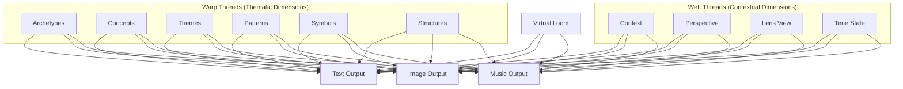
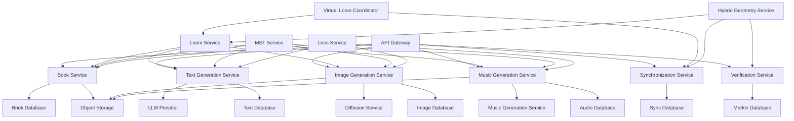
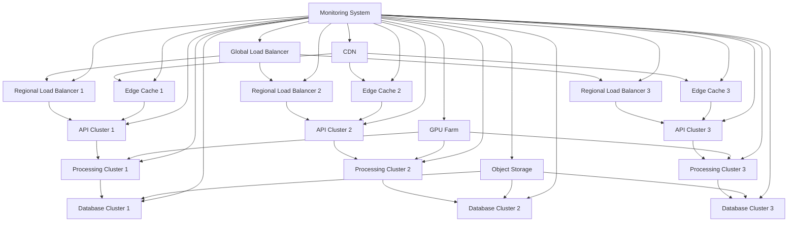

# 3.2.2. Unified Machine System Books Design

This document presents the definitive design for Machine System Books in Memorativa, integrating the core knowledge architecture from section 3.2.0 with the enhanced multi-modal capabilities outlined in section 3.2.1. This unified design establishes Machine Books as comprehensive knowledge artifacts that synthesize information across text, images, and music, all organized through the Virtual Loom framework and verified via Spherical Merkle Trees.

## Core Architecture

Machine Books implement a multi-dimensional knowledge architecture that spans multiple output modalities while maintaining a consistent structural framework:

### Multi-layered Structure Across All Modalities

Each modality implements the same fundamental four-layer architecture:

| Layer | Text Implementation | Image Implementation | Music Implementation |
|-------|---------------------|----------------------|----------------------|
| **Human Layer** | Narrative prose with embedded conceptual links | Charts and visualizations for direct interpretation | Thematic musical expressions and narrative motifs |
| **Machine Layer** | Structured data exports (JSON/XML) | Network graphs of percept-triplet relationships | Sonified data patterns and system states |
| **Bridge Layer** | Markup with conceptual demarcation | Interactive overlays linking visuals to data | Audio-synchronized navigation cues |
| **Integrity Layer** | Spherical Merkle proofs for verification | Visual verification elements | Harmonic structures for verification |

This consistent layering ensures that knowledge is represented coherently across modalities while maintaining both human accessibility and machine processability.

### Virtual Loom as Unifying Framework

The Virtual Loom serves as the foundational organizational structure across all modalities:


*Figure 1: Virtual Loom Framework Diagram, illustrating how Warp Threads (thematic dimensions) and Weft Threads (contextual dimensions) organize content across text, image, and music outputs, showing the unified structural approach to multi-modal knowledge representation*

This unified organization ensures that:
- Text narrative flows follow the same warp (thematic) thread patterns as visual layouts and musical progressions
- Contextual dimensions (weft threads) consistently shape perspective across all modalities
- Glass Beads appear at the same intersections in text, visuals, and music
- Patterns are recognizable across modalities through consistent organization

### Multi-Modal Output Integration

Machine Books generate three synchronized output streams that represent knowledge through complementary modalities:

1. **Text Output Stream**
   - Primary narrative and conceptual exposition
   - Structured data for machine processing 
   - Hypertext linking and semantic markup

2. **Image Output Stream**
   - Visual representation of concepts and relationships
   - Charts, diagrams, and symbolic visualizations
   - Generated imagery through diffusion models

3. **Music Output Stream**
   - Sonic representation of knowledge structures
   - Thematic development aligned with narrative
   - Data sonification and pattern expression

These streams are synchronized through intersection-based coordination, where the Virtual Loom provides common reference points across all modalities.

## Unified Technical Implementation

### Book Data Model

The unified Book data model integrates multi-modal capabilities:

```rust
struct MachineBook {
    // Core identity and metadata
    id: Uuid,
    title: String,
    description: String,
    owner_id: Uuid,
    created_at: DateTime<Utc>,
    updated_at: DateTime<Utc>,
    privacy_level: PrivacyLevel,
    current_version_id: Uuid,
    
    // Virtual Loom structure
    loom: VirtualLoom,
    
    // Multi-modal content
    text_outputs: Vec<TextOutput>,
    image_outputs: Vec<ImageOutput>,
    music_outputs: Vec<MusicOutput>,
    
    // Synchronization
    sync_points: Vec<SyncPoint>,
    
    // Verification
    merkle_root_hash: String,
    verification_status: VerificationStatus,
    
    // Time states
    mundane_time: Option<DateTime<Utc>>,
    quantum_time: Option<QuantumTimeState>,
    holographic_time: Option<HolographicTimeReference>,
    
    // Lens System
    active_lenses: Vec<Lens>,
    lens_relationships: HashMap<(LensType, LensType), Angle>,
    
    // MST integration
    mst_symbols: Vec<MSTSymbol>,
    cultural_context: Option<CulturalContext>,
    
    // Collaborators and attribution
    collaborators: Vec<Collaborator>,
    attribution_chain: AttributionChain,
}

struct VirtualLoom {
    warp_threads: Vec<WarpThread>,     // Thematic dimensions
    weft_threads: Vec<WeftThread>,     // Contextual dimensions
    intersections: HashMap<(WarpThreadId, WeftThreadId), Intersection>,
    patterns: Vec<Pattern>,
    thread_tensions: ThreadTensions,
}

struct TextOutput {
    id: Uuid,
    content_type: TextContentType,     // narrative, machine, bridge
    content: String,
    warp_id: Option<WarpThreadId>,
    weft_id: Option<WeftThreadId>,
    merkle_node_id: Uuid,
    sync_points: Vec<SyncPointId>,
    metadata: HashMap<String, Value>,
}

struct ImageOutput {
    id: Uuid,
    content_type: ImageContentType,    // interference, holographic, symbolic, etc.
    storage_path: String,
    dimensions: Dimensions,
    generation_params: ImageGenerationParams,
    warp_id: Option<WarpThreadId>,
    weft_id: Option<WeftThreadId>,
    merkle_node_id: Uuid,
    sync_points: Vec<SyncPointId>,
    interactive_regions: Vec<InteractiveRegion>,
    metadata: HashMap<String, Value>,
}

struct MusicOutput {
    id: Uuid,
    content_type: MusicContentType,    // interference, holographic, symbolic, lens
    storage_path: String,
    duration_ms: u32,
    generation_params: MusicGenerationParams,
    warp_id: Option<WarpThreadId>,
    weft_id: Option<WeftThreadId>,
    merkle_node_id: Uuid,
    sync_points: Vec<SyncPointId>,
    motifs: Vec<Motif>,
    metadata: HashMap<String, Value>,
}

struct SyncPoint {
    id: Uuid,
    name: Option<String>,
    timestamp_ms: u32,
    text_position: Option<TextPosition>,
    image_position: Option<ImagePosition>,
    music_position: Option<MusicPosition>,
    warp_id: Option<WarpThreadId>,
    weft_id: Option<WeftThreadId>,
    is_intersection: bool,
    is_navigation_marker: bool,
    metadata: HashMap<String, Value>,
}
```

### Multi-Modal Generator System

The unified generation system coordinates content creation across modalities:

```rust
struct MultiModalGenerator {
    text_generator: TextGenerator,
    image_generator: ImageGenerator,
    music_generator: MusicGenerator,
    sync_manager: SynchronizationManager,
    loom_coordinator: LoomCoordinator,
    
    fn generate_book(&self, params: BookGenerationParams) -> Result<MachineBook> {
        // Create book instance
        let mut book = self.create_book_structure(params)?;
        
        // Generate Virtual Loom structure
        book.loom = self.loom_coordinator.generate_loom_structure(
            params.focus,
            params.triplets,
            params.glass_beads
        )?;
        
        // Extract Common Core Semantic Features for cross-modal consistency
        let core_semantics = self.extract_core_semantics(params.triplets, book.loom.clone())?;
        
        // Generate content for each modality
        let (text_outputs, image_outputs, music_outputs) = join!(
            self.generate_text_outputs(&book, &core_semantics, &params.text_options),
            self.generate_image_outputs(&book, &core_semantics, &params.image_options),
            self.generate_music_outputs(&book, &core_semantics, &params.music_options)
        )?;
        
        // Store outputs in book
        book.text_outputs = text_outputs;
        book.image_outputs = image_outputs;
        book.music_outputs = music_outputs;
        
        // Create synchronization across modalities
        book.sync_points = self.sync_manager.create_sync_points(
            &book.text_outputs,
            &book.image_outputs,
            &book.music_outputs,
            &book.loom
        )?;
        
        // Generate Spherical Merkle Tree for verification
        let merkle_info = self.generate_spherical_merkle_tree(&book)?;
        book.merkle_root_hash = merkle_info.root_hash;
        
        // Apply lens transformations
        self.apply_lens_transformations(&mut book, &params.active_lenses)?;
        
        // Finalize book
        self.finalize_book(&mut book)?;
        
        Ok(book)
    }
    
    fn extract_core_semantics(&self, 
                           triplets: &[HybridTriplet], 
                           loom: VirtualLoom) -> Result<CoreSemantics> {
        // Extract archetypal components from triplets
        let archetypal_features = self.extract_archetypal_features(triplets)?;
        
        // Extract expression components from triplets
        let expression_features = self.extract_expression_features(triplets)?;
        
        // Extract mundane components from triplets
        let mundane_features = self.extract_mundane_features(triplets)?;
        
        // Extract loom-based structural features
        let structural_features = self.extract_structural_features(&loom)?;
        
        // Create unified semantic representation
        let unified_representation = self.unify_semantic_features(
            archetypal_features,
            expression_features,
            mundane_features,
            structural_features
        )?;
        
        Ok(CoreSemantics {
            unified_representation,
            archetypal_features,
            expression_features,
            mundane_features,
            structural_features,
            time_state_embeddings: self.create_time_state_embeddings(triplets)?,
            lens_embeddings: self.create_lens_embeddings(triplets)?
        })
    }
}
```

### Spherical Merkle Tree Integration

The Machine Books implement Spherical Merkle Trees to ensure verification across all modalities:

```rust
struct SphericalMerkleSystem {
    merkle_builder: SphericalMerkleBuilder,
    content_hasher: ContentHasher,
    spatial_verifier: SpatialVerifier,
    
    fn generate_book_merkle_tree(&self, book: &MachineBook) -> Result<MerkleInfo> {
        // Create nodes for all content
        let text_nodes = self.create_text_nodes(&book.text_outputs)?;
        let image_nodes = self.create_image_nodes(&book.image_outputs)?;
        let music_nodes = self.create_music_nodes(&book.music_outputs)?;
        
        // Create loom structure nodes
        let loom_nodes = self.create_loom_nodes(&book.loom)?;
        
        // Set up spatial coordinates based on hybrid geometry
        self.establish_spatial_coordinates(
            &mut text_nodes, 
            &mut image_nodes,
            &mut music_nodes,
            &mut loom_nodes,
            &book.loom
        )?;
        
        // Establish angular relationships
        let angular_relationships = self.establish_angular_relationships(
            &text_nodes,
            &image_nodes,
            &music_nodes,
            &loom_nodes
        )?;
        
        // Build the tree with all nodes
        let all_nodes = [
            text_nodes.as_slice(), 
            image_nodes.as_slice(), 
            music_nodes.as_slice(),
            loom_nodes.as_slice()
        ].concat();
        
        let tree = self.merkle_builder.build_tree(
            all_nodes, 
            angular_relationships
        )?;
        
        // Verify spatial integrity
        self.spatial_verifier.verify_spatial_integrity(
            &tree, 
            &book.loom
        )?;
        
        Ok(MerkleInfo {
            root_hash: tree.root_hash,
            node_count: tree.node_count,
            max_depth: tree.max_depth,
            verification_score: tree.verification_score,
        })
    }
    
    fn establish_spatial_coordinates(
        &self,
        text_nodes: &mut [SphericalMerkleNode],
        image_nodes: &mut [SphericalMerkleNode],
        music_nodes: &mut [SphericalMerkleNode],
        loom_nodes: &mut [SphericalMerkleNode],
        loom: &VirtualLoom
    ) -> Result<()> {
        // Set coordinates based on loom position
        for node in text_nodes.iter_mut()
            .chain(image_nodes.iter_mut())
            .chain(music_nodes.iter_mut()) {
            
            if let (Some(warp_id), Some(weft_id)) = (node.warp_id, node.weft_id) {
                if let Some(intersection) = loom.intersections.get(&(warp_id, weft_id)) {
                    // Convert loom position to spherical coordinates
                    let coords = self.loom_position_to_coordinates(intersection)?;
                    
                    // Set node coordinates
                    node.theta = coords.theta;     // Archetypal angle (What)
                    node.phi = coords.phi;         // Expression elevation (How)
                    node.radius = coords.radius;   // Mundane magnitude (Where)
                    node.kappa = coords.kappa;     // Curvature parameter
                }
            }
        }
        
        // Set loom structure coordinates
        for (i, node) in loom_nodes.iter_mut().enumerate() {
            // Set special coordinates for loom structure
            node.theta = self.calculate_loom_structure_theta(i, loom)?;
            node.phi = self.calculate_loom_structure_phi(i, loom)?;
            node.radius = self.calculate_loom_structure_radius(i, loom)?;
            node.kappa = self.calculate_loom_structure_kappa(i, loom)?;
        }
        
        Ok(())
    }
    
    fn establish_angular_relationships(
        &self,
        text_nodes: &[SphericalMerkleNode],
        image_nodes: &[SphericalMerkleNode],
        music_nodes: &[SphericalMerkleNode],
        loom_nodes: &[SphericalMerkleNode]
    ) -> Result<HashMap<(NodeId, NodeId), AngularRelationship>> {
        let mut relationships = HashMap::new();
        
        // Function to calculate and store angular relationship
        let mut add_relationship = |node1: &SphericalMerkleNode, node2: &SphericalMerkleNode| -> Result<()> {
            let angle = self.calculate_angular_relationship(node1, node2)?;
            
            if angle.significance > MIN_SIGNIFICANCE_THRESHOLD {
                relationships.insert(
                    (node1.id, node2.id),
                    angle
                );
            }
            
            Ok(())
        };
        
        // Establish text-to-text relationships
        for i in 0..text_nodes.len() {
            for j in (i+1)..text_nodes.len() {
                add_relationship(&text_nodes[i], &text_nodes[j])?;
            }
        }
        
        // Establish cross-modal relationships
        for text_node in text_nodes {
            // Text-to-image relationships
            for image_node in image_nodes {
                add_relationship(text_node, image_node)?;
            }
            
            // Text-to-music relationships
            for music_node in music_nodes {
                add_relationship(text_node, music_node)?;
            }
        }
        
        // Establish image-to-music relationships
        for image_node in image_nodes {
            for music_node in music_nodes {
                add_relationship(image_node, music_node)?;
            }
        }
        
        // Establish loom structure relationships
        for loom_node in loom_nodes {
            // Loom-to-text
            for text_node in text_nodes {
                add_relationship(loom_node, text_node)?;
            }
            
            // Loom-to-image
            for image_node in image_nodes {
                add_relationship(loom_node, image_node)?;
            }
            
            // Loom-to-music
            for music_node in music_nodes {
                add_relationship(loom_node, music_node)?;
            }
        }
        
        Ok(relationships)
    }
}
```

### Multi-Modal Synchronization System

The synchronization system ensures coherent navigation and interaction across modalities:

```rust
struct SynchronizationManager {
    intersection_matcher: IntersectionMatcher,
    temporal_aligner: TemporalAligner,
    
    fn create_sync_points(
        &self,
        text_outputs: &[TextOutput],
        image_outputs: &[ImageOutput],
        music_outputs: &[MusicOutput],
        loom: &VirtualLoom
    ) -> Result<Vec<SyncPoint>> {
        let mut sync_points = Vec::new();
        
        // Create sync points for loom intersections
        for ((warp_id, weft_id), intersection) in &loom.intersections {
            // Find content at this intersection
            let text_at_intersection = self.find_text_at_intersection(text_outputs, *warp_id, *weft_id)?;
            let images_at_intersection = self.find_images_at_intersection(image_outputs, *warp_id, *weft_id)?;
            let music_at_intersection = self.find_music_at_intersection(music_outputs, *warp_id, *weft_id)?;
            
            if !text_at_intersection.is_empty() || !images_at_intersection.is_empty() || !music_at_intersection.is_empty() {
                // Create positions for each modality
                let text_position = self.create_text_position(&text_at_intersection)?;
                let image_position = self.create_image_position(&images_at_intersection)?;
                let music_position = self.create_music_position(&music_at_intersection)?;
                
                // Add sync point
                sync_points.push(SyncPoint {
                    id: Uuid::new_v4(),
                    name: Some(format!("Intersection_{}_{}", warp_id, weft_id)),
                    timestamp_ms: self.calculate_timestamp(
                        &text_position, 
                        &image_position, 
                        &music_position
                    )?,
                    text_position: Some(text_position),
                    image_position: Some(image_position),
                    music_position: Some(music_position),
                    warp_id: Some(*warp_id),
                    weft_id: Some(*weft_id),
                    is_intersection: true,
                    is_navigation_marker: true,
                    metadata: HashMap::new(),
                });
            }
        }
        
        // Create additional sync points for narrative progression
        let narrative_points = self.create_narrative_sync_points(
            text_outputs, 
            image_outputs, 
            music_outputs
        )?;
        sync_points.extend(narrative_points);
        
        // Create additional sync points for key visual elements
        let visual_points = self.create_visual_sync_points(
            text_outputs, 
            image_outputs, 
            music_outputs
        )?;
        sync_points.extend(visual_points);
        
        // Create additional sync points for musical motifs
        let music_points = self.create_music_sync_points(
            text_outputs,
            image_outputs,
            music_outputs
        )?;
        sync_points.extend(music_points);
        
        // Sort by timestamp and remove duplicates
        sync_points.sort_by_key(|sp| sp.timestamp_ms);
        self.remove_duplicate_sync_points(&mut sync_points)?;
        
        Ok(sync_points)
    }
}
```

### Hybrid Spherical-Hyperbolic Geometry System

The unified system implements consistent hybrid geometry for all modal content:

```rust
struct HybridGeometryService {
    impl HybridGeometryService {
        // Calculate distance between points in hybrid curved space
        fn calculate_hybrid_distance(&self, p1: HybridPoint, p2: HybridPoint) -> Result<f64> {
            // Get the curvature parameter (κ)
            let kappa = (p1.kappa + p2.kappa) / 2.0;
            
            if kappa > EPSILON {
                // Spherical space (κ > 0)
                // Formula: d = r₁r₂·cos⁻¹(sin φ₁ sin φ₂ + cos φ₁ cos φ₂ cos(θ₁ - θ₂))
                let term1 = p1.phi.sin() * p2.phi.sin();
                let term2 = p1.phi.cos() * p2.phi.cos() * (p1.theta - p2.theta).cos();
                let angle = (term1 + term2).acos();
                p1.radius * p2.radius * angle
            } else if kappa.abs() < EPSILON {
                // Flat/Euclidean space (κ ≈ 0)
                // Formula: d = √(r₁² + r₂² - 2r₁r₂(cos θ₁ cos θ₂ + sin θ₁ sin θ₂) cos(φ₁ - φ₂))
                let term1 = p1.radius.powi(2) + p2.radius.powi(2);
                let term2 = 2.0 * p1.radius * p2.radius;
                let term3 = (p1.theta.cos() * p2.theta.cos() + p1.theta.sin() * p2.theta.sin());
                let term4 = (p1.phi - p2.phi).cos();
                (term1 - term2 * term3 * term4).sqrt()
            } else {
                // Hyperbolic space (κ < 0)
                // Formula: d = r₁r₂·cosh⁻¹(cosh r₁ cosh r₂ - sinh r₁ sinh r₂ cos(θ₁ - θ₂))
                let term1 = p1.radius.cosh() * p2.radius.cosh();
                let term2 = p1.radius.sinh() * p2.radius.sinh() * (p1.theta - p2.theta).cos();
                let angle = (term1 - term2).acosh();
                p1.radius * p2.radius * angle
            }
        }
        
        // Calculate angular relationship between vectors
        fn calculate_angular_relationship(&self, v1: HybridVector, v2: HybridVector) -> Result<Angle> {
            // Extract coordinates from vectors
            let p1 = HybridPoint {
                theta: v1.theta,
                phi: v1.phi,
                radius: v1.radius,
                kappa: v1.kappa,
            };
            
            let p2 = HybridPoint {
                theta: v2.theta,
                phi: v2.phi,
                radius: v2.radius,
                kappa: v2.kappa,
            };
            
            // Calculate the dot product in spherical-hyperbolic space
            let dot_product = match self.calculate_dot_product(p1, p2)? {
                dp if dp > 1.0 => 1.0,  // Numerical precision issues
                dp if dp < -1.0 => -1.0, // Numerical precision issues
                dp => dp,
            };
            
            // Calculate angle in radians
            let angle_rad = dot_product.acos();
            
            // Determine significance based on aspect orbs
            let significance = self.calculate_aspect_significance(angle_rad)?;
            
            Ok(Angle {
                value: angle_rad,
                degrees: angle_rad.to_degrees(),
                significance,
                aspect_type: self.determine_aspect_type(angle_rad)?,
            })
        }
        
        // Apply lens transformation to point
        fn apply_lens_transform(&self, point: HybridPoint, lens: &Lens) -> Result<HybridPoint> {
            // Create rotation matrix for archetypal-expression plane
            let rotation = self.create_rotation_matrix(lens.rotation)?;
            
            // Apply rotation to theta-phi coordinates (archetypal-expression plane)
            let (theta, phi) = self.rotate_coordinates(
                point.theta, 
                point.phi, 
                &rotation
            )?;
            
            // Apply scaling if needed
            let radius = point.radius * lens.scale.powf(0.5); // Square root for area preservation
            
            // Apply lens-specific curvature adjustment
            let kappa = self.adjust_curvature(point.kappa, lens.curvature_factor)?;
            
            Ok(HybridPoint {
                theta,
                phi,
                radius,
                kappa,
            })
        }
        
        // Calculate optimal position in hybrid space to preserve relationships
        fn calculate_optimal_position(
            &self,
            existing_points: &[HybridPoint],
            target_relationships: &[TargetRelationship]
        ) -> Result<HybridPoint> {
            // Initialize with a reasonable starting position
            let mut current_pos = self.calculate_initial_position(existing_points)?;
            
            // Define the cost function based on relationship preservation
            let cost_fn = |pos: &HybridPoint| -> Result<f64> {
                let mut total_cost = 0.0;
                
                for tr in target_relationships {
                    let existing_point = &existing_points[tr.point_index];
                    let actual_distance = self.calculate_hybrid_distance(*pos, *existing_point)?;
                    let distance_diff = (actual_distance - tr.target_distance).abs();
                    total_cost += distance_diff.powi(2) * tr.weight;
                }
                
                Ok(total_cost)
            };
            
            // Perform optimization (gradient descent)
            let mut step_size = 0.1;
            let min_step_size = 1e-6;
            let max_iterations = 100;
            
            for _ in 0..max_iterations {
                if step_size < min_step_size {
                    break;
                }
                
                // Calculate current cost
                let current_cost = cost_fn(&current_pos)?;
                
                // Try steps in various directions
                let mut best_pos = current_pos;
                let mut best_cost = current_cost;
                
                // Check theta direction
                for &delta_theta in &[step_size, -step_size] {
                    let test_pos = HybridPoint {
                        theta: current_pos.theta + delta_theta,
                        ..current_pos
                    };
                    
                    let test_cost = cost_fn(&test_pos)?;
                    if test_cost < best_cost {
                        best_cost = test_cost;
                        best_pos = test_pos;
                    }
                }
                
                // Check phi direction
                for &delta_phi in &[step_size, -step_size] {
                    let test_pos = HybridPoint {
                        phi: current_pos.phi + delta_phi,
                        ..current_pos
                    };
                    
                    let test_cost = cost_fn(&test_pos)?;
                    if test_cost < best_cost {
                        best_cost = test_cost;
                        best_pos = test_pos;
                    }
                }
                
                // Check radius direction
                for &delta_radius in &[step_size, -step_size] {
                    let test_pos = HybridPoint {
                        radius: current_pos.radius + delta_radius,
                        ..current_pos
                    };
                    
                    let test_cost = cost_fn(&test_pos)?;
                    if test_cost < best_cost {
                        best_cost = test_cost;
                        best_pos = test_pos;
                    }
                }
                
                // Check kappa direction
                for &delta_kappa in &[step_size * 0.1, -step_size * 0.1] { // Smaller steps for curvature
                    let test_pos = HybridPoint {
                        kappa: current_pos.kappa + delta_kappa,
                        ..current_pos
                    };
                    
                    let test_cost = cost_fn(&test_pos)?;
                    if test_cost < best_cost {
                        best_cost = test_cost;
                        best_pos = test_pos;
                    }
                }
                
                // If we found a better position, update
                if best_cost < current_cost {
                    current_pos = best_pos;
                } else {
                    // No improvement, reduce step size
                    step_size *= 0.5;
                }
            }
            
            Ok(current_pos)
        }
    }
}
```

## Multi-Modal Generation Pipeline

### Text Generation System

The text generation system creates content that follows the Virtual Loom structure:

```rust
struct TextGenerator {
    narrative_generator: NarrativeGenerator,
    machine_generator: MachineDataGenerator,
    bridge_generator: BridgeLayerGenerator,
    
    fn generate_text_outputs(
        &self,
        book: &MachineBook,
        core_semantics: &CoreSemantics,
        options: &TextGenerationOptions
    ) -> Result<Vec<TextOutput>> {
        let mut outputs = Vec::new();
        
        // Generate text for each warp thread (thematic dimension)
        for warp_thread in &book.loom.warp_threads {
            // Generate narrative text for this warp thread
            if options.include_narrative_layer {
                let narrative = self.narrative_generator.generate_for_warp(
                    warp_thread,
                    &book.loom,
                    core_semantics,
                    &options.narrative_options
                )?;
                
                outputs.push(TextOutput {
                    id: Uuid::new_v4(),
                    content_type: TextContentType::Narrative,
                    content: narrative,
                    warp_id: Some(warp_thread.id),
                    weft_id: None, // Spans multiple weft threads
                    merkle_node_id: Uuid::new_v4(), // Will be set later
                    sync_points: Vec::new(), // Will be set later
                    metadata: HashMap::new(),
                });
            }
            
            // Generate machine-readable data for this warp thread
            if options.include_machine_layer {
                let machine_data = self.machine_generator.generate_for_warp(
                    warp_thread,
                    &book.loom,
                    core_semantics,
                    &options.machine_options
                )?;
                
                outputs.push(TextOutput {
                    id: Uuid::new_v4(),
                    content_type: TextContentType::Machine,
                    content: machine_data,
                    warp_id: Some(warp_thread.id),
                    weft_id: None, // Spans multiple weft threads
                    merkle_node_id: Uuid::new_v4(), // Will be set later
                    sync_points: Vec::new(), // Will be set later
                    metadata: HashMap::new(),
                });
            }
        }
        
        // Generate text for significant intersections
        for ((warp_id, weft_id), intersection) in &book.loom.intersections {
            if intersection.significance >= options.min_intersection_significance {
                // Generate narrative text for this intersection
                if options.include_narrative_layer {
                    let narrative = self.narrative_generator.generate_for_intersection(
                        *warp_id,
                        *weft_id,
                        &book.loom,
                        core_semantics,
                        &options.narrative_options
                    )?;
                    
                    outputs.push(TextOutput {
                        id: Uuid::new_v4(),
                        content_type: TextContentType::Narrative,
                        content: narrative,
                        warp_id: Some(*warp_id),
                        weft_id: Some(*weft_id),
                        merkle_node_id: Uuid::new_v4(), // Will be set later
                        sync_points: Vec::new(), // Will be set later
                        metadata: HashMap::new(),
                    });
                }
            }
        }
        
        // Generate bridge layer content that links narrative and machine layers
        if options.include_bridge_layer {
            let bridge_content = self.bridge_generator.generate_bridge_layer(
                &outputs,
                &book.loom,
                core_semantics,
                &options.bridge_options
            )?;
            
            outputs.push(TextOutput {
                id: Uuid::new_v4(),
                content_type: TextContentType::Bridge,
                content: bridge_content,
                warp_id: None, // Spans multiple warp and weft threads
                weft_id: None,
                merkle_node_id: Uuid::new_v4(), // Will be set later
                sync_points: Vec::new(), // Will be set later
                metadata: HashMap::new(),
            });
        }
        
        Ok(outputs)
    }
}
```

### Image Generation System

The image generation system creates visual content across three approaches:

```rust
struct ImageGenerator {
    interference_generator: InterferencePatternGenerator,
    holographic_generator: HolographicImageGenerator,
    symbolic_generator: SymbolicImageGenerator,
    loom_visualizer: LoomVisualizer,
    diffusion_controller: DiffusionModelController,
    
    fn generate_image_outputs(
        &self,
        book: &MachineBook,
        core_semantics: &CoreSemantics,
        options: &ImageGenerationOptions
    ) -> Result<Vec<ImageOutput>> {
        let mut outputs = Vec::new();
        
        // Generate Virtual Loom visualization
        if options.include_loom_visualization {
            let loom_visual = self.loom_visualizer.visualize_loom(
                &book.loom,
                &options.loom_visualization_options
            )?;
            
            outputs.push(ImageOutput {
                id: Uuid::new_v4(),
                content_type: ImageContentType::LoomVisualization,
                storage_path: self.store_image(loom_visual)?,
                dimensions: loom_visual.dimensions,
                generation_params: options.loom_visualization_options.clone().into(),
                warp_id: None, // Represents entire loom
                weft_id: None,
                merkle_node_id: Uuid::new_v4(), // Will be set later
                sync_points: Vec::new(), // Will be set later
                interactive_regions: self.create_interactive_regions(&book.loom)?,
                metadata: HashMap::new(),
            });
        }
        
        // Generate interference patterns for triplet groups
        if options.include_interference_patterns {
            // Group triplets by related concepts
            let triplet_groups = self.group_triplets_by_concept(
                &book.triplets,
                options.interference_pattern_options.group_size
            )?;
            
            for (group_idx, triplet_group) in triplet_groups.iter().enumerate() {
                let pattern = self.interference_generator.generate_pattern(
                    triplet_group,
                    &options.interference_pattern_options
                )?;
                
                outputs.push(ImageOutput {
                    id: Uuid::new_v4(),
                    content_type: ImageContentType::Interference,
                    storage_path: self.store_image(pattern)?,
                    dimensions: pattern.dimensions,
                    generation_params: options.interference_pattern_options.clone().into(),
                    warp_id: None,
                    weft_id: None,
                    merkle_node_id: Uuid::new_v4(), // Will be set later
                    sync_points: Vec::new(), // Will be set later
                    interactive_regions: Vec::new(),
                    metadata: self.create_interference_metadata(triplet_group, group_idx),
                });
            }
        }
        
        // Generate holographic reconstructions
        if options.include_holographic_reconstructions {
            // Load natal glass bead for reference beam
            let natal_bead = self.load_natal_bead(&book.owner_id)?;
            
            // Get significant beads for object beams
            let significant_beads = self.get_significant_beads(
                &book.glass_beads,
                options.holographic_options.max_beads
            )?;
            
            for (idx, object_bead) in significant_beads.iter().enumerate() {
                let hologram = self.holographic_generator.generate_hologram(
                    &natal_bead,
                    object_bead,
                    &options.holographic_options
                )?;
                
                outputs.push(ImageOutput {
                    id: Uuid::new_v4(),
                    content_type: ImageContentType::Holographic,
                    storage_path: self.store_image(hologram)?,
                    dimensions: hologram.dimensions,
                    generation_params: options.holographic_options.clone().into(),
                    warp_id: None,
                    weft_id: None,
                    merkle_node_id: Uuid::new_v4(), // Will be set later
                    sync_points: Vec::new(), // Will be set later
                    interactive_regions: self.create_hologram_interactive_regions(hologram)?,
                    metadata: self.create_hologram_metadata(natal_bead, object_bead, idx),
                });
            }
        }
        
        // Generate symbolic synthesis images for significant intersections
        if options.include_symbolic_images {
            // Find significant intersections
            let significant_intersections = self.find_significant_intersections(
                &book.loom,
                options.symbolic_options.min_significance,
                options.symbolic_options.max_intersections
            )?;
            
            for (warp_id, weft_id) in significant_intersections {
                // Get triplets associated with this intersection
                let triplets = self.get_triplets_for_intersection(
                    &book.triplets,
                    &book.loom,
                    warp_id,
                    weft_id
                )?;
                
                // Generate prompt for diffusion model
                let prompt = self.generate_prompt_for_intersection(
                    &book.loom,
                    warp_id,
                    weft_id,
                    core_semantics
                )?;
                
                // Apply hybrid geometric conditioning
                let conditioning = self.create_hybrid_conditioning(
                    &triplets,
                    &book.loom,
                    warp_id,
                    weft_id
                )?;
                
                // Select appropriate diffusion model
                let model = self.select_diffusion_model(
                    &options.symbolic_options,
                    &triplets,
                    &conditioning
                )?;
                
                // Generate image
                let image = self.diffusion_controller.generate_image(
                    model,
                    &prompt,
                    &conditioning,
                    &options.symbolic_options
                )?;
                
                outputs.push(ImageOutput {
                    id: Uuid::new_v4(),
                    content_type: ImageContentType::Symbolic,
                    storage_path: self.store_image(image)?,
                    dimensions: image.dimensions,
                    generation_params: options.symbolic_options.clone().into(),
                    warp_id: Some(warp_id),
                    weft_id: Some(weft_id),
                    merkle_node_id: Uuid::new_v4(), // Will be set later
                    sync_points: Vec::new(), // Will be set later
                    interactive_regions: self.create_symbolic_interactive_regions(image, warp_id, weft_id)?,
                    metadata: self.create_symbolic_metadata(prompt, &conditioning, model),
                });
            }
        }
        
        // Generate interactive multi-state visuals
        if options.include_interactive_visuals {
            // Generate interactive visuals based on state transitions
            for state_group in &options.interactive_options.state_groups {
                let interactive_visual = self.generate_interactive_visual(
                    book,
                    core_semantics,
                    state_group,
                    &options.interactive_options
                )?;
                
                outputs.push(ImageOutput {
                    id: Uuid::new_v4(),
                    content_type: ImageContentType::Interactive,
                    storage_path: self.store_interactive_image(interactive_visual)?,
                    dimensions: interactive_visual.base_image.dimensions,
                    generation_params: options.interactive_options.clone().into(),
                    warp_id: state_group.warp_id,
                    weft_id: state_group.weft_id,
                    merkle_node_id: Uuid::new_v4(), // Will be set later
                    sync_points: Vec::new(), // Will be set later
                    interactive_regions: interactive_visual.interactive_regions,
                    metadata: self.create_interactive_metadata(state_group, interactive_visual),
                });
            }
        }
        
        Ok(outputs)
    }
    
    fn create_hybrid_conditioning(
        &self,
        triplets: &[HybridTriplet],
        loom: &VirtualLoom,
        warp_id: WarpThreadId,
        weft_id: WeftThreadId
    ) -> Result<HybridConditioning> {
        // Extract coordinates from triplets
        let coordinates = triplets.iter()
            .map(|t| [t.theta, t.phi, t.radius, t.kappa])
            .collect::<Vec<_>>();
            
        // Extract angular relationships
        let angular_relationships = self.extract_angular_relationships(triplets)?;
        
        // Get loom contextual information
        let warp_thread = loom.warp_threads.iter()
            .find(|w| w.id == warp_id)
            .ok_or_else(|| Error::ThreadNotFound(warp_id))?;
            
        let weft_thread = loom.weft_threads.iter()
            .find(|w| w.id == weft_id)
            .ok_or_else(|| Error::ThreadNotFound(weft_id))?;
            
        // Calculate symbolic mappings based on threads
        let symbol_mappings = self.calculate_symbol_mappings(triplets, warp_thread, weft_thread)?;
        
        // Calculate curvature at this intersection
        let curvature = self.calculate_intersection_curvature(loom, warp_id, weft_id)?;
        
        // Create conditioning vectors
        let conditioning_vectors = self.generate_conditioning_vectors(
            coordinates,
            angular_relationships.clone(),
            symbol_mappings.clone(),
            curvature
        )?;
        
        Ok(HybridConditioning {
            coordinates,
            angular_relationships,
            symbol_mappings,
            curvature,
            conditioning_vectors,
        })
    }
}
```

### Music Generation System

The music generation system creates sonic representations of knowledge structures:

```rust
struct MusicGenerator {
    interference_audio_generator: InterferenceAudioGenerator,
    holographic_audio_generator: HolographicAudioGenerator,
    symbolic_music_generator: SymbolicMusicGenerator,
    lens_music_generator: LensMusicGenerator,
    audio_encoder: AudioEncoder,
    
    fn generate_music_outputs(
        &self,
        book: &MachineBook,
        core_semantics: &CoreSemantics,
        options: &MusicGenerationOptions
    ) -> Result<Vec<MusicOutput>> {
        let mut outputs = Vec::new();
        
        // Generate interference pattern audio
        if options.include_interference_audio {
            // Group triplets by related concepts
            let triplet_groups = self.group_triplets_by_concept(
                &book.triplets,
                options.interference_options.group_size
            )?;
            
            for (group_idx, triplet_group) in triplet_groups.iter().enumerate() {
                let audio = self.interference_audio_generator.generate_audio(
                    triplet_group,
                    &options.interference_options
                )?;
                
                // Encode audio to file
                let encoded = self.audio_encoder.encode(
                    audio, 
                    options.output_format,
                    options.interference_options.quality
                )?;
                
                outputs.push(MusicOutput {
                    id: Uuid::new_v4(),
                    content_type: MusicContentType::Interference,
                    storage_path: self.store_audio(encoded)?,
                    duration_ms: audio.duration_ms,
                    generation_params: options.interference_options.clone().into(),
                    warp_id: None,
                    weft_id: None,
                    merkle_node_id: Uuid::new_v4(), // Will be set later
                    sync_points: Vec::new(), // Will be set later
                    motifs: self.extract_audio_motifs(audio, triplet_group)?,
                    metadata: self.create_interference_audio_metadata(triplet_group, group_idx),
                });
            }
        }
        
        // Generate holographic audio reconstructions
        if options.include_holographic_audio {
            // Load natal glass bead for reference beam
            let natal_bead = self.load_natal_bead(&book.owner_id)?;
            
            // Get significant beads for object beams
            let significant_beads = self.get_significant_beads(
                &book.glass_beads,
                options.holographic_options.max_beads
            )?;
            
            for (idx, object_bead) in significant_beads.iter().enumerate() {
                let audio = self.holographic_audio_generator.generate_audio(
                    &natal_bead,
                    object_bead,
                    &options.holographic_options
                )?;
                
                // Encode audio to file
                let encoded = self.audio_encoder.encode(
                    audio, 
                    options.output_format,
                    options.holographic_options.quality
                )?;
                
                outputs.push(MusicOutput {
                    id: Uuid::new_v4(),
                    content_type: MusicContentType::Holographic,
                    storage_path: self.store_audio(encoded)?,
                    duration_ms: audio.duration_ms,
                    generation_params: options.holographic_options.clone().into(),
                    warp_id: None,
                    weft_id: None,
                    merkle_node_id: Uuid::new_v4(), // Will be set later
                    sync_points: Vec::new(), // Will be set later
                    motifs: self.extract_audio_motifs(audio, &[object_bead.to_triplet()])?,
                    metadata: self.create_holographic_audio_metadata(natal_bead, object_bead, idx),
                });
            }
        }
        
        // Generate symbolic music for the book
        if options.include_symbolic_music {
            // Extract MST symbols from the book
            let mst_symbols = self.extract_mst_symbols(
                &book.triplets,
                &book.loom,
                core_semantics
            )?;
            
            let audio = self.symbolic_music_generator.generate_music(
                &mst_symbols,
                &options.symbolic_options
            )?;
            
            // Encode audio to file
            let encoded = self.audio_encoder.encode(
                audio, 
                options.output_format,
                options.symbolic_options.quality
            )?;
            
            outputs.push(MusicOutput {
                id: Uuid::new_v4(),
                content_type: MusicContentType::Symbolic,
                storage_path: self.store_audio(encoded)?,
                duration_ms: audio.duration_ms,
                generation_params: options.symbolic_options.clone().into(),
                warp_id: None, // Spans entire book
                weft_id: None, // Spans entire book
                merkle_node_id: Uuid::new_v4(), // Will be set later
                sync_points: Vec::new(), // Will be set later
                motifs: self.extract_symbolic_music_motifs(audio, &mst_symbols)?,
                metadata: self.create_symbolic_music_metadata(&mst_symbols),
            });
        }
        
        // Generate lens-specific music variations if lenses are active
        if options.include_lens_music && !book.active_lenses.is_empty() {
            // If we haven't generated symbolic music yet, do so
            let base_music = if !options.include_symbolic_music {
                // Extract MST symbols from the book
                let mst_symbols = self.extract_mst_symbols(
                    &book.triplets,
                    &book.loom,
                    core_semantics
                )?;
                
                self.symbolic_music_generator.generate_music(
                    &mst_symbols,
                    &options.symbolic_options
                )?
            } else {
                // Use the already-generated symbolic music
                let symbolic_output = outputs.iter()
                    .find(|o| o.content_type == MusicContentType::Symbolic)
                    .ok_or_else(|| Error::MissingOutput("Symbolic music not found".into()))?;
                
                self.load_audio(&symbolic_output.storage_path)?
            };
            
            // Generate lens variations
            for lens in &book.active_lenses {
                let lens_audio = self.lens_music_generator.generate_lens_variation(
                    &base_music,
                    lens,
                    &options.lens_options
                )?;
                
                // Encode audio to file
                let encoded = self.audio_encoder.encode(
                    lens_audio, 
                    options.output_format,
                    options.lens_options.quality
                )?;
                
                outputs.push(MusicOutput {
                    id: Uuid::new_v4(),
                    content_type: MusicContentType::Lens,
                    storage_path: self.store_audio(encoded)?,
                    duration_ms: lens_audio.duration_ms,
                    generation_params: options.lens_options.clone().into(),
                    warp_id: None,
                    weft_id: None,
                    merkle_node_id: Uuid::new_v4(), // Will be set later
                    sync_points: Vec::new(), // Will be set later
                    motifs: self.extract_lens_music_motifs(lens_audio, lens)?,
                    metadata: self.create_lens_music_metadata(lens),
                });
            }
        }
        
        // Generate music for significant intersections
        if options.include_intersection_music {
            // Find significant intersections
            let significant_intersections = self.find_significant_intersections(
                &book.loom,
                options.intersection_options.min_significance,
                options.intersection_options.max_intersections
            )?;
            
            for (warp_id, weft_id) in significant_intersections {
                // Get triplets associated with this intersection
                let triplets = self.get_triplets_for_intersection(
                    &book.triplets,
                    &book.loom,
                    warp_id,
                    weft_id
                )?;
                
                // Generate musical motif for this intersection
                let audio = self.symbolic_music_generator.generate_intersection_motif(
                    &triplets,
                    warp_id,
                    weft_id,
                    &book.loom,
                    &options.intersection_options
                )?;
                
                // Encode audio to file
                let encoded = self.audio_encoder.encode(
                    audio, 
                    options.output_format,
                    options.intersection_options.quality
                )?;
                
                outputs.push(MusicOutput {
                    id: Uuid::new_v4(),
                    content_type: MusicContentType::Intersection,
                    storage_path: self.store_audio(encoded)?,
                    duration_ms: audio.duration_ms,
                    generation_params: options.intersection_options.clone().into(),
                    warp_id: Some(warp_id),
                    weft_id: Some(weft_id),
                    merkle_node_id: Uuid::new_v4(), // Will be set later
                    sync_points: Vec::new(), // Will be set later
                    motifs: self.extract_intersection_motifs(audio, warp_id, weft_id)?,
                    metadata: self.create_intersection_music_metadata(warp_id, weft_id),
                });
            }
        }
        
        Ok(outputs)
    }
}
```

## System Architecture

### Client Architecture

The Machine Books implement a specialized client architecture for displaying multi-modal content:

```typescript
class MachineBookClient {
    private textRenderer: TextRenderer;
    private imageRenderer: ImageRenderer;
    private musicPlayer: MusicPlayer;
    private synchronizer: ModalitySynchronizer;
    private interactionHandler: InteractionHandler;
    private merkleVerifier: SphericalMerkleVerifier;
    
    constructor(options: ClientOptions) {
        this.textRenderer = new TextRenderer(options.textRendererOptions);
        this.imageRenderer = new ImageRenderer(options.imageRendererOptions);
        this.musicPlayer = new MusicPlayer(options.musicPlayerOptions);
        this.synchronizer = new ModalitySynchronizer(options.synchronizationOptions);
        this.interactionHandler = new InteractionHandler(options.interactionOptions);
        this.merkleVerifier = new SphericalMerkleVerifier(options.verificationOptions);
    }
    
    async loadBook(bookId: string, renderOptions: RenderOptions): Promise<BookView> {
        // Fetch book data
        const bookData = await this.fetchBookData(bookId);
        
        // Verify book integrity
        if (renderOptions.verifyIntegrity) {
            const verificationResult = await this.merkleVerifier.verifyBook(bookData);
            if (!verificationResult.valid) {
                throw new Error(`Book verification failed: ${verificationResult.error}`);
            }
        }
        
        // Preload essential assets
        await this.preloadAssets(bookData, renderOptions);
        
        // Initialize synchronization
        this.synchronizer.initialize(bookData.sync_points);
        
        // Render initial content
        const textView = await this.renderText(bookData, renderOptions);
        const imageView = await this.renderImages(bookData, renderOptions);
        const musicView = await this.renderMusic(bookData, renderOptions);
        
        // Connect interaction handlers
        this.interactionHandler.connectHandlers(
            textView,
            imageView, 
            musicView,
            this.synchronizer
        );
        
        // Initialize Virtual Loom navigation
        const loomView = this.initializeLoomNavigation(bookData.loom, renderOptions);
        
        return {
            bookId,
            textView,
            imageView,
            musicView,
            loomView,
            synchronizer: this.synchronizer,
            interactionHandler: this.interactionHandler
        };
    }
    
    async navigateToIntersection(warpId: string, weftId: string): Promise<void> {
        // Find sync point for this intersection
        const syncPoint = this.synchronizer.findIntersectionPoint(warpId, weftId);
        if (!syncPoint) {
            throw new Error(`No sync point found for intersection (${warpId}, ${weftId})`);
        }
        
        // Navigate to sync point
        await this.synchronizer.navigateToPoint(syncPoint.id);
        
        // Update all views
        await this.textRenderer.scrollToPosition(syncPoint.text_position);
        await this.imageRenderer.focusOnPosition(syncPoint.image_position);
        await this.musicPlayer.seekToPosition(syncPoint.music_position);
    }
    
    async followWarpThread(warpId: string): Promise<void> {
        // Get all content along this warp thread
        const textContent = this.textRenderer.getContentByWarpThread(warpId);
        const imageContent = this.imageRenderer.getContentByWarpThread(warpId);
        const musicContent = this.musicPlayer.getContentByWarpThread(warpId);
        
        // Update view to focus on this thread
        await this.textRenderer.highlightWarpThread(warpId);
        await this.imageRenderer.highlightWarpThread(warpId);
        await this.musicPlayer.emphasizeWarpThread(warpId);
        
        // Update navigation to show position in thread
        this.updateThreadNavigation(warpId, 'warp');
    }
    
    async followWeftThread(weftId: string): Promise<void> {
        // Get all content along this weft thread
        const textContent = this.textRenderer.getContentByWeftThread(weftId);
        const imageContent = this.imageRenderer.getContentByWeftThread(weftId);
        const musicContent = this.musicPlayer.getContentByWeftThread(weftId);
        
        // Update view to focus on this thread
        await this.textRenderer.highlightWeftThread(weftId);
        await this.imageRenderer.highlightWeftThread(weftId);
        await this.musicPlayer.emphasizeWeftThread(weftId);
        
        // Update navigation to show position in thread
        this.updateThreadNavigation(weftId, 'weft');
    }
    
    async applyLens(lens: Lens): Promise<void> {
        // Apply lens transformation to all content
        await this.textRenderer.applyLens(lens);
        await this.imageRenderer.applyLens(lens);
        await this.musicPlayer.applyLens(lens);
        
        // Update synchronization with lens-transformed sync points
        this.synchronizer.transformSyncPoints(lens);
    }
    
    async toggleModality(modality: Modality, enabled: boolean): Promise<void> {
        switch (modality) {
            case 'text':
                this.textRenderer.setVisibility(enabled);
                break;
            case 'image':
                this.imageRenderer.setVisibility(enabled);
                break;
            case 'music':
                if (enabled) {
                    await this.musicPlayer.resume();
                } else {
                    await this.musicPlayer.pause();
                }
                break;
        }
        
        // Update synchronization to account for disabled modalities
        this.synchronizer.updateActiveModalities({
            text: this.textRenderer.isVisible(),
            image: this.imageRenderer.isVisible(),
            music: this.musicPlayer.isPlaying(),
        });
    }
}
```

### Microservices Architecture

The backend implementation uses a specialized microservices architecture:


*Figure 2: Microservices Architecture Diagram, showing the specialized backend services and their interactions, illustrating how the API Gateway connects to core services while supporting services like Virtual Loom Coordinator and Hybrid Geometry Service provide cross-cutting functionality*

## Performance and Scaling

### Performance Optimizations

The Machine Books implement specialized optimizations to ensure high performance:

```rust
struct PerformanceOptimizer {
    // Content-specific optimizations
    content_analyzer: ContentAnalyzer,
    lazy_loading_manager: LazyLoadingManager,
    resource_allocator: ResourceAllocator,
    
    // Multi-modal synchronization optimizations
    sync_point_optimizer: SyncPointOptimizer,
    real_time_coordinator: RealTimeCoordinator,
    
    // Verification optimizations
    merkle_optimizer: MerkleOptimizer,
    spatial_relationship_cache: SpatialRelationshipCache,
    
    fn optimize_book_generation(&self, params: &BookGenerationParams) -> OptimizedParams {
        // Analyze content complexity
        let complexity = self.content_analyzer.analyze_complexity(
            &params.triplets,
            &params.glass_beads
        )?;
        
        // Allocate resources based on complexity
        let resources = self.resource_allocator.allocate_resources(complexity)?;
        
        // Optimize parameters based on available resources
        let optimized_params = BookGenerationParams {
            // Adjust text generation parameters
            text_options: self.optimize_text_params(
                &params.text_options,
                resources.text_resources,
                complexity.text_complexity
            )?,
            
            // Adjust image generation parameters
            image_options: self.optimize_image_params(
                &params.image_options,
                resources.image_resources,
                complexity.image_complexity
            )?,
            
            // Adjust music generation parameters
            music_options: self.optimize_music_params(
                &params.music_options,
                resources.music_resources,
                complexity.music_complexity
            )?,
            
            // Adjust synchronization parameters
            sync_options: self.optimize_sync_params(
                &params.sync_options,
                resources.sync_resources,
                complexity.sync_complexity
            )?,
            
            // Keep other parameters unchanged
            ..params.clone()
        };
        
        OptimizedParams {
            params: optimized_params,
            resources,
            complexity,
            estimated_generation_time: self.estimate_generation_time(
                &optimized_params,
                resources,
                complexity
            )?,
        }
    }
    
    fn optimize_book_rendering(&self, book: &MachineBook, client_capabilities: &ClientCapabilities) -> RenderingStrategy {
        // Analyze book size and complexity
        let size_analysis = self.analyze_book_size(book)?;
        
        // Create lazy loading strategy
        let lazy_loading = self.lazy_loading_manager.create_strategy(
            size_analysis,
            client_capabilities
        )?;
        
        // Optimize sync points for client
        let optimized_sync_points = self.sync_point_optimizer.optimize_for_client(
            &book.sync_points,
            client_capabilities.sync_capabilities
        )?;
        
        // Create merkle verification strategy
        let verification_strategy = self.merkle_optimizer.create_client_strategy(
            book.merkle_root_hash.clone(),
            client_capabilities.verification_capabilities
        )?;
        
        RenderingStrategy {
            lazy_loading,
            optimized_sync_points,
            verification_strategy,
            adaptive_quality: self.create_adaptive_quality_strategy(
                book,
                client_capabilities
            )?,
            progressive_enhancement: self.create_progressive_enhancement(
                book,
                client_capabilities
            )?,
        }
    }
}
```

### Scaling Architecture

The system implements a sophisticated scaling strategy for high-volume processing:


*Figure 3: Scaling Architecture Diagram, illustrating the distributed system design with global load balancing, regional processing clusters, and centralized monitoring, showing how the architecture enables high-volume processing while maintaining system resilience across geographic regions*

## Token Economics

Machine Books implement the token economics framework from section 2.18:

### Gas Bead Token (GBT) Costs

| Operation | GBT Cost | Description |
|-----------|----------|-------------|
| Basic Book Creation | 30.0 GBT + 3.0 per chapter | Core book structure with basic content |
| Text Generation | 5-15 GBT | Narrative content generation |
| Image Generation (Direct) | 10-20 GBT | Charts and visualizations |
| Image Generation (Diffusion) | 20-40 GBT | AI-generated imagery |
| Music Generation | 15-30 GBT | Musical composition and sonification |
| Synchronization | 5-10 GBT | Cross-modal synchronization |
| Spherical Merkle Verification | 3-8 GBT | Content and spatial verification |
| Lens Application | 7-15 GBT | Per lens transformation |
| Interactive Element Creation | 3-5 GBT | Per interactive region |
| Cross-modal Analysis | 10-20 GBT | Semantic alignment across modalities |

### Token Rewards

| Contribution | GBT Reward | Description |
|--------------|------------|-------------|
| High-quality Book Creation | 30-75 GBT | Complete multi-modal book |
| Verification Contribution | 1-5 GBT | Successful verification of book |
| Content Validation | 3-10 GBT | Quality assessment and feedback |
| Pattern Recognition | 5-15 GBT | Identifying knowledge patterns |
| Collaborative Enhancement | 10-30 GBT | For multi-author contributions |
| Book Usage and Citations | 0.1-1.0 GBT | Per significant use or citation |

### Time State Rewards

- **Mundane**: 1.0x base reward (concrete timestamps)
- **Quantum**: 1.2x base reward (conceptual time)
- **Holographic**: 1.5x base reward (reference frameworks)

## Conclusion

The Unified Machine System Books Design establishes a comprehensive framework for multi-modal knowledge representation that integrates the core architectural principles from section 3.2.0 with the enhanced multi-modal capabilities from section 3.2.1. This unified design creates a cohesive system where knowledge can be simultaneously expressed through text, images, and music, all organized through the Virtual Loom framework and verified via Spherical Merkle Trees.

The integration of hybrid spherical-hyperbolic geometry ensures that the spatial relationships between concepts are preserved across all modalities, creating a consistent mathematical foundation for knowledge representation. The synchronization system enables coherent navigation across modalities, allowing users to explore complex knowledge structures through multiple sensory pathways.

By implementing this unified design, Machine Books become powerful knowledge artifacts that can represent complex ideas with unprecedented richness and coherence, establishing a new paradigm for knowledge synthesis and exploration in the Memorativa system.

## Key Points

- The Unified Machine System Books Design creates a comprehensive multi-modal knowledge representation framework that integrates text, images, and music into cohesive knowledge artifacts
- Machine Books utilize a hybrid spherical-hyperbolic geometry to preserve spatial relationships between concepts across all modalities
- The Virtual Loom framework serves as the organizational backbone, with Spherical Merkle Trees providing robust verification mechanisms
- The synchronization system enables coherent navigation across modalities, allowing exploration through multiple sensory pathways
- Reward systems incentivize high-quality contributions, with adjustments based on time state complexity (Mundane, Quantum, Holographic)
- This design addresses the curse of dimensionality by providing rich, structured knowledge representation that operates across multiple modes of understanding
- The integration of modalities creates emergent properties in knowledge representation that exceed the capabilities of single-modal approaches

## Key Math

- **Hybrid Spherical-Hyperbolic Geometry**: The knowledge space $\mathcal{K}$ is modeled as a hybrid manifold $\mathcal{M} = (\mathbb{S}^2, \mathbb{H}^2)$ where $\mathbb{S}^2$ is a 2-sphere and $\mathbb{H}^2$ is a hyperbolic plane. Concepts are embedded as points $p \in \mathcal{M}$ with distance function:
  $d(p_1, p_2) = \alpha d_{\mathbb{S}^2}(p_{1_s}, p_{2_s}) + (1-\alpha) d_{\mathbb{H}^2}(p_{1_h}, p_{2_h})$
  where $\alpha \in [0,1]$ is the modality weighting parameter

- **Spherical Merkle Tree**: A verification structure $\mathcal{T} = (V, E, \phi)$ where $V$ is the set of nodes, $E$ is the set of edges, and $\phi: V \rightarrow \mathbb{S}^2$ maps each node to a position on the sphere. The hash function incorporates both content and position:
  $h(v) = \text{Hash}(\text{content}(v) \parallel \phi(v))$
  where $\parallel$ denotes concatenation

- **Multi-modal Synchronization**: For content elements $c_i$ across modalities $\{text, image, music\}$, synchronization points $s_{ij}$ are defined as:
  $s_{ij} = (c_i, c_j, \tau_{ij})$ 
  where $\tau_{ij}$ is the synchronization strength. The coherence function $C$ is then:
  $C(\mathcal{B}) = \frac{1}{|\mathcal{S}|} \sum_{s_{ij} \in \mathcal{S}} \tau_{ij} \cdot \text{sim}(c_i, c_j)$
  where $\mathcal{B}$ is a book, $\mathcal{S}$ is the set of all synchronization points, and $\text{sim}$ is the semantic similarity function

- **Token Reward Function**: For contribution type $t$, time state $\omega \in \{\text{Mundane}, \text{Quantum}, \text{Holographic}\}$, and quality score $q \in [0,1]$, the reward $R$ is:
  $R(t, \omega, q) = B_t \cdot M_\omega \cdot q$
  where $B_t$ is the base reward for contribution type $t$ and $M_\omega$ is the multiplier for time state $\omega$:
  $M_\omega = \begin{cases}
  1.0 & \text{if } \omega = \text{Mundane} \\
  1.2 & \text{if } \omega = \text{Quantum} \\
  1.5 & \text{if } \omega = \text{Holographic}
  \end{cases}$

- **Curse of Dimensionality Mitigation**: The effectiveness $E$ of the multi-modal approach in addressing the curse of dimensionality can be quantified as:
  $E = \frac{I(\mathcal{M}_{combined})}{I(\mathcal{M}_{text}) + I(\mathcal{M}_{image}) + I(\mathcal{M}_{music})}$
  where $I(\mathcal{M})$ represents the information content of a modality space, with $E > 1$ indicating emergent properties from the integration
