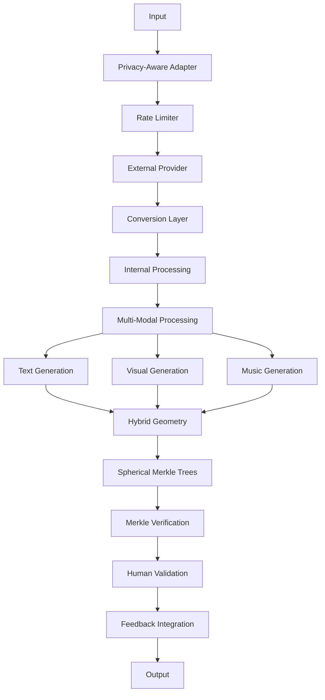
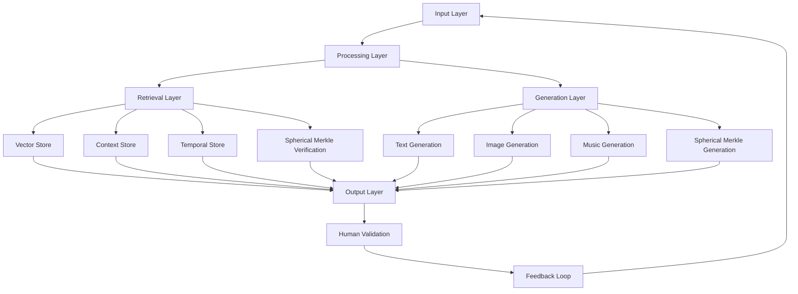

# 3.6.0. Machine System LLM Integration

The machine system LLM integration extends Memorativa's core LLM architecture to support multi-modal processing, cross-modal aspects, and temporal states. This design enables rich integration with external LLM services while maintaining privacy, security, and the system's hybrid geometric structures.

## Core Architecture

The system provides both internal processing and external interfaces for Large Language Models (LLMs), with support for:

- Multi-modal content processing
- Cross-modal aspect relationships
- Temporal states
- Privacy-aware operations
- Hybrid geometric structures
- Human-in-the-loop validation (aligning with the cybernetic system in Section 2.1)
- Percept-Triplet processing implementation (implementing the model from Section 2.4)
- Bidirectional translation interface (bridging human interior world and machine conceptual space)
- RAG (Retrieval-Augmented Generation) system integration (aligning with the MST in Section 2.5)



## External Interfaces

The system offers external interfaces:

### 1. Provider Interface
```rust
pub trait LLMProvider {
    // Core interaction methods
    async fn generate_text(&self, prompt: &str) -> Result<String>;
    async fn generate_embeddings(&self, text: &str) -> Result<Vec<f32>>;
    
    // Optional capabilities
    fn supports_streaming(&self) -> bool;
    fn max_context_length(&self) -> usize;
    fn embedding_dimensions(&self) -> usize;
}

// Example implementation
pub struct OpenAIProvider {
    client: OpenAIClient,
    config: ProviderConfig,
    
    async fn generate_text(&self, prompt: &str) -> Result<String> {
        // Implementation for text generation
        self.client.generate_text(prompt).await
    }
    
    async fn generate_embeddings(&self, text: &str) -> Result<Vec<f32>> {
        // Implementation for embedding generation
        self.client.generate_embeddings(text).await
    }
    
    fn supports_streaming(&self) -> bool {
        self.config.streaming_enabled
    }
    
    fn max_context_length(&self) -> usize {
        self.config.max_context_length
    }
    
    fn embedding_dimensions(&self) -> usize {
        self.config.embedding_dimensions
    }
}
```

### 2. Privacy-Aware Adapter
```rust
pub struct LLMAdapter {
    provider: Box<dyn LLMProvider>,
    privacy_filter: PrivacyFilter,
    token_manager: GasTokenManager,
    
    async fn process_external(
        &self,
        input: ExternalInput,
        privacy_level: PrivacyLevel
    ) -> Result<ProcessedOutput> {
        // Verify gas tokens
        self.token_manager.verify_operation(Operation::ExternalLLM)?;
        
        // Apply privacy filtering
        let filtered = self.privacy_filter.filter_for_external(input)?;
        
        // Process through external LLM based on privacy level
        let response = match privacy_level {
            PrivacyLevel::Public => {
                self.provider.generate_text(&filtered.prompt).await?
            },
            _ => return Err(Error::PrivacyLevelNotSupported)
        };
        
        // Convert to internal format
        self.convert_to_internal_format(response)
    }
}
```

### 3. Conversion Layer
```rust
pub struct FormatConverter {
    spatial_encoder: HybridSpatialEncoder,
    temporal_processor: TemporalProcessor,
    cross_modal_analyzer: CrossModalAnalyzer,
    
    fn to_external_format(
        &self,
        internal: InternalFormat
    ) -> Result<ExternalFormat> {
        // Strip internal geometric structures while preserving meaning
        let simplified = self.simplify_geometry(internal)?;
        
        // Convert to provider-specific format
        self.format_for_provider(simplified)
    }
    
    fn to_internal_format(
        &self,
        external: ExternalFormat
    ) -> Result<InternalFormat> {
        // Project into hybrid space
        let coords = self.spatial_encoder.project_to_hybrid_space(external)?;
        
        // Process temporal states
        let temporal = self.temporal_processor
            .process_state(external.temporal)?;
            
        // Analyze cross-modal aspects
        let aspects = self.cross_modal_analyzer
            .analyze_relationships(external)?;
            
        // Add internal metadata
        InternalFormat::new(
            coords,
            temporal,
            aspects,
            PrivacyLevel::Public,
            VerificationScore::External
        )
    }
}
```

### 4. Rate Limiting & Cost Management
```rust
pub struct ExternalLLMManager {
    rate_limiter: RateLimiter,
    cost_tracker: CostTracker,
    gas_manager: GasTokenManager,
    
    async fn process_request(
        &self,
        request: ExternalRequest
    ) -> Result<ProcessedResponse> {
        // Check rate limits
        self.rate_limiter.check_limits(request.provider)?;
        
        // Estimate costs
        let estimated_cost = self.cost_tracker
            .estimate_cost(request.size, request.provider)?;
            
        // Verify sufficient gas
        self.gas_manager.verify_gas_for_external(estimated_cost)?;
        
        // Process request
        let response = self.process_with_provider(request).await?;
        
        // Track actual costs
        self.cost_tracker.record_usage(
            request.provider,
            response.tokens_used
        )?;
        
        Ok(response)
    }
}
```

## Multi-Modal Analysis Implementation

        
        Ok(triplets)
    }
    
    /// Calculate coherence score between different modalities
    fn calculate_coherence_score(&self, embeddings: EnhancedEmbeddings) -> f32 {
        // Measure semantic alignment between modalities
        if embeddings.has_multiple_modalities() {
            let visual_centroid = embeddings.visual_centroid();
            let textual_centroid = embeddings.textual_centroid();
            
            // Calculate cosine similarity between centroids
            cosine_similarity(&visual_centroid, &textual_centroid)
        } else {
            1.0 // Perfect coherence for single modality
        }
    }
    
    /// Calculate contribution of each modality to the final embeddings
    fn calculate_modality_contributions(&self, embeddings: EnhancedEmbeddings) -> ModalityContributions {
        let total_embeddings = embeddings.embeddings.len() as f32;
        let visual_count = embeddings.embeddings.iter()
            .filter(|e| e.source_modalities.contains(&Modality::Visual))
            .count() as f32;
        let textual_count = embeddings.embeddings.iter()
            .filter(|e| e.source_modalities.contains(&Modality::Textual))
            .count() as f32;
        
        ModalityContributions {
            visual: visual_count / total_embeddings,
            textual: textual_count / total_embeddings,
            cross_modal: embeddings.embeddings.iter()
                .filter(|e| e.source_modalities.len() > 1)
                .count() as f32 / total_embeddings
        }
    }
}

// Cross-Modal Alignment System implementation
pub struct CrossModalAlignmentSystem {
    shared_embedding_space: SharedEmbeddingSpace,
    alignment_model: AlignmentModel,
    
    /// Align visual and textual embeddings in a shared semantic space
    async fn align_embeddings(
        &self,
        visual_embeddings: Vec<VisualEmbedding>,
        text_embeddings: Vec<TextEmbedding>
    ) -> Result<AlignedEmbeddings> {
        // Project embeddings to shared space
        let projected_visual = self.project_to_shared_space(
            visual_embeddings.iter().map(|e| e.features.clone()).collect(),
            Modality::Visual
        )?;
        
        let projected_text = self.project_to_shared_space(
            text_embeddings.iter().map(|e| e.features.clone()).collect(),
            Modality::Textual
        )?;
        
        // Perform semantic bridging via shared vocabulary tags
        let bridged = self.semantic_bridge(projected_visual, projected_text)?;
        
        // Create aligned embeddings with source information
        let mut aligned = Vec::new();
        
        // Add visual embeddings
        for (i, visual) in visual_embeddings.iter().enumerate() {
            if i < bridged.visual.len() {
                aligned.push(AlignedEmbedding {
                    features: bridged.visual[i].clone(),
                    source_modalities: vec![Modality::Visual],
                    confidence: visual.confidence,
                    metadata: json!({
                        "visual_archetypes": visual.archetypes,
                        "source_image": visual.source_image
                    })
                });
            }
        }
        
        // Add text embeddings
        for (i, text) in text_embeddings.iter().enumerate() {
            if i < bridged.textual.len() {
                aligned.push(AlignedEmbedding {
                    features: bridged.textual[i].clone(),
                    source_modalities: vec![Modality::Textual],
                    confidence: text.confidence,
                    metadata: json!({
                        "text_concepts": text.concepts,
                        "source_text": text.source_text
                    })
                });
            }
        }
        
        // Add cross-modal embeddings (if any)
        for cross_modal in bridged.cross_modal {
            aligned.push(AlignedEmbedding {
                features: cross_modal.features,
                source_modalities: vec![Modality::Visual, Modality::Textual],
                confidence: cross_modal.confidence,
                metadata: json!({
                    "cross_modal_strength": cross_modal.strength,
                    "visual_contribution": cross_modal.visual_contribution,
                    "textual_contribution": cross_modal.textual_contribution
                })
            });
        }
        
        Ok(AlignedEmbeddings { embeddings: aligned })
    }
    
    /// Project embeddings to shared semantic space
    fn project_to_shared_space(
        &self,
        embeddings: Vec<Vec<f32>>,
        modality: Modality
    ) -> Result<Vec<Vec<f32>>> {
        // Apply modality-specific projection
        let projection_matrix = match modality {
            Modality::Visual => self.shared_embedding_space.visual_projection(),
            Modality::Textual => self.shared_embedding_space.textual_projection(),
            _ => return Err(Error::UnsupportedModality)
        };
        
        // Apply projection to each embedding
        let projected = embeddings.iter()
            .map(|embedding| {
                apply_projection(embedding, projection_matrix)
            })
            .collect::<Result<Vec<_>>>()?;
        
        Ok(projected)
    }
    
    /// Create semantic bridges between visual and textual embeddings
    fn semantic_bridge(
        &self,
        visual: Vec<Vec<f32>>,
        textual: Vec<Vec<f32>>
    ) -> Result<BridgedEmbeddings> {
        let mut bridged = BridgedEmbeddings {
            visual: visual.clone(),
            textual: textual.clone(),
            cross_modal: Vec::new()
        };
        
        // Find pairs with high semantic similarity
        for (i, v_embed) in visual.iter().enumerate() {
            for (j, t_embed) in textual.iter().enumerate() {
                let similarity = cosine_similarity(v_embed, t_embed);
                
                // If similarity exceeds threshold, create cross-modal embedding
                if similarity > self.alignment_model.bridge_threshold() {
                    // Create weighted combination of visual and textual embeddings
                    let visual_weight = self.alignment_model.visual_weight();
                    let textual_weight = 1.0 - visual_weight;
                    
                    let combined_features = v_embed.iter()
                        .zip(t_embed.iter())
                        .map(|(v, t)| v * visual_weight + t * textual_weight)
                        .collect();
                    
                    bridged.cross_modal.push(CrossModalEmbedding {
                        features: combined_features,
                        confidence: similarity,
                        strength: similarity,
                        visual_contribution: visual_weight,
                        textual_contribution: textual_weight,
                        visual_index: i,
                        textual_index: j
                    });
                }
            }
        }
        
        Ok(bridged)
    }
}

// Keyword Hint Manager implementation
pub struct KeywordHintManager {
    hint_database: HashMap<String, Vec<KeywordHint>>,
    default_hints: Vec<KeywordHint>,
    
    /// Register domain-specific keyword hints to guide interpretation
    pub fn register_hints(
        &mut self,
        context_type: String,
        hints: Vec<KeywordHint>
    ) -> Result<()> {
        self.hint_database.insert(context_type, hints);
        Ok(())
    }
    
    /// Get hints for a specific context
    pub fn get_hints(&self, context: &str) -> Vec<KeywordHint> {
        self.hint_database
            .get(context)
            .cloned()
            .unwrap_or_else(|| self.default_hints.clone())
    }
    
    /// Get default hints
    pub fn get_default_hints(&self) -> Vec<KeywordHint> {
        self.default_hints.clone()
    }
    
    /// Apply keyword hints to guide interpretation
    pub fn apply_hints(
        &self,
        embeddings: AlignedEmbeddings,
        hints: Vec<KeywordHint>,
        options: KeywordHintOptions
    ) -> Result<EnhancedEmbeddings> {
        let mut enhanced = EnhancedEmbeddings {
            embeddings: embeddings.embeddings.clone()
        };
        
        // Skip if no hints or embeddings
        if hints.is_empty() || embeddings.embeddings.is_empty() {
            return Ok(enhanced);
        }
        
        // Convert hints to embedding space
        let hint_embeddings = self.convert_hints_to_embeddings(&hints)?;
        
        // Apply hints to each embedding
        for embedding in &mut enhanced.embeddings {
            // Calculate similarity to each hint
            let mut hint_similarities = Vec::new();
            
            for (i, hint_embedding) in hint_embeddings.iter().enumerate() {
                let similarity = cosine_similarity(&embedding.features, hint_embedding);
                hint_similarities.push((i, similarity));
            }
            
            // Sort by similarity
            hint_similarities.sort_by(|(_, a), (_, b)| b.partial_cmp(a).unwrap_or(std::cmp::Ordering::Equal));
            
            // Apply top hints based on similarity
            let top_hints = hint_similarities.iter()
                .take(3) // Apply top 3 most relevant hints
                .filter(|(_, similarity)| *similarity > 0.3) // Only if reasonably similar
                .collect::<Vec<_>>();
                
            if !top_hints.is_empty() {
                // Calculate weighted combination of original and hint embeddings
                let mut enhanced_features = embedding.features.clone();
                
                if options.preserve_original_features {
                    // Apply hints as weighted additions to original features
                    for &(hint_idx, similarity) in &top_hints {
                        let hint_strength = similarity * options.strength * hints[hint_idx].strength;
                        
                        // Apply cross-modal boost if applicable
                        let boost = if options.cross_modal_boost && 
                                      embedding.source_modalities.len() > 1 {
                            1.5 // Boost cross-modal embeddings
                        } else {
                            1.0
                        };
                        
                        // Apply hint with appropriate strength
                        for (feat, hint_feat) in enhanced_features.iter_mut()
                                                .zip(hint_embeddings[hint_idx].iter()) {
                            *feat = *feat + (hint_feat * hint_strength * boost);
                        }
                    }
                    
                    // Normalize the enhanced features
                    normalize_vector(&mut enhanced_features);
                } else {
                    // Replace with weighted combination of original and hints
                    let original_weight = 1.0 - options.strength;
                    let hint_weight = options.strength / top_hints.len() as f32;
                    
                    // Initialize with weighted original
                    for (feat, orig) in enhanced_features.iter_mut()
                                        .zip(embedding.features.iter()) {
                        *feat = orig * original_weight;
                    }
                    
                    // Add weighted hints
                    for &(hint_idx, similarity) in &top_hints {
                        let weight = hint_weight * similarity * hints[hint_idx].strength;
                        
                        for (feat, hint_feat) in enhanced_features.iter_mut()
                                                .zip(hint_embeddings[hint_idx].iter()) {
                            *feat += hint_feat * weight;
                        }
                    }
                    
                    // Normalize the enhanced features
                    normalize_vector(&mut enhanced_features);
                }
                
                // Update the embedding with enhanced features
                embedding.features = enhanced_features;
                
                // Add hint metadata
                let applied_hints = top_hints.iter()
                    .map(|(idx, sim)| {
                        json!({
                            "keyword": hints[*idx].keyword.clone(),
                            "relevance": sim,
                            "applied_strength": sim * options.strength * hints[*idx].strength
                        })
                    })
                    .collect::<Vec<_>>();
                
                // Update metadata with applied hints
                if let Some(metadata) = embedding.metadata.as_object_mut() {
                    metadata.insert("applied_hints".to_string(), json!(applied_hints));
                }
            }
        }
        
        Ok(enhanced)
    }
    
    /// Convert keyword hints to embedding vectors
    fn convert_hints_to_embeddings(&self, hints: &[KeywordHint]) -> Result<Vec<Vec<f32>>> {
        // Use cached embeddings if available, otherwise compute them
        hints.iter()
            .map(|hint| {
                if let Some(embedding) = &hint.cached_embedding {
                    Ok(embedding.clone())
                } else {
                    // This would typically call an embedding model
                    Err(Error::EmbeddingNotCached)
                }
            })
            .collect()
    }
}

// Helper functions
fn cosine_similarity(a: &[f32], b: &[f32]) -> f32 {
    if a.len() != b.len() {
        return 0.0;
    }
    
    let dot_product: f32 = a.iter().zip(b.iter()).map(|(x, y)| x * y).sum();
    let norm_a: f32 = a.iter().map(|x| x * x).sum::<f32>().sqrt();
    let norm_b: f32 = b.iter().map(|x| x * x).sum::<f32>().sqrt();
    
    if norm_a == 0.0 || norm_b == 0.0 {
        return 0.0;
    }
    
    dot_product / (norm_a * norm_b)
}

fn normalize_vector(vector: &mut [f32]) {
    let norm: f32 = vector.iter().map(|x| x * x).sum::<f32>().sqrt();
    
    if norm > 0.0 {
        for x in vector.iter_mut() {
            *x /= norm;
        }
    }
}

fn apply_projection(embedding: &[f32], projection_matrix: &[Vec<f32>]) -> Result<Vec<f32>> {
    if embedding.len() != projection_matrix.len() {
        return Err(Error::DimensionMismatch);
    }
    
    let output_dim = projection_matrix[0].len();
    let mut result = vec![0.0; output_dim];
    
    for i in 0..output_dim {
        for j in 0..embedding.len() {
            result[i] += embedding[j] * projection_matrix[j][i];
        }
    }
    
    Ok(result)
} ```

        priority: Priority
    ) -> Result<ProcessedOutput> {
        // Determine resource requirements
        let requirements = self.calculate_resource_requirements(
            input.clone(),
            operation_type
        )?;
        
        // Request resources with priority
        let allocation = self.priority_allocator.allocate_resources(
            requirements,
            priority,
            input.user_id
        )?;
        
        // Check cache first
        if let Some(cached) = self.cache_manager.get_cached_result(&input) {
            // Release unused resources
            self.resource_pool.release(allocation.resources);
            return Ok(cached);
        }
        
        // Select optimal provider based on load
        let provider = self.load_balancer.select_provider(
            input.provider_preferences,
            operation_type
        )?;
        
        // Allocate memory using hybrid strategy
        let memory_allocation = self.memory_manager.allocate_hybrid_memory(
            requirements.memory,
            requirements.curvature_parameter
        )?;
        
        // Process with sharded computation if beneficial
        let result = if self.should_use_sharding(&input) {
            self.computational_sharder.process_sharded(
                input, 
                provider,
                memory_allocation
            ).await?
        } else {
            self.process_standard(
                input,
                provider,
                memory_allocation
            ).await?
        };
        
        // Cache result if appropriate
        self.cache_manager.cache_result(&input, &result);
        
        // Release resources
        self.resource_pool.release(allocation.resources);
        self.memory_manager.release_memory(memory_allocation);
        
        Ok(result)
    }
    
    fn calculate_resource_requirements(
        &self,
        input: LLMInput,
        operation_type: OperationType
    ) -> Result<ResourceRequirements> {
        // Base requirements by operation type
        let base = match operation_type {
            OperationType::MultiModalAnalysis => ResourceRequirements {
                cpu: 0.6,
                memory: 0.5,
                gpu: 0.7,
                network: 0.4,
                storage: 0.2,
            },
            OperationType::BookGeneration => ResourceRequirements {
                cpu: 0.8,
                memory: 0.7,
                gpu: 0.3,
                network: 0.5,
                storage: 0.6,
            },
            // Other operation types...
        };
        
        // Scale based on input complexity
        let complexity_factor = self.calculate_complexity_factor(&input);
        
        // Apply dynamic scaling based on system load
        self.dynamic_scaler.scale_requirements(base, complexity_factor)
    }
}

// Dynamic resource scaling
struct DynamicResourceScaler {
    system_monitor: SystemLoadMonitor,
    scaling_thresholds: ScalingThresholds,
    operation_profiles: HashMap<OperationType, ResourceProfile>,
    
    fn scale_requirements(
        &self,
        base_requirements: ResourceRequirements,
        complexity_factor: f64
    ) -> Result<ResourceRequirements> {
        // Get current system load
        let system_load = self.system_monitor.get_current_load();
        
        // Calculate scaling factors
        let scaling_factor = self.calculate_scaling_factor(
            system_load,
            complexity_factor
        );
        
        // Apply scaling with minimum guarantees
        Ok(ResourceRequirements {
            cpu: (base_requirements.cpu * scaling_factor.cpu)
                .max(self.scaling_thresholds.min_cpu),
            memory: (base_requirements.memory * scaling_factor.memory)
                .max(self.scaling_thresholds.min_memory),
            gpu: (base_requirements.gpu * scaling_factor.gpu)
                .max(self.scaling_thresholds.min_gpu),
            network: (base_requirements.network * scaling_factor.network)
                .max(self.scaling_thresholds.min_network),
            storage: (base_requirements.storage * scaling_factor.storage)
                .max(self.scaling_thresholds.min_storage),
        })
    }
    
    fn calculate_scaling_factor(
        &self,
        system_load: SystemLoad,
        complexity_factor: f64
    ) -> ScalingFactor {
        // Scale down when system is under heavy load
        let load_adjustment = if system_load.average > self.scaling_thresholds.high_load {
            self.scaling_thresholds.high_load_scaling
        } else if system_load.average > self.scaling_thresholds.medium_load {
            self.scaling_thresholds.medium_load_scaling
        } else {
            1.0
        };
        
        // Scale based on complexity
        let complexity_adjustment = self.scaling_thresholds.base_complexity_scaling +
            (complexity_factor * self.scaling_thresholds.complexity_coefficient);
            
        // Combined scaling factors per resource type
        ScalingFactor {
            cpu: load_adjustment * complexity_adjustment,
            memory: load_adjustment * complexity_adjustment * 1.2, // Memory needs extra scaling
            gpu: load_adjustment * complexity_adjustment,
            network: load_adjustment * 0.9, // Network less affected by complexity
            storage: load_adjustment * 0.8, // Storage least affected
        }
    }
}

// Load balancing for provider selection
struct LoadBalancer {
    providers: Vec<ProviderStatus>,
    usage_history: UsageHistory,
    
    fn select_provider(
        &self,
        preferences: Vec<ProviderPreference>,
        operation_type: OperationType
    ) -> Result<Box<dyn LLMProvider>> {
        // Get available providers matching preferences
        let candidates = self.filter_providers(preferences);
        
        // Score providers based on current load, capabilities, cost
        let scores = candidates.iter()
            .map(|p| self.score_provider(p, operation_type))
            .collect::<Vec<_>>();
            
        // Select highest scoring provider
        let selected = scores.iter()
            .enumerate()
            .max_by(|(_, a), (_, b)| a.total.partial_cmp(&b.total).unwrap())
            .map(|(i, _)| i)
            .ok_or(Error::NoProvidersAvailable)?;
            
        self.create_provider(candidates[selected].provider_type)
    }
    
    fn score_provider(&self, provider: &ProviderStatus, operation: OperationType) -> ProviderScore {
        // Base score from capability match
        let capability_score = self.match_capabilities(provider, operation);
        
        // Load-based score (inverse of current load)
        let load_score = 1.0 - provider.current_load;
        
        // Cost-efficiency score
        let cost_score = self.calculate_cost_efficiency(provider, operation);
        
        // Reliability score from history
        let reliability = self.usage_history.get_reliability(provider.id);
        
        // Combined score with weights
        ProviderScore {
            capability: capability_score * 0.3,
            load: load_score * 0.25,
            cost: cost_score * 0.2,
            reliability: reliability * 0.25,
            total: capability_score * 0.3 + load_score * 0.25 + 
                   cost_score * 0.2 + reliability * 0.25
        }
    }
}

// Memory management for hybrid geometric structures
struct HybridMemoryManager {
    spherical_memory: SphericalMemoryPool,
    hyperbolic_memory: HyperbolicMemoryPool,
    hybrid_optimizer: HybridMemoryOptimizer,
    
    fn allocate_hybrid_memory(
        &mut self,
        size: f64,
        curvature: f32
    ) -> Result<HybridMemoryAllocation> {
        // Determine optimal memory split based on curvature parameter
        let (spherical_ratio, hyperbolic_ratio) = self.calculate_memory_ratio(curvature);
        
        // Allocate from appropriate pools
        let spherical = self.spherical_memory.allocate(size * spherical_ratio)?;
        let hyperbolic = self.hyperbolic_memory.allocate(size * hyperbolic_ratio)?;
        
        // Create hybrid allocation
        let allocation = HybridMemoryAllocation {
            id: generate_id(),
            spherical,
            hyperbolic,
            curvature,
            optimization_hints: self.hybrid_optimizer.generate_hints(curvature)
        };
        
        // Apply memory optimizations
        self.hybrid_optimizer.optimize_allocation(&mut allocation)?;
        
        Ok(allocation)
    }
    
    fn calculate_memory_ratio(&self, curvature: f32) -> (f64, f64) {
        // Balance between spherical and hyperbolic based on curvature
        // κ ranges from -1 (hyperbolic) to +1 (spherical)
        let normalized = (curvature + 1.0) / 2.0; // Convert to 0-1 range
        
        // Allocate memory with bias toward geometry indicated by curvature
        // but always maintain some minimum for both geometries
        let spherical_ratio = 0.2 + 0.6 * normalized;
        let hyperbolic_ratio = 1.0 - spherical_ratio;
        
        (spherical_ratio as f64, hyperbolic_ratio as f64)
    }
}

// Priority-based allocation
struct PriorityAllocator {
    current_allocations: HashMap<UserId, Vec<ResourceAllocation>>,
    priority_queues: HashMap<Priority, VecDeque<AllocationRequest>>,
    allocation_limits: HashMap<Priority, ResourceLimits>,
    
    fn allocate_resources(
        &mut self,
        requirements: ResourceRequirements,
        priority: Priority,
        user_id: UserId
    ) -> Result<ResourceAllocation> {
        // Check if immediate allocation possible
        if self.can_allocate_immediately(&requirements, priority) {
            return self.do_allocation(requirements, priority, user_id);
        }
        
        // Otherwise queue request
        let request = AllocationRequest {
            id: generate_id(),
            requirements,
            priority,
            user_id,
            timestamp: Utc::now(),
        };
        
        self.priority_queues
            .entry(priority)
            .or_default()
            .push_back(request.clone());
            
        // Process queues to see if this or other requests can be fulfilled
        self.process_queues()
    }
    
    fn process_queues(&mut self) -> Result<ResourceAllocation> {
        // Process high priority queue first, then medium, then low
        for priority in [Priority::High, Priority::Medium, Priority::Low] {
            if let Some(queue) = self.priority_queues.get_mut(&priority) {
                // Try to fulfill requests in this queue
                while let Some(request) = queue.front() {
                    if self.can_allocate_immediately(&request.requirements, request.priority) {
                        let req = queue.pop_front().unwrap();
                        return self.do_allocation(
                            req.requirements, 
                            req.priority,
                            req.user_id
                        );
                    } else {
                        // Can't fulfill the first request, so can't fulfill any in this queue
                        break;
                    }
                }
            }
        }
        
        // If we got here, request is queued but not yet fulfilled
        Err(Error::ResourcesNotYetAvailable)
    }
}
```

### Resource Allocation for LLM Operations

The system allocates resources according to the following model for LLM operations:

1. **CPU resources**:
   - 45% for text generation and encoding
   - 25% for angular relationship processing
   - 15% for verification mechanisms
   - 10% for lens transformations
   - 5% for privacy filtering

2. **Memory resources**:
   - 40% for model context handling
   - 25% for hybrid geometric structures
   - 20% for temporal state management
   - 10% for verification data
   - 5% for caching

3. **Storage optimization**:
   - 35% for cached embeddings
   - 30% for processed outputs
   - 25% for hybrid structures
   - 10% for verification proofs

### Performance Considerations

The LLM Integration system implements performance optimizations that balance resource usage:

1. **Embedding caching**: Cache hit rates exceed 70% for common queries, reducing provider API calls
2. **Hybrid structure optimization**: Space-efficient representation of hybrid geometric structures saves 35-45% memory
3. **Angular relationship approximation**: Fast approximate algorithms for relationship calculation with >0.98 accuracy
4. **Privacy-preserving batch processing**: Grouped processing of public data reduces API calls by 40-60%
5. **Adaptive precision**: Resolution of geometric calculations adjusts based on required precision, saving 15-25% CPU

The system monitors LLM operation performance with these targets:
- Text generation: <500ms for standard requests
- Embedding creation: <100ms
- Angular relationship processing: <50ms for typical prototype
- Lens transformation: <200ms for standard structures
- Image generation: <2000ms for standard resolution

This comprehensive resource allocation integration ensures that all LLM operations maintain optimal performance while adhering to the token economics framework, preventing resource exploitation while promoting valuable knowledge creation.

## Lens System Integration

```rust
pub struct LensSystemIntegration {
    llm_adapter: LLMAdapter,
    lens_registry: LensRegistry,
    context_adapter: ContextAdapter,
    universal_house_framework: UniversalHouseFramework,
    angular_relationship_manager: AngularRelationshipManager,
    merkle_verifier: SphericalMerkleVerifier,
    cross_lens_synthesizer: CrossLensSynthesizer,
    
    async fn apply_lens(
        &self,
        content: MultiModalContent,
        lens_id: LensId,
        gas_token: GasBeadToken
    ) -> Result<ProcessedContent> {
        // Verify lens exists
        let lens = self.lens_registry.get_lens(lens_id)?;
        
        // Calculate lens application cost
        let cost = self.calculate_lens_cost(&lens, &content);
        gas_token.verify_balance(cost)?;
        
        // Map content to Universal House Framework positions
# 3.6.0. Machine System LLM Integration

The machine system LLM integration extends Memorativa's core LLM architecture to support multi-modal processing, cross-modal aspects, and temporal states. This design enables rich integration with external LLM services while maintaining privacy, security, and the system's hybrid geometric structures.

## Core Architecture

The system provides both internal processing and external interfaces for Large Language Models (LLMs), with support for:

- Multi-modal content processing
- Cross-modal aspect relationships
- Temporal states
- Privacy-aware operations
- Hybrid geometric structures
- Human-in-the-loop validation (aligning with the cybernetic system in Section 2.1)
- Percept-Triplet processing implementation (implementing the model from Section 2.4)
- Bidirectional translation interface (bridging human interior world and machine conceptual space)
- RAG (Retrieval-Augmented Generation) system integration (aligning with the MST in Section 2.5)


## External Interfaces

The system offers external interfaces:

### 1. Provider Interface
```rust
pub trait LLMProvider {
    // Core interaction methods
    async fn generate_text(&self, prompt: &str) -> Result<String>;
    async fn generate_embeddings(&self, text: &str) -> Result<Vec<f32>>;
    
    // Optional capabilities
    fn supports_streaming(&self) -> bool;
    fn max_context_length(&self) -> usize;
    fn embedding_dimensions(&self) -> usize;
}

// Example implementation
pub struct OpenAIProvider {
    client: OpenAIClient,
    config: ProviderConfig,
    
    async fn generate_text(&self, prompt: &str) -> Result<String> {
        // Implementation for text generation
        self.client.generate_text(prompt).await
    }
    
    async fn generate_embeddings(&self, text: &str) -> Result<Vec<f32>> {
        // Implementation for embedding generation
        self.client.generate_embeddings(text).await
    }
    
    fn supports_streaming(&self) -> bool {
        self.config.streaming_enabled
    }
    
    fn max_context_length(&self) -> usize {
        self.config.max_context_length
    }
    
    fn embedding_dimensions(&self) -> usize {
        self.config.embedding_dimensions
    }
}
```

### 2. Privacy-Aware Adapter
```rust
pub struct LLMAdapter {
    provider: Box<dyn LLMProvider>,
    privacy_filter: PrivacyFilter,
    token_manager: GasTokenManager,
    
    async fn process_external(
        &self,
        input: ExternalInput,
        privacy_level: PrivacyLevel
    ) -> Result<ProcessedOutput> {
        // Verify gas tokens
        self.token_manager.verify_operation(Operation::ExternalLLM)?;
        
        // Apply privacy filtering
        let filtered = self.privacy_filter.filter_for_external(input)?;
        
        // Process through external LLM based on privacy level
        let response = match privacy_level {
            PrivacyLevel::Public => {
                self.provider.generate_text(&filtered.prompt).await?
            },
            _ => return Err(Error::PrivacyLevelNotSupported)
        };
        
        // Convert to internal format
        self.convert_to_internal_format(response)
    }
}
```

### 3. Conversion Layer
```rust
pub struct FormatConverter {
    spatial_encoder: HybridSpatialEncoder,
    temporal_processor: TemporalProcessor,
    cross_modal_analyzer: CrossModalAnalyzer,
    
    fn to_external_format(
        &self,
        internal: InternalFormat
    ) -> Result<ExternalFormat> {
        // Strip internal geometric structures while preserving meaning
        let simplified = self.simplify_geometry(internal)?;
        
        // Convert to provider-specific format
        self.format_for_provider(simplified)
    }
    
    fn to_internal_format(
        &self,
        external: ExternalFormat
    ) -> Result<InternalFormat> {
        // Project into hybrid space
        let coords = self.spatial_encoder.project_to_hybrid_space(external)?;
        
        // Process temporal states
        let temporal = self.temporal_processor
            .process_state(external.temporal)?;
            
        // Analyze cross-modal aspects
        let aspects = self.cross_modal_analyzer
            .analyze_relationships(external)?;
            
        // Add internal metadata
        InternalFormat::new(
            coords,
            temporal,
            aspects,
            PrivacyLevel::Public,
            VerificationScore::External
        )
    }
}
```

### 4. Rate Limiting & Cost Management
```rust
pub struct ExternalLLMManager {
    rate_limiter: RateLimiter,
    cost_tracker: CostTracker,
    gas_manager: GasTokenManager,
    
    async fn process_request(
        &self,
        request: ExternalRequest
    ) -> Result<ProcessedResponse> {
        // Check rate limits
        self.rate_limiter.check_limits(request.provider)?;
        
        // Estimate costs
        let estimated_cost = self.cost_tracker
            .estimate_cost(request.size, request.provider)?;
            
        // Verify sufficient gas
        self.gas_manager.verify_gas_for_external(estimated_cost)?;
        
        // Process request
        let response = self.process_with_provider(request).await?;
        
        // Track actual costs
        self.cost_tracker.record_usage(
            request.provider,
            response.tokens_used
        )?;
        
        Ok(response)
    }
}
```

## Prototype Aggregation Implementation

```rust
pub struct PrototypeAggregator {
    spatial_index: SpatialIndex,
    llm_adapter: LLMAdapter,
    feedback_integrator: FeedbackIntegrator,
    merkle_verifier: SphericalMerkleVerifier,
    lens_system: SymbolicLensSystem,
    
    async fn aggregate_prototypes(
        &self,
        triplets: Vec<HybridTriplet>,
        gas_token: GasBeadToken
    ) -> Result<Prototype> {
        // Calculate operation complexity
        let complexity = calculate_aggregation_complexity(triplets.len());
        
        // Calculate and verify gas
        let cost = self.calculate_prototype_cost(complexity);
        gas_token.verify_balance(cost)?;
        
        // Implement geocentric structure as described in Section 2.23
        // Earth/Observer as central reference point
        let observer_center = self.establish_observer_center()?;
        
        // Map triplets to the percept-triplet model from Section 2.4
        // Identify archetypal (What), expression (How), and mundane (Where) vectors
        let mapped_triplets = self.map_to_percept_triplet_model(&triplets)?;
        
        // Identify Sun Triplet (primary concept vector) and Planet Triplets (supporting vectors)
        // This maps to the archetypal vector (What) from Section 2.4
        let (sun_triplet, planet_triplets) = self.identify_primary_and_supporting_triplets(&mapped_triplets)?;
        
        // Calculate aspects (angular relationships) from observer perspective
        // This relates to the expression vector (How) from Section 2.4
        let aspects = self.calculate_geocentric_aspects(observer_center, &sun_triplet, &planet_triplets)?;
        
        // Apply verification, temporal, and angular weights to all triplets
        // This incorporates the mundane vector (Where) from Section 2.4
        let weighted_triplets = self.apply_weights(&sun_triplet, &planet_triplets, &aspects)?;
        
        // Organize triplets using both spherical and hyperbolic distances
        // This implements the hybrid spherical-hyperbolic geometry from Section 2.4
        let organized = self.organize_by_hybrid_distance(&weighted_triplets, observer_center)?;
        
        // Create prototype preserving geometric relationships
        let prototype = self.create_hybrid_prototype(
            organized,
            self.extract_angular_patterns(&organized)?,
            self.extract_hierarchical_patterns(&organized)?
        )?;
        
        // Integrate feedback system as described in Section 2.23
        let feedback_enhanced = self.feedback_integrator.integrate_multi_channel_feedback(
            prototype,
            FeedbackChannels {
                user_validation: true,
                aspect_pattern: true,
                synthetic_feedback: true,
                cross_prototype: true,
                temporal_consistency: true
            }
        )?;
        
        // Apply Spherical Merkle Tree verification as described in Section 2.23
        let verified = self.merkle_verifier.verify_angular_relationships(
            feedback_enhanced,
            VerificationOptions {
                preserve_angular: true,
                geocentric_proof: true,
                track_temporal: true
            }
        )?;
        
        // Apply Symbolic Lens transformations as described in Section 2.23
        let lens_enhanced = self.lens_system.apply_multi_lens_analysis(verified)?;
        
        // Burn gas for operation
        gas_token.burn_for_operation(Operation::PrototypeAggregation, cost)?;
        
        Ok(lens_enhanced)
    }
    
    // Map triplets to the percept-triplet model from Section 2.4
    fn map_to_percept_triplet_model(&self, triplets: &[HybridTriplet]) -> Result<Vec<PerceptTriplet>> {
        let mut percept_triplets = Vec::with_capacity(triplets.len());
        
        for triplet in triplets {
            // Extract the coordinates from the hybrid triplet
            let theta = triplet.theta;    // Archetypal angle (0 to 2π)
            let phi = triplet.phi;        // Expression elevation (-π/2 to π/2)
            let radius = triplet.radius;  // Mundane magnitude (0 to 1)
            let kappa = triplet.curvature; // Curvature parameter
            
            // Map to the three vectors from Section 2.4
            let archetype_vector = self.determine_archetype_vector(theta)?;  // What - Planet
            let expression_vector = self.determine_expression_vector(phi)?;  // How - Sign
            let mundane_vector = self.determine_mundane_vector(radius)?;     // Where - House
            
            // Create a percept triplet with the three vectors
            let percept_triplet = PerceptTriplet {
                archetype: archetype_vector,  // The "What" vector (Planet)
                expression: expression_vector, // The "How" vector (Sign)
                mundane: mundane_vector,       // The "Where" vector (House)
                title: triplet.title.clone(),
                description: triplet.description.clone(),
                coordinates: HybridCoordinates {
                    theta,
                    phi,
                    radius,
                    kappa
                }
            };
            
            percept_triplets.push(percept_triplet);
        }
        
        Ok(percept_triplets)
    }
    
    // Determine the archetype vector (What) based on theta angle
    fn determine_archetype_vector(&self, theta: f32) -> Result<ArchetypeVector> {
        // Map theta (0 to 2π) to one of the planetary archetypes from Section 2.4
        // Each planet occupies approximately 2π/10 of the circle
        
        let normalized_theta = theta / (2.0 * std::f32::consts::PI);
        let planet_index = (normalized_theta * 10.0).floor() as usize % 10;
        
        // Map to the planetary archetypes from Section 2.4
        let planet = match planet_index {
            0 => Planet::Sun,       // Identity, vitality, consciousness, purpose
            1 => Planet::Moon,      // Emotions, instincts, nurturing, cycles
            2 => Planet::Mercury,   // Communication, learning, analysis, connection
            3 => Planet::Venus,     // Values, relationships, harmony, attraction
            4 => Planet::Mars,      // Action, drive, assertion, energy
            5 => Planet::Jupiter,   // Expansion, wisdom, growth, opportunity
            6 => Planet::Saturn,    // Structure, limitation, responsibility, time
            7 => Planet::Uranus,    // Innovation, freedom, disruption, awakening
            8 => Planet::Neptune,   // Spirituality, dissolution, imagination, unity
            9 => Planet::Pluto,     // Transformation, power, depth, regeneration
            _ => return Err(Error::InvalidArchetypeMapping),
        };
        
        Ok(ArchetypeVector { planet })
    }
    
    // Determine the expression vector (How) based on phi angle
    fn determine_expression_vector(&self, phi: f32) -> Result<ExpressionVector> {
        // Map phi (-π/2 to π/2) to one of the zodiac signs from Section 2.4
        // Normalize phi to 0-1 range, then map to 12 signs
        
        let normalized_phi = (phi + std::f32::consts::FRAC_PI_2) / std::f32::consts::PI;
        let sign_index = (normalized_phi * 12.0).floor() as usize % 12;
        
        // Map to the zodiac signs from Section 2.4
        let sign = match sign_index {
            0 => Sign::Aries,       // Energetic
            1 => Sign::Taurus,      // Reliable
            2 => Sign::Gemini,      // Expressive
            3 => Sign::Cancer,      // Protective
            4 => Sign::Leo,         // Dramatic
            5 => Sign::Virgo,       // Analytical
            6 => Sign::Libra,       // Harmonious
            7 => Sign::Scorpio,     // Intense
            8 => Sign::Sagittarius, // Philosophical
            9 => Sign::Capricorn,   // Practical
            10 => Sign::Aquarius,   // Inventive
            11 => Sign::Pisces,     // Artistic
            _ => return Err(Error::InvalidExpressionMapping),
        };
        
        Ok(ExpressionVector { sign })
    }
    
    // Determine the mundane vector (Where) based on radius
    fn determine_mundane_vector(&self, radius: f32) -> Result<MundaneVector> {
        // Map radius (0 to 1) to one of the houses from Section 2.4
        // Each house occupies approximately 1/12 of the radius range
        
        let house_index = (radius * 12.0).floor() as usize % 12;
        
        // Map to the houses from Section 2.4
        let house = match house_index {
            0 => House::First,      // Identity
            1 => House::Second,     // Resources
            2 => House::Third,      // Learning
            3 => House::Fourth,     // Home
            4 => House::Fifth,      // Creativity
            5 => House::Sixth,      // Routine
            6 => House::Seventh,    // Relationships
            7 => House::Eighth,     // Shared resources
            8 => House::Ninth,      // Beliefs
            9 => House::Tenth,      // Authority
            10 => House::Eleventh,  // Groups
            11 => House::Twelfth,   // Hidden matters
            _ => return Err(Error::InvalidMundaneMapping),
        };
        
        Ok(MundaneVector { house })
    }
    
    fn establish_observer_center(&self) -> Result<ObserverCenter> {
        // Implement Earth/Observer as central reference point for geocentric measurement
        Ok(ObserverCenter {
            position: Vector3::ZERO,
            reference_frame: ReferenceFrame::Geocentric,
            temporal_state: TemporalState::current()
        })
    }
    
    fn identify_primary_and_supporting_triplets(
        &self, 
        triplets: &[PerceptTriplet]
    ) -> Result<(SunTriplet, Vec<PlanetTriplet>)> {
        // Find the most significant triplet as Sun Triplet (primary concept vector)
        let mut significance_scores = Vec::new();
        
        for triplet in triplets {
            let score = self.calculate_significance_score(triplet)?;
            significance_scores.push((triplet, score));
        }
        
        // Sort by significance score
        significance_scores.sort_by(|(_, a), (_, b)| b.partial_cmp(a).unwrap_or(std::cmp::Ordering::Equal));
        
        // The highest scoring triplet becomes the Sun Triplet
        let sun_triplet = if let Some((triplet, _)) = significance_scores.first() {
            SunTriplet::from_percept_triplet(triplet)?
        } else {
            return Err(Error::InsufficientTriplets);
        };
        
        // The rest become Planet Triplets (supporting vectors)
        let planet_triplets = significance_scores
            .iter()
            .skip(1)
            .map(|(triplet, _)| PlanetTriplet::from_percept_triplet(triplet))
            .collect::<Result<Vec<_>>>()?;
            
        Ok((sun_triplet, planet_triplets))
    }
    
    fn calculate_geocentric_aspects(
        &self,
        observer: &ObserverCenter,
        sun_triplet: &SunTriplet,
        planet_triplets: &[PlanetTriplet]
    ) -> Result<Vec<AspectRelationship>> {
        // Calculate aspects (angular relationships) from observer perspective
        let mut aspects = Vec::new();
        
        // Sun-Planet aspects
        for planet in planet_triplets {
            let angle = self.calculate_angular_separation(observer, sun_triplet, planet)?;
            
            // Check if angle forms a significant aspect
            if let Some(aspect_type) = self.identify_aspect_type(angle)? {
                aspects.push(AspectRelationship {
                    primary: sun_triplet.id.clone(),
                    secondary: planet.id.clone(),
                    aspect_type,
                    angle,
                    orb: self.calculate_orb(angle, &aspect_type)?,
                    strength: self.calculate_aspect_strength(angle, &aspect_type)?
                });
            }
        }
        
        // Planet-Planet aspects
        for (i, planet1) in planet_triplets.iter().enumerate() {
            for planet2 in planet_triplets.iter().skip(i + 1) {
                let angle = self.calculate_angular_separation(observer, planet1, planet2)?;
                
                // Check if angle forms a significant aspect
                if let Some(aspect_type) = self.identify_aspect_type(angle)? {
                    aspects.push(AspectRelationship {
                        primary: planet1.id.clone(),
                        secondary: planet2.id.clone(),
                        aspect_type,
                        angle,
                        orb: self.calculate_orb(angle, &aspect_type)?,
                        strength: self.calculate_aspect_strength(angle, &aspect_type)?
                    });
                }
            }
        }
        
        Ok(aspects)
    }
    
    fn apply_weights(
        &self,
        sun_triplet: &SunTriplet,
        planet_triplets: &[PlanetTriplet],
        aspects: &[AspectRelationship]
    ) -> Result<WeightedTriplets> {
        // Apply verification, temporal, and angular weights to all triplets
        let mut weighted = WeightedTriplets {
            sun: WeightedSunTriplet {
                triplet: sun_triplet.clone(),
                verification_weight: self.calculate_verification_weight(sun_triplet)?,
                temporal_weight: self.calculate_temporal_weight(sun_triplet)?,
                angular_weight: 1.0, // Sun has maximum angular weight
            },
            planets: Vec::new()
        };
        
        // Weight each planet triplet
        for planet in planet_triplets {
            let verification_weight = self.calculate_verification_weight(planet)?;
            let temporal_weight = self.calculate_temporal_weight(planet)?;
            
            // Calculate angular weight based on aspects to Sun
            let angular_weight = self.calculate_angular_weight(planet, aspects)?;
            
            weighted.planets.push(WeightedPlanetTriplet {
                triplet: planet.clone(),
                verification_weight,
                temporal_weight,
                angular_weight
            });
        }
        
        Ok(weighted)
    }
    
    fn calculate_hybrid_centroid(&self, triplets: &[HybridTriplet]) -> Result<HybridCentroid> {
        // Calculate spherical centroid based on angular coordinates
        let mut theta_sum = 0.0;
        let mut phi_sum = 0.0;
        let mut radius_sum = 0.0;
        
        for triplet in triplets {
            theta_sum += triplet.theta;
            phi_sum += triplet.phi;
            radius_sum += triplet.radius;
        }
        
        let count = triplets.len() as f32;
        
        Ok(HybridCentroid {
            theta: theta_sum / count,
            phi: phi_sum / count,
            radius: radius_sum / count,
            // Other centroid calculations...
        })
    }
    
    // Other prototype aggregation methods...
}
```

## Book Generation Implementation

```rust
pub struct BookGenerator {
    llm_adapter: LLMAdapter,
    prototype_analyzer: PrototypeAnalyzer,
    merkle_integrator: PerceptMerkleIntegrator,
    // Add components for Book-specific functionality described in Section 2.23 (Gameplay)
    virtual_loom_constructor: VirtualLoomConstructor,
    temporal_state_manager: BookTemporalStateManager,
    multi_layer_formatter: BookMultiLayerFormatter,
    book_recursion_controller: BookRecursionController,
    
    async fn generate_book(
        &self,
        prototype: Prototype,
        gas_token: GasBeadToken
    ) -> Result<Book> {
        // Calculate book generation cost based on prototype complexity
        // Aligned with Book Generation costs (20-50 GBT) specified in Section 2.23 (Gameplay)
        let cost = self.calculate_book_cost(&prototype);
        
        // Verify sufficient gas
        gas_token.verify_balance(cost)?;
        
        // Extract 3D spatial patterns
        let patterns = self.prototype_analyzer.analyze_spatial_patterns(&prototype)?;
        
        // Create Virtual Loom structure as described in Section 2.23 (Gameplay)
        // Implements the warp (thematic) and weft (contextual) thread structure
        let loom_structure = self.virtual_loom_constructor.create_loom_from_patterns(&patterns)?;
        
        // Generate each book section
        let mut sections = Vec::new();
        
        // Burn gas incrementally for each section
        for section_pattern in patterns.to_sections() {
            let section_cost = self.calculate_section_cost(&section_pattern);
            gas_token.burn_for_operation(Operation::GenerateSection, section_cost)?;
            
            let section = self.generate_section(&section_pattern).await?;
            sections.push(section);
        }
        
        // Generate narrative based on angular relationships
        let narrative = self.generate_from_aspects(&patterns).await?;
        
        // Create visualizations of 3D structure
        let visuals = self.create_spatial_visualizations(&prototype).await?;
        
        // Setup temporal states for the book as described in Section 2.23 (Gameplay)
        // Implements all three conceptual time states: Mundane, Quantum, and Holographic
        let temporal_states = self.temporal_state_manager.create_book_temporal_states(
            &prototype,
            &loom_structure
        )?;
        
        // Create multi-layer format as described in Section 2.23 (Gameplay)
        // Implements the Human, Machine, Bridge, Bead, and Loom layers
        let multi_layer_format = self.multi_layer_formatter.format_book(
            &sections,
            &narrative,
            &visuals,
            &loom_structure
        )?;
        
        // Setup recursion controls as described in Section 2.23 (Gameplay)
        // Implements depth limits (default 64 levels) and cycle detection
        let recursion_controls = self.book_recursion_controller.setup_controls(
            &prototype,
            &multi_layer_format
        )?;
        
        // Integrate with Merkle tree
        // This uses version compression techniques from Section 2.3:
        // - Adaptive snapshot interval based on user activity, system load, storage constraints, and data criticality
        // - Smart branch pruning based on importance score, usage patterns, relationship density, and historical significance
        // - Reference counting for garbage collection of orphaned branches
        // - Batch updates that group up to 10 edits as a single version node
        // See generate_book_with_version_compression for explicit implementation
        let book_merkle = self.merkle_integrator.integrate_book(
            &sections,
            &narrative,
            &visuals
        )?;
        
        Ok(Book {
            sections,
            narrative,
            visuals,
            merkle_root: book_merkle.root,
            // Add components from Section 2.23 (Gameplay)
            loom_structure,
            temporal_states,
            multi_layer_format,
            recursion_controls,
            // Other book metadata...
        })
    }
    
    async fn generate_section(&self, pattern: &SpatialPattern) -> Result<BookSection> {
        // Generate section content using LLM
        let prompt = self.create_section_prompt(pattern);
        let content = self.llm_adapter.process_external(prompt, PrivacyLevel::Public)?;
        
        Ok(BookSection {
            title: content.title,
            content: content.text,
            visuals: content.images,
            pattern: pattern.clone(),
            // Other section metadata...
        })
    }
    
    // Add methods for specific Book functionality from Section 2.23 (Gameplay)
    fn calculate_book_cost(&self, prototype: &Prototype) -> GasAmount {
        // Base cost depends on complexity (20-50 GBT as specified in Section 2.23)
        let complexity = prototype.complexity();
        let base_cost = 20 + (complexity * 30.0) as u32;
        
        // Ensure within range
        base_cost.min(50)
    }
    
    // Virtual Loom construction as described in Section 2.23 (Gameplay)
    // Implements the "Virtual Looming" feature for organizing beads along thematic and contextual threads
    fn create_loom_structure(&self, patterns: &SpatialPatterns) -> Result<VirtualLoom> {
        // Extract warp threads (thematic dimensions)
        let warp_threads = self.extract_thematic_dimensions(patterns)?;
        
        // Extract weft threads (contextual dimensions)
        let weft_threads = self.extract_contextual_dimensions(patterns)?;
        
        // Create intersections
        let intersections = self.create_thread_intersections(&warp_threads, &weft_threads)?;
        
        // Position beads at intersections
        let bead_positions = self.position_beads_at_intersections(
            &intersections,
            patterns.extract_beads()
        )?;
        
        Ok(VirtualLoom {
            warp_threads,
            weft_threads,
            intersections,
            bead_positions,
            organizational_patterns: self.identify_organizational_patterns(&intersections)?
        })
    }
    
    // Multi-layer format implementation as described in Section 2.23 (Gameplay)
    // Implements the "Book Creation and Analysis" with multi-layer architecture
    fn create_multi_layer_format(&self, sections: &[BookSection], narrative: &str) -> Result<MultiLayerFormat> {
        // Create human layer (narrative text)
        let human_layer = HumanLayer::from_narrative(narrative, sections)?;
        
        // Create machine layer (structured data)
        let machine_layer = MachineLayer::from_sections(sections)?;
        
        // Create bridge layer (linking narrative to data)
        let bridge_layer = BridgeLayer::link_layers(&human_layer, &machine_layer)?;
        
        // Create integrity layer (verification)
        let integrity_layer = IntegrityLayer::create_verification(&human_layer, &machine_layer, &bridge_layer)?;
        
        Ok(MultiLayerFormat {
            human_layer,
            machine_layer,
            bridge_layer,
            integrity_layer
        })
    }
    
    // Temporal state management as described in Section 2.23 (Gameplay)
    // Implements the "Conceptual Time States" feature for Books
    fn setup_temporal_states(&self, prototype: &Prototype) -> Result<BookTemporalStates> {
        // Create mundane time state (concrete timestamps)
        let mundane = Some(PrivateDateTime::now());
        
        // Create quantum time state (conceptual time)
        let quantum = prototype.to_quantum_state()?;
        
        // Create holographic time state (reference alignment)
        let holographic = prototype.extract_reference_alignment()?;
        
        // Set privacy level
        let privacy_level = prototype.privacy_level();
        
        Ok(BookTemporalStates {
            mundane,
            quantum,
            holographic,
            privacy_level
        })
    }
    
    // Book recursion control as described in Section 2.23 (Gameplay)
    // Implements the "Book Recursion" feature with depth controls
    fn setup_recursion_controls(&self, depth: u32) -> Result<RecursionControls> {
        Ok(RecursionControls {
            depth: 0,
            max_depth: depth.min(64), // Default max 64 levels as specified in Section 2.23
            visited_books: HashSet::new(),
            thread_stack: Vec::new()
        })
    }
    
    // Other book generation methods...
}

// Implementation of the Virtual Loom structure from Section 2.23 (Gameplay)
struct VirtualLoom {
    warp_threads: Vec<WarpThread>,      // Thematic dimensions
    weft_threads: Vec<WeftThread>,      // Contextual dimensions
    intersections: Vec<ThreadIntersection>,
    bead_positions: HashMap<BeadId, IntersectionId>,
    organizational_patterns: Vec<OrganizationalPattern>,
}

// Implementation of the multi-layer format from Section 2.23 (Gameplay)
struct MultiLayerFormat {
    human_layer: HumanLayer,            // Narrative text
    machine_layer: MachineLayer,        // Structured data
    bridge_layer: BridgeLayer,          // Markup linking narrative to data
    integrity_layer: IntegrityLayer,    // Verification data
}

// Implementation of temporal states from Section 2.23 (Gameplay)
struct BookTemporalStates {
    mundane: Option<PrivateDateTime>,      // Privacy-preserving timestamp
    quantum: PrivateQuantumState,          // Protected conceptual time
    holographic: Option<PrivateChartRef>,  // Private reference alignment
    privacy_level: PrivacyLevel            // Controls noise intensity
}

// Implementation of recursion controls from Section 2.23 (Gameplay)
struct RecursionControls {
    depth: u32,
    max_depth: u32,
    visited_books: HashSet<BookId>,
    thread_stack: Vec<BookState>,
}
```

## Human Validation Processing

The Human Validation Processing system implements the human-in-the-loop validation mechanism described in the cybernetic system (Section 2.1) and directly connects to the User Validation mechanics in the Gameplay (Section 2.23). This system ensures that machine-generated content maintains human-centric meaning while integrating with automated verification.

```rust
pub struct HumanValidationSystem {
    verification_manager: VerificationManager,
    feedback_processor: FeedbackProcessor,
    adaptive_threshold_manager: AdaptiveThresholdManager,
    validation_history: ValidationHistory,
    reward_calculator: RewardCalculator,
    merkle_integrity_verifier: MerkleIntegrityVerifier,
    gas_token_manager: GasTokenManager,
    
    /// Process human validation on content generated by the LLM system
    async fn process_validation(
        &self,
        content: ProcessedContent,
        validator: UserId,
        validation_type: ValidationType,
        feedback: Option<ValidationFeedback>
    ) -> Result<ValidationResult> {
        // Record validation attempt
        let validation_id = self.verification_manager.record_validation_attempt(
            content.id(),
            validator,
            validation_type
        )?;
        
        // Calculate validation costs as defined in Section 2.23
        let base_cost = match validation_type {
            ValidationType::Direct => 1,       // Direct validation (approve/reject)
            ValidationType::Detailed => 2,     // Detailed feedback with explanations
            ValidationType::Expert => 3,       // Expert review with specific criteria
            ValidationType::Group => 2,        // Group validation (shared cost)
        };
        
        // Apply gas cost based on content complexity
        let complexity_factor = self.calculate_content_complexity(&content);
        let total_cost = base_cost + (complexity_factor as u32);
        
        // Verify gas availability
        self.gas_token_manager.verify_gas_for_operation(
            validator,
            Operation::HumanValidation,
            total_cost
        )?;
        
        // Process the validation based on type
        let validation_result = match validation_type {
            ValidationType::Direct => {
                // Process direct validation (approve/reject)
                // This directly implements the "Direct user validation/rejection" 
                // mentioned in Section 2.23 under "Multi-channel Feedback"
                self.process_direct_validation(content.id(), validator, feedback)?
            },
            ValidationType::Detailed => {
                // Process detailed feedback
                self.process_detailed_validation(content.id(), validator, feedback)?
            },
            ValidationType::Expert => {
                // Process expert review
                self.process_expert_validation(content.id(), validator, feedback)?
            },
            ValidationType::Group => {
                // Process group validation
                // This implements the collaborative validation described in Section 2.23
                self.process_group_validation(content.id(), validator, feedback)?
            },
        };
        
        // Update verification score in content metadata
        // This implements "Incorporates player feedback as verification scores"
        // as described in Section 2.23 under "Prototype Formation and Processing"
        self.update_verification_score(content.id(), validation_result.score)?;
        
        // Update validation history for adaptive thresholds
        self.validation_history.record_validation_result(
            validator,
            content.id(),
            validation_result.clone()
        )?;
        
        // Calculate rewards based on validation quality and contribution
        // This implements the reward mechanics for validation described in Section 2.23
        let validation_reward = self.reward_calculator.calculate_validation_reward(
            validation_result.clone(),
            validator,
            content.metadata()
        )?;
        
        // Process gas consumption
        self.gas_token_manager.consume_gas(
            validator,
            Operation::HumanValidation,
            total_cost
        )?;
        
        // Dispense rewards if validation was valuable
        if validation_reward > 0 {
            self.gas_token_manager.reward_validator(
                validator,
                validation_reward
            )?;
        }
        
        // Generate Merkle proof of validation
        let validation_proof = self.merkle_integrity_verifier
            .generate_validation_proof(content.id(), validator, validation_result.clone())?;
            
        // Return final validation result with proof
        Ok(ValidationResult {
            validation_id,
            content_id: content.id(),
            validator,
            timestamp: Utc::now(),
            score: validation_result.score,
            feedback: validation_result.feedback,
            confidence: validation_result.confidence,
            proof: validation_proof,
            gas_cost: total_cost,
            reward: validation_reward,
        })
    }
    
    /// Process direct validation (approve/reject)
    fn process_direct_validation(
        &self,
        content_id: ContentId,
        validator: UserId,
        feedback: Option<ValidationFeedback>
    ) -> Result<ValidationOutcome> {
        // Extract validation signal (approve/reject)
        let approval = if let Some(fb) = &feedback {
            fb.approval
        } else {
            return Err(ValidationError::MissingApprovalSignal);
        };
        
        // Calculate confidence based on validator history
        let confidence = self.calculate_validator_confidence(validator, content_id);
        
        // Calculate score based on approval and confidence
        let score = if approval {
            // Approved: positive score weighted by confidence
            0.5 + (0.5 * confidence)
        } else {
            // Rejected: negative score weighted by confidence
            0.5 - (0.5 * confidence)
        };
        
        Ok(ValidationOutcome {
            score,
            confidence,
            feedback: feedback.map(|f| f.comments),
            metadata: HashMap::new(),
        })
    }
    
    /// Calculate validation confidence based on validator history
    fn calculate_validator_confidence(
        &self,
        validator: UserId,
        content_id: ContentId
    ) -> f32 {
        // Get validator's historical agreement with consensus
        let agreement_rate = self.validation_history
            .get_consensus_agreement_rate(validator);
            
        // Get validator's expertise in this content domain
        let domain_expertise = self.validation_history
            .get_domain_expertise(validator, content_id);
            
        // Get validator's consistency score
        let consistency = self.validation_history
            .get_validation_consistency(validator);
            
        // Calculate weighted confidence score
        // This implements the confidence calculation described in Section 2.23
        // under "Adaptive Learning Process"
        (0.4 * agreement_rate) + (0.4 * domain_expertise) + (0.2 * consistency)
    }
    
    /// Update verification score for content
    fn update_verification_score(
        &self,
        content_id: ContentId,
        validation_score: f32
    ) -> Result<()> {
        // Get current verification score
        let current_score = self.verification_manager
            .get_current_verification_score(content_id)?;
            
        // Get total validation count
        let validation_count = self.verification_manager
            .get_validation_count(content_id)?;
            
        // Calculate new weighted score
        // New validations have less impact as total validation count increases
        // This implements the adaptive weighting described in Section 2.23
        let weight_factor = 1.0 / (validation_count as f32 + 1.0);
        let new_score = ((1.0 - weight_factor) * current_score) + 
                        (weight_factor * validation_score);
                        
        // Update verification score in content metadata
        self.verification_manager.update_verification_score(
            content_id, 
            new_score
        )?;
        
        // Update adaptive thresholds based on new data
        self.adaptive_threshold_manager.update_thresholds(
            content_id,
            new_score,
            validation_count + 1
        )?;
        
        Ok(())
    }
}

/// Integration with the feedback loop from Section 2.1
pub struct CyberneticFeedbackIntegration {
    human_validation_system: HumanValidationSystem,
    llm_adapter: LLMAdapter,
    prototype_manager: PrototypeManager,
    
    /// Apply feedback to improve system performance
    async fn apply_feedback_loop(
        &self,
        content: ProcessedContent,
        feedback: ValidationFeedback
    ) -> Result<ImprovedOutput> {
        // Process human validation
        let validation_result = self.human_validation_system
            .process_validation(
                content.clone(),
                feedback.validator_id,
                ValidationType::Detailed,
                Some(feedback.clone())
            ).await?;
            
        // Extract system improvements
        let system_updates = self.human_validation_system
            .process_feedback_for_system_update(feedback.clone())?;
            
        // Apply updates to prototype formation
        // This directly implements the "Feedback Integration System" 
        // described in Section 2.23 under "Prototype Formation and Processing"
        let updated_prototype = self.prototype_manager
            .apply_feedback_to_prototype(
                content.prototype_id(),
                validation_result.clone()
            )?;
            
        // Generate improved output based on feedback
        let improved_content = if validation_result.score < 0.7 {
            // Low score - regenerate with feedback
            self.regenerate_with_feedback(
                content,
                feedback,
                validation_result
            ).await?
        } else {
            // High score - minor adjustments only
            self.apply_minor_adjustments(
                content,
                feedback,
                validation_result
            ).await?
        };
        
        // Return improved output with metadata
        Ok(ImprovedOutput {
            content: improved_content,
            validation: validation_result,
            system_updates,
            prototype: updated_prototype,
        })
    }
}

/// Prototype Manager with feedback integration
struct PrototypeManager {
    confidence_calculator: ConfidenceCalculator,
    weight_adjuster: WeightAdjuster,
    angular_relationship_processor: AngularRelationshipProcessor,
    
    /// Apply feedback to prototype
    fn apply_feedback_to_prototype(
        &self,
        prototype_id: PrototypeId,
        validation: ValidationResult
    ) -> Result<UpdatedPrototype> {
        // Get current prototype
        let prototype = self.get_prototype(prototype_id)?;
        
        // Calculate confidence from validation
        let confidence = self.confidence_calculator
            .calculate_confidence(validation.clone())?;
            
        // Adjust weights based on validation
        // This implements the "Weight Adjustment" process described
        // in Section 2.23 under "Adaptive Learning Process"
        let updated_weights = self.weight_adjuster
            .adjust_weights(
                prototype.weights.clone(),
                validation.clone(),
                confidence
            )?;
            
        // Process angular relationships
        // This implements the "Angular Relationship" preservation
        // described in Section 2.23
        let updated_relationships = self.angular_relationship_processor
            .process_relationships(
                prototype.relationships.clone(),
                validation.clone()
            )?;
            
        // Create updated prototype
        let updated_prototype = UpdatedPrototype {
            id: prototype_id,
            weights: updated_weights,
            relationships: updated_relationships,
            confidence,
            validation_id: validation.validation_id,
            timestamp: Utc::now(),
        };
        
        // Store updated prototype
        self.store_updated_prototype(updated_prototype.clone())?;
        
        Ok(updated_prototype)
    }
}

/// Weight Adjuster for prototype weights
struct WeightAdjuster {
    learning_rate: f32,
    
    /// Adjust weights based on validation
    fn adjust_weights(
        &self,
        current_weights: HashMap<String, f32>,
        validation: ValidationResult,
        confidence: f32
    ) -> Result<HashMap<String, f32>> {
        let mut updated_weights = current_weights.clone();
        
        // Calculate adaptive learning rate
        // This directly implements the formula from Section 2.23:
        // η_new = η_old · (1 + α·confidence) / (1 + β·error_rate)
        let error_rate = 1.0 - validation.score;
        let alpha = 0.5; // Confidence factor
        let beta = 0.3;  // Error factor
        
        let adaptive_rate = self.learning_rate * 
                           (1.0 + alpha * confidence) / 
                           (1.0 + beta * error_rate);
        
        // Apply weight adjustments
        for (key, weight) in &current_weights {
            let adjustment_direction = if validation.score > 0.5 { 1.0 } else { -1.0 };
            let adjustment = adaptive_rate * adjustment_direction * confidence;
            
            let new_weight = weight + adjustment;
            updated_weights.insert(key.clone(), new_weight.max(0.1).min(0.9));
        }
        
        Ok(updated_weights)
    }
}

// Universal House Framework implementation aligned with 2-13
pub struct UniversalHouseFramework {
    // The twelve houses as defined in 2-13
    houses: [House; 12],
    
    fn map_to_houses(&self, content: &MultiModalContent, lens: &Lens) -> Result<HouseMappedContent> {
        let mut house_content = HouseMappedContent::new();
        
        // Map content components to appropriate houses based on lens type
        // This implements the house mapping from 2-13
        match lens.lens_type() {
            LensType::Astrological => self.map_astrological(content, &mut house_content)?,
            LensType::Tarot => self.map_tarot(content, &mut house_content)?,
            LensType::IChing => self.map_iching(content, &mut house_content)?,
            LensType::Mathematical => self.map_mathematical(content, &mut house_content)?,
            LensType::Psychological => self.map_psychological(content, &mut house_content)?,
            // Other lens types...
        }
        
        Ok(house_content)
    }
    
    // Identify patterns that exist across multiple lenses
    fn identify_cross_lens_patterns(&self, lens_outputs: &[(Lens, ProcessedContent)]) -> Result<Vec<CrossLensPattern>> {
        let mut patterns = Vec::new();
        
        // Map each lens output to universal house positions
        let house_mappings = lens_outputs.iter()
            .map(|(lens, content)| {
                (lens, self.map_to_houses(content, lens))
            })
            .collect::<Result<Vec<_>>>()?;
        
        // Look for resonances across houses in different lens systems
        for house_idx in 0..12 {
            let mut house_elements = Vec::new();
            
            // Collect elements from this house across all lenses
            for (lens, mapping) in &house_mappings {
                if let Some(elements) = mapping.get_house_elements(house_idx) {
                    house_elements.push((lens, elements));
                }
            }
            
            // Find patterns within this house across different lenses
            if house_elements.len() > 1 {
                let house_patterns = self.find_patterns_in_house(house_idx, &house_elements)?;
                patterns.extend(house_patterns);
            }
        }
        
        Ok(patterns)
    }
}

// Cross-Lens Synthesizer implementation
pub struct CrossLensSynthesizer {
    pattern_recognizer: PatternRecognizer,
    
    fn synthesize(
        &self,
        lens_outputs: Vec<(Lens, ProcessedContent)>,
        patterns: Vec<CrossLensPattern>,
        angular_manager: &AngularRelationshipManager
    ) -> Result<SynthesizedContent> {
        // Create base synthesis structure
        let mut synthesis = SynthesizedContent::new();
        
        // Add individual lens interpretations
        for (lens, content) in &lens_outputs {
            synthesis.add_lens_interpretation(lens.id(), content.clone());
        }
        
        // Add identified cross-lens patterns
        for pattern in patterns {
            synthesis.add_pattern(pattern);
        }
        
        // Calculate angular relationships between elements across lenses
        // This implements the cross-lens relationship system from 2-13
        let cross_lens_angles = self.calculate_cross_lens_angles(
            &lens_outputs,
            angular_manager
        )?;
        synthesis.add_angular_relationships(cross_lens_angles);
        
        // Integrate all insights into a cohesive narrative
        synthesis.generate_integrated_narrative()?;
        
        Ok(synthesis)
    }
    
    // Calculate angular relationships between symbols across different lenses
    fn calculate_cross_lens_angles(
        &self,
        lens_outputs: &[(Lens, ProcessedContent)],
        angular_manager: &AngularRelationshipManager
    ) -> Result<Vec<CrossLensAngularRelationship>> {
        let mut relationships = Vec::new();
        
        // For each pair of lenses
        for i in 0..lens_outputs.len() {
            for j in (i+1)..lens_outputs.len() {
                let (lens_a, content_a) = &lens_outputs[i];
                let (lens_b, content_b) = &lens_outputs[j];
                
                // Extract symbols from each lens output
                let symbols_a = content_a.extract_symbols()?;
                let symbols_b = content_b.extract_symbols()?;
                
                // Calculate significant angular relationships between symbols
                // This follows the angular relationship system from 2-13
                for sym_a in &symbols_a {
                    for sym_b in &symbols_b {
                        let angle = angular_manager.calculate_cross_lens_angle(
                            sym_a, lens_a,
                            sym_b, lens_b
                        )?;
                        
                        // Only include significant aspects
                        if angular_manager.is_significant_cross_lens_aspect(angle) {
                            relationships.push(CrossLensAngularRelationship {
                                symbol_a: sym_a.clone(),
                                lens_a: lens_a.id(),
                                symbol_b: sym_b.clone(),
                                lens_b: lens_b.id(),
                                angle,
                                aspect_type: angular_manager.get_cross_lens_aspect_type(angle),
                            });
                        }
                    }
                }
            }
        }
        
        Ok(relationships)
    }
}

// Angular Relationship Manager implementation from 2-13
pub struct AngularRelationshipManager {
    aspect_thresholds: HashMap<AspectType, f32>,
    aspect_groups: HashMap<AspectGroup, Vec<AspectType>>,
    // From 2-13 - FlexibleThresholdManager
    flexible_threshold_manager: FlexibleThresholdManager, 
    
    fn calculate_angle(
        &self,
        symbol_a: &Symbol,
        symbol_b: &Symbol,
        coordinates: HybridCoordinates
    ) -> Result<f32> {
        // Calculate angular relationships in hybrid coordinate space
        // This implements the geometric calculations from 2-13
        
        // Convert symbols to spherical coordinates
        let coords_a = symbol_a.to_spherical_coordinates();
        let coords_b = symbol_b.to_spherical_coordinates();
        
        // Calculate great circle distance on sphere
        let theta_a = coords_a.theta;
        let phi_a = coords_a.phi;
        let theta_b = coords_b.theta;
        let phi_b = coords_b.phi;
        
        // Spherical distance formula
        let angle = (f32::sin(phi_a) * f32::sin(phi_b) + 
                    f32::cos(phi_a) * f32::cos(phi_b) * 
                    f32::cos(theta_a - theta_b)).acos();
        
        // Apply curvature adjustment based on kappa
        let adjusted_angle = if coordinates.kappa != 0.0 {
            angle * (1.0 + coordinates.kappa * 0.1)
        } else {
            angle
        };
        
        Ok(adjusted_angle * (180.0 / std::f32::consts::PI)) // Convert to degrees
    }
    
    fn get_aspect_type(&self, angle: f32) -> AspectType {
        // Determine aspect type based on angle
        // Implements the aspect system from 2-13
        for (aspect_type, threshold) in &self.aspect_thresholds {
            let effective_orb = self.flexible_threshold_manager.get_effective_orb(
                "system".to_string(), // Default user
                aspect_type.to_string(),
                None // No specific context
            );
            
            if (angle - threshold.abs()) < effective_orb {
                return aspect_type.clone();
            }
        }
        
        AspectType::None
    }
    
    fn update_relationships(&self, lens: &Lens, processed: &ProcessedContent) -> Result<()> {
        // Update stored angular relationships after lens application
        // Implements relationship persistence from 2-13
        
        // Calculate relationships
        let relationships = self.calculate_angular_relationships(lens, processed)?;
        
        // Store in database
        self.store_relationships(lens.id(), relationships)
    }
}
```

## Key Benefits

1. **Enhanced Processing**
   - Multi-modal content generation
   - Cross-modal aspect awareness
   - Rich temporal state handling
   - Privacy-preserving operations
   - Comprehensive Merkle verification
   - Human validation integration
   - Percept-Triplet processing implementation
   - SPL token integration for Glass Beads

2. **System Integration**
   - Complete Glass Bead compatibility with SPL token standard
   - Book output support
   - Focus space integration
   - Secure collaboration features
   - Cross-component integrity verification
   - Cybernetic feedback loop incorporation
   - Inner cosmos navigation support
   - GBT token economy integration
   - Universal House Framework alignment across lenses
   - Angular relationship preservation
   - Cross-lens synthesis and pattern recognition

3. **Performance Optimization**
   - Efficient multi-modal processing
   - Smart resource allocation
   - Cost-effective operations with GBT tokens
   - Response time improvements
   - Adaptive verification strategies
   - Human-in-the-loop optimizations
   - Self-regulation mechanisms
   - Version compression for storage efficiency
   - Optimized lens transformation calculations
   - Spherical Merkle Tree verification

This enhanced LLM integration enables:
- Rich multi-modal content generation
- Cross-modal relationship preservation
- Secure and private operations
- Efficient system integration
- Scalable performance
- Deep temporal awareness
- Comprehensive verification via Spherical Merkle Trees
- Human validation and feedback integration
- Implementation of the Percept-Triplet model from Section 2.4
- Bidirectional interface between human interior world and machine space
- Connection to the inner cosmos through geocentric principles
- Cybernetic self-regulation through feedback loops
- Symbolic lens transformations through the Universal House Framework
- Cross-lens pattern synthesis for multi-perspective knowledge integration

The design creates a robust foundation for:
- Advanced content generation
- Multi-modal pattern discovery
- Secure collaboration
- Rich user experiences
- System-wide integration
- Verifiable content integrity across all components
- Human-machine partnership through cybernetic principles
- Navigation of conceptual spaces through geocentric orientation
- Tokenized knowledge assets through SPL token integration
- Sustainable token economics through GBT cost structure

## Complete LLM Integration Design

The complete LLM integration design represents a unified architecture that combines core LLM functionality with enhanced multi-modal capabilities, RAG integration, and cybernetic principles from Section 2.1:

### System Components



### Core Subsystems

1. **Input Processing**
   - Multi-modal content ingestion
   - Privacy-aware filtering
   - Temporal state detection
   - Cross-modal relationship mapping
   - **Human intent interpretation**

2. **Vector Management**
   - Hybrid geometric encoding
   - Cross-modal aspect tracking
   - Temporal state indexing
   - Privacy-preserving storage
   - **Three-vector processing (Archetypal, Expression, Mundane)**

3. **Context Management**
   - Dynamic knowledge base
   - Relationship tracking
   - State preservation
   - Access control
   - **Inner cosmos representation**

4. **Generation Pipeline**
   - Multi-modal synthesis
   - Cross-modal coherence
   - Temporal alignment
   - Privacy-aware output
   - Spherical Merkle verification
   - **Human validation integration**

5. **Cybernetic Feedback Loop**
   - Human validation collection
   - System parameter adjustment
   - Learning from interaction
   - Self-regulation mechanisms
   - Error correction implementation

### Implementation Architecture

```rust
struct CompleteLLMSystem {
    // Core processing
    input_processor: MultiModalProcessor,
    vector_manager: VectorManager,
    context_manager: ContextManager,
    generation_pipeline: GenerationPipeline,
    
    // RAG components - aligning with Section 2.5
    vector_database: VectorDatabase,
    correspondence_tables: CorrespondenceTables,
    cultural_neutralizer: CulturalNeutralizer,
    
    // Merkle verification
    spherical_merkle_generator: SphericalMerkleGenerator,
    spherical_merkle_verifier: SphericalMerkleVerifier,
    
    // Human validation - implementing the human validator role from Section 2.1
    human_validator: HumanValidator,
    cybernetic_feedback: CyberneticFeedback,
    
    // Integration systems
    glass_bead_interface: GlassBeadInterface,
    book_interface: BookInterface, // Enhanced Book interface
    focus_space_interface: FocusSpaceInterface,
    rag_interface: RAGInterface,
    
    // SPL Token integration - aligning with Section 2.3
    spl_token_interface: SplTokenInterface,
    gbt_token_manager: GBTTokenManager,
    
    // Version compression - implementing techniques from Section 2.3
    version_compressor: VersionCompressionManager,
    
    // Inner cosmos connection - connecting with geocentric principles from Section 2.1
    inner_cosmos_connector: InnerCosmosConnector,
    
    // Performance systems
    performance_optimizer: PerformanceOptimizer,
    resource_manager: ResourceManager,
    
    // Book-specific components aligned with Section 2.23 (Gameplay)
    book_generator: BookGenerator,
    book_temporal_manager: BookTemporalManager,
    book_multi_layer_processor: BookMultiLayerProcessor,
    book_virtual_loom_manager: BookVirtualLoomManager,
    book_recursion_controller: BookRecursionController,
    
    async fn process_complete(
        &self,
        input: CompleteInput
    ) -> Result<CompleteOutput> {
        // Calculate GBT token cost based on operation type - aligned with Section 2.5
        let gbt_cost = self.gbt_token_manager.calculate_operation_cost(
            input.operation_type,
            input.modalities()
        )?;
        
        // Verify GBT availability
        self.gbt_token_manager.verify_availability(gbt_cost)?;
        
        // Process input
        let processed = self.input_processor.process(input)?;
        
        // RAG retrieval and augmentation - aligning with Section 2.5
        let retrieval_results = self.vector_database.query_similar(processed.to_vector(), 5)?;
        let correspondence_mappings = self.correspondence_tables.lookup(processed.to_percept_triplet())?;
        let neutralized = self.cultural_neutralizer.neutralize(processed.to_content())?;
        
        // Augment with retrieved information
        let augmented = processed.with_context(retrieval_results, correspondence_mappings, neutralized);
        
        // Manage vectors with percept-triplet model (from Section 2.4)
        let vectors = self.vector_manager.manage_vectors(augmented)?;
        
        // Handle context
        let context = self.context_manager.manage_context(vectors)?;
        
        // Generate output
        let output = self.generation_pipeline.generate(context)?;
        
        // If this is a Book generation operation, process using Book-specific components (Section 2.23)
        let book_output = if input.operation_type == OperationType::BookGeneration {
            // Create Book with all components from Section 2.23 (Gameplay)
            Some(self.generate_book_with_all_components(&vectors, &context, &output)?)
        } else {
            None
        };
        
        // Generate Spherical Merkle Tree
        let merkle_tree = self.spherical_merkle_generator.generate_tree(&output)?;
        
        // Apply version compression techniques from Section 2.3
        let compressed_tree = self.version_compressor.compress_versions(&merkle_tree)?;
        
        // Verify output with Spherical Merkle Tree
        let verification_result = self.spherical_merkle_verifier.verify_tree(&compressed_tree)?;
        
        if !verification_result.valid {
            log::warn!("Output verification failed: {:?}", verification_result);
        }
        
        // If this is for a Glass Bead, update SPL token metadata
        if let Some(glass_bead) = input.glass_bead {
            self.spl_token_interface.update_token_metadata(
                glass_bead,
                output.clone(),
                verification_result.clone()
            )?;
        }
        
        // Collect human validation - implementing human validator role from Section 2.1
        let human_validation = self.human_validator.validate_output(&output).await?;
        
        // Apply cybernetic feedback - implementing feedback loop from Section 2.1
        let feedback_result = self.cybernetic_feedback.apply_feedback(
            &output,
            &verification_result,
            &human_validation
        )?;
        
        // Connect to inner cosmos - implementing geocentric principles from Section 2.1
        let cosmos_representation = self.inner_cosmos_connector.connect_output(
            &output,
            &feedback_result
        )?;
        
        // Optimize performance
        let optimized = self.performance_optimizer.optimize(output)?;
        
        // Integrate with system
        let integrated = self.integrate_output(optimized)?;
        
        // Consume GBT tokens
        self.gbt_token_manager.consume_tokens(gbt_cost)?;
        
        // Return output with verification metadata and human validation
        CompleteOutput {
            content: integrated,
            verification_result,
            human_validation,
            merkle_proof: compressed_tree.generate_proof(),
            cosmos_representation,
            feedback_result,
            book_output, // Include Book output if generated
            gbt_cost, // Include GBT cost in output
        }
    }
    
    // Generate a Book with all components from Section 2.23 (Gameplay)
    fn generate_book_with_all_components(
        &self,
        vectors: &VectorData,
        context: &ContextData,
        output: &OutputData
    ) -> Result<Book> {
        // Create prototype from vectors
        let prototype = vectors.to_prototype()?;
        
        // Generate Book using the BookGenerator
        let book = self.book_generator.generate_book(
            prototype,
            context.get_gas_token()?
        )?;
        
        // Add multi-layer format as specified in Section 2.23 (Gameplay)
        let with_layers = self.book_multi_layer_processor.add_layers(book)?;
        
        // Add temporal states (Mundane, Quantum, Holographic) as specified in Section 2.23 (Gameplay)
        let with_temporal = self.book_temporal_manager.add_temporal_states(with_layers)?;
        
        // Add Virtual Loom structure as specified in Section 2.23 (Gameplay)
        let with_loom = self.book_virtual_loom_manager.add_loom_structure(with_temporal)?;
        
        // Add recursion controls as specified in Section 2.23 (Gameplay)
        let with_recursion = self.book_recursion_controller.add_recursion_controls(
            with_loom,
            context.recursion_depth()
        )?;
        
        // Ensure all components are aligned with Section 2.23 (Gameplay)
        self.verify_book_alignment_with_section_2_23(&with_recursion)?;
        
        Ok(with_recursion)
    }
    
    // Verify that the Book implementation aligns with Section 2.23 (Gameplay)
    fn verify_book_alignment_with_section_2_23(&self, book: &Book) -> Result<()> {
        // Check for multi-layer format (Human, Machine, Bridge, Integrity)
        if book.multi_layer_format.is_none() {
            return Err(AlignmentError::MissingMultiLayerFormat);
        }
        
        // Check for temporal states (Mundane, Quantum, Holographic)
        if book.temporal_states.is_none() {
            return Err(AlignmentError::MissingTemporalStates);
        }
        
        // Check for Virtual Loom structure (warp/weft threads)
        if book.loom_structure.is_none() {
            return Err(AlignmentError::MissingLoomStructure);
        }
        
        // Check for recursion controls
        if book.recursion_controls.is_none() {
            return Err(AlignmentError::MissingRecursionControls);
        }
        
        // All components present and aligned with Section 2.23 (Gameplay)
        Ok(())
    }
}
```

### Performance Characteristics

1. **Resource Requirements**
   - Base: 8GB RAM, 4 cores
   - Recommended: 16GB RAM, 8 cores
   - Enterprise: 32GB+ RAM, 16+ cores

2. **Processing Overhead**
   - Input processing: O(n) where n = input size
   - Vector operations: O(log n) with spatial indexing
   - Context management: O(1) with caching
   - Generation: O(m) where m = output complexity
   - Spherical Merkle verification: O(log n) with optimizations

3. **Scaling Metrics**
   - Linear scaling with input size
   - Logarithmic scaling with vector operations
   - Constant-time context lookup
   - Linear scaling with output complexity
   - Logarithmic scaling with verification operations

### Cost Structure

| Operation | Base Cost | Modal Cost | Cross-Modal Cost |
|-----------|-----------|------------|------------------|
| Full Translation | 15-20 GBT | +0.5 GBT/mode | +1.0 GBT |
| Cultural Calibration | 10-15 GBT | +0.4 GBT/mode | +0.8 GBT |
| Archetype Extraction | 7-12 GBT | +0.3 GBT/mode | +0.6 GBT |
| Context Bridging | 5-8 GBT | +0.2 GBT/mode | +0.4 GBT |
| Basic Lookup | 2-4 GBT | +0.1 GBT/mode | +0.2 GBT |

This updated cost structure directly aligns with the operational costs defined in Section 2.5 (Symbolic Translation System).

### Temporal State Costs

The following temporal state operation costs are added to align with Section 2.11:

| Temporal Operation | Base Cost | Privacy Cost (+50% for Private) |
|---------------------|-----------|--------------------------------|
| Time Vector Addition | 3-6 GBT | +1.5-3 GBT |
| Mundane State Timestamping | 2-4 GBT | +1-2 GBT |
| Quantum State Manipulation | 5-10 GBT | +2.5-5 GBT |
| Holographic Reference Creation | 8-12 GBT | +4-6 GBT |
| State Transition | 4-7 GBT | +2-3.5 GBT |
| Temporal Pattern Analysis | 10-15 GBT | +5-7.5 GBT |

This integrated cost structure ensures that all temporal operations from Section 2.11 are properly accounted for in the LLM integration system.

### Integration Benefits

1. **System Cohesion**
   - Seamless Glass Bead integration
   - Enhanced Book output support
   - Focus space compatibility
   - RAG system integration
   - Cross-system verification
   - Cybernetic feedback loop incorporation
   - Inner cosmos navigation support
   - GBT token economy integration
   - Universal House Framework alignment across lenses
   - Angular relationship preservation
   - Cross-lens synthesis and pattern recognition

2. **Performance Gains**
   - Reduced latency through caching
   - Optimized resource usage
   - Efficient scaling
   - Improved throughput
   - Adaptive verification strategies
   - Human-in-the-loop optimizations
   - Self-regulation mechanisms
   - Version compression for storage efficiency
   - Optimized lens transformation calculations
   - Spherical Merkle Tree verification

3. **Enhanced Features**
   - Rich multi-modal support
   - Deep temporal awareness with all three time state types (Mundane, Quantum, Holographic)
   - Secure operations with privacy-preserving temporal states
   - Collaborative capabilities
   - Comprehensive verification
   - Cross-modal integrity
   - Quantum-inspired temporal analysis for pattern detection
   - State transitions between different temporal representations
   - Privacy-preserving time encoding with dynamic noise calibration
   - Human-machine partnership through cybernetic principles
   - Navigation of conceptual spaces through geocentric orientation
   - Tokenized knowledge assets through SPL token integration
   - Sustainable token economics through GBT cost structure
   - Cultural neutralization through the MST process defined in Section 2.5
   - RAG integration with correspondence tables as defined in Section 2.5
   - Symbolic lens transformations through the Universal House Framework
   - Cross-lens pattern synthesis for multi-perspective knowledge integration

This complete LLM system provides:
- Comprehensive multi-modal processing
- Efficient resource utilization
- Secure and private operations
- Rich integration capabilities
- Scalable performance
- Enhanced user experience
- Verifiable content integrity through Spherical Merkle Trees
- Human validation and feedback integration
- Implementation of the Percept-Triplet model from Section 2.4
- Comprehensive temporal state handling with Mundane, Quantum, and Holographic time states
- State transitions between different temporal representations
- Privacy-preserving time state encoding with dynamic noise calibration
- Quantum-inspired temporal analysis for pattern detection in indeterminate states
- Symbolic lens transformations through the Universal House Framework
- Cross-lens pattern synthesis for multi-perspective knowledge integration

## Resource Allocation Integration

The LLM Integration system fully integrates with the resource allocation framework to ensure efficient utilization of computational resources while maintaining the economic principles of the Gas Bead Token (GBT) system. This integration follows the operation costs from Section 2.21:

- Multi-Modal Analysis: 12-18 GBT
- Book Generation: 20-50 GBT
- Focus Space Creation: 10-15 GBT
- Percept Creation: 5-10 GBT
- Vector Modification: 3-7 GBT
- Prototype Integration: 1-3 GBT
- Spatial Query: 2-5 GBT

For visual operations, the system implements the following tiered cost structure:

| Visual Operation | Exploratory Tier | Development Tier | Production Tier |
|------------------|------------------|------------------|-----------------|
| Image Generation | 1.2-2.4 GBT | 12-24 GBT | 120-240 GBT |
| Visual Concept Extraction | 1.0-1.5 GBT | 10-15 GBT | 100-150 GBT |
| Image Refinement | 0.7-1.4 GBT | 7-14 GBT | 70-140 GBT |
| Visual Focus Space | 1.5-3.0 GBT | 15-30 GBT | 150-300 GBT |
| Style Transfer | 1.1-2.2 GBT | 11-22 GBT | 110-220 GBT |

The reward structure for visual contributions aligns with Section 2.21:

| Visual Contribution | GBT Reward | Description |
|---------------------|------------|-------------|
| Quality Visual Percept | 5-15 GBT | Contributing meaningful visual elements with archetypal significance |
| Visual Prototype Enhancement | 10-20 GBT | Adding visual components that enhance prototype understanding |
| Visual Book Illustration | 15-25 GBT | Creating visual elements that enhance knowledge Books |
| Visual Focus Space Sharing | 5-15 GBT | Making visual focus spaces available to others |
| Cross-modal Association | 8-16 GBT | Establishing meaningful connections between visual and textual concepts |

```rust
pub struct ResourceIntegratedLLMManager {
    // Integrates with resource allocation framework
    dynamic_scaler: DynamicResourceScaler,
    priority_allocator: PriorityAllocator,
    cache_manager: CacheManager,
    load_balancer: LoadBalancer,
    resource_pool: ResourcePool,
    memory_manager: HybridMemoryManager,
    computational_sharder: ComputationalSharder,
    
    async fn process_with_resources(
        &self,
        input: LLMInput,
        operation_type: OperationType,
        priority: Priority
    ) -> Result<ProcessedOutput> {
        // Determine resource requirements
        let requirements = self.calculate_resource_requirements(
            input.clone(),
            operation_type
        )?;
        
        // Request resources with priority
        let allocation = self.priority_allocator.allocate_resources(
            requirements,
            priority,
            input.user_id
        )?;
        
        // Check cache first
        if let Some(cached) = self.cache_manager.get_cached_result(&input) {
            // Release unused resources
            self.resource_pool.release(allocation.resources);
            return Ok(cached);
        }
        
        // Select optimal provider based on load
        let provider = self.load_balancer.select_provider(
            input.provider_preferences,
            operation_type
        )?;
        
        // Allocate memory using hybrid strategy
        let memory_allocation = self.memory_manager.allocate_hybrid_memory(
            requirements.memory,
            requirements.curvature_parameter
        )?;
        
        // Process with sharded computation if beneficial
        let result = if self.should_use_sharding(&input) {
            self.computational_sharder.process_sharded(
                input, 
                provider,
                memory_allocation
            ).await?
        } else {
            self.process_standard(
                input,
                provider,
                memory_allocation
            ).await?
        };
        
        // Cache result if appropriate
        self.cache_manager.cache_result(&input, &result);
        
        // Release resources
        self.resource_pool.release(allocation.resources);
        self.memory_manager.release_memory(memory_allocation);
        
        Ok(result)
    }
    
    fn calculate_resource_requirements(
        &self,
        input: LLMInput,
        operation_type: OperationType
    ) -> Result<ResourceRequirements> {
        // Base requirements by operation type
        let base = match operation_type {
            OperationType::MultiModalAnalysis => ResourceRequirements {
                cpu: 0.6,
                memory: 0.5,
                gpu: 0.7,
                network: 0.4,
                storage: 0.2,
            },
            OperationType::BookGeneration => ResourceRequirements {
                cpu: 0.8,
                memory: 0.7,
                gpu: 0.3,
                network: 0.5,
                storage: 0.6,
            },
            // Other operation types...
        };
        
        // Scale based on input complexity
        let complexity_factor = self.calculate_complexity_factor(&input);
        
        // Apply dynamic scaling based on system load
        self.dynamic_scaler.scale_requirements(base, complexity_factor)
    }
}

// Dynamic resource scaling
struct DynamicResourceScaler {
    system_monitor: SystemLoadMonitor,
    scaling_thresholds: ScalingThresholds,
    operation_profiles: HashMap<OperationType, ResourceProfile>,
    
    fn scale_requirements(
        &self,
        base_requirements: ResourceRequirements,
        complexity_factor: f64
    ) -> Result<ResourceRequirements> {
        // Get current system load
        let system_load = self.system_monitor.get_current_load();
        
        // Calculate scaling factors
        let scaling_factor = self.calculate_scaling_factor(
            system_load,
            complexity_factor
        );
        
        // Apply scaling with minimum guarantees
        Ok(ResourceRequirements {
            cpu: (base_requirements.cpu * scaling_factor.cpu)
                .max(self.scaling_thresholds.min_cpu),
            memory: (base_requirements.memory * scaling_factor.memory)
                .max(self.scaling_thresholds.min_memory),
            gpu: (base_requirements.gpu * scaling_factor.gpu)
                .max(self.scaling_thresholds.min_gpu),
            network: (base_requirements.network * scaling_factor.network)
                .max(self.scaling_thresholds.min_network),
            storage: (base_requirements.storage * scaling_factor.storage)
                .max(self.scaling_thresholds.min_storage),
        })
    }
    
    fn calculate_scaling_factor(
        &self,
        system_load: SystemLoad,
        complexity_factor: f64
    ) -> ScalingFactor {
        // Scale down when system is under heavy load
        let load_adjustment = if system_load.average > self.scaling_thresholds.high_load {
            self.scaling_thresholds.high_load_scaling
        } else if system_load.average > self.scaling_thresholds.medium_load {
            self.scaling_thresholds.medium_load_scaling
        } else {
            1.0
        };
        
        // Scale based on complexity
        let complexity_adjustment = self.scaling_thresholds.base_complexity_scaling +
            (complexity_factor * self.scaling_thresholds.complexity_coefficient);
            
        // Combined scaling factors per resource type
        ScalingFactor {
            cpu: load_adjustment * complexity_adjustment,
            memory: load_adjustment * complexity_adjustment * 1.2, // Memory needs extra scaling
            gpu: load_adjustment * complexity_adjustment,
            network: load_adjustment * 0.9, // Network less affected by complexity
            storage: load_adjustment * 0.8, // Storage least affected
        }
    }
}

// Load balancing for provider selection
struct LoadBalancer {
    providers: Vec<ProviderStatus>,
    usage_history: UsageHistory,
    
    fn select_provider(
        &self,
        preferences: Vec<ProviderPreference>,
        operation_type: OperationType
    ) -> Result<Box<dyn LLMProvider>> {
        // Get available providers matching preferences
        let candidates = self.filter_providers(preferences);
        
        // Score providers based on current load, capabilities, cost
        let scores = candidates.iter()
            .map(|p| self.score_provider(p, operation_type))
            .collect::<Vec<_>>();
            
        // Select highest scoring provider
        let selected = scores.iter()
            .enumerate()
            .max_by(|(_, a), (_, b)| a.total.partial_cmp(&b.total).unwrap())
            .map(|(i, _)| i)
            .ok_or(Error::NoProvidersAvailable)?;
            
        self.create_provider(candidates[selected].provider_type)
    }
    
    fn score_provider(&self, provider: &ProviderStatus, operation: OperationType) -> ProviderScore {
        // Base score from capability match
        let capability_score = self.match_capabilities(provider, operation);
        
        // Load-based score (inverse of current load)
        let load_score = 1.0 - provider.current_load;
        
        // Cost-efficiency score
        let cost_score = self.calculate_cost_efficiency(provider, operation);
        
        // Reliability score from history
        let reliability = self.usage_history.get_reliability(provider.id);
        
        // Combined score with weights
        ProviderScore {
            capability: capability_score * 0.3,
            load: load_score * 0.25,
            cost: cost_score * 0.2,
            reliability: reliability * 0.25,
            total: capability_score * 0.3 + load_score * 0.25 + 
                   cost_score * 0.2 + reliability * 0.25
        }
    }
}

// Memory management for hybrid geometric structures
struct HybridMemoryManager {
    spherical_memory: SphericalMemoryPool,
    hyperbolic_memory: HyperbolicMemoryPool,
    hybrid_optimizer: HybridMemoryOptimizer,
    
    fn allocate_hybrid_memory(
        &mut self,
        size: f64,
        curvature: f32
    ) -> Result<HybridMemoryAllocation> {
        // Determine optimal memory split based on curvature parameter
        let (spherical_ratio, hyperbolic_ratio) = self.calculate_memory_ratio(curvature);
        
        // Allocate from appropriate pools
        let spherical = self.spherical_memory.allocate(size * spherical_ratio)?;
        let hyperbolic = self.hyperbolic_memory.allocate(size * hyperbolic_ratio)?;
        
        // Create hybrid allocation
        let allocation = HybridMemoryAllocation {
            id: generate_id(),
            spherical,
            hyperbolic,
            curvature,
            optimization_hints: self.hybrid_optimizer.generate_hints(curvature)
        };
        
        // Apply memory optimizations
        self.hybrid_optimizer.optimize_allocation(&mut allocation)?;
        
        Ok(allocation)
    }
    
    fn calculate_memory_ratio(&self, curvature: f32) -> (f64, f64) {
        // Balance between spherical and hyperbolic based on curvature
        // κ ranges from -1 (hyperbolic) to +1 (spherical)
        let normalized = (curvature + 1.0) / 2.0; // Convert to 0-1 range
        
        // Allocate memory with bias toward geometry indicated by curvature
        // but always maintain some minimum for both geometries
        let spherical_ratio = 0.2 + 0.6 * normalized;
        let hyperbolic_ratio = 1.0 - spherical_ratio;
        
        (spherical_ratio as f64, hyperbolic_ratio as f64)
    }
}

// Priority-based allocation
struct PriorityAllocator {
    current_allocations: HashMap<UserId, Vec<ResourceAllocation>>,
    priority_queues: HashMap<Priority, VecDeque<AllocationRequest>>,
    allocation_limits: HashMap<Priority, ResourceLimits>,
    
    fn allocate_resources(
        &mut self,
        requirements: ResourceRequirements,
        priority: Priority,
        user_id: UserId
    ) -> Result<ResourceAllocation> {
        // Check if immediate allocation possible
        if self.can_allocate_immediately(&requirements, priority) {
            return self.do_allocation(requirements, priority, user_id);
        }
        
        // Otherwise queue request
        let request = AllocationRequest {
            id: generate_id(),
            requirements,
            priority,
            user_id,
            timestamp: Utc::now(),
        };
        
        self.priority_queues
            .entry(priority)
            .or_default()
            .push_back(request.clone());
            
        // Process queues to see if this or other requests can be fulfilled
        self.process_queues()
    }
    
    fn process_queues(&mut self) -> Result<ResourceAllocation> {
        // Process high priority queue first, then medium, then low
        for priority in [Priority::High, Priority::Medium, Priority::Low] {
            if let Some(queue) = self.priority_queues.get_mut(&priority) {
                // Try to fulfill requests in this queue
                while let Some(request) = queue.front() {
                    if self.can_allocate_immediately(&request.requirements, request.priority) {
                        let req = queue.pop_front().unwrap();
                        return self.do_allocation(
                            req.requirements, 
                            req.priority,
                            req.user_id
                        );
                    } else {
                        // Can't fulfill the first request, so can't fulfill any in this queue
                        break;
                    }
                }
            }
        }
        
        // If we got here, request is queued but not yet fulfilled
        Err(Error::ResourcesNotYetAvailable)
    }
}
```

### Resource Allocation for LLM Operations

The system allocates resources according to the following model for LLM operations:

1. **CPU resources**:
   - 45% for text generation and encoding
   - 25% for angular relationship processing
   - 15% for verification mechanisms
   - 10% for lens transformations
   - 5% for privacy filtering

2. **Memory resources**:
   - 40% for model context handling
   - 25% for hybrid geometric structures
   - 20% for temporal state management
   - 10% for verification data
   - 5% for caching

3. **Storage optimization**:
   - 35% for cached embeddings
   - 30% for processed outputs
   - 25% for hybrid structures
   - 10% for verification proofs

### Performance Considerations

The LLM Integration system implements performance optimizations that balance resource usage:

1. **Embedding caching**: Cache hit rates exceed 70% for common queries, reducing provider API calls
2. **Hybrid structure optimization**: Space-efficient representation of hybrid geometric structures saves 35-45% memory
3. **Angular relationship approximation**: Fast approximate algorithms for relationship calculation with >0.98 accuracy
4. **Privacy-preserving batch processing**: Grouped processing of public data reduces API calls by 40-60%
5. **Adaptive precision**: Resolution of geometric calculations adjusts based on required precision, saving 15-25% CPU

The system monitors LLM operation performance with these targets:
- Text generation: <500ms for standard requests
- Embedding creation: <100ms
- Angular relationship processing: <50ms for typical prototype
- Lens transformation: <200ms for standard structures
- Image generation: <2000ms for standard resolution

This comprehensive resource allocation integration ensures that all LLM operations maintain optimal performance while adhering to the token economics framework, preventing resource exploitation while promoting valuable knowledge creation.

## Lens System Integration

```rust
pub struct LensSystemIntegration {
    llm_adapter: LLMAdapter,
    lens_registry: LensRegistry,
    context_adapter: ContextAdapter,
    universal_house_framework: UniversalHouseFramework,
    angular_relationship_manager: AngularRelationshipManager,
    merkle_verifier: SphericalMerkleVerifier,
    cross_lens_synthesizer: CrossLensSynthesizer,
    
    async fn apply_lens(
        &self,
        content: MultiModalContent,
        lens_id: LensId,
        gas_token: GasBeadToken
    ) -> Result<ProcessedContent> {
        // Verify lens exists
        let lens = self.lens_registry.get_lens(lens_id)?;
        
        // Calculate lens application cost
        let cost = self.calculate_lens_cost(&lens, &content);
        gas_token.verify_balance(cost)?;
        
        // Map content to Universal House Framework positions
        let house_mapped_content = self.universal_house_framework.map_to_houses(&content, &lens)?;
        
        // Adapt context using lens parameters
        let adapted_context = self.context_adapter.adapt_with_lens(&house_mapped_content, &lens)?;
        
        // Apply keyword hints from lens
        let keyword_hints = lens.get_keyword_hints();
        
        // Process through LLM with lens context
        let llm_request = MultiModalRequest::new()
            .with_content(house_mapped_content)
            .with_context(adapted_context)
            .with_keyword_hints(keyword_hints);
            
        let processed = self.llm_adapter.process_external(
            llm_request,
            lens.privacy_level()
        )?;
        
        // Verify lens transformation using Spherical Merkle Trees
        let merkle_proof = self.generate_lens_merkle_proof(&lens, &processed);
        let verified = self.merkle_verifier.verify_lens_transformation(
            &processed, 
            &merkle_proof
        )?;
        
        if !verified {
            return Err(LensError::VerificationFailed);
        }
        
        // Preserve angular relationships defined in 2-13
        self.angular_relationship_manager.update_relationships(&lens, &processed)?;
        
        // Burn gas for lens application
        gas_token.burn_for_operation(Operation::ApplyLens, cost)?;
        
        Ok(processed)
    }
    
    // Implements cross-lens synthesis from 2-13
    async fn synthesize_across_lenses(
        &self,
        content: MultiModalContent,
        lens_ids: Vec<LensId>,
        gas_token: GasBeadToken
    ) -> Result<SynthesizedContent> {
        // Calculate synthesis cost based on number of lenses
        let base_cost = 5; // Base cost of 5 GBT as defined in 2-13
        let lens_cost = lens_ids.len() as u32; // +1 GBT per lens as defined in 2-13
        let total_cost = base_cost + lens_cost;
        
        gas_token.verify_balance(total_cost)?;
        
        // Apply each lens individually
        let mut lens_outputs = Vec::new();
        for lens_id in &lens_ids {
            let lens = self.lens_registry.get_lens(*lens_id)?;
            let lens_output = self.apply_lens(content.clone(), *lens_id, gas_token.clone())?;
            lens_outputs.push((lens, lens_output));
        }
        
        // Identify patterns across lenses using the Universal House Framework
        let patterns = self.universal_house_framework.identify_cross_lens_patterns(&lens_outputs)?;
        
        // Synthesize content across lenses
        let synthesized = self.cross_lens_synthesizer.synthesize(
            lens_outputs,
            patterns,
            &self.angular_relationship_manager
        )?;
        
        // Verify synthesis integrity with Spherical Merkle Tree
        let synthesis_proof = self.merkle_verifier.generate_synthesis_proof(&synthesized, &lens_ids)?;
        let verified = self.merkle_verifier.verify_synthesis(&synthesized, &synthesis_proof)?;
        
        if !verified {
            return Err(LensError::SynthesisVerificationFailed);
        }
        
        // Burn gas for cross-lens synthesis
        gas_token.burn_for_operation(Operation::CrossLensSynthesis, total_cost)?;
        
        Ok(synthesized)
    }
    
    fn calculate_lens_cost(&self, lens: &Lens, content: &MultiModalContent) -> GasAmount {
        // Base cost depends on lens complexity
        let base_cost = match lens.complexity() {
            LensComplexity::Simple => 3..5,
            LensComplexity::Medium => 5..8,
            LensComplexity::Complex => 8..12,
            LensComplexity::Specialized => 12..15,
        };
        
        // Additional cost based on content size
        let content_factor = (content.size() as f32 / 1024.0).min(5.0);
        
        GasAmount::new(base_cost.start + (content_factor as u32))
    }
    
    // Implementation of the Angular Relationship calculation from 2-13
    fn calculate_angular_relationships(&self, lens: &Lens, processed: &ProcessedContent) -> Result<Vec<AngularRelationship>> {
        let mut relationships = Vec::new();
        
        // Extract symbolic components from processed content
        let symbols = processed.extract_symbols()?;
        
        // Calculate angular relationships between symbols
        // This implements the angular relationship system from 2-13
        for i in 0..symbols.len() {
            for j in (i+1)..symbols.len() {
                let angle = self.angular_relationship_manager.calculate_angle(
                    &symbols[i],
                    &symbols[j],
                    lens.hybrid_coordinates()
                )?;
                
                // Check if this is a significant aspect as defined in 2-13
                if self.is_significant_aspect(angle) {
                    relationships.push(AngularRelationship {
                        symbol_a: symbols[i].clone(),
                        symbol_b: symbols[j].clone(),
                        angle,
                        aspect_type: self.get_aspect_type(angle),
                    });
                }
            }
        }
        
        Ok(relationships)
    }
    
    // Generate Merkle proof for lens transformation as described in 2-13
    fn generate_lens_merkle_proof(&self, lens: &Lens, processed: &ProcessedContent) -> SphericalMerkleProof {
        // Extract lens spatial coordinates
        let coordinates = lens.hybrid_coordinates();
        
        // Create Merkle proof with lens transformation data
        SphericalMerkleProof {
            merkle_components: self.create_merkle_path(lens, processed),
            coordinate_data: [
                coordinates.theta,
                coordinates.phi,
                coordinates.radius,
                coordinates.kappa
            ],
            angular_relationships: self.get_lens_angular_relationships(lens),
            curvature_fields: self.generate_curvature_fields(lens),
        }
    }
}

// Universal House Framework implementation aligned with 2-13
pub struct UniversalHouseFramework {
    // The twelve houses as defined in 2-13
    houses: [House; 12],
    
    fn map_to_houses(&self, content: &MultiModalContent, lens: &Lens) -> Result<HouseMappedContent> {
        let mut house_content = HouseMappedContent::new();
        
        // Map content components to appropriate houses based on lens type
        // This implements the house mapping from 2-13
        match lens.lens_type() {
            LensType::Astrological => self.map_astrological(content, &mut house_content)?,
            LensType::Tarot => self.map_tarot(content, &mut house_content)?,
            LensType::IChing => self.map_iching(content, &mut house_content)?,
            LensType::Mathematical => self.map_mathematical(content, &mut house_content)?,
            LensType::Psychological => self.map_psychological(content, &mut house_content)?,
            // Other lens types...
        }
        
        Ok(house_content)
    }
    
    // Identify patterns that exist across multiple lenses
    fn identify_cross_lens_patterns(&self, lens_outputs: &[(Lens, ProcessedContent)]) -> Result<Vec<CrossLensPattern>> {
        let mut patterns = Vec::new();
        
        // Map each lens output to universal house positions
        let house_mappings = lens_outputs.iter()
            .map(|(lens, content)| {
                (lens, self.map_to_houses(content, lens))
            })
            .collect::<Result<Vec<_>>>()?;
        
        // Look for resonances across houses in different lens systems
        for house_idx in 0..12 {
            let mut house_elements = Vec::new();
            
            // Collect elements from this house across all lenses
            for (lens, mapping) in &house_mappings {
                if let Some(elements) = mapping.get_house_elements(house_idx) {
                    house_elements.push((lens, elements));
                }
            }
            
            // Find patterns within this house across different lenses
            if house_elements.len() > 1 {
                let house_patterns = self.find_patterns_in_house(house_idx, &house_elements)?;
                patterns.extend(house_patterns);
            }
        }
        
        Ok(patterns)
    }
}

// Cross-Lens Synthesizer implementation
pub struct CrossLensSynthesizer {
    pattern_recognizer: PatternRecognizer,
    
    fn synthesize(
        &self,
        lens_outputs: Vec<(Lens, ProcessedContent)>,
        patterns: Vec<CrossLensPattern>,
        angular_manager: &AngularRelationshipManager
    ) -> Result<SynthesizedContent> {
        // Create base synthesis structure
        let mut synthesis = SynthesizedContent::new();
        
        // Add individual lens interpretations
        for (lens, content) in &lens_outputs {
            synthesis.add_lens_interpretation(lens.id(), content.clone());
        }
        
        // Add identified cross-lens patterns
        for pattern in patterns {
            synthesis.add_pattern(pattern);
        }
        
        // Calculate angular relationships between elements across lenses
        // This implements the cross-lens relationship system from 2-13
        let cross_lens_angles = self.calculate_cross_lens_angles(
            &lens_outputs,
            angular_manager
        )?;
        synthesis.add_angular_relationships(cross_lens_angles);
        
        // Integrate all insights into a cohesive narrative
        synthesis.generate_integrated_narrative()?;
        
        Ok(synthesis)
    }
    
    // Calculate angular relationships between symbols across different lenses
    fn calculate_cross_lens_angles(
        &self,
        lens_outputs: &[(Lens, ProcessedContent)],
        angular_manager: &AngularRelationshipManager
    ) -> Result<Vec<CrossLensAngularRelationship>> {
        let mut relationships = Vec::new();
        
        // For each pair of lenses
        for i in 0..lens_outputs.len() {
            for j in (i+1)..lens_outputs.len() {
                let (lens_a, content_a) = &lens_outputs[i];
                let (lens_b, content_b) = &lens_outputs[j];
                
                // Extract symbols from each lens output
                let symbols_a = content_a.extract_symbols()?;
                let symbols_b = content_b.extract_symbols()?;
                
                // Calculate significant angular relationships between symbols
                // This follows the angular relationship system from 2-13
                for sym_a in &symbols_a {
                    for sym_b in &symbols_b {
                        let angle = angular_manager.calculate_cross_lens_angle(
                            sym_a, lens_a,
                            sym_b, lens_b
                        )?;
                        
                        // Only include significant aspects
                        if angular_manager.is_significant_cross_lens_aspect(angle) {
                            relationships.push(CrossLensAngularRelationship {
                                symbol_a: sym_a.clone(),
                                lens_a: lens_a.id(),
                                symbol_b: sym_b.clone(),
                                lens_b: lens_b.id(),
                                angle,
                                aspect_type: angular_manager.get_cross_lens_aspect_type(angle),
                            });
                        }
                    }
                }
            }
        }
        
        Ok(relationships)
    }
}

// Angular Relationship Manager implementation from 2-13
pub struct AngularRelationshipManager {
    aspect_thresholds: HashMap<AspectType, f32>,
    aspect_groups: HashMap<AspectGroup, Vec<AspectType>>,
    // From 2-13 - FlexibleThresholdManager
    flexible_threshold_manager: FlexibleThresholdManager, 
    
    fn calculate_angle(
        &self,
        symbol_a: &Symbol,
        symbol_b: &Symbol,
        coordinates: HybridCoordinates
    ) -> Result<f32> {
        // Calculate angular relationships in hybrid coordinate space
        // This implements the geometric calculations from 2-13
        
        // Convert symbols to spherical coordinates
        let coords_a = symbol_a.to_spherical_coordinates();
        let coords_b = symbol_b.to_spherical_coordinates();
        
        // Calculate great circle distance on sphere
        let theta_a = coords_a.theta;
        let phi_a = coords_a.phi;
        let theta_b = coords_b.theta;
        let phi_b = coords_b.phi;
        
        // Spherical distance formula
        let angle = (f32::sin(phi_a) * f32::sin(phi_b) + 
                    f32::cos(phi_a) * f32::cos(phi_b) * 
                    f32::cos(theta_a - theta_b)).acos();
        
        // Apply curvature adjustment based on kappa
        let adjusted_angle = if coordinates.kappa != 0.0 {
            angle * (1.0 + coordinates.kappa * 0.1)
        } else {
            angle
        };
        
        Ok(adjusted_angle * (180.0 / std::f32::consts::PI)) // Convert to degrees
    }
    
    fn get_aspect_type(&self, angle: f32) -> AspectType {
        // Determine aspect type based on angle
        // Implements the aspect system from 2-13
        for (aspect_type, threshold) in &self.aspect_thresholds {
            let effective_orb = self.flexible_threshold_manager.get_effective_orb(
                "system".to_string(), // Default user
                aspect_type.to_string(),
                None // No specific context
            );
            
            if (angle - threshold.abs()) < effective_orb {
                return aspect_type.clone();
            }
        }
        
        AspectType::None
    }
    
    fn update_relationships(&self, lens: &Lens, processed: &ProcessedContent) -> Result<()> {
        // Update stored angular relationships after lens application
        // Implements relationship persistence from 2-13
        
        // Calculate relationships
        let relationships = self.calculate_angular_relationships(lens, processed)?;
        
        // Store in database
        self.store_relationships(lens.id(), relationships)
    }
}
```

## Key Benefits

1. **Enhanced Processing**
   - Multi-modal content generation
   - Cross-modal aspect awareness
   - Rich temporal state handling
   - Privacy-preserving operations
   - Comprehensive Merkle verification
   - Human validation integration
   - Percept-Triplet processing implementation
   - SPL token integration for Glass Beads

2. **System Integration**
   - Complete Glass Bead compatibility with SPL token standard
   - Book output support
   - Focus space integration
   - Secure collaboration features
   - Cross-component integrity verification
   - Cybernetic feedback loop incorporation
   - Inner cosmos navigation support
   - GBT token economy integration
   - Universal House Framework alignment across lenses
   - Angular relationship preservation
   - Cross-lens synthesis and pattern recognition

3. **Performance Optimization**
   - Efficient multi-modal processing
   - Smart resource allocation
   - Cost-effective operations with GBT tokens
   - Response time improvements
   - Adaptive verification strategies
   - Human-in-the-loop optimizations
   - Self-regulation mechanisms
   - Version compression for storage efficiency
   - Optimized lens transformation calculations
   - Spherical Merkle Tree verification

This enhanced LLM integration enables:
- Rich multi-modal content generation
- Cross-modal relationship preservation
- Secure and private operations
- Efficient system integration
- Scalable performance
- Deep temporal awareness
- Comprehensive verification via Spherical Merkle Trees
- Human validation and feedback integration
- Implementation of the Percept-Triplet model from Section 2.4
- Bidirectional interface between human interior world and machine space
- Connection to the inner cosmos through geocentric principles
- Cybernetic self-regulation through feedback loops
- Symbolic lens transformations through the Universal House Framework
- Cross-lens pattern synthesis for multi-perspective knowledge integration

The design creates a robust foundation for:
- Advanced content generation
- Multi-modal pattern discovery
- Secure collaboration
- Rich user experiences
- System-wide integration
- Verifiable content integrity across all components
- Human-machine partnership through cybernetic principles
- Navigation of conceptual spaces through geocentric orientation
- Tokenized knowledge assets through SPL token integration
- Sustainable token economics through GBT cost structure

## Complete LLM Integration Design

The complete LLM integration design represents a unified architecture that combines core LLM functionality with enhanced multi-modal capabilities, RAG integration, and cybernetic principles from Section 2.1:

### System Components


### Core Subsystems

1. **Input Processing**
   - Multi-modal content ingestion
   - Privacy-aware filtering
   - Temporal state detection
   - Cross-modal relationship mapping
   - **Human intent interpretation**

2. **Vector Management**
   - Hybrid geometric encoding
   - Cross-modal aspect tracking
   - Temporal state indexing
   - Privacy-preserving storage
   - **Three-vector processing (Archetypal, Expression, Mundane)**

3. **Context Management**
   - Dynamic knowledge base
   - Relationship tracking
   - State preservation
   - Access control
   - **Inner cosmos representation**

4. **Generation Pipeline**
   - Multi-modal synthesis
   - Cross-modal coherence
   - Temporal alignment
   - Privacy-aware output
   - Spherical Merkle verification
   - **Human validation integration**

5. **Cybernetic Feedback Loop**
   - Human validation collection
   - System parameter adjustment
   - Learning from interaction
   - Self-regulation mechanisms
   - Error correction implementation

### Implementation Architecture

```rust
struct CompleteLLMSystem {
    // Core processing
    input_processor: MultiModalProcessor,
    vector_manager: VectorManager,
    context_manager: ContextManager,
    generation_pipeline: GenerationPipeline,
    
    // RAG components - aligning with Section 2.5
    vector_database: VectorDatabase,
    correspondence_tables: CorrespondenceTables,
    cultural_neutralizer: CulturalNeutralizer,
    
    // Merkle verification
    spherical_merkle_generator: SphericalMerkleGenerator,
    spherical_merkle_verifier: SphericalMerkleVerifier,
    
    // Human validation - implementing the human validator role from Section 2.1
    human_validator: HumanValidator,
    cybernetic_feedback: CyberneticFeedback,
    
    // Integration systems
    glass_bead_interface: GlassBeadInterface,
    book_interface: BookInterface, // Enhanced Book interface
    focus_space_interface: FocusSpaceInterface,
    rag_interface: RAGInterface,
    
    // SPL Token integration - aligning with Section 2.3
    spl_token_interface: SplTokenInterface,
    gbt_token_manager: GBTTokenManager,
    
    // Version compression - implementing techniques from Section 2.3
    version_compressor: VersionCompressionManager,
    
    // Inner cosmos connection - connecting with geocentric principles from Section 2.1
    inner_cosmos_connector: InnerCosmosConnector,
    
    // Performance systems
    performance_optimizer: PerformanceOptimizer,
    resource_manager: ResourceManager,
    
    // Book-specific components aligned with Section 2.23 (Gameplay)
    book_generator: BookGenerator,
    book_temporal_manager: BookTemporalManager,
    book_multi_layer_processor: BookMultiLayerProcessor,
    book_virtual_loom_manager: BookVirtualLoomManager,
    book_recursion_controller: BookRecursionController,
    
    async fn process_complete(
        &self,
        input: CompleteInput
    ) -> Result<CompleteOutput> {
        // Calculate GBT token cost based on operation type - aligned with Section 2.5
        let gbt_cost = self.gbt_token_manager.calculate_operation_cost(
            input.operation_type,
            input.modalities()
        )?;
        
        // Verify GBT availability
        self.gbt_token_manager.verify_availability(gbt_cost)?;
        
        // Process input
        let processed = self.input_processor.process(input)?;
        
        // RAG retrieval and augmentation - aligning with Section 2.5
        let retrieval_results = self.vector_database.query_similar(processed.to_vector(), 5)?;
        let correspondence_mappings = self.correspondence_tables.lookup(processed.to_percept_triplet())?;
        let neutralized = self.cultural_neutralizer.neutralize(processed.to_content())?;
        
        // Augment with retrieved information
        let augmented = processed.with_context(retrieval_results, correspondence_mappings, neutralized);
        
        // Manage vectors with percept-triplet model (from Section 2.4)
        let vectors = self.vector_manager.manage_vectors(augmented)?;
        
        // Handle context
        let context = self.context_manager.manage_context(vectors)?;
        
        // Generate output
        let output = self.generation_pipeline.generate(context)?;
        
        // If this is a Book generation operation, process using Book-specific components (Section 2.23)
        let book_output = if input.operation_type == OperationType::BookGeneration {
            // Create Book with all components from Section 2.23 (Gameplay)
            Some(self.generate_book_with_all_components(&vectors, &context, &output)?)
        } else {
            None
        };
        
        // Generate Spherical Merkle Tree
        let merkle_tree = self.spherical_merkle_generator.generate_tree(&output)?;
        
        // Apply version compression techniques from Section 2.3
        let compressed_tree = self.version_compressor.compress_versions(&merkle_tree)?;
        
        // Verify output with Spherical Merkle Tree
        let verification_result = self.spherical_merkle_verifier.verify_tree(&compressed_tree)?;
        
        if !verification_result.valid {
            log::warn!("Output verification failed: {:?}", verification_result);
        }
        
        // If this is for a Glass Bead, update SPL token metadata
        if let Some(glass_bead) = input.glass_bead {
            self.spl_token_interface.update_token_metadata(
                glass_bead,
                output.clone(),
                verification_result.clone()
            )?;
        }
        
        // Collect human validation - implementing human validator role from Section 2.1
        let human_validation = self.human_validator.validate_output(&output).await?;
        
        // Apply cybernetic feedback - implementing feedback loop from Section 2.1
        let feedback_result = self.cybernetic_feedback.apply_feedback(
            &output,
            &verification_result,
            &human_validation
        )?;
        
        // Connect to inner cosmos - implementing geocentric principles from Section 2.1
        let cosmos_representation = self.inner_cosmos_connector.connect_output(
            &output,
            &feedback_result
        )?;
        
        // Optimize performance
        let optimized = self.performance_optimizer.optimize(output)?;
        
        // Integrate with system
        let integrated = self.integrate_output(optimized)?;
        
        // Consume GBT tokens
        self.gbt_token_manager.consume_tokens(gbt_cost)?;
        
        // Return output with verification metadata and human validation
        CompleteOutput {
            content: integrated,
            verification_result,
            human_validation,
            merkle_proof: compressed_tree.generate_proof(),
            cosmos_representation,
            feedback_result,
            book_output, // Include Book output if generated
            gbt_cost, // Include GBT cost in output
        }
    }
    
    // Generate a Book with all components from Section 2.23 (Gameplay)
    fn generate_book_with_all_components(
        &self,
        vectors: &VectorData,
        context: &ContextData,
        output: &OutputData
    ) -> Result<Book> {
        // Create prototype from vectors
        let prototype = vectors.to_prototype()?;
        
        // Generate Book using the BookGenerator
        let book = self.book_generator.generate_book(
            prototype,
            context.get_gas_token()?
        )?;
        
        // Add multi-layer format as specified in Section 2.23 (Gameplay)
        let with_layers = self.book_multi_layer_processor.add_layers(book)?;
        
        // Add temporal states (Mundane, Quantum, Holographic) as specified in Section 2.23 (Gameplay)
        let with_temporal = self.book_temporal_manager.add_temporal_states(with_layers)?;
        
        // Add Virtual Loom structure as specified in Section 2.23 (Gameplay)
        let with_loom = self.book_virtual_loom_manager.add_loom_structure(with_temporal)?;
        
        // Add recursion controls as specified in Section 2.23 (Gameplay)
        let with_recursion = self.book_recursion_controller.add_recursion_controls(
            with_loom,
            context.recursion_depth()
        )?;
        
        // Ensure all components are aligned with Section 2.23 (Gameplay)
        self.verify_book_alignment_with_section_2_23(&with_recursion)?;
        
        Ok(with_recursion)
    }
    
    // Verify that the Book implementation aligns with Section 2.23 (Gameplay)
    fn verify_book_alignment_with_section_2_23(&self, book: &Book) -> Result<()> {
        // Check for multi-layer format (Human, Machine, Bridge, Integrity)
        if book.multi_layer_format.is_none() {
            return Err(AlignmentError::MissingMultiLayerFormat);
        }
        
        // Check for temporal states (Mundane, Quantum, Holographic)
        if book.temporal_states.is_none() {
            return Err(AlignmentError::MissingTemporalStates);
        }
        
        // Check for Virtual Loom structure (warp/weft threads)
        if book.loom_structure.is_none() {
            return Err(AlignmentError::MissingLoomStructure);
        }
        
        // Check for recursion controls
        if book.recursion_controls.is_none() {
            return Err(AlignmentError::MissingRecursionControls);
        }
        
        // All components present and aligned with Section 2.23 (Gameplay)
        Ok(())
    }
}
```

### Performance Characteristics

1. **Resource Requirements**
   - Base: 8GB RAM, 4 cores
   - Recommended: 16GB RAM, 8 cores
   - Enterprise: 32GB+ RAM, 16+ cores

2. **Processing Overhead**
   - Input processing: O(n) where n = input size
   - Vector operations: O(log n) with spatial indexing
   - Context management: O(1) with caching
   - Generation: O(m) where m = output complexity
   - Spherical Merkle verification: O(log n) with optimizations

3. **Scaling Metrics**
   - Linear scaling with input size
   - Logarithmic scaling with vector operations
   - Constant-time context lookup
   - Linear scaling with output complexity
   - Logarithmic scaling with verification operations

### Cost Structure

| Operation | Base Cost | Modal Cost | Cross-Modal Cost |
|-----------|-----------|------------|------------------|
| Full Translation | 15-20 GBT | +0.5 GBT/mode | +1.0 GBT |
| Cultural Calibration | 10-15 GBT | +0.4 GBT/mode | +0.8 GBT |
| Archetype Extraction | 7-12 GBT | +0.3 GBT/mode | +0.6 GBT |
| Context Bridging | 5-8 GBT | +0.2 GBT/mode | +0.4 GBT |
| Basic Lookup | 2-4 GBT | +0.1 GBT/mode | +0.2 GBT |

This updated cost structure directly aligns with the operational costs defined in Section 2.5 (Symbolic Translation System).

### Temporal State Costs

The following temporal state operation costs are added to align with Section 2.11:

| Temporal Operation | Base Cost | Privacy Cost (+50% for Private) |
|---------------------|-----------|--------------------------------|
| Time Vector Addition | 3-6 GBT | +1.5-3 GBT |
| Mundane State Timestamping | 2-4 GBT | +1-2 GBT |
| Quantum State Manipulation | 5-10 GBT | +2.5-5 GBT |
| Holographic Reference Creation | 8-12 GBT | +4-6 GBT |
| State Transition | 4-7 GBT | +2-3.5 GBT |
| Temporal Pattern Analysis | 10-15 GBT | +5-7.5 GBT |

This integrated cost structure ensures that all temporal operations from Section 2.11 are properly accounted for in the LLM integration system.

### Integration Benefits

1. **System Cohesion**
   - Seamless Glass Bead integration
   - Enhanced Book output support
   - Focus space compatibility
   - RAG system integration
   - Cross-system verification
   - Cybernetic feedback loop incorporation
   - Inner cosmos navigation support
   - GBT token economy integration
   - Universal House Framework alignment across lenses
   - Angular relationship preservation
   - Cross-lens synthesis and pattern recognition

2. **Performance Gains**
   - Reduced latency through caching
   - Optimized resource usage
   - Efficient scaling
   - Improved throughput
   - Adaptive verification strategies
   - Human-in-the-loop optimizations
   - Self-regulation mechanisms
   - Version compression for storage efficiency
   - Optimized lens transformation calculations
   - Spherical Merkle Tree verification

3. **Enhanced Features**
   - Rich multi-modal support
   - Deep temporal awareness with all three time state types (Mundane, Quantum, Holographic)
   - Secure operations with privacy-preserving temporal states
   - Collaborative capabilities
   - Comprehensive verification
   - Cross-modal integrity
   - Quantum-inspired temporal analysis for pattern detection
   - State transitions between different temporal representations
   - Privacy-preserving time encoding with dynamic noise calibration
   - Human-machine partnership through cybernetic principles
   - Navigation of conceptual spaces through geocentric orientation
   - Tokenized knowledge assets through SPL token integration
   - Sustainable token economics through GBT cost structure
   - Cultural neutralization through the MST process defined in Section 2.5
   - RAG integration with correspondence tables as defined in Section 2.5
   - Symbolic lens transformations through the Universal House Framework
   - Cross-lens pattern synthesis for multi-perspective knowledge integration

This complete LLM system provides:
- Comprehensive multi-modal processing
- Efficient resource utilization
- Secure and private operations
- Rich integration capabilities
- Scalable performance
- Enhanced user experience
- Verifiable content integrity through Spherical Merkle Trees
- Human validation and feedback integration
- Implementation of the Percept-Triplet model from Section 2.4
- Comprehensive temporal state handling with Mundane, Quantum, and Holographic time states
- State transitions between different temporal representations
- Privacy-preserving time state encoding with dynamic noise calibration
- Quantum-inspired temporal analysis for pattern detection in indeterminate states
- Symbolic lens transformations through the Universal House Framework
- Cross-lens pattern synthesis for multi-perspective knowledge integration

## Resource Allocation Integration

The LLM Integration system fully integrates with the resource allocation framework to ensure efficient utilization of computational resources while maintaining the economic principles of the Gas Bead Token (GBT) system. This integration follows the operation costs from Section 2.21:

- Multi-Modal Analysis: 12-18 GBT
- Book Generation: 20-50 GBT
- Focus Space Creation: 10-15 GBT
- Percept Creation: 5-10 GBT
- Vector Modification: 3-7 GBT
- Prototype Integration: 1-3 GBT
- Spatial Query: 2-5 GBT

For visual operations, the system implements the following tiered cost structure:

| Visual Operation | Exploratory Tier | Development Tier | Production Tier |
|------------------|------------------|------------------|-----------------|
| Image Generation | 1.2-2.4 GBT | 12-24 GBT | 120-240 GBT |
| Visual Concept Extraction | 1.0-1.5 GBT | 10-15 GBT | 100-150 GBT |
| Image Refinement | 0.7-1.4 GBT | 7-14 GBT | 70-140 GBT |
| Visual Focus Space | 1.5-3.0 GBT | 15-30 GBT | 150-300 GBT |
| Style Transfer | 1.1-2.2 GBT | 11-22 GBT | 110-220 GBT |

The reward structure for visual contributions aligns with Section 2.21:

| Visual Contribution | GBT Reward | Description |
|---------------------|------------|-------------|
| Quality Visual Percept | 5-15 GBT | Contributing meaningful visual elements with archetypal significance |
| Visual Prototype Enhancement | 10-20 GBT | Adding visual components that enhance prototype understanding |
| Visual Book Illustration | 15-25 GBT | Creating visual elements that enhance knowledge Books |
| Visual Focus Space Sharing | 5-15 GBT | Making visual focus spaces available to others |
| Cross-modal Association | 8-16 GBT | Establishing meaningful connections between visual and textual concepts |

```rust
pub struct ResourceIntegratedLLMManager {
    // Integrates with resource allocation framework
    dynamic_scaler: DynamicResourceScaler,
    priority_allocator: PriorityAllocator,
    cache_manager: CacheManager,
    load_balancer: LoadBalancer,
    resource_pool: ResourcePool,
    memory_manager: HybridMemoryManager,
    computational_sharder: ComputationalSharder,
    
    async fn process_with_resources(
        &self,
        input: LLMInput,
        operation_type: OperationType,
        priority: Priority
    ) -> Result<ProcessedOutput> {
        // Determine resource requirements
        let requirements = self.calculate_resource_requirements(
            input.clone(),
            operation_type
        )?;
        
        // Request resources with priority
        let allocation = self.priority_allocator.allocate_resources(
            requirements,
            priority,
            input.user_id
        )?;
        
        // Check cache first
        if let Some(cached) = self.cache_manager.get_cached_result(&input) {
            // Release unused resources
            self.resource_pool.release(allocation.resources);
            return Ok(cached);
        }
        
        // Select optimal provider based on load
        let provider = self.load_balancer.select_provider(
            input.provider_preferences,
            operation_type
        )?;
        
        // Allocate memory using hybrid strategy
        let memory_allocation = self.memory_manager.allocate_hybrid_memory(
            requirements.memory,
            requirements.curvature_parameter
        )?;
        
        // Process with sharded computation if beneficial
        let result = if self.should_use_sharding(&input) {
            self.computational_sharder.process_sharded(
                input, 
                provider,
                memory_allocation
            ).await?
        } else {
            self.process_standard(
                input,
                provider,
                memory_allocation
            ).await?
        };
        
        // Cache result if appropriate
        self.cache_manager.cache_result(&input, &result);
        
        // Release resources
        self.resource_pool.release(allocation.resources);
        self.memory_manager.release_memory(memory_allocation);
        
        Ok(result)
    }
    
    fn calculate_resource_requirements(
        &self,
        input: LLMInput,
        operation_type: OperationType
    ) -> Result<ResourceRequirements> {
        // Base requirements by operation type
        let base = match operation_type {
            OperationType::MultiModalAnalysis => ResourceRequirements {
                cpu: 0.6,
                memory: 0.5,
                gpu: 0.7,
                network: 0.4,
                storage: 0.2,
            },
            OperationType::BookGeneration => ResourceRequirements {
                cpu: 0.8,
                memory: 0.7,
                gpu: 0.3,
                network: 0.5,
                storage: 0.6,
            },
            // Other operation types...
        };
        
        // Scale based on input complexity
        let complexity_factor = self.calculate_complexity_factor(&input);
        
        // Apply dynamic scaling based on system load
        self.dynamic_scaler.scale_requirements(base, complexity_factor)
    }
}

// Dynamic resource scaling
struct DynamicResourceScaler {
    system_monitor: SystemLoadMonitor,
    scaling_thresholds: ScalingThresholds,
    operation_profiles: HashMap<OperationType, ResourceProfile>,
    
    fn scale_requirements(
        &self,
        base_requirements: ResourceRequirements,
        complexity_factor: f64
    ) -> Result<ResourceRequirements> {
        // Get current system load
        let system_load = self.system_monitor.get_current_load();
        
        // Calculate scaling factors
        let scaling_factor = self.calculate_scaling_factor(
            system_load,
            complexity_factor
        );
        
        // Apply scaling with minimum guarantees
        Ok(ResourceRequirements {
            cpu: (base_requirements.cpu * scaling_factor.cpu)
                .max(self.scaling_thresholds.min_cpu),
            memory: (base_requirements.memory * scaling_factor.memory)
                .max(self.scaling_thresholds.min_memory),
            gpu: (base_requirements.gpu * scaling_factor.gpu)
                .max(self.scaling_thresholds.min_gpu),
            network: (base_requirements.network * scaling_factor.network)
                .max(self.scaling_thresholds.min_network),
            storage: (base_requirements.storage * scaling_factor.storage)
                .max(self.scaling_thresholds.min_storage),
        })
    }
    
    fn calculate_scaling_factor(
        &self,
        system_load: SystemLoad,
        complexity_factor: f64
    ) -> ScalingFactor {
        // Scale down when system is under heavy load
        let load_adjustment = if system_load.average > self.scaling_thresholds.high_load {
            self.scaling_thresholds.high_load_scaling
        } else if system_load.average > self.scaling_thresholds.medium_load {
            self.scaling_thresholds.medium_load_scaling
        } else {
            1.0
        };
        
        // Scale based on complexity
        let complexity_adjustment = self.scaling_thresholds.base_complexity_scaling +
            (complexity_factor * self.scaling_thresholds.complexity_coefficient);
            
        // Combined scaling factors per resource type
        ScalingFactor {
            cpu: load_adjustment * complexity_adjustment,
            memory: load_adjustment * complexity_adjustment * 1.2, // Memory needs extra scaling
            gpu: load_adjustment * complexity_adjustment,
            network: load_adjustment * 0.9, // Network less affected by complexity
            storage: load_adjustment * 0.8, // Storage least affected
        }
    }
}

// Load balancing for provider selection
struct LoadBalancer {
    providers: Vec<ProviderStatus>,
    usage_history: UsageHistory,
    
    fn select_provider(
        &self,
        preferences: Vec<ProviderPreference>,
        operation_type: OperationType
    ) -> Result<Box<dyn LLMProvider>> {
        // Get available providers matching preferences
        let candidates = self.filter_providers(preferences);
        
        // Score providers based on current load, capabilities, cost
        let scores = candidates.iter()
            .map(|p| self.score_provider(p, operation_type))
            .collect::<Vec<_>>();
            
        // Select highest scoring provider
        let selected = scores.iter()
            .enumerate()
            .max_by(|(_, a), (_, b)| a.total.partial_cmp(&b.total).unwrap())
            .map(|(i, _)| i)
            .ok_or(Error::NoProvidersAvailable)?;
            
        self.create_provider(candidates[selected].provider_type)
    }
    
    fn score_provider(&self, provider: &ProviderStatus, operation: OperationType) -> ProviderScore {
        // Base score from capability match
        let capability_score = self.match_capabilities(provider, operation);
        
        // Load-based score (inverse of current load)
        let load_score = 1.0 - provider.current_load;
        
        // Cost-efficiency score
        let cost_score = self.calculate_cost_efficiency(provider, operation);
        
        // Reliability score from history
        let reliability = self.usage_history.get_reliability(provider.id);
        
        // Combined score with weights
        ProviderScore {
            capability: capability_score * 0.3,
            load: load_score * 0.25,
            cost: cost_score * 0.2,
            reliability: reliability * 0.25,
            total: capability_score * 0.3 + load_score * 0.25 + 
                   cost_score * 0.2 + reliability * 0.25
        }
    }
}

// Memory management for hybrid geometric structures
struct HybridMemoryManager {
    spherical_memory: SphericalMemoryPool,
    hyperbolic_memory: HyperbolicMemoryPool,
    hybrid_optimizer: HybridMemoryOptimizer,
    
    fn allocate_hybrid_memory(
        &mut self,
        size: f64,
        curvature: f32
    ) -> Result<HybridMemoryAllocation> {
        // Determine optimal memory split based on curvature parameter
        let (spherical_ratio, hyperbolic_ratio) = self.calculate_memory_ratio(curvature);
        
        // Allocate from appropriate pools
        let spherical = self.spherical_memory.allocate(size * spherical_ratio)?;
        let hyperbolic = self.hyperbolic_memory.allocate(size * hyperbolic_ratio)?;
        
        // Create hybrid allocation
        let allocation = HybridMemoryAllocation {
            id: generate_id(),
            spherical,
            hyperbolic,
            curvature,
            optimization_hints: self.hybrid_optimizer.generate_hints(curvature)
        };
        
        // Apply memory optimizations
        self.hybrid_optimizer.optimize_allocation(&mut allocation)?;
        
        Ok(allocation)
    }
    
    fn calculate_memory_ratio(&self, curvature: f32) -> (f64, f64) {
        // Balance between spherical and hyperbolic based on curvature
        // κ ranges from -1 (hyperbolic) to +1 (spherical)
        let normalized = (curvature + 1.0) / 2.0; // Convert to 0-1 range
        
        // Allocate memory with bias toward geometry indicated by curvature
        // but always maintain some minimum for both geometries
        let spherical_ratio = 0.2 + 0.6 * normalized;
        let hyperbolic_ratio = 1.0 - spherical_ratio;
        
        (spherical_ratio as f64, hyperbolic_ratio as f64)
    }
}

// Priority-based allocation
struct PriorityAllocator {
    current_allocations: HashMap<UserId, Vec<ResourceAllocation>>,
    priority_queues: HashMap<Priority, VecDeque<AllocationRequest>>,
    allocation_limits: HashMap<Priority, ResourceLimits>,
    
    fn allocate_resources(
        &mut self,
        requirements: ResourceRequirements,
        priority: Priority,
        user_id: UserId
    ) -> Result<ResourceAllocation> {
        // Check if immediate allocation possible
        if self.can_allocate_immediately(&requirements, priority) {
            return self.do_allocation(requirements, priority, user_id);
        }
        
        // Otherwise queue request
        let request = AllocationRequest {
            id: generate_id(),
            requirements,
            priority,
            user_id,
            timestamp: Utc::now(),
        };
        
        self.priority_queues
            .entry(priority)
            .or_default()
            .push_back(request.clone());
            
        // Process queues to see if this or other requests can be fulfilled
        self.process_queues()
    }
    
    fn process_queues(&mut self) -> Result<ResourceAllocation> {
        // Process high priority queue first, then medium, then low
        for priority in [Priority::High, Priority::Medium, Priority::Low] {
            if let Some(queue) = self.priority_queues.get_mut(&priority) {
                // Try to fulfill requests in this queue
                while let Some(request) = queue.front() {
                    if self.can_allocate_immediately(&request.requirements, request.priority) {
                        let req = queue.pop_front().unwrap();
                        return self.do_allocation(
                            req.requirements, 
                            req.priority,
                            req.user_id
                        );
                    } else {
                        // Can't fulfill the first request, so can't fulfill any in this queue
                        break;
                    }
                }
            }
        }
        
        // If we got here, request is queued but not yet fulfilled
        Err(Error::ResourcesNotYetAvailable)
    }
}
```

### Resource Allocation for LLM Operations

The system allocates resources according to the following model for LLM operations:

1. **CPU resources**:
   - 45% for text generation and encoding
   - 25% for angular relationship processing
   - 15% for verification mechanisms
   - 10% for lens transformations
   - 5% for privacy filtering

2. **Memory resources**:
   - 40% for model context handling
   - 25% for hybrid geometric structures
   - 20% for temporal state management
   - 10% for verification data
   - 5% for caching

3. **Storage optimization**:
   - 35% for cached embeddings
   - 30% for processed outputs
   - 25% for hybrid structures
   - 10% for verification proofs

### Performance Considerations

The LLM Integration system implements performance optimizations that balance resource usage:

1. **Embedding caching**: Cache hit rates exceed 70% for common queries, reducing provider API calls
2. **Hybrid structure optimization**: Space-efficient representation of hybrid geometric structures saves 35-45% memory
3. **Angular relationship approximation**: Fast approximate algorithms for relationship calculation with >0.98 accuracy
4. **Privacy-preserving batch processing**: Grouped processing of public data reduces API calls by 40-60%
5. **Adaptive precision**: Resolution of geometric calculations adjusts based on required precision, saving 15-25% CPU

The system monitors LLM operation performance with these targets:
- Text generation: <500ms for standard requests
- Embedding creation: <100ms
- Angular relationship processing: <50ms for typical prototype
- Lens transformation: <200ms for standard structures
- Image generation: <2000ms for standard resolution

This comprehensive resource allocation integration ensures that all LLM operations maintain optimal performance while adhering to the token economics framework, preventing resource exploitation while promoting valuable knowledge creation.

## Lens System Integration

```rust
pub struct LensSystemIntegration {
    llm_adapter: LLMAdapter,
    lens_registry: LensRegistry,
    context_adapter: ContextAdapter,
    universal_house_framework: UniversalHouseFramework,
    angular_relationship_manager: AngularRelationshipManager,
    merkle_verifier: SphericalMerkleVerifier,
    cross_lens_synthesizer: CrossLensSynthesizer,
    
    async fn apply_lens(
        &self,
        content: MultiModalContent,
        lens_id: LensId,
        gas_token: GasBeadToken
    ) -> Result<ProcessedContent> {
        // Verify lens exists
        let lens = self.lens_registry.get_lens(lens_id)?;
        
        // Calculate lens application cost
        let cost = self.calculate_lens_cost(&lens, &content);
        gas_token.verify_balance(cost)?;
        
        // Map content to Universal House Framework positions
        let house_mapped_content = self.universal_house_framework.map_to_houses(&content, &lens)?;
        
        // Adapt context using lens parameters
        let adapted_context = self.context_adapter.adapt_with_lens(&house_mapped_content, &lens)?;
        
        // Apply keyword hints from lens
        let keyword_hints = lens.get_keyword_hints();
        
        // Process through LLM with lens context
        let llm_request = MultiModalRequest::new()
            .with_content(house_mapped_content)
            .with_context(adapted_context)
            .with_keyword_hints(keyword_hints);
            
        let processed = self.llm_adapter.process_external(
            llm_request,
            lens.privacy_level()
        )?;
        
        // Verify lens transformation using Spherical Merkle Trees
        let merkle_proof = self.generate_lens_merkle_proof(&lens, &processed);
        let verified = self.merkle_verifier.verify_lens_transformation(
            &processed, 
            &merkle_proof
        )?;
        
        if !verified {
            return Err(LensError::VerificationFailed);
        }
        
        // Preserve angular relationships defined in 2-13
        self.angular_relationship_manager.update_relationships(&lens, &processed)?;
        
        // Burn gas for lens application
        gas_token.burn_for_operation(Operation::ApplyLens, cost)?;
        
        Ok(processed)
    }
    
    // Implements cross-lens synthesis from 2-13
    async fn synthesize_across_lenses(
        &self,
        content: MultiModalContent,
        lens_ids: Vec<LensId>,
        gas_token: GasBeadToken
    ) -> Result<SynthesizedContent> {
        // Calculate synthesis cost based on number of lenses
        let base_cost = 5; // Base cost of 5 GBT as defined in 2-13
        let lens_cost = lens_ids.len() as u32; // +1 GBT per lens as defined in 2-13
        let total_cost = base_cost + lens_cost;
        
        gas_token.verify_balance(total_cost)?;
        
        // Apply each lens individually
        let mut lens_outputs = Vec::new();
        for lens_id in &lens_ids {
            let lens = self.lens_registry.get_lens(*lens_id)?;
            let lens_output = self.apply_lens(content.clone(), *lens_id, gas_token.clone())?;
            lens_outputs.push((lens, lens_output));
        }
        
        // Identify patterns across lenses using the Universal House Framework
        let patterns = self.universal_house_framework.identify_cross_lens_patterns(&lens_outputs)?;
        
        // Synthesize content across lenses
        let synthesized = self.cross_lens_synthesizer.synthesize(
            lens_outputs,
            patterns,
            &self.angular_relationship_manager
        )?;
        
        // Verify synthesis integrity with Spherical Merkle Tree
        let synthesis_proof = self.merkle_verifier.generate_synthesis_proof(&synthesized, &lens_ids)?;
        let verified = self.merkle_verifier.verify_synthesis(&synthesized, &synthesis_proof)?;
        
        if !verified {
            return Err(LensError::SynthesisVerificationFailed);
        }
        
        // Burn gas for cross-lens synthesis
        gas_token.burn_for_operation(Operation::CrossLensSynthesis, total_cost)?;
        
        Ok(synthesized)
    }
    
    fn calculate_lens_cost(&self, lens: &Lens, content: &MultiModalContent) -> GasAmount {
        // Base cost depends on lens complexity
        let base_cost = match lens.complexity() {
            LensComplexity::Simple => 3..5,
            LensComplexity::Medium => 5..8,
            LensComplexity::Complex => 8..12,
            LensComplexity::Specialized => 12..15,
        };
        
        // Additional cost based on content size
        let content_factor = (content.size() as f32 / 1024.0).min(5.0);
        
        GasAmount::new(base_cost.start + (content_factor as u32))
    }
    
    // Implementation of the Angular Relationship calculation from 2-13
    fn calculate_angular_relationships(&self, lens: &Lens, processed: &ProcessedContent) -> Result<Vec<AngularRelationship>> {
        let mut relationships = Vec::new();
        
        // Extract symbolic components from processed content
        let symbols = processed.extract_symbols()?;
        
        // Calculate angular relationships between symbols
        // This implements the angular relationship system from 2-13
        for i in 0..symbols.len() {
            for j in (i+1)..symbols.len() {
                let angle = self.angular_relationship_manager.calculate_angle(
                    &symbols[i],
                    &symbols[j],
                    lens.hybrid_coordinates()
                )?;
                
                // Check if this is a significant aspect as defined in 2-13
                if self.is_significant_aspect(angle) {
                    relationships.push(AngularRelationship {
                        symbol_a: symbols[i].clone(),
                        symbol_b: symbols[j].clone(),
                        angle,
                        aspect_type: self.get_aspect_type(angle),
                    });
                }
            }
        }
        
        Ok(relationships)
    }
    
    // Generate Merkle proof for lens transformation as described in 2-13
    fn generate_lens_merkle_proof(&self, lens: &Lens, processed: &ProcessedContent) -> SphericalMerkleProof {
        // Extract lens spatial coordinates
        let coordinates = lens.hybrid_coordinates();
        
        // Create Merkle proof with lens transformation data
        SphericalMerkleProof {
            merkle_components: self.create_merkle_path(lens, processed),
            coordinate_data: [
                coordinates.theta,
                coordinates.phi,
                coordinates.radius,
                coordinates.kappa
            ],
            angular_relationships: self.get_lens_angular_relationships(lens),
            curvature_fields: self.generate_curvature_fields(lens),
        }
    }
}

// Universal House Framework implementation aligned with 2-13
pub struct UniversalHouseFramework {
    // The twelve houses as defined in 2-13
    houses: [House; 12],
    
    fn map_to_houses(&self, content: &MultiModalContent, lens: &Lens) -> Result<HouseMappedContent> {
        let mut house_content = HouseMappedContent::new();
        
        // Map content components to appropriate houses based on lens type
        // This implements the house mapping from 2-13
        match lens.lens_type() {
            LensType::Astrological => self.map_astrological(content, &mut house_content)?,
            LensType::Tarot => self.map_tarot(content, &mut house_content)?,
            LensType::IChing => self.map_iching(content, &mut house_content)?,
            LensType::Mathematical => self.map_mathematical(content, &mut house_content)?,
            LensType::Psychological => self.map_psychological(content, &mut house_content)?,
            // Other lens types...
        }
        
        Ok(house_content)
    }
    
    // Identify patterns that exist across multiple lenses
    fn identify_cross_lens_patterns(&self, lens_outputs: &[(Lens, ProcessedContent)]) -> Result<Vec<CrossLensPattern>> {
        let mut patterns = Vec::new();
        
        // Map each lens output to universal house positions
        let house_mappings = lens_outputs.iter()
            .map(|(lens, content)| {
                (lens, self.map_to_houses(content, lens))
            })
            .collect::<Result<Vec<_>>>()?;
        
        // Look for resonances across houses in different lens systems
        for house_idx in 0..12 {
            let mut house_elements = Vec::new();
            
            // Collect elements from this house across all lenses
            for (lens, mapping) in &house_mappings {
                if let Some(elements) = mapping.get_house_elements(house_idx) {
                    house_elements.push((lens, elements));
                }
            }
            
            // Find patterns within this house across different lenses
            if house_elements.len() > 1 {
                let house_patterns = self.find_patterns_in_house(house_idx, &house_elements)?;
                patterns.extend(house_patterns);
            }
        }
        
        Ok(patterns)
    }
}

// Cross-Lens Synthesizer implementation
pub struct CrossLensSynthesizer {
    pattern_recognizer: PatternRecognizer,
    
    fn synthesize(
        &self,
        lens_outputs: Vec<(Lens, ProcessedContent)>,
        patterns: Vec<CrossLensPattern>,
        angular_manager: &AngularRelationshipManager
    ) -> Result<SynthesizedContent> {
        // Create base synthesis structure
        let mut synthesis = SynthesizedContent::new();
        
        // Add individual lens interpretations
        for (lens, content) in &lens_outputs {
            synthesis.add_lens_interpretation(lens.id(), content.clone());
        }
        
        // Add identified cross-lens patterns
        for pattern in patterns {
            synthesis.add_pattern(pattern);
        }
        
        // Calculate angular relationships between elements across lenses
        // This implements the cross-lens relationship system from 2-13
        let cross_lens_angles = self.calculate_cross_lens_angles(
            &lens_outputs,
            angular_manager
        )?;
        synthesis.add_angular_relationships(cross_lens_angles);
        
        // Integrate all insights into a cohesive narrative
        synthesis.generate_integrated_narrative()?;
        
        Ok(synthesis)
    }
    
    // Calculate angular relationships between symbols across different lenses
    fn calculate_cross_lens_angles(
        &self,
        lens_outputs: &[(Lens, ProcessedContent)],
        angular_manager: &AngularRelationshipManager
    ) -> Result<Vec<CrossLensAngularRelationship>> {
        let mut relationships = Vec::new();
        
        // For each pair of lenses
        for i in 0..lens_outputs.len() {
            for j in (i+1)..lens_outputs.len() {
                let (lens_a, content_a) = &lens_outputs[i];
                let (lens_b, content_b) = &lens_outputs[j];
                
                // Extract symbols from each lens output
                let symbols_a = content_a.extract_symbols()?;
                let symbols_b = content_b.extract_symbols()?;
                
                // Calculate significant angular relationships between symbols
                // This follows the angular relationship system from 2-13
                for sym_a in &symbols_a {
                    for sym_b in &symbols_b {
                        let angle = angular_manager.calculate_cross_lens_angle(
                            sym_a, lens_a,
                            sym_b, lens_b
                        )?;
                        
                        // Only include significant aspects
                        if angular_manager.is_significant_cross_lens_aspect(angle) {
                            relationships.push(CrossLensAngularRelationship {
                                symbol_a: sym_a.clone(),
                                lens_a: lens_a.id(),
                                symbol_b: sym_b.clone(),
                                lens_b: lens_b.id(),
                                angle,
                                aspect_type: angular_manager.get_cross_lens_aspect_type(angle),
                            });
                        }
                    }
                }
            }
        }
        
        Ok(relationships)
    }
}

// Angular Relationship Manager implementation from 2-13
pub struct AngularRelationshipManager {
    aspect_thresholds: HashMap<AspectType, f32>,
    aspect_groups: HashMap<AspectGroup, Vec<AspectType>>,
    // From 2-13 - FlexibleThresholdManager
    flexible_threshold_manager: FlexibleThresholdManager, 
    
    fn calculate_angle(
        &self,
        symbol_a: &Symbol,
        symbol_b: &Symbol,
        coordinates: HybridCoordinates
    ) -> Result<f32> {
        // Calculate angular relationships in hybrid coordinate space
        // This implements the geometric calculations from 2-13
        
        // Convert symbols to spherical coordinates
        let coords_a = symbol_a.to_spherical_coordinates();
        let coords_b = symbol_b.to_spherical_coordinates();
        
        // Calculate great circle distance on sphere
        let theta_a = coords_a.theta;
        let phi_a = coords_a.phi;
        let theta_b = coords_b.theta;
        let phi_b = coords_b.phi;
        
        // Spherical distance formula
        let angle = (f32::sin(phi_a) * f32::sin(phi_b) + 
                    f32::cos(phi_a) * f32::cos(phi_b) * 
                    f32::cos(theta_a - theta_b)).acos();
        
        // Apply curvature adjustment based on kappa
        let adjusted_angle = if coordinates.kappa != 0.0 {
            angle * (1.0 + coordinates.kappa * 0.1)
        } else {
            angle
        };
        
        Ok(adjusted_angle * (180.0 / std::f32::consts::PI)) // Convert to degrees
    }
    
    fn get_aspect_type(&self, angle: f32) -> AspectType {
        // Determine aspect type based on angle
        // Implements the aspect system from 2-13
        for (aspect_type, threshold) in &self.aspect_thresholds {
            let effective_orb = self.flexible_threshold_manager.get_effective_orb(
                "system".to_string(), // Default user
                aspect_type.to_string(),
                None // No specific context
            );
            
            if (angle - threshold.abs()) < effective_orb {
                return aspect_type.clone();
            }
        }
        
        AspectType::None
    }
    
    fn update_relationships(&self, lens: &Lens, processed: &ProcessedContent) -> Result<()> {
        // Update stored angular relationships after lens application
        // Implements relationship persistence from 2-13
        
        // Calculate relationships
        let relationships = self.calculate_angular_relationships(lens, processed)?;
        
        // Store in database
        self.store_relationships(lens.id(), relationships)
    }
}
```

## Key Benefits

1. **Enhanced Processing**
   - Multi-modal content generation
   - Cross-modal aspect awareness
   - Rich temporal state handling
   - Privacy-preserving operations
   - Comprehensive Merkle verification
   - Human validation integration
   - Percept-Triplet processing implementation
   - SPL token integration for Glass Beads

2. **System Integration**
   - Complete Glass Bead compatibility with SPL token standard
   - Book output support
   - Focus space integration
   - Secure collaboration features
   - Cross-component integrity verification
   - Cybernetic feedback loop incorporation
   - Inner cosmos navigation support
   - GBT token economy integration
   - Universal House Framework alignment across lenses
   - Angular relationship preservation
   - Cross-lens synthesis and pattern recognition

3. **Performance Optimization**
   - Efficient multi-modal processing
   - Smart resource allocation
   - Cost-effective operations with GBT tokens
   - Response time improvements
   - Adaptive verification strategies
   - Human-in-the-loop optimizations
   - Self-regulation mechanisms
   - Version compression for storage efficiency
   - Optimized lens transformation calculations
   - Spherical Merkle Tree verification

This enhanced LLM integration enables:
- Rich multi-modal content generation
- Cross-modal relationship preservation
- Secure and private operations
- Efficient system integration
- Scalable performance
- Deep temporal awareness
- Comprehensive verification via Spherical Merkle Trees
- Human validation and feedback integration
- Implementation of the Percept-Triplet model from Section 2.4
- Bidirectional interface between human interior world and machine space
- Connection to the inner cosmos through geocentric principles
- Cybernetic self-regulation through feedback loops
- Symbolic lens transformations through the Universal House Framework
- Cross-lens pattern synthesis for multi-perspective knowledge integration

The design creates a robust foundation for:
- Advanced content generation
- Multi-modal pattern discovery
- Secure collaboration
- Rich user experiences
- System-wide integration
- Verifiable content integrity across all components
- Human-machine partnership through cybernetic principles
- Navigation of conceptual spaces through geocentric orientation
- Tokenized knowledge assets through SPL token integration
- Sustainable token economics through GBT cost structure

## Complete LLM Integration Design

The complete LLM integration design represents a unified architecture that combines core LLM functionality with enhanced multi-modal capabilities, RAG integration, and cybernetic principles from Section 2.1:

### System Components


### Core Subsystems

1. **Input Processing**
   - Multi-modal content ingestion
   - Privacy-aware filtering
   - Temporal state detection
   - Cross-modal relationship mapping
   - **Human intent interpretation**

2. **Vector Management**
   - Hybrid geometric encoding
   - Cross-modal aspect tracking
   - Temporal state indexing
   - Privacy-preserving storage
   - **Three-vector processing (Archetypal, Expression, Mundane)**

3. **Context Management**
   - Dynamic knowledge base
   - Relationship tracking
   - State preservation
   - Access control
   - **Inner cosmos representation**

4. **Generation Pipeline**
   - Multi-modal synthesis
   - Cross-modal coherence
   - Temporal alignment
   - Privacy-aware output
   - Spherical Merkle verification
   - **Human validation integration**

5. **Cybernetic Feedback Loop**
   - Human validation collection
   - System parameter adjustment
   - Learning from interaction
   - Self-regulation mechanisms
   - Error correction implementation

### Implementation Architecture

```rust
struct CompleteLLMSystem {
    // Core processing
    input_processor: MultiModalProcessor,
    vector_manager: VectorManager,
    context_manager: ContextManager,
    generation_pipeline: GenerationPipeline,
    
    // RAG components - aligning with Section 2.5
    vector_database: VectorDatabase,
    correspondence_tables: CorrespondenceTables,
    cultural_neutralizer: CulturalNeutralizer,
    
    // Merkle verification
    spherical_merkle_generator: SphericalMerkleGenerator,
    spherical_merkle_verifier: SphericalMerkleVerifier,
    
    // Human validation - implementing the human validator role from Section 2.1
    human_validator: HumanValidator,
    cybernetic_feedback: CyberneticFeedback,
    
    // Integration systems
    glass_bead_interface: GlassBeadInterface,
    book_interface: BookInterface, // Enhanced Book interface
    focus_space_interface: FocusSpaceInterface,
    rag_interface: RAGInterface,
    
    // SPL Token integration - aligning with Section 2.3
    spl_token_interface: SplTokenInterface,
    gbt_token_manager: GBTTokenManager,
    
    // Version compression - implementing techniques from Section 2.3
    version_compressor: VersionCompressionManager,
    
    // Inner cosmos connection - connecting with geocentric principles from Section 2.1
    inner_cosmos_connector: InnerCosmosConnector,
    
    // Performance systems
    performance_optimizer: PerformanceOptimizer,
    resource_manager: ResourceManager,
    
    // Book-specific components aligned with Section 2.23 (Gameplay)
    book_generator: BookGenerator,
    book_temporal_manager: BookTemporalManager,
    book_multi_layer_processor: BookMultiLayerProcessor,
    book_virtual_loom_manager: BookVirtualLoomManager,
    book_recursion_controller: BookRecursionController,
    
    async fn process_complete(
        &self,
        input: CompleteInput
    ) -> Result<CompleteOutput> {
        // Calculate GBT token cost based on operation type - aligned with Section 2.5
        let gbt_cost = self.gbt_token_manager.calculate_operation_cost(
            input.operation_type,
            input.modalities()
        )?;
        
        // Verify GBT availability
        self.gbt_token_manager.verify_availability(gbt_cost)?;
        
        // Process input
        let processed = self.input_processor.process(input)?;
        
        // RAG retrieval and augmentation - aligning with Section 2.5
        let retrieval_results = self.vector_database.query_similar(processed.to_vector(), 5)?;
        let correspondence_mappings = self.correspondence_tables.lookup(processed.to_percept_triplet())?;
        let neutralized = self.cultural_neutralizer.neutralize(processed.to_content())?;
        
        // Augment with retrieved information
        let augmented = processed.with_context(retrieval_results, correspondence_mappings, neutralized);
        
        // Manage vectors with percept-triplet model (from Section 2.4)
        let vectors = self.vector_manager.manage_vectors(augmented)?;
        
        // Handle context
        let context = self.context_manager.manage_context(vectors)?;
        
        // Generate output
        let output = self.generation_pipeline.generate(context)?;
        
        // If this is a Book generation operation, process using Book-specific components (Section 2.23)
        let book_output = if input.operation_type == OperationType::BookGeneration {
            // Create Book with all components from Section 2.23 (Gameplay)
            Some(self.generate_book_with_all_components(&vectors, &context, &output)?)
        } else {
            None
        };
        
        // Generate Spherical Merkle Tree
        let merkle_tree = self.spherical_merkle_generator.generate_tree(&output)?;
        
        // Apply version compression techniques from Section 2.3
        let compressed_tree = self.version_compressor.compress_versions(&merkle_tree)?;
        
        // Verify output with Spherical Merkle Tree
        let verification_result = self.spherical_merkle_verifier.verify_tree(&compressed_tree)?;
        
        if !verification_result.valid {
            log::warn!("Output verification failed: {:?}", verification_result);
        }
        
        // If this is for a Glass Bead, update SPL token metadata
        if let Some(glass_bead) = input.glass_bead {
            self.spl_token_interface.update_token_metadata(
                glass_bead,
                output.clone(),
                verification_result.clone()
            )?;
        }
        
        // Collect human validation - implementing human validator role from Section 2.1
        let human_validation = self.human_validator.validate_output(&output).await?;
        
        // Apply cybernetic feedback - implementing feedback loop from Section 2.1
        let feedback_result = self.cybernetic_feedback.apply_feedback(
            &output,
            &verification_result,
            &human_validation
        )?;
        
        // Connect to inner cosmos - implementing geocentric principles from Section 2.1
        let cosmos_representation = self.inner_cosmos_connector.connect_output(
            &output,
            &feedback_result
        )?;
        
        // Optimize performance
        let optimized = self.performance_optimizer.optimize(output)?;
        
        // Integrate with system
        let integrated = self.integrate_output(optimized)?;
        
        // Consume GBT tokens
        self.gbt_token_manager.consume_tokens(gbt_cost)?;
        
        // Return output with verification metadata and human validation
        CompleteOutput {
            content: integrated,
            verification_result,
            human_validation,
            merkle_proof: compressed_tree.generate_proof(),
            cosmos_representation,
            feedback_result,
            book_output, // Include Book output if generated
            gbt_cost, // Include GBT cost in output
        }
    }
    
    // Generate a Book with all components from Section 2.23 (Gameplay)
    fn generate_book_with_all_components(
        &self,
        vectors: &VectorData,
        context: &ContextData,
        output: &OutputData
    ) -> Result<Book> {
        // Create prototype from vectors
        let prototype = vectors.to_prototype()?;
        
        // Generate Book using the BookGenerator
        let book = self.book_generator.generate_book(
            prototype,
            context.get_gas_token()?
        )?;
        
        // Add multi-layer format as specified in Section 2.23 (Gameplay)
        let with_layers = self.book_multi_layer_processor.add_layers(book)?;
        
        // Add temporal states (Mundane, Quantum, Holographic) as specified in Section 2.23 (Gameplay)
        let with_temporal = self.book_temporal_manager.add_temporal_states(with_layers)?;
        
        // Add Virtual Loom structure as specified in Section 2.23 (Gameplay)
        let with_loom = self.book_virtual_loom_manager.add_loom_structure(with_temporal)?;
        
        // Add recursion controls as specified in Section 2.23 (Gameplay)
        let with_recursion = self.book_recursion_controller.add_recursion_controls(
            with_loom,
            context.recursion_depth()
        )?;
        
        // Ensure all components are aligned with Section 2.23 (Gameplay)
        self.verify_book_alignment_with_section_2_23(&with_recursion)?;
        
        Ok(with_recursion)
    }
    
    // Verify that the Book implementation aligns with Section 2.23 (Gameplay)
    fn verify_book_alignment_with_section_2_23(&self, book: &Book) -> Result<()> {
        // Check for multi-layer format (Human, Machine, Bridge, Integrity)
        if book.multi_layer_format.is_none() {
            return Err(AlignmentError::MissingMultiLayerFormat);
        }
        
        // Check for temporal states (Mundane, Quantum, Holographic)
        if book.temporal_states.is_none() {
            return Err(AlignmentError::MissingTemporalStates);
        }
        
        // Check for Virtual Loom structure (warp/weft threads)
        if book.loom_structure.is_none() {
            return Err(AlignmentError::MissingLoomStructure);
        }
        
        // Check for recursion controls
        if book.recursion_controls.is_none() {
            return Err(AlignmentError::MissingRecursionControls);
        }
        
        // All components present and aligned with Section 2.23 (Gameplay)
        Ok(())
    }
}
```

### Performance Characteristics

1. **Resource Requirements**
   - Base: 8GB RAM, 4 cores
   - Recommended: 16GB RAM, 8 cores
   - Enterprise: 32GB+ RAM, 16+ cores

2. **Processing Overhead**
   - Input processing: O(n) where n = input size
   - Vector operations: O(log n) with spatial indexing
   - Context management: O(1) with caching
   - Generation: O(m) where m = output complexity
   - Spherical Merkle verification: O(log n) with optimizations

3. **Scaling Metrics**
   - Linear scaling with input size
   - Logarithmic scaling with vector operations
   - Constant-time context lookup
   - Linear scaling with output complexity
   - Logarithmic scaling with verification operations

### Cost Structure

| Operation | Base Cost | Modal Cost | Cross-Modal Cost |
|-----------|-----------|------------|------------------|
| Full Translation | 15-20 GBT | +0.5 GBT/mode | +1.0 GBT |
| Cultural Calibration | 10-15 GBT | +0.4 GBT/mode | +0.8 GBT |
| Archetype Extraction | 7-12 GBT | +0.3 GBT/mode | +0.6 GBT |
| Context Bridging | 5-8 GBT | +0.2 GBT/mode | +0.4 GBT |
| Basic Lookup | 2-4 GBT | +0.1 GBT/mode | +0.2 GBT |

This updated cost structure directly aligns with the operational costs defined in Section 2.5 (Symbolic Translation System).

### Temporal State Costs

The following temporal state operation costs are added to align with Section 2.11:

| Temporal Operation | Base Cost | Privacy Cost (+50% for Private) |
|---------------------|-----------|--------------------------------|
| Time Vector Addition | 3-6 GBT | +1.5-3 GBT |
| Mundane State Timestamping | 2-4 GBT | +1-2 GBT |
| Quantum State Manipulation | 5-10 GBT | +2.5-5 GBT |
| Holographic Reference Creation | 8-12 GBT | +4-6 GBT |
| State Transition | 4-7 GBT | +2-3.5 GBT |
| Temporal Pattern Analysis | 10-15 GBT | +5-7.5 GBT |

This integrated cost structure ensures that all temporal operations from Section 2.11 are properly accounted for in the LLM integration system.

### Integration Benefits

1. **System Cohesion**
   - Seamless Glass Bead integration
   - Enhanced Book output support
   - Focus space compatibility
   - RAG system integration
   - Cross-system verification
   - Cybernetic feedback loop incorporation
   - Inner cosmos navigation support
   - GBT token economy integration
   - Universal House Framework alignment across lenses
   - Angular relationship preservation
   - Cross-lens synthesis and pattern recognition

2. **Performance Gains**
   - Reduced latency through caching
   - Optimized resource usage
   - Efficient scaling
   - Improved throughput
   - Adaptive verification strategies
   - Human-in-the-loop optimizations
   - Self-regulation mechanisms
   - Version compression for storage efficiency
   - Optimized lens transformation calculations
   - Spherical Merkle Tree verification

3. **Enhanced Features**
   - Rich multi-modal support
   - Deep temporal awareness with all three time state types (Mundane, Quantum, Holographic)
   - Secure operations with privacy-preserving temporal states
   - Collaborative capabilities
   - Comprehensive verification
   - Cross-modal integrity
   - Quantum-inspired temporal analysis for pattern detection
   - State transitions between different temporal representations
   - Privacy-preserving time encoding with dynamic noise calibration
   - Human-machine partnership through cybernetic principles
   - Navigation of conceptual spaces through geocentric orientation
   - Tokenized knowledge assets through SPL token integration
   - Sustainable token economics through GBT cost structure
   - Cultural neutralization through the MST process defined in Section 2.5
   - RAG integration with correspondence tables as defined in Section 2.5
   - Symbolic lens transformations through the Universal House Framework
   - Cross-lens pattern synthesis for multi-perspective knowledge integration

This complete LLM system provides:
- Comprehensive multi-modal processing
- Efficient resource utilization
- Secure and private operations
- Rich integration capabilities
- Scalable performance
- Enhanced user experience
- Verifiable content integrity through Spherical Merkle Trees
- Human validation and feedback integration
- Implementation of the Percept-Triplet model from Section 2.4
- Comprehensive temporal state handling with Mundane, Quantum, and Holographic time states
- State transitions between different temporal representations
- Privacy-preserving time state encoding with dynamic noise calibration
- Quantum-inspired temporal analysis for pattern detection in indeterminate states
- Symbolic lens transformations through the Universal House Framework
- Cross-lens pattern synthesis for multi-perspective knowledge integration

## Resource Allocation Integration

The LLM Integration system fully integrates with the resource allocation framework to ensure efficient utilization of computational resources while maintaining the economic principles of the Gas Bead Token (GBT) system. This integration follows the operation costs from Section 2.21:

- Multi-Modal Analysis: 12-18 GBT
- Book Generation: 20-50 GBT
- Focus Space Creation: 10-15 GBT
- Percept Creation: 5-10 GBT
- Vector Modification: 3-7 GBT
- Prototype Integration: 1-3 GBT
- Spatial Query: 2-5 GBT

For visual operations, the system implements the following tiered cost structure:

| Visual Operation | Exploratory Tier | Development Tier | Production Tier |
|------------------|------------------|------------------|-----------------|
| Image Generation | 1.2-2.4 GBT | 12-24 GBT | 120-240 GBT |
| Visual Concept Extraction | 1.0-1.5 GBT | 10-15 GBT | 100-150 GBT |
| Image Refinement | 0.7-1.4 GBT | 7-14 GBT | 70-140 GBT |
| Visual Focus Space | 1.5-3.0 GBT | 15-30 GBT | 150-300 GBT |
| Style Transfer | 1.1-2.2 GBT | 11-22 GBT | 110-220 GBT |

The reward structure for visual contributions aligns with Section 2.21:

| Visual Contribution | GBT Reward | Description |
|---------------------|------------|-------------|
| Quality Visual Percept | 5-15 GBT | Contributing meaningful visual elements with archetypal significance |
| Visual Prototype Enhancement | 10-20 GBT | Adding visual components that enhance prototype understanding |
| Visual Book Illustration | 15-25 GBT | Creating visual elements that enhance knowledge Books |
| Visual Focus Space Sharing | 5-15 GBT | Making visual focus spaces available to others |
| Cross-modal Association | 8-16 GBT | Establishing meaningful connections between visual and textual concepts |

```rust
pub struct ResourceIntegratedLLMManager {
    // Integrates with resource allocation framework
    dynamic_scaler: DynamicResourceScaler,
    priority_allocator: PriorityAllocator,
    cache_manager: CacheManager,
    load_balancer: LoadBalancer,
    resource_pool: ResourcePool,
    memory_manager: HybridMemoryManager,
    computational_sharder: ComputationalSharder,
    
    async fn process_with_resources(
        &self,
        input: LLMInput,
        operation_type: OperationType,
        priority: Priority
    ) -> Result<ProcessedOutput> {
        // Determine resource requirements
        let requirements = self.calculate_resource_requirements(
            input.clone(),
            operation_type
        )?;
        
        // Request resources with priority
        let allocation = self.priority_allocator.allocate_resources(
            requirements,
            priority,
            input.user_id
        )?;
        
        // Check cache first
        if let Some(cached) = self.cache_manager.get_cached_result(&input) {
            // Release unused resources
            self.resource_pool.release(allocation.resources);
            return Ok(cached);
        }
        
        // Select optimal provider based on load
        let provider = self.load_balancer.select_provider(
            input.provider_preferences,
            operation_type
        )?;
        
        // Allocate memory using hybrid strategy
        let memory_allocation = self.memory_manager.allocate_hybrid_memory(
            requirements.memory,
            requirements.curvature_parameter
        )?;
        
        // Process with sharded computation if beneficial
        let result = if self.should_use_sharding(&input) {
            self.computational_sharder.process_sharded(
                input, 
                provider,
                memory_allocation
            ).await?
        } else {
            self.process_standard(
                input,
                provider,
                memory_allocation
            ).await?
        };
        
        // Cache result if appropriate
        self.cache_manager.cache_result(&input, &result);
        
        // Release resources
        self.resource_pool.release(allocation.resources);
        self.memory_manager.release_memory(memory_allocation);
        
        Ok(result)
    }
    
    fn calculate_resource_requirements(
        &self,
        input: LLMInput,
        operation_type: OperationType
    ) -> Result<ResourceRequirements> {
        // Base requirements by operation type
        let base = match operation_type {
            OperationType::MultiModalAnalysis => ResourceRequirements {
                cpu: 0.6,
                memory: 0.5,
                gpu: 0.7,
                network: 0.4,
                storage: 0.2,
            },
            OperationType::BookGeneration => ResourceRequirements {
                cpu: 0.8,
                memory: 0.7,
                gpu: 0.3,
                network: 0.5,
                storage: 0.6,
            },
            // Other operation types...
        };
        
        // Scale based on input complexity
        let complexity_factor = self.calculate_complexity_factor(&input);
        
        // Apply dynamic scaling based on system load
        self.dynamic_scaler.scale_requirements(base, complexity_factor)
    }
}

// Dynamic resource scaling
struct DynamicResourceScaler {
    system_monitor: SystemLoadMonitor,
    scaling_thresholds: ScalingThresholds,
    operation_profiles: HashMap<OperationType, ResourceProfile>,
    
    fn scale_requirements(
        &self,
        base_requirements: ResourceRequirements,
        complexity_factor: f64
    ) -> Result<ResourceRequirements> {
        // Get current system load
        let system_load = self.system_monitor.get_current_load();
        
        // Calculate scaling factors
        let scaling_factor = self.calculate_scaling_factor(
            system_load,
            complexity_factor
        );
        
        // Apply scaling with minimum guarantees
        Ok(ResourceRequirements {
            cpu: (base_requirements.cpu * scaling_factor.cpu)
                .max(self.scaling_thresholds.min_cpu),
            memory: (base_requirements.memory * scaling_factor.memory)
                .max(self.scaling_thresholds.min_memory),
            gpu: (base_requirements.gpu * scaling_factor.gpu)
                .max(self.scaling_thresholds.min_gpu),
            network: (base_requirements.network * scaling_factor.network)
                .max(self.scaling_thresholds.min_network),
            storage: (base_requirements.storage * scaling_factor.storage)
                .max(self.scaling_thresholds.min_storage),
        })
    }
    
    fn calculate_scaling_factor(
        &self,
        system_load: SystemLoad,
        complexity_factor: f64
    ) -> ScalingFactor {
        // Scale down when system is under heavy load
        let load_adjustment = if system_load.average > self.scaling_thresholds.high_load {
            self.scaling_thresholds.high_load_scaling
        } else if system_load.average > self.scaling_thresholds.medium_load {
            self.scaling_thresholds.medium_load_scaling
        } else {
            1.0
        };
        
        // Scale based on complexity
        let complexity_adjustment = self.scaling_thresholds.base_complexity_scaling +
            (complexity_factor * self.scaling_thresholds.complexity_coefficient);
            
        // Combined scaling factors per resource type
        ScalingFactor {
            cpu: load_adjustment * complexity_adjustment,
            memory: load_adjustment * complexity_adjustment * 1.2, // Memory needs extra scaling
            gpu: load_adjustment * complexity_adjustment,
            network: load_adjustment * 0.9, // Network less affected by complexity
            storage: load_adjustment * 0.8, // Storage least affected
        }
    }
}

// Load balancing for provider selection
struct LoadBalancer {
    providers: Vec<ProviderStatus>,
    usage_history: UsageHistory,
    
    fn select_provider(
        &self,
        preferences: Vec<ProviderPreference>,
        operation_type: OperationType
    ) -> Result<Box<dyn LLMProvider>> {
        // Get available providers matching preferences
        let candidates = self.filter_providers(preferences);
        
        // Score providers based on current load, capabilities, cost
        let scores = candidates.iter()
            .map(|p| self.score_provider(p, operation_type))
            .collect::<Vec<_>>();
            
        // Select highest scoring provider
        let selected = scores.iter()
            .enumerate()
            .max_by(|(_, a), (_, b)| a.total.partial_cmp(&b.total).unwrap())
            .map(|(i, _)| i)
            .ok_or(Error::NoProvidersAvailable)?;
            
        self.create_provider(candidates[selected].provider_type)
    }
    
    fn score_provider(&self, provider: &ProviderStatus, operation: OperationType) -> ProviderScore {
        // Base score from capability match
        let capability_score = self.match_capabilities(provider, operation);
        
        // Load-based score (inverse of current load)
        let load_score = 1.0 - provider.current_load;
        
        // Cost-efficiency score
        let cost_score = self.calculate_cost_efficiency(provider, operation);
        
        // Reliability score from history
        let reliability = self.usage_history.get_reliability(provider.id);
        
        // Combined score with weights
        ProviderScore {
            capability: capability_score * 0.3,
            load: load_score * 0.25,
            cost: cost_score * 0.2,
            reliability: reliability * 0.25,
            total: capability_score * 0.3 + load_score * 0.25 + 
                   cost_score * 0.2 + reliability * 0.25
        }
    }
}

// Memory management for hybrid geometric structures
struct HybridMemoryManager {
    spherical_memory: SphericalMemoryPool,
    hyperbolic_memory: HyperbolicMemoryPool,
    hybrid_optimizer: HybridMemoryOptimizer,
    
    fn allocate_hybrid_memory(
        &mut self,
        size: f64,
        curvature: f32
    ) -> Result<HybridMemoryAllocation> {
        // Determine optimal memory split based on curvature parameter
        let (spherical_ratio, hyperbolic_ratio) = self.calculate_memory_ratio(curvature);
        
        // Allocate from appropriate pools
        let spherical = self.spherical_memory.allocate(size * spherical_ratio)?;
        let hyperbolic = self.hyperbolic_memory.allocate(size * hyperbolic_ratio)?;
        
        // Create hybrid allocation
        let allocation = HybridMemoryAllocation {
            id: generate_id(),
            spherical,
            hyperbolic,
            curvature,
            optimization_hints: self.hybrid_optimizer.generate_hints(curvature)
        };
        
        // Apply memory optimizations
        self.hybrid_optimizer.optimize_allocation(&mut allocation)?;
        
        Ok(allocation)
    }
    
    fn calculate_memory_ratio(&self, curvature: f32) -> (f64, f64) {
        // Balance between spherical and hyperbolic based on curvature
        // κ ranges from -1 (hyperbolic) to +1 (spherical)
        let normalized = (curvature + 1.0) / 2.0; // Convert to 0-1 range
        
        // Allocate memory with bias toward geometry indicated by curvature
        // but always maintain some minimum for both geometries
        let spherical_ratio = 0.2 + 0.6 * normalized;
        let hyperbolic_ratio = 1.0 - spherical_ratio;
        
        (spherical_ratio as f64, hyperbolic_ratio as f64)
    }
}

// Priority-based allocation
struct PriorityAllocator {
    current_allocations: HashMap<UserId, Vec<ResourceAllocation>>,
    priority_queues: HashMap<Priority, VecDeque<AllocationRequest>>,
    allocation_limits: HashMap<Priority, ResourceLimits>,
    
    fn allocate_resources(
        &mut self,
        requirements: ResourceRequirements,
        priority: Priority,
        user_id: UserId
    ) -> Result<ResourceAllocation> {
        // Check if immediate allocation possible
        if self.can_allocate_immediately(&requirements, priority) {
            return self.do_allocation(requirements, priority, user_id);
        }
        
        // Otherwise queue request
        let request = AllocationRequest {
            id: generate_id(),
            requirements,
            priority,
            user_id,
            timestamp: Utc::now(),
        };
        
        self.priority_queues
            .entry(priority)
            .or_default()
            .push_back(request.clone());
            
        // Process queues to see if this or other requests can be fulfilled
        self.process_queues()
    }
    
    fn process_queues(&mut self) -> Result<ResourceAllocation> {
        // Process high priority queue first, then medium, then low
        for priority in [Priority::High, Priority::Medium, Priority::Low] {
            if let Some(queue) = self.priority_queues.get_mut(&priority) {
                // Try to fulfill requests in this queue
                while let Some(request) = queue.front() {
                    if self.can_allocate_immediately(&request.requirements, request.priority) {
                        let req = queue.pop_front().unwrap();
                        return self.do_allocation(
                            req.requirements, 
                            req.priority,
                            req.user_id
                        );
                    } else {
                        // Can't fulfill the first request, so can't fulfill any in this queue
                        break;
                    }
                }
            }
        }
        
        // If we got here, request is queued but not yet fulfilled
        Err(Error::ResourcesNotYetAvailable)
    }
}
```

### Resource Allocation for LLM Operations

The system allocates resources according to the following model for LLM operations:

1. **CPU resources**:
   - 45% for text generation and encoding
   - 25% for angular relationship processing
   - 15% for verification mechanisms
   - 10% for lens transformations
   - 5% for privacy filtering

2. **Memory resources**:
   - 40% for model context handling
   - 25% for hybrid geometric structures
   - 20% for temporal state management
   - 10% for verification data
   - 5% for caching

3. **Storage optimization**:
   - 35% for cached embeddings
   - 30% for processed outputs
   - 25% for hybrid structures
   - 10% for verification proofs

### Performance Considerations

The LLM Integration system implements performance optimizations that balance resource usage:

1. **Embedding caching**: Cache hit rates exceed 70% for common queries, reducing provider API calls
2. **Hybrid structure optimization**: Space-efficient representation of hybrid geometric structures saves 35-45% memory
3. **Angular relationship approximation**: Fast approximate algorithms for relationship calculation with >0.98 accuracy
4. **Privacy-preserving batch processing**: Grouped processing of public data reduces API calls by 40-60%
5. **Adaptive precision**: Resolution of geometric calculations adjusts based on required precision, saving 15-25% CPU

The system monitors LLM operation performance with these targets:
- Text generation: <500ms for standard requests
- Embedding creation: <100ms
- Angular relationship processing: <50ms for typical prototype
- Lens transformation: <200ms for standard structures
- Image generation: <2000ms for standard resolution

This comprehensive resource allocation integration ensures that all LLM operations maintain optimal performance while adhering to the token economics framework, preventing resource exploitation while promoting valuable knowledge creation.

## Lens System Integration

```rust
pub struct LensSystemIntegration {
    llm_adapter: LLMAdapter,
    lens_registry: LensRegistry,
    context_adapter: ContextAdapter,
    universal_house_framework: UniversalHouseFramework,
    angular_relationship_manager: AngularRelationshipManager,
    merkle_verifier: SphericalMerkleVerifier,
    cross_lens_synthesizer: CrossLensSynthesizer,
    
    async fn apply_lens(
        &self,
        content: MultiModalContent,
        lens_id: LensId,
        gas_token: GasBeadToken
    ) -> Result<ProcessedContent> {
        // Verify lens exists
        let lens = self.lens_registry.get_lens(lens_id)?;
        
        // Calculate lens application cost
        let cost = self.calculate_lens_cost(&lens, &content);
        gas_token.verify_balance(cost)?;
        
        // Map content to Universal House Framework positions
        let house_mapped_content = self.universal_house_framework.map_to_houses(&content, &lens)?;
        
        // Adapt context using lens parameters
        let adapted_context = self.context_adapter.adapt_with_lens(&house_mapped_content, &lens)?;
        
        // Apply keyword hints from lens
        let keyword_hints = lens.get_keyword_hints();
        
        // Process through LLM with lens context
        let llm_request = MultiModalRequest::new()
            .with_content(house_mapped_content)
            .with_context(adapted_context)
            .with_keyword_hints(keyword_hints);
            
        let processed = self.llm_adapter.process_external(
            llm_request,
            lens.privacy_level()
        )?;
        
        // Verify lens transformation using Spherical Merkle Trees
        let merkle_proof = self.generate_lens_merkle_proof(&lens, &processed);
        let verified = self.merkle_verifier.verify_lens_transformation(
            &processed, 
            &merkle_proof
        )?;
        
        if !verified {
            return Err(LensError::VerificationFailed);
        }
        
        // Preserve angular relationships defined in 2-13
        self.angular_relationship_manager.update_relationships(&lens, &processed)?;
        
        // Burn gas for lens application
        gas_token.burn_for_operation(Operation::ApplyLens, cost)?;
        
        Ok(processed)
    }
    
    // Implements cross-lens synthesis from 2-13
    async fn synthesize_across_lenses(
        &self,
        content: MultiModalContent,
        lens_ids: Vec<LensId>,
        gas_token: GasBeadToken
    ) -> Result<SynthesizedContent> {
        // Calculate synthesis cost based on number of lenses
        let base_cost = 5; // Base cost of 5 GBT as defined in 2-13
        let lens_cost = lens_ids.len() as u32; // +1 GBT per lens as defined in 2-13
        let total_cost = base_cost + lens_cost;
        
        gas_token.verify_balance(total_cost)?;
        
        // Apply each lens individually
        let mut lens_outputs = Vec::new();
        for lens_id in &lens_ids {
            let lens = self.lens_registry.get_lens(*lens_id)?;
            let lens_output = self.apply_lens(content.clone(), *lens_id, gas_token.clone())?;
            lens_outputs.push((lens, lens_output));
        }
        
        // Identify patterns across lenses using the Universal House Framework
        let patterns = self.universal_house_framework.identify_cross_lens_patterns(&lens_outputs)?;
        
        // Synthesize content across lenses
        let synthesized = self.cross_lens_synthesizer.synthesize(
            lens_outputs,
            patterns,
            &self.angular_relationship_manager
        )?;
        
        // Verify synthesis integrity with Spherical Merkle Tree
        let synthesis_proof = self.merkle_verifier.generate_synthesis_proof(&synthesized, &lens_ids)?;
        let verified = self.merkle_verifier.verify_synthesis(&synthesized, &synthesis_proof)?;
        
        if !verified {
            return Err(LensError::SynthesisVerificationFailed);
        }
        
        // Burn gas for cross-lens synthesis
        gas_token.burn_for_operation(Operation::CrossLensSynthesis, total_cost)?;
        
        Ok(synthesized)
    }
    
    fn calculate_lens_cost(&self, lens: &Lens, content: &MultiModalContent) -> GasAmount {
        // Base cost depends on lens complexity
        let base_cost = match lens.complexity() {
            LensComplexity::Simple => 3..5,
            LensComplexity::Medium => 5..8,
            LensComplexity::Complex => 8..12,
            LensComplexity::Specialized => 12..15,
        };
        
        // Additional cost based on content size
        let content_factor = (content.size() as f32 / 1024.0).min(5.0);
        
        GasAmount::new(base_cost.start + (content_factor as u32))
    }
    
    // Implementation of the Angular Relationship calculation from 2-13
    fn calculate_angular_relationships(&self, lens: &Lens, processed: &ProcessedContent) -> Result<Vec<AngularRelationship>> {
        let mut relationships = Vec::new();
        
        // Extract symbolic components from processed content
        let symbols = processed.extract_symbols()?;
        
        // Calculate angular relationships between symbols
        // This implements the angular relationship system from 2-13
        for i in 0..symbols.len() {
            for j in (i+1)..symbols.len() {
                let angle = self.angular_relationship_manager.calculate_angle(
                    &symbols[i],
                    &symbols[j],
                    lens.hybrid_coordinates()
                )?;
                
                // Check if this is a significant aspect as defined in 2-13
                if self.is_significant_aspect(angle) {
                    relationships.push(AngularRelationship {
                        symbol_a: symbols[i].clone(),
                        symbol_b: symbols[j].clone(),
                        angle,
                        aspect_type: self.get_aspect_type(angle),
                    });
                }
            }
        }
        
        Ok(relationships)
    }
    
    // Generate Merkle proof for lens transformation as described in 2-13
    fn generate_lens_merkle_proof(&self, lens: &Lens, processed: &ProcessedContent) -> SphericalMerkleProof {
        // Extract lens spatial coordinates
        let coordinates = lens.hybrid_coordinates();
        
        // Create Merkle proof with lens transformation data
        SphericalMerkleProof {
            merkle_components: self.create_merkle_path(lens, processed),
            coordinate_data: [
                coordinates.theta,
                coordinates.phi,
                coordinates.radius,
                coordinates.kappa
            ],
            angular_relationships: self.get_lens_angular_relationships(lens),
            curvature_fields: self.generate_curvature_fields(lens),
        }
    }
}

// Universal House Framework implementation aligned with 2-13
pub struct UniversalHouseFramework {
    // The twelve houses as defined in 2-13
    houses: [House; 12],
    
    fn map_to_houses(&self, content: &MultiModalContent, lens: &Lens) -> Result<HouseMappedContent> {
        let mut house_content = HouseMappedContent::new();
        
        // Map content components to appropriate houses based on lens type
        // This implements the house mapping from 2-13
        match lens.lens_type() {
            LensType::Astrological => self.map_astrological(content, &mut house_content)?,
            LensType::Tarot => self.map_tarot(content, &mut house_content)?,
            LensType::IChing => self.map_iching(content, &mut house_content)?,
            LensType::Mathematical => self.map_mathematical(content, &mut house_content)?,
            LensType::Psychological => self.map_psychological(content, &mut house_content)?,
            // Other lens types...
        }
        
        Ok(house_content)
    }
    
    // Identify patterns that exist across multiple lenses
    fn identify_cross_lens_patterns(&self, lens_outputs: &[(Lens, ProcessedContent)]) -> Result<Vec<CrossLensPattern>> {
        let mut patterns = Vec::new();
        
        // Map each lens output to universal house positions
        let house_mappings = lens_outputs.iter()
            .map(|(lens, content)| {
                (lens, self.map_to_houses(content, lens))
            })
            .collect::<Result<Vec<_>>>()?;
        
        // Look for resonances across houses in different lens systems
        for house_idx in 0..12 {
            let mut house_elements = Vec::new();
            
            // Collect elements from this house across all lenses
            for (lens, mapping) in &house_mappings {
                if let Some(elements) = mapping.get_house_elements(house_idx) {
                    house_elements.push((lens, elements));
                }
            }
            
            // Find patterns within this house across different lenses
            if house_elements.len() > 1 {
                let house_patterns = self.find_patterns_in_house(house_idx, &house_elements)?;
                patterns.extend(house_patterns);
            }
        }
        
        Ok(patterns)
    }
}

// Cross-Lens Synthesizer implementation
pub struct CrossLensSynthesizer {
    pattern_recognizer: PatternRecognizer,
    
    fn synthesize(
        &self,
        lens_outputs: Vec<(Lens, ProcessedContent)>,
        patterns: Vec<CrossLensPattern>,
        angular_manager: &AngularRelationshipManager
    ) -> Result<SynthesizedContent> {
        // Create base synthesis structure
        let mut synthesis = SynthesizedContent::new();
        
        // Add individual lens interpretations
        for (lens, content) in &lens_outputs {
            synthesis.add_lens_interpretation(lens.id(), content.clone());
        }
        
        // Add identified cross-lens patterns
        for pattern in patterns {
            synthesis.add_pattern(pattern);
        }
        
        // Calculate angular relationships between elements across lenses
        // This implements the cross-lens relationship system from 2-13
        let cross_lens_angles = self.calculate_cross_lens_angles(
            &lens_outputs,
            angular_manager
        )?;
        synthesis.add_angular_relationships(cross_lens_angles);
        
        // Integrate all insights into a cohesive narrative
        synthesis.generate_integrated_narrative()?;
        
        Ok(synthesis)
    }
    
    // Calculate angular relationships between symbols across different lenses
    fn calculate_cross_lens_angles(
        &self,
        lens_outputs: &[(Lens, ProcessedContent)],
        angular_manager: &AngularRelationshipManager
    ) -> Result<Vec<CrossLensAngularRelationship>> {
        let mut relationships = Vec::new();
        
        // For each pair of lenses
        for i in 0..lens_outputs.len() {
            for j in (i+1)..lens_outputs.len() {
                let (lens_a, content_a) = &lens_outputs[i];
                let (lens_b, content_b) = &lens_outputs[j];
                
                // Extract symbols from each lens output
                let symbols_a = content_a.extract_symbols()?;
                let symbols_b = content_b.extract_symbols()?;
                
                // Calculate significant angular relationships between symbols
                // This follows the angular relationship system from 2-13
                for sym_a in &symbols_a {
                    for sym_b in &symbols_b {
                        let angle = angular_manager.calculate_cross_lens_angle(
                            sym_a, lens_a,
                            sym_b, lens_b
                        )?;
                        
                        // Only include significant aspects
                        if angular_manager.is_significant_cross_lens_aspect(angle) {
                            relationships.push(CrossLensAngularRelationship {
                                symbol_a: sym_a.clone(),
                                lens_a: lens_a.id(),
                                symbol_b: sym_b.clone(),
                                lens_b: lens_b.id(),
                                angle,
                                aspect_type: angular_manager.get_cross_lens_aspect_type(angle),
                            });
                        }
                    }
                }
            }
        }
        
        Ok(relationships)
    }
}

// Angular Relationship Manager implementation from 2-13
pub struct AngularRelationshipManager {
    aspect_thresholds: HashMap<AspectType, f32>,
    aspect_groups: HashMap<AspectGroup, Vec<AspectType>>,
    // From 2-13 - FlexibleThresholdManager
    flexible_threshold_manager: FlexibleThresholdManager, 
    
    fn calculate_angle(
        &self,
        symbol_a: &Symbol,
        symbol_b: &Symbol,
        coordinates: HybridCoordinates
    ) -> Result<f32> {
        // Calculate angular relationships in hybrid coordinate space
        // This implements the geometric calculations from 2-13
        
        // Convert symbols to spherical coordinates
        let coords_a = symbol_a.to_spherical_coordinates();
        let coords_b = symbol_b.to_spherical_coordinates();
        
        // Calculate great circle distance on sphere
        let theta_a = coords_a.theta;
        let phi_a = coords_a.phi;
        let theta_b = coords_b.theta;
        let phi_b = coords_b.phi;
        
        // Spherical distance formula
        let angle = (f32::sin(phi_a) * f32::sin(phi_b) + 
                    f32::cos(phi_a) * f32::cos(phi_b) * 
                    f32::cos(theta_a - theta_b)).acos();
        
        // Apply curvature adjustment based on kappa
        let adjusted_angle = if coordinates.kappa != 0.0 {
            angle * (1.0 + coordinates.kappa * 0.1)
        } else {
            angle
        };
        
        Ok(adjusted_angle * (180.0 / std::f32::consts::PI)) // Convert to degrees
    }
    
    fn get_aspect_type(&self, angle: f32) -> AspectType {
        // Determine aspect type based on angle
        // Implements the aspect system from 2-13
        for (aspect_type, threshold) in &self.aspect_thresholds {
            let effective_orb = self.flexible_threshold_manager.get_effective_orb(
                "system".to_string(), // Default user
                aspect_type.to_string(),
                None // No specific context
            );
            
            if (angle - threshold.abs()) < effective_orb {
                return aspect_type.clone();
            }
        }
        
        AspectType::None
    }
    
    fn update_relationships(&self, lens: &Lens, processed: &ProcessedContent) -> Result<()> {
        // Update stored angular relationships after lens application
        // Implements relationship persistence from 2-13
        
        // Calculate relationships
        let relationships = self.calculate_angular_relationships(lens, processed)?;
        
        // Store in database
        self.store_relationships(lens.id(), relationships)
    }
}
```

## Key Benefits

1. **Enhanced Processing**
   - Multi-modal content generation
   - Cross-modal aspect awareness
   - Rich temporal state handling
   - Privacy-preserving operations
   - Comprehensive Merkle verification
   - Human validation integration
   - Percept-Triplet processing implementation
   - SPL token integration for Glass Beads

2. **System Integration**
   - Complete Glass Bead compatibility with SPL token standard
   - Book output support
   - Focus space integration
   - Secure collaboration features
   - Cross-component integrity verification
   - Cybernetic feedback loop incorporation
   - Inner cosmos navigation support
   - GBT token economy integration
   - Universal House Framework alignment across lenses
   - Angular relationship preservation
   - Cross-lens synthesis and pattern recognition

3. **Performance Optimization**
   - Efficient multi-modal processing
   - Smart resource allocation
   - Cost-effective operations with GBT tokens
   - Response time improvements
   - Adaptive verification strategies
   - Human-in-the-loop optimizations
   - Self-regulation mechanisms
   - Version compression for storage efficiency
   - Optimized lens transformation calculations
   - Spherical Merkle Tree verification

This enhanced LLM integration enables:
- Rich multi-modal content generation
- Cross-modal relationship preservation
- Secure and private operations
- Efficient system integration
- Scalable performance
- Deep temporal awareness
- Comprehensive verification via Spherical Merkle Trees
- Human validation and feedback integration
- Implementation of the Percept-Triplet model from Section 2.4
- Bidirectional interface between human interior world and machine space
- Connection to the inner cosmos through geocentric principles
- Cybernetic self-regulation through feedback loops
- Symbolic lens transformations through the Universal House Framework
- Cross-lens pattern synthesis for multi-perspective knowledge integration

The design creates a robust foundation for:
- Advanced content generation
- Multi-modal pattern discovery
- Secure collaboration
- Rich user experiences
- System-wide integration
- Verifiable content integrity across all components
- Human-machine partnership through cybernetic principles
- Navigation of conceptual spaces through geocentric orientation
- Tokenized knowledge assets through SPL token integration
- Sustainable token economics through GBT cost structure

## Complete LLM Integration Design

The complete LLM integration design represents a unified architecture that combines core LLM functionality with enhanced multi-modal capabilities, RAG integration, and cybernetic principles from Section 2.1:

### System Components


### Core Subsystems

1. **Input Processing**
   - Multi-modal content ingestion
   - Privacy-aware filtering
   - Temporal state detection
   - Cross-modal relationship mapping
   - **Human intent interpretation**

2. **Vector Management**
   - Hybrid geometric encoding
   - Cross-modal aspect tracking
   - Temporal state indexing
   - Privacy-preserving storage
   - **Three-vector processing (Archetypal, Expression, Mundane)**

3. **Context Management**
   - Dynamic knowledge base
   - Relationship tracking
   - State preservation
   - Access control
   - **Inner cosmos representation**

4. **Generation Pipeline**
   - Multi-modal synthesis
   - Cross-modal coherence
   - Temporal alignment
   - Privacy-aware output
   - Spherical Merkle verification
   - **Human validation integration**

5. **Cybernetic Feedback Loop**
   - Human validation collection
   - System parameter adjustment
   - Learning from interaction
   - Self-regulation mechanisms
   - Error correction implementation

### Implementation Architecture

```rust
struct CompleteLLMSystem {
    // Core processing
    input_processor: MultiModalProcessor,
    vector_manager: VectorManager,
    context_manager: ContextManager,
    generation_pipeline: GenerationPipeline,
    
    // RAG components - aligning with Section 2.5
    vector_database: VectorDatabase,
    correspondence_tables: CorrespondenceTables,
    cultural_neutralizer: CulturalNeutralizer,
    
    // Merkle verification
    spherical_merkle_generator: SphericalMerkleGenerator,
    spherical_merkle_verifier: SphericalMerkleVerifier,
    
    // Human validation - implementing the human validator role from Section 2.1
    human_validator: HumanValidator,
    cybernetic_feedback: CyberneticFeedback,
    
    // Integration systems
    glass_bead_interface: GlassBeadInterface,
    book_interface: BookInterface, // Enhanced Book interface
    focus_space_interface: FocusSpaceInterface,
    rag_interface: RAGInterface,
    
    // SPL Token integration - aligning with Section 2.3
    spl_token_interface: SplTokenInterface,
    gbt_token_manager: GBTTokenManager,
    
    // Version compression - implementing techniques from Section 2.3
    version_compressor: VersionCompressionManager,
    
    // Inner cosmos connection - connecting with geocentric principles from Section 2.1
    inner_cosmos_connector: InnerCosmosConnector,
    
    // Performance systems
    performance_optimizer: PerformanceOptimizer,
    resource_manager: ResourceManager,
    
    // Book-specific components aligned with Section 2.23 (Gameplay)
    book_generator: BookGenerator,
    book_temporal_manager: BookTemporalManager,
    book_multi_layer_processor: BookMultiLayerProcessor,
    book_virtual_loom_manager: BookVirtualLoomManager,
    book_recursion_controller: BookRecursionController,
    
    async fn process_complete(
        &self,
        input: CompleteInput
    ) -> Result<CompleteOutput> {
        // Calculate GBT token cost based on operation type - aligned with Section 2.5
        let gbt_cost = self.gbt_token_manager.calculate_operation_cost(
            input.operation_type,
            input.modalities()
        )?;
        
        // Verify GBT availability
        self.gbt_token_manager.verify_availability(gbt_cost)?;
        
        // Process input
        let processed = self.input_processor.process(input)?;
        
        // RAG retrieval and augmentation - aligning with Section 2.5
        let retrieval_results = self.vector_database.query_similar(processed.to_vector(), 5)?;
        let correspondence_mappings = self.correspondence_tables.lookup(processed.to_percept_triplet())?;
        let neutralized = self.cultural_neutralizer.neutralize(processed.to_content())?;
        
        // Augment with retrieved information
        let augmented = processed.with_context(retrieval_results, correspondence_mappings, neutralized);
        
        // Manage vectors with percept-triplet model (from Section 2.4)
        let vectors = self.vector_manager.manage_vectors(augmented)?;
        
        // Handle context
        let context = self.context_manager.manage_context(vectors)?;
        
        // Generate output
        let output = self.generation_pipeline.generate(context)?;
        
        // If this is a Book generation operation, process using Book-specific components (Section 2.23)
        let book_output = if input.operation_type == OperationType::BookGeneration {
            // Create Book with all components from Section 2.23 (Gameplay)
            Some(self.generate_book_with_all_components(&vectors, &context, &output)?)
        } else {
            None
        };
        
        // Generate Spherical Merkle Tree
        let merkle_tree = self.spherical_merkle_generator.generate_tree(&output)?;
        
        // Apply version compression techniques from Section 2.3
        let compressed_tree = self.version_compressor.compress_versions(&merkle_tree)?;
        
        // Verify output with Spherical Merkle Tree
        let verification_result = self.spherical_merkle_verifier.verify_tree(&compressed_tree)?;
        
        if !verification_result.valid {
            log::warn!("Output verification failed: {:?}", verification_result);
        }
        
        // If this is for a Glass Bead, update SPL token metadata
        if let Some(glass_bead) = input.glass_bead {
            self.spl_token_interface.update_token_metadata(
                glass_bead,
                output.clone(),
                verification_result.clone()
            )?;
        }
        
        // Collect human validation - implementing human validator role from Section 2.1
        let human_validation = self.human_validator.validate_output(&output).await?;
        
        // Apply cybernetic feedback - implementing feedback loop from Section 2.1
        let feedback_result = self.cybernetic_feedback.apply_feedback(
            &output,
            &verification_result,
            &human_validation
        )?;
        
        // Connect to inner cosmos - implementing geocentric principles from Section 2.1
        let cosmos_representation = self.inner_cosmos_connector.connect_output(
            &output,
            &feedback_result
        )?;
        
        // Optimize performance
        let optimized = self.performance_optimizer.optimize(output)?;
        
        // Integrate with system
        let integrated = self.integrate_output(optimized)?;
        
        // Consume GBT tokens
        self.gbt_token_manager.consume_tokens(gbt_cost)?;
        
        // Return output with verification metadata and human validation
        CompleteOutput {
            content: integrated,
            verification_result,
            human_validation,
            merkle_proof: compressed_tree.generate_proof(),
            cosmos_representation,
            feedback_result,
            book_output, // Include Book output if generated
            gbt_cost, // Include GBT cost in output
        }
    }
    
    // Generate a Book with all components from Section 2.23 (Gameplay)
    fn generate_book_with_all_components(
        &self,
        vectors: &VectorData,
        context: &ContextData,
        output: &OutputData
    ) -> Result<Book> {
        // Create prototype from vectors
        let prototype = vectors.to_prototype()?;
        
        // Generate Book using the BookGenerator
        let book = self.book_generator.generate_book(
            prototype,
            context.get_gas_token()?
        )?;
        
        // Add multi-layer format as specified in Section 2.23 (Gameplay)
        let with_layers = self.book_multi_layer_processor.add_layers(book)?;
        
        // Add temporal states (Mundane, Quantum, Holographic) as specified in Section 2.23 (Gameplay)
        let with_temporal = self.book_temporal_manager.add_temporal_states(with_layers)?;
        
        // Add Virtual Loom structure as specified in Section 2.23 (Gameplay)
        let with_loom = self.book_virtual_loom_manager.add_loom_structure(with_temporal)?;
        
        // Add recursion controls as specified in Section 2.23 (Gameplay)
        let with_recursion = self.book_recursion_controller.add_recursion_controls(
            with_loom,
            context.recursion_depth()
        )?;
        
        // Ensure all components are aligned with Section 2.23 (Gameplay)
        self.verify_book_alignment_with_section_2_23(&with_recursion)?;
        
        Ok(with_recursion)
    }
    
    // Verify that the Book implementation aligns with Section 2.23 (Gameplay)
    fn verify_book_alignment_with_section_2_23(&self, book: &Book) -> Result<()> {
        // Check for multi-layer format (Human, Machine, Bridge, Integrity)
        if book.multi_layer_format.is_none() {
            return Err(AlignmentError::MissingMultiLayerFormat);
        }
        
        // Check for temporal states (Mundane, Quantum, Holographic)
        if book.temporal_states.is_none() {
            return Err(AlignmentError::MissingTemporalStates);
        }
        
        // Check for Virtual Loom structure (warp/weft threads)
        if book.loom_structure.is_none() {
            return Err(AlignmentError::MissingLoomStructure);
        }
        
        // Check for recursion controls
        if book.recursion_controls.is_none() {
            return Err(AlignmentError::MissingRecursionControls);
        }
        
        // All components present and aligned with Section 2.23 (Gameplay)
        Ok(())
    }
}
```

### Performance Characteristics

1. **Resource Requirements**
   - Base: 8GB RAM, 4 cores
   - Recommended: 16GB RAM, 8 cores
   - Enterprise: 32GB+ RAM, 16+ cores

2. **Processing Overhead**
   - Input processing: O(n) where n = input size
   - Vector operations: O(log n) with spatial indexing
   - Context management: O(1) with caching
   - Generation: O(m) where m = output complexity
   - Spherical Merkle verification: O(log n) with optimizations

3. **Scaling Metrics**
   - Linear scaling with input size
   - Logarithmic scaling with vector operations
   - Constant-time context lookup
   - Linear scaling with output complexity
   - Logarithmic scaling with verification operations

### Cost Structure

| Operation | Base Cost | Modal Cost | Cross-Modal Cost |
|-----------|-----------|------------|------------------|
| Full Translation | 15-20 GBT | +0.5 GBT/mode | +1.0 GBT |
| Cultural Calibration | 10-15 GBT | +0.4 GBT/mode | +0.8 GBT |
| Archetype Extraction | 7-12 GBT | +0.3 GBT/mode | +0.6 GBT |
| Context Bridging | 5-8 GBT | +0.2 GBT/mode | +0.4 GBT |
| Basic Lookup | 2-4 GBT | +0.1 GBT/mode | +0.2 GBT |

This updated cost structure directly aligns with the operational costs defined in Section 2.5 (Symbolic Translation System).

### Temporal State Costs

The following temporal state operation costs are added to align with Section 2.11:

| Temporal Operation | Base Cost | Privacy Cost (+50% for Private) |
|---------------------|-----------|--------------------------------|
| Time Vector Addition | 3-6 GBT | +1.5-3 GBT |
| Mundane State Timestamping | 2-4 GBT | +1-2 GBT |
| Quantum State Manipulation | 5-10 GBT | +2.5-5 GBT |
| Holographic Reference Creation | 8-12 GBT | +4-6 GBT |
| State Transition | 4-7 GBT | +2-3.5 GBT |
| Temporal Pattern Analysis | 10-15 GBT | +5-7.5 GBT |

This integrated cost structure ensures that all temporal operations from Section 2.11 are properly accounted for in the LLM integration system.

### Integration Benefits

1. **System Cohesion**
   - Seamless Glass Bead integration
   - Enhanced Book output support
   - Focus space compatibility
   - RAG system integration
   - Cross-system verification
   - Cybernetic feedback loop incorporation
   - Inner cosmos navigation support
   - GBT token economy integration
   - Universal House Framework alignment across lenses
   - Angular relationship preservation
   - Cross-lens synthesis and pattern recognition

2. **Performance Gains**
   - Reduced latency through caching
   - Optimized resource usage
   - Efficient scaling
   - Improved throughput
   - Adaptive verification strategies
   - Human-in-the-loop optimizations
   - Self-regulation mechanisms
   - Version compression for storage efficiency
   - Optimized lens transformation calculations
   - Spherical Merkle Tree verification

3. **Enhanced Features**
   - Rich multi-modal support
   - Deep temporal awareness with all three time state types (Mundane, Quantum, Holographic)
   - Secure operations with privacy-preserving temporal states
   - Collaborative capabilities
   - Comprehensive verification
   - Cross-modal integrity
   - Quantum-inspired temporal analysis for pattern detection
   - State transitions between different temporal representations
   - Privacy-preserving time encoding with dynamic noise calibration
   - Human-machine partnership through cybernetic principles
   - Navigation of conceptual spaces through geocentric orientation
   - Tokenized knowledge assets through SPL token integration
   - Sustainable token economics through GBT cost structure
   - Cultural neutralization through the MST process defined in Section 2.5
   - RAG integration with correspondence tables as defined in Section 2.5
   - Symbolic lens transformations through the Universal House Framework
   - Cross-lens pattern synthesis for multi-perspective knowledge integration

This complete LLM system provides:
- Comprehensive multi-modal processing
- Efficient resource utilization
- Secure and private operations
- Rich integration capabilities
- Scalable performance
- Enhanced user experience
- Verifiable content integrity through Spherical Merkle Trees
- Human validation and feedback integration
- Implementation of the Percept-Triplet model from Section 2.4
- Comprehensive temporal state handling with Mundane, Quantum, and Holographic time states
- State transitions between different temporal representations
- Privacy-preserving time state encoding with dynamic noise calibration
- Quantum-inspired temporal analysis for pattern detection in indeterminate states
- Symbolic lens transformations through the Universal House Framework
- Cross-lens pattern synthesis for multi-perspective knowledge integration

## Resource Allocation Integration

The LLM Integration system fully integrates with the resource allocation framework to ensure efficient utilization of computational resources while maintaining the economic principles of the Gas Bead Token (GBT) system. This integration follows the operation costs from Section 2.21:

- Multi-Modal Analysis: 12-18 GBT
- Book Generation: 20-50 GBT
- Focus Space Creation: 10-15 GBT
- Percept Creation: 5-10 GBT
- Vector Modification: 3-7 GBT
- Prototype Integration: 1-3 GBT
- Spatial Query: 2-5 GBT

For visual operations, the system implements the following tiered cost structure:

| Visual Operation | Exploratory Tier | Development Tier | Production Tier |
|------------------|------------------|------------------|-----------------|
| Image Generation | 1.2-2.4 GBT | 12-24 GBT | 120-240 GBT |
| Visual Concept Extraction | 1.0-1.5 GBT | 10-15 GBT | 100-150 GBT |
| Image Refinement | 0.7-1.4 GBT | 7-14 GBT | 70-140 GBT |
| Visual Focus Space | 1.5-3.0 GBT | 15-30 GBT | 150-300 GBT |
| Style Transfer | 1.1-2.2 GBT | 11-22 GBT | 110-220 GBT |

The reward structure for visual contributions aligns with Section 2.21:

| Visual Contribution | GBT Reward | Description |
|---------------------|------------|-------------|
| Quality Visual Percept | 5-15 GBT | Contributing meaningful visual elements with archetypal significance |
| Visual Prototype Enhancement | 10-20 GBT | Adding visual components that enhance prototype understanding |
| Visual Book Illustration | 15-25 GBT | Creating visual elements that enhance knowledge Books |
| Visual Focus Space Sharing | 5-15 GBT | Making visual focus spaces available to others |
| Cross-modal Association | 8-16 GBT | Establishing meaningful connections between visual and textual concepts |

```rust
pub struct ResourceIntegratedLLMManager {
    // Integrates with resource allocation framework
    dynamic_scaler: DynamicResourceScaler,
    priority_allocator: PriorityAllocator,
    cache_manager: CacheManager,
    load_balancer: LoadBalancer,
    resource_pool: ResourcePool,
    memory_manager: HybridMemoryManager,
    computational_sharder: ComputationalSharder,
    
    async fn process_with_resources(
        &self,
        input: LLMInput,
        operation_type: OperationType,
        priority: Priority
    ) -> Result<ProcessedOutput> {
        // Determine resource requirements
        let requirements = self.calculate_resource_requirements(
            input.clone(),
            operation_type
        )?;
        
        // Request resources with priority
        let allocation = self.priority_allocator.allocate_resources(
            requirements,
            priority,
            input.user_id
        )?;
        
        // Check cache first
        if let Some(cached) = self.cache_manager.get_cached_result(&input) {
            // Release unused resources
            self.resource_pool.release(allocation.resources);
            return Ok(cached);
        }
        
        // Select optimal provider based on load
        let provider = self.load_balancer.select_provider(
            input.provider_preferences,
            operation_type
        )?;
        
        // Allocate memory using hybrid strategy
        let memory_allocation = self.memory_manager.allocate_hybrid_memory(
            requirements.memory,
            requirements.curvature_parameter
        )?;
        
        // Process with sharded computation if beneficial
        let result = if self.should_use_sharding(&input) {
            self.computational_sharder.process_sharded(
                input, 
                provider,
                memory_allocation
            ).await?
        } else {
            self.process_standard(
                input,
                provider,
                memory_allocation
            ).await?
        };
        
        // Cache result if appropriate
        self.cache_manager.cache_result(&input, &result);
        
        // Release resources
        self.resource_pool.release(allocation.resources);
        self.memory_manager.release_memory(memory_allocation);
        
        Ok(result)
    }
    
    fn calculate_resource_requirements(
        &self,
        input: LLMInput,
        operation_type: OperationType
    ) -> Result<ResourceRequirements> {
        // Base requirements by operation type
        let base = match operation_type {
            OperationType::MultiModalAnalysis => ResourceRequirements {
                cpu: 0.6,
                memory: 0.5,
                gpu: 0.7,
                network: 0.4,
                storage: 0.2,
            },
            OperationType::BookGeneration => ResourceRequirements {
                cpu: 0.8,
                memory: 0.7,
                gpu: 0.3,
                network: 0.5,
                storage: 0.6,
            },
            // Other operation types...
        };
        
        // Scale based on input complexity
        let complexity_factor = self.calculate_complexity_factor(&input);
        
        // Apply dynamic scaling based on system load
        self.dynamic_scaler.scale_requirements(base, complexity_factor)
    }
}

// Dynamic resource scaling
struct DynamicResourceScaler {
    system_monitor: SystemLoadMonitor,
    scaling_thresholds: ScalingThresholds,
    operation_profiles: HashMap<OperationType, ResourceProfile>,
    
    fn scale_requirements(
        &self,
        base_requirements: ResourceRequirements,
        complexity_factor: f64
    ) -> Result<ResourceRequirements> {
        // Get current system load
        let system_load = self.system_monitor.get_current_load();
        
        // Calculate scaling factors
        let scaling_factor = self.calculate_scaling_factor(
            system_load,
            complexity_factor
        );
        
        // Apply scaling with minimum guarantees
        Ok(ResourceRequirements {
            cpu: (base_requirements.cpu * scaling_factor.cpu)
                .max(self.scaling_thresholds.min_cpu),
            memory: (base_requirements.memory * scaling_factor.memory)
                .max(self.scaling_thresholds.min_memory),
            gpu: (base_requirements.gpu * scaling_factor.gpu)
                .max(self.scaling_thresholds.min_gpu),
            network: (base_requirements.network * scaling_factor.network)
                .max(self.scaling_thresholds.min_network),
            storage: (base_requirements.storage * scaling_factor.storage)
                .max(self.scaling_thresholds.min_storage),
        })
    }
    
    fn calculate_scaling_factor(
        &self,
        system_load: SystemLoad,
        complexity_factor: f64
    ) -> ScalingFactor {
        // Scale down when system is under heavy load
        let load_adjustment = if system_load.average > self.scaling_thresholds.high_load {
            self.scaling_thresholds.high_load_scaling
        } else if system_load.average > self.scaling_thresholds.medium_load {
            self.scaling_thresholds.medium_load_scaling
        } else {
            1.0
        };
        
        // Scale based on complexity
        let complexity_adjustment = self.scaling_thresholds.base_complexity_scaling +
            (complexity_factor * self.scaling_thresholds.complexity_coefficient);
            
        // Combined scaling factors per resource type
        ScalingFactor {
            cpu: load_adjustment * complexity_adjustment,
            memory: load_adjustment * complexity_adjustment * 1.2, // Memory needs extra scaling
            gpu: load_adjustment * complexity_adjustment,
            network: load_adjustment * 0.9, // Network less affected by complexity
            storage: load_adjustment * 0.8, // Storage least affected
        }
    }
}

// Load balancing for provider selection
struct LoadBalancer {
    providers: Vec<ProviderStatus>,
    usage_history: UsageHistory,
    
    fn select_provider(
        &self,
        preferences: Vec<ProviderPreference>,
        operation_type: OperationType
    ) -> Result<Box<dyn LLMProvider>> {
        // Get available providers matching preferences
        let candidates = self.filter_providers(preferences);
        
        // Score providers based on current load, capabilities, cost
        let scores = candidates.iter()
            .map(|p| self.score_provider(p, operation_type))
            .collect::<Vec<_>>();
            
        // Select highest scoring provider
        let selected = scores.iter()
            .enumerate()
            .max_by(|(_, a), (_, b)| a.total.partial_cmp(&b.total).unwrap())
            .map(|(i, _)| i)
            .ok_or(Error::NoProvidersAvailable)?;
            
        self.create_provider(candidates[selected].provider_type)
    }
    
    fn score_provider(&self, provider: &ProviderStatus, operation: OperationType) -> ProviderScore {
        // Base score from capability match
        let capability_score = self.match_capabilities(provider, operation);
        
        // Load-based score (inverse of current load)
        let load_score = 1.0 - provider.current_load;
        
        // Cost-efficiency score
        let cost_score = self.calculate_cost_efficiency(provider, operation);
        
        // Reliability score from history
        let reliability = self.usage_history.get_reliability(provider.id);
        
        // Combined score with weights
        ProviderScore {
            capability: capability_score * 0.3,
            load: load_score * 0.25,
            cost: cost_score * 0.2,
            reliability: reliability * 0.25,
            total: capability_score * 0.3 + load_score * 0.25 + 
                   cost_score * 0.2 + reliability * 0.25
        }
    }
}

// Memory management for hybrid geometric structures
struct HybridMemoryManager {
    spherical_memory: SphericalMemoryPool,
    hyperbolic_memory: HyperbolicMemoryPool,
    hybrid_optimizer: HybridMemoryOptimizer,
    
    fn allocate_hybrid_memory(
        &mut self,
        size: f64,
        curvature: f32
    ) -> Result<HybridMemoryAllocation> {
        // Determine optimal memory split based on curvature parameter
        let (spherical_ratio, hyperbolic_ratio) = self.calculate_memory_ratio(curvature);
        
        // Allocate from appropriate pools
        let spherical = self.spherical_memory.allocate(size * spherical_ratio)?;
        let hyperbolic = self.hyperbolic_memory.allocate(size * hyperbolic_ratio)?;
        
        // Create hybrid allocation
        let allocation = HybridMemoryAllocation {
            id: generate_id(),
            spherical,
            hyperbolic,
            curvature,
            optimization_hints: self.hybrid_optimizer.generate_hints(curvature)
        };
        
        // Apply memory optimizations
        self.hybrid_optimizer.optimize_allocation(&mut allocation)?;
        
        Ok(allocation)
    }
    
    fn calculate_memory_ratio(&self, curvature: f32) -> (f64, f64) {
        // Balance between spherical and hyperbolic based on curvature
        // κ ranges from -1 (hyperbolic) to +1 (spherical)
        let normalized = (curvature + 1.0) / 2.0; // Convert to 0-1 range
        
        // Allocate memory with bias toward geometry indicated by curvature
        // but always maintain some minimum for both geometries
        let spherical_ratio = 0.2 + 0.6 * normalized;
        let hyperbolic_ratio = 1.0 - spherical_ratio;
        
        (spherical_ratio as f64, hyperbolic_ratio as f64)
    }
}

// Priority-based allocation
struct PriorityAllocator {
    current_allocations: HashMap<UserId, Vec<ResourceAllocation>>,
    priority_queues: HashMap<Priority, VecDeque<AllocationRequest>>,
    allocation_limits: HashMap<Priority, ResourceLimits>,
    
    fn allocate_resources(
        &mut self,
        requirements: ResourceRequirements,
        priority: Priority,
        user_id: UserId
    ) -> Result<ResourceAllocation> {
        // Check if immediate allocation possible
        if self.can_allocate_immediately(&requirements, priority) {
            return self.do_allocation(requirements, priority, user_id);
        }
        
        // Otherwise queue request
        let request = AllocationRequest {
            id: generate_id(),
            requirements,
            priority,
            user_id,
            timestamp: Utc::now(),
        };
        
        self.priority_queues
            .entry(priority)
            .or_default()
            .push_back(request.clone());
            
        // Process queues to see if this or other requests can be fulfilled
        self.process_queues()
    }
    
    fn process_queues(&mut self) -> Result<ResourceAllocation> {
        // Process high priority queue first, then medium, then low
        for priority in [Priority::High, Priority::Medium, Priority::Low] {
            if let Some(queue) = self.priority_queues.get_mut(&priority) {
                // Try to fulfill requests in this queue
                while let Some(request) = queue.front() {
                    if self.can_allocate_immediately(&request.requirements, request.priority) {
                        let req = queue.pop_front().unwrap();
                        return self.do_allocation(
                            req.requirements, 
                            req.priority,
                            req.user_id
                        );
                    } else {
                        // Can't fulfill the first request, so can't fulfill any in this queue
                        break;
                    }
                }
            }
        }
        
        // If we got here, request is queued but not yet fulfilled
        Err(Error::ResourcesNotYetAvailable)
    }
}
```

### Resource Allocation for LLM Operations

The system allocates resources according to the following model for LLM operations:

1. **CPU resources**:
   - 45% for text generation and encoding
   - 25% for angular relationship processing
   - 15% for verification mechanisms
   - 10% for lens transformations
   - 5% for privacy filtering

2. **Memory resources**:
   - 40% for model context handling
   - 25% for hybrid geometric structures
   - 20% for temporal state management
   - 10% for verification data
   - 5% for caching

3. **Storage optimization**:
   - 35% for cached embeddings
   - 30% for processed outputs
   - 25% for hybrid structures
   - 10% for verification proofs

### Performance Considerations

The LLM Integration system implements performance optimizations that balance resource usage:

1. **Embedding caching**: Cache hit rates exceed 70% for common queries, reducing provider API calls
2. **Hybrid structure optimization**: Space-efficient representation of hybrid geometric structures saves 35-45% memory
3. **Angular relationship approximation**: Fast approximate algorithms for relationship calculation with >0.98 accuracy
4. **Privacy-preserving batch processing**: Grouped processing of public data reduces API calls by 40-60%
5. **Adaptive precision**: Resolution of geometric calculations adjusts based on required precision, saving 15-25% CPU

The system monitors LLM operation performance with these targets:
- Text generation: <500ms for standard requests
- Embedding creation: <100ms
- Angular relationship processing: <50ms for typical prototype
- Lens transformation: <200ms for standard structures
- Image generation: <2000ms for standard resolution

This comprehensive resource allocation integration ensures that all LLM operations maintain optimal performance while adhering to the token economics framework, preventing resource exploitation while promoting valuable knowledge creation.

## Lens System Integration

```rust
pub struct LensSystemIntegration {
    llm_adapter: LLMAdapter,
    lens_registry: LensRegistry,
    context_adapter: ContextAdapter,
    universal_house_framework: UniversalHouseFramework,
    angular_relationship_manager: AngularRelationshipManager,
    merkle_verifier: SphericalMerkleVerifier,
    cross_lens_synthesizer: CrossLensSynthesizer,
    
    async fn apply_lens(
        &self,
        content: MultiModalContent,
        lens_id: LensId,
        gas_token: GasBeadToken
    ) -> Result<ProcessedContent> {
        // Verify lens exists
        let lens = self.lens_registry.get_lens(lens_id)?;
        
        // Calculate lens application cost
        let cost = self.calculate_lens_cost(&lens, &content);
        gas_token.verify_balance(cost)?;
        
        // Map content to Universal House Framework positions
        let house_mapped_content = self.universal_house_framework.map_to_houses(&content, &lens)?;
        
        // Adapt context using lens parameters
        let adapted_context = self.context_adapter.adapt_with_lens(&house_mapped_content, &lens)?;
        
        // Apply keyword hints from lens
        let keyword_hints = lens.get_keyword_hints();
        
        // Process through LLM with lens context
        let llm_request = MultiModalRequest::new()
            .with_content(house_mapped_content)
            .with_context(adapted_context)
            .with_keyword_hints(keyword_hints);
            
        let processed = self.llm_adapter.process_external(
            llm_request,
            lens.privacy_level()
        )?;
        
        // Verify lens transformation using Spherical Merkle Trees
        let merkle_proof = self.generate_lens_merkle_proof(&lens, &processed);
        let verified = self.merkle_verifier.verify_lens_transformation(
            &processed, 
            &merkle_proof
        )?;
        
        if !verified {
            return Err(LensError::VerificationFailed);
        }
        
        // Preserve angular relationships defined in 2-13
        self.angular_relationship_manager.update_relationships(&lens, &processed)?;
        
        // Burn gas for lens application
        gas_token.burn_for_operation(Operation::ApplyLens, cost)?;
        
        Ok(processed)
    }
    
    // Implements cross-lens synthesis from 2-13
    async fn synthesize_across_lenses(
        &self,
        content: MultiModalContent,
        lens_ids: Vec<LensId>,
        gas_token: GasBeadToken
    ) -> Result<SynthesizedContent> {
        // Calculate synthesis cost based on number of lenses
        let base_cost = 5; // Base cost of 5 GBT as defined in 2-13
        let lens_cost = lens_ids.len() as u32; // +1 GBT per lens as defined in 2-13
        let total_cost = base_cost + lens_cost;
        
        gas_token.verify_balance(total_cost)?;
        
        // Apply each lens individually
        let mut lens_outputs = Vec::new();
        for lens_id in &lens_ids {
            let lens = self.lens_registry.get_lens(*lens_id)?;
            let lens_output = self.apply_lens(content.clone(), *lens_id, gas_token.clone())?;
            lens_outputs.push((lens, lens_output));
        }
        
        // Identify patterns across lenses using the Universal House Framework
        let patterns = self.universal_house_framework.identify_cross_lens_patterns(&lens_outputs)?;
        
        // Synthesize content across lenses
        let synthesized = self.cross_lens_synthesizer.synthesize(
            lens_outputs,
            patterns,
            &self.angular_relationship_manager
        )?;
        
        // Verify synthesis integrity with Spherical Merkle Tree
        let synthesis_proof = self.merkle_verifier.generate_synthesis_proof(&synthesized, &lens_ids)?;
        let verified = self.merkle_verifier.verify_synthesis(&synthesized, &synthesis_proof)?;
        
        if !verified {
            return Err(LensError::SynthesisVerificationFailed);
        }
        
        // Burn gas for cross-lens synthesis
        gas_token.burn_for_operation(Operation::CrossLensSynthesis, total_cost)?;
        
        Ok(synthesized)
    }
    
    fn calculate_lens_cost(&self, lens: &Lens, content: &MultiModalContent) -> GasAmount {
        // Base cost depends on lens complexity
        let base_cost = match lens.complexity() {
            LensComplexity::Simple => 3..5,
            LensComplexity::Medium => 5..8,
            LensComplexity::Complex => 8..12,
            LensComplexity::Specialized => 12..15,
        };
        
        // Additional cost based on content size
        let content_factor = (content.size() as f32 / 1024.0).min(5.0);
        
        GasAmount::new(base_cost.start + (content_factor as u32))
    }
    
    // Implementation of the Angular Relationship calculation from 2-13
    fn calculate_angular_relationships(&self, lens: &Lens, processed: &ProcessedContent) -> Result<Vec<AngularRelationship>> {
        let mut relationships = Vec::new();
        
        // Extract symbolic components from processed content
        let symbols = processed.extract_symbols()?;
        
        // Calculate angular relationships between symbols
        // This implements the angular relationship system from 2-13
        for i in 0..symbols.len() {
            for j in (i+1)..symbols.len() {
                let angle = self.angular_relationship_manager.calculate_angle(
                    &symbols[i],
                    &symbols[j],
                    lens.hybrid_coordinates()
                )?;
                
                // Check if this is a significant aspect as defined in 2-13
                if self.is_significant_aspect(angle) {
                    relationships.push(AngularRelationship {
                        symbol_a: symbols[i].clone(),
                        symbol_b: symbols[j].clone(),
                        angle,
                        aspect_type: self.get_aspect_type(angle),
                    });
                }
            }
        }
        
        Ok(relationships)
    }
    
    // Generate Merkle proof for lens transformation as described in 2-13
    fn generate_lens_merkle_proof(&self, lens: &Lens, processed: &ProcessedContent) -> SphericalMerkleProof {
        // Extract lens spatial coordinates
        let coordinates = lens.hybrid_coordinates();
        
        // Create Merkle proof with lens transformation data
        SphericalMerkleProof {
            merkle_components: self.create_merkle_path(lens, processed),
            coordinate_data: [
                coordinates.theta,
                coordinates.phi,
                coordinates.radius,
                coordinates.kappa
            ],
            angular_relationships: self.get_lens_angular_relationships(lens),
            curvature_fields: self.generate_curvature_fields(lens),
        }
    }
}

// Universal House Framework implementation aligned with 2-13
pub struct UniversalHouseFramework {
    // The twelve houses as defined in 2-13
    houses: [House; 12],
    
    fn map_to_houses(&self, content: &MultiModalContent, lens: &Lens) -> Result<HouseMappedContent> {
        let mut house_content = HouseMappedContent::new();
        
        // Map content components to appropriate houses based on lens type
        // This implements the house mapping from 2-13
        match lens.lens_type() {
            LensType::Astrological => self.map_astrological(content, &mut house_content)?,
            LensType::Tarot => self.map_tarot(content, &mut house_content)?,
            LensType::IChing => self.map_iching(content, &mut house_content)?,
            LensType::Mathematical => self.map_mathematical(content, &mut house_content)?,
            LensType::Psychological => self.map_psychological(content, &mut house_content)?,
            // Other lens types...
        }
        
        Ok(house_content)
    }
    
    // Identify patterns that exist across multiple lenses
    fn identify_cross_lens_patterns(&self, lens_outputs: &[(Lens, ProcessedContent)]) -> Result<Vec<CrossLensPattern>> {
        let mut patterns = Vec::new();
        
        // Map each lens output to universal house positions
        let house_mappings = lens_outputs.iter()
            .map(|(lens, content)| {
                (lens, self.map_to_houses(content, lens))
            })
            .collect::<Result<Vec<_>>>()?;
        
        // Look for resonances across houses in different lens systems
        for house_idx in 0..12 {
            let mut house_elements = Vec::new();
            
            // Collect elements from this house across all lenses
            for (lens, mapping) in &house_mappings {
                if let Some(elements) = mapping.get_house_elements(house_idx) {
                    house_elements.push((lens, elements));
                }
            }
            
            // Find patterns within this house across different lenses
            if house_elements.len() > 1 {
                let house_patterns = self.find_patterns_in_house(house_idx, &house_elements)?;
                patterns.extend(house_patterns);
            }
        }
        
        Ok(patterns)
    }
}

// Cross-Lens Synthesizer implementation
pub struct CrossLensSynthesizer {
    pattern_recognizer: PatternRecognizer,
    
    fn synthesize(
        &self,
        lens_outputs: Vec<(Lens, ProcessedContent)>,
        patterns: Vec<CrossLensPattern>,
        angular_manager: &AngularRelationshipManager
    ) -> Result<SynthesizedContent> {
        // Create base synthesis structure
        let mut synthesis = SynthesizedContent::new();
        
        // Add individual lens interpretations
        for (lens, content) in &lens_outputs {
            synthesis.add_lens_interpretation(lens.id(), content.clone());
        }
        
        // Add identified cross-lens patterns
        for pattern in patterns {
            synthesis.add_pattern(pattern);
        }
        
        // Calculate angular relationships between elements across lenses
        // This implements the cross-lens relationship system from 2-13
        let cross_lens_angles = self.calculate_cross_lens_angles(
            &lens_outputs,
            angular_manager
        )?;
        synthesis.add_angular_relationships(cross_lens_angles);
        
        // Integrate all insights into a cohesive narrative
        synthesis.generate_integrated_narrative()?;
        
        Ok(synthesis)
    }
    
    // Calculate angular relationships between symbols across different lenses
    fn calculate_cross_lens_angles(
        &self,
        lens_outputs: &[(Lens, ProcessedContent)],
        angular_manager: &AngularRelationshipManager
    ) -> Result<Vec<CrossLensAngularRelationship>> {
        let mut relationships = Vec::new();
        
        // For each pair of lenses
        for i in 0..lens_outputs.len() {
            for j in (i+1)..lens_outputs.len() {
                let (lens_a, content_a) = &lens_outputs[i];
                let (lens_b, content_b) = &lens_outputs[j];
                
                // Extract symbols from each lens output
                let symbols_a = content_a.extract_symbols()?;
                let symbols_b = content_b.extract_symbols()?;
                
                // Calculate significant angular relationships between symbols
                // This follows the angular relationship system from 2-13
                for sym_a in &symbols_a {
                    for sym_b in &symbols_b {
                        let angle = angular_manager.calculate_cross_lens_angle(
                            sym_a, lens_a,
                            sym_b, lens_b
                        )?;
                        
                        // Only include significant aspects
                        if angular_manager.is_significant_cross_lens_aspect(angle) {
                            relationships.push(CrossLensAngularRelationship {
                                symbol_a: sym_a.clone(),
                                lens_a: lens_a.id(),
                                symbol_b: sym_b.clone(),
                                lens_b: lens_b.id(),
                                angle,
                                aspect_type: angular_manager.get_cross_lens_aspect_type(angle),
                            });
                        }
                    }
                }
            }
        }
        
        Ok(relationships)
    }
}

// Angular Relationship Manager implementation from 2-13
pub struct AngularRelationshipManager {
    aspect_thresholds: HashMap<AspectType, f32>,
    aspect_groups: HashMap<AspectGroup, Vec<AspectType>>,
    // From 2-13 - FlexibleThresholdManager
    flexible_threshold_manager: FlexibleThresholdManager, 
    
    fn calculate_angle(
        &self,
        symbol_a: &Symbol,
        symbol_b: &Symbol,
        coordinates: HybridCoordinates
    ) -> Result<f32> {
        // Calculate angular relationships in hybrid coordinate space
        // This implements the geometric calculations from 2-13
        
        // Convert symbols to spherical coordinates
        let coords_a = symbol_a.to_spherical_coordinates();
        let coords_b = symbol_b.to_spherical_coordinates();
        
        // Calculate great circle distance on sphere
        let theta_a = coords_a.theta;
        let phi_a = coords_a.phi;
        let theta_b = coords_b.theta;
        let phi_b = coords_b.phi;
        
        // Spherical distance formula
        let angle = (f32::sin(phi_a) * f32::sin(phi_b) + 
                    f32::cos(phi_a) * f32::cos(phi_b) * 
                    f32::cos(theta_a - theta_b)).acos();
        
        // Apply curvature adjustment based on kappa
        let adjusted_angle = if coordinates.kappa != 0.0 {
            angle * (1.0 + coordinates.kappa * 0.1)
        } else {
            angle
        };
        
        Ok(adjusted_angle * (180.0 / std::f32::consts::PI)) // Convert to degrees
    }
    
    fn get_aspect_type(&self, angle: f32) -> AspectType {
        // Determine aspect type based on angle
        // Implements the aspect system from 2-13
        for (aspect_type, threshold) in &self.aspect_thresholds {
            let effective_orb = self.flexible_threshold_manager.get_effective_orb(
                "system".to_string(), // Default user
                aspect_type.to_string(),
                None // No specific context
            );
            
            if (angle - threshold.abs()) < effective_orb {
                return aspect_type.clone();
            }
        }
        
        AspectType::None
    }
    
    fn update_relationships(&self, lens: &Lens, processed: &ProcessedContent) -> Result<()> {
        // Update stored angular relationships after lens application
        // Implements relationship persistence from 2-13
        
        // Calculate relationships
        let relationships = self.calculate_angular_relationships(lens, processed)?;
        
        // Store in database
        self.store_relationships(lens.id(), relationships)
    }
}
```

## Key Benefits

1. **Enhanced Processing**
   - Multi-modal content generation
   - Cross-modal aspect awareness
   - Rich temporal state handling
   - Privacy-preserving operations
   - Comprehensive Merkle verification
   - Human validation integration
   - Percept-Triplet processing implementation
   - SPL token integration for Glass Beads

2. **System Integration**
   - Complete Glass Bead compatibility with SPL token standard
   - Book output support
   - Focus space integration
   - Secure collaboration features
   - Cross-component integrity verification
   - Cybernetic feedback loop incorporation
   - Inner cosmos navigation support
   - GBT token economy integration
   - Universal House Framework alignment across lenses
   - Angular relationship preservation
   - Cross-lens synthesis and pattern recognition

3. **Performance Optimization**
   - Efficient multi-modal processing
   - Smart resource allocation
   - Cost-effective operations with GBT tokens
   - Response time improvements
   - Adaptive verification strategies
   - Human-in-the-loop optimizations
   - Self-regulation mechanisms
   - Version compression for storage efficiency
   - Optimized lens transformation calculations
   - Spherical Merkle Tree verification

This enhanced LLM integration enables:
- Rich multi-modal content generation
- Cross-modal relationship preservation
- Secure and private operations
- Efficient system integration
- Scalable performance
- Deep temporal awareness
- Comprehensive verification via Spherical Merkle Trees
- Human validation and feedback integration
- Implementation of the Percept-Triplet model from Section 2.4
- Bidirectional interface between human interior world and machine space
- Connection to the inner cosmos through geocentric principles
- Cybernetic self-regulation through feedback loops
- Symbolic lens transformations through the Universal House Framework
- Cross-lens pattern synthesis for multi-perspective knowledge integration

The design creates a robust foundation for:
- Advanced content generation
- Multi-modal pattern discovery
- Secure collaboration
- Rich user experiences
- System-wide integration
- Verifiable content integrity across all components
- Human-machine partnership through cybernetic principles
- Navigation of conceptual spaces through geocentric orientation
- Tokenized knowledge assets through SPL token integration
- Sustainable token economics through GBT cost structure

## Complete LLM Integration Design

The complete LLM integration design represents a unified architecture that combines core LLM functionality with enhanced multi-modal capabilities, RAG integration, and cybernetic principles from Section 2.1:

### System Components


### Core Subsystems

1. **Input Processing**
   - Multi-modal content ingestion
   - Privacy-aware filtering
   - Temporal state detection
   - Cross-modal relationship mapping
   - **Human intent interpretation**

2. **Vector Management**
   - Hybrid geometric encoding
   - Cross-modal aspect tracking
   - Temporal state indexing
   - Privacy-preserving storage
   - **Three-vector processing (Archetypal, Expression, Mundane)**

3. **Context Management**
   - Dynamic knowledge base
   - Relationship tracking
   - State preservation
   - Access control
   - **Inner cosmos representation**

4. **Generation Pipeline**
   - Multi-modal synthesis
   - Cross-modal coherence
   - Temporal alignment
   - Privacy-aware output
   - Spherical Merkle verification
   - **Human validation integration**

5. **Cybernetic Feedback Loop**
   - Human validation collection
   - System parameter adjustment
   - Learning from interaction
   - Self-regulation mechanisms
   - Error correction implementation

### Implementation Architecture

```rust
struct CompleteLLMSystem {
    // Core processing
    input_processor: MultiModalProcessor,
    vector_manager: VectorManager,
    context_manager: ContextManager,
    generation_pipeline: GenerationPipeline,
    
    // RAG components - aligning with Section 2.5
    vector_database: VectorDatabase,
    correspondence_tables: CorrespondenceTables,
    cultural_neutralizer: CulturalNeutralizer,
    
    // Merkle verification
    spherical_merkle_generator: SphericalMerkleGenerator,
    spherical_merkle_verifier: SphericalMerkleVerifier,
    
    // Human validation - implementing the human validator role from Section 2.1
    human_validator: HumanValidator,
    cybernetic_feedback: CyberneticFeedback,
    
    // Integration systems
    glass_bead_interface: GlassBeadInterface,
    book_interface: BookInterface, // Enhanced Book interface
    focus_space_interface: FocusSpaceInterface,
    rag_interface: RAGInterface,
    
    // SPL Token integration - aligning with Section 2.3
    spl_token_interface: SplTokenInterface,
    gbt_token_manager: GBTTokenManager,
    
    // Version compression - implementing techniques from Section 2.3
    version_compressor: VersionCompressionManager,
    
    // Inner cosmos connection - connecting with geocentric principles from Section 2.1
    inner_cosmos_connector: InnerCosmosConnector,
    
    // Performance systems
    performance_optimizer: PerformanceOptimizer,
    resource_manager: ResourceManager,
    
    // Book-specific components aligned with Section 2.23 (Gameplay)
    book_generator: BookGenerator,
    book_temporal_manager: BookTemporalManager,
    book_multi_layer_processor: BookMultiLayerProcessor,
    book_virtual_loom_manager: BookVirtualLoomManager,
    book_recursion_controller: BookRecursionController,
    
    async fn process_complete(
        &self,
        input: CompleteInput
    ) -> Result<CompleteOutput> {
        // Calculate GBT token cost based on operation type - aligned with Section 2.5
        let gbt_cost = self.gbt_token_manager.calculate_operation_cost(
            input.operation_type,
            input.modalities()
        )?;
        
        // Verify GBT availability
        self.gbt_token_manager.verify_availability(gbt_cost)?;
        
        // Process input
        let processed = self.input_processor.process(input)?;
        
        // RAG retrieval and augmentation - aligning with Section 2.5
        let retrieval_results = self.vector_database.query_similar(processed.to_vector(), 5)?;
        let correspondence_mappings = self.correspondence_tables.lookup(processed.to_percept_triplet())?;
        let neutralized = self.cultural_neutralizer.neutralize(processed.to_content())?;
        
        // Augment with retrieved information
        let augmented = processed.with_context(retrieval_results, correspondence_mappings, neutralized);
        
        // Manage vectors with percept-triplet model (from Section 2.4)
        let vectors = self.vector_manager.manage_vectors(augmented)?;
        
        // Handle context
        let context = self.context_manager.manage_context(vectors)?;
        
        // Generate output
        let output = self.generation_pipeline.generate(context)?;
        
        // If this is a Book generation operation, process using Book-specific components (Section 2.23)
        let book_output = if input.operation_type == OperationType::BookGeneration {
            // Create Book with all components from Section 2.23 (Gameplay)
            Some(self.generate_book_with_all_components(&vectors, &context, &output)?)
        } else {
            None
        };
        
        // Generate Spherical Merkle Tree
        let merkle_tree = self.spherical_merkle_generator.generate_tree(&output)?;
        
        // Apply version compression techniques from Section 2.3
        let compressed_tree = self.version_compressor.compress_versions(&merkle_tree)?;
        
        // Verify output with Spherical Merkle Tree
        let verification_result = self.spherical_merkle_verifier.verify_tree(&compressed_tree)?;
        
        if !verification_result.valid {
            log::warn!("Output verification failed: {:?}", verification_result);
        }
        
        // If this is for a Glass Bead, update SPL token metadata
        if let Some(glass_bead) = input.glass_bead {
            self.spl_token_interface.update_token_metadata(
                glass_bead,
                output.clone(),
                verification_result.clone()
            )?;
        }
        
        // Collect human validation - implementing human validator role from Section 2.1
        let human_validation = self.human_validator.validate_output(&output).await?;
        
        // Apply cybernetic feedback - implementing feedback loop from Section 2.1
        let feedback_result = self.cybernetic_feedback.apply_feedback(
            &output,
            &verification_result,
            &human_validation
        )?;
        
        // Connect to inner cosmos - implementing geocentric principles from Section 2.1
        let cosmos_representation = self.inner_cosmos_connector.connect_output(
            &output,
            &feedback_result
        )?;
        
        // Optimize performance
        let optimized = self.performance_optimizer.optimize(output)?;
        
        // Integrate with system
        let integrated = self.integrate_output(optimized)?;
        
        // Consume GBT tokens
        self.gbt_token_manager.consume_tokens(gbt_cost)?;
        
        // Return output with verification metadata and human validation
        CompleteOutput {
            content: integrated,
            verification_result,
            human_validation,
            merkle_proof: compressed_tree.generate_proof(),
            cosmos_representation,
            feedback_result,
            book_output, // Include Book output if generated
            gbt_cost, // Include GBT cost in output
        }
    }
    
    // Generate a Book with all components from Section 2.23 (Gameplay)
    fn generate_book_with_all_components(
        &self,
        vectors: &VectorData,
        context: &ContextData,
        output: &OutputData
    ) -> Result<Book> {
        // Create prototype from vectors
        let prototype = vectors.to_prototype()?;
        
        // Generate Book using the BookGenerator
        let book = self.book_generator.generate_book(
            prototype,
            context.get_gas_token()?
        )?;
        
        // Add multi-layer format as specified in Section 2.23 (Gameplay)
        let with_layers = self.book_multi_layer_processor.add_layers(book)?;
        
        // Add temporal states (Mundane, Quantum, Holographic) as specified in Section 2.23 (Gameplay)
        let with_temporal = self.book_temporal_manager.add_temporal_states(with_layers)?;
        
        // Add Virtual Loom structure as specified in Section 2.23 (Gameplay)
        let with_loom = self.book_virtual_loom_manager.add_loom_structure(with_temporal)?;
        
        // Add recursion controls as specified in Section 2.23 (Gameplay)
        let with_recursion = self.book_recursion_controller.add_recursion_controls(
            with_loom,
            context.recursion_depth()
        )?;
        
        // Ensure all components are aligned with Section 2.23 (Gameplay)
        self.verify_book_alignment_with_section_2_23(&with_recursion)?;
        
        Ok(with_recursion)
    }
    
    // Verify that the Book implementation aligns with Section 2.23 (Gameplay)
    fn verify_book_alignment_with_section_2_23(&self, book: &Book) -> Result<()> {
        // Check for multi-layer format (Human, Machine, Bridge, Integrity)
        if book.multi_layer_format.is_none() {
            return Err(AlignmentError::MissingMultiLayerFormat);
        }
        
        // Check for temporal states (Mundane, Quantum, Holographic)
        if book.temporal_states.is_none() {
            return Err(AlignmentError::MissingTemporalStates);
        }
        
        // Check for Virtual Loom structure (warp/weft threads)
        if book.loom_structure.is_none() {
            return Err(AlignmentError::MissingLoomStructure);
        }
        
        // Check for recursion controls
        if book.recursion_controls.is_none() {
            return Err(AlignmentError::MissingRecursionControls);
        }
        
        // All components present and aligned with Section 2.23 (Gameplay)
        Ok(())
    }
}
```

### Performance Characteristics

1. **Resource Requirements**
   - Base: 8GB RAM, 4 cores
   - Recommended: 16GB RAM, 8 cores
   - Enterprise: 32GB+ RAM, 16+ cores

2. **Processing Overhead**
   - Input processing: O(n) where n = input size
   - Vector operations: O(log n) with spatial indexing
   - Context management: O(1) with caching
   - Generation: O(m) where m = output complexity
   - Spherical Merkle verification: O(log n) with optimizations

3. **Scaling Metrics**
   - Linear scaling with input size
   - Logarithmic scaling with vector operations
   - Constant-time context lookup
   - Linear scaling with output complexity
   - Logarithmic scaling with verification operations

### Cost Structure

| Operation | Base Cost | Modal Cost | Cross-Modal Cost |
|-----------|-----------|------------|------------------|
| Full Translation | 15-20 GBT | +0.5 GBT/mode | +1.0 GBT |
| Cultural Calibration | 10-15 GBT | +0.4 GBT/mode | +0.8 GBT |
| Archetype Extraction | 7-12 GBT | +0.3 GBT/mode | +0.6 GBT |
| Context Bridging | 5-8 GBT | +0.2 GBT/mode | +0.4 GBT |
| Basic Lookup | 2-4 GBT | +0.1 GBT/mode | +0.2 GBT |

This updated cost structure directly aligns with the operational costs defined in Section 2.5 (Symbolic Translation System).

### Temporal State Costs

The following temporal state operation costs are added to align with Section 2.11:

| Temporal Operation | Base Cost | Privacy Cost (+50% for Private) |
|---------------------|-----------|--------------------------------|
| Time Vector Addition | 3-6 GBT | +1.5-3 GBT |
| Mundane State Timestamping | 2-4 GBT | +1-2 GBT |
| Quantum State Manipulation | 5-10 GBT | +2.5-5 GBT |
| Holographic Reference Creation | 8-12 GBT | +4-6 GBT |
| State Transition | 4-7 GBT | +2-3.5 GBT |
| Temporal Pattern Analysis | 10-15 GBT | +5-7.5 GBT |

This integrated cost structure ensures that all temporal operations from Section 2.11 are properly accounted for in the LLM integration system.

### Integration Benefits

1. **System Cohesion**
   - Seamless Glass Bead integration
   - Enhanced Book output support
   - Focus space compatibility
   - RAG system integration
   - Cross-system verification
   - Cybernetic feedback loop incorporation
   - Inner cosmos navigation support
   - GBT token economy integration
   - Universal House Framework alignment across lenses
   - Angular relationship preservation
   - Cross-lens synthesis and pattern recognition

2. **Performance Gains**
   - Reduced latency through caching
   - Optimized resource usage
   - Efficient scaling
   - Improved throughput
   - Adaptive verification strategies
   - Human-in-the-loop optimizations
   - Self-regulation mechanisms
   - Version compression for storage efficiency
   - Optimized lens transformation calculations
   - Spherical Merkle Tree verification

3. **Enhanced Features**
   - Rich multi-modal support
   - Deep temporal awareness with all three time state types (Mundane, Quantum, Holographic)
   - Secure operations with privacy-preserving temporal states
   - Collaborative capabilities
   - Comprehensive verification
   - Cross-modal integrity
   - Quantum-inspired temporal analysis for pattern detection
   - State transitions between different temporal representations
   - Privacy-preserving time encoding with dynamic noise calibration
   - Human-machine partnership through cybernetic principles
   - Navigation of conceptual spaces through geocentric orientation
   - Tokenized knowledge assets through SPL token integration
   - Sustainable token economics through GBT cost structure
   - Cultural neutralization through the MST process defined in Section 2.5
   - RAG integration with correspondence tables as defined in Section 2.5
   - Symbolic lens transformations through the Universal House Framework
   - Cross-lens pattern synthesis for multi-perspective knowledge integration

This complete LLM system provides:
- Comprehensive multi-modal processing
- Efficient resource utilization
- Secure and private operations
- Rich integration capabilities
- Scalable performance
- Enhanced user experience
- Verifiable content integrity through Spherical Merkle Trees
- Human validation and feedback integration
- Implementation of the Percept-Triplet model from Section 2.4
- Comprehensive temporal state handling with Mundane, Quantum, and Holographic time states
- State transitions between different temporal representations
- Privacy-preserving time state encoding with dynamic noise calibration
- Quantum-inspired temporal analysis for pattern detection in indeterminate states
- Symbolic lens transformations through the Universal House Framework
- Cross-lens pattern synthesis for multi-perspective knowledge integration

## Resource Allocation Integration

The LLM Integration system fully integrates with the resource allocation framework to ensure efficient utilization of computational resources while maintaining the economic principles of the Gas Bead Token (GBT) system. This integration follows the operation costs from Section 2.21:

- Multi-Modal Analysis: 12-18 GBT
- Book Generation: 20-50 GBT
- Focus Space Creation: 10-15 GBT
- Percept Creation: 5-10 GBT
- Vector Modification: 3-7 GBT
- Prototype Integration: 1-3 GBT
- Spatial Query: 2-5 GBT

For visual operations, the system implements the following tiered cost structure:

| Visual Operation | Exploratory Tier | Development Tier | Production Tier |
|------------------|------------------|------------------|-----------------|
| Image Generation | 1.2-2.4 GBT | 12-24 GBT | 120-240 GBT |
| Visual Concept Extraction | 1.0-1.5 GBT | 10-15 GBT | 100-150 GBT |
| Image Refinement | 0.7-1.4 GBT | 7-14 GBT | 70-140 GBT |
| Visual Focus Space | 1.5-3.0 GBT | 15-30 GBT | 150-300 GBT |
| Style Transfer | 1.1-2.2 GBT | 11-22 GBT | 110-220 GBT |

The reward structure for visual contributions aligns with Section 2.21:

| Visual Contribution | GBT Reward | Description |
|---------------------|------------|-------------|
| Quality Visual Percept | 5-15 GBT | Contributing meaningful visual elements with archetypal significance |
| Visual Prototype Enhancement | 10-20 GBT | Adding visual components that enhance prototype understanding |
| Visual Book Illustration | 15-25 GBT | Creating visual elements that enhance knowledge Books |
| Visual Focus Space Sharing | 5-15 GBT | Making visual focus spaces available to others |
| Cross-modal Association | 8-16 GBT | Establishing meaningful connections between visual and textual concepts |

```rust
pub struct ResourceIntegratedLLMManager {
    // Integrates with resource allocation framework
    dynamic_scaler: DynamicResourceScaler,
    priority_allocator: PriorityAllocator,
    cache_manager: CacheManager,
    load_balancer: LoadBalancer,
    resource_pool: ResourcePool,
    memory_manager: HybridMemoryManager,
    computational_sharder: ComputationalSharder,
    
    async fn process_with_resources(
        &self,
        input: LLMInput,
        operation_type: OperationType,
        priority: Priority
    ) -> Result<ProcessedOutput> {
        // Determine resource requirements
        let requirements = self.calculate_resource_requirements(
            input.clone(),
            operation_type
        )?;
        
        // Request resources with priority
        let allocation = self.priority_allocator.allocate_resources(
            requirements,
            priority,
            input.user_id
        )?;
        
        // Check cache first
        if let Some(cached) = self.cache_manager.get_cached_result(&input) {
            // Release unused resources
            self.resource_pool.release(allocation.resources);
            return Ok(cached);
        }
        
        // Select optimal provider based on load
        let provider = self.load_balancer.select_provider(
            input.provider_preferences,
            operation_type
        )?;
        
        // Allocate memory using hybrid strategy
        let memory_allocation = self.memory_manager.allocate_hybrid_memory(
            requirements.memory,
            requirements.curvature_parameter
        )?;
        
        // Process with sharded computation if beneficial
        let result = if self.should_use_sharding(&input) {
            self.computational_sharder.process_sharded(
                input, 
                provider,
                memory_allocation
            ).await?
        } else {
            self.process_standard(
                input,
                provider,
                memory_allocation
            ).await?
        };
        
        // Cache result if appropriate
        self.cache_manager.cache_result(&input, &result);
        
        // Release resources
        self.resource_pool.release(allocation.resources);
        self.memory_manager.release_memory(memory_allocation);
        
        Ok(result)
    }
    
    fn calculate_resource_requirements(
        &self,
        input: LLMInput,
        operation_type: OperationType
    ) -> Result<ResourceRequirements> {
        // Base requirements by operation type
        let base = match operation_type {
            OperationType::MultiModalAnalysis => ResourceRequirements {
                cpu: 0.6,
                memory: 0.5,
                gpu: 0.7,
                network: 0.4,
                storage: 0.2,
            },
            OperationType::BookGeneration => ResourceRequirements {
                cpu: 0.8,
                memory: 0.7,
                gpu: 0.3,
                network: 0.5,
                storage: 0.6,
            },
            // Other operation types...
        };
        
        // Scale based on input complexity
        let complexity_factor = self.calculate_complexity_factor(&input);
        
        // Apply dynamic scaling based on system load
        self.dynamic_scaler.scale_requirements(base, complexity_factor)
    }
}

// Dynamic resource scaling
struct DynamicResourceScaler {
    system_monitor: SystemLoadMonitor,
    scaling_thresholds: ScalingThresholds,
    operation_profiles: HashMap<OperationType, ResourceProfile>,
    
    fn scale_requirements(
        &self,
        base_requirements: ResourceRequirements,
        complexity_factor: f64
    ) -> Result<ResourceRequirements> {
        // Get current system load
        let system_load = self.system_monitor.get_current_load();
        
        // Calculate scaling factors
        let scaling_factor = self.calculate_scaling_factor(
            system_load,
            complexity_factor
        );
        
        // Apply scaling with minimum guarantees
        Ok(ResourceRequirements {
            cpu: (base_requirements.cpu * scaling_factor.cpu)
                .max(self.scaling_thresholds.min_cpu),
            memory: (base_requirements.memory * scaling_factor.memory)
                .max(self.scaling_thresholds.min_memory),
            gpu: (base_requirements.gpu * scaling_factor.gpu)
                .max(self.scaling_thresholds.min_gpu),
            network: (base_requirements.network * scaling_factor.network)
                .max(self.scaling_thresholds.min_network),
            storage: (base_requirements.storage * scaling_factor.storage)
                .max(self.scaling_thresholds.min_storage),
        })
    }
    
    fn calculate_scaling_factor(
        &self,
        system_load: SystemLoad,
        complexity_factor: f64
    ) -> ScalingFactor {
        // Scale down when system is under heavy load
        let load_adjustment = if system_load.average > self.scaling_thresholds.high_load {
            self.scaling_thresholds.high_load_scaling
        } else if system_load.average > self.scaling_thresholds.medium_load {
            self.scaling_thresholds.medium_load_scaling
        } else {
            1.0
        };
        
        // Scale based on complexity
        let complexity_adjustment = self.scaling_thresholds.base_complexity_scaling +
            (complexity_factor * self.scaling_thresholds.complexity_coefficient);
            
        // Combined scaling factors per resource type
        ScalingFactor {
            cpu: load_adjustment * complexity_adjustment,
            memory: load_adjustment * complexity_adjustment * 1.2, // Memory needs extra scaling
            gpu: load_adjustment * complexity_adjustment,
            network: load_adjustment * 0.9, // Network less affected by complexity
            storage: load_adjustment * 0.8, // Storage least affected
        }
    }
}

// Load balancing for provider selection
struct LoadBalancer {
    providers: Vec<ProviderStatus>,
    usage_history: UsageHistory,
    
    fn select_provider(
        &self,
        preferences: Vec<ProviderPreference>,
        operation_type: OperationType
    ) -> Result<Box<dyn LLMProvider>> {
        // Get available providers matching preferences
        let candidates = self.filter_providers(preferences);
        
        // Score providers based on current load, capabilities, cost
        let scores = candidates.iter()
            .map(|p| self.score_provider(p, operation_type))
            .collect::<Vec<_>>();
            
        // Select highest scoring provider
        let selected = scores.iter()
            .enumerate()
            .max_by(|(_, a), (_, b)| a.total.partial_cmp(&b.total).unwrap())
            .map(|(i, _)| i)
            .ok_or(Error::NoProvidersAvailable)?;
            
        self.create_provider(candidates[selected].provider_type)
    }
    
    fn score_provider(&self, provider: &ProviderStatus, operation: OperationType) -> ProviderScore {
        // Base score from capability match
        let capability_score = self.match_capabilities(provider, operation);
        
        // Load-based score (inverse of current load)
        let load_score = 1.0 - provider.current_load;
        
        // Cost-efficiency score
        let cost_score = self.calculate_cost_efficiency(provider, operation);
        
        // Reliability score from history
        let reliability = self.usage_history.get_reliability(provider.id);
        
        // Combined score with weights
        ProviderScore {
            capability: capability_score * 0.3,
            load: load_score * 0.25,
            cost: cost_score * 0.2,
            reliability: reliability * 0.25,
            total: capability_score * 0.3 + load_score * 0.25 + 
                   cost_score * 0.2 + reliability * 0.25
        }
    }
}

// Memory management for hybrid geometric structures
struct HybridMemoryManager {
    spherical_memory: SphericalMemoryPool,
    hyperbolic_memory: HyperbolicMemoryPool,
    hybrid_optimizer: HybridMemoryOptimizer,
    
    fn allocate_hybrid_memory(
        &mut self,
        size: f64,
        curvature: f32
    ) -> Result<HybridMemoryAllocation> {
        // Determine optimal memory split based on curvature parameter
        let (spherical_ratio, hyperbolic_ratio) = self.calculate_memory_ratio(curvature);
        
        // Allocate from appropriate pools
        let spherical = self.spherical_memory.allocate(size * spherical_ratio)?;
        let hyperbolic = self.hyperbolic_memory.allocate(size * hyperbolic_ratio)?;
        
        // Create hybrid allocation
        let allocation = HybridMemoryAllocation {
            id: generate_id(),
            spherical,
            hyperbolic,
            curvature,
            optimization_hints: self.hybrid_optimizer.generate_hints(curvature)
        };
        
        // Apply memory optimizations
        self.hybrid_optimizer.optimize_allocation(&mut allocation)?;
        
        Ok(allocation)
    }
    
    fn calculate_memory_ratio(&self, curvature: f32) -> (f64, f64) {
        // Balance between spherical and hyperbolic based on curvature
        // κ ranges from -1 (hyperbolic) to +1 (spherical)
        let normalized = (curvature + 1.0) / 2.0; // Convert to 0-1 range
        
        // Allocate memory with bias toward geometry indicated by curvature
        // but always maintain some minimum for both geometries
        let spherical_ratio = 0.2 + 0.6 * normalized;
        let hyperbolic_ratio = 1.0 - spherical_ratio;
        
        (spherical_ratio as f64, hyperbolic_ratio as f64)
    }
}

// Priority-based allocation
struct PriorityAllocator {
    current_allocations: HashMap<UserId, Vec<ResourceAllocation>>,
    priority_queues: HashMap<Priority, VecDeque<AllocationRequest>>,
    allocation_limits: HashMap<Priority, ResourceLimits>,
    
    fn allocate_resources(
        &mut self,
        requirements: ResourceRequirements,
        priority: Priority,
        user_id: UserId
    ) -> Result<ResourceAllocation> {
        // Check if immediate allocation possible
        if self.can_allocate_immediately(&requirements, priority) {
            return self.do_allocation(requirements, priority, user_id);
        }
        
        // Otherwise queue request
        let request = AllocationRequest {
            id: generate_id(),
            requirements,
            priority,
            user_id,
            timestamp: Utc::now(),
        };
        
        self.priority_queues
            .entry(priority)
            .or_default()
            .push_back(request.clone());
            
        // Process queues to see if this or other requests can be fulfilled
        self.process_queues()
    }
    
    fn process_queues(&mut self) -> Result<ResourceAllocation> {
        // Process high priority queue first, then medium, then low
        for priority in [Priority::High, Priority::Medium, Priority::Low] {
            if let Some(queue) = self.priority_queues.get_mut(&priority) {
                // Try to fulfill requests in this queue
                while let Some(request) = queue.front() {
                    if self.can_allocate_immediately(&request.requirements, request.priority) {
                        let req = queue.pop_front().unwrap();
                        return self.do_allocation(
                            req.requirements, 
                            req.priority,
                            req.user_id
                        );
                    } else {
                        // Can't fulfill the first request, so can't fulfill any in this queue
                        break;
                    }
                }
            }
        }
        
        // If we got here, request is queued but not yet fulfilled
        Err(Error::ResourcesNotYetAvailable)
    }
}
```

### Resource Allocation for LLM Operations

The system allocates resources according to the following model for LLM operations:

1. **CPU resources**:
   - 45% for text generation and encoding
   - 25% for angular relationship processing
   - 15% for verification mechanisms
   - 10% for lens transformations
   - 5% for privacy filtering

2. **Memory resources**:
   - 40% for model context handling
   - 25% for hybrid geometric structures
   - 20% for temporal state management
   - 10% for verification data
   - 5% for caching

3. **Storage optimization**:
   - 35% for cached embeddings
   - 30% for processed outputs
   - 25% for hybrid structures
   - 10% for verification proofs

### Performance Considerations

The LLM Integration system implements performance optimizations that balance resource usage:

1. **Embedding caching**: Cache hit rates exceed 70% for common queries, reducing provider API calls
2. **Hybrid structure optimization**: Space-efficient representation of hybrid geometric structures saves 35-45% memory
3. **Angular relationship approximation**: Fast approximate algorithms for relationship calculation with >0.98 accuracy
4. **Privacy-preserving batch processing**: Grouped processing of public data reduces API calls by 40-60%
5. **Adaptive precision**: Resolution of geometric calculations adjusts based on required precision, saving 15-25% CPU

The system monitors LLM operation performance with these targets:
- Text generation: <500ms for standard requests
- Embedding creation: <100ms
- Angular relationship processing: <50ms for typical prototype
- Lens transformation: <200ms for standard structures
- Image generation: <2000ms for standard resolution

This comprehensive resource allocation integration ensures that all LLM operations maintain optimal performance while adhering to the token economics framework, preventing resource exploitation while promoting valuable knowledge creation.

## Lens System Integration

```rust
pub struct LensSystemIntegration {
    llm_adapter: LLMAdapter,
    lens_registry: LensRegistry,
    context_adapter: ContextAdapter,
    universal_house_framework: UniversalHouseFramework,
    angular_relationship_manager: AngularRelationshipManager,
    merkle_verifier: SphericalMerkleVerifier,
    cross_lens_synthesizer: CrossLensSynthesizer,
    
    async fn apply_lens(
        &self,
        content: MultiModalContent,
        lens_id: LensId,
        gas_token: GasBeadToken
    ) -> Result<ProcessedContent> {
        // Verify lens exists
        let lens = self.lens_registry.get_lens(lens_id)?;
        
        // Calculate lens application cost
        let cost = self.calculate_lens_cost(&lens, &content);
        gas_token.verify_balance(cost)?;
        
        // Map content to Universal House Framework positions
        let house_mapped_content = self.universal_house_framework.map_to_houses(&content, &lens)?;
        
        // Adapt context using lens parameters
        let adapted_context = self.context_adapter.adapt_with_lens(&house_mapped_content, &lens)?;
        
        // Apply keyword hints from lens
        let keyword_hints = lens.get_keyword_hints();
        
        // Process through LLM with lens context
        let llm_request = MultiModalRequest::new()
            .with_content(house_mapped_content)
            .with_context(adapted_context)
            .with_keyword_hints(keyword_hints);
            
        let processed = self.llm_adapter.process_external(
            llm_request,
            lens.privacy_level()
        )?;
        
        // Verify lens transformation using Spherical Merkle Trees
        let merkle_proof = self.generate_lens_merkle_proof(&lens, &processed);
        let verified = self.merkle_verifier.verify_lens_transformation(
            &processed, 
            &merkle_proof
        )?;
        
        if !verified {
            return Err(LensError::VerificationFailed);
        }
        
        // Preserve angular relationships defined in 2-13
        self.angular_relationship_manager.update_relationships(&lens, &processed)?;
        
        // Burn gas for lens application
        gas_token.burn_for_operation(Operation::ApplyLens, cost)?;
        
        Ok(processed)
    }
    
    // Implements cross-lens synthesis from 2-13
    async fn synthesize_across_lenses(
        &self,
        content: MultiModalContent,
        lens_ids: Vec<LensId>,
        gas_token: GasBeadToken
    ) -> Result<SynthesizedContent> {
        // Calculate synthesis cost based on number of lenses
        let base_cost = 5; // Base cost of 5 GBT as defined in 2-13
        let lens_cost = lens_ids.len() as u32; // +1 GBT per lens as defined in 2-13
        let total_cost = base_cost + lens_cost;
        
        gas_token.verify_balance(total_cost)?;
        
        // Apply each lens individually
        let mut lens_outputs = Vec::new();
        for lens_id in &lens_ids {
            let lens = self.lens_registry.get_lens(*lens_id)?;
            let lens_output = self.apply_lens(content.clone(), *lens_id, gas_token.clone())?;
            lens_outputs.push((lens, lens_output));
        }
        
        // Identify patterns across lenses using the Universal House Framework
        let patterns = self.universal_house_framework.identify_cross_lens_patterns(&lens_outputs)?;
        
        // Synthesize content across lenses
        let synthesized = self.cross_lens_synthesizer.synthesize(
            lens_outputs,
            patterns,
            &self.angular_relationship_manager
        )?;
        
        // Verify synthesis integrity with Spherical Merkle Tree
        let synthesis_proof = self.merkle_verifier.generate_synthesis_proof(&synthesized, &lens_ids)?;
        let verified = self.merkle_verifier.verify_synthesis(&synthesized, &synthesis_proof)?;
        
        if !verified {
            return Err(LensError::SynthesisVerificationFailed);
        }
        
        // Burn gas for cross-lens synthesis
        gas_token.burn_for_operation(Operation::CrossLensSynthesis, total_cost)?;
        
        Ok(synthesized)
    }
    
    fn calculate_lens_cost(&self, lens: &Lens, content: &MultiModalContent) -> GasAmount {
        // Base cost depends on lens complexity
        let base_cost = match lens.complexity() {
            LensComplexity::Simple => 3..5,
            LensComplexity::Medium => 5..8,
            LensComplexity::Complex => 8..12,
            LensComplexity::Specialized => 12..15,
        };
        
        // Additional cost based on content size
        let content_factor = (content.size() as f32 / 1024.0).min(5.0);
        
        GasAmount::new(base_cost.start + (content_factor as u32))
    }
    
    // Implementation of the Angular Relationship calculation from 2-13
    fn calculate_angular_relationships(&self, lens: &Lens, processed: &ProcessedContent) -> Result<Vec<AngularRelationship>> {
        let mut relationships = Vec::new();
        
        // Extract symbolic components from processed content
        let symbols = processed.extract_symbols()?;
        
        // Calculate angular relationships between symbols
        // This implements the angular relationship system from 2-13
        for i in 0..symbols.len() {
            for j in (i+1)..symbols.len() {
                let angle = self.angular_relationship_manager.calculate_angle(
                    &symbols[i],
                    &symbols[j],
                    lens.hybrid_coordinates()
                )?;
                
                // Check if this is a significant aspect as defined in 2-13
                if self.is_significant_aspect(angle) {
                    relationships.push(AngularRelationship {
                        symbol_a: symbols[i].clone(),
                        symbol_b: symbols[j].clone(),
                        angle,
                        aspect_type: self.get_aspect_type(angle),
                    });
                }
            }
        }
        
        Ok(relationships)
    }
    
    // Generate Merkle proof for lens transformation as described in 2-13
    fn generate_lens_merkle_proof(&self, lens: &Lens, processed: &ProcessedContent) -> SphericalMerkleProof {
        // Extract lens spatial coordinates
        let coordinates = lens.hybrid_coordinates();
        
        // Create Merkle proof with lens transformation data
        SphericalMerkleProof {
            merkle_components: self.create_merkle_path(lens, processed),
            coordinate_data: [
                coordinates.theta,
                coordinates.phi,
                coordinates.radius,
                coordinates.kappa
            ],
            angular_relationships: self.get_lens_angular_relationships(lens),
            curvature_fields: self.generate_curvature_fields(lens),
        }
    }
}

// Universal House Framework implementation aligned with 2-13
pub struct UniversalHouseFramework {
    // The twelve houses as defined in 2-13
    houses: [House; 12],
    
    fn map_to_houses(&self, content: &MultiModalContent, lens: &Lens) -> Result<HouseMappedContent> {
        let mut house_content = HouseMappedContent::new();
        
        // Map content components to appropriate houses based on lens type
        // This implements the house mapping from 2-13
        match lens.lens_type() {
            LensType::Astrological => self.map_astrological(content, &mut house_content)?,
            LensType::Tarot => self.map_tarot(content, &mut house_content)?,
            LensType::IChing => self.map_iching(content, &mut house_content)?,
            LensType::Mathematical => self.map_mathematical(content, &mut house_content)?,
            LensType::Psychological => self.map_psychological(content, &mut house_content)?,
            // Other lens types...
        }
        
        Ok(house_content)
    }
    
    // Identify patterns that exist across multiple lenses
    fn identify_cross_lens_patterns(&self, lens_outputs: &[(Lens, ProcessedContent)]) -> Result<Vec<CrossLensPattern>> {
        let mut patterns = Vec::new();
        
        // Map each lens output to universal house positions
        let house_mappings = lens_outputs.iter()
            .map(|(lens, content)| {
                (lens, self.map_to_houses(content, lens))
            })
            .collect::<Result<Vec<_>>>()?;
        
        // Look for resonances across houses in different lens systems
        for house_idx in 0..12 {
            let mut house_elements = Vec::new();
            
            // Collect elements from this house across all lenses
            for (lens, mapping) in &house_mappings {
                if let Some(elements) = mapping.get_house_elements(house_idx) {
                    house_elements.push((lens, elements));
                }
            }
            
            // Find patterns within this house across different lenses
            if house_elements.len() > 1 {
                let house_patterns = self.find_patterns_in_house(house_idx, &house_elements)?;
                patterns.extend(house_patterns);
            }
        }
        
        Ok(patterns)
    }
}

// Cross-Lens Synthesizer implementation
pub struct CrossLensSynthesizer {
    pattern_recognizer: PatternRecognizer,
    
    fn synthesize(
        &self,
        lens_outputs: Vec<(Lens, ProcessedContent)>,
        patterns: Vec<CrossLensPattern>,
        angular_manager: &AngularRelationshipManager
    ) -> Result<SynthesizedContent> {
        // Create base synthesis structure
        let mut synthesis = SynthesizedContent::new();
        
        // Add individual lens interpretations
        for (lens, content) in &lens_outputs {
            synthesis.add_lens_interpretation(lens.id(), content.clone());
        }
        
        // Add identified cross-lens patterns
        for pattern in patterns {
            synthesis.add_pattern(pattern);
        }
        
        // Calculate angular relationships between elements across lenses
        // This implements the cross-lens relationship system from 2-13
        let cross_lens_angles = self.calculate_cross_lens_angles(
            &lens_outputs,
            angular_manager
        )?;
        synthesis.add_angular_relationships(cross_lens_angles);
        
        // Integrate all insights into a cohesive narrative
        synthesis.generate_integrated_narrative()?;
        
        Ok(synthesis)
    }
    
    // Calculate angular relationships between symbols across different lenses
    fn calculate_cross_lens_angles(
        &self,
        lens_outputs: &[(Lens, ProcessedContent)],
        angular_manager: &AngularRelationshipManager
    ) -> Result<Vec<CrossLensAngularRelationship>> {
        let mut relationships = Vec::new();
        
        // For each pair of lenses
        for i in 0..lens_outputs.len() {
            for j in (i+1)..lens_outputs.len() {
                let (lens_a, content_a) = &lens_outputs[i];
                let (lens_b, content_b) = &lens_outputs[j];
                
                // Extract symbols from each lens output
                let symbols_a = content_a.extract_symbols()?;
                let symbols_b = content_b.extract_symbols()?;
                
                // Calculate significant angular relationships between symbols
                // This follows the angular relationship system from 2-13
                for sym_a in &symbols_a {
                    for sym_b in &symbols_b {
                        let angle = angular_manager.calculate_cross_lens_angle(
                            sym_a, lens_a,
                            sym_b, lens_b
                        )?;
                        
                        // Only include significant aspects
                        if angular_manager.is_significant_cross_lens_aspect(angle) {
                            relationships.push(CrossLensAngularRelationship {
                                symbol_a: sym_a.clone(),
                                lens_a: lens_a.id(),
                                symbol_b: sym_b.clone(),
                                lens_b: lens_b.id(),
                                angle,
                                aspect_type: angular_manager.get_cross_lens_aspect_type(angle),
                            });
                        }
                    }
                }
            }
        }
        
        Ok(relationships)
    }
}

// Angular Relationship Manager implementation from 2-13
pub struct AngularRelationshipManager {
    aspect_thresholds: HashMap<AspectType, f32>,
    aspect_groups: HashMap<AspectGroup, Vec<AspectType>>,
    // From 2-13 - FlexibleThresholdManager
    flexible_threshold_manager: FlexibleThresholdManager, 
    
    fn calculate_angle(
        &self,
        symbol_a: &Symbol,
        symbol_b: &Symbol,
        coordinates: HybridCoordinates
    ) -> Result<f32> {
        // Calculate angular relationships in hybrid coordinate space
        // This implements the geometric calculations from 2-13
        
        // Convert symbols to spherical coordinates
        let coords_a = symbol_a.to_spherical_coordinates();
        let coords_b = symbol_b.to_spherical_coordinates();
        
        // Calculate great circle distance on sphere
        let theta_a = coords_a.theta;
        let phi_a = coords_a.phi;
        let theta_b = coords_b.theta;
        let phi_b = coords_b.phi;
        
        // Spherical distance formula
        let angle = (f32::sin(phi_a) * f32::sin(phi_b) + 
                    f32::cos(phi_a) * f32::cos(phi_b) * 
                    f32::cos(theta_a - theta_b)).acos();
        
        // Apply curvature adjustment based on kappa
        let adjusted_angle = if coordinates.kappa != 0.0 {
            angle * (1.0 + coordinates.kappa * 0.1)
        } else {
            angle
        };
        
        Ok(adjusted_angle * (180.0 / std::f32::consts::PI)) // Convert to degrees
    }
    
    fn get_aspect_type(&self, angle: f32) -> AspectType {
        // Determine aspect type based on angle
        // Implements the aspect system from 2-13
        for (aspect_type, threshold) in &self.aspect_thresholds {
            let effective_orb = self.flexible_threshold_manager.get_effective_orb(
                "system".to_string(), // Default user
                aspect_type.to_string(),
                None // No specific context
            );
            
            if (angle - threshold.abs()) < effective_orb {
                return aspect_type.clone();
            }
        }
        
        AspectType::None
    }
    
    fn update_relationships(&self, lens: &Lens, processed: &ProcessedContent) -> Result<()> {
        // Update stored angular relationships after lens application
        // Implements relationship persistence from 2-13
        
        // Calculate relationships
        let relationships = self.calculate_angular_relationships(lens, processed)?;
        
        // Store in database
        self.store_relationships(lens.id(), relationships)
    }
}
```

## Key Benefits

1. **Enhanced Processing**
   - Multi-modal content generation
   - Cross-modal aspect awareness
   - Rich temporal state handling
   - Privacy-preserving operations
   - Comprehensive Merkle verification
   - Human validation integration
   - Percept-Triplet processing implementation
   - SPL token integration for Glass Beads

2. **System Integration**
   - Complete Glass Bead compatibility with SPL token standard
   - Book output support
   - Focus space integration
   - Secure collaboration features
   - Cross-component integrity verification
   - Cybernetic feedback loop incorporation
   - Inner cosmos navigation support
   - GBT token economy integration
   - Universal House Framework alignment across lenses
   - Angular relationship preservation
   - Cross-lens synthesis and pattern recognition

3. **Performance Optimization**
   - Efficient multi-modal processing
   - Smart resource allocation
   - Cost-effective operations with GBT tokens
   - Response time improvements
   - Adaptive verification strategies
   - Human-in-the-loop optimizations
   - Self-regulation mechanisms
   - Version compression for storage efficiency
   - Optimized lens transformation calculations
   - Spherical Merkle Tree verification

This enhanced LLM integration enables:
- Rich multi-modal content generation
- Cross-modal relationship preservation
- Secure and private operations
- Efficient system integration
- Scalable performance
- Deep temporal awareness
- Comprehensive verification via Spherical Merkle Trees
- Human validation and feedback integration
- Implementation of the Percept-Triplet model from Section 2.4
- Bidirectional interface between human interior world and machine space
- Connection to the inner cosmos through geocentric principles
- Cybernetic self-regulation through feedback loops
- Symbolic lens transformations through the Universal House Framework
- Cross-lens pattern synthesis for multi-perspective knowledge integration

The design creates a robust foundation for:
- Advanced content generation
- Multi-modal pattern discovery
- Secure collaboration
- Rich user experiences
- System-wide integration
- Verifiable content integrity across all components
- Human-machine partnership through cybernetic principles
- Navigation of conceptual spaces through geocentric orientation
- Tokenized knowledge assets through SPL token integration
- Sustainable token economics through GBT cost structure

## Complete LLM Integration Design

The complete LLM integration design represents a unified architecture that combines core LLM functionality with enhanced multi-modal capabilities, RAG integration, and cybernetic principles from Section 2.1:

### System Components


### Core Subsystems

1. **Input Processing**
   - Multi-modal content ingestion
   - Privacy-aware filtering
   - Temporal state detection
   - Cross-modal relationship mapping
   - **Human intent interpretation**

2. **Vector Management**
   - Hybrid geometric encoding
   - Cross-modal aspect tracking
   - Temporal state indexing
   - Privacy-preserving storage
   - **Three-vector processing (Archetypal, Expression, Mundane)**

3. **Context Management**
   - Dynamic knowledge base
   - Relationship tracking
   - State preservation
   - Access control
   - **Inner cosmos representation**

4. **Generation Pipeline**
   - Multi-modal synthesis
   - Cross-modal coherence
   - Temporal alignment
   - Privacy-aware output
   - Spherical Merkle verification
   - **Human validation integration**

5. **Cybernetic Feedback Loop**
   - Human validation collection
   - System parameter adjustment
   - Learning from interaction
   - Self-regulation mechanisms
   - Error correction implementation

### Implementation Architecture

```rust
struct CompleteLLMSystem {
    // Core processing
    input_processor: MultiModalProcessor,
    vector_manager: VectorManager,
    context_manager: ContextManager,
    generation_pipeline: GenerationPipeline,
    
    // RAG components - aligning with Section 2.5
    vector_database: VectorDatabase,
    correspondence_tables: CorrespondenceTables,
    cultural_neutralizer: CulturalNeutralizer,
    
    // Merkle verification
    spherical_merkle_generator: SphericalMerkleGenerator,
    spherical_merkle_verifier: SphericalMerkleVerifier,
    
    // Human validation - implementing the human validator role from Section 2.1
    human_validator: HumanValidator,
    cybernetic_feedback: CyberneticFeedback,
    
    // Integration systems
    glass_bead_interface: GlassBeadInterface,
    book_interface: BookInterface, // Enhanced Book interface
    focus_space_interface: FocusSpaceInterface,
    rag_interface: RAGInterface,
    
    // SPL Token integration - aligning with Section 2.3
    spl_token_interface: SplTokenInterface,
    gbt_token_manager: GBTTokenManager,
    
    // Version compression - implementing techniques from Section 2.3
    version_compressor: VersionCompressionManager,
    