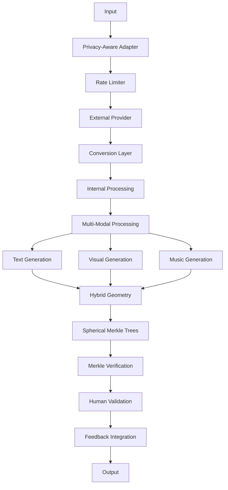

# 3.6.0. Machine System LLM Integration

The machine system LLM integration extends Memorativa's core LLM architecture to support multi-modal processing, cross-modal aspects, and temporal states. This design enables rich integration with external LLM services while maintaining privacy, security, and the system's hybrid geometric structures.

## Core Architecture

The system provides both internal processing and external interfaces for Large Language Models (LLMs), with support for:

- Multi-modal content processing
- Cross-modal aspect relationships
- Temporal states
- Privacy-aware operations
- Hybrid geometric structures
- Human-in-the-loop validation (aligning with the cybernetic system in Section 2.1)
- Percept-Triplet processing implementation (implementing the model from Section 2.4)
- Bidirectional translation interface (bridging human interior world and machine conceptual space)
- RAG (Retrieval-Augmented Generation) system integration (aligning with the MST in Section 2.5)



## External Interfaces

The system offers external interfaces:

### 1. Provider Interface
```rust
pub trait LLMProvider {
    // Core interaction methods
    async fn generate_text(&self, prompt: &str) -> Result<String>;
    async fn generate_embeddings(&self, text: &str) -> Result<Vec<f32>>;
    
    // Optional capabilities
    fn supports_streaming(&self) -> bool;
    fn max_context_length(&self) -> usize;
    fn embedding_dimensions(&self) -> usize;
}

// Example implementation
pub struct OpenAIProvider {
    client: OpenAIClient,
    config: ProviderConfig,
    
    async fn generate_text(&self, prompt: &str) -> Result<String> {
        // Implementation for text generation
        self.client.generate_text(prompt).await
    }
    
    async fn generate_embeddings(&self, text: &str) -> Result<Vec<f32>> {
        // Implementation for embedding generation
        self.client.generate_embeddings(text).await
    }
    
    fn supports_streaming(&self) -> bool {
        self.config.streaming_enabled
    }
    
    fn max_context_length(&self) -> usize {
        self.config.max_context_length
    }
    
    fn embedding_dimensions(&self) -> usize {
        self.config.embedding_dimensions
    }
}
```

### 2. Privacy-Aware Adapter
```rust
pub struct LLMAdapter {
    provider: Box<dyn LLMProvider>,
    privacy_filter: PrivacyFilter,
    token_manager: GasTokenManager,
    
    async fn process_external(
        &self,
        input: ExternalInput,
        privacy_level: PrivacyLevel
    ) -> Result<ProcessedOutput> {
        // Verify gas tokens
        self.token_manager.verify_operation(Operation::ExternalLLM)?;
        
        // Apply privacy filtering
        let filtered = self.privacy_filter.filter_for_external(input)?;
        
        // Process through external LLM based on privacy level
        let response = match privacy_level {
            PrivacyLevel::Public => {
                self.provider.generate_text(&filtered.prompt).await?
            },
            _ => return Err(Error::PrivacyLevelNotSupported)
        };
        
        // Convert to internal format
        self.convert_to_internal_format(response)
    }
}
```

### 3. Conversion Layer
```rust
pub struct FormatConverter {
    spatial_encoder: HybridSpatialEncoder,
    temporal_processor: TemporalProcessor,
    cross_modal_analyzer: CrossModalAnalyzer,
    
    fn to_external_format(
        &self,
        internal: InternalFormat
    ) -> Result<ExternalFormat> {
        // Strip internal geometric structures while preserving meaning
        let simplified = self.simplify_geometry(internal)?;
        
        // Convert to provider-specific format
        self.format_for_provider(simplified)
    }
    
    fn to_internal_format(
        &self,
        external: ExternalFormat
    ) -> Result<InternalFormat> {
        // Project into hybrid space
        let coords = self.spatial_encoder.project_to_hybrid_space(external)?;
        
        // Process temporal states
        let temporal = self.temporal_processor
            .process_state(external.temporal)?;
            
        // Analyze cross-modal aspects
        let aspects = self.cross_modal_analyzer
            .analyze_relationships(external)?;
            
        // Add internal metadata
        InternalFormat::new(
            coords,
            temporal,
            aspects,
            PrivacyLevel::Public,
            VerificationScore::External
        )
    }
}
```

### 4. Rate Limiting & Cost Management
```rust
pub struct ExternalLLMManager {
    rate_limiter: RateLimiter,
    cost_tracker: CostTracker,
    gas_manager: GasTokenManager,
    
    async fn process_request(
        &self,
        request: ExternalRequest
    ) -> Result<ProcessedResponse> {
        // Check rate limits
        self.rate_limiter.check_limits(request.provider)?;
        
        // Estimate costs
        let estimated_cost = self.cost_tracker
            .estimate_cost(request.size, request.provider)?;
            
        // Verify sufficient gas
        self.gas_manager.verify_gas_for_external(estimated_cost)?;
        
        // Process request
        let response = self.process_with_provider(request).await?;
        
        // Track actual costs
        self.cost_tracker.record_usage(
            request.provider,
            response.tokens_used
        )?;
        
        Ok(response)
    }
}
```
